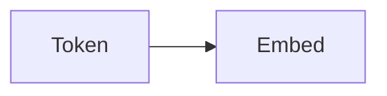

# Lesson Format Spec — Stanford Frontier AI Learning System

Every lesson is a Markdown file with YAML frontmatter. The build script renders it into the site template.

## Frontmatter

```yaml
---
page_id: cs336-l01            # unique id, used for progress tracking
course_slug: cs336
course_name: "CS336: Language Modeling from Scratch"
course_order: 1              # course order within the repo
order: 1                     # lesson order within the course
nav: "L01 · Overview, Tokenization"   # short sidebar label
title: "Lecture 1: Overview, Tokenization"
summary: "One or two sentences on what this lesson covers."
date: "2026-03-30"
instructor: "Percy Liang"
offering: "Spring 2026"
duration: "1:19:22"
video_id: JuoVZkPBiKk        # YouTube id; embeds the video at the top
video_title: "Stanford CS336 Spring 2026 Lecture 1: Overview, Tokenization"
video_caption: "Original lecture. Timestamps link to exact moments."
concepts: [tokenization, BPE]   # for search/cross-linking
papers: []                      # assigned papers discussed
sources:
  - tag: video
    label: "Lecture 1 video, Stanford Online YouTube"
    url: https://www.youtube.com/watch?v=JuoVZkPBiKk
  - tag: slides
    label: "lecture_01.py (executable lecture code)"
    url: https://cs336.stanford.edu/lectures/?trace=lecture_01
  - tag: notes
    label: "Official subtitle transcript (en-orig)"
---
```

Source tags: `video`, `slides`, `notes`, `paper`, `code`, `assignment`, `supplement`, `synthesis`, `inference`.
Use `synthesis` when you merge sources, `inference` when you state something not directly in a source. Never invent professor quotes.

## Writing rules (ASD-STE100)

- Short, direct sentences. One meaning per sentence.
- Active voice when possible.
- Keep the technical terms the course uses. Define each term at first use.
- NO em dashes anywhere. Use commas or periods instead.
- NO contractions (do not, cannot, will not).
- No semicolons.
- No banned filler: delve, leverage, robust, seamless, nuanced, pivotal, landscape, realm, tapestry, groundbreaking, cutting-edge, holistic, multifaceted, "it is important to note", "in today's world", "let's break it down".
- No generic intros ("In this lesson we will…"). Start with substance.
- No "why this matters" blocks. No motivational filler.
- Compress ruthlessly. Every paragraph must carry information.

## Structure

- Do NOT use a fixed template. Let the lecture's natural flow decide.
- Typical lesson: 1500-3500 words. Dense lectures (parallelism, scaling laws) can run longer.
- Aim for a useful visual after every 1-2 paragraphs of text. A visual can be: mermaid diagram, table, equation, code block, figure.
- End with the Sources box (from frontmatter). No summary section unless the lecture itself summarizes.

## Elements

Timestamps: `[12:34](ts:12:34)` renders as a link to that exact video moment. Use for key explanations, derivations, caveats.

Callouts (use sparingly, only when the content earns it):
```
> [!KEY] One or two sentences on the single most important takeaway.
> [!PROF] Something the professor said that slides omit (paraphrase, never invent quotes).
> [!CAVEAT] A caveat or failure mode from the lecture.
> [!INTERVIEW] Why this matters for frontier-lab interviews.
> [!PAPER] Paper connection.
> [!WARN] Common misunderstanding.
```

Mermaid diagrams:
````markdown

````

Equations: inline `\(x^2\)`, display `\[ \sum_i x_i \]`. Rendered by KaTeX.

Code: Python. Clean, minimal, commented only where logic is non-obvious. Prefer the official lecture code, simplified.

Figures: `` — caption is required.

Cross-course links: link to the canonical concept page when it exists, e.g. `[attention](../../concepts/attention.html)`. When a concept was taught in an earlier course in this system, write "As taught in [CS229 Lesson 4](../cs229/l04.html), …" and do NOT re-explain it. Explain only what is new here.

## Source fidelity

- The lecture subtitles are the primary source. Map every major section to what the professor actually said.
- Slides are the primary visual source. Reference slide content; do not copy full slide decks.
- When slides and lecture disagree, say so explicitly.
- Assignments: include an "Assignment connection" note where the lecture feeds an assignment.
- Papers: name the paper, state the one result the lecture uses, link it.
- If a fact is uncertain or the source is ambiguous, label it `[uncertain]` inline.
