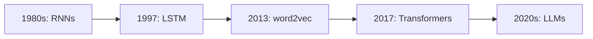
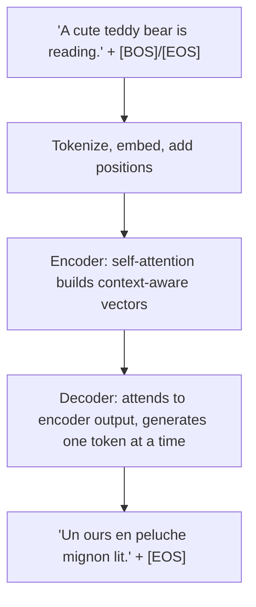

> [!KEY] This lecture compresses the entire pre-transformer NLP story into one sitting, then walks the full transformer end to end on a translation example.

## The course

CME295 has two goals: understand how transformers work and how they relate to LLMs, then learn how LLMs are trained and used. Two units, Friday afternoons. Grading is two exams: a midterm (50%) and a final (50%). The companion textbook is the Amidis' Super Study Guide.

This lesson is a bridge. Every topic here is taught in depth elsewhere in this system: NLP foundations in [CS224N](../cs224n/index.html), the transformer itself in [CS336 L04](../../foundations/cs336/l04-attention-alternatives-moe.html). What is new here is the compressed arc and the end-to-end example.

## The NLP task zoo

The lecture organizes NLP into three task families:

- **Classification.** Input text, out a label. Sentiment extraction, intent detection, language detection, topic modeling. Metrics: accuracy, precision, recall, F1.
- **Multi-classification.** A label per token. Part-of-speech tagging, named entity recognition, dependency parsing. Datasets like CoNLL-2003.
- **Generation.** In text, out text. Machine translation, question answering, summarization. Metrics: BLEU (precision-like), ROUGE (recall-like), perplexity (how surprised the model is).

## The timeline

The lecture's high-level timeline, worth memorizing:

Theoretical foundations first, then data and compute unlocked fast iteration.

## The compressed arc

Each stop gets a few slides, with the running example "A cute teddy bear is reading.":

1. **Tokenization.** Text becomes tokens. The lecture's example keeps it simple; the BPE machinery is [CS336 L01](../../foundations/cs336/l01-overview-tokenization.html).
2. **Word representation.** One-hot vectors give way to word2vec: predict the next word, learn dense vectors. Full treatment in [CS224N L01-L02](../cs224n/l01-word-vectors-1.html).
3. **RNNs and LSTMs.** Process tokens in sequence, carry a hidden state. The vanishing gradient problem motivates LSTMs. Full treatment in [CS224N L05](../cs224n/l05-rnns.html).
4. **Attention.** Let the decoder look back at all encoder states with learned weights. Full treatment in [CS224N L06-L07](../cs224n/l06-seq2seq-attention.html).
5. **The transformer.** Self-attention, multi-head, encoder and decoder stacks, positional information. Full treatment in [CS336 L04](../../foundations/cs336/l04-attention-alternatives-moe.html).

## The end-to-end example

The lecture's signature piece stitches everything together on English-to-French translation:

The encoder reads the whole English sentence into context-aware embeddings. The decoder starts from [BOS], attends to the encoder output through cross-attention, and emits one French token at a time until [EOS]. The slides walk this token by token: [BOS] → "Un" → "Un ours en peluche" → the full sentence.

## Abbreviations

The lecture opens with a wall of abbreviations and promises each will be defined by course end: BERT, RLHF, ROUGE, LSTM, RAG, DPO, BPE, SFT, PPO, LaaJ (LLM-as-a-judge), and more. Treat this lesson as the map; the definitions arrive in Lessons 2 through 8.

> [!INTERVIEW] This lecture is the 90-minute version of "tell me the history of NLP." The timeline (RNN → LSTM → word2vec → transformer → LLM) plus the task/metric taxonomy (classification vs generation, BLEU/ROUGE/perplexity) is exactly the framing interviewers expect before any deep dive.
