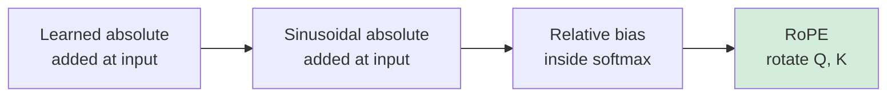
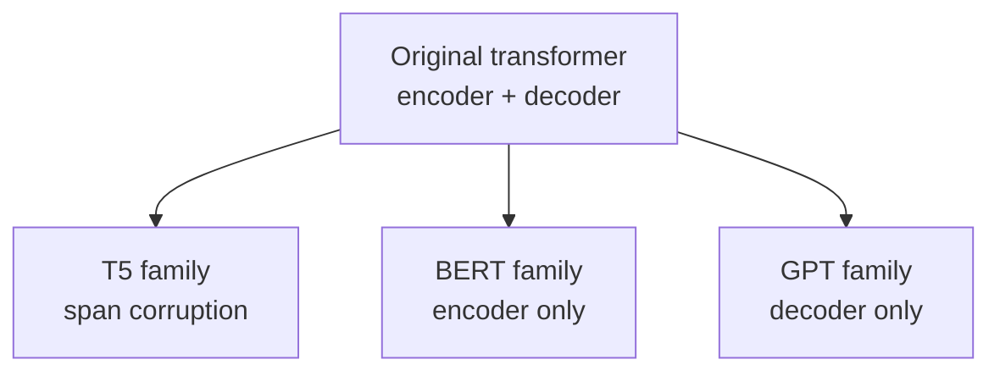

Lecture 1 built the transformer. Lecture 2 asks what survived. The 2017 architecture is still the skeleton of every modern model, but three components changed: position information, normalization, and attention itself. Then the lecture tours the model families that grew from the skeleton.

The self-attention formula from Lecture 1 is assumed known: \(\text{softmax}(QK^T/\sqrt{d_k})V\), computed with one projection matrix per head per Q, K, V, concatenated and projected. The mechanics are taught in [CS336 L04](../../foundations/cs336/l04-attention-alternatives-moe.html). What is new here is the Amidi walkthrough of each head as a learned projection, visualized through attention maps: in "Attention Is All You Need", the query for *its* attends most strongly to the keys for *law* and *application*, exactly the coreference a reader would resolve [04:46](ts:04:46).

## Position embeddings: from addition to rotation

Self-attention lets every token interact with every other token directly. Unlike an RNN, nothing is processed before anything else, so position information is lost. It must be injected back [10:44](ts:10:44).

The original paper tried two methods. Method one: a learned embedding per position, added to the token embedding. Position 1 gets one vector, position 2 another, all learned by gradient descent. Two limitations. The learned vectors absorb biases of the training set, and no embedding exists for positions beyond the longest training sequence [13:06](ts:13:06).

Method two: a fixed sinusoidal formula. For position \(m\) and dimension pair \(i\):

\[ PE_{(m,2i)} = \sin(\omega_i m), \quad PE_{(m,2i+1)} = \cos(\omega_i m), \quad \omega_i = 10000^{-2i/d_{model}} \]

The lecture derives why this works [18:46](ts:18:46). The dot product of the embeddings at positions \(m\) and \(n\) expands, via the identity \(\cos(a-b) = \cos a \cos b + \sin a \sin b\), into a sum of cosines of \(\omega_i(m-n)\). The similarity is a function of relative distance only, and it is maximal when \(m = n\). Low dimensions oscillate fast, high dimensions slow, because \(\omega_i\) shrinks with \(i\). The decisive advantage: it extends to any sequence length, never seen or not [25:10](ts:25:10).

Modern models moved the position signal from the input into the attention layer itself, because similarity is quantified inside the softmax [26:55](ts:26:55). Three approaches:

| Method | Idea | Source |
|---|---|---|
| T5 relative bias | Learn a bias per distance bucket \((m-n)\), add inside softmax | Raffel et al., 2019 |
| ALiBi | Fixed linear penalty proportional to distance, no learned parameters | "Train Short, Test Long", 2021 |
| RoPE | Rotate Q by \(\theta(m)\) and K by \(\theta(n)\). The dot product becomes a function of \(n-m\) | Su et al., 2021 |

RoPE, Rotary Position Embedding, is the default choice today [37:26](ts:37:26). The lecture builds the intuition from scratch: a 2x2 rotation matrix rotates a vector by angle \(\theta\), and in \(d\) dimensions the method applies one rotation per 2D block with frequencies \(\theta_i \approx \omega_i\). The RoFormer paper proves the attention weight has a long-term decaying upper bound in \(|n-m|\), which is exactly the desired bias toward nearby tokens [39:48](ts:39:48).

## Normalization: post-norm to pre-norm to RMSNorm

The transformer block ends each sublayer with "add and norm": add the sublayer input to its output, then normalize [44:02](ts:44:02). Normalization rescales each activation vector by its mean and standard deviation, then applies learned scale \(\gamma\) and shift \(\beta\). The intuition is internal covariate shift: activations swing across wide ranges from layer to layer, and the optimizer struggles when they do [49:11](ts:49:11).

Two changes since 2017. First, position: the original paper normalized after the residual addition (post-norm). Modern models normalize before the sublayer (pre-norm), which trains more stably [46:04](ts:46:04). Second, formula: LayerNorm is largely replaced by RMSNorm, which divides by the root mean square only and learns just \(\gamma\). Comparable convergence, fewer parameters [47:00](ts:47:00).

A student asked why not BatchNorm. BatchNorm normalizes across the batch dimension, which couples training examples and creates a train/inference mismatch. LayerNorm normalizes across features of one example, which is self-contained [49:28](ts:49:28).

## Attention variations: cheaper and leaner

Full self-attention costs \(O(n^2)\) in sequence length. Longformer (2020) restricts each token to a neighborhood: sliding-window attention. Modern models interleave local and global layers, and stacking local layers grows an effective receptive field, the same concept as in CNNs. Mistral uses sliding windows at every layer [53:12](ts:53:12).

The second variation shares key and value projections across heads [55:51](ts:55:51):

- **MHA**: every head has its own Q, K, V projections. The 2017 default.
- **MQA** (multi-query): all heads share one K and one V projection.
- **GQA** (grouped-query): \(g\) groups share K, V projections.

Why share K and V but not Q? During decoding, keys and values of all past tokens are recomputed at every step unless cached, the KV cache of Lecture 3. Sharing projections shrinks that cache directly [57:18](ts:57:18). GQA is the common compromise in recent models [62:21](ts:62:21).

## The model zoo: three architectures

Shervine Amidi then maps every transformer variant to one of three skeletons [63:05](ts:63:05).

**Encoder-decoder.** The full 2017 architecture, kept alive by the T5 family: T5 (Transfer Text-to-Text Transformer), mT5 (multilingual data and vocabulary), ByT5 (byte-level, vocabulary of 256, no tokenizer). T5 replaced next-token prediction with span corruption: mask spans of the input, mark them with sentinel tokens, and train the decoder to reconstruct each span [65:15](ts:65:15). CS224N covers this family from the NLP side in [CS224N L09](../cs224n/l09-pretraining.html).

**Encoder-only.** Drop the decoder and generation becomes impossible, but the encoder's unmasked self-attention gives every token a representation of the full context. BERT, Bidirectional Encoder Representations from Transformers, is the canonical example [71:45](ts:71:45). Its recipe:

- **Input**: WordPiece tokens (~30k vocabulary) plus [CLS] at the start, [SEP] between sentences, [PAD] for batching. Token, position, and segment embeddings added together. Segment A marks sentence one, segment B sentence two.
- **Pretraining**: masked language modeling (mask 15% of tokens, and of those, 80% become [MASK], 10% stay, 10% randomize) plus next-sentence prediction (are A and B consecutive, 50/50) [89:02](ts:89:02).
- **Fine-tuning**: attach a linear head to the [CLS] output for classification, or per-token heads for span tasks like question answering. Freeze the encoder or retrain everything, depending on data and task distance.

Two limitations drove the variants. BERT-base has 110M parameters and a 512-token context, and the MLM+NSP recipe was questioned. DistilBERT used knowledge distillation (Hinton et al.): train a smaller student to match the teacher's soft output distribution via KL divergence, halving the layers with little performance loss [103:41](ts:103:41). RoBERTa showed NSP adds nothing, dropped it, masked dynamically per epoch, and trained on far more data [106:27](ts:106:27).

**Decoder-only.** Remove the encoder and the cross-attention, keep masked self-attention plus FFN. Compute goes into next-word prediction, the simplest scalable objective, and it aligned perfectly with the chatbot era. Over 90% of modern LLMs are decoder-only [70:57](ts:70:57). This is where Lecture 3 begins.

> [!INTERVIEW] Expect "why RoPE instead of learned positions" and "MQA vs GQA vs MHA, and why share K/V". The answers are one sentence each. RoPE gives relative-distance bias with no length limit. Sharing K/V shrinks the KV cache at decode time. BERT questions still appear in NLP-heavy loops: MLM 80/10/10, the [CLS] convention, and why RoBERTa dropped NSP.
