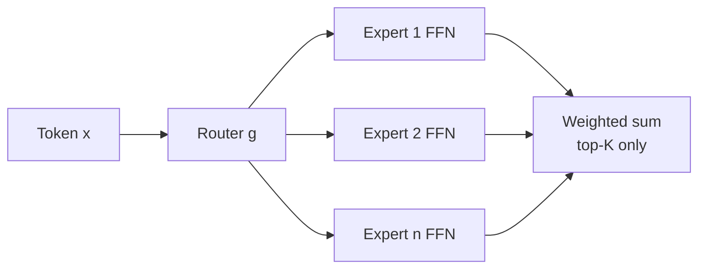
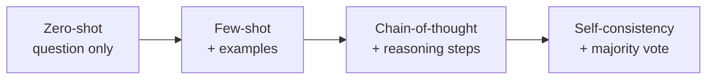

An LLM is a language model that is large in three independent senses [03:46](ts:03:46). A language model assigns probabilities to token sequences, predicting the next token. Large means: parameters in the hundreds of billions (at least a billion to qualify), training data in the hundreds of billions to tens of trillions of tokens, and compute in the many-GPU regime. The term itself is young. In 2018 nobody said "LLM", and by the current definition BERT does not qualify because it generates no text [05:51](ts:05:51).

The backbone is the decoder-only transformer from Lecture 2: encoder removed, cross-attention removed, masked self-attention plus FFN plus normalization. GPT, Llama, Gemma, DeepSeek, Mistral all follow it [06:41](ts:06:41). Deep MoE mechanics are taught in [CS336 L04](../../foundations/cs336/l04-attention-alternatives-moe.html); this lesson keeps the Amidi treatment.

## Mixture of experts: ask only the mathematician

A dense model activates every parameter for every token. The lecture's metaphor: you walk into a room with a mathematician, a physicist, a chemist, and a historian, and you have a math question. Asking everyone is wasteful. Ask the mathematician [08:19](ts:08:19).

Formally, with \(n\) experts \(E_i\) and a gating network \(g\) (also called the router):

\[ \hat{y} = \sum_{i=1}^{n} g_i(x) \, E_i(x) \]

Two regimes [12:45](ts:12:45). A **dense MoE** weights all experts, \(g_i(x)\) forming a distribution. A **sparse MoE** activates only the top-\(K\) experts, typically \(K = 1\) or \(2\), and the sum runs over those. Sparse is the point: fewer FLOPs per forward pass for the same parameter count.

Where do the experts live? The FFN holds most of a transformer's parameters (order \(d_{model} \times d_{ff}\), with \(d_{ff}\) several times \(d_{model}\)), far more than the attention projections. So each expert is an FFN, replacing the single FFN of a decoder block, with routing done per token [16:04](ts:16:04).

The failure mode is routing collapse: the router sends every token to the same one or two experts and the rest atrophy [21:13](ts:21:13). The fix is a load-balancing term added to the loss, \(\alpha \cdot n \sum_i f_i p_i\), where \(f_i\) is the fraction of tokens routed to expert \(i\) and \(p_i\) its average routing probability. It pushes usage toward uniform across experts [21:37](ts:21:37).

Training the router and experts is joint: one forward pass, one loss, one backward pass. Nothing about MoE changes the training loop. The router is just another differentiable module whose gradients flow from the same objective [11:39](ts:11:39).

A detail from the Q&A: the experts are not shared across layers. Each decoder block has its own set of experts and its own router, so routing decisions are made fresh at every layer for every token [35:08](ts:35:08).

## Decoding: from greedy to beam search

Next-token prediction outputs a distribution. The simplest choice is greedy decoding: take the argmax at each step [41:11](ts:41:11). It is fast and myopic; one locally optimal token can doom the sequence.

Beam search keeps \(B\) candidate sequences alive, expanding each and pruning to the top \(B\) by cumulative probability [45:14](ts:45:14). Its known bias: shorter sequences score higher because probabilities multiply, so the search favors brevity unless corrected with length normalization.

## Sampling: temperature, top-k, top-p

Instead of maximizing, sample from the distribution, reshaped first. Temperature \(T\) divides the logits before softmax [55:22](ts:55:22):

- \(T \to 0\): the distribution sharpens toward the argmax. Deterministic, factual, boring.
- \(T = 1\): the model's raw distribution.
- \(T\) high: the distribution flattens toward uniform. Creative, incoherent.

Two truncation tricks cut off the tail before sampling. Top-\(k\) keeps only the \(k\) most likely tokens. Top-\(p\) (nucleus sampling) keeps the smallest set whose cumulative probability reaches \(p\) [50:02](ts:50:02). Both are routinely combined with temperature.

> [!CAVEAT] Temperature zero does not guarantee determinism. The lecture cites recent work on defeating non-determinism in LMs: floating-point summation order across parallel hardware can still flip the argmax between runs [64:00](ts:64:00). Bitwise reproducibility needs pinned hardware and kernels, not just \(T = 0\).

When the output must obey a format, say JSON, guided decoding constrains generation to a finite-state machine over valid tokens, guaranteeing syntactic validity by construction [65:41](ts:65:41).

## Context length and prompting

Modern context windows reach tens of thousands of tokens, but length is not free: attention cost grows with it, and models exhibit the "lost in the middle" effect, burying the answer in long inputs degrades retrieval of it [69:33](ts:69:33). More context is not automatically better. The lecture's guidance: long context helps when the task genuinely needs the full document, and hurts through distraction and cost when it does not [69:00](ts:69:00).

The lecture groups every inference optimization into two families [slide 89]. Exact methods remove redundancy without changing the math: KV caching, memory management, reformulating the computation. Approximations change the model or the math: architectural changes like GQA and MLA, compressed representations, and predicting several tokens at once. The first family is free accuracy-wise. The second trades accuracy for speed, and each trick needs its own evaluation.

The lecture decomposes a prompt into three parts [72:01](ts:72:01): the **context** (background the model needs), the **task** (what to produce), and **constraints** (format, tone, hidden system instructions the user never sees).

In-context learning, Brown et al. 2020, is the observation that examples in the prompt teach the task without weight updates [75:14](ts:75:14). Zero-shot asks bare. Few-shot adds input/output pairs, which usually performs better at the cost of tokens and latency. Chain-of-thought, Wei et al. 2022, adds reasoning steps to the examples; the model then reasons before answering, gaining accuracy and interpretability for more tokens [80:00](ts:80:00). Self-consistency, Wang et al. 2022, samples several reasoning paths and takes the majority answer, trading compute for accuracy [82:16](ts:82:16).

## Inference optimizations

Generating token \(t+1\) recomputes keys and values for tokens \(1..t\) unless they are cached. The KV cache stores them, turning each decode step from quadratic recomputation into a linear read [89:04](ts:89:04). (During training, teacher forcing feeds all inputs at once, so no cache is needed [90:01](ts:90:01).) The cache is also the reason Lecture 2's GQA matters: fewer KV projections mean a smaller cache.

Three further tricks from the slides:

- **MLA, multi-head latent attention** (DeepSeek-V2): store compressed latent representations of K and V instead of the full matrices, shrinking cache memory [97:12](ts:97:12).
- **Speculative decoding** (Chen et al., 2023): a small draft model proposes tokens, the large target model validates them in parallel. Accepted tokens cost a fraction of a full forward pass [101:37](ts:101:37).
- **MTP, multi-token prediction** (Gloeckle et al., 2024): train \(k\) extra prediction heads so the model emits several future tokens per step [slide 121].

Decoding and KV-cache mechanics are covered in depth in [CS336 L10](../../foundations/cs336/l10-inference.html).

> [!INTERVIEW] The MoE questions that recur: dense vs sparse, where experts sit (the FFN, because that is where the parameters are), and routing collapse with the load-balancing fix. On sampling: state the temperature intuition precisely, and know that top-\(p\) adapts the cutoff to the distribution while top-\(k\) is fixed. Self-consistency is a cheap "reasoning upgrade" to mention when asked how to improve CoT without retraining.
