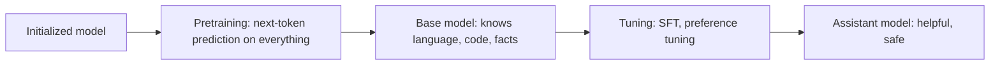
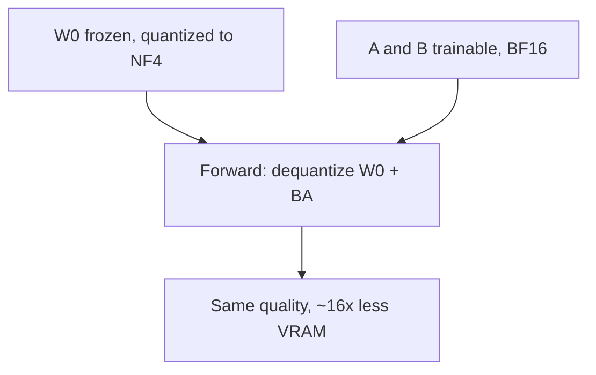

This is a bridge lesson. [CS336 Lesson 9](../../foundations/cs336/l09-scaling-laws-1.html) covers scaling laws and pretraining data in depth, and [CS229S](../../foundations/cs229s/l06-parallelism-fundamentals.html) covers distributed training systems. This lesson follows the Amidi framing: the paradigm shift, the orders of magnitude, and the practical training stack from pretraining through LoRA.

## The paradigm shift

Ten years ago, each task got its own model. Spam detection meant training a spam model: train set, validation set, test set. Sentiment extraction meant training another model from scratch. [07:53](ts:07:53)

Those tasks are not disjoint. They all involve understanding text. Transfer learning reuses what one training run learned for another task: start from a pretrained model, tune it for your task instead of starting from scratch. [08:52](ts:08:52)

LLM training is this paradigm at full scale. Two stages:

1. **Pretraining.** Train on vast data to understand language and code.
2. **Tuning.** Adapt the weights to a specific task or to being helpful.

## Pretraining

Pretraining is by far the most expensive part of training, in compute and in cost. It takes a huge amount of data and trains the LLM to predict the next token. [10:39](ts:10:39)

The data is everything you can find: English text, other languages, code in many languages, essentially the whole internet. Common Crawl appears in nearly every paper: about three billion pages per month, archived. Wikipedia, Reddit conversations, GitHub, Stack Overflow. The goal is for the model to absorb the structure of language and code. [12:01](ts:12:01)

Scale, in tokens: hundreds of billions to tens of trillions. GPT-3 trained on 300 billion tokens. Llama 3 trained on 15 trillion. [12:57](ts:12:57)

Two notations the field uses constantly:

- **FLOPs** (floating point operations): a unit of compute. Training an LLM is on the order of 10^25 FLOPs. Think of it as a function of tokens times parameters, roughly O of the product. MoE models need less per parameter because only some experts activate.
- **FLOPS** (floating point operations per second): a measure of hardware speed. GPU spec sheets quote FLOPS. All caps by convention, though papers sometimes swap the two, so read the sentence, not just the acronym. [13:33](ts:13:33)

## Scaling laws

"Scaling Laws for Neural Language Models" (Kaplan et al., 2020) varied model size and dataset size and found a clean pattern: more compute, more data, bigger model, better next-token prediction. Bigger models are also more sample efficient: for equal tokens processed, the bigger model performs better. [17:02](ts:17:02)

Between roughly 2019 and 2024, labs just built bigger and bigger models, because the curves said performance kept improving. [17:39](ts:17:39)

But compute is finite. The Chinchilla work (Hoffmann et al., 2022) fixed a compute budget and swept model size against training tokens, finding a sweet spot: about **20 tokens per parameter** is the compute-optimal ratio. GPT-3, at 175 billion parameters on 300 billion tokens, was badly undertrained by this rule. [19:23](ts:19:23)

> [!CAVEAT] Architecture barely matters for these curves. The Chinchilla authors report that tokens and model size dominate. Architecture barely matters for these curves, and everyone now uses decoder-only transformers anyway. But the optimal ratio is setup-specific: the Llama 3 paper reran this analysis for its own training setup rather than trusting the published number. [20:54](ts:20:54)

Challenges of pretraining: cost (millions at minimum, up to hundreds of millions of dollars), environmental impact, and the **knowledge cutoff date**. The model's knowledge stops at the date the dataset was cut. Model cards always list it. Editing knowledge after the fact is hard: there is no clean way to change weights without regressing other capabilities. And a model trained to predict the next token can reproduce training text verbatim, which is a plagiarism risk. [22:03](ts:22:03)

## The training loop and its memory bill

To train, you need three things: the model (decoder-only transformer, billions to hundreds of billions of parameters), the data, and hardware that loves matrix multiplication. GPUs, usually many of them. Google trains on its own TPUs. Nearly everyone else trains on GPUs. [25:19](ts:25:19)

One training step has three phases, and each one parks tensors in memory:

1. **Forward pass.** Data flows through the network. The **activations** (values at each layer) must be saved to compute the loss.
2. **Backward pass.** The **gradient** of the loss with respect to each parameter is computed. Gradients also live in memory.
3. **Weight update.** The optimizer (usually Adam, which keeps a first and second moment, moving averages of the gradient and squared gradient) applies the update. Those moments live in memory too. [27:03](ts:27:03)

Memory is not unlimited. An H100, a very good GPU, has 80 GB. That is tens of gigabytes for all of the above, and it is not enough. So training distributes the load across GPUs. [30:05](ts:30:05)

**Data parallelism** splits the batch across devices. Each device holds a full model copy, runs forward and backward independently, and the gradients are averaged across devices. This reduces the batch-size-linked memory. The costs: each device must still fit a whole model, and averaging gradients adds communication cost, which slows training. [31:08](ts:31:08)

**ZeRO** (zero redundancy optimizer) removes the duplication: each GPU stores the same parameters, gradients, and optimizer states, so shard them. ZeRO-1 shards optimizer states, ZeRO-2 adds gradients, ZeRO-3 adds parameters. Less memory per GPU, more communication. The right stage depends on model size and how much you care about training time. [33:38](ts:33:38)

**Model parallelism** parallelizes within one batch: expert parallelism puts different MoE experts on different devices, tensor parallelism splits big matrix multiplications, pipeline parallelism assigns different layer ranges to different GPUs. [35:49](ts:35:49)

> [!KEY] Training an LLM is a memory management problem first and a math problem second. Every technique in this section exists because 80 GB is not enough.

## FlashAttention

FlashAttention (Dao et al., 2022, developed at Stanford) attacks the attention bottleneck by exploiting GPU memory hierarchy. A GPU has two memories: **HBM**, big but slow (tens of gigabytes, a few TB/s), and **SRAM**, tiny but fast (tens of megabytes, tens of TB/s), sitting next to the compute. [38:39](ts:38:39)

Vanilla attention reads Q, K, V from HBM, multiplies, writes back to HBM, reads again for softmax, writes back, reads again with V, writes back. All that HBM traffic is the bottleneck, forced by softmax: each row must sum to 1, so you seem to need the whole row first. [42:06](ts:42:06)

The trick: softmax over a matrix equals softmax over its blocks, up to a per-row scaling factor (look at the softmax formula: the denominator is shared across the row). So **tile** the computation: send small blocks to SRAM, compute each block end to end, send results back to HBM. One HBM read instead of many. Exact, no approximation. [43:30](ts:43:30)

The paper's second idea targets the backward pass. Normally you store forward activations to reuse in backprop. Since attention recomputation is now fast, **recompute** the activations during the backward pass instead of storing them. You do more FLOPs but far fewer HBM reads and writes (about 10x fewer in the paper's numbers), and runtime drops too. Usually recomputation trades memory for time. Here you get both. [49:23](ts:49:23)

FlashAttention 2 and 3 adapt the same ideas to newer GPUs. The mechanics are covered in [CS336 Lesson 4](../../foundations/cs336/l04-attention-alternatives-moe.html).

## Quantization and mixed precision

Model weights are floating point numbers: bits for the sign, the exponent, and the mantissa (granularity). Common formats: FP64, FP32, FP16, BF16, each splitting the bits differently. FP16 uses half the memory of FP32 but is less precise. [53:15](ts:53:15)

Lower precision also runs faster. The lecture's H100 spec table shows compute speed rising as precision drops (FP64 at 34 TFLOPS, doubling as you go down). So the question: do you need all those decimal places? [55:21](ts:55:21)

**Mixed precision training** keeps weights in FP32 but runs forward and backward in FP16, with weight updates still in FP32. Intuition: the forward pass runs on noisy data, so ultra-precise activations buy little, but weights must stay precise or quantization errors accumulate across updates. The result: large memory savings and faster training with little performance loss. [56:09](ts:56:09)

There are also range-handling variants (zero-point and absmax quantization) for weights whose values span awkward ranges. Quantization mechanics in full are in [CS229S Lesson 5](../../foundations/cs229s/l05-memory-efficient-networks.html).

## From base model to assistant: SFT

Pretraining gives a great autocompleter, not a helpful assistant. Shervine's running example: ask a base model whether you can put a beloved teddy bear in the washer. Trained only on next-token prediction, it continues the text pattern, perhaps describing teddy bear materials. It does not answer the question. [62:33](ts:62:33)

**Supervised fine-tuning (SFT)** fixes this. Start from pretrained weights and train further on input-output pairs. The objective is still next-token prediction, but with a key difference: the input is fixed, and **the loss applies only to the output tokens**. The model is not trained to parrot the prompt. It learns the distribution of good responses conditioned on the input. [66:12](ts:66:12)

The SFT data mixture teaches helpfulness across categories: story writing, poem creation, list generation, explanation, assistant dialogues, math and proofs, high-quality code. Plus a **safety** subset: the model should be helpful but harmless, so it learns to refuse harmful prompts and to hedge instead of stating uncertain claims as fact. Originally this data was human-written by expert linguists. Now strong LLMs draft it and humans or other LLMs review it. [70:01](ts:70:01)

Scale contrast: GPT-3 used about 13K SFT examples. Llama 3 used 10 million. At roughly 1,000 tokens each, SFT data is **orders of magnitude smaller** than pretraining data, but far higher quality. Mental model: pretraining learns general language. SFT aligns the model's goals to your tasks. [77:43](ts:77:43)

After instruction tuning, the teddy bear question gets a helpful answer: hand wash it. [79:11](ts:79:11)

SFT challenges: high-quality data is expensive and human-intensive. The prompt distribution must match the deployment distribution or generalization suffers. And memorization means resampling the same prompt gives the same flavor but not the same words (at nonzero temperature). [80:14](ts:80:14)

## Evaluating fine-tuned models

Helpfulness is subjective, so the field built proxies. **Benchmarks** like MMLU (about 50 tasks, one reported score) and GSM-8K (grade-school math) give numbers, but there is a trap: a paper the lecture recommends shows that **training on the test task** (not the test set, the task) spikes scores without a clear capability gain. To compare models fairly, ensure parity in test-task training. [86:37](ts:86:37)

**Chatbot Arena** takes another approach: users vote on pairs of anonymous model responses, and pairwise comparisons produce a ranking of user preference. It has real problems: early-match noise makes rankings brittle, a paper showed the leaderboard can be rigged (models reveal themselves to "who are you"), users cannot judge factuality they do not know, preferences differ across populations (emoji lovers vs domain experts), and users penalize safety refusals. [91:11](ts:91:11)

No single number captures model value. Use the combination, matched to your use case. [95:54](ts:95:54)

> [!PROF] Between pretraining and fine-tuning, a newer stage is emerging: **mid-training**. Same pretraining objective, but the data mixture is steered toward the tasks you actually care about. The lecture flags it as a trend to watch rather than an established stage. [96:55](ts:96:55)

## LoRA and QLoRA

Full SFT updates every weight, which needs big GPUs. **LoRA** (Hu et al., 2021) freezes the pretrained weights W0 and learns a low-rank update: W = W0 + BA, where B and A have a small inner rank r (4 is a common choice) against weight dimensions in the hundreds or thousands. The forward pass runs through both terms and adds them. [98:00](ts:98:00)

The payoff: B and A are **task-specific and swappable**. One frozen base model plus a small spam-detection adapter, a sentiment adapter, a translation adapter. Originally the paper applied LoRA to attention matrices only. But recent guidance ("LoRA Without Regret", Schulman et al., 2025) finds the **feed-forward blocks** matter most. Today both get LoRA. [101:46](ts:101:46)

Two empirical training quirks, no clean theory: LoRA wants a **higher learning rate** than full fine-tuning (about 10x), and it **does poorly with large batch sizes**. The lecture presents both as observed facts. [102:44](ts:102:44)

**QLoRA** (Dettmers et al., 2023) stacks quantization on top: the frozen W0 is stored quantized in **NF4** (4-bit NormalFloat, which splits the weight range into quantiles assuming normally distributed weights, putting equal counts in each bin), while A and B train in BF16. A **double quantization** step quantizes the quantization constants themselves. On LLaMA 65B this gave about **16x VRAM savings** during fine-tuning, plus another 6% from double quantization, letting fine-tuning run on much smaller GPUs. [105:17](ts:105:17)

## The lifecycle

Pretraining builds basic knowledge of language and code. Fine-tuning (SFT, instruction tuning) makes the model useful for tasks. Preference tuning (next lecture) aligns it with human preferences so it does not misbehave. Together, the post-pretraining stages are what the field calls **alignment**. [96:29](ts:96:29)

> [!INTERVIEW] The numbers in this lecture are interview gold: 300B vs 15T tokens, 20 tokens per parameter, 10^25 FLOPs, 80 GB H100, 13K vs 10M SFT examples, 16x QLoRA savings. Know what each one measures and why it matters.

## Sources

- Video: [Lecture 4, Stanford Online YouTube](https://www.youtube.com/watch?v=VlA_jt_3Qc4)
- Slides: [fall25-cme295-lecture4.pdf](https://cme295.stanford.edu/slides/fall25-cme295-lecture4.pdf)
- Transcript: official YouTube subtitles
