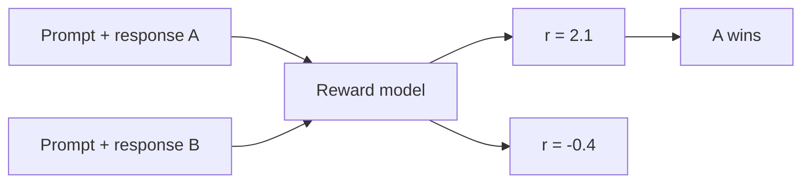
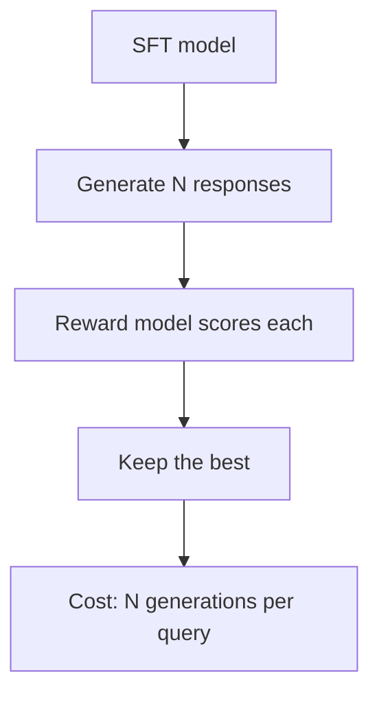

This is a bridge lesson. [CS336 Lesson 15](../../foundations/cs336/l15-post-training-sft-rlhf.html) covers PPO mechanics. [CS336 Lesson 16](../../foundations/cs336/l16-post-training-rlvr.html) covers GRPO and RLVR in depth. [CS224N Lesson 10](../../language/cs224n/l10-post-training.html) gives the DPO derivation from the NLP side. This lesson follows the CME295 arc: why SFT is not enough, the two-step RLHF recipe, and how DPO collapsed it into one supervised loss.

## Why SFT is not enough

After pretraining and SFT, the model follows instructions. But it may not follow them the way you want. Ask the SFT model to suggest a teddy bear activity and it might reply: do not spend much time with your teddy bear at all. That is an assistant-shaped response with the wrong content. Tone, safety, helpfulness: these need a third stage. [04:29](ts:04:29)

That stage is **preference tuning**: align the model with human preferences. Take the SFT model and tune the aspects humans care about but SFT data does not pin down. [05:00](ts:05:00)

The raw material is **preference pairs**. For a prompt, collect two responses: one you want (the winner) and one you do not (the loser). The teddy bear example pairs "do not spend time with your teddy bear" against a warm, helpful alternative. Everything that follows operates on such pairs. [05:38](ts:05:38)

## The RL formulation

Reinforcement learning in one paragraph: an agent is in a state, takes an action according to a **policy** πθ(a|s), the probability of taking action a in state s. For an LLM, the policy is simply the model's output distribution given the input: states are token prefixes, actions are next tokens. [19:11](ts:19:11)

Preference tuning via RL then has two steps:

1. Train a **reward model** that scores outputs.
2. Use reinforcement learning to tune the LLM against that reward model.

## Step 1: the reward model

Given preference pairs, how do you learn "how good is this response"? The **Bradley-Terry** formulation models the probability that response yw beats yl as a sigmoid of their reward difference:

\[ P(y_w \succ y_l \mid x) = \sigma(r(x, y_w) - r(x, y_l)) \]

Train the reward model to maximize the log of this probability over the preference dataset. Pairs are assumed independent. [29:54](ts:29:54)

A common confusion the lecture clears up: training is pairwise, but the resulting model is **pointwise**. At inference it takes one prompt and one response and outputs one scalar. That scalar is the learned stand-in for human preference. [38:46](ts:38:46)

## Step 2: PPO

**PPO** (proximal policy optimization) tunes the LLM to maximize reward while not drifting too far from the reference model, the SFT model you started from. The drift is measured by **KL divergence**, and the lecture pauses on a basic fact worth knowing cold: KL divergence is always non-negative, and zero if and only if the two distributions are equal, provable via Jensen's inequality. [54:09](ts:54:09)

The loss does not maximize raw reward. It maximizes **advantage**: how much better an output is than expected. A **value function** estimates that expectation, and the advantage is the gap between actual and expected reward. Using advantage instead of raw reward stabilizes training. [58:11](ts:58:11)

Two PPO flavors appear on the slides: **PPO-Clip**, which clips the policy update ratio, and **PPO-KL**, which puts the KL term directly in the objective as a penalty. Alternatives to PPO include REINFORCE and **GRPO** (group relative policy optimization, from DeepSeekMath, Shao et al., 2024), which the field now uses heavily for reasoning models. [54:09](ts:54:09)

The cost of the RL route is concrete: you hold **four models** in memory (policy, value function, reward model, frozen base model). Training is unstable, and the reward model is imperfect, which invites **reward hacking**: optimize a flawed proxy and the model exploits it. The lecture's example: if reward were applause volume, the optimal lecture would be a concert, not an informative talk. [74:37](ts:74:37)

## The Best-of-N workaround

If RL is too heavy, there is a simpler use of the reward model: **Best-of-N**. Generate N outputs from the SFT model, score each with the reward model, keep the best. No policy update at all. [83:00](ts:83:00)

It works, but it is costly at inference time: you pay for N generations on every query. It is a decoding-time trick, not a training method.

## DPO: the supervised shortcut

The complaints about RLHF pile up: a two-stage process, four models in memory, unstable training, no direct supervision. The DPO paper (Rafailov et al., 2023, "Direct Preference Optimization: Your Language Model is Secretly a Reward Model") asked: why not do this with supervision? [89:57](ts:89:57)

**DPO** optimizes a single loss directly on preference pairs. No reward model. The loss is a Bradley-Terry-style sigmoid over the difference between the winning and losing completions, where each "reward" is expressed through the policy itself: roughly, how much more likely the current policy makes the winner than the reference model does, minus the same for the loser. [92:28](ts:92:28)

Where the formula comes from, in the lecture's compressed derivation:

1. Start from the PPO objective: maximize reward minus β times KL from the reference model.
2. Solve for the **optimal policy** π* in closed form. It comes out as a function of the reward r (plus a partition function Z that just normalizes).
3. Rearrange to express **r as a function of π***. No new assumptions, just algebra.
4. Plug that expression into the Bradley-Terry preference probability. The reward terms become policy terms. The Z terms cancel.
5. Take the negative log. That is the DPO loss. [95:14](ts:95:14)

The β from the PPO objective survives as a hyperparameter, typically around **0.1**. It controls how strongly the policy is pulled to stay near the reference model. The only things to optimize are the policy weights. The preference pairs are inputs. [98:45](ts:98:45)

> [!KEY] DPO's insight: the optimal policy already encodes a reward function. You never need to learn the reward separately. The language model is secretly a reward model.

## PPO-based RLHF or DPO?

The lecture closes with the honest comparison, citing Xu et al., 2024 ("Is DPO Superior to PPO for LLM Alignment?"):

| | RLHF (PPO) | DPO |
|---|---|---|
| Training | Multi-stage | Supervised, single loss |
| Extra models | Reward model, value model, base model | Base model only |
| Supervision | Indirect, via sampled rollouts | Direct, on preference pairs |
| Performance | No consensus. Varies by task and implementation. | No consensus. Varies by task and implementation. |

There is no absolute winner. DPO is simpler to implement and far cheaper in memory. PPO keeps an edge in settings where online exploration matters. The lecture's verdict: know both, choose by task. [99:10](ts:99:10)

## The behavior arc

The teddy bear washer question, asked at each stage:

- **Pretrained model:** continues the text pattern, maybe describing teddy bear materials. Not an answer.
- **+ Instruction tuned:** answers helpfully. Hand wash it.
- **+ Preference tuned:** answers helpfully and warmly, in the tone a human prefers. [108:00](ts:108:00)

Pretraining, fine-tuning, preference tuning: together they are **alignment**.

> [!INTERVIEW] Expect to derive or sketch: the Bradley-Terry loss, why the reward model is pointwise at inference, the PPO objective with its KL term, the DPO trick of expressing reward through the policy, and the four-model memory cost of RLHF. The β ≈ 0.1 order of magnitude is a good detail to have ready.

## Sources

- Video: [Lecture 5, Stanford Online YouTube](https://www.youtube.com/watch?v=PmW_TMQ3l0I)
- Slides: [fall25-cme295-lecture5.pdf](https://cme295.stanford.edu/slides/fall25-cme295-lecture5.pdf)
- Transcript: official YouTube subtitles
