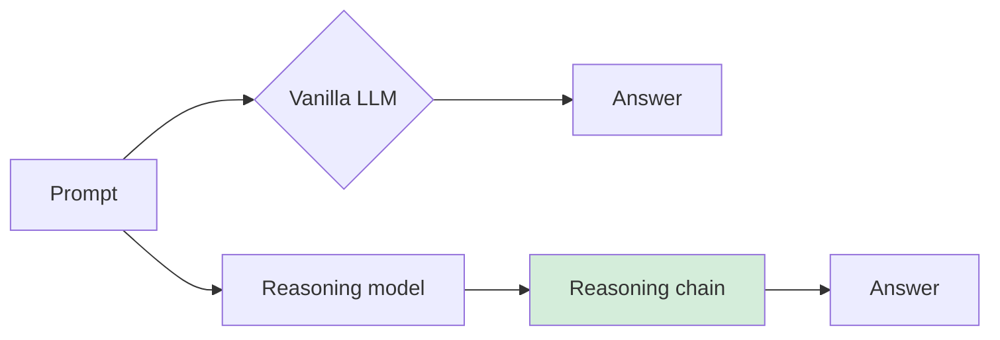
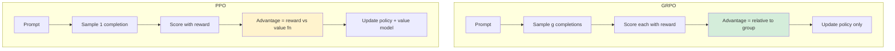

> [!KEY] A reasoning model is a vanilla LLM trained with RL to output a reasoning chain before its answer. The rewards are verifiable: format (think tokens present) plus correctness (tests pass, answer matches).

## Where we are

Lectures 4 and 5 built the training stack: pretraining (next-token prediction at scale), fine-tuning (SFT on curated data), preference tuning (RLHF with PPO). [00:49](ts:49) That stack produces what the lecture calls a vanilla LLM: prompt in, answer out.

Vanilla LLMs have four weaknesses. Limited reasoning: they get lost on hard math. Static knowledge: frozen at the cutoff date. All talk, no action: they cannot do anything in the world. Hard to evaluate: free-form text breaks BLEU and ROUGE. [08:51](ts:531) This lecture fixes the first. Lectures 7 and 8 fix the rest.

## What reasoning is

The lecture defines reasoning as the ability to solve a problem, typically a math or coding problem, through a multi-step process. A knowledge question ("what is the course code") is not reasoning. A math question is: you break it into steps and work through them. [13:55](ts:835)

A reasoning model takes a prompt and outputs a reasoning chain first, then the answer. The chain is the thinking; the answer follows it. [21:20](ts:1280)

The core idea is borrowed from chain-of-thought prompting (Wei et al., 2022): instead of a blanket answer, the model explains its steps. The lecture scales that idea from prompting to training. Two intuitions for why it works:

- A hard problem rarely appeared in training. Decomposing it into tractable subproblems lets the model rely on patterns it has seen.
- More generated tokens means more forward passes, which means more compute. The lecture calls this the compute budget: reasoning is test-time scaling. [20:29](ts:1229)

## The timeline

Reasoning models are new: roughly a year old at lecture time. OpenAI o1-preview (September 2024), then every lab racing to replicate it, Google Gemini 2.0 Flash Thinking (December 2024), then the DeepSeek-R1 paper (January 2025), which matched OpenAI's reasoning performance with a published method. [22:18](ts:1338)

A practical note on using these models: the "thinking" indicator in chat UIs is real (it marks reasoning-chain generation time), but the displayed summary is not the raw chain. The lecture hypothesizes three reasons: the raw chain may be unintelligible, users do not want pages of it, and exposing raw chains lets competitors distill from them. You are charged for reasoning tokens as output tokens, so there is an incentive to get maximum reasoning per token. [24:43](ts:1483)

## Benchmarks and the pass@k metric

Reasoning is measured on tasks with verifiable answers. Coding: HumanEval (100+ human-written problems), CodeForces, SWE-bench (real GitHub issues). Math: AIME (the US math olympiad qualifier), GSM8K (grade-school math). [28:05](ts:1685)

The standard metric is pass@k: the probability that at least one of k attempts succeeds (Chen et al., 2021). It matters because in coding you can check correctness, so generating more attempts and keeping the best is a legitimate strategy. [32:09](ts:1929)

The lecture derives the estimator. Generate n attempts, c succeed. The probability that a random subset of k contains at least one success equals 1 minus the probability that all k fail. Sampling without replacement:

\[ \text{pass@k} = 1 - \frac{\binom{n-c}{k}}{\binom{n}{k}} \]

pass@1 is the special case: the probability a single attempt succeeds. [44:34](ts:2674)

Temperature controls the diversity of the k samples. At T=0 there is no diversity and pass@k stays flat as k grows. At moderate temperature (0.8 in the lecture's example) diversity helps and pass@k rises. At T=1.2 the noise hurts. Papers report the temperature they used, because the number is meaningless without it. [45:21](ts:2721)

## Why RL, not SFT

Three facts argue against teaching reasoning with SFT from scratch:

1. SFT needs high-quality reasoning chains, which you would have to write by hand for hard problems.
2. The model's way of reasoning may differ from a human's, so human chains may not be the best teacher.
3. Reasoning tasks have natural verifiable rewards: code passes tests, math answers match ground truth. [49:52](ts:2992)

So the move is RL with two rewards: a format reward (did the model produce think tokens?) and an accuracy reward (is the solution correct?). Both are checkable without a learned reward model. R1-Zero's training curve shows AIME accuracy climbing with RL steps on just these two rewards. [53:17](ts:3197)

At inference time you may want to control how much the model thinks. Options: a classifier that routes easy prompts to short thinking (dynamic budget), context awareness (the model must not think past its context window), budget forcing from the S1 paper (inject "wait" tokens to keep thinking, or "time is up" to force an answer), and continuous thoughts (reasoning in hidden states instead of tokens). [54:40](ts:3280)

## GRPO: the algorithm

The RL algorithm is GRPO, Group Relative Policy Optimization (Shao et al., 2024), the go-to method for reasoning training. It does the same two things PPO does: maximize advantages, and keep the policy from deviating too far from the old policy and the base (SFT) model. The difference is how the advantage is computed. [58:37](ts:3517)

PPO estimates advantage with generalized advantage estimation, which needs a value function trained jointly with the policy. That joint training is the bottleneck. GRPO drops the value function entirely. For one prompt it samples a group of g completions, scores each with the reward, and sets the advantage of completion i relative to the group:

\[ A_i = \frac{r_i - \text{mean}(r)}{\text{std}(r)} \]

No value model. Just sample multiple times and compare each response against its siblings. The intuition: a correct answer to a hard problem deserves a bigger upweight than a correct answer to an easy one, and the group average captures problem difficulty automatically. [59:11](ts:3551)

The GRPO versus PPO comparison, point by point:

| | GRPO | PPO |
|---|---|---|
| Advantage from | Group-relative rewards, no value function | Reward plus learned value function (GAE) |
| Models trained | Policy only | Policy plus value model |
| Update rule | Policy ratio with clipping, same as PPO | Policy ratio with clipping |
| KL penalty | Explicit term in the objective against the reference model | Typically folded into the per-token rewards |
| Reward model in reasoning | None (verifiable rewards) | None (verifiable rewards) |

Both operate on the ratio of current to old policy probabilities, and both clip updates to a trust region. The lecture calls this the hardest technical part of the course and recommends rewatching. [74:23](ts:4463)

## The length-bias problem

A striking empirical fact: during RL training, response length keeps growing even after benchmark performance plateaus. The lecture traces this to the GRPO objective. It contains a 1/|o_i| factor, one over the output length, which normalizes each completion's contribution. A token in a short output gets a larger weight than the same token in a long output. [77:40](ts:4660)

With a negative advantage, that means tokens in short bad outputs get downweighted more than tokens in long bad outputs. The model learns to prefer long bad outputs over short bad ones, and length inflates. Two 2025 fixes: DAPO (March 2025) equalizes token-level contributions with a length-independent normalization, and Dr. GRPO ("GRPO Done Right") removes the factor entirely. With the fix, correct solutions keep their length but incorrect solutions get much shorter. [84:02](ts:5042)

Related adjustments the lecture mentions in passing: the standard deviation in the advantage formula biases toward easy problems (on hard problems most completions fail, so std is small), and the clipping epsilon can be made asymmetric so low-probability tokens are not unfairly constrained. [87:09](ts:5229)

## The DeepSeek-R1 recipe

Shervine's half of the lecture walks the R1 papers as the full pipeline. R1-Zero is the proof of concept: start from the V3 base model (pretrained, no SFT), apply RL with the two verifiable rewards (format plus accuracy) on reasoning data. Performance on AIME climbs with no supervision at all. But the chains have problems: mixed languages, poor readability. [90:03](ts:5403)

The full R1 pipeline fixes that in four stages:

1. **Cold-start SFT.** Take R1-Zero's chains, have humans rewrite them for format and language consistency, and SFT on those pairs. Small data, possibly orders of magnitude less than other stages.
2. **RL.** Same verifiable rewards as R1-Zero, plus a language-consistency reward (fraction of tokens in the target language).
3. **Large-scale SFT.** Mix reasoning and non-reasoning data 3:1. Reasoning data comes from rejection sampling: generate with the current model, keep only the good ones with a judge. Non-reasoning data (~200k pairs) is recycled from V3's instruction tuning.
4. **Final RL.** Reasoning rewards plus helpfulness and harmlessness rewards, with the harmlessness reward applied to the think tokens too, not just the visible answer. [96:07](ts:5767)

Results: R1 is competitive with closed-source reasoning models, and the distilled small models are competitive with o1-mini.

On distillation: the classic flavor fits a student to the teacher's full next-token distribution. Here there are no SFT pairs to start from, so the authors use a different flavor: generate responses (with thinking tokens) from R1 offline, then SFT the small model on the full sequences. At small scale this beats running RL from scratch. [103:25](ts:6205)

> [!INTERVIEW] Know the GRPO advantage formula and why it drops the value function: group-relative comparison needs no learned baseline, which removes PPO's most expensive component. Know the length-bias mechanism (the 1/|o_i| factor) and the DAPO/Dr. GRPO fixes. Know the R1 pipeline stages in order: cold-start SFT, RL, large SFT with rejection sampling, final RL with safety rewards.

## Sources

- Video: [Lecture 6: LLM Reasoning](https://www.youtube.com/watch?v=k5Fh-UgTuCo) (1:47:10)
- Slides: [fall25-cme295-lecture6.pdf](https://cme295.stanford.edu/slides/fall25-cme295-lecture6.pdf)
- Papers: DeepSeek-R1 (DeepSeek-AI, 2025). DeepSeekMath (Shao et al., 2024). "Evaluating Large Language Models Trained on Code" (Chen et al., 2021)
