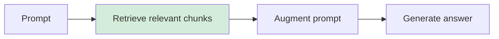
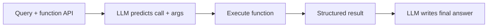

> [!KEY] RAG and tool calling attack the same weakness from two sides: the model's knowledge is frozen at training time. RAG fetches unstructured documents into the prompt. Tool calling executes structured functions and feeds the results back.

## The two goals

Last lecture fixed limited reasoning. This lecture fixes the other two weaknesses: static knowledge and all-talk-no-action. Goal one: connect the LLM to an ever-evolving knowledge base. Goal two: let the LLM perform actions. The first half is Afshine on RAG. The second is Shervine on tool calling and agents. [00:12](ts:12)

## Why not just retrain or stuff the context

Every model card lists a knowledge cutoff date. The lecture uses GPT-5: cutoff September 30, 2024, context window 400,000 tokens. Ask about anything after the cutoff and the base model cannot answer. [06:38](ts:398)

Three reasons the naive fixes fail:

1. **Retraining is avoided.** Changing an LLM's knowledge risks regressions elsewhere, and every fine-tuned downstream use case would need the same update. Maintenance overhead kills it.
2. **Context is finite.** Hundreds of thousands of tokens sounds large (roughly hundreds of pages at ~4 characters per token), but it is not enough to hold everything new.
3. **Irrelevant context hurts.** The needle-in-a-haystack test shows that stuffing a prompt with irrelevant text degrades performance. A GPT-4 heatmap over prompt length and fact position shows retrieval collapsing for long prompts, especially when the fact sits in the first half. Even with infinite context, the naive approach would fail.
4. **Tokens cost money.** LLM calls are priced per token (GPT-5 on the order of $1 per million input tokens). Bloating every prompt adds up. [07:57](ts:477)

So the clever approach: find only the relevant information and put that in the prompt. That is RAG.

## RAG: retrieve, augment, generate

RAG stands for Retrieval Augmented Generation. Three steps, and the name is the algorithm:

1. **Retrieve** relevant documents for the prompt.
2. **Augment** the prompt with them ("who won the election? By the way, here is what happened").
3. **Generate** the response from the augmented prompt. [16:28](ts:988)



The retrieval step is where RAG lives or dies, so the lecture spends most of its time there.

## Building the knowledge base

Collect the documents that may be useful, then split them into chunks: subsets of a document with a maximum length, typically on the order of hundreds of tokens (~500). Compute an embedding per chunk. Three hyperparameters to tune:

- **Embedding size.** Larger captures more nuance but costs storage and inference compute. Typically on the order of thousands (e.g. ~1,500).
- **Chunk size.** Too small and the text loses context. Too large and the embedding stops representing the content well. Typically ~500 tokens.
- **Overlap.** Chunks usually share a low-hundreds-of-tokens overlap so a chunk split mid-thought still makes sense.

You can use a pretrained embedding model (the usual choice) or train your own. [19:48](ts:1188)

## Two-stage retrieval

Retrieval runs in two stages, borrowed from search and recommendation systems:

- **Stage 1: candidate retrieval.** Filter millions of chunks down to ~100 potentially relevant candidates. Optimize for recall with a fast operation.
- **Stage 2: ranking (re-ranking).** Score the candidates precisely and keep the top k. Optimize for precision with a heavier model, affordable now that the set is small. [24:29](ts:1469)

Stage 1 uses embeddings. Encode the query, encode each chunk (a bi-encoder: the two pass through the encoder independently), and take the top matches by cosine similarity. At knowledge-base scale you use approximate nearest neighbor (ANN) indexes instead of a linear scan. The lecture recommends the Sentence-BERT paper: its loss pushes cosine similarity high for relevant pairs and low for irrelevant ones. [28:02](ts:1682)

Semantic search has a blind spot: it does not guarantee keyword overlap. The lecture's example: two teddy bears named Cuddly and Huggy. "Where is Cuddly?" needs documents containing the word Cuddly, but semantic search may return Huggy documents as "similar enough." BM25, a heuristic keyword-overlap score, guarantees the keywords appear. In practice people use a hybrid of embedding search and BM25. [34:44](ts:2084)

Two extensions improve stage 1. **HyDE** (Gao et al., 2022): queries are short questions while documents are long prose, so the same encoder produces incomparable embeddings. Instead, have an LLM generate a hypothetical document answering the query, then embed that. **Contextual retrieval**: prepend a short LLM-generated summary of the document to each chunk so it makes sense out of context. That costs one LLM call per chunk, but prompt caching makes it cheap: with a shared prefix you compute the activations once and look them up, and providers price cached input tokens at roughly 1/10th. [38:54](ts:2334)

Stage 2 uses a cross-encoder: query and chunk go through the encoder together, so attention captures their interaction, and the model outputs a relevance score. More meaningful than two independent embeddings, and affordable on ~100 candidates. [45:01](ts:2701)

## Retrieval metrics

You need labels (which chunks are actually relevant) and four metrics:

- **NDCG@k** (Normalized Discounted Cumulative Gain). Sum over the top k positions: relevance divided by a discount that grows with rank, so relevant documents score more at position 1 than position k. Normalize by the ideal DCG (the perfect ranking) so a perfect run scores 1.
- **MRR** (Mean Reciprocal Rank). One over the rank of the first relevant document. Simple, and correlates well with the fancier metrics.
- **Precision@k / Recall@k.** The classification metrics applied to the top k. Of the selected chunks, how many are relevant. Of all relevant chunks, how many were selected. [48:02](ts:2882)

To compare retrievers, evaluate on MTEB (Massive Text Embedding Benchmark) and compare these metrics across solutions.

## Tool calling

RAG handles unstructured knowledge. Tool calling handles structured knowledge: data with defined inputs and outputs, which you can reframe as functions. The lecture anchors on IBM's definition: tool calling lets autonomous systems complete complex tasks by dynamically accessing and acting on external resources. [61:53](ts:3713)

The running example: "find a teddy bear near me." You define `find_teddy_bear(location)` with a Python docstring describing what it does. Three stages:

1. **Predict.** The function API (signature plus documentation, no implementation) goes in the preamble. The LLM reads the query and outputs the function call with arguments.
2. **Execute.** Plain code execution, nothing LLM about it. The function returns a structured object (name, distance, location).
3. **Respond.** Feed the structured result back to the LLM, which turns it into natural language. [66:39](ts:3999)



The LLM never sees the implementation, only the API and docs. The functions are defined beforehand, not generated on the fly.

Training a model for tool use has two SFT pair types: query-to-function-call (tool prediction) and conversation-history-plus-tool-result to final response (response generation, formatted the way you want). But modern models are strong enough at code that you can often skip SFT: put a few examples in context, or write a prompt with a reasoning model in the loop (evaluate candidate explanations on an eval set of query-to-call pairs, have the reasoning model rewrite the explanation from wins and losses). The lecture recommends not hand-writing that prompt end to end. [71:20](ts:4280)

Tool categories: **information** (search, weather, news), **computation** (turn a math question into code, execute it, read the answer), and **action** (send an email, hit send on the user's behalf). [80:38](ts:4838)

## Scaling tools: selection and MCP

Two problems appear with many tools. First, the preamble cannot hold hundreds of APIs, and even if it could, tools would get lost in context (the needle-in-a-haystack problem again). The fix is tool selection, also called routing (Google DeepMind paper): a first pass where the LLM sees only tool names plus one-liners and picks the relevant subset, then only those APIs go into the working context. [86:22](ts:5182)

Second, every LLM defines tools its own bespoke way. The fix is MCP, Anthropic's Model Context Protocol: a standard vocabulary of MCP servers (which serve tools), tools, prompts (usage templates), resources (external databases), and MCP clients (one-to-one with a server on the LLM host side). [89:14](ts:5354)

## Agents: the ReAct loop

An agent is a system that autonomously pursues a goal and completes tasks on a user's behalf. Tools let an LLM act once; agents add reasoning loops around the acting. The hallmark paper is ReAct (Yao et al., 2022): reason plus act. The lecture presents the loop as observe, plan, act. The paper's own terms are Thought, Action, Observation. Naming varies across papers. [91:56](ts:5516)

The example: "my teddy bear is cold, please do something."

- **Observe.** Translate the query: the bear is cold, probably the room temperature, currently unknown.
- **Plan.** Determine the room temperature. There is a tool for that.
- **Act.** Call `get_current_room_temperature()`. It returns 65F.
- **Observe.** 65F is about 5F colder than expected.
- **Plan.** Increase the temperature.
- **Act.** Call the thermostat tool with +5F.
- **Observe.** Temperature is now correct. Exit the loop and answer the user.

The loop exits when the LLM judges the goal reached. Agents compose: a thermostat agent, an occupancy agent, an air-quality agent, each with its own loop, communicating with each other.

```mermaid
flowchart LR
    A[Observe: what is true] --> B[Plan: what to do]
    B --> C[Act: call a tool]
    C --> D{Goal reached?}
    D -->|No| A
    D -->|Yes| E[Answer user]
``` Google's Agent2Agent (A2A) protocol standardizes that: agents expose skills with examples, plus execution status and cancel semantics. [92:28](ts:5548)

The observe-plan-act mechanics here are the practical companion to [CS224N L14](../cs224n/l14-reasoning-agents.html), which covers the trajectory view and agent benchmarks, and to [CS336 L16](../../foundations/cs336/l16-post-training-rlvr.html) for the RL training behind agentic behavior. This lesson teaches the building blocks, not the training.

## Safety

Tools that act create attack surface the lecture takes seriously. Example: an email agent plus a prompt containing a password is a data-exfiltration risk. Two lines of defense: training-time (safety data in the SFT and RL mixtures, as in the R1 pipeline's harmlessness rewards) and inference-time (safety classifiers judging the conversation). There is an agent safety bench covering the hazard space. The lecture closes the topic with Anthropic's report of a large-scale cyberattack launched through Claude's agentic capabilities, published with step-by-step remediations, as evidence that both attackers and defenses keep getting more sophisticated. [102:15](ts:6135)

Two honest limits: errors compound across loop iterations (one bad tool argument can derail the whole trajectory), which is why large-scale agents are not running the world yet. And agentic capability itself can be improved with SFT, but ideally the base model just gets better.

Building advice from the lecture: start small (find the nearest bear, get it working), start with the most capable model to learn the headroom before optimizing for latency, and debug through the reasoning chains the model emits. Generating code is cheap. Judging whether it is correct is the hard part, and that judgment is where your taste matters most. [107:31](ts:6451)

> [!INTERVIEW] Be able to whiteboard the RAG pipeline (chunk, embed, bi-encoder retrieval, cross-encoder re-rank, augment, generate) and name the four retrieval metrics. Be able to walk the three-stage tool-calling flow and explain when you would use RAG versus a tool (unstructured documents versus structured APIs). Know the ReAct loop and the two scaling answers: tool selection for too many tools, MCP for standardization.

## Sources

- Video: [Lecture 7: Agentic LLMs](https://www.youtube.com/watch?v=h-7S6HNq0Vg) (1:49:23)
- Slides: [fall25-cme295-lecture7.pdf](https://cme295.stanford.edu/slides/fall25-cme295-lecture7.pdf)
- Papers: ReAct (Yao et al., 2022). "Precise Zero-Shot Dense Retrieval without Relevance Labels" (Gao et al., 2022)
