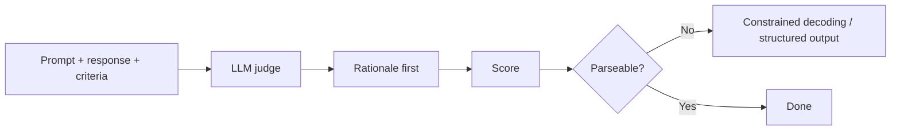
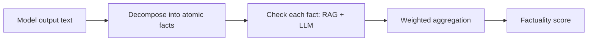

> [!KEY] Evaluation here means output quality, not latency or price. The ideal is a human rating every output. Everything else is an approximation of that, and the lecture is a tour of the approximations, from inter-rater agreement to LLM-as-a-Judge to benchmarks.

Afshine calls this one of the most important lectures of the quarter. If you cannot measure performance, you do not know what to improve. [00:18](ts:18)

## What "evaluation" means here

Evaluating an LLM can mean many things: output quality, coherence, factuality, latency, pricing, uptime. This lecture covers output quality only: how good is the actual response. [04:42](ts:282)

That is hard because the model is text-to-text and can output anything: prose, code, math. No single universal metric exists. [05:37](ts:337)

## The ideal: human ratings

The ideal setup: every model output gets rated by a human. Collect all ratings, quantify overall performance. The problem is cost. It is very cost-intensive. [06:12](ts:372)

A second problem: even human judgment is fuzzy. Rating is subjective. Example from the lecture: the model is asked for a birthday gift idea and suggests a teddy bear. One rater finds it useful. Another finds it useless because it does not say which teddy bear. [07:32](ts:452)

This gives the notion of **inter-rater agreement**: are raters aligned on how to rate? The lecture works through the agreement rate on the board: the probability that two raters agree, corrected for the agreement you would get by pure chance. [08:22](ts:502) Raw agreement rates mislead because chance agreement rises when one label dominates. Metrics like Cohen's kappa quantify how much better observed agreement is than chance agreement. [14:59](ts:899)

In practice, teams run agreement sessions where raters align on the rating rubric before the real work starts. [17:38](ts:1058)

## Rule-based metrics: compare to a reference

The classical family compares model output to a human reference:

- **METEOR**: matches unigrams, expanded with synonyms and stems. Afshine finds it arbitrary: a recipe of hyperparameters (alpha, beta, gamma) that still punishes stylistic variation. [24:17](ts:1457)
- **BLEU** (bilingual evaluation understudy): precision-focused. Counts matching n-grams in the prediction, with a brevity penalty so short translations cannot game it. [25:16](ts:1516)
- **ROUGE**: the same idea, typically used for summarization. Many variants. [26:17](ts:1577)

All three share one structure: compare output against reference. All three share the same limits. They do not allow stylistic variation. The same sentence said three different ways scores poorly. Their correlation with human ratings is weak despite all the tuning. And they still need human references to get started, which you cannot always afford. [26:31](ts:1591)

> [!CAVEAT] Perplexity and the mechanics of these metrics are taught in [CS336 Lesson 12](../../foundations/cs336/l12-evaluation.html). This lesson takes them as given and moves to what comes next.

## LLM-as-a-Judge

The key method of the lecture. Seven lectures built models that absorbed human knowledge and preferences during pretraining and tuning. So use an LLM to grade the response. The term comes from a paper from two years prior. [28:08](ts:1688)

The setup. Input: the prompt that produced the response, the response itself, and the criteria to grade against. Output: a score plus a rationale. The rationale is the key difference from rule-based metrics. Old metrics returned a number you could not interpret. The judge explains why it gave the score. [29:26](ts:1766)

One trick: ask for the rationale **before** the score. This empirically improves quality. It is the same idea as reasoning models from Lecture 6: the model externalizes its thought process before committing to an answer. [31:18](ts:1878)

A parsing problem: the judge is probabilistic, so nothing guarantees a parseable rationale and score. The fix is constrained decoding, called structured output by providers like OpenAI, which restricts sampling to valid tokens so the output matches a schema. [32:40](ts:1960)

Two benefits, recapped: no reference text needed to start, and the score comes with an interpretable rationale. [35:47](ts:2147)

Two flavors exist. **Pointwise**: grade one response, good or bad. **Pairwise**: compare two responses, which is better. The pairwise setup doubles as a way to synthetically generate preference labels for training reward models, connecting back to Lecture 5 on preference tuning. [36:47](ts:2207)

## Three biases and their remedies

**Position bias.** In a pairwise setup, the model may prefer response A just because it was presented first. Remedy: ask both orders (A vs B, then B vs A) and take the majority vote. If the verdict flips, do not trust it. [38:48](ts:2328)

**Verbosity bias.** The judge may prefer the longer response just for being longer, not for being more correct. Remedies: state length neutrality explicitly in the guidelines, add in-context examples showing verbosity is not preferred, or penalize output length after pointwise scoring. [40:31](ts:2431)

**Self-enhancement bias.** A model asked to judge its own output prefers it, because that output was by definition high-probability under its own distribution. Guideline: do not use the same model for generation and judging. The lecture notes this is getting harder since models train on similar data, so use a different model anyway to minimize the risk. A student raises a fourth bias: the judge may simply be misaligned with human preference on some label. Afshine agrees the list is not exhaustive. [42:29](ts:2549)

Best practice is a bigger, stronger judge with reasoning ability, which is less easily fooled by fluent-but-wrong responses. [46:00](ts:2760)

## Best practices

Crisp guidelines: state explicitly what you want and do not want. Prefer a **binary scale** (pass or fail) over granular ones. It makes the judge's job easier and humans also find binary judgments less noisy. Output the rationale before the score. Calibrate: collect human ratings on a sample, run the judge, and check the correlation, then iterate on the prompt. Use low temperature (0.1 or 0.2) so evaluations are reproducible. [47:21](ts:2841)

And the warning that ties it together: do not overoptimize against the proxy. The judge score approximates human ratings. If you tune your model to maximize the judge score while the judge drifts from humans, you are improving a number, not the model. [51:32](ts:3092)

## Measuring factuality

Two broad dimensions: task performance (useful, factual, relevant) and alignment (tone, style, safety). Factuality gets a deep dive because it needs more machinery. [52:53](ts:3173)

The running example: "Teddy bears, first created in the 1920s, were named after President Theodore Roosevelt after he proudly wanted to shoot a captured bear on a hunting trip." It contains two errors: teddy bears date to the 1900s, and Roosevelt refused to shoot. A single binary label would call the whole text wrong and lose the nuance. [54:23](ts:3263)

The standard pipeline, in steps:

1. **Decompose** the text into atomic facts with one LLM call. The example yields four facts. [56:16](ts:3376)
2. **Check each fact** in binary fashion, a fact is correct or not. The checking step itself uses LLM calls plus retrieval: query a knowledge base with the fact (RAG from Lecture 7) or web search, then verify. [57:13](ts:3433)
3. **Aggregate** with weights. Some facts matter more than others, so each fact gets a weight alpha_i, and the score is the weighted fraction of correct facts. The example scores 0.6. [58:49](ts:3529)

## Evaluating agents: seven failure modes

Shervine takes over for the agent side. A ReAct agent loops over observe, plan, act. To evaluate it, enumerate what can fail at each step. [60:09](ts:3609)

**Tool prediction errors** (four):

1. **Punt**: the query clearly needs a tool, but the model answers without one, or refuses. Cause may be the tool router (a recall problem: the right tool was filtered out of the preamble) or the model simply not thinking to use tools. Fix the router, or retrain/reprompt the tool-use pattern. [62:38](ts:3758)
2. **Tool hallucination**: the model calls a function that does not exist, like `find_bear` instead of the defined `find_teddy_bear`. Often the model is too weak to ground on instructions; remedy is to upgrade the model. But first check your own API design: function names, arguments, and docstrings are what the model sees, so make them logical. [66:24](ts:3984)
3. **Wrong tool**: the right tool exists in the list but the model picks another, or the choice is ambiguous. Fix at the router level and by making each API's scope precise about which situations it handles. [70:22](ts:4222)
4. **Wrong arguments**: right tool, bad inputs, like coordinates 0,0 for "near me." Either the context lacks the information (add a location-finder tool, or surface an actionable error instead of dummy parameters) or the model does not know what to put (retrain or rewrite the API). [72:00](ts:4320)

**Tool call errors** (two):

5. **Bad response**: the tool runs but returns an error or a bug. Do not pass raw errors to the model; it interprets them as its own failure. Return structured output conveying what happened. [74:26](ts:4466)
6. **No response**: the tool returns nothing. For action tools this is dangerous: the model may falsely confirm success. Always return something meaningful, even an empty JSON, which at least says "I found nothing." [76:25](ts:4585)

**Synthesis errors** (three):

7. The model fails to ground on the tool output: it says "I found no bear" when the tool found one. Rare in modern models; upgrade if you see it.
8. The tool output drowns the signal: too much irrelevant information buries the answer. Trim the output at the tool level.
9. Poor presentation: raw data the model cannot interpret. Return structured objects with named attributes instead. [78:29](ts:4709)

The trend across all seven: the fixes live in modeling (reasoning ability), context relevance, tool API design, and tool implementation. Be methodical: categorize errors, then fix them in groups. [81:16](ts:4876)

## The benchmark zoo

Benchmarks characterize a model's profile. No model is all good or all bad. The lecture groups them by what they probe: [83:30](ts:5010)

| Category | Benchmark | What it tests | Format |
|---|---|---|---|
| Knowledge | MMLU | Facts across ~60 subjects | 4-choice, letter extraction |
| Reasoning | AIME | Hard math | 3-digit answer, exact match |
| Reasoning | PIQA | Physical common sense | 2-choice, 20k examples |
| Coding | SWE-bench | Real GitHub issues | Patch must pass new tests |
| Safety | HarmBench | Harmful behavior, 4 categories | Classifier-based judgment |
| Agents | tau-bench | Airline/retail tasks with tools | Database-state reward |

MMLU (Massive Multitask Language Understanding) mostly measures how well pretraining retained information. It is deliberately constrained: a question, four answers, extract the letter. Constrained formats avoid adding an LLM-judge error layer on top. [84:44](ts:5084)

AIME is a hard high-school math exam whose 3-digit answers make it LLM-friendly: exact, hard-coded grading. PIQA tests everyday physical reasoning ("find something lost on the carpet": vacuum with a hairnet, not a solid seal). [89:35](ts:5375)

SWE-bench mines Python repos for pull requests that fixed an issue and added tests. The model must produce a patch that flips the tests from failing to passing. [94:06](ts:5646)

HarmBench splits into standard (vanilla harmful behavior), copyright, contextual, and multimodal. Notably, an attack counts as successful if the model *attempts* the harmful behavior, even unsuccessfully, judged by a trained classifier. It is the only benchmark here that relies on a classifier, which can itself err. Safety benchmarks also resist cross-model comparison because each provider has its own policy. [97:22](ts:5842)

tau-bench (tool-agent-user) gives an agent tools and policies in airline and retail domains, then simulates the user with another LLM because the conversation cannot be hard-coded. Success is measured by database state. Its metric is pass-hat-k: the probability that **all** k attempts succeed, not just one. For agents you want reliability, not luck. [101:08](ts:6068)

## Grounding the benchmarks

The lecture closes by grounding all this in a real model report (a Gemini launch from that week): the same categories appear, with multilingual flavors like Global PIQA and SWE-bench variants. [105:12](ts:6312)

Plot model performance against price and the best models trace the **Pareto frontier**. Different frontiers exist for cost, safety, context length. Afshine's own experience: Sonnet for coding, Gemini Flash for fast and cheap, but your use case decides. [107:15](ts:6435)

Benchmarks are only as good as the assumption the model has not seen them. Defenses: hash values, blocklists against benchmark-leaking sites, and evaluating math on fresh tests. **Goodhart's law**: when a measure becomes a target, it ceases to be a good measure. Benchmark numbers must be weighed against what you actually want. Chatbot Arena balances this with real-life preference data, but ultimately you should try the models yourself. [107:49](ts:6469)

> [!INTERVIEW] Expect "how would you evaluate an LLM feature" in applied interviews. The strong answer follows this lecture's arc: define the dimension (task performance vs alignment), start from human ratings on a sample, pick the cheapest approximation that correlates (rule-based for constrained tasks, LLM-as-a-judge for open-ended), name the biases and your mitigations, and state how you guard against Goodhart drift. For agent work, enumerate failure modes per loop step before proposing fixes.

## Sources

- Video: [Lecture 8: LLM Evaluation](https://www.youtube.com/watch?v=8fNP4N46RRo) (1:49:25)
- Slides: [fall25-cme295-lecture8.pdf](https://cme295.stanford.edu/slides/fall25-cme295-lecture8.pdf)
