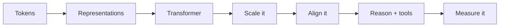
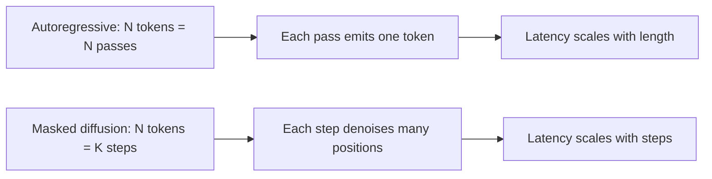

> [!KEY] The quarter's arc: turn text into tokens, learn to represent them, build the transformer, scale it, align it, make it reason, connect it to tools, then measure it. The trends all ask what comes after that arc: new modalities, new objectives, cheaper serving, new hardware.

The final lecture has three parts: a recap of the quarter, trending topics for 2025 and beyond, and closing advice. [00:33](ts:33)

## The recap: eight lectures, one pipeline

**Lecture 1: Transformers.** Tokenization splits text into atomic units; subword tokenizers dominate because word roots get reused. Then representations: word2vec learned vectors from a proxy task (predict center or context words), but the vectors were not context-aware. RNNs processed tokens sequentially with a running state. The transformer replaced all of that with self-attention. [01:30](ts:90)

The mechanics live elsewhere in this system: tokenization in [CS336 Lesson 1](../../foundations/cs336/l01-overview-tokenization.html), word2vec in [CS224N Lessons 1-2](../cs224n/l01-word-vectors-1.html), RNNs in [CS224N Lesson 5](../cs224n/l05-rnns.html).

**Lecture 2: Transformer models and tricks.** The improvements since 2017: relative position encodings like RoPE replacing absolute embeddings, and the encoder-only BERT family for classification. [06:36](ts:396)

**Lecture 3: Large language models.** What makes an LLM: the transformer at scale, mixture of experts, and decoding controls. Temperature tunes output variety: low temperature gives spiky, deterministic distributions; high temperature gives creative, random ones. [14:46](ts:886)

**Lecture 4: Training.** Models are too big to fit naively, so training must be smart. The early-2020s discovery: bigger model, more data, more compute all improve test loss. Given a fixed compute budget, the Chinchilla rule of thumb says train on at least 20 tokens per parameter: a 100B-parameter model wants 2T tokens, because most models of that era were undertrained. On the systems side, FlashAttention exploits GPU memory hierarchy: keep the big slow HBM reads and writes minimal by tiling the computation into the small fast SRAM. [15:18](ts:918)

Mechanics: scaling laws in [CS336 Lesson 9](../../foundations/cs336/l09-scaling-laws-1.html), hardware and kernels in [CS336 Lessons 5-6](../../foundations/cs336/l05-gpus-tpus.html).

**Lecture 5: Preference tuning.** Afshine calls it the most technically challenging lecture: RLHF, reward modeling, PPO, DPO. The alignment step that turns a base model into an assistant. [29:27](ts:1767)

Mechanics in [CS336 Lesson 15](../../foundations/cs336/l15-post-training-sft-rlhf.html).

**Lecture 6: Reasoning.** Chain-of-thought, reasoning models that externalize thinking before answering, RL on reasoning traces. [31:07](ts:1867)

**Lecture 7: Agents.** RAG for external knowledge, tool calling, and the ReAct loop (observe, plan, act) that combines them. [37:00](ts:2220)

**Lecture 8: Evaluation.** Human ratings as the ideal, LLM-as-a-Judge as the approximation, benchmarks as the standard. [The previous lesson](l08-evaluation.html) covers it in full.

## Trend 1: the transformer leaves text

The transformer was born in machine translation, then conquered text. The natural question: what about non-text input? Self-attention only needs vectors with queries, keys, and values. Nothing says those vectors must come from text tokens. Image patches are vectors too. [49:01](ts:2941)

The **Vision Transformer (ViT)** treats image patches as tokens and runs the same architecture on them for classification. **Vision-language models (VLMs)** go further, mixing both modalities, with LLaVA-style projection or cross-attention connecting vision encoders to language decoders. Diffusion transformers apply the same idea to generation. [53:02](ts:3182)

Two cross-pollination examples show how deep this runs. **DeepSeek OCR** showed that a function can reconstruct text tokens from very few vision tokens: image patches carry meaning so densely that tokenizers start to look like the wrong tool, with emojis as the everyday proof. And **RoPE**, the relative-position trick from text, gets reformulated in 2D for images and multimodal settings so relative position still computes sensibly across both token types. [85:54](ts:5154)

## Trend 2: diffusion language models

Diffusion works well for vision. The question is whether text generation must stay autoregressive. **Masked diffusion models (MDM)**, also called diffusion-based LLMs, generate in a fundamentally different way: instead of one token per pass, they denoise a masked sequence over a fixed number of diffusion steps, filling many positions in parallel. [64:06](ts:3846)

The example is **LLaDA** (Large Language Diffusion with Masking). The pitch: an autoregressive model needs as many passes as there are tokens; a diffusion model needs only as many passes as diffusion steps. Inference-time generation, the expensive part, gets structurally cheaper. Open questions remain: how to adapt preference tuning and reasoning techniques built for autoregressive models. [75:46](ts:4546)

## Trend 3: the architecture is still alive

Every design decision in the modern LLM stack is still being iterated. Nothing is set in stone: [88:59](ts:5339)

- **Optimizers.** Adam's long reign is being challenged. The Kimi K2 paper introduced **Muon**, and MuonClip looks like a candidate for the new standard.
- **Normalization.** The original transformer used post-norm layer norm. Modern LLMs use pre-norm, and the type itself is changing: RMSNorm uses fewer parameters.
- **Attention.** No fixed design. Papers mix attention variants across layers: different heads, different layers, different choices.
- **Activations.** The shift from ReLU to ReLU-like functions (GELU and cousins) continues, with new ones still arriving.
- **MoE, depth, width.** Whether to use mixture of experts, how many layers, how many heads, FFN size: all still debated per paper.

## Trend 4: data gets serious

The first LLMs scraped the internet when it was mostly human-written. That world is gone: search results are now majority LLM-generated. The response is **data curation** as a discipline. The old pipeline was pretraining then fine-tuning. The new one inserts **mid-training**: still large-scale, but on higher-quality curated data. [92:23](ts:5543)

The linked paper warns about **model collapse**: training on LLM-generated text, which is less diverse than human text, shifts the training distribution and degrades learning. The picture is not grim, but meaningful data now takes work. [94:14](ts:5654)

## Trend 5: the efficiency frontier

Benchmarks drove years of "bigger is better." But providers report losing money even on top-tier plans, which means serving cost is the binding constraint. Expect a **second Pareto frontier**: not maximum capability at any cost, but maximum quality per dollar. This drives the rise of **small language models (SLMs)** and a whole research line on test-time compute efficiency. [94:47](ts:5687)

## Trend 6: hardware catches up

GPUs are great at one thing: matrix multiply. But the transformer needs more than matmuls. The QK-transpose in attention is memory-hungry, which is exactly what FlashAttention attacked by minimizing HBM traffic even at the cost of recomputation. The lecture points to a September paper that goes further: a proof of concept where transformer operations are **embedded in the hardware itself**, computed as a side effect of analog signals (think Kirchhoff-style summation over pulse arrays). The simulation showed large latency and energy wins. The architecture and the chip may co-evolve. [96:47](ts:5807)

## Trend 7: use cases and their democratization

What LLMs are actually for, today: coding agents that turn prompts into code, text-to-code for entire problem classes, on-the-fly visualization generation, the general assistant that browses better than you, creativity work that starts from a draft instead of a blank page, and a learning loop where students brainstorm concepts with chatbots in real time. [100:01](ts:6001)

The next wave is **democratizing agentic workflows**. Today agents are a power-user tool. The direction is natural-language task execution for everyone: browse the web, act on the desktop, work at the OS level. ChatGPT Atlas is cited as an early product in this direction. The blocker is security: prompt injection can exfiltrate data, and the field may need something like HTTPS certificates, but for "safe for AI browsing." [103:11](ts:6191)

The reliability bar is high. Multi-step agents compound failure probability, and the customer-service test is brutal: everyone who has shouted "I want a human" at a phone bot knows how far empathy and groundedness still are. [105:31](ts:6331)

## Open challenges

Weights are fixed after training; RAG and tools work around it, but **continuous learning** remains open. **Hallucinations** are in scare quotes deliberately: next-token prediction was never trained to map statements to facts, so hallucination is arguably a core design choice, not a bug. Then the standing list: personalization, interpretability, safety. [107:03](ts:6423)

## Staying current

The field moves too fast for any course to be the last word. The lecture's recommended stack: arXiv and venues like NeurIPS for papers, the authors' **codebases** (now standard to release) for the real understanding, HuggingFace's trending papers as the successor to papers-with-code, X/Twitter for the discussion layer, YouTube explainers (Yannic Kilcher covered the transformer paper in 2017; Karpathy is the recommended educator), company blogs, and the CME295 study guide the instructors maintain yearly. [107:52](ts:6472)

> [!INTERVIEW] This lecture is a map of where to aim your learning after the fundamentals. For interviews, the highest-signal trends are the ones with a crisp technical story: masked diffusion vs autoregressive generation (parallel passes), the 2D RoPE adaptation, model collapse and mid-training, and the efficiency Pareto frontier. Each compresses to a two-minute answer with a mechanism, which is exactly what interviewers probe.

## Sources

- Video: [Lecture 9: Recap and Current Trends](https://www.youtube.com/watch?v=Q86qzJ1K1Ss) (1:51:31)
- Slides: [fall25-cme295-lecture9.pdf](https://cme295.stanford.edu/slides/fall25-cme295-lecture9.pdf)
