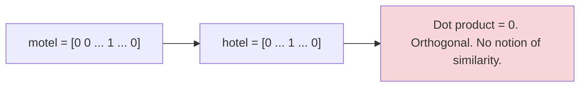
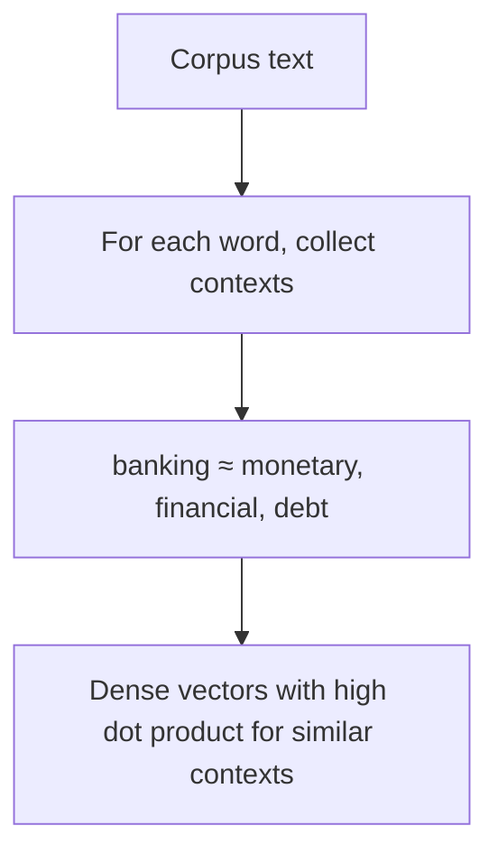
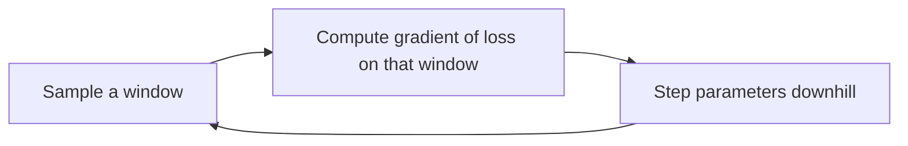

> [!KEY] The result that started modern NLP: word meaning can be represented well by a high-dimensional vector of real numbers.

## The course

CS224N teaches deep learning applied to NLP. Foundations first: word vectors, feed-forward networks, recurrent networks, attention. Then 2024 methods: transformers, pretraining, post-training (RLHF, SFT), efficient adaptation, language model agents.

Grading: four assignments (48%), a final project (49%), participation (3%). Assignment 1 is a Jupyter notebook on ramp. Assignment 2 requires multivariate calculus and builds a feed-forward network for dependency parsing in PyTorch. Assignments 3 and 4 use PyTorch on GPUs.

## How to represent word meaning

The dictionary view of meaning: a word is a symbol linked to an idea. Signifier to signified. For a computer, the classical NLP solution was WordNet, a hand-built thesaurus of synonym sets and hypernyms.

WordNet has real problems. It misses nuance ("proficient" as a synonym for "good" is only right in some contexts). It misses new meanings (wicked, badass, ninja). It cannot keep up with language change. It needs human labor. And it cannot compute word similarity accurately.

The older classical approach treated words as discrete symbols: hotel, conference, motel. Represent each as a one-hot vector. Vocabulary of 500,000 means 500,000-dimensional vectors with a single 1.

One-hot vectors are orthogonal by construction. A search for "Seattle motel" will not match "Seattle hotel". There is no natural similarity. WordNet's synonym lists fail to fix this. The solution: learn vectors that encode similarity themselves.

## Distributional semantics

The core idea: a word's meaning is given by the words that frequently appear nearby.

> "You shall know a word by the company it keeps." (J. R. Firth, 1957)

When the word *banking* appears in text, its context is the set of nearby words: "government debt problems turning into banking crises", "unified banking regulation", "its banking system a shot in the arm". The many contexts of a word build up its representation.

We build a dense vector for each word, chosen so that it is similar to vectors of words that appear in similar contexts. Similarity is measured as the vector dot product. These are word vectors, also called word embeddings: a distributed representation.

## Word2vec: the framework

Word2vec (Mikolov et al., 2013) learns word vectors from a large corpus. Every word in a fixed vocabulary gets a vector. Walk through each position \(t\) in the text. At position \(t\) there is a center word \(c\) and context ("outside") words \(o\) within a fixed window.

The idea: use the similarity of the word vectors for \(c\) and \(o\) to compute the probability of \(o\) given \(c\). Adjust the vectors to maximize this probability.

The skip-gram model predicts context words from the center word. For each position \(t = 1, \ldots, T\), predict context words within window size \(m\) given center word \(w_t\). The likelihood:

\[ L(\theta) = \prod_{t=1}^{T} \prod_{-m \leq j \leq m, j \neq 0} P(w_{t+j} | w_t; \theta) \]

The objective \(J(\theta)\) is the average negative log likelihood:

\[ J(\theta) = -\frac{1}{T} \sum_{t=1}^{T} \sum_{-m \leq j \leq m, j \neq 0} \log P(w_{t+j} | w_t; \theta) \]

Minimizing the objective is maximizing predictive accuracy.

## The probability: softmax over dot products

How to compute \(P(o | c)\)? Use two vectors per word \(w\): \(v_w\) when \(w\) is a center word, \(u_w\) when \(w\) is a context word. Then:

\[ P(o | c) = \frac{\exp(u_o^T v_c)}{\sum_{w \in V} \exp(u_w^T v_c)} \]

Three steps, each with a reason:

1. **Dot product** compares similarity of \(o\) and \(c\). Larger dot product means larger probability.
2. **Exponentiation** makes everything positive.
3. **Normalization** over the entire vocabulary gives a probability distribution.

This is the softmax function. It maps arbitrary values to a probability distribution. "Max" because it amplifies the largest value. "Soft" because smaller values still get some probability. It appears everywhere in deep learning.

> [!WARN] The denominator sums over the entire vocabulary. For a vocabulary of hundreds of thousands, this is expensive. That cost is the motivation for negative sampling, covered in Lesson 2.

## Training: gradient descent

To train, adjust parameters \(\theta\) (all word vectors stacked into one long vector; remember every word has two vectors) to minimize the loss. Compute the gradient of \(J(\theta)\) and take a small step in the negative gradient direction. Repeat.

The update, for a single parameter:

\[ \theta_j^{\text{new}} = \theta_j^{\text{old}} - \alpha \frac{\partial J(\theta)}{\partial \theta_j} \]

where \(\alpha\) is the step size, the learning rate. The objectives are not convex, but in practice the method works.

Full gradient descent computes the gradient over all windows in the corpus, potentially billions. That is far too expensive: you wait a very long time before a single update. The fix is stochastic gradient descent (SGD): repeatedly sample windows and update after each one. Mini-batch gradient descent samples a small batch per update, balancing noise and cost.

## Looking at word vectors

The lecture closes with a Jupyter notebook: trained vectors show the famous regularities. Words with similar contexts cluster. Vector arithmetic captures analogies. The distributional hypothesis, turned into numbers, works.

## Assignment connection

Assignment 1 (released with this lecture) is a Jupyter notebook exploring word vectors. It is the on-ramp: the calculus-heavy word2vec derivations arrive in Assignment 2.

> [!INTERVIEW] Word2vec is the canonical "derive the gradient" interview topic in NLP. Know the skip-gram objective, the softmax formulation, and why the full softmax is too expensive. The negative sampling fix is Lesson 2, and interviewers often ask for it as a follow-up.
