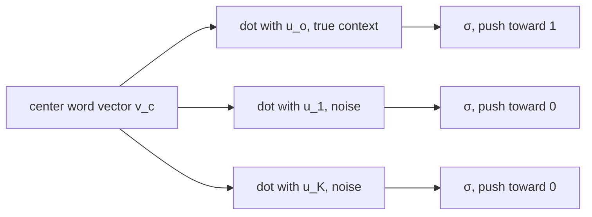
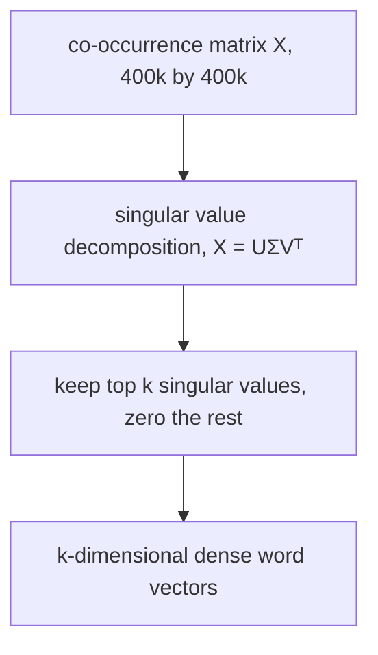

> [!KEY] Words that appear in similar contexts end up with similar vectors. word2vec learns this from raw text with a prediction objective. GloVe learns it from a co-occurrence matrix. Both produce linear meaning structure.

## Optimization, finished

The lecture opens by closing the optimization story from Lecture 1. There is a cost function J(θ). Compute its gradient, which points downhill. Take a small step: θ := θ − α∇J(θ). The multiplier α is the learning rate or step size, often 10⁻³ to 10⁻⁵. Steps must stay small. A large step can overshoot and land at a worse point than where it started [03:38](ts:03:38).

Nobody uses full gradient descent. Evaluating J over the entire corpus before a single update takes far too long [05:53](ts:05:53). The replacement is stochastic gradient descent: sample a small subset of the data, perhaps 16 or 32 items, evaluate J on that subset, and step along the resulting noisy gradient. This is mini-batch gradient descent. The noise is not just a price worth paying. Networks often optimize better when the updates carry some noise [07:43](ts:07:43).

## word2vec, reviewed

Every word starts as a random vector of small numbers. Zeros do not work. If all vectors start equal, the false symmetries never break and nothing learns [08:12](ts:08:12).

Then walk through the corpus position by position. At each position, use the center word to predict the words around it. Compare the predicted distribution with the words actually present. That mismatch is the training signal. Update the vectors so the next prediction is better [08:53](ts:08:53).

The model keeps two disjoint vector sets: U for outside (context) words and V for center words. The score for a pair is the dot product u_o · v_c, normalized into a probability with a softmax over the vocabulary [10:35](ts:10:35). This is a bag-of-words model. It does not distinguish left context from right context. It only learns which words appear near which [11:01](ts:11:01). From nothing more than this, the vectors capture word similarity and meaning relations. Manning calls that part magic [09:41](ts:09:41).

## Seeing the vectors work

Manning loads 100-dimensional GloVe vectors in a notebook and inspects them directly. The vector for "bread" and the vector for "croissant" share sign patterns across their first components. Cosine similarity then ranks neighbors: near "usa" sit "canada", "america", "u.s.a", "united states", "australia". Near "banana" sit "coconut", "mango", "fruit" [13:37](ts:13:37).

One experiment fails instructively. Ask for the words most similar to the negative of the "banana" vector, hoping to find antonyms. The answer is noise: rare strings, foreign names, nothing that reads as the opposite of banana. The space has no clean notion of negation [15:01](ts:15:01).

## Analogies: the famous property

Vector arithmetic isolates meaning components. Start at "king", subtract "man", add "woman", and the nearest word is "queen" [16:02](ts:16:02). The class plays along. "australia" is to "beer" as "france" is to "champagne". "russia" is to "beer" as the answer "vodka". "pencil" is to "sketching" as "camera" is to "photographing". Old politics works: "obama" is to "clinton" as "reagan" is to "nixon" [19:53](ts:19:53). Syntax lives in the space too: "tall" is to "tallest" as "long" is to "longest" [20:39](ts:20:39).

Manning adds a warning. These vectors date from 2014 and encode world knowledge beyond dictionary semantics. "Australia is to beer as Russia is to vodka" is cultural knowledge, not word meaning in the narrow sense [21:12](ts:21:12).

> [!PROF] Analogies run on vector differences, not positions. The vector from "man" to "king" encodes something like "ruler". Add that same difference to "woman" and you land near "queen" [21:51](ts:21:51).

## The word2vec family

Why two vectors per word? Pure convenience. With one shared vector set, the center word would also appear among the context words during normalization, creating a quadratic self-term that complicates the derivatives. Disjoint sets keep every term linear in the other set's vectors [25:37](ts:25:37). In practice the two sets converge anyway, because each word appears as both center and context across the corpus. The standard move is to train both and average them at the end [22:47](ts:22:47).

Mikolov et al. (2013) describe a family of models. Two variants: skip-gram predicts context words from the center word, and continuous bag of words (CBOW) predicts the center word from its context. Manning presents skip-gram as the simpler one that works well [27:06](ts:27:06).

Three training losses exist: naive softmax, hierarchical softmax, and negative sampling. Naive softmax sums over the full vocabulary in every denominator. With 400,000 words and a 100 to 300 dimensional dot product per term, that sum is expensive [28:35](ts:28:35).

## Negative sampling

Negative sampling drops the softmax. Instead of one 400,000-way classification, train K+1 binary logistic regressions. One says the true context word should score high. K say randomly sampled words should score low [29:01](ts:29:01).

For center word c, true outside word o, and K negative samples:

\[ J = -\log \sigma(u_o \cdot v_c) - \sum_{k \in K} \log \sigma(-u_k \cdot v_c) \]

Here σ is the logistic function σ(x) = 1/(1+e⁻ˣ), which maps any real number to a probability between 0 and 1 [30:07](ts:30:07). Minimizing J pushes the true pair's dot product up toward probability 1 and the noise pairs' dot products down toward 0. The minus sign inside the second σ uses the symmetry σ(−x) = 1 − σ(x): maximizing the probability that a noise pair is "not real" is the same as minimizing the probability that it is real [31:03](ts:31:03).

The K negative samples are not uniform. Sample from the unigram distribution raised to the 3/4 power:

\[ P(w) = \frac{U(w)^{3/4}}{Z} \]

Raising probabilities to a power below 1 flattens the distribution. Rare words get sampled more often than their raw frequency suggests, moving partway toward uniform sampling. Empirically this beats both extremes [32:21](ts:32:21). K is small, typically 5 to 10 [31:34](ts:31:34).

> [!KEY] Negative sampling replaces a 400,000-way softmax with a handful of binary decisions: this pair is real, those K pairs are noise.

A practical aside from the slides: each window touches only a few words, so SGD updates are sparse. Update only the rows that appear, or keep the vectors in a hash table. With millions of vectors on distributed workers, never broadcast full-matrix updates.

## Could we just count?

Iterating over the corpus feels roundabout. Why not accumulate co-occurrence statistics directly? Build a matrix X where X_ij counts how often word j appears in the context of word i. A toy corpus ("I like deep learning", "I like NLP", "I enjoy flying") with window size 1 gives an 8×8 symmetric matrix, mostly 0s and 1s, with a 2 where "I like" repeats [33:54](ts:33:54).

Each row is a word vector. The problem is scale. A 400,000-word vocabulary gives a 400,000×400,000 matrix. The word2vec alternative stores 400,000×100 numbers instead [36:01](ts:36:01).

The classical fix is dimensionality reduction. Factor X with the singular value decomposition X = UΣVᵀ, where U and V are orthonormal. Keep only the k largest singular values and zero the rest. The result is the best rank-k approximation of X in least-squares terms, and its rows are k-dimensional word vectors [36:57](ts:36:57). This is latent semantic analysis (LSA). It half-worked: raw counts give bad vectors.

Doug Rohde's COALS (2005) showed which hacks make counts work: take logs of the frequencies, cap the counts, use ramped windows that weight closer words more, and replace counts with Pearson correlations. He also discovered the linear-components property years before word2vec. His dissertation shows vector differences moving from verbs to their doers, like drive to driver. Nobody noticed at the time [38:59](ts:38:59).

## GloVe: ratios encode meaning

Manning and his postdoc Jeffrey Pennington asked whether count-based methods could be repaired properly. The key insight: ratios of co-occurrence probabilities encode meaning components. Consider words near "ice": "solid" and "water" are likely, "gas" is not. Near "steam": "gas" and "water" are likely, "solid" is not. Neither column alone isolates anything. But the ratio P(k|ice)/P(k|steam) is large for "solid", small for "gas", and about 1 for "water" and for random words. The ratio points along the solid-liquid-gas axis [42:22](ts:42:22). On real data the ratios come out near factors of 10 in each direction [43:34](ts:43:34).

A ratio becomes a difference under a log. So GloVe is a log-bilinear model: the dot product of two word vectors models the log co-occurrence probability. Then the difference of two vectors models the log of the ratio, which is the meaning component. The full objective adds bias terms and a weighting function that down-weights very frequent pairs:

\[ J = \sum_{i,j} f(X_{ij}) \, (w_i^T \tilde{w}_j + b_i + \tilde{b}_j - \log X_{ij})^2 \]

The lecture skips the biases as unimportant detail [45:00](ts:45:00). The vectors Manning demos at the start of the lecture are GloVe vectors, trained at Stanford.

## Evaluating word vectors

Manning draws the course's recurring distinction: intrinsic versus extrinsic evaluation [46:29](ts:46:29).

Intrinsic evaluation scores the component on its own subtask. It is fast and diagnostic, but better intrinsic numbers may not help the downstream task. Extrinsic evaluation plugs the component into a real system, like question answering or translation, and measures end-task accuracy. It is the honest test but slow and indirect [46:38](ts:46:38).

Two intrinsic evaluations for word vectors:

1. **Word analogies.** Keep a set of a:b::c:d questions and score the fraction answered correctly. Manning admits the demo cherry-picked: many analogies fail [48:30](ts:48:30).
2. **Word similarity.** Ask humans to rate word pairs from 0 to 10, then correlate model scores with the averaged human ratings. "tiger"/"tiger" gets 10, "book"/"paper" 7.46, "plane"/"car" 5.77, "stock"/"phone" 1.62, "stock"/"jaguar" 0.92 [49:30](ts:49:30). Plain SVD over raw counts scores terribly. SVD over log counts does reasonably. CBOW, skip-gram, and GloVe score well [50:31](ts:50:31).

The extrinsic example is named entity recognition (NER): label "Chris Manning" as a person and "Palo Alto" as a location. The baseline is a symbolic probabilistic NER system. Adding word vectors as features raises the scores substantially [51:10](ts:51:10).

## Word senses: one vector or many?

Most words have many senses. "pike" is a fish, a spear, a road (turnpike), a fraternity name, a diving position, and a verb [53:01](ts:53:01). One fix: cluster token occurrences by context similarity, then learn one vector per cluster. Huang et al. did this in 2012. "jaguar" splits into the car (near "luxury", "convertible"), the old Mac OS (near "software", "microsoft"), the keyboard, and the animal (near "hunter") [55:26](ts:55:26).

That is not what the field settled on. The standard single vector is effectively a weighted average of the sense vectors, weighted by sense frequency. Manning calls it a superposition, borrowing the physics term [57:50](ts:57:50). His linguistic argument: sense boundaries are artificial. "field" spans crop fields, ice fields, sports fields, and mathematical fields, and five dictionaries give five different sense counts. Meaning looks more like a probability distribution over uses than a list of discrete senses [59:33](ts:59:33).

A surprising result backs the single vector. Sparse coding theory says high-dimensional sparse spaces allow recovery of mixture components. Arora et al. applied sparse coding to a single word vector and recovered distinct sense vectors: "tie" as clothing, "tie" as a drawn game, "tie" as a cable fastener, "tie" in music. Four of five recovered senses look right [61:51](ts:61:51).

The modern answer is previewed here: contextual word vectors, which assign different vectors to the same word in different contexts. Those arrive later in the course.

## Toward neural classifiers

The lecture closes by turning word vectors into a classifier. Named entity recognition becomes a window classifier: take a word plus two words of context on each side, concatenate the five word vectors, and predict whether the center word is a location. "I love Paris Hilton greatly" is negative. "I visit Paris every spring" is positive [64:42](ts:64:42).

The setup is standard supervised learning: inputs x_i with labels y_i, drawn from a small class set. Classical classifiers (logistic regression, SVM, Naive Bayes) are linear: they learn weights W over fixed input features [68:05](ts:68:05). The neural version learns the representations too. Concatenate five 100-dimensional word vectors into a 500-dimensional input x. Compute z = Wx + b with W an 8×500 matrix. Pass through a nonlinearity f, for instance the logistic function. Multiply the resulting hidden vector by another vector to get a score, and put the score through the logistic to get P(location) [69:56](ts:69:56).

The final layer is a linear classifier over learned representations. The whole model is nonlinear in the original word vectors. That is the power neural networks add [71:25](ts:71:25).

Two forward-looking notes. In PyTorch, losses are computed with cross-entropy. For one-hot labels, cross-entropy reduces exactly to negative log likelihood: minus the log of the model's probability for the correct class [72:26](ts:72:26). And a logistic regression unit is a cartoon neuron: weighted inputs, a bias as an always-on feature, a nonlinearity as the firing decision. Stack several, feed them into another, and let the final loss decide what the middle layers compute. That self-organization is the magic the next lecture unpacks [77:36](ts:77:36). Full treatment: [Lecture 3](l03-neural-networks.html).

> [!INTERVIEW] Expect "word2vec versus GloVe" and "why does negative sampling work". Answer: word2vec is a prediction model trained by SGD on center-context pairs. GloVe is a count model that fits log co-occurrence ratios, which is what makes vector differences linear. For evaluation, name intrinsic (analogies, human similarity correlation) versus extrinsic (a downstream task like NER). Know which is honest and which is fast.

## Sources

- Video: [Lecture 2: Word Vectors, Word Senses, and Neural Network Classifiers](https://www.youtube.com/watch?v=nBor4jfWetQ) (1:19:02)
- Slides: [cs224n-spr2024-lecture02-wordvecs2.pdf](https://web.stanford.edu/class/archive/cs/cs224n/cs224n.1246/slides/cs224n-spr2024-lecture02-wordvecs2.pdf)
- Mikolov et al. (2013), "Distributed Representations of Words and Phrases and their Compositionality"
- Pennington, Socher, Manning (2014), "GloVe: Global Vectors for Word Representation"
