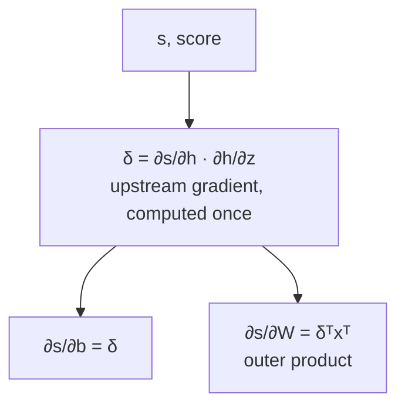
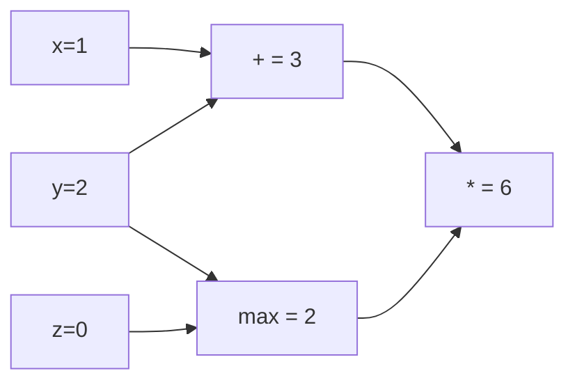

> [!KEY] Backpropagation is the chain rule with a memory. Compute each shared piece once, call it δ, and reuse it for every parameter below.

## The one hard week

Manning frames the week directly. Assignment 2 requires real understanding of neural network math, and then the course lets the software do it. This is the quarter's heaviest math week. Thursday brings linguistics (dependency parsing, Lecture 4), which he warns is the other hard day. The Friday PyTorch tutorial is the off-ramp: learn the math now, let the framework differentiate later.

For the general derivation of gradient descent and the multivariate chain rule, see [CS229 Lesson 8](../../foundations/cs229/l08-neural-networks-2.html). That lesson is the canonical treatment. This lesson is the NLP-specific version: by-hand gradients for the named entity network, in the notation the assignments use.

## The running example

The named entity recognizer from Lecture 2 carries over. The input is a window of five words, each a one-hot vector:

\[ x = [x_{\text{museums}}, x_{\text{in}}, x_{\text{Paris}}}, x_{\text{are}}, x_{\text{amazing}}] \]

Each one-hot selects its word vector from the embedding matrix, so x ∈ R^5d for d-dimensional vectors. The network computes z = Wx + b, then h = f(z) with f an elementwise nonlinearity, then a score s = uᵀh, then the predicted probability P(location) = σ(s) [06:52](ts:06:52). The hidden layer re-represents the input so a final linear classifier can separate it. Everything is learnable, including the word vectors: in deep learning, θ includes the data representation.

A neural network is a cascade of logistic regressions. The difference from a statistics class: nobody specifies what the middle regressions compute. The final loss directs them, and they discover useful intermediate functions on their own [04:04](ts:04:04).

```mermaid
flowchart LR
    X[x, 5d concatenated<br/>word vectors] --> Z[z = Wx + b]
    Z --> H[h = f(z)<br/>hidden layer]
    H --> S[s = uᵀh<br/>score]
    S --> P[P = σ(s)<br/>probability]
```

## Activation functions

The original McCulloch and Pitts (1943) unit was a threshold: output 1 if Wx > θ, else 0. A step function has no slope, so gradient-based learning is impossible [08:38](ts:08:38). The field moved to smooth activations with slopes. The logistic (sigmoid) came first, partly because it maps outputs to probabilities.

The lecture's inventory:

- **logistic (sigmoid):** σ(z) = 1/(1+e⁻ᶻ), output in (0, 1). Still used to produce probabilities.
- **tanh:** a rescaled sigmoid, tanh(z) = 2·logistic(2z) − 1, output in (−1, 1), twice as steep [10:37](ts:10:37).
- **hard tanh:** a piecewise linear clip of tanh.
- **ReLU:** max(z, 0). The default for deep networks. It trains quickly and lets gradients flow well. Its negative dead zone kills some units. Leaky and parametric ReLU mitigate that.
- **Swish:** z·logistic(z). **GELU:** used in BERT and RoBERTa, approximately x·σ(1.702x).

Why nonlinearities are needed at all: without them, extra layers collapse. W₁(W₂x) = (W₁W₂)x = Wx. Any stack of linear layers is a single linear transform, no matter how deep. Nonlinearities are what let depth approximate complex functions [16:51](ts:16:51).

## Matrix calculus

Multivariable calculus behaves like single-variable calculus once everything is a matrix. Three facts carry the lecture [20:44](ts:20:44):

1. A function with 1 output and n inputs has a gradient: the vector of partial derivatives.
2. A function with m outputs and n inputs has a Jacobian: the m×n matrix of partial derivatives. The gradient is the special case m = 1 [24:07](ts:24:07).
3. The chain rule: compose one-variable functions by multiplying derivatives. Compose multivariable functions by multiplying Jacobians.

The Jacobian of an elementwise activation h = f(z) is diagonal and n×n. Output i depends only on input i, so every off-diagonal partial derivative is zero [27:21](ts:27:21).

## Gradients by hand for the NER network

Manning's method has three steps. Break the equations into small pieces and track every variable's dimensionality. Apply the chain rule. Write out the Jacobians.

The worked derivation computes the gradient of the score s (the logistic on top is left to the assignment). Two quantities share most of their chain: ∂s/∂b and ∂s/∂W. Rather than recompute the shared product ∂s/∂h · ∂h/∂z twice, compute it once and name it δ. Manning calls δ the upstream gradient, or the error signal: everything above has already decided how much the loss cares about z [36:05](ts:36:05).

Then ∂s/∂b = δ, since ∂z/∂b is the identity, and

\[ \frac{\partial s}{\partial W} = \delta^T x^T \]

an outer product of the upstream gradient and the local input [40:12](ts:40:12). Each input reaches each output, so the gradient must pair every component of δ with every component of x. When the transposes feel arbitrary, they are the shape convention at work.



## The shape convention

Pure Jacobian math says ∂s/∂W is a 1×nm row vector. That is useless for SGD, which wants to subtract the gradient from the parameter matrix directly. So the course adopts the shape convention: the gradient of a scalar with respect to a parameter has the same shape as the parameter. Reshape or transpose the Jacobian answer to fit [39:20](ts:39:20).

Two working styles both pass the assignments. Work everything in Jacobian form, where the chain rule is just matrix multiplication, and reshape to the parameter shape at the end. Or keep the shape convention at every step and insert transposes wherever dimensions demand it. The error signal δ arriving at a hidden layer always has that layer's dimensionality. That is the check that the algebra is right [42:56](ts:42:56).

> [!WARN] The two conventions disagree on paper and both appear in the literature. Jacobian form makes the chain rule easy. The shape convention makes SGD easy. Know which one a derivation is using before comparing formulas.

## Backpropagation

Everything so far was backpropagation in disguise. The algorithm generalizes it to any computation:

1. Represent the equations as a graph. Source nodes are inputs, interior nodes are operations, edges carry values.
2. Forward propagation: visit nodes in topological order, compute each value, save the intermediates.
3. Backward propagation: start with output gradient 1, visit nodes in reverse order. Each node receives an upstream gradient, multiplies it by its local gradient (the derivative of its output with respect to its input), and passes the product downstream [48:50](ts:48:50).

Downstream gradient = upstream gradient × local gradient. That is the whole algorithm.

The lecture's worked example: F(x, y, z) = (x + y) · max(y, z), evaluated at (1, 2, 0). Forward: x + y = 3, max(2, 0) = 2, product = 6. Backward from gradient 1 at the output: the multiply node switches, sending 2 to the addition branch and 3 to the max branch. The max node routes: y gets 3, z gets 0. The addition node distributes: x gets 2, y gets 2. The y branch fans out to two nodes, so its gradients sum: 3 + 2 = 5 [50:36](ts:50:36).



Node intuitions to memorize:

- **+** distributes the upstream gradient to each summand.
- **max** routes the upstream gradient to the winning input (1 for the larger, 0 for the smaller).
- **\*** switches: each input's local gradient is the other input's value.
- When a variable fans out to several nodes, its gradients sum.

## Efficiency and automation

The naive approach computes ∂s/∂W and ∂s/∂b independently and duplicates the shared chain. The correct approach computes δ once and reuses it. Done right, the backward pass costs the same order of work as the forward pass. This reuse is the reason backpropagation is an algorithm and not just notation.

Automatic differentiation builds on this. Frameworks like PyTorch and TensorFlow infer the full backward pass from the forward expression. Each node type only needs to know its local derivative. The user never writes chain rule code.

Manual gradient checking still has a place. The numeric gradient

\[ \frac{f(x+h) - f(x-h)}{2h}, \quad h \approx 10^{-4} \]

is easy to implement and correct in the limit, but it needs a full forward pass per parameter, so it is far too slow for training. Use it to verify a hand-written or custom layer, never to train.

## Why learn this at all

Manning's answer: frameworks compute gradients, but understanding the machinery matters for debugging. Backpropagation does not always work out of the box. The classic failure modes are exploding and vanishing gradients, covered in the RNN lecture. The syllabus points to Karpathy's "Yes, you should understand backprop" as the canonical argument.

Assignment 2 is built on this contract: derive the gradients by hand first, prove you understand the math, then let PyTorch do it for the parser you build in the second half.

> [!INTERVIEW] "Explain backprop in one minute": the forward pass computes and caches values in topological order. The backward pass starts with gradient 1 at the output and applies downstream = upstream × local at each node. Shared sub-chains are computed once as the error signal δ. Then the follow-up: why does the backward pass cost the same as the forward pass? Because every edge is traversed once in each direction.

## Sources

- Video: [Lecture 3: Neural net learning: Gradients by hand (matrix calculus) and algorithmically (the backpropagation algorithm)](https://www.youtube.com/watch?v=HnliVHU2g9U) (1:13:18)
- Slides: [cs224n-spr2024-lecture03-neuralnets.pdf](https://web.stanford.edu/class/archive/cs/cs224n/cs224n.1246/slides/cs224n-spr2024-lecture03-neuralnets.pdf)
- Karpathy, "Yes you should understand backprop"
