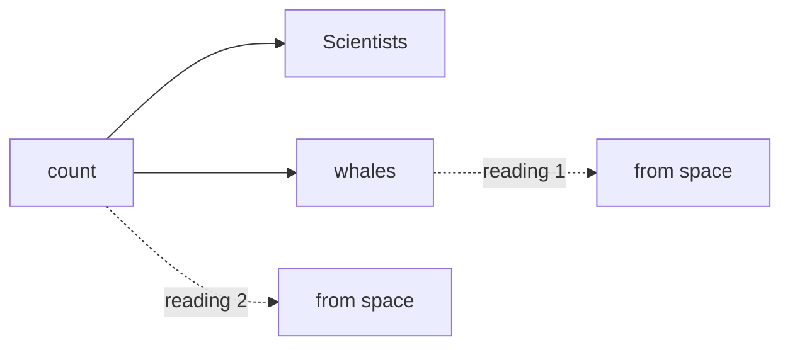
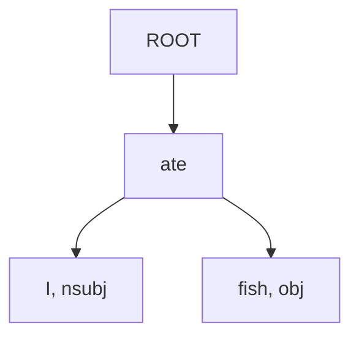
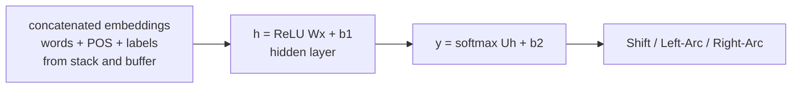

> [!KEY] A dependency parse chooses, for each word, which other word it depends on. The result is a tree that says what modifies what.

## Two views of sentence structure

Linguists describe sentence structure two ways. Phrase structure (constituency) groups words into nested constituents. "the cuddly cat" is a noun phrase. "by the door" is a prepositional phrase containing the noun phrase "the door". Together they build the bigger noun phrase "the cuddly cat by the door" [05:00](ts:05:00).

A context-free grammar writes the rules: NP → Det (Adj)* N (PP)*, PP → P NP, plus part-of-speech rules like Det → "the" and Adj → "large". The Kleene star covers "the large cuddly green cat" [05:44](ts:05:44). Manning builds "talk to the large cuddly dog by the door" this way, then notes this view is not the course's main one [08:13](ts:08:13).

The main view is dependency structure. Every word has a head it depends on. In "Look in the large crate in the kitchen by the door", the head of the sentence is "look". "crate" is what you look in. "large" and "the" modify "crate". "in the kitchen" and "by the door" also modify "crate", each a prepositional phrase attached to the noun [10:20](ts:10:20). No phrase nodes exist. The structure is arrows between words.

The motivation: humans communicate in a linear stream of words but understand hierarchical modification. A model needs the same recovery of what modifies what to interpret language [13:43](ts:13:43). Manning even catches his own constituency diagram misattaching "by the door" and fixes it live [11:29](ts:11:29).

## Ambiguity is the norm

"Scientists count whales from space." Two readings: the counting happens from space, or the whales are from space. The prepositional phrase can attach to the verb or to the noun [15:29](ts:15:29). This is the characteristic ambiguity of English. A prepositional phrase after a noun phrase can attach to any earlier head, and with more such phrases the readings multiply. "The board approved its acquisition by Royal Trustco Limited of Toronto for $27 a share at its monthly meeting" has four PPs in a row. Manning counts 13 readings for four PPs and 27 for five: an exponentially growing series given by the Catalan numbers, C_n = (2n)!/((n+1)!n!) [19:29](ts:19:29). Crossing attachments are forbidden, which is why the count is Catalan-like rather than factorial [21:19](ts:21:19).

More exhibits. Coordination scope: "Shuttle veteran and longtime NASA executive Fred Gregory appointed to board" is one person or two [22:35](ts:22:35). The lesson for parsing: grammar alone cannot choose between readings. Only statistics over who modifies whom can.

Structure also pays off practically. In biomedical text, the pattern "KaiC interacts with SasA" yields a protein-protein interaction fact: "interacts" takes "KaiC" as its subject and "SasA" as its prepositional argument, and coordination extends the fact to KaiA and KaiB [27:35](ts:27:35).

## Dependency grammar

Dependency syntax says structure is binary asymmetric relations: arrows from heads to dependents. The arrows are typed with grammatical relation names: nsubj (nominal subject), obj, obl (oblique), nmod, case, det, aux, conj, cc, appos, flat. In "Bills on ports and immigration were submitted by Senator Brownback, Republican of Kansas", "submitted" is the root, "Bills" its subject, "Brownback" the oblique agent [29:32](ts:29:32). Vocabulary: head is also called governor, dependent is also called modifier. Dependencies form a tree: connected, acyclic, one root. A fake ROOT node is added so every word depends on exactly one node [32:43](ts:32:43).

Arrow direction is a convention, not a fact. Tesnière drew head → dependent, which Manning follows. Others draw dependent → head. Both appear in the literature [38:01](ts:38:01).

The history Manning gives the computer scientists: dependency grammar is ancient, constituency grammar is new. Pāṇini's Sanskrit grammar, composed around the 5th century BCE and transmitted orally for centuries, was a dependency grammar [33:38](ts:33:38). First-millennium Arabic grammarians used dependencies. Phrase structure is a 20th-century invention (Wells 1947, Chomsky 1950s). The Chomsky hierarchy itself was invented to argue about human language: Chomsky wanted to show finite-state grammars could not capture language's complexity [35:17](ts:35:17).

## Treebanks

Hand-written grammars failed twice over. Language has a long tail of creative usage no rule set covers, and ambiguity leaves a bare grammar with no way to choose [40:02](ts:40:02). The field's answer, starting in the late 1980s, was annotated data. Treebanks give reusable labor, broad coverage, frequency statistics for machine learning, and, crucially, a way to evaluate parsers at all. Before treebanks, a "good parser" was a demo that looked right [45:07](ts:45:07).

The Universal Dependencies project now covers 100+ languages with one uniform dependency formalism. Assignment 2 trains on UD-style data: human-annotated dependency trees used as supervision [43:01](ts:43:01).

## What a parser needs to know

Four information sources drive parsing decisions [46:32](ts:46:32):

1. **Bilexical affinities.** "discussion of issues" is plausible. "the" depending on "completed" is not.
2. **Dependency distance.** Most dependencies are short. Long ones exist but are rare.
3. **Intervening material.** Dependencies rarely span verbs or punctuation.
4. **Valency of heads.** "broke" expects a breaker on the left and optionally a thing broken on the right, but not an arbitrary number of arguments.

One structural caveat: dependencies usually nest, but not always. "I'll give a talk tomorrow on neural networks" has "on neural networks" modifying "talk" while "tomorrow" modifies "give": crossing arcs. So does "Who did Bill buy the coffee from yesterday?" Such nonprojective dependencies are real, but the parser in this lecture only builds projective trees [52:42](ts:52:42).

## Transition-based parsing

The parsing method for the assignment is transition-based parsing (Nivre 2003), the greedy descendant of shift-reduce parsing from compilers courses. The parser state is a stack σ (top written to the right, starts with ROOT), a buffer β (top written to the left, starts with the sentence), and a set of arcs A (starts empty). Three actions [54:22](ts:54:22):

1. **Shift:** move the top buffer word onto the stack.
2. **Left-Arc_r:** make the top stack word a dependent of the second, with relation r. Pop the dependent.
3. **Right-Arc_r:** make the second stack word a dependent of the top, with relation r. Pop the dependent.

Parsing "I ate fish": shift "I", shift "ate", left-arc ("I" becomes an nsubj dependent of "ate", popped), shift "fish", right-arc ("fish" becomes an obj dependent of "ate"), right-arc ("ate" becomes a dependent of ROOT). The buffer empties and only ROOT remains: done. Each choice of action builds a different tree. The sequence of choices is the parse [56:56](ts:56:56).

```mermaid
flowchart LR
    S0["stack: ROOT / buffer: I ate fish"] -->|shift| S1["stack: ROOT I / buffer: ate fish"]
    S1 -->|shift| S2["stack: ROOT I ate / buffer: fish"]
    S2 -->|left-arc| S3["stack: ROOT ate / buffer: fish / arc: nsubj ate to I"]
    S3 -->|shift| S4["stack: ROOT ate fish / buffer: empty"]
    S4 -->|right-arc| S5["stack: ROOT ate / arc: obj ate to fish"]
    S5 -->|right-arc| S6["stack: ROOT / arc: root ROOT to ate / DONE"]
```

The algorithm runs in linear time: a fixed number of actions per word, no search, no cubic chart parsing. Nivre's result was that machine learning is good enough to choose each action greedily and still parse accurately [61:26](ts:61:26). Beam search over action sequences can improve accuracy at some cost, but the basic form does no search at all [62:46](ts:62:46).

## From indicator features to neural nets

MaltParser, Nivre's system, chose actions with a discriminative classifier over indicator features: "top of stack is 'good' and its POS is adjective", "second on stack is the verb 'has'", and conjunctions of such facts [63:05](ts:63:05). Conjunctions exploded into millions of features, each seen a handful of times in a million sentences: sparse, incomplete, and expensive. Feature computation, not the classifier, consumed over 95% of parsing time [67:00](ts:67:00).

Evaluation is arc accuracy on gold trees. For "She saw the video lecture": unlabeled attachment score (UAS) counts correct heads (4/5 = 80%). Labeled attachment score (LAS) requires the relation label too (2/5 = 40%) [64:34](ts:64:34).

Chen and Manning (2014) replaced the sparse features with a neural network. Chen was Manning's PhD student and a two-time head TA of the course. The wins are twofold [67:04](ts:67:04):

1. **Distributed representations.** Words, POS tags, and dependency labels each get dense vectors, so "NNS" (plural noun) sits near "NN" (singular noun) and unseen configurations generalize from similar ones.
2. **A nonlinear classifier.** The old linear classifiers (SVM, logistic regression) give linear decision boundaries. The hidden layer re-represents the input so the final softmax can separate what a linear model cannot.

The parser state becomes one concatenated vector. From the stack and buffer positions s1, s2, b1 and the leftmost and rightmost children lc(s1), rc(s1), lc(s2), rc(s2), take each token's word, POS, and label embeddings and concatenate them. Then:

\[ h = \text{ReLU}(Wx + b_1), \qquad y = \text{softmax}(Uh + b_2) \]

y is a distribution over {Shift, Left-Arc_r, Right-Arc_r}. Cross-entropy loss on the correct action backpropagates all the way into the embeddings [71:45](ts:71:45).

Results on English (Stanford Dependencies): Chen and Manning 2014 reaches 92.0 UAS and 89.7 LAS, matching the best graph-based parsers (MSTParser 91.4/88.1, TurboParser 92.3/89.6) while parsing 654 sentences per second. MaltParser manages 89.8/87.2 at 469 sentences per second. The graph parsers do 8 to 10. Dense math beat sparse features on speed too, because the symbolic systems drowned in feature computation.

Google scaled the idea up: deeper networks, tuned hyperparameters, beam search, and CRF-style global inference over the action sequence. The result was SyntaxNet and Parsey McParseface (2016), announced as "the world's most accurate parser": 94.61 UAS and 92.79 LAS [73:16](ts:73:16).

The competing family is graph-based parsing: score every possible dependency (n² of them) and find the best tree with a minimum spanning tree algorithm (McDonald et al. 2005). The neural revival, Dozat and Manning (2017), uses a biaffine scorer over contextual word representations: 95.74 UAS and 94.08 LAS, the most accurate of the era, but slower than greedy transition-based parsing. It ships in Stanza [75:23](ts:75:23).

> [!CAVEAT] The arc-standard transition system in this lecture builds projective trees only. Real languages have nonprojective dependencies. The assignment stays projective. Full systems handle the rest with extra transitions or graph-based methods.

Assignment connection: the second half of assignment 2 has you build exactly the Chen and Manning classifier in PyTorch. The transition machinery is provided. You implement the decision network [01:04](ts:01:04).

> [!INTERVIEW] "How does transition-based parsing work?" Stack, buffer, three actions (shift, left-arc, right-arc), one greedy classification per step, linear time. "Why did neural parsers win?" Dense embeddings killed the sparse indicator-feature bottleneck, which ate 95% of runtime, and the nonlinear hidden layer beat linear classifiers. Know UAS versus LAS.

## Sources

- Video: [Lecture 4: Dependency Parsing](https://www.youtube.com/watch?v=KVKvde-_MYc) (1:18:49)
- Slides: [cs224n-spr2024-lecture04-dep-parsing.pdf](https://web.stanford.edu/class/archive/cs/cs224n/cs224n.1246/slides/cs224n-spr2024-lecture04-dep-parsing.pdf)
- Nivre (2003), transition-based dependency parsing
- Nivre et al. (2008), MaltParser
- Chen and Manning (2014), "A Fast and Accurate Dependency Parser using Neural Networks"
- Dozat and Manning (2017), "Deep Biaffine Attention for Neural Dependency Parsing"
