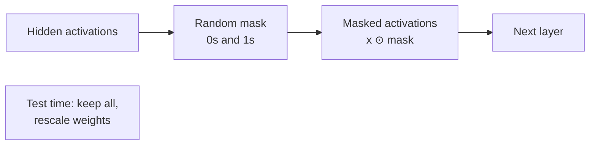
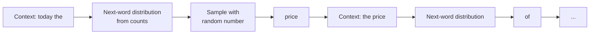

## The 15-year stall

Neural networks were last popular in the 1980s and 1990s, when Hinton and colleagues made backpropagation famous. Nearly every network trained then had one hidden layer. For about 15 years nobody could make more layers work, so the field nearly died. [04:03](ts:243)

The turnaround started around 2006. Hinton, Bengio and colleagues showed that greedy layer-wise pretraining could train deep networks. Bengio, Lamblin, Popovici and Larochelle wrote that deep networks had been "generally found to be not better, and often worse, than neural networks with one or two hidden layers." [05:07](ts:307)

Manning's point is that the fixes were small. Better regularization, careful initialization, better optimizers. None of them looks like deep science. Yet they turned a field stuck for 15 years into the technology behind modern NLP. [07:19](ts:439)

## Overfitting is no longer the enemy

Classically, regularization existed to prevent overfitting. The textbook picture: training error falls, then the model memorizes training quirks and test error rises back up. [10:00](ts:600)

Modern practitioners do not believe that picture. Large networks are trained to near-zero training loss. They memorize the training set, and they still generalize well, provided regularization is done right. [11:12](ts:672)

Classical L2 or L1 regularization is too weak to achieve this. So the field turned to dropout, which appears in Assignment 2. [13:28](ts:808)

## Dropout

At training time, each example is processed with a random binary mask over the hidden layers. The mask is multiplied element-wise (Hadamard product) with the activations. Some inputs are zeroed out, and the mask changes every example. [14:17](ts:857)

At test time nothing is dropped. Weights are rescaled to compensate for the fact that units were missing during training. [15:32](ts:932)

Three ways to understand why it works:

- It prevents **feature co-adaptation**. The model cannot rely on one feature, since that feature may vanish on any training step. It must learn redundant ways to get the job done. [15:56](ts:956)
- It trains an **exponential ensemble**. Every mask defines a sub-network. Training with dropout trains the power set of all sub-networks at once, then averages them at test time. [16:19](ts:979)
- It sits between **Naive Bayes and logistic regression**. Naive Bayes sets each feature weight independently. Logistic regression sets weights in the context of all other features. Dropout sets weights in the context of a random subset of the others. [16:51](ts:1011)

Manning notes a terminology clash: the lecture slides present dropout in its original 2012 form, while Assignment 2 uses the modern deep-learning-framework form. The idea is the same. [13:46](ts:826)



## Four practical rules

Manning closes the neural-net refresher with rules that feed Assignment 2:

- **Vectorize everything.** A for loop in Python is an order of magnitude slower than a matrix operation on CPU, and two to three orders slower than a GPU. Dropout with a mask is a vector operation, not a loop. [17:44](ts:1064)
- **Initialize weights to small random values.** Zero or constant initialization creates symmetries, so every unit learns the same thing. Xavier initialization set the scale from the layer's input and output sizes. Layer normalization later made careful scaling less critical, but randomness itself remains required. [19:13](ts:1153)
- **Use adaptive optimizers.** Plain SGD works, but only with a well-tuned learning rate schedule. Adam accumulates a per-parameter history of gradient scales and adapts the step size. It is the safe default. Adagrad (Duchi et al.) was the early version but stalls too soon. For sparse word-vector updates, the AdamW-style variants are worth trying. [22:06](ts:1326)
- **Remember the details.** Backprop mechanics and the chain rule are assumed. The full derivation is taught in [CS229 Lessons 7 and 8](../../foundations/cs229/l07-neural-networks-1.html).

## Language models

A **language model** is a technical term. It is a system that puts a probability distribution over the next word, given the preceding words. The probabilities over the whole vocabulary sum to 1. [25:05](ts:1505)

Equivalently, a language model assigns a probability to any piece of text. The chain rule makes this possible: the probability of a sequence factors into a product of next-word probabilities. The model supplies each factor. [26:48](ts:1608)

Language models predate ChatGPT by decades. Phone keyboard suggestions and Google query completions are language models. The concept goes back to the 1950s, and language modeling has been central to NLP since the 1980s. [27:41](ts:1661)

## N-gram language models: 1975 to 2012

For nearly 40 years, language models were **n-gram models**. Predict the next word from the previous n minus 1 words. A unigram uses no context, a bigram uses one word, a trigram uses two. The Markov assumption throws away all earlier context. [28:44](ts:1724)

Probabilities come from counting. Count how often "students open their books" occurs in a corpus, divide by the count of "students open their", and that ratio is the estimated probability of "books". [30:39](ts:1839)

Two problems limited this approach:

- **Storage.** The number of n-grams grows exponentially with context size. Practice maxed out at five-grams. Google's famous n-gram release, built on a trillion-word web corpus, stopped at five. [38:05](ts:2285)
- **Sparsity.** Unseen n-grams get probability zero, and a single zero destroys any computation it touches. The fix was **smoothing**: add a small delta (like 0.25) to every count. A second problem was unseen contexts with undefined denominators. The fix was **backoff**, falling back to shorter n-grams until counts exist. [35:24](ts:2124)

N-gram models could already generate text. Feed a trigram model "today the" and sample from its next-word distribution with a random number. The output is mostly grammatical but incoherent: "Today, the price of gold per ton, while production of shoe lasts..." [41:43](ts:2503)



## Fixed-window neural language models

Bengio and colleagues (2000/2003) proposed the first neural language model. Concatenate the word vectors of a fixed context window, pass through a hidden layer, and softmax over the vocabulary. It generalizes better than counts, needs no smoothing, and stores parameters instead of n-gram tables. [44:28](ts:2668)

Two flaws remained. The Markov assumption was still there: context was fixed and short. And each position in the window had its own slice of the weight matrix, so the model relearned the word "students" separately for each position instead of sharing knowledge across positions. [48:39](ts:2919)

The fix needed an architecture that processes any length of input with one shared set of weights. That is a recurrent neural network.

## Recurrent neural networks

An RNN applies the same weights at every time step. At step t it combines the previous hidden state with the current word embedding:

\[h_t = \tanh(W_h h_{t-1} + W_e x_t + b)\]

\[ \hat{y}_t = \mathrm{softmax}(U h_t + c)\]

The hidden state starts at an initial \(h_0\), usually zeros. Each step multiplies the previous state by \(W_h\), the current word embedding by \(W_e\), sums, adds a bias, and applies tanh. The final hidden state feeds a softmax over the vocabulary to predict the next word. [52:06](ts:3126)

Because the same \(W_h\) and \(W_e\) are reused everywhere, the word "students" is processed identically wherever it appears. The model size does not grow with context length. The hidden state is a fixed-size summary of everything seen so far. [55:56](ts:3356)

```mermaid
flowchart LR
    x1[students] --> E1[embed]
    x2[opened] --> E2[embed]
    x3[their] --> E3[embed]
    E1 --> h1[h1]
    E2 --> h2[h2]
    E3 --> h3[h3]
    h1 --> h2
    h2 --> h3
    h3 --> Y[softmax:\nP(next word)]
    W[Same W_h, W_e\nat every step] -.-> h1
    W -.-> h2
    W -.-> h3
```

Advantages: any-length input, constant model size, information from many steps back is theoretically available. Disadvantages: computation is sequential. A for loop over time steps is slow. And in practice the hidden state is dominated by recent words; memory of the distant past fades fast. [56:36](ts:3396)

## Training: teacher forcing

Training reuses the corpus itself as supervision. At each step the model predicts a distribution over next words. The loss is the cross-entropy between that distribution and the actual next word, which equals the negative log probability assigned to the true word. Average over all words in the training set. [58:28](ts:3508)

After scoring a prediction, the model is fed the **true** next word as input, not its own guess. It never free-generates during training. Each step is pulled back to the actual text. This is called **teacher forcing**. It makes training simple, though it means the model never practices recovering from its own mistakes. [62:19](ts:3739)

Two more training facts:

- **Weights repeat, so gradients sum.** \(W_h\) appears at every time step. Its gradient is the sum of the gradient with respect to each appearance. This follows from the multivariable chain rule: copying a matrix creates outward branches, and gradients sum at outward branches. [66:00](ts:3960)
- **Sequences are truncated.** Backpropagating through a billion words is impossible, so training cuts the corpus into segments. Manning uses sentences or documents conceptually, but in practice people cut at fixed lengths (like 100 words) so batches fit a matrix. Backpropagation itself is often **truncated** after about 20 steps to speed training, while the forward pass still uses the full context. [68:05](ts:4085)

Backpropagation through time is credited to Werbos (1988). [slide 43]

## Generating with an RNN

Generation starts from a special start-of-sequence token `<s>`. At each step, sample a word from the softmax distribution, then feed that word back as the next input. Keep rolling until the end-of-sequence token `</s>` appears. This loop is called a **rollout**, and it is exactly how ChatGPT produces answers, with a more complex model underneath. [68:36](ts:4116)

The fun examples: an RNN trained on Obama's speeches generates political-sounding prose. One trained on Harry Potter generates wizard-sounding prose. One trained on recipes generates plausible-looking recipes ("Shape mixture into the moderate oven and simmer until firm"). The best demo is a **character-level** RNN: trained on paint catalogs with the hidden state initialized from a color's RGB values, it invents names like "ghastly pink", "navel tan", and "stoner blue". [71:29](ts:4289)

## Problems with RNNs

The lecture ends with a warning. In theory an RNN remembers everything. In practice its effective memory is short, and gradients are the reason. Thursday's lecture explains vanishing and exploding gradients. [78:41](ts:4721)

> [!KEY] An RNN shares one set of weights across time, which solves the fixed-window inefficiency, but its hidden state is rewritten multiplicatively at every step, so distant information decays.
> [!INTERVIEW] For "how does an RNN language model train," answer: at each step the model predicts a next-word distribution, the loss is the negative log probability of the true next word, the true word is fed back in (teacher forcing), and the gradient for repeated weights sums over time steps.

## Sources

- Video: [Lecture 5: Language Models and RNNs](https://www.youtube.com/watch?v=fyc0Jzr74y4) (1:18:43)
- Slides: [cs224n-spr2024-lecture05-rnnlm.pdf](https://web.stanford.edu/class/archive/cs/cs224n/cs224n.1246/slides/cs224n-spr2024-lecture05-rnnlm.pdf)
- Notes: Official subtitle transcript (en-orig)
