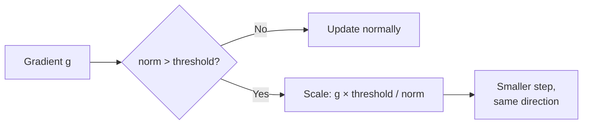
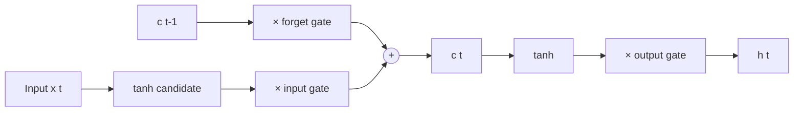
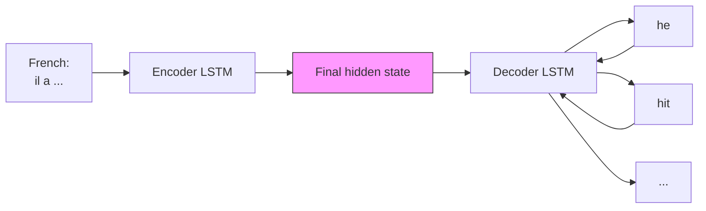

## Perplexity

A language model scores text, and the standard score is **perplexity**. Invert the model's probability at each position, take the product, then take the geometric average. It equals the exponential of the cross-entropy loss. Lower is better. [03:16](ts:196)

The metric is a historical accident. In the late 1970s, IBM's Fred Jelinek found that the AI establishment understood no information theory, so he invented something simpler: a perplexity of 64 is "like rolling a 64-sided die at each word." The name stuck. [05:02](ts:302)

Progress looked like this. Kneser-Ney smoothed n-grams reached perplexity 67. A pure RNN could not beat that, but an RNN combined with a symbolic model reached 51. LSTMs pushed it to 43 and then 30. Modern models reach single digits. [07:04](ts:424)

One caution: compare perplexities only when the log base matches. Traditionally base 2, increasingly natural logs. Different bases give different numbers for the same model. [04:25](ts:265)

## The vanishing gradient problem

Backpropagating through an RNN multiplies partial derivatives at every step. The loss at step t depends on the hidden state at step t minus 1, which depends on t minus 2, and so on. The gradient is a long product of terms like \(\partial h_k / \partial h_{k-1}\). [09:25](ts:565)

Simplify: drop the nonlinearity, so each partial is the matrix \(W_h\). After k steps the gradient contains \(W_h^k\). Now consider the eigenvalues of \(W_h\). If all are below 1, the power shrinks toward zero as k grows. If some exceed 1, it blows up. Only eigenvalues near exactly 1 survive, and that is a measure-zero accident. [12:08](ts:728)

The sketch follows Pascanu et al. (2013), "On the difficulty of training recurrent neural networks." The nonlinearity does not rescue things: a tanh flattening might help exploding but does not fix vanishing. [13:59](ts:839)

Why does this hurt? Consider this text: "When she tried to print her tickets, she found that the printer was out of toner. She went to the stationery store to buy more toner. It was very overpriced. After installing the toner into the printer, she finally printed her ___." A human answers "tickets" with near certainty. The clue sits about 20 words back. With a vanishing gradient the model never learns that dependency, so at test time it guesses from recent words alone. [15:05](ts:905)

The measured damage: a vanilla RNN effectively conditions on about seven tokens back. The n-gram ceiling was five words from sparsity. All the RNN machinery bought roughly three extra words of context. [17:00](ts:1020)

## Exploding gradients and the crude fix

The reverse failure is exploding gradients. A huge gradient times the learning rate produces an enormous update. The model overshoots into a bad region, or into Infs and NaNs, and training must restart from a checkpoint. [17:50](ts:1070)

The accepted solution is embarrassingly simple: **gradient clipping**. Compute the gradient norm. If it exceeds a threshold (5, 10, 20 are typical), scale the whole gradient down before applying the update. Same direction, smaller step. It works, and it is essential in practice. [19:30](ts:1170)

## LSTM: memory you add to

The vanilla RNN's flaw is architectural: the hidden state is **rewritten** multiplicatively at every step. Carrying information forward requires learning weight matrices that mostly preserve the state, which is nearly impossible. The fix: give the network a separate memory that is updated **additively**. [20:59](ts:1259)

This was the **LSTM**, Long Short-Term Memory, proposed by Hochreiter and Schmidhuber in 1997. The name parses as "long" modifying "short-term memory": humans hold recent context for a while, vanilla RNNs held about seven tokens, and the goal was longer short-term memory. A second paper by Gers and Schmidhuber (2000) added the crucial forget gate, which the original lacked. [23:51](ts:1431)

The history is worth knowing. Schmidhuber's group did this foundational work in the late 1990s when almost everyone had abandoned neural networks. Student Alex Graves extended LSTMs and brought them to Hinton's group in Toronto. When Hinton joined Google in 2013, LSTMs entered Google's systems around 2014 to 2016 and became the dominant neural architecture for a few years. [25:35](ts:1535)

## The gates

An LSTM keeps two recurrent states: the hidden state \(h_t\) and the cell state \(c_t\). The cell is the long-term memory, conceptually like RAM. Information moves in and out through **gates**, vectors of values between 0 and 1 computed by a sigmoid, that probabilistically switch dimensions on and off. [28:45](ts:1725)

The three gates:

- **Forget gate** \(f_t\): how much of the previous cell to keep. Manning says it is misnamed. It really computes how much to *remember*. [30:13](ts:1813)
- **Input gate** \(i_t\): how much of the new candidate content to write into the cell.
- **Output gate** \(o_t\): how much of the cell to expose in the hidden state.

The update equations:

\[f_t = \sigma(W_f h_{t-1} + U_f x_t + b_f)\]
\[i_t = \sigma(W_i h_{t-1} + U_i x_t + b_i)\]
\[o_t = \sigma(W_o h_{t-1} + U_o x_t + b_o)\]
\[\tilde{c}_t = \tanh(W_c h_{t-1} + U_c x_t + b_c)\]
\[c_t = f_t \odot c_{t-1} + i_t \odot \tilde{c}_t\]
\[h_t = o_t \odot \tanh(c_t)\]

Each gate equation has the same shape as the vanilla RNN equation, so in practice all four are computed in one big matrix multiply. The cell update is the heart of it: erase some of the old cell with the forget gate (Hadamard product), add some new content with the input gate. [34:41](ts:2081)

Why does this fix the gradient? The cell update is **additive**. Set the forget gate to 1 and the input gate to 0, and the cell passes its content forward unchanged, indefinitely. Gradients flow back along that addition path without repeated multiplication, so they neither vanish nor explode. The hidden state \(h_t\) still does double duty: part predicts the current word, part stores information for the future. The output gate controls which part of the cell is visible for prediction. [41:35](ts:2495)

The same additive trick generalizes. Deep feedforward networks suffered the same gradient problem, and the answer was direct connections: **residual networks** add the input around a layer, **DenseNets** connect every layer to every later layer, and **HighwayNets** gate the skip, like an LSTM gate turned vertical. [45:49](ts:2749)

## What RNNs are good for

Once gated RNNs exist, they apply to any sequence task:

- **Sequence tagging**: part-of-speech tags or named entities, one label per position.
- **Sentence classification**: run the LSTM, then classify from the final hidden state, or better, from the mean or element-wise max over all hidden states.
- **Conditional language models**: generate text conditioned on other information, like speech audio or a source sentence. [48:27](ts:2907)

Two structural upgrades:

- **Bidirectional LSTMs** run one LSTM forward and one backward, then concatenate the states at each position. Each word's representation sees both sides. They are for encoding only: you cannot generate left-to-right with a backward pass. [51:51](ts:3111)
- **Stacked LSTMs** add layers of hidden states for more feature-extraction power. Two layers helped a lot. Three or four were iffy. Modern transformers went much deeper, but that is a later story. [53:14](ts:3194)

Manning names the **GRU** as another gated-RNN flavor but does not detail it in this lecture. [uncertain: the lecture never returns to GRU mechanics. Treat the LSTM equations above as the canonical gated design.]

## Machine translation: where NLP began

Machine translation predates both AI and NLP. In the early 1950s, computers were built for artillery tables and code-breaking, and the Cold War created demand to read the other side's science. Translation looked like code-breaking. Huge funding flowed in, and after impressive cooked demos the effort flopped: nobody understood language structure and the machines were laughably weak. [55:51](ts:3351)

MT revived in the 1990s as **statistical machine translation**. Google Translate's launch showed the world phrase-based SMT. The model split \(P(\text{translation} \mid \text{source})\) with Bayes' rule: a simple word-to-word translation model times a pure target-language model that handled word order and grammar. [59:00](ts:3540)

SMT had a characteristic failure. A sentence from *Guns, Germs, and Steel* translated from Chinese: the Aztec empire "with a population of a few million" came out as millions of people conquering the Aztec empire. The system could not track which noun a modifier attached to. Progress on BLEU scores stalled from about 2005 to 2015. [62:19](ts:3739)

## Seq2seq neural machine translation

In 2014 the field switched to **neural machine translation**: one end-to-end network. The architecture is **sequence-to-sequence**: an encoder LSTM reads the source sentence and builds a hidden state, and a decoder LSTM with different parameters starts from that state and generates the translation word by word. [66:06](ts:3966)

At training time the data is parallel text. For each decoder position the model predicts a distribution, scores the actual next word, and backpropagates the average loss through both decoder and encoder. One loss function, one backward pass, all parameters aligned to the final task. [70:04](ts:4204)

This is a **conditional language model**: it computes \(P(y \mid x)\), a language model over translations conditioned on the source sentence. Encoder-decoder structure survives into the transformer era for translation, summarization, and speech. [72:05](ts:4325)

The result was NLP's first deep learning triumph. Statistical MT had absorbed a decade of work by hundreds of people and millions of lines of language-specific hacks. A comparatively small NMT system beat it, and within two years Google deployed it as the live system. Microsoft, Facebook, Tencent, and Baidu all followed. [73:41](ts:4421)

## Decoding: beam search (background)

The lecture does not cover decoding, but any NMT system needs it, so here is the standard method. At each step the decoder outputs a distribution, but picking the single most likely word (greedy decoding) can strand the search in a locally good but globally bad path. **Beam search** keeps the top-k partial translations (the beam) at each step, extends each with the top next words, and prunes back to k. With k = 1 it reduces to greedy decoding. Wider beams explore more but cost more compute, and beyond a point quality degrades, so k = 4 to 10 is typical.

> [!KEY] Vanishing gradients limited vanilla RNNs to about seven tokens of context. The LSTM's additive cell update fixes gradient flow, and the same additive idea later fixed deep feedforward networks via residual connections.
> [!INTERVIEW] For "why did LSTMs matter," give the two-part answer: the vanishing gradient proof sketch (repeated multiplication by \(W_h\), eigenvalues below 1 shrink the signal), and the LSTM fix (additive cell update plus gates, so information and gradients pass through unchanged). Then name the interview-relevant descendant: residual connections apply the same idea vertically.

## Sources

- Video: [Lecture 6: LSTMs and Neural Machine Translation](https://www.youtube.com/watch?v=Ba6Fn1-Jsfw) (1:17:01)
- Slides: [cs224n-spr2024-lecture06-fancy-rnn.pdf](https://web.stanford.edu/class/archive/cs/cs224n/cs224n.1246/slides/cs224n-spr2024-lecture06-fancy-rnn.pdf)
- Notes: Official subtitle transcript (en-orig)
