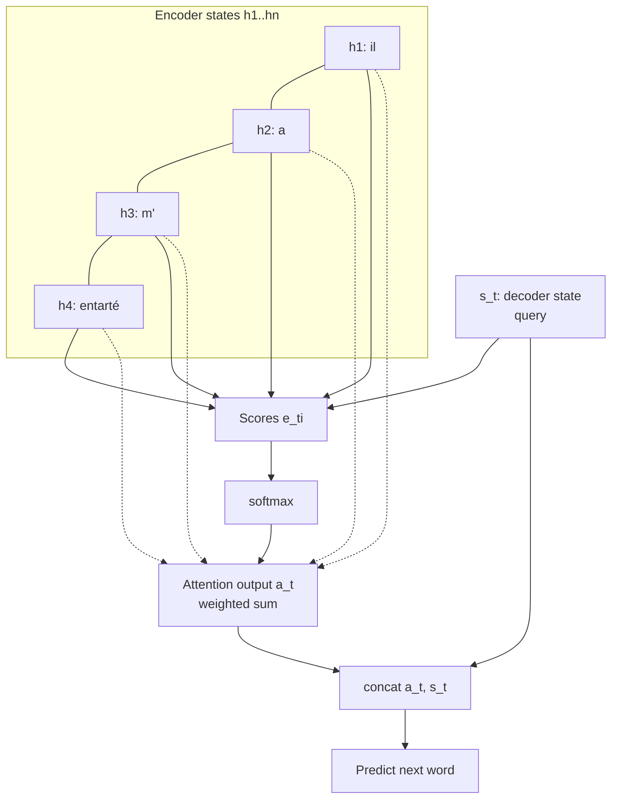
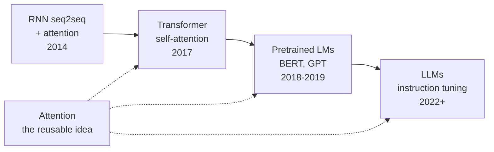

## BLEU: judging translations automatically

Before attention, the lecture finishes machine translation with evaluation. Human judgment is the gold standard, but humans are slow and expensive. The field needed an automatic score for fast iteration. IBM's answer was **BLEU** (Bilingual Evaluation Understudy), Papineni et al., 2002. [02:11](ts:131)

BLEU compares a machine translation against one or more human reference translations. It counts overlapping n-grams of lengths 1 through 4 between the candidate and the references, wherever they occur. Four is not special. It was a reasonable length. A **brevity penalty** punishes translations that are too short, since otherwise a system could translate only the easy words and score high precision. [07:30](ts:450)

BLEU is crude in both directions. A good translation can score poorly if its word choices differ from the references. A bad translation can score points for matching words that play the wrong role in the sentence. Longer n-grams mitigate this, since matching four words in a row usually means using them correctly. Assignment 3 has students think through these flaws. [04:51](ts:291)

Scores run 0 to 100 but never reach 100, since translation has many valid answers. Rough calibration: the 20s mean you can tell what the source said. The 30s and 40s are much better, and modern systems reach the 50s and 60s. [08:11](ts:491)

The BLEU graph tells the field's story. Phrase-based statistical MT made barely any progress from 2005 to 2015 despite ever-larger n-gram language models. Syntax-based MT, Manning's own research area in the late 2000s, had only slightly more slope. Then neural MT arrived: first attempts in 2014, evaluated in 2015, better than everything by 2016, on a much steeper curve that continued through 2019 and beyond. [08:39](ts:519)

## Attention: the bottleneck fix

Everything in neural networks so far had been invented before 2000. Attention was genuinely new, invented in 2014 in the first neural machine translation work. The inventors were Bahdanau, Cho, and Bengio at the University of Montreal. [12:03](ts:723)

The motivation was the seq2seq **bottleneck**. The encoder stuffed an entire source sentence into one hidden state, then the decoder generated from it. That is implausible for a 40-word sentence. A human translator does not memorize the sentence and then write. She reads, starts translating, and looks back at the source as needed. Attention gives the network the same ability: on each decoder step, connect directly to the encoder and look at particular source words. [13:13](ts:793)

The idea generalizes. Attention is a technique that, given a set of vector **values** and a vector **query**, computes a weighted sum of the values depending on the query. In seq2seq MT, each decoder hidden state is the query attending to all encoder hidden states, the values. [27:33](ts:1653)

## How attention works

At decoder time step t, the decoder hidden state \(s_t\) is the query. Compare it with every encoder hidden state \(h_i\) to get an attention **score** \(e_{ti}\) for each source position. Softmax the scores into an attention **distribution** \(\alpha^t\), a probability distribution over source positions. Take the weighted sum of encoder states to get the attention **output** \(a_t\), sometimes called the context vector. Concatenate \(a_t\) with \(s_t\), and predict the next word from that combined vector. [19:08](ts:1148)

\[e_{ti} = s_t^\top h_i \qquad \text{(basic dot-product score)}\]
\[\alpha^t = \mathrm{softmax}(e^t)\]
\[a_t = \sum_i \alpha^t_i h_i\]
\[P(y_t \mid y_{<t}, x) = \mathrm{softmax}(W [a_t, s_t] + b)\]

The walkthrough: translating French "il a m'entarté" to "he hit me with a pie", the first decoder step attends almost entirely to "il" and generates "he". Each later step shifts attention to the relevant source word. The network discovers word alignment by itself. Nobody trained an aligner. [16:02](ts:962)

Attention earned its place for four reasons:

- **Better results.** Montreal's attention model beat Google's pure 8-layer LSTM system with a university-scale compute budget. Every NMT system since has used attention. [21:47](ts:1307)
- **No bottleneck.** The decoder uses the full encoder representation as needed instead of compressing it into one vector. [23:06](ts:1386)
- **Shorter gradient paths.** Direct connections from decoder to every encoder state shortcut the long recurrent chain, easing the vanishing gradient problem the same way residual connections do. [23:24](ts:1404)
- **Interpretability.** Inspecting the attention distribution shows what the model translates at each step. Soft alignment emerges for free. [23:42](ts:1422)

## Attention variants

The score function is where the variants live:

- **Dot-product attention**: \(e_{ti} = s_t^\top h_i\). Simple, but it forces the encoder and decoder states to match dimension by dimension, and the decoder state carries many kinds of information beyond "what should I translate now." [26:00](ts:1560)
- **Multiplicative (bilinear) attention**: \(e_{ti} = s_t^\top W h_i\), with a learned matrix \(W\) (Luong, Pham, and Manning, 2015). Manning prefers the name "bilinear." The matrix learns which dimensions of the decoder state match which dimensions of the encoder state. His group found it worked better than the original for their tasks. [27:14](ts:1634)
- **Reduced-rank multiplicative attention**: \(e_{ti} = s_t^\top U^\top V h_i = (U s_t)^\top (V h_i)\). Factor the big matrix into two skinny ones to cut parameters. Equivalently: project both vectors into a low-dimensional space, then take the dot product there. Manning flags this as the version to remember: transformers do exactly this. [29:43](ts:1783)
- **Additive attention**: \(e_{ti} = v^\top \tanh(W_1 s_t + W_2 h_i)\) (Bahdanau, Cho, and Bengio, 2014). A small feed-forward network computes the score. "Additive" is a bad name, Manning says. It is really a little neural net. Slower and more complex than the multiplicative forms, though a large architecture search (Britz et al., 2017) found it best under careful tuning. In practice the dot-product family won, and that is what transformers use. [31:26](ts:1886)

A student asked whether attention needs positional information. Manning's answer: no. Each encoder state is computed recurrently from the previous one, so it already knows its position and the past. Positional encoding becomes necessary only with transformers, which drop recurrence entirely. [35:21](ts:2121)

## The path to LLMs

The lecture's second half steps back to the big picture. Deep learning NLP went through a sea change:

- **Old deep learning (2010 to 2018):** the work was inventing architectures. A typical paper added attention in a new place or a new layer, and a typical CS224N project built a system from scratch that neared the state of the art.
- **New deep learning (2019 to 2024):** the architecture is fixed by downloading a pretrained model. The action moved to fine-tuning, domain adaptation, prompting, and in-context learning. [71:13](ts:4273)

The course follows this arc. Thursday's lecture starts transformers, where attention stops being a side connection in an RNN and becomes the architecture itself: self-attention, with queries, keys, and values all projected into low-dimensional spaces and dotted together. The default final project is a **minBERT**: finish a minimal BERT implementation, fine-tune it for sentiment analysis, then extend it. [43:29](ts:2609)

Manning is blunt about compute. The GPU shortage meant no generous cloud grants that year. Students patch together $50 GCP credits, Colab (or $10/month Colab Pro), Kaggle notebooks, cheap providers like Modal and Vast AI, and $50 of Together AI API credit for hosted models. The lesson: match the model to the question. A 7B model on Together processes a huge number of tokens for $50. A much larger model burns the same budget orders of magnitude faster. [48:46](ts:2926)

His research advice survives the era change. A project is judged by its value-add, not by the model it downloaded: what did you do beyond running something good and showing it works? Always have a baseline, even a seat-of-the-pants one like averaging word vectors, and beat it. Know your data and your evaluation before the proposal deadline. And follow the interesting problems in your own world rather than chasing leaderboard points on someone else's. [38:26](ts:2306)

For this learning system, the bridge is explicit: transformers, pretraining, and everything after are taught from the systems side in CS336. CS224N's unique contribution is the history that explains why transformers look the way they do. Attention was the idea that survived the RNN era.

> [!KEY] Attention solved the seq2seq bottleneck by letting the decoder look back at the source, and its score-softmax-weighted-sum pattern became the reusable primitive of all modern architectures.
> [!INTERVIEW] For "where was attention invented," answer: Bahdanau, Cho, and Bengio, 2014, for neural machine translation at the University of Montreal, to fix the single-vector bottleneck of encoder-decoder RNNs. Know the four score variants and why the reduced-rank multiplicative form previews transformers: project both sides low, then dot.

## Sources

- Video: [Lecture 7: Attention and Final Projects](https://www.youtube.com/watch?v=J7ruSOIzhrE) (1:17:36)
- Slides: [cs224n-spr2024-lecture07-final-project.pdf](https://web.stanford.edu/class/archive/cs/cs224n/cs224n.1246/slides/cs224n-spr2024-lecture07-final-project.pdf)
- Notes: Official subtitle transcript (en-orig)
