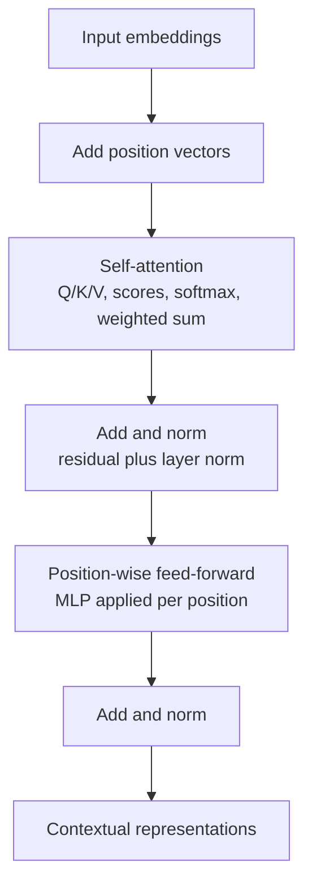
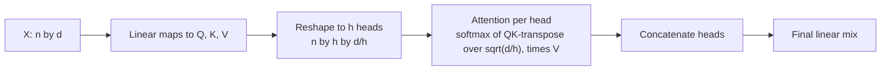
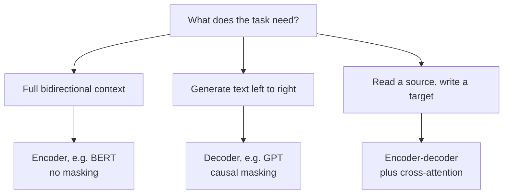

This is a bridge lesson. [CS336 Lesson 4](../../foundations/cs336/l04-attention-alternatives-moe.html) covers the transformer block in full mechanical detail. This lesson covers what CS224N adds: the NLP motivation, why recurrence had to go, and how encoder, decoder, and encoder-decoder variants map to language tasks.

## Why recurrence failed on language

The pre-transformer recipe worked well. A bidirectional LSTM encoded the sentence. A unidirectional LSTM decoded the output. Attention gave the decoder flexible access to the encoder states. [02:38](ts:02:38)

Goldie names two problems with recurrence. The first is linear interaction distance. An RNN unrolls left to right, so nearby words interact fast ("tasty pizza") but distant words pay one RNN step per token between them. In "the chef who went to the stores and picked up the ingredients and loves garlic ... was", the gradient must travel from "was" all the way back to "chef" through every intermediate step. LSTMs help, but the problem remains. [04:39](ts:04:39)

The second is dependence on time. The forward and backward passes need O(sequence length) unparallelizable operations. You cannot compute the hidden state at step 5 before step 4. GPUs, which excel at parallel work, sit idle waiting on the chain. [07:22](ts:07:22)

A student asks the natural question: does attention not already fix the distance problem? Yes for distance, no for parallelization. The rest of the lecture keeps attention and drops recurrence entirely. [09:07](ts:09:07)

## Attention as a soft lookup

Think of attention as a fuzzy key-value store. A Python dict matches a query to one key exactly and returns its value. Attention matches the query to all keys softly: compute a similarity, normalize with softmax, and return the weighted sum of the values. [11:50](ts:11:50)

Self-attention runs this lookup inside a single sentence. To represent "learned" in "I went to Stanford's CS224N and learned", the query from "learned" softly matches the keys of every word in the sentence and pulls in their values. [13:48](ts:13:48)

Because each word attends to all others in one parallel operation, both RNN problems vanish. Words interact no matter how far apart they are, and no left-to-right chain blocks parallelization. [11:04](ts:11:04)

## The math

Embed each word with the embedding matrix, as in earlier lessons. Then transform each embedding with three learned matrices: Q for queries, K for keys, V for values. [14:38](ts:14:38)

The score between word i and word j is the dot product of query i and key j. Softmax over j gives the attention weights. The output for word i is the weighted sum of all value vectors. [16:19](ts:16:19)

Why separate Q and K matrices, when Q-transpose-K looks like one matrix in the middle? Two answers. It is a low-rank approximation, which is cheaper. And it gives the model freedom: with Q and K learned separately, the model can decide whether a word should attend to itself or not. [18:47](ts:18:47)

On a GPU, stack the sequence into one n-by-d matrix X. Compute XQ, XK, XV with three big multiplies. Scores come from one more multiply, then softmax, then multiply by XV. Same math, no Python loop over positions. [45:29](ts:45:29)

## Three fixes that make it a building block

Raw self-attention cannot replace an RNN yet. Goldie adds three pieces and calls the result the minimal self-attention building block. [41:36](ts:41:36)

**Fix 1: position.** Self-attention is a set operation. "Zuko made his uncle" and "his uncle made Zuko" produce identical representations, which is wrong. The fix is to add a position vector to each input embedding, once at the input. Two flavors exist: sinusoidal positions (sine and cosine at different periods per dimension) and learned positions (a d-by-n matrix, one vector per index). Learned positions cannot handle sequences longer than n, and this limit still bites in practice: a large model fits a few thousand words, not a novel. Attention also costs O(n squared) memory, which is the deeper reason long contexts are hard. [21:35](ts:21:35) [24:12](ts:24:12) [25:57](ts:25:57) [28:05](ts:28:05)

**Fix 2: nonlinearity.** Stacked self-attention is just repeated averaging of value vectors. The fix is a position-wise feed-forward network: each position's attention output passes independently through a small MLP. This adds the usual deep learning expressivity and packs in computation that parallelizes well. [30:34](ts:30:34)

**Fix 3: masking.** Language modeling and translation must not let a word see the future, or training becomes trivially easy and the model learns nothing. Restricting the key and value sets per position would kill parallelization. Instead, compute the full n-by-n score matrix and set future positions to negative infinity before the softmax. [32:56](ts:32:56)

Mask only where the task demands it. In machine translation, the encoder reads the source sentence unmasked so every word sees every other word, while the decoder generates under the mask. This mirrors the old bidirectional versus unidirectional LSTM distinction. [35:18](ts:35:18)

## Multi-head attention

One attention pass forces a word to look at the sentence for one reason. Real words need several reasons at once: "learned" might attend to "Stanford CS224N" for entity information and to "I went" for syntactic structure. Multi-head attention runs h independent Q/K/V projections, each down to d/h dimensions, applies attention h times, concatenates the results, and mixes them with a final linear map. [42:25](ts:42:25) [48:01](ts:48:01)

It costs no more than single-head attention. Reshape XQ into an (n, h, d/h) tensor and treat the head axis like a batch dimension. Nothing forces heads to differ. They specialize through symmetry breaking. Studies find heads for syntactic dependencies or global averaging, with plenty of redundancy. Blocks do not share parameters, head count stays constant across blocks, and practitioners scale heads so each keeps on the order of 64 dimensions. [49:45](ts:49:45) [52:36](ts:52:36) [55:16](ts:55:16)

## Optimization pieces

Scaled dot-product attention divides scores by the square root of the head dimension. Without it, dot products of large random vectors start huge, the softmax saturates, and gradients die at initialization. [56:35](ts:56:35)

Residual connections add each sublayer's input to its output. Gradients flow through the identity path even when the sublayer's gradients vanish, and at initialization each block looks roughly like the identity function. [57:54](ts:57:54)

Layer normalization standardizes each word vector independently: subtract its mean, divide by its standard deviation, over the d dimensions of that one vector. Statistics are not shared across positions or across the batch, which is the whole point relative to batch normalization. [60:46](ts:60:46) [65:16](ts:65:16)

One decoder block is then: masked multi-head attention, add and norm, feed-forward, add and norm, repeated for the depth of the network. [66:50](ts:66:50)

## Three architectures

The decoder builds language models: causal masking everywhere. The encoder is nearly identical but drops the mask, giving bidirectional context for classification and fill-in-the-blank tasks. The encoder-decoder is the original "Attention Is All You Need" design: the encoder reads the source, and the decoder adds cross-attention, where queries come from the decoder states and keys and values come from the encoder output. [69:30](ts:69:30) [69:56](ts:69:56)

## Results and open problems

The original transformer matched or beat LSTM translation quality while training far faster through parallelization. That efficiency then unlocked pretraining on massive data, which is the subject of the next lesson. [72:46](ts:72:46)

Three research directions remain open. The O(n squared) per-block cost makes very long sequences infeasible. RNNs were linear here, so this is a genuine step back. Absolute position indices are a crude representation of order. And despite many proposed variants, the original architecture plus small changes remains roughly the best known design. [74:08](ts:74:08) [76:15](ts:76:15)

> [!KEY] Attention replaces recurrence by removing the two things RNNs could not do: interact across arbitrary distance and parallelize across positions. Everything else in the transformer (positions, feed-forward, masking, multiple heads, residuals, normalization) exists to make that replacement work.
> [!PROF] Goldie frames the lecture as building a "minimal self-attention building block" rather than presenting the transformer as received wisdom, and stresses it is not the endpoint: think about what is wrong with it. [41:36](ts:41:36)
> [!INTERVIEW] When asked why transformers replaced RNNs, give the two failures first: linear interaction distance (gradients crossing every intermediate token) and O(n) unparallelizable steps. Then describe attention as a soft key-value lookup and name the three fixes: position encodings, position-wise feed-forward, causal masking.

## Assignment connection

Assignment 4 (machine translation with RNNs, due a week after this lecture) still uses the old recipe. Assignment 5 moves to transformers and draws on this lecture plus the pretraining lecture. [01:08](ts:01:08) [01:13](ts:01:13)

## Sources

- Video: [Lecture 8: Self-Attention and Transformers](https://www.youtube.com/watch?v=LWMzyfvuehA) (1:17)
- Slides: cs224n-spr2024-lecture08-transformers.pdf (official, via web.stanford.edu)
- Notes: Official subtitle transcript (en-orig)
- For the full block mechanics and attention variants: [CS336 Lesson 4](../../foundations/cs336/l04-attention-alternatives-moe.html)
