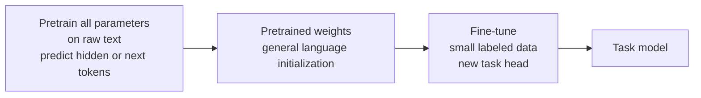
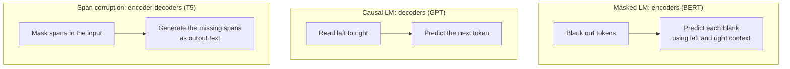

This is a bridge lesson. [CS336 Lessons 9 and 11](../../foundations/cs336/l09-scaling-laws-1.html) cover scaling laws and training mechanics in depth. This lesson covers the NLP side: how text becomes tokens, the three pretraining objectives matched to three architectures, and what a model actually learns linguistically from predicting missing words.

## From words to subwords

Earlier lessons assumed a finite vocabulary: each distinct string gets its own embedding, and unseen strings collapse to a single unknown token. That breaks on morphology. English is mild, but a Swahili verb table holds over 300 conjugations, and giving each an independent vector wastes capacity and ignores their shared structure. [02:08](ts:02:08) [04:45](ts:04:45)

The fix is subword modeling. Start from characters, repeatedly merge the most frequent adjacent pair into a new vocabulary item, and stop at the desired vocabulary size. Common words like "hat" survive as whole tokens. "tasty" splits into pieces like "taa", "aaa", "sty". At inference time, split each word into the fewest possible pieces, preferring longer matches because sequence length is the binding constraint in transformers. The model never knows which tokens were whole words. All are just indices into the embedding matrix. [06:17](ts:06:17) [07:36](ts:07:36) [14:20](ts:14:20)

## Contextual meaning

The course opened with the distributional hypothesis: you shall know a word by the company it keeps. Word2vec implemented this with one vector per string, so "record" the noun and "record" the verb share a single muddled representation. [15:05](ts:15:05)

Pretraining replaces that with contextual representations. The input still has one embedding per subword, but the transformer on top returns a different vector for each occurrence depending on its context. The old paradigm pretrained only the embeddings and initialized the rest of the network randomly. The new paradigm pretrains every parameter. [15:57](ts:15:57) [17:27](ts:17:27)

## Pretraining is reconstructing the input

Every pretraining objective is the same idea: take human-written text, hide part of it, and train the network to reconstruct what was hidden. The hidden part becomes a free label. To fill blanks well, the model must learn about language and the world. Manning walks a ladder of examples: [19:37](ts:19:37)

- Syntax: "I put __ fork down on the table" admits only certain word classes in the blank.
- Coreference: "the woman walked across the street checking for traffic over __ shoulder" requires linking "her" to "woman".
- Semantics: "I went to the ocean to see the fish, turtles, seals and __" requires a member of the right class.
- Sentiment: "the movie was __" reveals the writer's attitude, which later transfers to sentiment analysis.
- World knowledge: "Stanford University is located in __" teaches geography.
- Physical reasoning: "Zuko left the __" (the kitchen) requires tracking locations across sentences.
- Pattern completion: even a Fibonacci sequence tests whether the model learned the rule. [20:34](ts:20:34) [24:19](ts:24:19)

## The pretrain, fine-tune paradigm

Step one: train on next-word or missing-word prediction over trillions of words of raw text, and keep all the weights. Step two: take a small labeled dataset for the task you care about, swap on a task head, and continue training from those weights. This works dramatically better than training from scratch, for two reasons. The labeled data is orders of magnitude scarcer than raw text (millions of words versus trillions), and a narrow task like sentiment analysis cannot teach the generality that language modeling does. [24:49](ts:24:49) [32:25](ts:32:25)

Why does the starting point matter so much? Gradient descent from the pretrained weights stays relatively close to them, landing in a valley that inherits the generality of pretraining. Optimization researchers still study why this works. Practitioners just use it. [30:11](ts:30:11)

## Three architectures, three objectives

Encoders get bidirectional context, so plain language modeling would be trivial: the model could just copy the next word. Instead, encoders train on masked language modeling. Corrupt the input by blanking tokens, then predict the originals using full context on both sides. Only the masked positions produce loss and gradients. [36:06](ts:36:06) [37:20](ts:37:20)

BERT (Devlin et al., 2018) popularized this. It masks 15 percent of subword tokens, and of those, predicts the true word 80 percent of the time, a random word 10 percent, and the unchanged word 10 percent, so the model also builds good representations of unmasked words. BERT added position and token embeddings plus segment embeddings marking two text spans, a special CLS token, and a next-sentence-prediction task asking whether span B truly follows span A. Later work (RoBERTa) showed next-sentence prediction was unnecessary, partly because it halved the effective context length, and that longer training on more text mattered more. Span masking, blanking whole contiguous spans instead of random tokens, beats single-token masking because single subwords are too easy to guess. [41:06](ts:41:06) [43:22](ts:43:22) [45:10](ts:45:10) [54:31](ts:54:31) [54:55](ts:54:55)

BERT came in 110M and 340M parameter sizes, trained on a few billion words. Fine-tuning it fit on a single GPU. Its limitation is structural: it fills blanks well but has no natural way to generate text left to right. [52:08](ts:52:08) [53:37](ts:53:37)

Encoder-decoders split the difference. T5's span corruption masks spans in the input and generates the missing spans as output text, combining bidirectional reading with autoregressive generation. This suited translation-style tasks, and it produced a striking effect: after pretraining plus a little trivia fine-tuning, the model answered new trivia questions from knowledge stored during pretraining, fluently but frequently wrong. [58:51](ts:58:51) [61:08](ts:61:08)

Decoders train on plain next-token prediction and dominate today. GPT (2018) was a 12-layer decoder with 117M parameters, 768-dimensional states, and a 40k subword vocabulary trained on the BooksCorpus. GPT-2 scaled to 1.5B parameters and showed surprisingly coherent generation. GPT-3 reached 175B parameters on 300B tokens and displayed in-context learning: given a few translation pairs in the prompt, it continued the pattern with no weight updates. Chain-of-thought prompting pushed further by showing the model worked examples with intermediate reasoning steps. [64:15](ts:64:15) [65:49](ts:65:49) [67:22](ts:67:22) [71:46](ts:71:46)

Manning is candid that these large-model abilities surprised everyone. Whether in-context learning reflects genuine task learning or pattern matching over memorized training data remains open research. He also notes the Chinchilla result from DeepMind: GPT-3 was comically oversized, and a model under half its size trained on far more data performed better, which reframed how to spend a training budget. The full scaling analysis lives in [CS336 Lessons 9 and 11](../../foundations/cs336/l09-scaling-laws-1.html). [68:42](ts:68:42) [70:58](ts:70:58)

## Fine-tuning: full versus light

Full fine-tuning updates every parameter. The lightweight alternative freezes most of the network and trains a small diff, preserving the generality of pretraining while cutting gradient and optimizer-state costs. Two instances exist. Prefix tuning prepends trainable pseudo-word vectors to the input and trains only them. Low-rank updates freeze each weight matrix and learn a small low-rank delta added to it. When you have abundant data for your target domain, a three-stage recipe often wins: pretrain broadly, continue pretraining on unlabeled domain text, then fine-tune with labels. [55:45](ts:55:45) [56:32](ts:56:32) [58:21](ts:58:21) [76:23](ts:76:23)

## Evaluation and limits

During training, perplexity is the cheap proxy, and better perplexity correlates with better downstream performance. For generality claims, the community built benchmark suites of hard tasks: paraphrase detection, sentiment, grammaticality judgments, semantic similarity, natural language inference. Before pretraining, each task had its own hand-designed architecture. BERT replaced all of them with one transformer plus fine-tuning, which Manning describes as a sea change for the field. [29:00](ts:29:00) [48:16](ts:48:16) [49:35](ts:49:35)

Two limits close the lecture. Pretraining teaches biases as readily as facts: the same objective that learns syntax also learns and amplifies racism and sexism from web text. And data is unevenly distributed: English has trillions of words, but most of the world's roughly 7,000 languages have far too little text for this recipe, which needs no labels but still needs raw text. [73:58](ts:73:58) [27:42](ts:27:42)

> [!KEY] Pretraining turns raw text into free labels by hiding part of the input and demanding reconstruction. The model that fills blanks well must learn syntax, reference, meaning, and facts along the way, and those learned weights become the starting point for every downstream task.
> [!PROF] Manning stresses that the pretrain-then-fine-tune split is really about data scale: you have trillions of words of raw text and maybe a million words of labels, so the general knowledge has to come from the unlabeled side. [32:25](ts:32:25)
> [!CAVEAT] Fluent does not mean right. T5's implicit trivia retrieval produced fluent, reasonable-looking answers that were frequently wrong, a preview of hallucinations in later chat models. [61:57](ts:61:57)
> [!INTERVIEW] When asked what pretraining teaches, walk the blank-filling ladder: syntax, coreference, semantics, sentiment, world knowledge. Then name the three architecture-objective pairs: masked LM for encoders (BERT), span corruption for encoder-decoders (T5), next-token prediction for decoders (GPT).

## Assignment connection

Assignment 5 covers the transformers lecture and this lecture, with a smaller component from the language generation lecture. [00:44](ts:00:44)

## Sources

- Video: [Lecture 9: Pretraining](https://www.youtube.com/watch?v=DGfCRXuNA2w) (1:19)
- Slides: cs224n-spr2024-lecture09-pretraining-updated.pdf (official, via web.stanford.edu)
- Notes: Official subtitle transcript (en-orig)
- For scaling laws and training mechanics: [CS336 Lesson 9](../../foundations/cs336/l09-scaling-laws-1.html)
