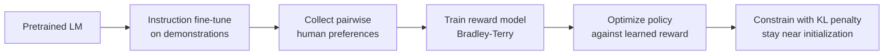
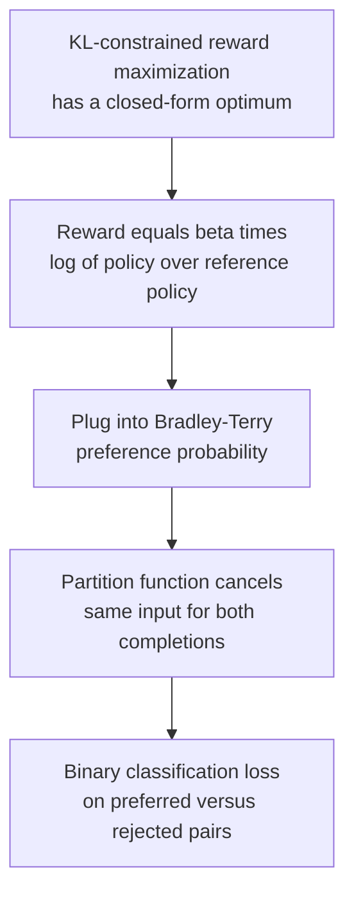

This is a bridge lesson. [CS336 Lessons 15 and 16](../../foundations/cs336/l15-post-training-sft-rlhf.html) cover SFT data, PPO mechanics, and RLVR in depth. This lesson covers the NLP angle: how prompting unlocked capabilities, how we evaluate instruction following, and the DPO derivation that made preference optimization accessible.

## What pretraining actually learned

Scale first. Pretraining compute has grown from 10^24 to well above 10^26 FLOPs, and recent models like Llama 3 trained on roughly 15 trillion tokens. Nobody hears trillions of tokens in a lifetime. [01:06](ts:01:06) [01:30](ts:01:30)

The next-token loss teaches more than syntax and facts. Sharma gives the Pat example: given a story about a physicist predicting a bowling ball and leaf land together, the model completes it one way. Change the last line to say Pat has never seen the demonstration, and the completion changes to match what a naive observer would predict. To predict text like that, the model needs a working model of agents, their beliefs, and their actions. Similar evidence comes from code completion and math. The pretrained model is already a strange general-purpose multitask system. Post-training is about aiming it. [02:53](ts:02:53) [04:06](ts:04:06) [05:16](ts:05:16)

## Zero-shot and few-shot learning

GPT-1 (2018) was a 12-layer decoder trained on 4.6 GB of text with 117M parameters. GPT-2 scaled the same recipe to 1.5B parameters and 40 GB of text, and a new behavior emerged: zero-shot task performance. These models only complete text, so you coax them into tasks by framing the task as completion. Paste a news article and append "TL;DR" and the model summarizes, because internet text after "TL;DR" is usually a summary. To resolve "the cat could not fit into the hat because it was too big", substitute "cat" and "hat" and compare log probabilities. No task-specific training, yet state of the art on many tasks. [07:16](ts:07:16) [08:42](ts:08:42) [09:31](ts:09:31) [10:25](ts:10:25)

GPT-3 (175B parameters, 600 GB of text) added few-shot learning. Put translation pairs in the prompt ("thanks -> merci", "hello -> bonjour") and ask for the next one, with zero gradient updates. Performance climbs with each added example toward dedicated translation models. Sharma flags that emergence is contested: plotted carefully, some of it looks less abrupt, but the trend with scale is real. [12:18](ts:12:18) [14:04](ts:14:04) [15:48](ts:15:48)

## Chain-of-thought

Multi-step reasoning resists plain prompting. Chain-of-thought shows the model worked examples that include intermediate reasoning steps, not just answers, and the model learns to generate its own steps before answering. At 540B parameters this beat the best supervised models on reasoning benchmarks. A zero-shot variant works too: append "Let's think step by step" and the model reasons unprompted, jumping from 17.7 to 78.7 on the benchmark Sharma shows. His lesson for interacting with models: ask what pretraining data would induce the behavior you want, then prompt to induce it. [17:36](ts:17:36) [19:18](ts:19:18) [19:49](ts:19:49)

## Instruction fine-tuning

Prompting tricks the model into helping, but pretraining never aimed at assisting users. Ask GPT-3 to explain the moon landing to a six-year-old and it continues with more questions a sixty-year-old might ask. The model is not aligned with user intent. [22:28](ts:22:28)

Instruction fine-tuning fixes this directly: collect instruction-output pairs across thousands of tasks (question answering, summarization, translation, code, reasoning, millions of examples), train on them, and evaluate on held-out tasks. Sharma notes this starts to look like pretraining again, just with curated data. [23:47](ts:23:47) [25:08](ts:25:08)

Evaluation leans on broad benchmarks like MMLU: 57 knowledge-intensive subjects as multiple-choice questions, where 90 percent marks roughly human-level knowledge and recent Gemini models crossed it. Sharma is frank about the weak point: test sets may leak into training data, and once models saturate a benchmark, further gains may be meaningless. But if the model is genuinely useful, the boundary matters less. [25:30](ts:25:30) [27:12](ts:27:12)

Two trends matter. Responsiveness to instruction tuning grows with scale: the gain from tuning T5 rose from 6.1 to 26.6 points as parameters grew to 11B. And data lessons keep coming: strong models can generate instruction data to train smaller ones, and a thousand very high-quality examples can rival millions (the LIMA finding). [28:59](ts:28:59) [30:44](ts:30:44) [31:28](ts:31:28)

## Why imitation is not enough

Instruction tuning has three limits. Demonstrations are expensive, and the cost explodes as questions reach PhD level. Token-level loss penalizes all mistakes equally: calling a show an "adventure" versus a "musical" when it is fantasy are very different errors, but SFT treats them the same. And humans cap the quality: as models surpass the labelers, imitating humans stops being the right target. Beneath all three sits the objective mismatch: we want outputs humans prefer, but we are still doing next-token prediction. [34:29](ts:34:29) [35:22](ts:35:22) [36:47](ts:36:47)

## RLHF

The fix is to optimize human preferences directly. Take summarization: a reward function scores summaries (8.0 versus 1.2), and the objective maximizes expected reward under the model's own samples. Note the shift: every previous objective trained on data from other sources, but here the completions come from the model itself, and the reward need not be differentiable. [39:32](ts:39:32) [40:54](ts:40:54)

The standard pipeline has three stages. First, instruction-tune the pretrained model. Second, train a reward model: show humans pairs of completions and ask which is better, because pairwise comparison is far more reliable than absolute scores, which are noisy and uncalibrated. The Bradley-Terry model turns pairs into scores: the probability that a human prefers y1 over y2 is the sigmoid of the reward difference. Third, optimize the policy against the learned reward. [41:52](ts:41:52) [44:44](ts:44:44) [47:14](ts:47:14)

Two safeguards matter. Optimizing a learned metric invites reward hacking: the policy exploits errors in the reward model and collapses to gibberish that scores highly. So add a KL penalty keeping the policy near its initialization, where the reward model was trained and is trustworthy. And PPO, the optimizer used here, is complex and finicky. Sharma's high-level picture is simpler: sample completions, score them, and shift probability toward the high-reward ones. The full PPO machinery is in [CS336 Lesson 15](../../foundations/cs336/l15-post-training-sft-rlhf.html). [50:44](ts:50:44) [51:56](ts:51:56) [54:39](ts:54:39)

The payoff is real: even small RLHF models beat human-written reference summaries in human preference tests, something imitation alone never achieved. [55:33](ts:55:33)

## DPO: preference optimization without RL

RLHF pipelines are so complex that only well-resourced labs could run them. Direct Preference Optimization asks: what if the reward model is written in terms of the language model itself? [56:28](ts:56:28) [58:07](ts:58:07)

The derivation runs in four steps. The KL-constrained reward maximization has a closed-form optimum: the optimal policy is the reference policy reweighted by exponentiated reward, the Boltzmann form. Rearranged, the reward equals beta times the log-ratio of the optimal policy to the reference policy, plus a constant. Plug that reward into the Bradley-Terry preference objective, and the intractable partition function cancels, because both completions share the same input. What remains is a binary classification loss directly on the language model parameters: raise the preferred completion's relative log-probability, lower the rejected one's. No reward model, no RL loop. [60:38](ts:60:38) [63:10](ts:63:10) [65:35](ts:65:35) [67:51](ts:67:51)

Empirically, DPO matches PPO on summarization preference tests while being far simpler. The tradeoff Sharma states is this: with huge compute budgets, labs still reach for RLHF-style routines. For most work, DPO gives the best return per effort. As of this lecture, 9 of the top 10 open models on the Hugging Face leaderboard used DPO, as did production models like Mistral and Llama 3. [71:07](ts:71:07) [75:16](ts:75:16)

## What we got, and what remains broken

InstructGPT defined the pipeline: instruction tuning plus RLHF across roughly 30,000 tasks turned GPT-3's rambling completions into answers that follow intent. ChatGPT kept the pipeline and optimized the data for dialogue. [72:43](ts:72:43) [73:58](ts:73:58)

The behavioral change is visible: RLHF models give more detailed, better-organized answers than SFT-only models, because those are the properties humans preferred. But optimizing for preferences has failure modes. Preference data at scale rewards verbosity: labelers skim and pick the longer answer, so models learn to pad. Authoritativeness beats truthfulness in human judgments. Hallucinations do not go away with RL, and biases persist. [76:05](ts:76:05) [77:49](ts:77:49) [79:20](ts:79:20)

> [!KEY] Post-training converts a text predictor into an assistant in three moves: instruction tuning teaches intent-following, pairwise preferences define a reward, and preference optimization (RLHF or DPO) aims the model at it. DPO's insight is that the reward is already implicit in the policy's log-probabilities, so the RL loop can collapse into classification.
> [!PROF] Sharma's warning generalizes beyond RLHF: whenever you optimize a learned metric, expect the optimizer to hack it. The KL penalty to the initialization is what keeps the policy inside the region where the reward model is trustworthy. [50:44](ts:50:44)
> [!CAVEAT] Human preferences are not human interests. Preference-trained models learn verbosity and confident tone because labelers reward them, not because they are correct. [77:49](ts:77:49)
> [!INTERVIEW] When asked how ChatGPT differs from GPT-3, describe the pipeline: instruction tuning on demos, a reward model fit to pairwise human comparisons via Bradley-Terry, then preference optimization with a KL leash. Name DPO as the simplification and reward hacking as the failure mode.

## Sources

- Video: [Lecture 10: Post-training (prompting, RLHF)](https://www.youtube.com/watch?v=35X6zlhoCy4) (1:20)
- Slides: cs224n-spr2024-lecture10-prompting-rlhf.pdf (official, via web.stanford.edu)
- Notes: Official subtitle transcript (en-orig)
- For PPO mechanics and SFT data: [CS336 Lesson 15](../../foundations/cs336/l15-post-training-sft-rlhf.html) and [Lesson 16](../../foundations/cs336/l16-post-training-rlvr.html)
