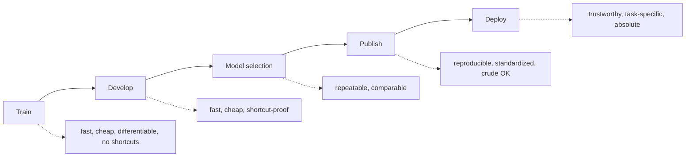
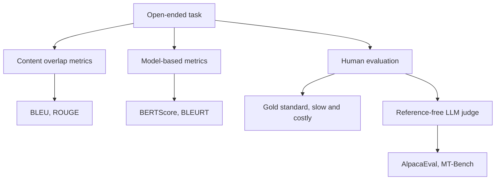
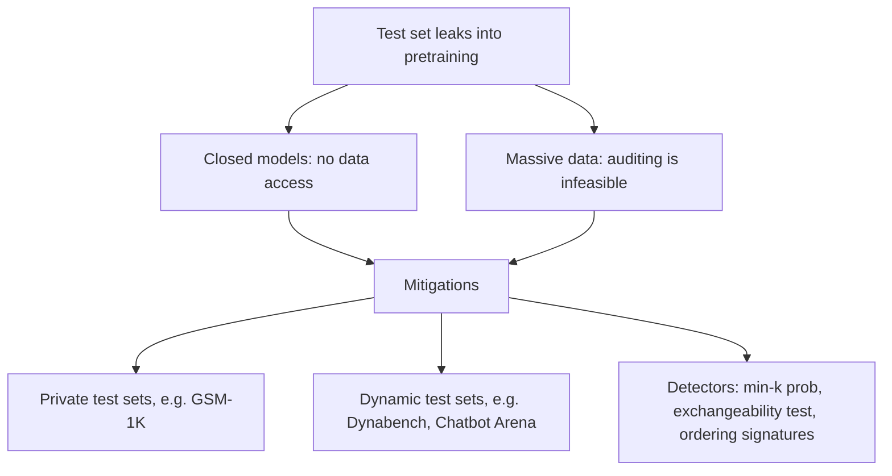

This lecture is taught by Yan, a third-year PhD student advised by Tatsunori Hashimoto and Percy Liang. [00:11](ts:0:11) [uncertain: the slide deck title page reads "Yann Dubois", but no surname is stated in the video.] His thesis: evaluation is not one thing. You measure performance at every step of building a model, but each step demands a different instrument.

## One pipeline, many instruments

Yan describes model development as five stages. Each stage needs measurement, with different requirements. [01:05](ts:1:05)

- **Train.** You need a loss to backpropagate through, so the instrument must be super fast, super cheap, differentiable, and free of shortcuts. [03:01](ts:3:01)
- **Develop.** For hyperparameter tuning and early stopping, the instrument must stay fast, cheap, and shortcut-proof, since tuning optimizes against it.
- **Model selection.** You compare trained models. Speed and cost can relax, but you repeat this many times.
- **Deploy.** The stakes are real. The instrument must be trustworthy and task-specific. It must also be absolute, so a threshold like 95 percent accuracy can gate the launch.
- **Publish.** Academic benchmarking communicates quality across groups. It must be reproducible and standardized. Crude metrics are acceptable: what matters is the direction of progress over a decade.

> [!KEY] Never ask "how good is my model" in the abstract. Ask what decision the number will drive, then pick the instrument that fits that decision.

Benchmarks drive the field forward. The MMLU plot shows accuracy rising from 25 percent, random guessing on four choices, to around 90 percent in about four years. [07:17](ts:7:17)

## Close-ended evaluation

A close-ended task has a limited number of potential answers, fewer than ten, and often exactly one correct answer. [09:02](ts:9:02) This is standard machine learning: accuracy, precision, recall, F1, ROC curves. Examples: sentiment analysis (SST, IMDB), entailment (SNLI), named entity recognition (CoNLL-2003), part of speech (PTB), coreference resolution (WSC), question answering (SQuAD 2).

Metric choice is the real work. Spam example: if 90 percent of email is not spam, a classifier that always predicts "not spam" scores 90 percent accuracy while classifying nothing. [14:15](ts:14:15) That is why you look at precision and recall, not accuracy alone.

Multi-task benchmarks try to measure general capability by averaging many close-ended tasks. SuperGLUE is the classic example. It covers reading, entailment, cause and effect, QA with reasoning, word meaning, and coreference. You average the columns and rank the models.

Averaging is broken in practice. The columns mean different things: some are accuracy, some are F1, some are correlations. One benchmark even averaged a lower-is-better column with higher-is-better columns until someone noticed.

Then ask where the labels come from. SNLI looks hard, but Gururangan et al. (2019) found that a classifier reading only the hypothesis, never the premise, performs well. [16:57](ts:16:57) Human annotators wrote contradictions by adding negations, so a negation in the hypothesis predicts contradiction by itself. That is a spurious correlation: a data shortcut that lets the model skip the task.

## Open-ended evaluation

An open-ended task has too many possible correct answers to enumerate. Answers differ in quality, not in rightness. [19:18](ts:19:18) Classic examples: summarization (CNN-DailyMail, where the reference summaries are the bullet points at the top of news articles [18:49](ts:18:49), and Gigaword) and translation (WMT). The current default is instruction following, which Yan calls the mother of all tasks. Any task can be phrased as a question to a chatbot.

Three families of methods exist: content overlap metrics, model-based metrics, and human evaluation.

## Content overlap metrics

These compare generated text against a human-written reference, word by word, fast and efficiently. The usual tools are n-gram overlap metrics. BLEU behaves like precision, ROUGE behaves like recall. [21:49](ts:21:49) BLEU adds a length penalty so that generating only the word "the" cannot score high.

They have no concept of semantic relatedness. Candidate scores against the reference "Heck yes!": "yes" gets 0.67, "you know it!" gets 0.25, "yep" gets 0, and "Heck no!" gets 0.67. [24:39](ts:24:39) "Yep" is a false negative: identical meaning, zero score. "Heck no!" is a false positive: opposite meaning, high score. These metrics were the standard for translation and summarization until a few years ago. Papers still report them because reviewers demand them.

## Model-based metrics

BERTScore passes the generation and the reference through BERT and matches words by cosine similarity of contextual embeddings (Zhang et al., 2020). [26:49](ts:26:49) BLEURT continues pretraining BERT to predict BLEU and other metrics on unlabeled pairs, then finetunes on human quality judgments (Sellam et al., 2020). [27:24](ts:27:24) BLEU serves only as the unsupervised multitask objective. Human annotations supply the supervision.

References bound all of this. Reference-based measures are only as good as their references. On CNN-DailyMail, ROUGE-L shows essentially no correlation with human judgments when the references are the original bullet points. With expert-written references, the correlation rises substantially. [30:37](ts:30:37) The references were bad. That motivates reference-free evaluation: no human reference, just a model that scores the output. With GPT-4 as the scorer it works surprisingly well, and AlpacaEval and MT-Bench made it standard. [46:25](ts:46:25)

## Human evaluation

Humans remain the gold standard for open-ended generation and for validating every automatic metric. Annotators rate overall quality or specific dimensions: fluency, coherence, factuality, commonsense, style, grammaticality, redundancy. Never compare scores across differently conducted studies: different humans and instructions produce incomparable numbers.

The problems are severe. Human judgment is slow and expensive. Inter-annotator disagreement is high. Five AlpacaFarm researchers wrote extremely detailed rubrics and discussed them for hours, yet agreed only 67 percent of the time. [36:49](ts:36:49) The same person also drifts: ratings change after dinner. Reproducibility is poor. Only 5 percent of 128 published human evaluations were repeatable from the papers alone, rising to about 20 percent with author help. [38:52](ts:38:52) [uncertain: Yan could not recall the paper year in the lecture.] Humans judge precision, not recall. They rate the one generation shown, never the space of generations the model could have produced. Incentives misalign: crowd workers maximize dollars per hour and find shortcuts. The team paid 1.5 times California minimum wage by their own estimates. Workers annotated two to three times faster and earned two to three times that. [40:14](ts:40:14)

Running it well is its own discipline: write rubrics, control order, screen and monitor annotators. [42:38](ts:42:38)

## Chatbot Arena and Elo

To evaluate chatbots, the field converged on side-by-side comparison. Show two models the same prompt and ask a human which response is better. Chatbot Arena lets anyone play with top models for free and vote. At around 200,000 votes the results feed a leaderboard computed with Elo ratings. Chess uses the same system to rank players without every player facing every other. [44:03](ts:44:03) [44:23](ts:44:23)

This is the current gold standard, but it has holes. Random visitors typing random questions may not represent real use. Cost is the bigger hole: it takes a huge community effort, new models wait long for enough votes, and only notable models ever get benchmarked. No lab can run this loop at development speed.

## LLM as judge

Replace the human voter with a strong model. The AlpacaFarm finding: GPT-4 evaluation is about 100 times cheaper and 100 times faster than human evaluation. Its agreement with humans exceeds the agreement of humans with each other. [46:44](ts:46:44) The mechanism is bias versus variance. Humans have high variance in judgment. The model has substantial bias, around 32 percent [uncertain: stated from the plot in the lecture], but very low variance. That lets it predict the majority human preference more reliably. Consistency helps iteration, but bias is the real danger.

The same spurious correlations appear here. Length and lists get preferred: humans prefer longer outputs about 70 percent of the time, and models show the same bias. [49:44](ts:49:44) Position matters, though randomizing the order controls for it. GPT-4 self-bias is real but smaller than expected. A model rating itself scores itself higher, yet the overall ranking stays the same no matter which model judges. [54:15](ts:54:15)

AlpacaEval operationalizes this. It began as an internal development benchmark for the Alpaca project, because the team did not trust existing instruction-following benchmarks for tuning. It correlates 98 percent with Chatbot Arena rankings, and a full run takes under 3 minutes and under 10 dollars. [51:24](ts:51:24) The procedure: for each instruction, generate outputs from the model and a baseline. Ask GPT-4 for the probability that the model output is better. Average the probabilities into a win rate. A striking result forced the fix. Prompting GPT-4 to be more verbose moved its win rate from 50 percent to 64.3. Asking for conciseness dropped it to 22.9. [53:23](ts:53:23) A benchmark whose rankings swing on a verbosity tweak is measuring the wrong thing.

> [!INTERVIEW] When asked how you would evaluate a model, start by asking what decision the evaluation serves. Training wants fast, cheap, differentiable. Deployment wants trustworthy, task-specific, absolute. Then name the three failure modes. Inconsistency across implementations of the same benchmark. Contamination of test data into pretraining. Judge biases such as length, position, and self-bias in LLM evaluators. Frontier labs test whether you treat a benchmark as an instrument with error bars, not as a score.

## How LLMs are evaluated today

Yan sees three lanes. First, perplexity: training or validation loss. Second, average everything: HELM and the HuggingFace Open LLM Leaderboard collect many automatically evaluable benchmarks and average across them. Third, arena-like pairwise comparison by humans or models. [55:06](ts:55:06) Pretrained base models mostly report perplexity. Finetuned models report the other two, because finetuning leaves log-likelihoods uncalibrated for the eval datasets. [55:45](ts:55:45)

The "everything" mix spans capabilities. GSM-8K for grade-school math. [56:37](ts:56:37) MMLU: 57 multiple-choice tasks across formal logic, conceptual physics, econometrics, and more (Hendrycks et al., 2021). LegalBench for law, MedQA for medical licensing exams. Code gets special treatment through HumanEval. Pass at 1 means at least one of k generated programs passes the tests, with GPT-4 around 67 percent. Code is easy to score against test cases, and code performance correlates with reasoning. Evaluating an agent that uses a terminal or writes email requires a sandbox for every application it touches. [60:59](ts:60:59)

Perplexity is extremely highly correlated with downstream averages, so teams use it as a quick development signal. [55:11](ts:55:11) But perplexity is not comparable across datasets or across tokenizers. Vocabulary size bounds the entropy, so a smaller vocabulary trivially lowers perplexity. The mechanics of perplexity were taught in [CS336 L12](../../foundations/cs336/l12-evaluation.html). This lesson takes them as given.

## Issues: consistency

Multiple-choice evaluation is implementation-dependent. For about a year, MMLU had three main implementations and people compared scores across them unknowingly. [64:54](ts:64:54) They differed in prompts and in answer extraction. The options: constrained decoding over A through D, free generation where an unconstrained token wins, or scoring the log-likelihood of the answer text. The numbers diverged wildly. Llama 65B scored 63.7 on HELM, 63.6 on the original implementation, and 48.8 on the HuggingFace harness. [66:31](ts:66:31) A related study (Alzahrani et al., 2024) found that replacing ABCD with random symbols changes generations and reshuffles model rankings. If the harness changes the answer, you are not measuring the model.

## Issues: contamination and overfitting

Closed models train on enormous data, and nobody can check whether a benchmark leaked into pretraining. One researcher found GPT-4 scoring 10 out of 10 on pre-2021 Codeforces problems but 0 out of 10 on recent ones. That suggests the older problems were in the training data. [67:33](ts:67:33) Relatedly, datasets now reach claimed human-level performance in under six months. Nobody knows how much is contamination and how much is hyperparameter tuning against the test set.

Private test sets: GSM-1K recollected the GSM-8K math dataset from scratch. Open models scored much worse on the fresh set than on the tunable one. [69:17](ts:69:17) Dynamic test sets refresh continuously. Dynabench and Chatbot Arena work this way. [69:52](ts:69:52) Detectors estimate whether a model saw the test data. Check whether token probabilities are suspiciously high (min-k prob), run an exchangeability test, or look for ordering signatures. If swapping examples one and two drops log-likelihood, the model likely memorized their order.

## Issues: monoculture

Most papers evaluate English and accuracy only. Of 461 ACL 2021 oral papers, 70 percent evaluated English only and 40 percent evaluated accuracy only. [71:40](ts:71:40) A similar analysis of a 2008 conference found the same pattern, and the problem is not improving. [71:13](ts:71:13) Multilingual benchmarks exist: MEGA (16 datasets, 70 languages), GlobalBench (966, 190), XTREME (9 tasks, 40), and multilingual MMLU, ARC, and HellaSwag (26 languages). [72:14](ts:72:14) The benchmarks are not the bottleneck. Academic incentives are.

Reducing everything to one number has further costs. Performance is not all we care about: efficiency and bias matter too. Averaging across examples gives every example equal weight, which is unfair to minoritized groups and ignores that examples carry different value. MLPerf instead measures time to reach a quality target, combining accuracy with speed. DiscrimEval, from Anthropic, uses templates that vary race or gender and checks whether the model decision changes. [74:51](ts:74:51) Metrics themselves carry bias. BLEU and ROUGE assume clean tokenization, which fails for morphologically rich languages or languages like Thai with no word spaces. LLM-based evaluation concentrates bias further. One judge with a fixed bias, used by the whole community, becomes a monoculture. OpinionQA (Santurkar et al., 2023) compares model output distributions against public opinion surveys. Base models reflect a mix of groups, but after finetuning the models reflect mostly white and Southeast Asian highly educated views. [76:03](ts:76:03) [uncertain: Yan suggests this is because SFT and RLHF labelers were largely in Southeast Asia, stated as his hypothesis.]

The meta-problem is incentives. Between 2019 and 2020, 82 percent of machine translation papers evaluated only on BLEU, despite the existence of better-correlated metrics. [77:56](ts:77:56) Reviewers demand BLEU for comparability with past work, so the field cannot move. That trap is specific to academia. In the real world, if your metric is bad, just switch.

## Takeaways

The summary: match the instrument to the stage. Close-ended tasks are standard ML but demand care with metrics, labels, and spurious correlations. Open-ended tasks use content overlap metrics, model-based metrics, or human evaluation. Chatbot evaluation is genuinely hard and an open problem. The challenges are consistency, contamination, and bias. [78:37](ts:78:37)

The closing line to remember: the best judge of output quality is you. Look at your model generations. Do not just rely on numbers. [80:09](ts:80:09) The Alpaca team believed their AlpacaEval numbers, but playing with the model is what convinced them it was actually good. [79:52](ts:79:52)

> [!PROF] On using GPT-4 as an evaluator, here is the answer Yan gave to a student question. Do not ask "how good is this summary, out of five." Write a detailed rubric of everything a good answer must contain. Then have the model apply it. Professors do exactly this with TAs. They do not trust the TA blindly, they write the rubric and trust the application. That is how LLM judging should work, and it is not how the field currently does it. [83:50](ts:83:50)

## Sources

- Video: [Lecture 11: Benchmarking and Evaluation](https://www.youtube.com/watch?v=TO0CqzqiArM) (1:24:09)
- Slides: cs224n-spr2024-lecture11-evaluation-yann.pdf (CS224N Spring 2024)
- Perplexity and eval-set mechanics: [CS336 L12](../../foundations/cs336/l12-evaluation.html)
- Gururangan et al., [Annotation Artifacts in Natural Language Inference Data](https://arxiv.org/abs/1808.08614), 2019
- Zhang et al., [BERTScore: Evaluating Text Generation with BERT](https://arxiv.org/abs/1904.09675), 2020
- Sellam et al., [BLEURT](https://arxiv.org/abs/2004.04696), 2020
- Hendrycks et al., [MMLU: Measuring Massive Multitask Language Understanding](https://arxiv.org/abs/2009.03300), 2021
- Santurkar et al., [OpinionQA: Whose Opinions Do Language Models Reflect?](https://arxiv.org/abs/2303.17548), 2023
