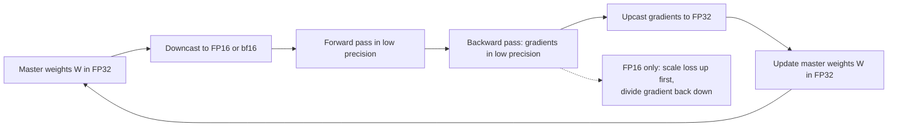
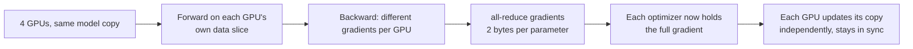
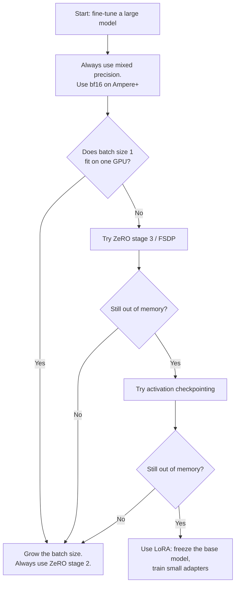

Training a model and understanding a model are different skills. This lecture covers the first: what happens on the GPUs when you train a large network, where memory goes, and which tricks let you fit bigger models on fixed hardware. The three topics are mixed precision training, multi-GPU training (DDP and FSDP), and parameter-efficient fine-tuning with LoRA. [00:51](ts:0:51)

As taught in [CS229S L03](../../foundations/cs229s/l03-transformer-performance.html), a training step costs about 3x a forward pass, and the backward pass must store activations. This lesson takes those facts as given and asks the practical question: how do you run that computation without running out of memory?

## How numbers are stored, and why half precision hurts

A floating point number has three parts: a sign bit, an exponent field, and a mantissa field. The exponent bits decide the range (how small and how large a number can be). The mantissa bits decide the precision (how finely values are spaced). [02:12](ts:2:12)

FP32 uses 1 sign bit, 8 exponent bits, and 23 mantissa bits, costing 4 bytes per parameter. [02:38](ts:2:38) FP16 cuts the fields to 1 sign bit, 5 exponent bits, and 10 mantissa bits, costing 2 bytes. That halves memory but cuts range and precision at the same time. [03:38](ts:3:38)

Two failure modes follow. First, underflow. Gradients during training are often tiny, and FP16 cannot represent numbers below about \(6 \times 10^{-5}\). They get rounded to exactly zero. The lecture shows a gradient histogram from an NVIDIA blog post: more than half the gradients would become zero in FP16. [06:00](ts:6:00) A network cannot learn if most of its gradients vanish. Second, imprecise updates. With fewer mantissa bits, small weight updates get rounded away, so the parameters drift from where they should be. [04:49](ts:4:49)

## Mixed precision training: the recipe

The fix uses both formats at once. Keep a full-precision copy of the parameters in FP32. Call these the master weights. Run the forward and backward pass in FP16 for speed and memory, then upcast the gradients to FP32 and update the master weights there, where updates stay precise. Copy the updated weights back into the FP16 model. [06:33](ts:6:33)

This fixes the imprecise-update problem but not the underflow problem: gradients still become zero while they are in FP16. The lecture adds one more step. Scale the loss by a large value (say 10,000) before the backward pass. That scales every gradient up by the same factor, shifting them into the range FP16 can represent. After computing the gradient, divide it by the scale factor in FP32 and update the master weights. [09:00](ts:9:00)

> [!KEY] Mixed precision training means: master weights in FP32, forward and backward in FP16, loss scaled up before the backward pass and divided back down before the update. In PyTorch, `GradScaler` and `autocast` implement it.

A scale that is too large overflows to NaN, and a scale that is too small leaves gradients underflowed. PyTorch's `GradScaler` adjusts the scale dynamically across iterations, but the mechanism is fiddly. [10:04](ts:10:04)

## BFloat16 removes the scaler

Recall why scaling was needed: FP16 has fewer exponent bits, so it lacks dynamic range. The move is to keep the 8 exponent bits and sacrifice precision bits instead. That is exactly BFloat16 (bf16): 1 sign bit, 8 exponent bits (the same range as FP32), 7 mantissa bits. [11:49](ts:11:49)

Because bf16 covers the full FP32 range, small gradients no longer underflow to zero, so no loss scaling is needed. Wrap the forward and backward pass in an `autocast` context and you are done. [12:11](ts:12:11)

> [!CAVEAT] BFloat16 needs Ampere-generation or newer NVIDIA hardware (A100, H100, A6000). On older GPUs the format is unavailable. The lecture says to check `torch.cuda.is_bf16_supported()`. [12:22](ts:12:22)

The lecture shows results from fine-tuning DistilBERT for sentiment classification on a single A100. FP64 takes about 25 minutes and reaches high accuracy. Mixed precision with bf16 cuts training time by roughly a third, matches or slightly beats that accuracy, and uses much less memory. The speedup comes from matrix multiplies running faster in half precision. [13:05](ts:13:05)

## What lives in GPU memory

Before distributing training, the lecture writes down the full memory budget for one GPU. With Adam and mixed precision, every parameter costs:

| State | Format | Bytes per parameter |
|---|---|---|
| Model parameters | FP16 | 2 |
| Gradients | FP16 | 2 |
| Master weights | FP32 | 4 |
| Adam momentum | FP32 | 4 |
| Adam variance | FP32 | 4 |

That is 16 bytes per parameter. A 7B model needs 112 GB, more than one GPU can hold, before you even count activations. [14:32](ts:14:32) Two facts here surprise beginners. First, the optimizer itself needs memory: Adam stores a momentum term and a variance term per parameter and updates them every step. Second, all of this is multiplied by the number of GPUs in naive multi-GPU training, because every GPU holds everything. [15:06](ts:15:06)

## Distributed data parallel (DDP)

With multiple GPUs, the simplest scheme is data parallelism. Split the dataset across the GPUs, keep a synchronized copy of the model on each one, run the forward pass on each GPU's own data slice, and run the backward pass while communicating gradients. The communication step is an **all-reduce**: each GPU contributes its gradient, the gradients are summed, and every GPU receives the full sum. The cost is 2 bytes per parameter because the gradients are in FP16. [16:31](ts:16:31)

Once gradients are synchronized, every GPU holds the accumulated gradient and applies the same update to its own copy of the parameters, so the copies stay in sync. That is DDP. [17:35](ts:17:35)

The problem is memory scaling. DDP divides only the data. Every GPU still holds all 16 bytes per parameter. [18:19](ts:18:19)

## ZeRO: shard the state you are not using

ZeRO (Zero Redundancy Optimizer, from Microsoft's DeepSpeed project) removes the redundancy: not every GPU needs its own full copy of everything. It adds three stages of sharding. [18:54](ts:18:54)

**Stage 1: shard the optimizer state.** Every GPU keeps the full FP16 parameters and computes its own gradient, but holds only a shard of the optimizer state, and each GPU updates only its own parameter shard. The protocol: compute gradients on your data, run a **reduce-scatter** so each GPU gets the full gradient for its shard, update your shard, then run an **all-gather** so every GPU collects the updated parameters. [19:33](ts:19:33)

Here is the elegant part. An all-reduce is exactly equivalent to a reduce-scatter followed by an all-gather, so stage 1 moves precisely the same bytes as DDP while using less memory per GPU. The lecture says to always use this: memory savings for free. [24:31](ts:24:31)

**Stage 2: also shard the gradients.** The complication: each GPU still needs the full gradient for its data slice during the backward pass. The trick is to never instantiate the full gradient vector. The backward pass runs layer by layer. As soon as a GPU computes one layer's gradient, it sends it to the GPU in charge of that shard and deallocates the memory. At the end, each GPU updates its shard from the gradients it received, then all-gathers to synchronize. [25:33](ts:25:33) Again this is effectively free compared to DDP: a reduce plus an all-gather costs the same as an all-reduce. [28:12](ts:28:12)

**Stage 3 (full FSDP): shard the model parameters too.** When even the parameters do not fit on one GPU, shard those as well. No GPU holds a full layer's parameters, so the forward pass must all-gather each unit's parameters before computing and discard them after. The backward pass must all-gather the parameters again, compute gradients, then reduce-scatter the gradients to the right owners. Total overhead per unit: two all-gathers plus one reduce-scatter. But if the model cannot load onto a GPU at all, this is the only option. [28:52](ts:28:52)

| Setup | Bytes per parameter per GPU (P params, N GPUs) |
|---|---|
| DDP | \(16P\) |
| ZeRO stage 1 | \(4P + 12P/N\) |
| ZeRO stage 2 | \(4P + 14P/N\) |
| ZeRO stage 3 (FSDP) | \(16P/N\) |

> [!INTERVIEW] A frontier-lab interview may ask why ZeRO stage 1 is "free". The answer to have ready: an all-reduce moves the same bytes as a reduce-scatter followed by an all-gather, so sharding the optimizer state cuts memory per GPU without moving any extra bytes. Stage 3 costs more because parameters must be re-collected before every layer's forward and backward pass.

## The missing term: activations

The lecture admits the memory table was a lie by omission. It left out **model activations**: the intermediate tensors stored during the forward pass for reuse in the backward pass. Activations scale linearly with batch size, and they are what the CUDA out-of-memory error usually points at when you grow the batch. None of the ZeRO stages help with them, because every GPU needs its own activations for its own data slice. [35:14](ts:35:14)

The tool for activations is **activation checkpointing** (also called gradient checkpointing): discard most activations during the forward pass and recompute them during the backward pass. You trade extra computation for less memory. [37:33](ts:37:33)

## The decision flowchart

The lecture reduces everything to one procedure for fine-tuning on multiple GPUs: [36:18](ts:36:18)

The lecturer adds one scope note: the above assumes multiple GPUs. On a single GPU you need heavier measures like quantization, and very large models may simply not fit. [53:45](ts:53:45)

## FSDP in practice: overlap and sharding policy

Two engineering details make FSDP usable despite the extra communication. First, **overlap**. The model is divided into FSDP units, and communication is pipelined with computation: while a GPU runs the forward pass on one unit, it prefetches the next unit's parameters with an all-gather. After finishing a unit, it frees that unit's memory. The backward pass overlaps the all-gather plus reduce-scatter sequence the same way. If the network is deep enough, communication hides behind compute. [56:43](ts:56:43)

Second, **sharding policy**. How you cut the model into units controls communication volume. Consecutive layers belong in the same unit, so one all-gather feeds several layers of compute. PyTorch's FSDP wrapper takes a sharding policy, and hand-tuned policies exist for transformers. A new architecture (the lecture gives sub-quadratic attention as an example) may lack a good policy and train less efficiently. [60:33](ts:60:33)

A question from the audience asked whether weights are discarded after each layer's forward pass or cached. The answer: from the user's perspective they are thrown away and streamed back in during the backward pass. That is exactly why the sharding policy matters. [61:26](ts:61:26)

## Why bother with efficiency at all

The lecture pauses to justify the topic. Training compute for the largest models has grown roughly 2x every 3.4 months, while global compute capacity grows about 2x every 1.5 years. That gap concentrates model building in a few well-funded organizations. [39:49](ts:39:49) Most papers still optimize accuracy rather than efficiency (the slides cite Green AI statistics and Ang et al., 2022). [41:07](ts:41:07) Cornell scientists estimated in 2021 that training GPT-3 emitted as much carbon as running a coal power plant for 10 hours straight. [42:11](ts:42:11) A class anecdote makes the same point: in a Stanford RL course, choosing the more efficient of two equally good algorithms across all students would have saved about 880 kWh, roughly a month of an American household's electricity. [42:48](ts:42:48)

## LoRA: low-rank adaptation

Full fine-tuning updates every parameter. GPT-3 has 175 billion parameters, and each downstream task would need its own full copy. When full fine-tuning does not fit, the fallback is **parameter-efficient fine-tuning (PEFT)**: update only a small subset of parameters and search over a much smaller space. Overparameterized models often adapt well with small updates, sometimes generalizing better than full fine-tuning. [44:03](ts:44:03)

LoRA (low-rank adaptation, Hu et al. 2021) builds on one observation: during adaptation, weight updates have low intrinsic rank (Aghajanyan et al. 2020). Instead of learning an arbitrary update \(\Delta W\) for a pretrained weight matrix \(W\), constrain it to a low-rank product:

\[ W + \Delta W = W + \alpha B A \]

where \(A \in \mathbb{R}^{r \times k}\), \(B \in \mathbb{R}^{d \times r}\), and the rank \(r\) is much smaller than either dimension. Only \(A\) and \(B\) are trainable and the base weights stay frozen. The scalar \(\alpha\) trades off pretrained knowledge against task-specific knowledge: \(\alpha = 0\) changes nothing, and \(\alpha = 1\) is the usual starting point. [47:05](ts:47:05)

Two properties make LoRA practical. First, as \(r\) grows, LoRA converges toward full fine-tuning, so \(r\) is a dial between efficiency and capacity. Second, there is no extra inference latency: after training, merge \(BA\) into \(W\), and when switching tasks, subtract one task's update and add another's. The per-task storage is the small pair of matrices, not a full model copy. [48:11](ts:48:11)

In code the change is small. Run the normal forward pass through the frozen weights to get the hidden state, then add the trainable offset \(BAx\). Apply it to every weight matrix in every layer, though in practice the query and value matrices of self-attention give the best results. [49:20](ts:49:20)

The empirical case: on GPT-2 medium and large, LoRA beats adapter and BitFit baselines with comparable or fewer trainable parameters, and matches or exceeds full fine-tuning while storing far less per task. Even a very small rank works well. The lecture's recommended starting point: LoRA on the query and value matrices, rank 8, \(\alpha = 1\). [52:18](ts:52:18) [54:30](ts:54:30)

## Sources

- Lecture video: [Lecture 12 video, Stanford Online YouTube](https://www.youtube.com/watch?v=UVX7SYGCKkA)
- Slides: cs224n-spr2024-lecture12-training-shikhar.pdf (CS224N Spring 2024)
- [PyTorch AMP examples (GradScaler and autocast)](https://pytorch.org/docs/stable/notes/amp_examples.html), linked in the lecture slides
- [Sebastian Raschka, LLM mixed-precision benchmarks (DistilBERT on A100)](https://sebastianraschka.com/blog/2023/llm-mixed-precision-copy.html), source for the lecture's timing table
- [Meta Engineering, FSDP](https://engineering.fb.com/2021/07/15/open-source/fsdp/), source for the lecture's FSDP communication diagram
- Micikevicius et al., [Mixed Precision Training, 2018](https://arxiv.org/abs/1710.03740)
- Rajbhandari et al., [ZeRO: Memory Optimizations Toward Training Trillion Parameter Models, 2020](https://arxiv.org/abs/1910.02054)
- Hu et al., [LoRA: Low-Rank Adaptation of Large Language Models, 2021](https://arxiv.org/abs/2106.09685)
