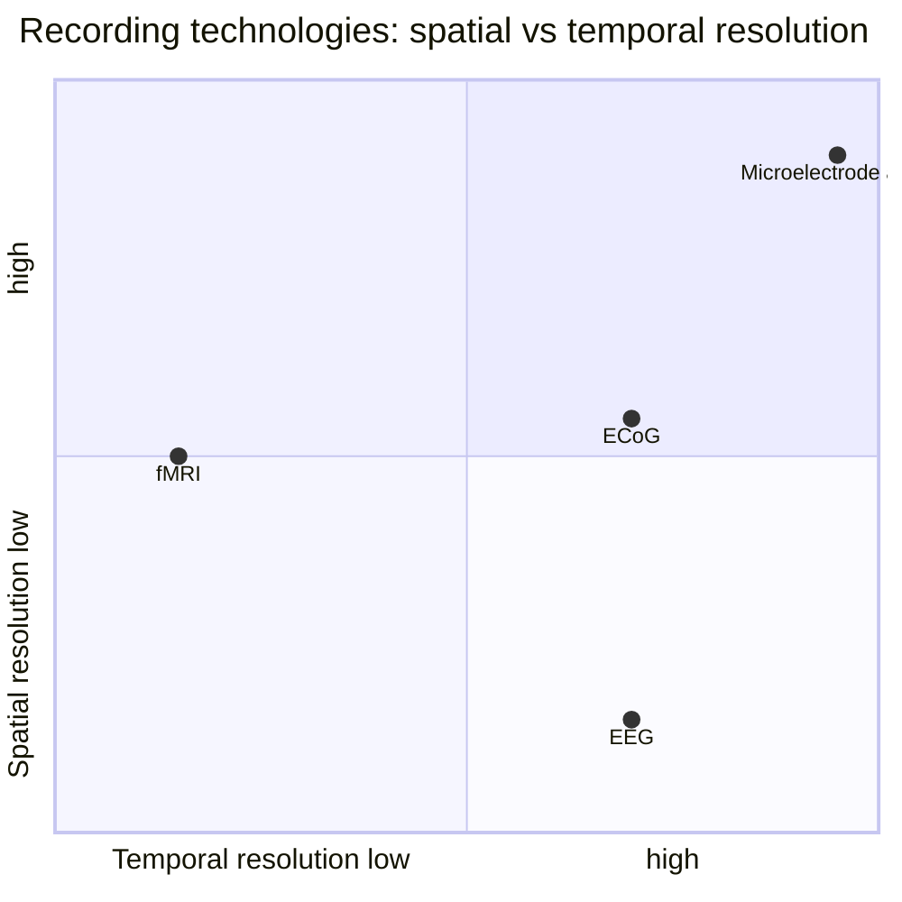
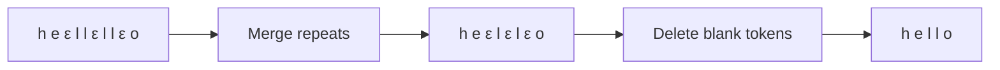
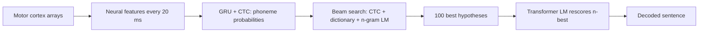

Guest lecture by Chaofei Fan of the Stanford Neural Prosthetics Translational Lab (NPTL): the past, present, and future of speech brain-computer interfaces.

## Locked in, and how slow the alternatives are

Howard Wicks was 21 when a severe stroke left him locked in: a fully functioning brain with almost no ability to move or speak. [01:23](ts:1:23) Brainstem stroke and ALS (amyotrophic lateral sclerosis) cause this kind of loss. The mind survives. The body's output channels do not. [02:03](ts:2:03)

The fallback is a letter board: a helper reads letters from the patient's gaze, one by one. [02:44](ts:2:44) Eye-tracking keyboards exist, but staring at a screen all day exhausts people who can barely move their eyes. [03:34](ts:3:34) One sentence can take minutes. [03:07](ts:3:07)

The premise: the brain still works, so bypass the body and read it directly. Neuralink's implantable device targets exactly this. [04:04](ts:4:04) The lecture quotes PRIME participant Noland Arbaugh on reconnecting with family and acting without help at all hours. [04:56](ts:4:56)

## A short history

In the 19th century, British scientist Richard Caton measured electricity from animal brains and showed it changes with behavior. [06:01](ts:6:01) First proof that brain signals carry decodable information.

In 1924, German psychiatrist Hans Berger recorded the first human EEG: scalp electrodes measuring wave-like electrical signals. [06:51](ts:6:51) Calm patients produce slow alpha waves. Alert, thinking patients produce sharp beta waves. Berger began the work chasing telepathy, after a horse fall, a concussion, and a strange coincidence involving his sister. [08:18](ts:8:18) EEG remains a clinical tool, for example in epilepsy diagnosis. [09:03](ts:9:03)

By the 1950s a musician was already performing music with EEG, driving sound with brain waves. [09:38](ts:9:38) The bypass-the-body idea is old. What changed is signal quality.

## Why EEG is not enough

Scalp electrodes sit far from the source. One electrode averages the firing of millions of neurons. The lecture's analogy: hearing people talk in the next room and catching only the mumbling. You get the mood, not the words. [10:49](ts:10:49) EEG gives low-resolution signals. [11:10](ts:11:10)

The answer is to go inside. Place electrodes next to neurons and measure them directly. The target is the motor cortex, the strip of brain controlling the body's muscles. [11:45](ts:11:45) Decode what motor cortex encodes, and a paralyzed person can drive a computer or a robotic arm by intent alone.

## What a neuron says

A neuron has a cell body (the soma), a long axon, and synapses linking it to other neurons. [12:38](ts:12:38) To send information it fires an action potential: a sharp spike in membrane voltage. [13:03](ts:13:03) An electrode next to a neuron records a spike train, spikes over time.

To learn what a spike train means, run a behavior experiment. Train a monkey to move its hand left or right, record one neuron, and plot each trial as a row of spikes. [14:22](ts:14:22) [15:54](ts:15:54)

Neurons are noisy: the same movement gives slightly different firing every trial, unlike artificial neurons. [15:18](ts:15:18) Firing also splits into preparation (planning the move, arm still) and execution (moving). [16:01](ts:16:01) One neuron in the lecture's example fires hard during execution of rightward moves and a little more during preparation of leftward moves. It encodes movement direction. [16:29](ts:16:29)

Fit firing rate (spikes per second) against movement direction and you get a roughly cosine-shaped tuning curve. [17:14](ts:17:14) The peak is the neuron's preferred direction, say 180 degrees.

One neuron is ambiguous. Thirty spikes per second could mean 120 degrees or 240 degrees. [18:13](ts:18:13) A second neuron with a different preferred direction resolves it: at 5 spikes per second, the direction must be 120, not 240. [18:27](ts:18:27) More neurons, less ambiguity. That mapping, from population firing back to intended movement, is decoding.

Machine learning does the mapping. Plot each trial as a point in the two neurons' firing-rate space, color by intended direction, and train a classifier. New measurements fall on one side of a decision boundary or the other. [20:01](ts:20:01)

> [!CAVEAT] Real electrodes drift. The brain is soft tissue, so an electrode can shift and start recording a different neuron. Coping with this recording instability is a core unsolved problem in BCIs. [21:53](ts:21:53)

## The resolution trade-off

Every recording technology sits somewhere on two axes: spatial resolution (how small a brain region each measurement covers) and temporal resolution (how fast it samples). [23:03](ts:23:03)

Single-neuron recordings sample at millisecond precision. fMRI measures blood flow, so it averages about half a second to a second of activity and smears away the fast electrical dynamics. [24:09](ts:24:09) The ideal device has both high spatial and high temporal resolution. Invasive arrays get closest.

The workhorse here is the microelectrode array: a fingernail-sized patch of tiny needles, each recording a few nearby neurons, for hundreds of neurons in total. [25:18](ts:25:18)

## Motor BCIs that already work

Implant arrays in motor cortex, measure tuning curves per channel, train a decoder, and ask the participant to imagine moving. A person with spinal cord injury and no connection to the body can still produce the motor intent. [26:00](ts:26:00)

In 2017 the lab showed participant T6 typing on a virtual keyboard with imagined hand movements, peaking around 40 correct characters per minute and averaging about 20. [28:38](ts:28:38) [28:54](ts:28:54) (Pandarinath, Nuyujukian et al., 2017.) The same approach drives robotic arms that grasp objects. [33:28](ts:33:28) Frank Willett's 2021 handwriting BCI went further: decode imagined handwriting strokes instead of cursor moves, reaching 90 characters per minute at 95 percent accuracy. [34:50](ts:34:50) (Willett et al., 2021.)

The speed ladder, in words per minute: sip-and-puff switches, about 5. A 2D cursor BCI, about 8. Normal handwriting, 13 to 14. Handwriting BCI, about 18. Natural speech, 150 to 160 [uncertain]. [35:33](ts:35:33) [36:06](ts:36:06) [35:53](ts:35:53) Movement-based BCIs are a huge step past letter boards but nowhere near conversation speed. The next target is speech itself.

## Speech is harder than movement

Speaking is a rapid, complex choreography of articulators: tongue, lips, jaw, larynx. Decoding each articulator's continuous motion is brutal. [38:16](ts:38:16) The key simplification: every language decomposes into a small set of discrete phonetic units. Decode phonemes, not muscle trajectories. [38:56](ts:38:56) Motor cortex distinguishes phonemes in its electrical activity, so the signal is there. [39:41](ts:39:41) (Bouchard et al., 2013.)

Language processing spans many brain areas. The honest map is still a best guess: speech perception, speech production, semantics and syntax, knowledge and reasoning. [37:08](ts:37:08) (Cited: Fedorenko et al., 2024.) Speech BCIs start at the output end: the motor cortex driving the mouth and face.

A 2021 UCSF team proved the concept with ECoG, electrodes that sit on the cortex surface instead of penetrating it. Their small-vocabulary system decoded 50 words at about 75 percent accuracy. [40:02](ts:40:02) (Moses et al., 2021.) ECoG records averaged activity over small regions, so its resolution sits below penetrating arrays. [40:13](ts:40:13) The result was a prototype, not a product.

## The T12 speech neuroprosthesis

In 2022 the lab implanted participant T12, who has bulbar-onset ALS. She keeps limited orofacial movement and can vocalize, but she cannot produce intelligible speech. [41:16](ts:41:16) Four 64-channel Utah arrays went in: two in area 6v (ventral motor cortex, speech execution) and two in area 44 (part of Broca's area, speech planning). [41:56](ts:41:56) (Willett, Kunz, Fan et al., 2023.)

Behavior tests showed the motor cortex arrays classify orofacial movements, phonemes, and words well above chance. The Broca's area arrays do not, especially during execution. [43:02](ts:43:02) The lecture calls this genuinely puzzling and still unexplained. The rest of the system uses only the motor cortex arrays. [44:26](ts:44:26)

## Collecting the data

Training needs paired data: neural activity plus the sentence the participant tried to say. Sessions run in blocks of 40 sentences with breaks: about 100 minutes of collection per research visit. [49:12](ts:49:12) [49:18](ts:49:18) Decoder training takes 10 to 20 minutes. [49:24](ts:49:24) Over three months the team collected about 10,000 sentences of conversational English from the Switchboard telephone corpus. [49:51](ts:49:51)

## Two decoders, not one

English has about 40 phonemes. [51:05](ts:51:05) Far smaller than the vocabulary, so the system decodes in two stages: neural signals to phonemes, then phonemes to words. [51:34](ts:51:34) Ten thousand sentences cover 40 phonemes many times over. They cannot cover a full vocabulary.

> [!KEY] The two-stage design is a data-efficiency move. Phonemes are the bottleneck representation that the available data can actually cover.

Neural features arrive as a time series, one vector every 20 milliseconds, like audio frames. [61:45](ts:61:45) The output is a token sequence. This is sequence-to-sequence, but encoder-decoder models are stronger than needed: they allow arbitrary input-output alignments, as in translation. Speech alignment is monotonic. Early neural frames correspond to early phonemes, never late ones. [52:36](ts:52:36)

Connectionist Temporal Classification (CTC) fits. A network, here a GRU, predicts a phoneme distribution at every timestep. [53:32](ts:53:32) Input and output lengths differ wildly: thousands of 20-millisecond frames against a handful of phonemes. [54:25](ts:54:25) CTC adds a blank token to pad the output to the input length. [55:04](ts:55:04) Post-processing merges repeats and deletes blanks:

## Why a GRU, not a Transformer

Ten thousand sentences is a small dataset for a Transformer, and speech production needs no long-range dependencies. [56:26](ts:56:26) RNNs fit small data and short-range structure, and they run fast enough for real time. [56:43](ts:56:43) The LSTM's gated memory is the standard RNN upgrade. The GRU merges memory and hidden state into one, drops some gates, and performs well on small data. [57:36](ts:57:36) (LSTM background: [CS224N L06](../cs224n/l06-seq2seq-attention.html).)

## From phonemes to words, in real time

At inference the GRU outputs phoneme probabilities per timestep. Beam search finds the most likely phoneme sequence, the same algorithm as CS224N assignment 3, with one CTC-specific caveat the lecture does not expand. [58:51](ts:58:51) (Beam search background: [CS224N L06](../cs224n/l06-seq2seq-attention.html).)

An English pronunciation dictionary maps phoneme sequences to words during the search. A language model then scores each candidate sentence, because not all word sequences are equally likely. "I can spoke" should lose to "I can speak." [60:15](ts:60:15) The decoding objective is

\[ Y^* = \arg\max_Y P(Y|X)^{\alpha} \times P(Y) \times L(Y)^{\gamma} \]

where \(P(Y|X)\) comes from the neural decoder, \(P(Y)\) is the language model probability of the sentence, and \(L(Y)\) is a word insertion bonus. [60:02](ts:60:02) The bonus corrects a length bias: longer sentences always score smaller probabilities under the chain-rule decomposition, so without it the decoder prefers short outputs. [60:54](ts:60:54)

Every 20-millisecond bin must finish all computation within 20 milliseconds. [61:47](ts:61:47) The n-gram language model fits: its scores are memory lookups, fast enough to evaluate about 100 hypotheses per bin and keep the top-k. [62:11](ts:62:11) A Transformer LM is too slow for that loop, so it runs as a second pass. After the full sentence is decoded, it rescores the 100 best hypotheses in about half a second. [63:02](ts:63:02)

## How good is it

The metric is word error rate: normalized edit distance between predicted and true words. [64:09](ts:64:09)

\[ \mathrm{WER}(Y, \hat{Y}) = \frac{\mathrm{distance}(Y, \hat{Y})}{\mathrm{length}(Y)} \]

The T12 system reaches about 25 percent WER: roughly one word in four is wrong. [66:09](ts:66:09) The team released the data as the Brain-to-Text Benchmark '24, an open competition. [64:13](ts:64:13)

Demos show near-perfect copy-task decoding and strong silent-speech decoding, where T12 moves her articulators without vocalizing. [45:05](ts:45:05) [47:22](ts:47:22) Her reaction, quoted in Stanford magazine: after years of silence, the room suddenly understood her. [64:29](ts:64:29)

> [!INTERVIEW] Brain decoding is representation learning under the hardest conditions: noisy biological signals, drifting electrodes, and tiny datasets. The two-stage phoneme bottleneck shows the core skill: pick the intermediate representation that makes the data you have sufficient. And the n-gram versus Transformer LM split shows the systems instinct: match the model to the latency budget, then spend the slow model where it counts.

## What comes next

A UCSF group (Metzger et al., 2023) built a multimodal speech BCI decoding phonemes, speech acoustics, and articulatory gestures together, enough to drive a 3D avatar's face. [65:14](ts:65:14) Collaborators at UC Davis put four arrays into motor cortex and, with continuous training, pushed word error rate close to zero within a few sessions. Their participant now uses the system daily with family. [65:54](ts:65:54) [66:26](ts:66:26) (Card et al., 2024.)

The lab's most ambitious direction is inner speech: decoding imagined speech instead of attempted speech. Attempted speech tops out around 60 to 70 words per minute, because participants who lost speech years ago cannot speak at natural rates. [67:30](ts:67:30) Early, unpublished results credited to Erin on the slides decode attempted speech at about 90 percent on a small vocabulary. Imagined conditions, miming mouth movements or hearing an inner voice, decode well above chance but worse than attempted speech. [68:26](ts:68:26)

Inner speech raises hard ethics questions, from the Shenoy and Yu textbook: should BCIs read thoughts or memories never chosen for expression? Read memories Alzheimer's would erase? Read subconscious fears to aid therapy? Enhance cognition past natural limits, a robotic arm faster than a real one, a purchased memory to skip a class? [69:04](ts:69:04) [70:44](ts:70:44) The textbook's answer is procedural: keep scientists, engineers, ethicists, regulators, and patient advocates in one conversation, while the immediate need, helping people with profound neurological injury, stays front and center. [71:25](ts:71:25)

The lecture's own summary: AI and NLP advances plus years of neuroscience and neuroengineering now point at restoring natural communication. Working systems for communication disorders and paralysis are close. The work also opens a window into how the brain processes language. It brings hope to people like Howard and T12. [72:06](ts:72:06)

## Sources

- Video: [Lecture 13 video, Stanford Online YouTube](https://www.youtube.com/watch?v=tfVgHsKpRC8) (1:12:39)
- Slides: cs224n-spr2024-lecture13-speech-bci.pdf (CS224N Spring 2024)
- Bouchard et al., 2013 (motor cortex encodes articulatory and phonemic information)
- Pandarinath, Nuyujukian et al., 2017, eLife (2D cursor intracortical BCI)
- Moses et al., 2021 (small-vocabulary speech BCI with ECoG, UCSF)
- Willett et al., 2021, Nature (brain-to-text communication via handwriting)
- Willett, Kunz, Fan et al., 2023 (high-performance speech neuroprosthesis, participant T12)
- Metzger et al., 2023 (multimodal speech BCI with avatar control)
- Card et al., 2024 (accurate speech BCI for personal use, UC Davis)
- Fedorenko et al., 2024 (language processing in the brain)
- Shenoy & Yu, Brain-Machine Interfaces (textbook, cited for tuning curves and neuroethics)
