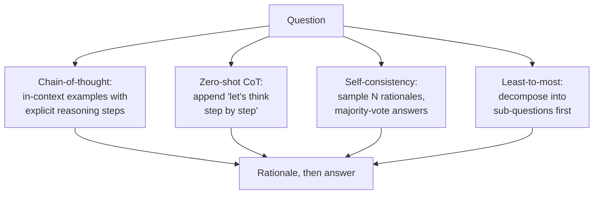
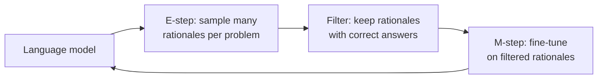
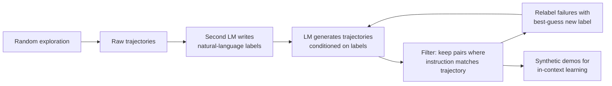

Two applications of language models, in two halves. First: reasoning in math, geometry, and spatial domains. Second: taking actions in grounded environments [00:20](ts:0:20). A disclaimer opens the lecture: most of this content is research from the last three to four years, with many unanswered questions [00:47](ts:0:47).

## The reasoning taxonomy

Reasoning means using facts and logic to arrive at an answer. Three categories:

- **Deductive.** Rules plus premises yield a firm conclusion. All mammals have kidneys. All whales are mammals. Therefore all whales have kidneys [01:42](ts:1:42).
- **Inductive.** Observations yield a likely conclusion. Every winged creature seen so far was a bird. A winged creature appears. It is likely a bird [02:27](ts:2:27).
- **Abductive.** An observation demands an explanation. The car will not start, and liquid pools under the engine. The radiator probably leaks [03:14](ts:3:14).

Formal reasoning uses axioms and rules of formal logic. Informal reasoning uses intuition, experience, and common sense. For this lecture, "reasoning" means informal deductive reasoning, often in multiple steps [03:14](ts:3:14).

Lectures 9 through 11 showed that LLMs predict plausible continuations that respect input constraints and human preferences. The question now: can they reason [04:00](ts:4:00)?

## Chain-of-thought prompting

The simplest probe is prompting. **Chain-of-thought (CoT) prompting** shows the model in-context examples with explicit reasoning steps before the answer (Wei et al., 2023). The model mimics those steps at test time [04:00](ts:4:00).

Surprisingly, examples are sometimes unnecessary. **Zero-shot CoT** appends the sentence "let's think step by step" and still gets reasoning rationales (Kojima et al., 2023) [04:45](ts:4:45).

## Self-consistency

Standard CoT greedily decodes one rationale and one answer. **Self-consistency** samples many rationales, collects many answers, and takes the majority vote (Wang et al., 2023) [05:30](ts:5:30). The bet: correct reasoning processes agree with each other more often than incorrect ones do.

The gain on mathematical reasoning tasks is large. And it is more than plain ensembling: self-consistency beats an ensemble that runs the same model with several different prompts and majority-votes [06:17](ts:6:17).



## Least-to-most: decomposition as a prompt

Multi-step reasoning breaks a large problem into subproblems, solves each, and combines the answers. **Least-to-most prompting** builds that strategy into the prompt (Zhou et al., 2023). The model first decomposes the question into sub-questions, answers each, then conditions the final answer on those answers [07:02](ts:7:02).

One striking result: an in-context example with two reasoning steps teaches the model to handle examples needing more than five steps [08:33](ts:8:33). But the lecture adds a caution. With enough prompt engineering, plain CoT performs about as well as least-to-most, so the decomposition structure may not be fundamental [09:19](ts:9:19).

## Orca: distilling reasoning into small models

Prompting targets models over 100B parameters. **Orca** asks whether a small model can imitate reasoning behavior (Mukherjee et al., 2023) [10:05](ts:10:05). The recipe has three steps:

1. Collect a wide variety of instructions from the FLAN-v2 collection.
2. Prompt GPT-4 or ChatGPT with each instruction plus a system message asking for step-by-step justification.
3. Fine-tune a 13B Llama model on the resulting explanations [11:39](ts:11:39).

Evaluation uses **BigBench-Hard** (BBH), a set of 23 multi-step reasoning tasks (Suzgun et al., 2022) [13:56](ts:13:56). Tasks include boolean expression evaluation, date understanding, and geometric shapes identified from raw SVG paths. Orca beats both Vicuna-13B and ChatGPT on BBH. The slides exclude the GPT-4 column because of potential data contamination [15:33](ts:15:33).

## ReST-EM: fine-tuning on your own rationales

If a small model can learn from a big model's rationales, can a model improve on its own? The slides label the method **ReST-EM** (Singh et al., 2024). The lecture introduces it as reinforced self-training, or ReST. It alternates two steps:

1. **E-step (generate).** Sample multiple rationales from the model, then filter by a problem-specific signal such as answer correctness on math problems.
2. **M-step (improve).** Fine-tune the model on the filtered rationales with supervised fine-tuning, then repeat [16:20](ts:16:20).



On GSM8K, accuracy rises for a few iterations and then degrades. On MATH, accuracy improves [17:52](ts:17:52). The strongest result: fine-tuning on one model-generated rationale per question beats fine-tuning on human-written rationales, even when controlling for rationale count. The full iterative procedure adds a further boost [18:40](ts:18:40).

## Are the rationales faithful?

Now the skeptical turn. Do rationales actually drive the answers, or are they post-hoc decoration? Two experiments from Lanham et al. (2023) attack this [20:58](ts:20:58).

**Early exit.** Force the model to answer after only the first sentences of its rationale. If the answer matches what the full rationale produced, the remaining reasoning did no work. On several datasets, early exit gives the same answer [21:43](ts:21:43).

**Rationale corruption.** Inject a mistake into the middle of the rationale and check whether the answer changes. On some datasets, corrupting even the first step barely moves the answer [23:59](ts:23:59).

> [!CAVEAT] A model can emit a clean-looking rationale and then ignore it. A high benchmark score with chain-of-thought proves the model produced reasoning-shaped text, not that it reasoned.

## Counterfactuals: reasoning or memorization?

If a model adds in base 10, did it learn addition or memorize base-10 examples? Counterfactual evaluation changes the setting so the training distribution cannot help (Wu et al., 2024). Try addition in base 9. Try logic in a world where corgis are reptiles. Performance drops significantly, even on simple single-step logic problems [25:34](ts:25:34).

Analogical reasoning gets the same treatment (Hodel et al., 2024). The model sees string transformations like ABCD to ABCDE and must extend new strings. Change the transformation or shuffle the alphabet, and GPT-4 performance drops sharply while human performance barely moves [28:39](ts:28:39). The lecture's read: some reasoning, some memorization, nothing systematic [29:24](ts:29:24).

## Agents: the terminology

The second half switches from reasoning to action. An agent faces a high-level objective and must reason about postconditions, object affordances, and uncertainty to carry out a sequence of steps [30:10](ts:30:10).

The setting has four pieces. A **policy** pi is the neural network. The **environment** is what it acts on. The agent receives an **observation** and a language instruction G, then issues an **action** [30:56](ts:30:56). The literature calls this an instruction-following agent, a language-conditioned policy, or a digital agent.

The running example is a web browser. The instruction: book a flight from San Francisco to New York. The observation is raw pixels or the HTML DOM. The action space: type on elements, click elements, move the mouse [31:43](ts:31:43). Applications include virtual assistants, natural language programming, UI automation, and multi-step tool use through plugins [33:17](ts:33:17).

The observe-think-act loop, scaffolding, and tool-use mechanics are taught in [CS336 L16](../../foundations/cs336/l16-post-training-rlvr.html). What this lecture adds: the trajectory view of decision making, ReAct-style prompting, agent benchmarks, synthetic training data, and multimodal agents.

## Before LMs: three approaches

Instruction following predates language models. Three ideas dominated [34:02](ts:34:02):

1. **Semantic parsing as translation.** Pair utterances with logical forms that execute against a knowledge graph or database, then train a machine-translation model from commands to logical forms (Zettlemoyer et al., 2012) [34:48](ts:34:48).
2. **Plan inference.** From (instruction, trajectory) pairs, infer an executable structured plan, train a model to map instructions to plans, and run them with a rich execution model (Chen and Mooney, 2011) [35:36](ts:35:36).
3. **Reinforcement learning.** Learn a policy that maps instructions and observations to actions maximizing reward, sparse or dense (Branavan et al., 2009) [37:07](ts:37:07).

## Decision making as language modeling

The 2024 view factorizes the problem. The probability of a trajectory given a goal splits into two terms [39:23](ts:39:23). The first is the **transition dynamics**: how the state changes when the agent acts. The second is the **agent policy**: which action to take given the goal and the trajectory so far.

> [!KEY] Treat decision making as generative trajectory modeling. Feed a causal transformer the action history, the current state, and the task, and train it to predict the next action. Decision making becomes next-token prediction (Chen et al., 2021).

## A simple agent: CoT prompting in a loop

With that factorization, a simple agent is chain-of-thought prompting in a loop (ReAct, Yao et al., 2023). The prompt packs four things into text: the action space, the instruction, the previous actions and observations, and the current observation. The model emits a Thought and then an Action. The environment executes the action, the trajectory grows, and the loop repeats [41:47](ts:41:47).

```text
Action space:  type X on Y / move mouse / click X / type char
Instruction:   {g}
History:       o1, a1, o2, a2, ...
Current state: <HTML>
Thought:       [model generates]
Action:        [model generates]
```

## Benchmarks: how agents get evaluated

| Benchmark | Environment | What it adds |
|---|---|---|
| MiniWoB++ (Shi et al., 2017) | Sandbox of toy browser apps | Basic interactions, under three actions per task, functional correctness [42:33](ts:42:33) |
| WebArena (Zhou et al., 2024) | Sandboxed approximations of real sites plus tools | Multi-tab browsing, maps and calculators, long-horizon tasks [44:05](ts:44:05) |
| WebLINX (Lù et al., 2024) | Real websites | A "say" action to ask the user for missing info, turn-level metrics, recorded interactions only [44:51](ts:44:51) |

Even on MiniWoB++, zero-shot performance of the best models stays far from perfect [43:19](ts:43:19).

## BAGEL: synthetic demonstrations from exploration

The standard recipe is few-shot prompting with human demonstrations: record a person doing the task, put it in the prompt. That does not scale to thousands of environments [46:23](ts:46:23).

**BAGEL** (Bootstrapping Agents by Guiding Exploration with Language) builds synthetic demonstrations instead:

1. An unconditioned LM explores the environment randomly and produces raw trajectories.
2. A second LM writes natural-language labels for those trajectories, such as "book a flight from SFO to NYC."
3. Conditioned on a label, the LM generates a new trajectory, and a coarse filter checks instruction-trajectory correspondence.
4. Failed trajectories are not discarded. The labeler assigns a new best-guess label for what the trajectory actually did, and the loop continues [50:58](ts:50:58).



The synthetic demonstrations replace human ones in the prompt, and fine-tuning on them is also possible. BAGEL uses PaLM-2 as the base model and no human supervision [53:14](ts:53:14). It gains 13 percentage points on MiniWoB++ and 2.5 percent on a multi-step tool-use environment.

## Multimodal agents: operate on pixels

HTML observations can run to tens of thousands of DOM elements, which makes text-only agents intractable on real UIs. The alternative: show the model the pixels [53:59](ts:53:59).

**LLaVA** (Liu et al., 2023) takes the Orca-style route. GPT-4 generates instructions and responses from textual descriptions of images. Then a CLIP image encoder is fine-tuned jointly with a Vicuna-13B decoder on that data [54:46](ts:54:46).

**Pix2Struct** (Lee et al., 2023) uses a more native pretraining task: a ViT encoder plus a transformer decoder trained on screenshots where regions are masked, and the decoder must produce the HTML for the masked patches [56:17](ts:56:17). That screenshot-to-HTML objective was later adapted for multimodal agents.

## The gaps: what still fails

Three honest gaps close the lecture. First, the **prompting gap**: without extensive prompting and bespoke few-shot examples per environment, competitive models perform far from perfectly even on MiniWoB++ [57:49](ts:57:49). Second, **long-horizon planning is hard** [58:34](ts:58:34). Performance drops steeply from single-action tasks to tasks needing five to ten actions, and the human-model gap on WebArena is large. Third, the errors are strange: GPT-4V typed an email address into the password field during a sign-in task and kept retrying instead of recovering [59:22](ts:59:22). Another task repeated the same wrong search term three times [60:07](ts:60:07). The slides add that BrowserGym sits at 25 percent, with more prompt and interface engineering as the lever.

> [!INTERVIEW] Frontier-lab interview line: "Design an experiment that tests whether an agent's chain-of-thought caused its action." Answer with the Lanham et al. playbook from this lecture: early-exit the rationale and corrupt rationale steps, then check whether the action changes. Then extend it: perturb the tool observation and ask whether the rationale tracks the change. Interviewers use this to separate candidates who can prompt an agent from candidates who can evaluate one.

## Recap

The lecture summarizes its own arc [60:53](ts:60:53). Reasoning in LMs: prompting (chain-of-thought, self-consistency, decomposition), distillation into small models, iterative fine-tuning on self-generated rationales. Counterfactual evaluation suggests the reasoning may not be systematic. LM agents: prompting plus in-context learning, BAGEL's synthetic demonstrations, multimodal agents, and benchmarks that stay challenging. Much room for improvement [63:11](ts:63:11).

## Sources

- Video: [Lecture 14 video, Stanford Online YouTube](https://www.youtube.com/watch?v=I0tj4Y7xaOQ) (1:03:29)
- Slides: cs224n-spr2024-lecture14-agents-shikhar-updated.pdf (CS224N Spring 2024)
