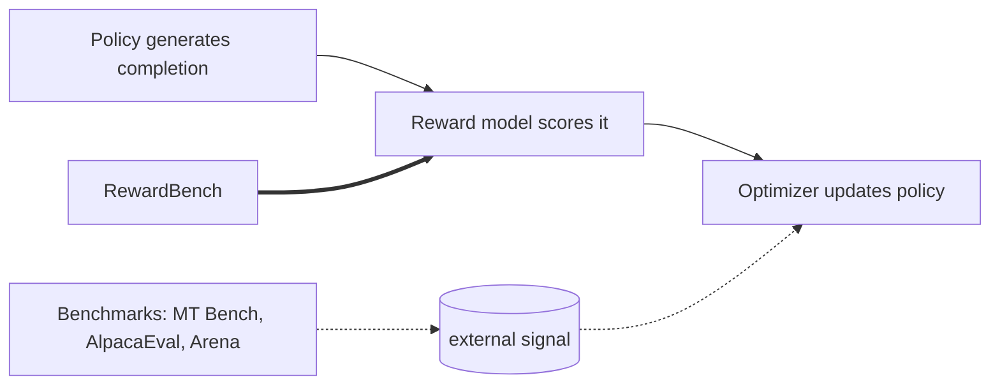
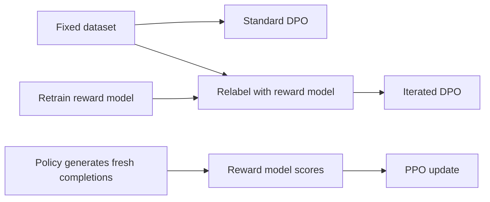

DPO was the story of 2023. Direct Preference Optimization took a May 2023 paper and, after the Zephyr model made it work in September, turned preference fine-tuning into something any lab could run. Nathan Lambert, who helped build Zephyr and Tulu, asks what comes after. The DPO mechanics and the RLHF objective are taught in [CS336 L15](../../foundations/cs336/l15-post-training-sft-rlhf.html). This lesson does not repeat them. It covers the new material: why DPO took over, what the path to it looked like, what RewardBench revealed about reward models, how PPO compares in controlled experiments, and where online methods fit.

## The data reality behind alignment research

The central fact of the talk: labs do not have industry-scale human data. Chatbot Arena had collected about 800,000 preference data points by May 2024. Meta bought about 1.5 million comparisons from an annotation provider for Llama 2 alone, and that paper was already years old at lecture time. OpenAI and Anthropic buy at far larger scale. [02:29](ts:2:29)

That asymmetry frames every method in the lecture. Researchers cannot replicate industry RLHF pipelines on human data. DPO succeeded partly because it made alignment research possible with far fewer resources. The rest of the lecture is the open research community asking whether simplicity costs performance, and what genuinely beats DPO.

## The path to DPO models

Lambert traces the community's route to DPO through a year of open models, starting with the first instruction-tuned releases of April 2023: Alpaca, Vicuna, Koala, and Dolly. The turning point was Vicuna's ShareGPT data: real human prompts scraped from a Chrome extension that shared ChatGPT conversations. It was a legal gray area, collected without consent, and it unlocked a wave of research. Consented successors now exist: LMSYS-Chat-1M and WildChat, the AI2 project that traded free ChatGPT access for data. [15:53](ts:15:53)

OpenAssistant showed how hard human data is to collect: one April 2023 Discord community produced 161,443 messages with 461,292 quality ratings, and nothing of that scale has appeared since. The first open RLHF model, CarperAI's StableVicuna, beat its Vicuna baseline yet nobody built on it. Lambert's lesson: openness alone does not spread a method. DPO spread because it shipped with a recipe people could copy. [17:00](ts:17:00) [17:49](ts:17:49)

Summer 2023 brought the Llama 2 backlash. Llama 2 chat refused harmless requests, like killing a Linux process, and the community answered with "uncensored" models that stripped refusal phrases such as "as a language model" from training data. Lambert dislikes the name, since the models were never explicitly censored. [18:39](ts:18:39)

Then the two DPO milestones. Zephyr-beta, a Mistral 7B fine-tune on the UltraFeedback dataset, was the first model to make a splash with DPO in September 2023, four months after the paper. Two things made it work: UltraFeedback, a synthetic preference dataset labeled by GPT-4 from OpenBMB, and a learning rate near 5e-7, orders of magnitude below the usual 3e-4 recipe. MT Bench 7.34 at 7B. [20:44](ts:20:44)

Tulu 2 proved DPO scales. The same recipe on Llama 2 70B, trained on TPUs through the Google Tensor Research Cloud, reached MT Bench 7.89. That result started the DPO versus PPO debate for real, because it showed DPO competing at the scale industry cares about. [22:40](ts:22:40)

Lambert adds that PPO-side models kept beating DPO models in the open: Nvidia's SteerLM, which fine-tunes conditioned on attributes, and Starling, which introduced the Nectar dataset and a k-wise preference loss that moved beyond pairwise comparisons. Starling 7B reached MT Bench 8.09, beating everything except GPT-4 at the time. [32:00](ts:32:00)

## RewardBench: evaluating the reward model

Industry engineers kept saying reward models are the crucial part of RLHF. Lambert asked what "crucial" means when no benchmark evaluates them. RewardBench, released March 2024, is the answer. It collects prompts with human-made chosen and rejected completions, runs each candidate reward model over both, and scores whether it prefers the right one. [26:00](ts:26:00)

The benchmark sits on top of a strange training regime. Reward models take a prompt plus two completions and output two scalars. The loss pushes the chosen completion's score above the rejected one's, which is why training needs both completions in the batch at once. Industry trains these models for one epoch, overfitting is a real risk, and test-time agreement with annotators lands at 65 to 75 percent. Lambert asks whether that noise is a signal or a bug: preferences differ across people, so full agreement might be the wrong target. [27:59](ts:27:59)

The feedback loop diagram above is Lambert's core critique. Existing evaluation tools sit outside the loop: they judge the final policy. RewardBench is the first tool that probes the reward model directly. [26:20](ts:26:20)

By May 2024 the leaderboard had moved fast: the model ranked fifth in March was 31st two months later. Chat Hard, a set of trick questions and subtle topic shifts where a rejected completion is deliberately off-topic, stayed the hardest slice. Safety showed three patterns: models that handle refusal correctly, models that refuse everything, and models that answer everything. Lambert reads that as confirmation of a pattern people suspected but could not measure. [33:14](ts:33:14)

Two findings matter. First, LLM-as-a-judge, asking GPT-4 or GPT-4o which answer is better, was not state of the art as a reward model. Cohere's trained reward models beat the best open models by 2 to 3 points on average and beat GPT-4 as a judge in the closed-domain setting. Second, DPO models cannot serve as reward models without their reference checkpoint. The DPO reward is a ratio of policy to reference probabilities, summing log probabilities to values near minus 200. Released models never ship the reference, and without it every DPO model's RewardBench score collapses. DPO trains an implicit reward model, but the community cannot use it unless the reference ships with the weights. [32:26](ts:32:26) [37:42](ts:37:42)

## PPO versus DPO: the empirical disentangling

The middle of the lecture presents a systematic study, Ivison et al. 2024, asking whether PPO actually beats DPO. The work was unpublished at lecture time, so the numbers are preliminary, but the structure is what matters. The base is Tulu 2 13B, already instruction tuned. Instruction tuning gives the biggest gain of any stage in the whole pipeline. [40:46](ts:40:46)

Then add preference tuning step by step:

1. **DPO on Anthropic HH-RLHF.** Small bump across chat, safety, and truthfulness. The dataset is noisy, which everyone in the area accepts, but it is the standard human-data baseline. [40:54](ts:40:54)
2. **DPO on UltraFeedback.** A bigger jump. Changing only the dataset, with the same algorithm, produced gains of 0 to 2 percent, which at research scale counts as a large result. [41:17](ts:41:17)
3. **Switch to PPO.** Another bump, including on factuality and the biggest jump on AlpacaEval 2. Across every dataset tested, PPO came out about 1 percent better on average. [41:52](ts:41:52)
4. **Scale the reward model up.** Expectations said general improvements. Reality: reasoning got better and other metrics declined, with no overall gain. Best-of-n sampling showed the larger reward models rank completions better, but that did not translate into a better downstream policy under PPO. [42:13](ts:42:13)
5. **Add more prompts, including code and reasoning.** Improvements on specific code and reasoning subsets, but other evaluations moved down, so the aggregate barely moved. [43:30](ts:43:30)

The takeaways, from the slides: "Always one more thing to ablate," "PPO gets the best model, but we do not know why." And the practical bottleneck: PPO generates new responses from the policy during training, and without fast inference infrastructure that generation dominates training time. DPO trains on fixed data and runs much faster. [44:13](ts:44:13)

At 13B the gain is about 1 percent. He says he understands why OpenAI uses PPO, but for a small academic team the cost-to-signal ratio is painful.

## What is actually special about online data

The lecture's technical core is a definition. "Online" in preference learning conflates two independent axes, and Lambert separates them.

- **Fresh generations.** Does the preference data come from the current policy, or from some other distribution? UltraFeedback mixes completions from Alpaca, Vicuna, GPT-3.5, GPT-4, and Llama, so training on it blends signal from many models into one policy. PPO generates only from the policy being trained. [47:49](ts:47:49)
- **Fresh labels.** When were the chosen and rejected labels assigned? A label from months ago is stale. A reward model can relabel completions during training, which refreshes the signal without new human data. [48:24](ts:48:24)

A cluster of papers from April and May 2024 converged on the same finding: online matters. Offline DPO on a fixed dataset converges to a horizontal line. Methods that refresh data produce learning curves that look like classic RL. [49:05](ts:49:05)

Several methods exploit this. Meta's Self-Rewarding Language Models asked the DPO model itself which answer is better, relabeled data between iterations, and trained again. D2PO (Discriminator-Guided DPO), a project Lambert advised, compares three regimes: standard DPO, relabeling preferences with a reward model, and relabeling plus retraining the reward model. On a closed-form task where the reward counts nouns in a sentence, retraining the reward model converges better than relabeling alone, and both beat fixed-data DPO. Open-ended evaluation with an LLM judge showed the same pattern. [50:54](ts:50:54)

The Llama 2 paper is the industry reference for the full version: collect human annotations in batches, generate new data with the previous checkpoint each round, train a new model per batch, and stack the rounds. That is online and iterative RLHF with real human data at each iteration, and academics cannot copy it without the annotation budget. [53:56](ts:53:56)

## What Meta did with Llama 3

The Llama 3 blog post listed its post-training as "a combination of supervised fine-tuning (SFT), rejection sampling, proximal policy optimization (PPO), and direct preference optimization (DPO)." Lambert's reading: Meta iterates with new data, tries a few methods at each point, and keeps the one that works best. Rejection sampling, which the lecture does not otherwise cover, is the simplest piece: rank SFT outputs with a reward model and retrain on the winners with the autoregressive loss. His hypothesis for the ordering is rejection sampling, then DPO, then PPO, with each method suited to a different point in the model's development. Short iteration timelines favor cheap methods early. Once the data is collected, the expensive PPO tuning extracts the final gains. [54:30](ts:54:30)

## Beyond pairwise preferences

The Q&A turned to preference formats beyond chosen-versus-rejected pairs, and Lambert sketched the space:

- **KTO** uses one-sided preference data, just a yes or no on a single completion, the way product apps collect thumbs up and thumbs down. It needs only a different loss function. [61:19](ts:61:19)
- **K-wise preferences.** Starling collects five to nine answers per prompt and trains with a listwise loss instead of a pairwise one. [62:01](ts:62:01)
- **Fine-grained preferences.** Instead of one score per completion, label separate attributes: conciseness, helpfulness, honesty. Nvidia's SteerLM does attribute-conditioned fine-tuning, and a UW group works on learning from fine-grained preferences. Lambert calls this the most academically emerging direction. [62:25](ts:62:25)

On reward hacking, his answer is blunt. A powerful optimizer against an incomplete reward representation will always find where the representation is wrong. Train without constraints and a language model will answer every question with "JavaScript" because that exploits the reward. The failure modes are often visibly absurd, which at least makes them easy to detect. [67:17](ts:67:17)

On why online DPO is hard even with a good reward model, he points at prompt matching. The policy's prompts often exactly match the reward model's training prompts, which means the reward model is grading on-distribution for PPO. But when you plug an off-the-shelf reward model into online training, distribution mismatch can break the loop. A truly good reward model would generalize, and most do not. [59:23](ts:59:23)

## Conclusions and current directions

The lecture closes with five research directions, from the slides: [56:14](ts:56:14)

1. **Data.** The open community has three preference datasets that matter: Anthropic HH, UltraFeedback, and Nectar. The field needs fresh, high-quality preference data, and community collection efforts are hard to sustain.
2. **Improve DPO.** The method space is exploding: ORPO, cDPO, IPO, BCO, KTO, DNO, sDPO, and more. DPO is here to stay as the starting point.
3. **More model sizes.** Almost all alignment research ran at 7B and 13B. Scaling down is the accessible academic frontier: small models give near-random benchmark scores, so a real breakthrough there would be high impact.
4. **Specific evaluations.** Chatbot Arena is too coarse. The field needs evaluations that say what a model can actually do.
5. **Personalization.** Training models that serve an individual user rather than one big model for one organization. Lambert frames this as the academic answer to competing with big tech.

> [!INTERVIEW] Expect the question "when would you use DPO over PPO and vice versa." The lecture's answer: start with DPO because it is simpler, cheaper, and easier to debug, and PPO reliably buys about 1 percent more at far higher engineering cost. The follow-up they want is the online framing: PPO generates fresh completions from the current policy and refreshes labels with the reward model, while DPO on a fixed dataset cannot, so the real question is how to add online data to DPO. Name Self-Rewarding LMs and D2PO as the two concrete answers the lecture gives.

## Sources

- Video: [Lecture 15 video, Stanford Online YouTube](https://www.youtube.com/watch?v=dnF463_Ar9I)
- Slides: cs224n-spr2024-lecture15-life-after-dpo-lambert.pdf (CS224N Spring 2024)
- DPO: [Rafailov, Sharma, Mitchell et al., Direct Preference Optimization, 2023](https://arxiv.org/abs/2305.18290)
- UltraFeedback: [arXiv 2310.01377](https://arxiv.org/abs/2310.01377) ([uncertain] on authors, the lecture attributes it to OpenBMB)
- Constitutional AI: [Bai et al., 2023](https://arxiv.org/abs/2212.08073)
- Llama 2: [Touvron et al., 2023](https://arxiv.org/abs/2307.09288)
- RewardBench: [Lambert et al., 2024](https://arxiv.org/abs/2403.13787)
- Zephyr: [HuggingFaceH4/zephyr-7b-beta](https://huggingface.co/HuggingFaceH4/zephyr-7b-beta)
- Tulu 2: [allenai/tulu-2-dpo-70b](https://huggingface.co/allenai/tulu-2-dpo-70b)
- Starling: [berkeley-nest/Starling-LM-7B-alpha](https://huggingface.co/berkeley-nest/Starling-LM-7B-alpha)
- LLM Bar: [Zeng et al., 2023](https://arxiv.org/abs/2310.07641)
- XSTest: [Röttger et al., 2023](https://arxiv.org/abs/2308.01263)
- Do-Not-Answer: [Wang et al., 2023](https://arxiv.org/abs/2308.13387)
- CS336 L15: [Post-Training: SFT and RLHF](../../foundations/cs336/l15-post-training-sft-rlhf.html)
