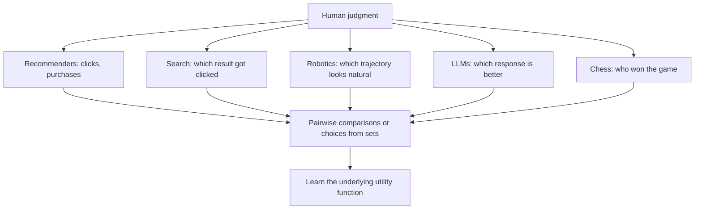

> [!KEY] Instead of manually predefining the learning goal, preference-based learning incorporates human feedback to guide the learning process.

## The problem with predefined objectives

Most machine learning starts with a fixed objective: minimize cross-entropy, maximize accuracy. This works when the goal is easy to specify. It breaks when the goal is "behave as humans intend." Helpfulness, harmlessness, and honesty resist formalization. Writing down a loss function for "be a good assistant" is the hard part, not the optimization.

Preference learning sidesteps the specification problem. Instead of defining the goal, collect human judgments about which outputs are better, then learn a model of those judgments. The objective is learned from data rather than written by hand.

## The running example: language model alignment

Modern language models train in two phases. The textbook uses this pipeline as the running example for the entire course.

**Pretraining** learns to predict the next token. The cross-entropy loss is a proper scoring rule: a forecaster maximizes expected score by reporting true beliefs. Minimizing it produces calibrated probabilities.

\[ \mathcal{L}_{\text{pretrain}} = -\mathbb{E}_{x \sim \mathcal{D}} \left[ \sum_{t=1}^{T} \log \pi_\theta(x_t \mid x_{<t}) \right] \]

Pretraining produces capable models, but prediction alone does not ensure helpful behavior. A pure next-token predictor happily continues harmful prompts.

**Post-training** (alignment) teaches the model to produce outputs humans prefer. This needs different data: not "what comes next" but "which output is better." The dominant approach is RLHF, and its simpler cousin DPO optimizes:

\[ \mathcal{L}_{\text{DPO}} = -\mathbb{E}_{(x,y_w,y_l) \sim \mathcal{D}} \left[ \log \sigma\left( \beta \log \frac{\pi_\theta(y_w \mid x)}{\pi_{\text{ref}}(y_w \mid x)} - \beta \log \frac{\pi_\theta(y_l \mid x)}{\pi_{\text{ref}}(y_l \mid x)} \right) \right] \]

where \(y_w\) is the preferred response, \(y_l\) the dispreferred one, and \(\beta\) controls deviation from the reference policy.

> [!PROF] The textbook's key move: DPO is maximum likelihood estimation under the Bradley-Terry model. If the implicit reward is \(r^*(x,y) = \beta \log \frac{\pi_\theta(y|x)}{\pi_{\text{ref}}(y|x)}\), then DPO assumes \(p(y_w \succ y_l \mid x) = \sigma(r^*(x,y_w) - r^*(x,y_l))\). This single equation connects modern LLM alignment to a 1952 model for ranking chess players.

## Preference data across machine learning

The same mathematical structure appears everywhere:



- **Recommender systems.** A click on item A rather than B reveals \(A \succ B\).
- **Information retrieval.** Clicking the third search result suggests it was preferred over the first two.
- **Robotics.** Humans indicate which trajectories look natural.
- **Language models.** Annotators compare candidate responses.
- **Sports.** Each chess game is a pairwise comparison. Elo ratings are a Bradley-Terry model.

## Types of comparison data

Three observation types, all generated from the same underlying preference distribution:

1. **Full rankings.** An ordering of all items. Rich but cognitively expensive to elicit.
2. **Choices from subsets.** Observing \((j, \mathcal{S})\): item \(j\) was the most preferred from set \(\mathcal{S}\). Formally, \(j \succ k\) for all \(k \in \mathcal{S} \setminus \{j\}\).
3. **Binary comparisons.** \(Y_{jj'} = 1\) means \(j\) preferred over \(j'\). Quick to elicit, the format behind RLHF and DPO.

A fourth type, **item-wise responses**, records accept or reject per item: \(Y_{ij} \in \{0,1\}\). This yields an \(N \times M\) response matrix of users by items. E-commerce purchases and likes live here.

> [!CAVEAT] Binary comparisons are convenient but lossy. They discard intensity: "slightly better" and "vastly better" look identical. Later lessons address what this costs.

## The assumptions underneath

Preference models rest on two structural assumptions about the oracle preference \(\prec\):

- **Totality.** For any pair \(j, j'\), either \(j \succeq j'\) or \(j' \succeq j\). The decision-maker can always express a weak preference.
- **Transitivity.** If \(j \succ j'\) and \(j' \succ k\), then \(j \succ k\).

Both are strong. Humans often have genuinely incomplete preferences: they lack expertise to compare two items, the items differ along incommensurable dimensions (helpfulness vs. safety in LLM responses), or the cognitive load is too high. Forcing a total order on such preferences introduces noise that random utility models do not capture well. This is absence of preference, not randomness in preference.

## The outside option

When a decision-maker is offered an item or "nothing," the textbook introduces an outside option indexed by \(0\). Then \(Y_{j0} = 1\) means accepting item \(j\), and \(Y_{j0} = 0\) means rejecting it.

The outside option represents a fundamental limit on what a system designer can obtain. A recommender system user might engage with content or do something else entirely. The model does not capture "something else" explicitly. All models are wrong, but some are useful.

## Context conditions everything

Choices are rarely unconditional. Data arrives as \((i, j, \mathcal{S})\): user or context \(i\), chosen item \(j\), choice set \(\mathcal{S}\). The context might be a search query, a robot's goal, or an LLM prompt. The same item is preferred in one context and rejected in another.

This is why RLHF data is triples \((x, y_w, y_l)\): the prompt \(x\) is the context that makes the comparison meaningful. Without it, "response A is better than response B" has no stable interpretation.

```mermaid
flowchart LR
    A[Context x] --> B[Choice set S]
    B --> C[Observed choice j]
    A --> D[Same item, different context]
    D --> E[Different choice]
    C --> F[Model: p(j | S, x)]
    E --> F
```

## How RLHF actually works

Christiano et al. (2017) introduced RLHF for training AI systems, and the textbook traces the pipeline:

1. Collect human comparisons between pairs of model outputs.
2. Fit a reward model to these comparisons, typically under Bradley-Terry: \(p(y_w \succ y_l) = \sigma(r(x, y_w) - r(x, y_l))\).
3. Optimize the language model against the learned reward with reinforcement learning (usually PPO), constrained to stay near the reference policy.

DPO collapses steps 2 and 3. Instead of fitting an explicit reward model and then optimizing it, DPO directly optimizes the policy. The implicit reward \(r^*(x,y) = \beta \log \frac{\pi_\theta(y|x)}{\pi_{\text{ref}}(y|x)}\) plays the role of the learned reward. This is why understanding Bradley-Terry matters for LLM work: it is the probabilistic assumption underneath the most widely used alignment method.

## The Gumbel-max trick

There is a computational reason to care about the Gumbel distribution beyond IIA. Sampling from a softmax distribution over \(M\) items naively requires computing all \(M\) probabilities. The Gumbel-max trick gives a shortcut:

1. Sample \(\varepsilon_j \sim \text{Gumbel}(0, 1)\) independently for each item.
2. Return \(\arg\max_j (V_j + \varepsilon_j)\).

The result is distributed exactly as \(\text{softmax}(V)\). This is not an approximation. It follows from the same extreme-value mathematics behind the IIA-Gumbel equivalence.

The trick appears in machine learning under various names. It is how practitioners sample from large categorical distributions efficiently, and it underlies the Gumbel-softmax (Concrete) relaxation used in differentiable sampling. The textbook's theoretical development thus pays off twice: once for modeling, once for computation.

## Preference data: the domain table

The textbook's cross-domain examples, worth internalizing because interviewers probe transfer:

| Domain | Observation | What it reveals |
|---|---|---|
| E-commerce | Purchase of B from {A, B, C} | Choice \((B, \{A,B,C\})\) |
| Search | Click on result 3 | Result 3 preferred over 1, 2 for this query |
| LLM annotation | A chosen over B for prompt x | Triple \((x, y_w=A, y_l=B)\) |
| Chess | Player j beats player k | \(Y_{jk} = 1\) |
| Streaming | Play vs. skip | Item-wise \(Y_{ij}\) |

Public LLM preference datasets in the triple format: Anthropic's HH-RLHF, OpenAI's summarization preferences, and the Stanford Human Preferences (SHP) dataset.

## What the textbook assumes

The textbook assumes basic probability, statistics, linear algebra, and machine learning. Code examples use Python. For readers wanting deeper background, it recommends Abu-Mostafa's Learning from Data for statistical learning, Bishop's Pattern Recognition and Machine Learning for Gaussian processes and Bayesian inference, and Sen's Collective Choice and Social Welfare for the social choice theory in Chapter 5.

The authors emphasize assumptions and limitations as first-class content. Callout boxes marked with warnings highlight where models fail. The pedagogical stance: understanding when a model fails matters as much as understanding when it works. This attitude runs through all three lessons here.

## The book's structure

The textbook has five chapters, each feeding the next:

1. **Foundations.** Random preference models, comparison data types, utility models, IIA.
2. **Learning.** MLE, Bayesian inference, Elo as SGD, active elicitation, DPO.
3. **Interaction.** Bandits, optimizing against fixed human policies, cooperative IRL.
4. **Inversion.** Behavioral biases, style control, paternalism.
5. **Aggregation.** Social choice, impossibility theorems, the DPO-Borda connection.

> [!INTERVIEW] "Why not just write a reward function?" is the interview question this lesson answers. The answer: for open-ended behavior, the specification is the hard part. Preference learning replaces hand-written objectives with learned models of human judgment, and the Bradley-Terry model is the mathematical bridge from 1950s psychometrics to DPO.
