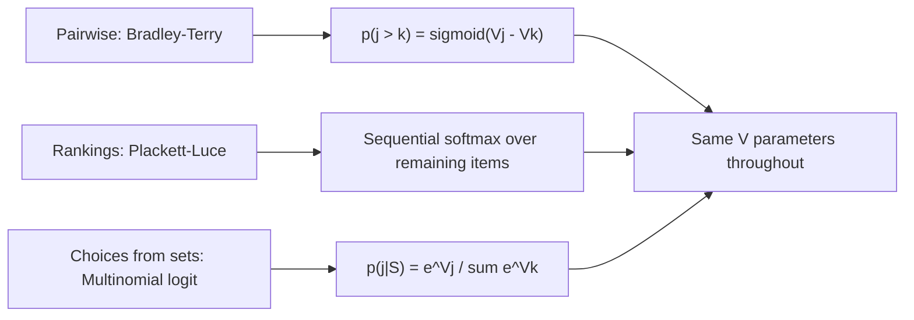

> [!KEY] The Bradley-Terry model says \(p(j \succ k) = \sigma(V_j - V_k)\). Every modern preference method, including DPO, is maximum likelihood under this equation or its cousins.

## Why randomness is essential

Human choice is noisy. The same person picks differently on different days. Deterministic preferences, the kind in consumer theory textbooks, cannot fit noisy data. We need stochastic models.

The textbook starts with an oracle preference \(\prec\): a random total order over items. Each order has probability mass \(p(\prec)\). With \(M\) items this is an \((M! - 1)\)-dimensional vector. For \(M = 10\), that is over 3.6 million parameters. [00:08](ts:8)

The chapter's central goal: collapse this complexity to something learnable.

## The Bradley-Terry model

Bradley and Terry (1952) proposed the paired comparison model, originally for ranking chess players. Each item \(j\) has a strength \(V_j\). The probability that \(j\) beats \(k\):

\[ p(j \succ k) = \sigma(V_j - V_k) = \frac{1}{1 + e^{-(V_j - V_k)}} \]

Only the difference matters. Adding a constant to all strengths changes nothing. This is the identification problem, covered in Lesson 3.

Worked example from the textbook: three players with \(V_A = 2.0\), \(V_B = 1.0\), \(V_C = 0.0\).

\[ p(A \succ B) = \sigma(1.0) \approx 0.731 \]
\[ p(A \succ C) = \sigma(2.0) \approx 0.881 \]

## Plackett-Luce for rankings

Plackett-Luce extends Bradley-Terry from pairs to full rankings. The probability of ranking \(A \succ B \succ C\):

\[ p(A \succ B \succ C) = \frac{e^{V_A}}{e^{V_A} + e^{V_B} + e^{V_C}} \cdot \frac{e^{V_B}}{e^{V_B} + e^{V_C}} \]

Pick the winner from the full set, then the winner from the remainder, and so on. With the same utilities: \(0.665 \times 0.731 \approx 0.486\). The most likely full ranking puts A first about 49% of the time.



## Luce's choice axiom and IIA

Luce (1959) gave the axiomatic foundation. The choice axiom is equivalent to the **Independence of Irrelevant Alternatives** (IIA): the relative probability of choosing \(j\) over \(k\) does not depend on what else is in the choice set.

\[ \frac{p(j \mid \mathcal{S})}{p(k \mid \mathcal{S})} = \frac{p(j \mid \mathcal{S} \cup \{\ell\})}{p(k \mid \mathcal{S} \cup \{\ell\})} \]

Under IIA, choice from any set is the softmax:

\[ p(j \mid \mathcal{S}) = \frac{e^{V_j}}{\sum_{k \in \mathcal{S}} e^{V_k}} \]

This single assumption collapses the \((M! - 1)\)-dimensional preference distribution to \(M\) parameters. That is the tractability bargain of the whole chapter.

## Where Bradley-Terry comes from: random utility

The deep result is the **IIA-Gumbel equivalence** (Theorem 1 in the textbook). A random utility model satisfies IIA if and only if utilities take the form:

\[ H_j = V_j + \varepsilon_j \]

with \(\varepsilon_j\) sampled i.i.d. from the Gumbel distribution, \(F(x) = e^{-e^{-x}}\).

Proof sketch, forward direction: with i.i.d. Gumbel noise,

\[ \frac{p(j \mid \mathcal{S})}{p(k \mid \mathcal{S})} = \frac{e^{V_j} / \sum_{\ell} e^{V_\ell}}{e^{V_k} / \sum_{\ell} e^{V_\ell}} = e^{V_j - V_k} \]

The denominators cancel. The ratio depends only on \(V_j - V_k\), so IIA holds. The converse (IIA implies Gumbel) is subtler. Yellott (1977) gives the full proof.

> [!WARN] Gumbel noise is not Gaussian noise. Gaussian noise gives the probit model, which lacks closed-form choice probabilities and needs numerical integration. Gumbel is chosen precisely because it yields the clean softmax form. The textbook contrasts logit vs. probit explicitly.

## Deterministic utility: the Rasch model

For item-wise data (users accepting or rejecting items), the textbook introduces the **Rasch model**. Each user \(i\) has appetite \(U_i\). Each item \(j\) has appeal \(V_j\):

\[ p(Y_{ij} = 1) = \sigma(U_i + V_j) \]

Enthusiastic users accept more items. Popular items are accepted by more users. The sorted response matrix shows a diagonal transition pattern.

The remarkable connection: for a single user, Rasch implies Bradley-Terry for pairwise comparisons. With logistic noise on the latent utilities, the user parameter cancels:

\[ p(j \succ k \mid i) = \sigma((U_i + V_j) - (U_i + V_k)) = \sigma(V_j - V_k) \]

Pairwise data reveals only item differences. Item-wise data reveals both user appetites and item appeals. The data type determines what is identifiable.

```mermaid
flowchart TB
    A[Latent utility: Hij = f(Ui, Vj) + noise] --> B{Data type?}
    B --> C[Item-wise Yij: Rasch, factor models]
    B --> D[Pairwise: Bradley-Terry]
    B --> E[Rankings: Plackett-Luce]
    C --> F[Identifies Ui and Vj]
    D --> F2[Identifies Vj - Vk only]
```

## Thurstone: the first random utility model

Before Bradley-Terry, there was Thurstone (1927). His law of comparative judgment, developed in psychophysics, proposed that perceived stimuli have random "discriminal processes." Each stimulus produces a noisy internal response; the subject reports whichever response is larger.

Thurstone's model is the conceptual ancestor of everything in this lesson. Replace "perceived stimulus intensity" with "utility" and "discriminal process" with "Gumbel noise," and you have the modern random utility model. The mathematics changed; the idea did not.

## What choice modeling is for

The lecture frames choice modeling as a prediction tool [01:09](ts:69): given a set of alternatives in a context, predict what an individual or group will choose. This covers product purchases, vote choices, route selection, and response preferences.

The field has a long history, and the lecture gives context [01:03](ts:63). The models look simple, but they underpin econometrics (McFadden's Nobel), marketing, transportation planning, and now AI alignment. The same equations serve all of them.

## From Rasch to factor models

The Rasch model uses one-dimensional parameters: user appetite \(U_i\) and item appeal \(V_j\). This is often too simple. A horror fan and a comedy fan have opposite preferences over the same films, but Rasch gives each user a single number.

Factor models extend to \(K\) dimensions. Users and items become vectors; the utility is their interaction. This is the same move as matrix factorization in recommender systems, and it is why multi-dimensional representations are essential there. The textbook marks this as a key learning outcome: one dimension captures popularity, but taste needs geometry.

## Elo ratings are Bradley-Terry

The Elo system, used in chess and competitive gaming, is a Bradley-Terry model with a specific parameterization. Each player has a rating \(R_j\). The expected score of \(j\) against \(k\):

\[ E_{jk} = \frac{1}{1 + 10^{(R_k - R_j)/400}} \]

This is the logistic function with base 10 and a scale factor of 400. A 400-point rating gap means 10:1 odds. The update rule after a game is stochastic gradient descent on the Bradley-Terry log-likelihood, a connection the textbook develops in Chapter 2.

This matters because it shows the model's reach: the same equation ranks chess players, trains reward models, and powers DPO. When an interviewer asks about Elo, the strong answer connects it to Bradley-Terry and logistic regression.

## Deriving Plackett-Luce from sequential choice

Plackett-Luce has an intuitive generative story. To produce a ranking:

1. Choose the top item from the full set via softmax over utilities.
2. Remove it. Choose the next from the remainder via softmax.
3. Repeat until the set is empty.

Each step is a valid IIA choice. The product of these conditional probabilities gives the ranking probability. This is why Plackett-Luce is the natural extension of Bradley-Terry: it applies the same choice rule repeatedly.

The model also handles partial rankings. If only the top-\(k\) are observed, multiply the first \(k\) terms and stop. The unranked remainder contributes nothing.

## The Luce axiom in plain language

Luce's choice axiom states that the probability of choosing \(j\) from set \(\mathcal{S}\) factors as a ratio of scale values:

\[ p(j \mid \mathcal{S}) = \frac{v_j}{\sum_{k \in \mathcal{S}} v_k} \]

for some positive scale values \(v_j\). This looks like an assumption, but Luce derived it from a more primitive axiom about how choice probabilities compose when sets are combined. The textbook presents IIA as the working form and the choice axiom as the foundation.

The key move: IIA is not derived from data. It is imposed as a modeling choice that buys tractability. Every application of Bradley-Terry, Plackett-Luce, or the multinomial logit is a bet that IIA holds approximately. Lesson 3 examines what happens when the bet loses.

## McFadden and the Nobel connection

McFadden (1974) connected random utility theory to econometrics through the conditional logit model. His work on discrete choice analysis, including the nested logit and mixed logit extensions, earned the Nobel Prize in Economics in 2000. The citation recognized that discrete choice theory had become a cornerstone of microeconometrics, with applications from transportation to marketing to environmental economics.

This history matters for machine learning because the same models now train AI systems. When RLHF fits a reward model to human comparisons, it runs McFadden's conditional logit on annotator data. The Nobel-winning econometrics of the 1970s is the alignment infrastructure of the 2020s.

## Historical lineage

The textbook traces a century of ideas, and the lecture covers this history [01:03](ts:63):

- **Thurstone (1927).** Law of comparative judgment. First random utility model.
- **Bradley and Terry (1952).** Paired comparisons for chess and competitions.
- **Luce (1959).** The choice axiom, the axiomatic foundation.
- **McFadden (1974).** Random utility meets econometrics. Nobel Prize 2000.
- **Christiano et al. (2017).** RLHF brings preference models to AI training.
- **Rafailov et al. (2023).** DPO connects preference optimization to Bradley-Terry.

> [!INTERVIEW] "Derive the Bradley-Terry model from a random utility model" is a natural interview question after RLHF. The answer: assume \(H_j = V_j + \varepsilon_j\) with i.i.d. Gumbel noise, then \(p(j \succ k) = \sigma(V_j - V_k)\) falls out. Know also why Gumbel and not Gaussian: closed-form softmax vs. numerical integration.
