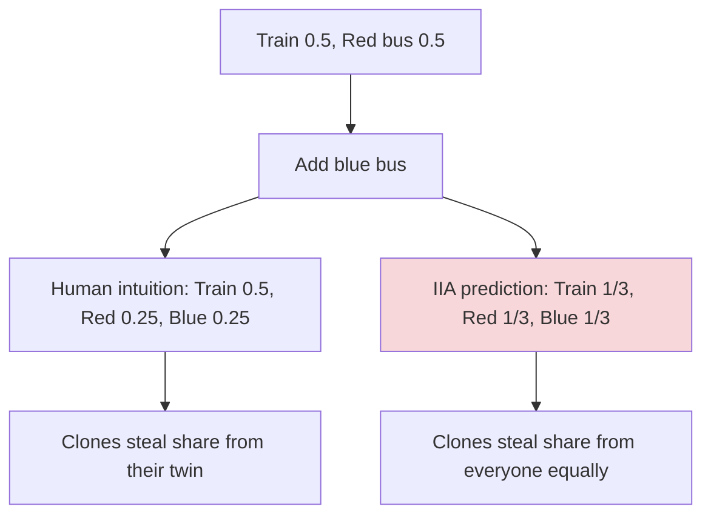
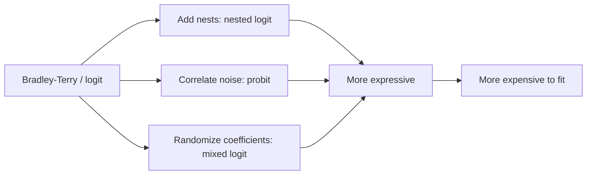
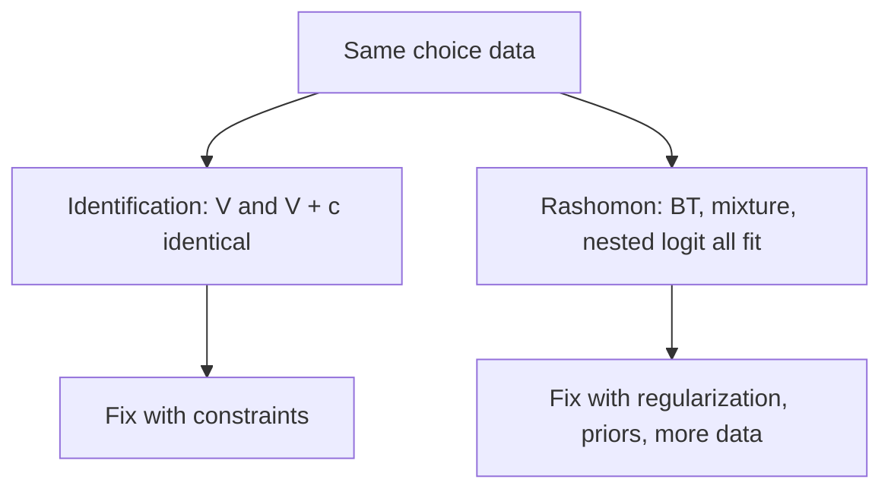

> [!KEY] IIA is both the source of Bradley-Terry's tractability and its main failure mode. Know exactly when it breaks.

## IIA's power

From Lesson 2: IIA collapses an \((M! - 1)\)-dimensional preference distribution to \(M\) parameters. The ratio \(p(j \mid \mathcal{S}) / p(k \mid \mathcal{S})\) never depends on what else is offered. This makes learning feasible. It is also a strong claim about human behavior, and it fails in recognizable ways.

## Failure 1: the red-bus/blue-bus problem

The classic counterexample. A commuter chooses between a train and a red bus, each with probability 0.5. Now add a blue bus, identical to the red bus except color. Intuition: the two buses split the bus share, so probabilities become train 0.5, red bus 0.25, blue bus 0.25.

IIA forbids this. Under IIA, the train-to-red-bus ratio must stay 1:1 when the blue bus is added, giving train 1/3, red 1/3, blue 1/3. The model treats the blue bus as a genuinely new alternative rather than a clone.

The problem is correlated noise. Red and blue buses have nearly identical unobserved attributes, so their utility shocks move together. I.i.d. Gumbel noise cannot express this.

## Failure 2: population heterogeneity

IIA can also fail because the population is mixed. Suppose half the population loves buses and half loves trains. Aggregate choice data looks like everyone is indifferent, but no individual is. A single Bradley-Terry model fits the aggregate while describing nobody.

The textbook's framing: under the heterogeneity view, observing \(j\) chosen more often than \(j'\) means more decision-makers prefer \(j\). Under the bounded-rationality view, the same observation may reflect systematic errors. The noise interpretation determines what conclusions the data licenses.

## Escapes from IIA

When IIA fails, the discrete choice literature offers richer models:

- **Probit.** Gaussian noise \(\varepsilon \sim \mathcal{N}(0, \Sigma)\) with arbitrary covariance. Correlated shocks handle red-bus/blue-bus naturally. Cost: no closed-form choice probabilities, numerical integration required.
- **Nested logit.** Group alternatives into nests with correlated noise inside each nest. Bus nest = {red, blue}, train nest = {train}. IIA holds within nests; substitution across nests can violate it. Tractable middle ground.
- **Mixed (random coefficients) logit.** Let the utility parameters themselves be random across the population. The most flexible extension, and the standard tool for heterogeneity.

## The identification problem

Even when the model is correct, utilities are only identified up to a constant. Adding \(c\) to every \(V_j\) leaves all choice probabilities unchanged:

\[ p(j \mid \mathcal{S}) = \frac{e^{V_j + c}}{\sum_k e^{V_k + c}} = \frac{e^{V_j}}{\sum_k e^{V_k}} \]

Practical consequences:

1. **Anchor before fitting.** Set \(V_1 = 0\) or impose a sum-to-zero constraint. Estimating all parameters freely gives non-identifiable likelihoods and numerical instability.
2. **Only differences are meaningful.** Choice data reveals \(V_j - V_k\), never absolute levels.
3. **DPO's answer.** The reference policy \(\pi_{\text{ref}}\) provides the normalization. The implicit reward measures deviation from the reference, sidestepping identification.

> [!WARN] Forgetting identifiability constraints is the textbook's flagged common pitfall. In two-sided models (users \(U_i\) and items \(V_j\)), the scales interact: you cannot estimate both without normalization.

## The Rashomon effect

Beyond identification, a deeper multiplicity: structurally different models can fit the same data equally well. Named after Kurosawa's film, where witnesses give contradictory but internally consistent accounts.

The textbook's example: 100 pairwise comparisons among 5 items, and three models each reach 90% accuracy:

1. Bradley-Terry with utilities \((0, V_2, V_3, V_4, V_5)\)
2. A 2-group mixture with group-specific utilities
3. A nested logit with correlation parameters

Identification is about algebraic equivalence within one model class ("these parameters mean the same thing"). Rashomon is about empirical indistinguishability across models ("these different models perform the same").

## Logit vs. probit: the noise decides the model

The choice between Gumbel and Gaussian noise is not aesthetic. It determines what you can compute:

| | Logit (Gumbel) | Probit (Gaussian) |
|---|---|---|
| Choice probabilities | Closed form (softmax) | Numerical integration |
| IIA | Holds by construction | Fails when \(\Sigma\) has correlations |
| Correlated alternatives | Cannot express | Natural via \(\Sigma\) |
| Fitting cost | Cheap | Expensive |

Gumbel is the default because it is tractable. Probit is the fallback when the data demands correlated shocks. Most practitioners start with logit and upgrade only when IIA violations appear in the data.

## The two views are complementary

The textbook stresses that the latent variable view (psychometrics tradition: measurement theory, explicit binary responses) and the random utility view (economics tradition: discrete choice, revealed preferences) are observationally equivalent for pairwise data. Given only pairwise comparisons, no test distinguishes them.

The random utility framework earns its keep through theoretical tools: IIA, the Gumbel equivalence, and the softmax form all emerge naturally. The latent variable framework earns its keep when the data is item-wise and user heterogeneity is explicit. Use whichever matches the data generating process.

## Why identification matters in practice

The identification problem is not abstract. Consider fitting Bradley-Terry to LLM preference data without anchoring. The optimizer sees a flat direction: shifting all utilities by \(c\) leaves the likelihood unchanged. Gradient-based methods drift along this direction, producing unstable estimates that differ across runs. The fix is mechanical but mandatory.

In DPO, the reference policy solves this differently. The implicit reward is defined relative to \(\pi_{\text{ref}}\), so there is no free constant to drift. This is one reason DPO is more stable than fitting a standalone reward model: the normalization is built into the objective rather than imposed as a constraint.

## The Rashomon ratio

The textbook quantifies multiplicity with the Rashomon ratio: the fraction of models in a class that perform within \(\epsilon\) of the best. A high ratio means many explanations fit equally well, and interpreting any single model's parameters as ground truth is dangerous.

This has a direct implication for alignment. When a reward model is one of many equally good fits, optimizing against it aggressively (as PPO does) can exploit quirks of the chosen fit rather than true human preferences. This is one lens on reward hacking: the optimizer finds behaviors that the particular fitted reward rates highly but humans would not.

## Nested logit mechanics

Nested logit deserves a closer look because it is the most commonly used IIA relaxation in practice. The model has two stages:

1. Choose a nest \(B\) from the set of nests, with probability proportional to the nest's inclusive value (a log-sum of its members' utilities).
2. Choose an alternative \(j\) within nest \(B\) via softmax over nest members.

Correlated shocks live inside nests. The red and blue buses share a nest, so adding the blue bus splits the bus nest's probability without touching the train's. IIA holds within each nest but not across nests.

The cost is specifying the nest structure by hand. The modeler decides which alternatives are similar enough to group. This is a feature when domain knowledge is strong (transportation modes) and a limitation when it is not (LLM responses, where similarity is less obvious).

## Mixed logit for heterogeneity

The mixed (random coefficients) logit handles population heterogeneity by letting utility parameters vary across decision-makers. Instead of fixed \(V_j\), each person draws their own \(V_j^{(i)}\) from a population distribution, typically Gaussian.

This captures the horror-fan vs. comedy-fan split directly: the population distribution over utilities is bimodal, and each person's draws reflect their taste. The cost is integration over the random coefficients when computing choice probabilities, which requires simulation.

Mixed logit is the standard tool in industrial organization economics for exactly this reason. Markets contain diverse consumers, and a single representative agent misleads. The textbook positions it as the most flexible IIA relaxation, at the price of the heaviest computation.

## Item-wise vs pairwise: the practical guide

The textbook closes Chapter 1 with guidance on data type selection:

| Consideration | Item-wise favored | Pairwise favored |
|---|---|---|
| Data abundance | Every interaction is a datapoint | Needs explicit elicitation |
| User identity | Users logged in | Anonymous or pooled |
| Goal | Personalized recommendations | Global item ranking |
| Scale | \(O(NM)\) observations | \(O(NM^2)\) possible pairs |

Use Bradley-Terry when ranking items for a population, users are anonymous, or comparisons are the natural format (tournaments, A/B tests). Use item-wise models when personalization matters and users are identifiable.

> [!INTERVIEW] Two questions this lesson answers. "When does Bradley-Terry fail?" Answer: cloned alternatives (red-bus/blue-bus) and heterogeneous populations; reach for nested logit, probit, or mixed logit. "Why can we not learn absolute utilities?" Answer: the softmax is shift-invariant, so only differences are identified; anchor one parameter or use a reference policy as DPO does.
