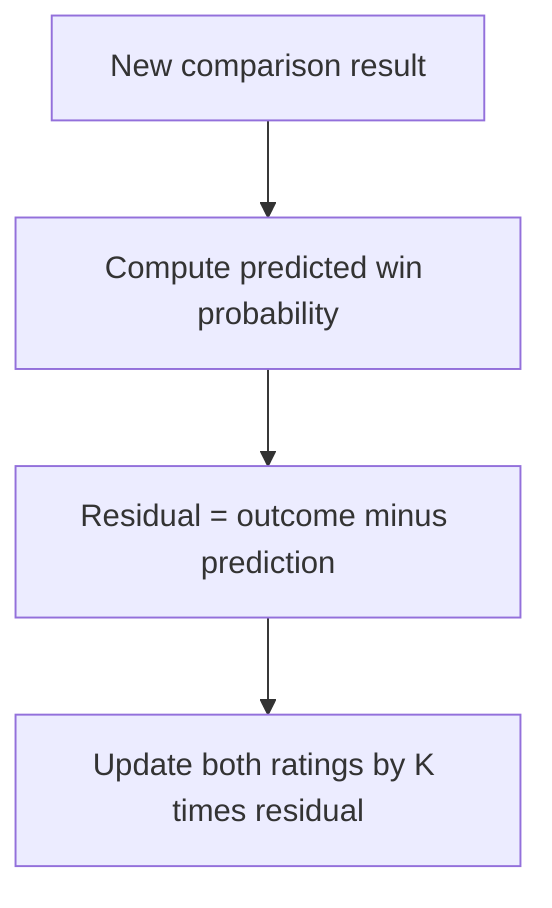
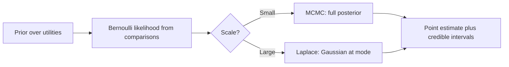

> [!KEY] DPO is Bradley-Terry maximum likelihood where the utility is \(\beta \log \frac{\pi_\theta(y|x)}{\pi_{\text{ref}}(y|x)}\). Every MLE technique in this lesson applies directly to DPO training.

> [!CAVEAT] The linked video's playlist title says "Model-based Preference Optimization," but its transcript covers metric elicitation. This lesson follows the course textbook, which is the authoritative source for this material.

## Maximum likelihood for Bradley-Terry

Given comparison data, the natural estimator maximizes the probability of what was observed. For a single user and item utilities \(V\), the Bradley-Terry MLE is:

\[ \hat{V} = \arg\max_V \sum_{j,j' \in \mathcal{D}_{\text{train}}} \log p(Y_{0,jj'} \mid \sigma(V_j - V_{j'})) \]

Each comparison contributes the log probability the model assigns to the observed winner. Standard optimizers like gradient descent carry out the optimization.

The gradient has a clean form. Let \(\mathcal{N}^+_m\) be pairs where item \(m\) is listed first, \(\mathcal{N}^-_m\) pairs where it is listed second. Define residuals \(r_{mk} = y_{mk} - \sigma(V_m - V_k)\). Then:

\[ \frac{\partial \ell}{\partial V_m} = \sum_{(m,k) \in \mathcal{N}^+_m} r_{mk} - \sum_{(k,m) \in \mathcal{N}^-_m} r_{km} \]

Each comparison adds the observed-minus-predicted win indicator. If \(m\) beats \(k\) more often than predicted, the residual is positive and pushes \(V_m\) up. If \(m\) loses more than predicted, it pushes \(V_m\) down.

## The connected comparison graph

The MLE exists and is unique if and only if the comparison graph is strongly connected. For every pair of items, a chain of comparisons must link them. This is Ford's 1957 result.

If some items were never compared, directly or transitively, their utilities are not identifiable and the MLE diverges to \(\pm\infty\). In practice, sparse datasets (LLM evaluation where each response pair is annotated once) frequently produce disconnected graphs.

Regularization fixes this. An L2 penalty shrinks all parameters toward zero, which is equivalent to MAP estimation with a Gaussian prior. It prevents divergence by imposing the prior belief that utilities stay bounded.

## Elo is stochastic gradient ascent

The Elo rating system, seventy years old, is precisely stochastic gradient ascent on the Bradley-Terry log-likelihood with step size \(K\). Each game updates the two players' ratings by \(K\) times the residual: observed outcome minus predicted win probability.

This bridges a classical rating system to modern optimization. Batch MLE is more data-efficient. Elo handles streaming data and temporal drift naturally.

## Label noise: random versus systematic

Real annotation pipelines have noise, and its type matters. Uniform random noise (say 10% of labels flipped) attenuates learned utilities toward zero but preserves their ranking. Systematic noise is worse. If annotators consistently prefer verbose responses for reasons unrelated to the true objective, the MLE learns the annotators' biases as if they were genuine preferences. Rankings can reverse.

This connects to the inversion problem: observed choices may not reflect underlying preferences. Careful estimation models annotator-specific biases or down-weights unreliable annotations.

## DPO from first principles

Direct Preference Optimization skips the explicit reward model. The textbook's key connection: DPO is Bradley-Terry MLE where the "utility" of a response is:

\[ r^*(y \mid x) = \beta \log \frac{\pi_\theta(y \mid x)}{\pi_{\text{ref}}(y \mid x)} \]

The policy itself parameterizes the reward. The DPO loss is the BT negative log-likelihood with this implicit reward. Everything developed for BT MLE transfers: regularization prevents overfitting to preference data, and standard optimizers (Adam, learning rate schedules) accelerate convergence.

> [!WARN] DPO is called "reward-model-free" but it is not assumption-free. Three hidden assumptions. First, the implicit reward depends on the reference policy \(\pi_{\text{ref}}\), so different references yield different rewards. Second, preferences are assumed Bradley-Terry (i.i.d. Gumbel noise), so IIA violations in human judgments propagate silently. Third, the hyperparameter \(\beta\) controls the tradeoff between staying close to \(\pi_{\text{ref}}\) and optimizing preferences. Too small and the model barely moves. Too large and it overfits noisy labels. Always validate against held-out preference data.

## Evaluation

Three metrics, each measuring something different:

- **AUC** measures ranking accuracy: does the model order pairs correctly.
- **Log-likelihood** measures calibration quality: do predicted probabilities match observed frequencies.
- **Calibration error** directly assesses whether a predicted 70% win rate materializes 70% of the time.

The Bayes-optimal AUC (ranking by true win probabilities) bounds what any model can achieve. The gap between a fitted model and this bound separates estimation error from irreducible label noise.

## The Bradley-Terry model in one paragraph

As established in [Lesson 2](l02-preference-models.html), the Bradley-Terry model assigns each item a utility \(V_j\) and sets the probability that \(j\) beats \(k\) to \(\sigma(V_j - V_k)\). Only utility differences are identifiable: adding a constant to every \(V_j\) leaves all probabilities unchanged. The standard fix centers the estimates (zero mean) after fitting.

This non-identifiability is why the textbook aligns estimated utilities to ground truth via least squares before comparing them in simulations. Correlation, not raw mean squared error, is the honest metric.

## Bayesian inference: uncertainty over utilities

Maximum likelihood returns a point estimate. Bayesian inference returns a distribution. Place a prior on the utilities (standard normal is the textbook default), multiply by the Bernoulli likelihood from observed comparisons, and the posterior captures both central estimates and the uncertainty around them.

The posterior has no closed form for Bradley-Terry, so the textbook uses Markov chain Monte Carlo. A Metropolis-Hastings sampler initialized at the MAP estimate draws utility vectors from the posterior. The spread of the draws gives 95% credible intervals per item.

For large problems MCMC is too slow. The Laplace approximation fits a Gaussian at the posterior mode instead. This cheaper approximation is essential for GP-based preference models, where the non-Gaussian likelihood makes exact inference intractable.

## Regularization is a prior in disguise

L2 regularization adds a penalty \(\frac{\lambda}{2}\|V\|^2\) to the objective. This is exactly MAP estimation with a Gaussian prior of variance \(1/\lambda\). The frequentist penalty and the Bayesian prior are the same mathematical object.

This matters in practice. Sparse comparison data (each LLM response pair annotated once) produces disconnected graphs where unregularized MLE diverges. The L2 penalty keeps every estimate finite. Early stopping provides a similar effect through a different mechanism: halt optimization before the parameters can run away.

## Train, test, and model selection

The textbook's protocol: split comparison pairs 80/20 into train and test. Fit on train, evaluate ranking accuracy (AUC) and calibration (log-likelihood) on test. The Bayes-optimal AUC, computed from ground-truth win probabilities on simulated data, separates estimation error from irreducible label noise.

Cross-validation selects hyperparameters without a separate validation set: regularization strength, model dimensionality, kernel parameters. Choose the setting with the best estimated out-of-sample performance.

## The three methods side by side

On the textbook's synthetic LLM preference task (50 responses, embedding utilities, 10% label noise), MLE, Bayesian MCMC, and Elo all recover utilities correlated with ground truth:

- **MLE** is fastest and most scalable. The default for large-scale applications.
- **Bayesian inference** provides posterior distributions and credible intervals, at substantially higher computational cost.
- **Elo** learns incrementally from streaming data and adapts to temporal drift, but is less data-efficient than batch methods.

In production: real datasets have 10K to 100K+ comparisons. MCMC becomes prohibitive, so MLE or online methods win. New responses have no comparison history (the cold-start problem) and need initialization strategies. User preferences drift over time, which favors online updates.

> [!INTERVIEW] "Derive DPO from Bradley-Terry" is a strong interview question. The answer: write the BT likelihood over preference pairs, substitute the implicit reward \(\beta \log(\pi_\theta/\pi_{\text{ref}})\), and the DPO loss drops out. Follow-ups: why the reference policy matters, what breaks when human preferences violate IIA.
