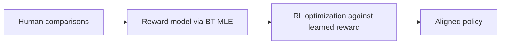
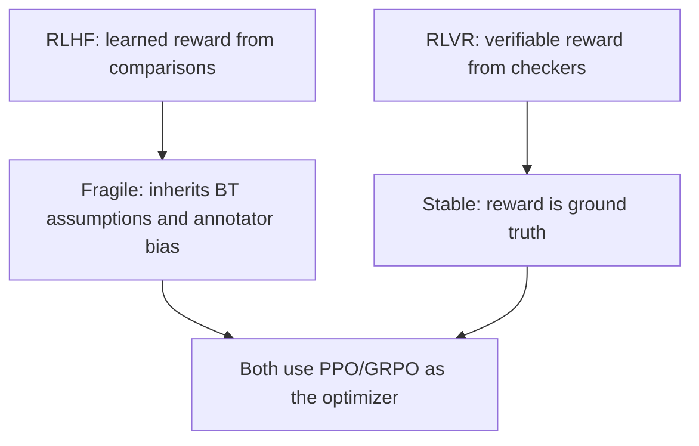
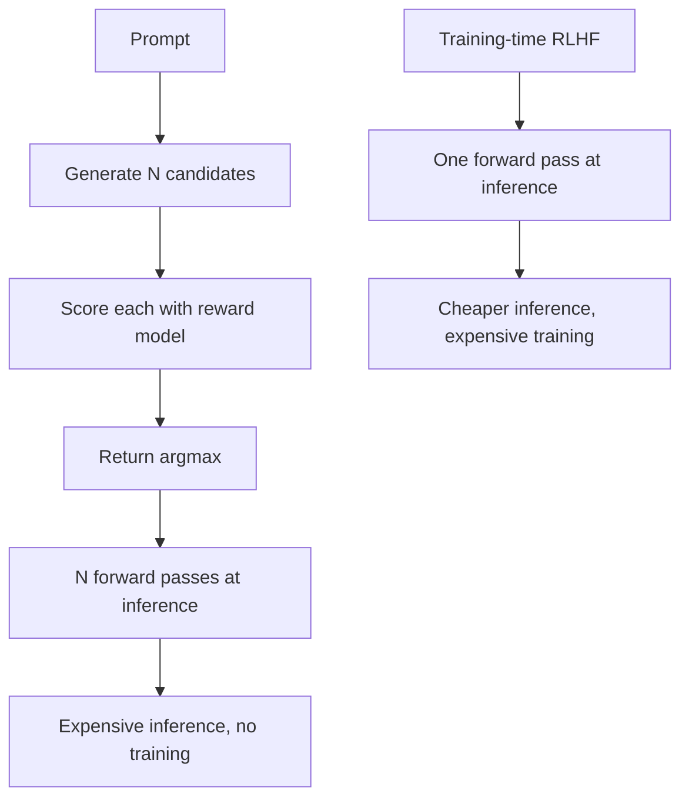

> [!KEY] RLHF is a two-stage pipeline: learn a reward function from human comparisons, then optimize the policy against it with RL. The preference-learning contribution is the first stage. The RL machinery is standard.

This is a bridge lesson. [CS336 Lesson 15](../../foundations/cs336/l15-post-training-sft-rlhf.html) teaches PPO mechanics in depth. [CS336 Lesson 16](../../foundations/cs336/l16-post-training-rlvr.html) covers GRPO and RLVR. [CS329H Lesson 4](../cs329h/l04-learning-preferences.html) derives the preference-modeling foundations. What is new here is the CS329H framing: why the pipeline has this shape, and what each stage assumes.

## The two-stage pipeline

Stage one is preference learning. Human annotators compare pairs of responses. A reward model is fit by Bradley-Terry maximum likelihood, exactly as derived in Lesson 4. The reward model compresses human judgment into a scalar function.

Stage two is reinforcement learning. The language model is the policy. The learned reward model scores its outputs. PPO updates the policy to maximize expected reward while a KL penalty keeps it near the reference model.

## Why two stages instead of one

DPO (Lesson 4) collapses both stages into a single supervised loss. RLHF keeps them separate for a reason: the reward model is reusable. Once trained, it scores any policy's outputs without new human labels. It also enables best-of-N sampling at inference time: generate many candidates, keep the highest-reward one, no policy update needed.

The cost is the RL machinery itself. PPO needs a value function, careful KL tuning, and on-policy rollouts. Four models in memory at once (policy, reference, reward, value). DPO needs only the policy and reference.

## What the preference view adds

CS336 teaches PPO as an algorithm. CS329H asks what the reward model actually captures. Three points from the textbook carry over:

1. **The reward model inherits the BT assumptions.** Pairwise comparisons, i.i.d. Gumbel noise, IIA. Violations in human judgment become violations in the reward signal, and RL faithfully optimizes them.
2. **Reward hacking is preference mis-specification.** When the policy finds high-reward outputs humans would reject, the reward model failed to represent true preferences. This is the inversion problem from the textbook's later chapters, not an RL bug.
3. **Systematic label noise compounds.** Annotator biases learned in stage one become the optimization target in stage two. RL amplifies whatever the reward model believes.

## GRPO and the RLVR turn

Group Relative Policy Optimization drops the value function. For each prompt, sample a group of responses, compute rewards, and normalize within the group: advantage equals reward minus the group mean, divided by the group standard deviation. No learned critic, less memory, simpler training.

The RLVR (reinforcement learning with verifiable rewards) turn replaces learned rewards with checkable ones: math answers, code tests, formal proofs. When the reward is verifiable, stage one's fragility disappears. The preference-learning problem becomes a verification problem.

Mechanics for both live in [CS336 Lesson 16](../../foundations/cs336/l16-post-training-rlvr.html).

## Training the reward model

In practice the reward model is a language model with a scalar head. It trains on comparison triples \((x, y_w, y_l)\): prompt, winning response, losing response. The loss is the BT negative log-likelihood from Lesson 4. Typical datasets (Anthropic HH-RLHF, Stanford SHP) contain tens to hundreds of thousands of comparisons.

Two details matter. First, the reward model trains on the reference policy's outputs, so its judgments are valid near that distribution. Far from it, the reward model extrapolates and the KL penalty is the only guardrail. Second, annotator agreement is imperfect (often 60-70%), which caps the reward model's achievable accuracy. The noise sections of Lesson 4 explain why this ceiling exists.

## The KL penalty: why the policy cannot just maximize reward

Unconstrained reward maximization produces degenerate policies. The model learns to exploit quirks of the reward model rather than produce genuinely better responses. The KL penalty \(\beta \, \text{KL}(\pi_\theta \,\|\, \pi_{\text{ref}})\) anchors the policy near the reference model that generated the comparison data.

This is the same \(\beta\) that appears in DPO's implicit reward. Small \(\beta\) lets the policy move far but risks overfitting the reward model's errors. Large \(\beta\) keeps the policy safe but limits improvement. The tradeoff is identical in both frameworks because both descend from the same constrained optimization.

## Best-of-N: the inference-time alternative

Training is not the only way to use a reward model. Best-of-N sampling generates \(N\) candidate responses from the base policy, scores each with the reward model, and returns the highest-scoring one. No gradient updates, no KL tuning, no value function.

Best-of-N is a strong baseline that RLHF must beat to justify its complexity. It also sidesteps reward hacking during training: the policy never gets gradient signal to exploit, so it cannot over-optimize. The cost moves to inference, where generating \(N\) candidates multiplies compute.

## The four-model memory bill

PPO-based RLHF keeps four models in memory: the policy being trained, the frozen reference policy for the KL term, the reward model for scoring, and the value function for advantage estimation. For large models this dominates the hardware budget and motivates GRPO (which drops the value function) and DPO (which drops RL entirely).

## Choosing between RLHF, DPO, and RLVR

| Approach | Reward source | Needs RL | Strength | Weakness |
|----------|--------------|----------|----------|----------|
| RLHF/PPO | Learned from comparisons | Yes | Reusable reward model, best-of-N | Complex, 4 models, reward hacking |
| DPO | Implicit in policy | No | Simple, stable, one stage | No reusable reward, β sensitivity |
| RLVR/GRPO | Verifiable checkers | Yes | Ground-truth reward | Only for checkable tasks |

The textbook's practical guidance: use RLHF when human judgment is the only signal and you need the reward model as an asset. Use DPO when simplicity wins. Use RLVR whenever the task admits verification.

> [!INTERVIEW] "Why not just do supervised learning on the preferred responses?" The answer: SFT clones the preferred outputs but never learns the preference ordering itself. It cannot trade off between candidates or generalize the ranking to new pairs. Preference methods learn the comparison function, which is the actual object of interest.
