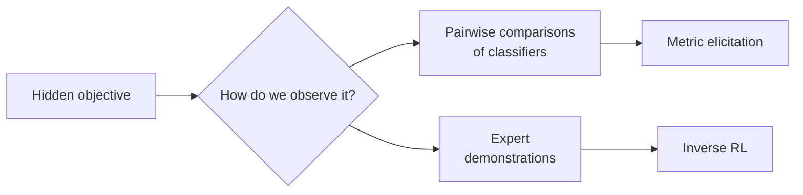
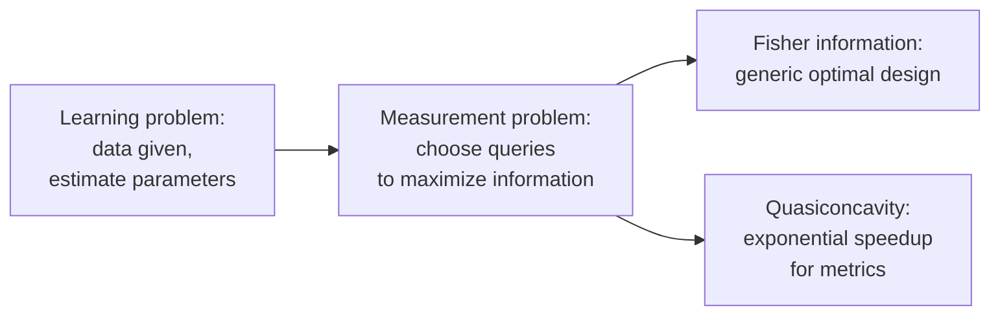
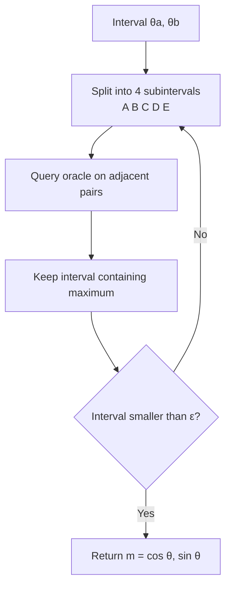

> [!KEY] Every method so far assumed the reward function was known. This lesson removes that assumption. Metric elicitation learns a classifier's hidden performance metric from pairwise comparisons. Inverse reinforcement learning learns a reward function from expert demonstrations.

## Why learn the reward

[CS329H Lesson 5](../cs329h/l05-rlhf.html) showed the RLHF pipeline: learn a reward model from comparisons, then optimize against it. That pipeline treats reward learning as preference modeling. This lesson generalizes the question. Sometimes the "reward" is a performance metric a practitioner carries in their head but never wrote down. Sometimes it is the objective an expert demonstrator was optimizing. In both cases, we must recover the objective before we can optimize it.

## The measurement problem

Metric elicitation is one instance of a broader pattern the textbook calls the measurement problem. The learning problem assumes data is given and asks how to estimate from it. The measurement problem asks which data to collect. Human feedback is expensive. If 100,000 preference labels cost a fortune, and 20,000 well-chosen comparisons give the same alignment quality, the choice of queries matters as much as the learning algorithm.

The central insight: not all comparisons are equally informative. Asking whether someone prefers "Hello!" to "Hi there!" reveals almost nothing. Comparing two substantively different responses to a hard prompt reveals a lot. [CS329H Lesson 6](../cs329h/l06-active-learning.html) formalized this with Fisher information. Metric elicitation exploits additional structure, the quasiconcavity of the metric, to do even better than generic optimal design.

## Metric elicitation

A practitioner choosing between classifiers has an implicit performance metric. For medical diagnosis, catching disease (sensitivity) matters more than avoiding false alarms (specificity). For spam filtering, the reverse may hold. The practitioner cannot state the weights. Metric elicitation recovers them from pairwise comparisons of classifiers.

### Linear performance metrics

A Linear Performance Metric (LPM) has the form:

\[ \phi(C) = m_{11} \cdot TP + m_{00} \cdot TN + m_0 \]

Here \(TP\) and \(TN\) are true positives and true negatives from the confusion matrix \(C\). The weights \((m_{11}, m_{00})\) encode the tradeoff between catching positives and avoiding false alarms. Since only the ratio matters, parametrize \(m = (\cos \theta, \sin \theta)\) for \(\theta \in [0, 2\pi]\). The unknown metric is a single angle.

### Quasiconcavity enables binary search

The key structural result: for a quasiconcave LPM that increases in TP and TN, the composition of the metric with the upper boundary of the confusion-matrix space is quasiconcave and unimodal on \([0, \pi/2]\). Quasiconcavity means a single peak, with no local maxima to trap optimization.

This turns a hard search into binary search:

Each iteration uses 4 queries and halves the interval. Query complexity is \(O(\log(1/\epsilon))\), exponentially better than the \(O(1/\epsilon^2)\) rate for general 2D estimation. Structure buys an exponential speedup.

### From metric to classifier

Once the weights are learned, the Bayes optimal classifier follows directly:

\[ \bar{h}(x) = 1\left[\eta(x) \geq \frac{m_{00}}{m_{11} + m_{00}}\right] \]

where \(\eta(x) = P(Y = 1 \mid X = x)\). Learning the metric is equivalent to learning the optimal classification threshold. The metric tells you where to draw the line.

> [!WARN] Metric elicitation assumes the practitioner's true metric is linear in TP and TN. If their real tradeoff is nonlinear (say, they care about F1), the LPM family cannot represent it. The textbook flags this as a modeling choice, not a universal truth.

## The Bayesian update behind elicitation

Elicitation is sequential: each answer updates the belief about the hidden metric, and the next query targets the remaining uncertainty. The textbook uses Laplace approximation for real-time updates. Place a Gaussian prior on the unknown parameter. After each response, update with a Newton step:

\[ \hat{U} \leftarrow \hat{U} + S(\hat{U})\mathcal{I}(\hat{U})^{-1} \]

where \(S\) is the score (sum of prediction errors) and \(\mathcal{I}\) is the observed Fisher information. The approximate posterior variance is \(\mathcal{I}(\hat{U})^{-1}\). The next query maximizes expected incremental information: pick the comparison with \(p(1-p)\) closest to its maximum. This is the same "hover near 50-50" principle from [CS329H Lesson 6](../cs329h/l06-active-learning.html), now applied to metric weights instead of user ability.

For evaluation, the textbook uses reliability: the fraction of total variance explained by the test rather than estimation noise. A simulation with 200 users and 200 calibrated items shows the Fisher-guided policy reaching high reliability far faster than random querying. Fewer questions, same precision.

## Inverse reinforcement learning

Metric elicitation recovers a static objective. Inverse reinforcement learning (IRL) recovers a sequential one: the reward function an expert was optimizing when they produced demonstrations.

The setup: an expert acts in a Markov decision process, and we observe their trajectories. We do not observe the reward. IRL inverts the mapping from reward to behavior, finding reward functions under which the expert's behavior looks optimal.

### The MDP in one paragraph

A Markov decision process is a tuple \((\mathcal{S}, \mathcal{A}, P, R, \gamma, \rho_0)\): states, actions, transition probabilities, reward function, discount factor, initial state distribution. A policy \(\pi_\theta(a \mid s)\) maps states to action distributions. The RL objective maximizes expected cumulative discounted reward:

\[ J(\theta) = \mathbb{E}_{\tau \sim \pi_\theta}\left[\sum_{t=0}^{T} \gamma^t R(s_t, a_t)\right] \]

When \(T = 0\), the MDP reduces to the bandit setting of [CS329H Lesson 8](../cs329h/l08-games-bandits.html). The RL machinery is standard. [CS229 Lesson 16](../../foundations/cs229/l16-rl-basics.html) teaches it in depth. What is new here is the inversion: given behavior, find \(R\).

### The fundamental ambiguity

IRL has a built-in identification problem. Many reward functions rationalize the same behavior. The zero reward function makes every policy optimal, including the expert's. A constant reward does the same. So IRL needs additional structure: maximum-entropy IRL prefers reward functions that make the expert look no better than necessary, spreading probability over all trajectories consistent with the demonstrations. This is the same identification theme from [CS329H Lesson 3](../cs329h/l03-utility-models.html), now in sequential form.

The classic framing is apprenticeship learning. The expert's trajectories reveal their feature expectations: how often they visit each state, which actions they favor. IRL finds a reward function under which a policy matching those expectations is optimal. But feature matching alone does not pick a unique reward. The max-entropy principle breaks the tie by choosing the distribution over trajectories with highest entropy subject to matching the expert's feature counts. Among all reward functions consistent with the demonstrations, prefer the one that assumes the least beyond what was observed.

Why does the ambiguity matter in practice? A reward function that is flat except for a spike on the exact demonstrated trajectories will rationalize the expert perfectly and generalize terribly. Max-entropy guards against this by spreading credit. The learned reward explains the demonstrations without overfitting to their accidents.

### IRL for robotics

The textbook's applied section covers IRL in robotics: comparing trajectories rather than rating them. A human watches two robot trajectories and picks the better one. This is preference-based IRL, and it connects directly to the Bradley-Terry machinery of [CS329H Lesson 2](../cs329h/l02-preference-models.html). The reward function is learned from pairwise trajectory comparisons, then standard RL optimizes it. This is exactly the RLHF pipeline with trajectories instead of text.

## Toward cooperation

Standard IRL treats the human as a passive demonstrator. But humans teach. A user choosing between LLM responses may deliberately pick the harder example to teach the system. A patient in a trial may change behavior based on what they think the system is learning. When the human is an active agent with beliefs about the learner, IRL's passive-expert assumption breaks.

This is not a corner case. Every preference dataset was produced by humans who knew their answers would train a model. Annotators develop theories about what the system needs. They emphasize edge cases. They correct what they think are the model's blind spots. The data-generating process already includes teaching. IRL methods that ignore this leave signal on the table.

[CS329H Lesson 8](../cs329h/l08-games-bandits.html) introduces Cooperative IRL, which models this explicitly: the human and the robot jointly optimize a shared objective, the human knows the true reward, and the robot must infer it while acting.

> [!INTERVIEW] "How would you learn a reward function from human data?" has two good answers: from comparisons (metric elicitation for classifiers, BT reward modeling for LLMs) and from demonstrations (IRL). Name the identification problem for IRL unprompted: many rewards rationalize the same behavior, so you need a selection principle like max-entropy. For metric elicitation, the interview-ready line is the quasiconcavity result: structure turns estimation into binary search.

## Sources

- Textbook: [Machine Learning from Human Preferences](https://mlhp.stanford.edu/Machine-Learning-from-Human-Preferences.pdf), Ch. 2 (metric elicitation) and Ch. 3 (RL foundations, IRL), Truong, Haupt, Koyejo, 2025
