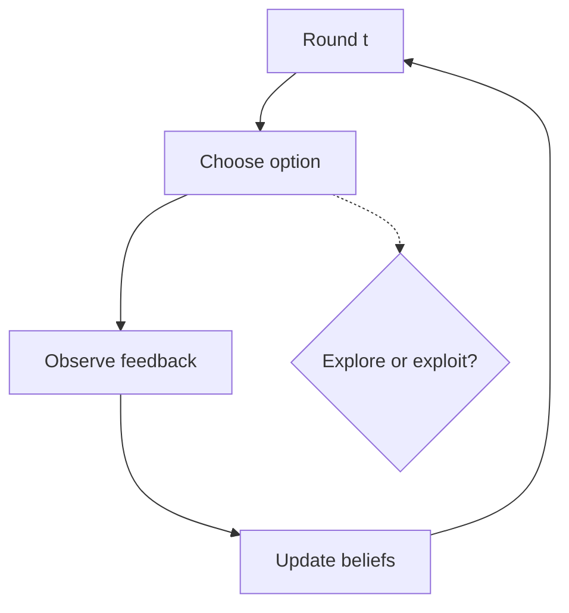
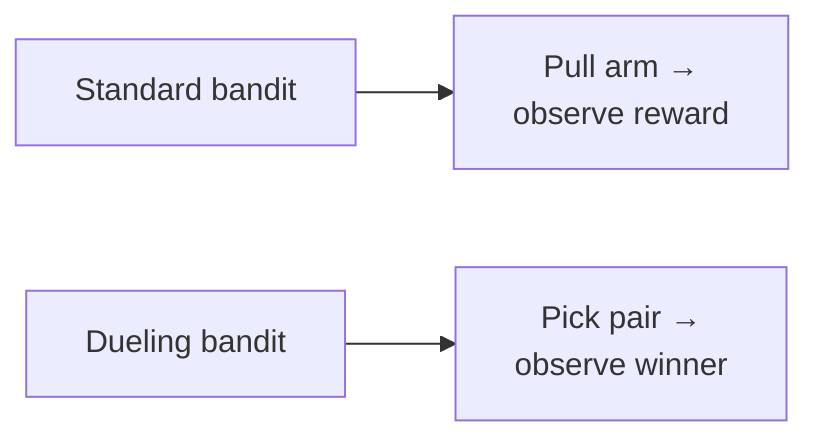
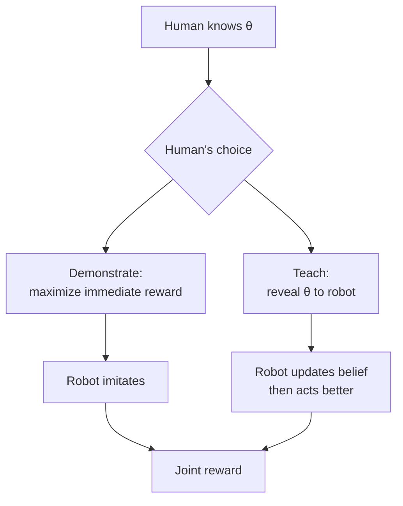

> [!KEY] Learning a preference model is half the problem. The other half is acting on it while it is still uncertain. Bandit algorithms balance trying new options against exploiting known good ones. Assistance games go further: they model the human as an active teacher.

## The exploration-exploitation tradeoff

Every round, the agent picks an option and observes feedback. Exploitation picks the option that looks best now. Exploration tries uncertain options to learn for later. Pure exploitation can miss a better option it never tried. Pure exploration wastes rounds on known-bad options. Every algorithm in this lesson is a different answer to how to balance the two.

The standard yardstick is regret: the gap between the reward of the best option in hindsight and the reward the algorithm actually collected. Good algorithms drive average regret toward zero. The textbook assumes stationary utilities: each option's reward distribution stays fixed over time. All regret bounds in this chapter need that assumption. In practice preferences drift, and the textbook is explicit that standard bounds then fail. Non-stationary variants use sliding windows or change-point detection.

## Two philosophies: UCB and Thompson sampling

The frequentist answer is UCB, Upper Confidence Bound. For each option, compute an optimistic estimate: the empirical mean plus an uncertainty bonus that shrinks with more observations. Pick the option with the highest optimistic value. Uncertainty itself drives exploration: an option tried rarely has a wide confidence interval, so its upper bound stays high until it is tested. UCB is deterministic given the data. Its analysis is clean, and it dominated the field for years.

The Bayesian answer is Thompson sampling. Instead of optimism, use randomization: sample a plausible world from the posterior, act optimally in it. The two philosophies often perform similarly, but Thompson sampling is simpler to implement for complex models (just sample and optimize) and extends naturally to the preference settings below, where UCB-style confidence sets are harder to construct.

## Thompson sampling

Thompson sampling is the most transparent Bayesian bandit method. The rule: sample a plausible world from your beliefs, then act optimally within it.

Formally, maintain a posterior over the user's latent preference vector \(p(U_i \mid \mathcal{D}_t) \propto p(\mathcal{D}_t \mid U_i)p(U_i)\), where \(\mathcal{D}_t\) is the user's observed responses so far. At each round \(t+1\), Thompson Sampling draws a single sample \(\tilde{U}_i^{(t)}\) from the posterior, and then chooses the next item that maximizes the sampled expected utility:

\[ j^* = \arg\max_j \tilde{U}_i^{(t)\top} V_j \]

This randomized strategy naturally balances exploration and exploitation: if posterior uncertainty is large, different draws lead to diverse item choices. As the posterior concentrates, the policy converges to greedy exploitation. No explicit exploration bonus is needed. The randomness does the work.

The idea dates to 1933, when William Thompson proposed it for clinical trials. It was largely forgotten for decades, overshadowed by frequentist methods like UCB. Its rediscovery in the 2010s, for online advertising and recommendation, showed this simple Bayesian rule often beats more complex alternatives.

> [!CAVEAT] Thompson sampling's guarantees need an accurate posterior. A common mistake is using a poor approximation, like a point estimate or a Gaussian fit where it does not belong, and then wondering why the theory does not hold. The textbook flags this explicitly.

The textbook develops Thompson sampling for linear objectives (where utility is \(U_i^\top V_j\)) and extends it to nonlinear objectives via local linearization, the same Fisher-information machinery from [CS329H Lesson 6](../cs329h/l06-active-learning.html). The linear case is the workhorse: item features \(V_j\) are known, the user's latent vector \(U_i\) is learned, and each round's posterior update is a Bayesian regression step.

## Dueling bandits

Standard bandits need numeric rewards. But humans are better at comparing than rating. The dueling bandit replaces "pull an arm, observe a reward" with "pick two arms, observe which wins."

The setup: each round, the agent selects a pair of options (a duel) and observes the winner. The goal is still to find the best option, but feedback is purely relative. This matches how preference data actually arrives: pairwise comparisons, not scores.

Dueling bandits connect directly to the Bradley-Terry model of [CS329H Lesson 2](../cs329h/l02-preference-models.html). The "reward" of an arm is its latent utility, and duel outcomes follow the pairwise comparison probabilities. Algorithms like Dueling-Thompson sampling maintain posteriors over utilities and pick duels that are informative about the ranking. The duel that best separates the current top two candidates is usually the most informative next query. This mirrors the Fisher-information principle from [CS329H Lesson 6](../cs329h/l06-active-learning.html): ask where the answer is most uncertain.

## Preferential Bayesian optimization

Bayesian optimization (BO) finds the optimum of an expensive black-box function \(g: \mathcal{X} \to \mathbb{R}\). Preferential BO (PBO) adapts it to human feedback: the oracle can only provide pairwise comparisons, not function values. This models A/B tests and recommender systems, where we want the best option but can only ask "which is better."

The key construction is the Copeland score. For a point \(x\), it measures the fraction of duels \(x\) would win:

\[ S(x) = \frac{1}{\mathrm{Vol}(\mathcal{X})} \int_{\mathcal{X}} \mathbb{I}\{\pi_f([x,x']) \geq 0.5\} \, dx' \]

A soft variant integrates the win probability directly:

\[ C(x) = \frac{1}{\mathrm{Vol}(\mathcal{X})} \int_{\mathcal{X}} \pi_f([x,x']) \, dx' \]

The Condorcet winner, the point with maximal soft-Copeland score, is the global optimum of the latent function. So PBO reduces "find the best point" to "find the point that beats everything else in expectation," which is exactly what pairwise data supports.

Acquisition functions decide which duel to run next. The textbook develops qEUBO (batch Expected Utility of the Best Option) with a regret analysis: Bayesian simple regret converges at \(o(1/n)\). Batch variants (qEI, qTS) query multiple duels per round, and regret converges faster with more options per query. The analysis assumes the latent function is injective, so the optimum is unique, and the preference model is correctly specified.

The batch results carry a practical lesson. Human queries are expensive, but presenting several options per query is cheap. If each round can show the user four candidates instead of two, convergence speeds up. The textbook's experiments confirm faster regret decay with larger batch sizes. Design the interface for batches, not single duels.

> [!WARN] PBO assumes pairwise feedback is the right modality. When absolute ratings are cognitively easy and well-calibrated, scalar feedback is strictly more informative per observation. Use duels when humans compare reliably but rate poorly, not by default.

## Assistance games

Everything so far treats the human as a passive oracle: the algorithm queries, the human responds. [CS329H Lesson 7](../cs329h/l07-elicitation-irl.html) noted this breaks when humans teach deliberately. Cooperative Inverse Reinforcement Learning (CIRL) models the interaction as a two-player cooperative game.

The setup:

- Human H knows the true reward parameters \(\theta\).
- Robot R does not know \(\theta\) but must act to maximize reward.
- Both share the payoff \(R(s, a_H, a_R; \theta)\). Interests are aligned.
- Only the human observes \(\theta\). The robot maintains a belief \(b_t^R(\theta)\) updated by Bayes' rule.

This is a game of asymmetric information. The human's optimal policy is not just to demonstrate good behavior but to teach: sometimes an instructive action that reveals \(\theta\) beats an expert demonstration that maximizes immediate reward.

The textbook's simulation makes this concrete: when the robot is uncertain about \(\theta\), the human exaggerating their preference (teaching) leads to higher cumulative joint reward than always taking the optimal action (demonstrating). Teaching dominates demonstrating precisely when the robot's uncertainty is high.

This reframes the whole course. Preference learning is not just statistical estimation from comparison data. It is a cooperative game where the human partner adapts to the learner. The algorithms in this lesson, Thompson sampling through CIRL, are points on a spectrum from "act under uncertainty" to "act with a teacher."

The spectrum also runs backward into the earlier lessons. [CS329H Lesson 6](../cs329h/l06-active-learning.html) asked which queries to pose. This lesson asks which actions to take while the answers are still coming in. [CS329H Lesson 7](../cs329h/l07-elicitation-irl.html) asked how to recover the reward. This lesson asks how to behave when the reward is known only through a posterior. Together they cover the full loop: elicit, estimate, act, repeat.

> [!INTERVIEW] "How do you balance exploration and exploitation?" The one-line answer is Thompson sampling: sample a plausible world from your posterior, act optimally in it. Then add the preference twist unprompted: when feedback is pairwise, use dueling bandits, and the Copeland score turns pairwise wins into a ranking. For the advanced follow-up, CIRL is the differentiator: standard IRL assumes a passive expert, but real humans teach, so model the interaction as a cooperative game with asymmetric information.

## Sources

- Textbook: [Machine Learning from Human Preferences](https://mlhp.stanford.edu/Machine-Learning-from-Human-Preferences.pdf), Ch. 3 (Truong, Haupt, Koyejo, 2025)
