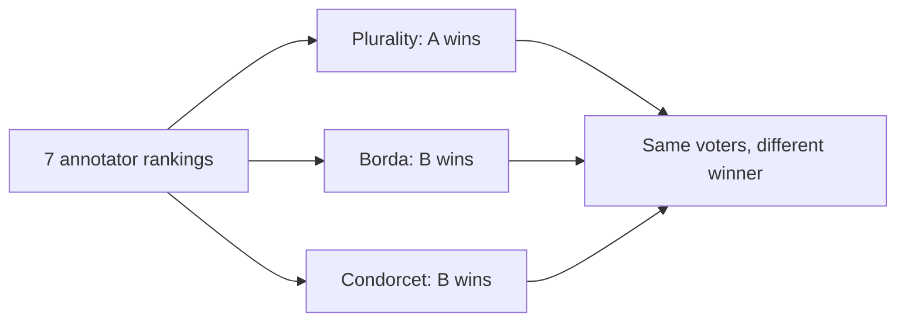
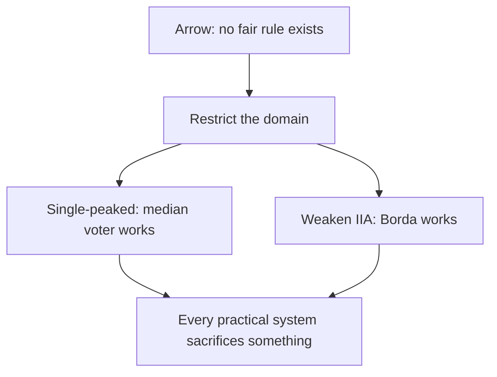

> [!KEY] Every RLHF pipeline aggregates preferences across annotators. Social choice theory says no aggregation rule is perfect, and DPO secretly implements one of the oldest voting rules.

## The aggregation problem

Individual preference modeling asks how one person decides. Social choice asks how a group decides. A **social welfare function** (SWF) takes each voter's ranking over alternatives and produces a single societal ranking. A **social choice function** (SCF) picks one winning alternative.

Formally: voters \(N = \{1, \dots, n\}\), alternatives \(A = \{a_1, \dots, a_m\}\) with \(m \geq 3\). Each voter \(i\) has a preference order \(\succ_i\). An SCF maps \((\succ_1, \dots, \succ_n)\) to one winner. An SWF maps the profile to a complete ranking \(\succ^*\).

In RLHF, the "voters" are annotators ranking model responses. The aggregation rule is usually invisible: average the reward model scores, or just pool all pairwise labels into one dataset. The choice of rule changes the outcome.

## Three voting rules, three winners

**Plurality:** each voter's top choice gets one vote. **Borda count:** with \(m\) alternatives, \(m-1\) points for first place, \(m-2\) for second, down to 0. **Condorcet:** the winner beats every other alternative in pairwise majority.

The textbook's worked example uses 7 annotators ranking three responses:

| Annotators | Ranking |
|:---:|:---:|
| 3 | \(A \succ B \succ C\) |
| 2 | \(B \succ C \succ A\) |
| 2 | \(C \succ B \succ A\) |

Plurality counts first-place votes: A gets 3, B gets 2, C gets 2. Winner: **A**. Borda assigns 2/1/0 points: A gets \(3 \times 2 = 6\), B gets \(3 \times 1 + 2 \times 2 + 2 \times 1 = 9\), C gets \(2 \times 1 + 2 \times 2 = 6\). Winner: **B**. Condorcet checks pairwise majorities: B beats A 4-3, B beats C 5-2. Winner: **B**.

Plurality picks A, but A loses head-to-head to both B and C. The rule is a value judgment, not a neutral procedure.

## The Condorcet paradox

Majority rule can cycle. Three voters: \(A \succ B \succ C\), \(B \succ C \succ A\), \(C \succ A \succ B\). Pairwise: A beats B 2-1, B beats C 2-1, C beats A 2-1. Every alternative loses to something. No Condorcet winner exists, even though every individual ranking is transitive.

## Arrow's impossibility theorem

Three classical axioms for a social welfare function:

1. **Unanimity (Pareto efficiency):** if everyone prefers \(x\) to \(y\), society ranks \(x\) above \(y\).
2. **Independence of irrelevant alternatives (IIA):** the social ranking of \(x\) vs \(y\) depends only on individual rankings of \(x\) vs \(y\).
3. **Non-dictatorship:** no single voter always decides.

**Arrow's theorem:** with three or more alternatives, no SWF satisfies all three. Any non-dictatorial rule violates unanimity or IIA.

Proof sketch: under the axioms, the social ranking of each pair must follow some decisive voter. IIA forces the same voter to be decisive across all pairs. That voter is a dictator.

> [!WARN] Arrow's theorem applies to ordinal rankings with unrestricted domain. Cardinal utilities (summing scores) escape it, but then interpersonal utility comparisons become the problem.

## Gibbard-Satterthwaite: strategy

Arrow is about fairness. **Gibbard-Satterthwaite** is about incentives: any deterministic SCF over \(m \geq 3\) alternatives that is **strategy-proof** (no voter can benefit from lying, regardless of others' votes) and **onto** (every alternative can win) must be dictatorial.

Applied to RLHF: if annotators knew their labels shaped the model, they would have incentives to vote strategically. [uncertain: the lecture poses this as a discussion question, not a settled result.]

## Escaping impossibility

The theorems assume unrestricted domain. Restrict the domain and fair rules exist.

**Single-peaked preferences:** alternatives sit on a line (left-right spectrum, thermostat settings), each voter has an ideal point, and preference falls off with distance. On single-peaked domains, the **generalized median voter scheme** is strategy-proof and Pareto efficient: take the median of voter peaks plus fixed "phantom" anchor votes.

**Modified IIA:** Borda count violates classical IIA but satisfies a weaker version (IIA') that also considers how far apart alternatives sit in each ranking. Relaxing IIA to IIA' escapes Arrow.

## The DPO-Borda connection

The result that ties this chapter to modern LLM training. Define the \(\pi\)-weighted Borda winner as the response maximizing expected win rate against alternatives drawn from the reference policy:

\[ y^* = \arg\max_{y} \mathbb{E}_{y' \sim \pi_{\text{ref}}}[1[y \succ y' \mid x]] \]

**Theorem (DPO-Borda equivalence):** under DPO training with reference policy \(\pi_{\text{ref}}\), the DPO-optimal policy ranks responses by their Borda score. The gradient of the DPO loss, set to zero, gives an expected win rate against a random alternative, which is exactly the Borda score.

In plain terms: DPO does not learn "the best" response. It learns the response that wins the most pairwise matchups, which is the Borda winner of the annotator pool. When the Bradley-Terry model is misspecified (intransitive or context-dependent preferences), the equivalence breaks, and DPO's implicit aggregation has no clean social-choice interpretation. [52:10](ts:3130) in the mechanism design lecture connects this to game-theoretic foundations.

> [!CAVEAT] The Borda interpretation is useful intuition, not a guarantee. Real preference data routinely violates the assumptions.

## Multi-issue voting

Real decisions have multiple dimensions: helpful, harmless, honest. **Separable preferences** mean wanting to add an option to a bundle does not depend on what is already there. On separable domains, **voting by committees** (aggregate each issue independently) is strategy-proof, though it can violate Pareto efficiency.

For RLHF: if annotator preferences were separable across helpful/harmless/honest, each criterion could be aggregated alone. They usually are not. A very helpful response can be inherently risky.

## Nosy preferences and Sen's paradox

Classical theory assumes private preferences. AI systems face **nosy preferences**: people care about what others do. Content moderation is full of them.

**Sen's liberal paradox:** minimal liberalism (each person decides at least one pair in their personal sphere) plus Pareto efficiency plus unrestricted domain are jointly inconsistent. The textbook's example: Prude and Lewd and a controversial book, with alternatives "Prude reads it," "Lewd reads it," "nobody reads it." Prude prefers nobody reads it but would rather read it themselves than let Lewd read it. Nosy preferences make even weak liberalism incompatible with Pareto.

## Case study: Community Notes

X's Community Notes does not use majority voting. It fits a factor model to identify **bridging** notes, notes rated positively across ideological divides:

\[ u(y; \alpha, \beta, p, q) = \mu + \alpha_i + \beta_j + p_i^\top q_j + \epsilon \]

Here \(\mu\) is a global intercept, \(\alpha_i\) a rater bias, \(\beta_j\) the note's quality, and \(p_i^\top q_j\) captures ideological alignment between rater \(i\) and note \(j\). A note is selected when \(\beta_j\) clears a threshold: it must earn positive ratings from users who disagree with each other, not just from one ideological camp.

Majority voting would surface notes favored by the largest faction. The bridging model isolates genuine quality from ideological agreement, analogous to finding a Condorcet winner across subgroups.

## Polis: deliberation at scale

Colin Megill's guest lecture covers Polis, the open-source deliberation platform behind Community Notes' methodology. [00:08](ts:8) Megill built Polis as a for-profit pro-social startup (2012-2016), open-sourced it in 2016, and converted to a nonprofit in 2019. [01:05](ts:65)

Polis runs large-scale online conversations: participants submit statements and vote agree/disagree/pass on others' statements. The system clusters participants by voting patterns and surfaces statements with cross-group agreement, the same bridging idea as Community Notes. It has been used for government consultations and grant programs. The methodology turns the aggregation problem into a deliberation tool: instead of picking one winner, surface what divided groups can agree on.

## What this means for RLHF

Aggregating annotator feedback inherits every problem in this chapter. Preference cycles appear when annotators disagree systematically. Minority annotators get outvoted by any simple rule. Weighting by expertise helps but reintroduces dictator-like influence. Jury learning (Gordon et al., 2022) keeps dissenting voices in the loop by aggregating panels of subgroups rather than collapsing to one label.

> **Interview line:** When asked how RLHF handles annotator disagreement, say: most pipelines pool labels and fit one reward model, which implicitly implements a Borda-like aggregation. Arrow's theorem says no aggregation is neutral, so ask what the rule optimizes for. Then name the failure modes: cycles, minority erasure, strategic annotation. Community Notes' bridging model is the best deployed example of doing it differently.

## Sources

- Video: [Voting guest lecture: Colin Megill on Polis](https://www.youtube.com/watch?v=1QpNZXL35NM) (1:13:21)
- Notes: CS329H Autumn 2024 lecture subtitles
- Textbook: [Machine Learning from Human Preferences, Chapter 5](https://mlhp.stanford.edu/Machine-Learning-from-Human-Preferences.pdf) (Truong, Haupt, Koyejo, 2025)
