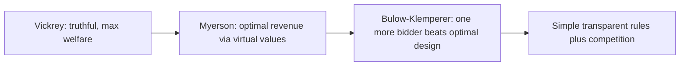
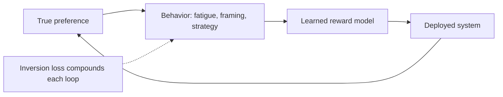

> [!KEY] Social choice aggregates votes. Mechanism design goes further: it designs the rules of the game so that honest reporting is each player's best strategy.

## From voting to mechanisms

The mechanism design lecture opens by positioning the topic as a combination of the course's social choice material with game theory. [00:09](ts:9) Voting asks which rule best aggregates fixed ballots. Mechanism design asks which rules make people reveal their true preferences in the first place, when they act strategically. The canonical applications are auctions and pricing. [03:56](ts:236)

## The Vickrey auction

One item, \(n\) bidders, each with private value \(v_i\). Rules: highest bid wins, winner pays the second-highest bid. Truthful bidding (\(b_i = v_i\)) is a **dominant strategy**: optimal no matter what others do.

The intuition: bidding below your value risks losing an item you would have won at a price below your value. Bidding above your value can only change the outcome when you win at a price above your value, which loses money. So the auction is **dominant-strategy incentive compatible** (DSIC).

## Myerson: optimal auctions

Vickrey maximizes welfare, not revenue. Myerson's optimal auction maximizes the seller's expected revenue using **virtual values**. For bidder values drawn i.i.d. from a regular distribution \(F\), the virtual value is \(\varphi(v) = v - \frac{1 - F(v)}{f(v)}\). Allocate to the highest non-negative virtual value; charge the critical bid.

For uniform \([0,1]\) values, \(\varphi(v) = 2v - 1\), so the optimal reserve price is \(0.5\): do not sell below it, otherwise sell to the highest bidder at the max of the second bid and the reserve.

**Bulow-Klemperer:** expected revenue from a plain second-price auction with \(n+1\) bidders exceeds the Myerson-optimal revenue with \(n\) bidders. Competition beats clever design. The policy lesson: attract bidders instead of engineering the mechanism.

## VCG: the general solution

The **Vickrey-Clarke-Groves mechanism** generalizes second-price logic to any outcome space. Each agent reports values over outcomes. The mechanism picks the welfare-maximizing outcome \(\omega^*\). Agent \(i\) pays their externality:

\[ p_i = b_i(\omega^*) - \left[ \sum_j b_j(\omega^*) - \max_{\omega} \sum_{j \neq i} b_j(\omega) \right] \]

Each agent's net payoff reduces to terms that do not depend on their own report except through the chosen outcome, so misreporting cannot help. VCG is DSIC and welfare-maximizing. The catch, seen in real spectrum auctions: the exposure problem (winning part of a complementary bundle), demand reduction, and tacit collusion through signaling bids. Theory gives the ideal. Practice compromises.

## Peer prediction and the Mutual Information Paradigm

How do you elicit truthful labels when there is no ground truth, as in RLHF annotation? **Peer prediction** scores agents against each other. The **Mutual Information Paradigm** (Kong and Schoenebeck, 2019) pays each agent based on the mutual information between their report and a reference agent's report. Truth-telling becomes an equilibrium because informative signals correlate.

Limits, stated honestly in the textbook: the guarantees need many questions to estimate mutual information empirically, agents may not reason about dominant strategies, and complex payment schemes add noise. In practice, inter-annotator agreement and gold-standard questions usually win.

## Incentive-compatible exploration

A planner recommends actions to sequential users (a bandit setting) but users can ignore recommendations. How does the planner get anyone to try the uncertain action? **Hide exploration in exploitation:** deterministically recommend the best-known action, then pick one random "guinea pig" to receive the exploratory recommendation. Users do not know if they are the guinea pig, so following the recommendation stays optimal as long as guinea pigs are rare. Regret stays \(O(\sqrt{T})\).

## The inversion problem

Preference learning inverts behavior into preferences. The inversion is lossy: behavior diverges from true preference for many reasons.

- **Annotator fatigue:** label quality degrades over long sessions. Doctors' prescribing patterns shift through the day as fatigue accumulates. A system treating all decisions equally encodes fatigue as preference.
- **Engagement vs satisfaction:** clicks and watch time are not welfare.
- **Context dependence:** the same annotator answers differently by mood, framing, or example order.
- **Strategic annotation:** annotators who know labels shape the model may label strategically.

Mitigations: weight annotations by estimated consistency, use deliberation, and audit for compounding unfairness across the pipeline (elicitation to learning to aggregation to decision). A 10% initial advantage can become 40% after 15 feedback rounds.

## Privacy

**Contextual integrity:** data use is acceptable when it matches user expectations for the context. A fitness tracker sending heart-rate data to a running coach is fine. Sending it to an ad network violates the transmission principle.

**Differential privacy** has structural limits for preference learning: personalization requires individual data, which DP by definition suppresses. Stronger guarantees mean worse preference models, and weak DP parameters can be persuasive theater. Contextual integrity is the middle ground: allow expected uses, block surprising ones.

## Paternalism

When is it legitimate for an AI to override a user's stated preference? The textbook's design principles: be transparent about overrides, allow the user to insist, use the lightest intervention that works, justify each one, and learn from whether interventions are welcomed or resented.

AI refusals sit on the boundary: refusing to synthesize drugs is paternalistic if it protects the user, nosy (in Sen's sense from Lesson 9) if it protects others. Most refusals do both. Dan Weber's guest lecture frames the deeper point: the interesting value-alignment questions are not just technical but philosophical. [02:22](ts:142) His lecture also introduces the **ESR (Ethics and Society Review)** statements students write for their final projects: a structured forcing function to articulate who could be harmed and how. [00:20](ts:20)

## Human-centered design

The design lecture's core message: build the process around stakeholders' actual problems, not the technology. [25:28](ts:1528) Market research, stakeholder mapping, and iterative prototyping come before model choice. For preference-learning systems this is not soft advice: mis-specified elicitation (asking the wrong question, to the wrong people, in the wrong context) corrupts everything downstream, and no aggregation rule or mechanism can recover what bad elicitation destroyed.

> **Interview line:** When asked about RLHF failure modes beyond reward hacking, reach for this lesson: the inversion problem (fatigue, strategic annotation, engagement vs welfare), aggregation impossibility (Lesson 9), and privacy/paternalism trade-offs. Then name the mitigations: consistency weighting, bridging-style aggregation, contextual integrity, and transparent override policies. This is the vocabulary frontier labs use when they talk about "alignment" as an engineering discipline rather than a loss function.

## Sources

- Video: [Mechanism Design](https://www.youtube.com/watch?v=zkHTbb-0Gns) (1:21:49)
- Notes: CS329H Autumn 2024 lecture subtitles
- Textbook: [Machine Learning from Human Preferences, Chapters 4-5](https://mlhp.stanford.edu/Machine-Learning-from-Human-Preferences.pdf) (Truong, Haupt, Koyejo, 2025)
