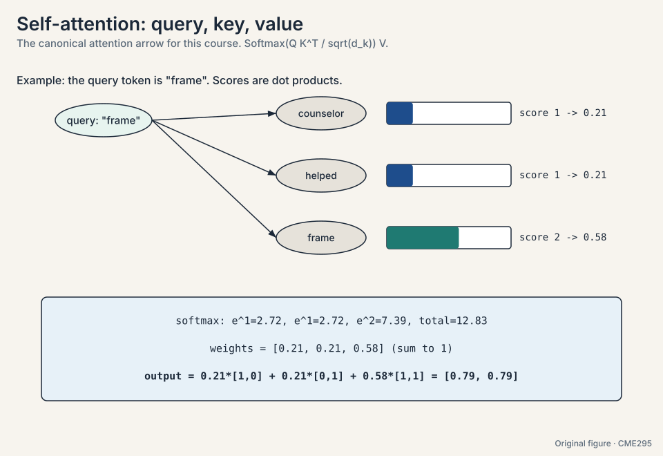
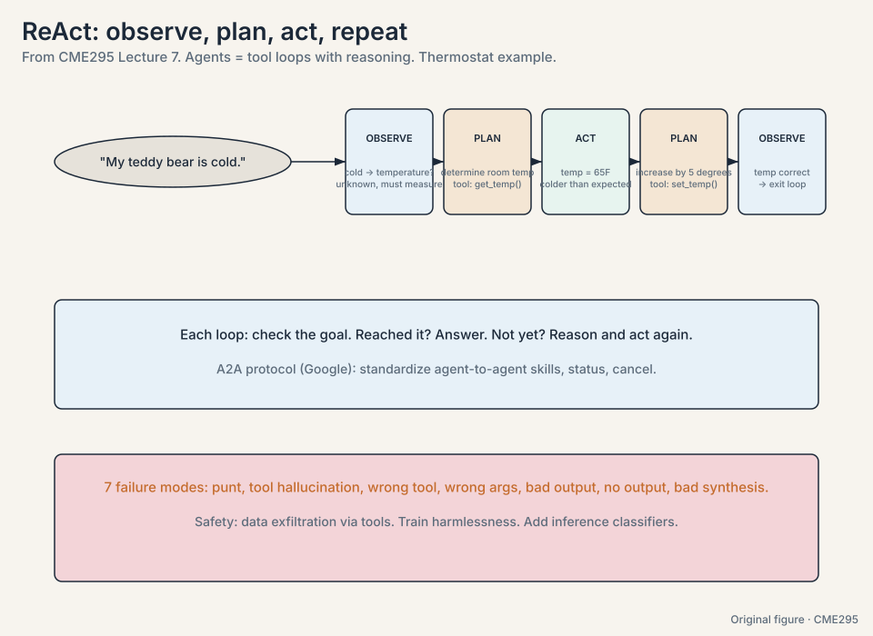

30 minutes · interview speed

This page tells the whole story fast, the way the course tells it:
each idea earns its place by answering a problem. Every section
carries one worked number. Links at the end take you into the full
lesson for the derivations, the diagrams, and the follow-ups.

### 1. Attention deletes the chain

The problem was distance. An RNN fades the first token of a long
sentence to (0.5)^6, under 2%, by the time the model needs it. The
fix: let every token talk to every other token directly. Query
against keys, softmax into weights, mix the values. One line:
Attention = softmax(QK^T / sqrt(d_k)) V.

Watch it on the course's toy. Tokens counselor [1,0], helped [0,1],
frame [1,1]. Query for "frame": scores [1,1,2], weights
[0.21,0.21,0.58], new "frame" = [0.79,0.79]. The match decided the
mix. Every pair meets in one step. All pairs compute in parallel.
gradient paths stay short. The price is quadratic: 16.7M scores at
N = 4,096.

<figure class="crash-fig"><figcaption>The canonical attention arrow of CME295. Query against keys, weight, then sum values.</figcaption></figure>

<ul class="crash-links">
<li><a href="l01-transformers-overview.html">Lecture 1: attention, the block, 2017</a></li>
<li><a href="l02-attention-position-bert.html">Lecture 2: maps, positions, BERT</a></li>
</ul>

### 2. Order, efficiency, and the BERT family

Attention sees a set, not a sequence, so order gets added back.
Positions went relative: RoPE rotates queries and keys by angle, so
the dot product keeps only distance, with no extra parameters. The
stack went pre-norm with RMSNorm for deep stability. Full attention
costs O(n^2), so sliding windows cut it to n*w (8x fewer scores at
n = 4,096, w = 512). The KV cache dominates inference memory, so
GQA shares 32 query heads over 8 KV heads: 4x smaller.

BERT is the encoder-only sibling: read both directions, mask 15% of
tokens with the 80/10/10 split, add next-sentence prediction at
50/50, then fine-tune a small head. Great for understanding. It
cannot generate. T5 frames everything as text-to-text with span
corruption: mask spans, insert sentinels, decode the fills.

<ul class="crash-links">
<li><a href="l02-attention-position-bert.html">Lecture 2: positions to BERT</a></li>
</ul>

### 3. Scale next-token prediction and you get an LLM

Take the decoder-only transformer and predict the next token on
trillions of tokens. The model outputs a distribution. Decoding
turns it into a token. On the toy distribution (lit 0.50, read
0.30, slept 0.12, ate 0.08): greedy takes the argmax, beam keeps B
hypotheses with length normalization, sampling draws from it,
top-K cuts the tail, top-P adapts the set. Temperature reshapes:
exp(z_i/T) turns logits [3,2,1] spiky at T = 0.5 and flat at T = 2.
Sampling is the only randomness in the machine.

Sparse MoE routes each token to its top-1 or top-2 experts: capacity
without proportional compute, and routing collapse is the failure
mode to name. Inference is memory-bound, not compute-bound: a 70B
model moves 140 GB per token. The KV cache stores past keys and
values. Paging kills fragmentation. MLA compresses. Speculative
decoding drafts k and verifies in one pass.

<figure class="crash-fig"><figcaption>Decode one token per step. Cache keys and values. Everything else is speed.</figcaption></figure>

<ul class="crash-links">
<li><a href="l03-llms-decoding-inference.html">Lecture 3: decoding and inference</a></li>
</ul>

### 4. Training: count the work, split the budget

Transfer learning: pre-train once on trillions of tokens, SFT
cheaply per task, preference-tune for taste. Price the run: GPT-3
cost 6 * 175B * 300B = 3.15e23 FLOPs, which is 294 GPU-years at 34
TFLOPS, or 10.7 days on 10,000 GPUs at fantasy efficiency. Chinchilla
corrected the budget: 20 tokens per parameter, so GPT-3 was 11.7x
undertrained at 300B tokens for 175B params.

No single GPU holds 2.1 TB (Adam states alone are 1.4 TB), so ZeRO
shards optimizer, gradients, and params across workers. FlashAttention
respects the memory hierarchy: tile to SRAM, running softmax,
recompute instead of re-reading HBM. Exact, ~10x fewer HBM accesses.
SFT teaches format with loss on output tokens only. LoRA freezes W0
and trains BA at rank 4: 512x fewer params on a 4096 block. QLoRA
adds NF4 and double quantization for ~16x less VRAM.

<figure class="crash-fig"><figcaption>Equal budget, balanced size and data. The vertical line marks Chinchilla.</figcaption></figure>

<ul class="crash-links">
<li><a href="l04-pretraining-scaling-finetuning.html">Lecture 4: scaling and systems</a></li>
</ul>

### 5. Preference tuning teaches "not this"

SFT shows good answers but never shows bad ones. Pairwise data
(prompt, chosen, rejected) supplies the negative signal. Bradley-Terry
turns pairs into scores: P(i beats j) = sigma(r_i - r_j). On the toy,
r = 2 vs 1 gives P = 0.731 and loss 0.313, while the reversed
ordering pays 1.313. Train pairwise, score pointwise.

Then RL: the LLM is the agent, each token an action, reward one
sparse number at the end. PPO clips the policy step (the toy: r =
1.5 clipped to 1.2 with eps = 0.2) and keeps a KL leash to the SFT
model so the policy cannot game the proxy. The advantage centers
the signal: reward minus baseline. Reward hacking is the failure
mode: reward climbs while human judgment falls. DPO solves the same
objective in closed form and trains supervised, with beta ~ 0.1.
Best-of-N (sample 4, keep the best) is the free baseline every
method must beat. Interview one-liner: "Bradley-Terry makes rewards,
PPO optimizes them, DPO skips the RL."

<ul class="crash-links">
<li><a href="l05-preference-tuning.html">Lecture 5: RLHF and DPO</a></li>
</ul>

### 6. Reasoning: verify, then let RL explore

One-shot answers fail on multi-step problems. Think-then-answer
splits generation into a hidden chain and a final answer, billed as
output tokens. Measure with pass@k = 1 - C(n-c,k)/C(n,k): on the
toy (n=10, c=3, k=2), 0.3 lifts to 0.533. Sample warm (0.2-0.8) for
diversity.

Code and math have verifiable answers, so the checker is free and RL
runs without humans. GRPO samples a group per prompt and z-scores
advantages inside it: rewards [0,0,1,0] give +1.73 to the winner and
-0.58 to each loser, with no value function. The 1/|o_i| term
over-rewards long failures (a 50-token failure is downweighted 10x
harder than a 500-token one). DAPO and Dr. GRPO fix the length bias.
DeepSeek's R1-Zero proved RL on the base model creates reasoning.
the full R1 pipeline adds cold-start SFT, rejection sampling, and
distillation to small models.

<figure class="crash-fig"><figcaption>Group, z-score, no value function. Reasoning from verifiable rewards.</figcaption></figure>

<ul class="crash-links">
<li><a href="l06-reasoning-models-grpo.html">Lecture 6: reasoning and GRPO</a></li>
</ul>

### 7. RAG grounds. Agents act

The model's knowledge is frozen at its cutoff. RAG retrieves fresh
text and pastes it into the prompt: retrieve, augment, generate.
Chunk around 500 tokens with overlap. Recall with bi-encoder
embeddings (cosine 0.99 picks the results article over 0.29 sports
news), precision with a cross-encoder re-ranker. BM25 for exact
names ("Cuddly" must match "Cuddly"). Hybrid in practice. Judge it
with NDCG on MTEB: the toy ranking scores 0.852 against the ideal.

Tools turn the model into an agent: docs become a JSON schema, the
model picks a tool and fills its arguments, code executes, the result
feeds back. ReAct loops observe, plan, act until the goal is met. MCP
standardizes the plumbing. Agents fail seven ways: the punt,
hallucinated tools, wrong tool or args, bad or missing output, bad
synthesis. Categorize failures in groups and fix the groups. Prompt
injection is a control-flow attack on the loop: treat tool output as
data, never as instructions.

<figure class="crash-fig"><figcaption>Observe, plan, act. The loop that makes agents.</figcaption></figure>

<ul class="crash-links">
<li><a href="l07-rag-tool-calling-agents.html">Lecture 7: RAG, tools, agents</a></li>
</ul>

### 8. Evaluation is a ladder of proxies

Free-form output resists measurement, so we climb a ladder. Humans
are ideal but slow and subjective. Correct their agreement for
chance with kappa, because observed 0.85 agreement is kappa 0.70 at
balanced base rates and 0.17 at 90/10. Rule metrics (BLEU, ROUGE,
METEOR) compare against references but punish paraphrase: the toy
scores 0.39 on a good answer and near zero on a perfect paraphrase.
LLM-as-a-judge scales: prompt plus response plus criteria in,
rationale then score out, binary scale, structured output. Correct
three biases: position (ask both orders), verbosity (say so, show
examples), self-enhancement (use a different, bigger judge). Keep
temperature 0.1-0.2 and calibrate against humans. Never overoptimize
the proxy.

Benchmarks profile, they do not crown: MMLU (knowledge), AIME/PIQA
(reasoning), SWE-bench (coding), HarmBench (safety), tau-bench
(agents, pass-hat@k). Read them with Pareto, contamination, and
Goodhart in mind. Then try the models yourself.

<ul class="crash-links">
<li><a href="l08-evaluation.html">Lecture 8: evaluation</a></li>
</ul>

### 9. Frontiers: patches, masks, and the open design space

The transformer is a substrate. ViT treats a 224x224 image as 196
patches plus [CLS] and beats CNNs: weak inductive bias plus big data
wins when data is abundant. Vision-language models concatenate image
and text tokens or inject images at cross-attention. Diffusion
language models translate noise to masking: mask is noise, unmask in
N fixed steps instead of one token at a time, ~10x faster on long
outputs, natural for fill-in-the-middle. LLaDA works the math.

Data is the new bottleneck: ~80% of search results LLM-generated is
the speaker's estimate, and training on synthetic text causes model
collapse, each generation training on a narrower shadow. The knobs
are all still live: optimizers (Muon), norms (RMSNorm), attention
variants, activations, MoE vs dense. The hard problems: continuous
learning, hallucination by design, personalization, safety.

<ul class="crash-links">
<li><a href="l09-course-recap-frontiers.html">Lecture 9: recap and frontiers</a></li>
</ul>

## Memory aids

**Never-confuse pairs.** FLOPs (work) vs FLOPS (rate). Top-K (fixed
count) vs top-P (fixed mass). pass@k (any succeeds) vs pass-hat@k
(all succeed). SFT (imitate good) vs preference tuning (punish
bad). DPO (closed form, two models) vs PPO (online, four models).
GRPO (group baseline) vs PPO (value baseline). RAG (retrieve)
vs long context (dump). Kappa (chance-corrected) vs agreement rate
(raw). BLEU (precision) vs ROUGE (recall). Pre-norm (deep) vs
post-norm (2017). MQA (1 KV head) vs GQA (8) vs MHA (32).

**Mnemonics.** RAG: "retrieve, augment, generate", three verbs in
order. ReAct: "observe, plan, act", the loop. Factuality:
"extract, check, aggregate". R1: "cold-start, RL, big SFT, final
RL", four stages. Agent failures in pipeline order: "punt,
hallucinate, wrong tool, wrong args, bad output, no output, bad
synthesis".

**If this, then that.** If the distribution is sharp, top-P
shrinks the set: use top-P with a top-K cap. If reward climbs but
humans disagree, it is hacking: tighten beta. If all GRPO rewards
tie, filter the group. If kappa is below 0.6, fix the rubric. If
the answer is verifiable, use RLVR. If not, preference tuning. If
the tool is silent, the agent hallucinates: always return
something. If the benchmark predates the cutoff, assume
contamination.

## Rapid fire

**What are Q, K, V?** Query seeks, key advertises, value is the
payload. Projections of each token, re-learned per layer.

**The attention toy?** Scores [1,1,2] -> weights [0.21,0.21,0.58] ->
new "frame" = [0.79,0.79].

**Why sqrt(d_k)?** Without it, dot products grow with dimension,
softmax saturates, gradients die.

**What does causal masking do?** Sets future scores to negative
infinity before softmax, so decoders cannot see ahead.

**RoPE in one sentence?** Rotates queries and keys by position, so
attention scores depend on relative distance.

**Greedy vs beam vs sampling?** Greedy: argmax, safe. Beam: k paths,
stable. Sampling: random from the distribution, human.

**What is the KV cache?** Stored past keys and values, making each
decode step linear instead of quadratic.

**Chinchilla's rule?** 20 tokens per parameter. Balance size and data
at fixed compute. GPT-3 was 11.7x undertrained.

**LoRA?** W = W0 + BA, rank ~4. Train A,B, freeze W0. 512x fewer
params on a 4096 block.

**Bradley-Terry?** P(i beats j) = sigma(r_i - r_j). Pairwise labels
to pointwise reward. The toy: 2 vs 1 pays 0.313 vs 1.313.

**Why does PPO need KL to the SFT model?** To stop the policy
drifting into reward-hacking territory.

**DPO vs PPO?** DPO solves the RLHF objective in closed form,
supervised. No value head, no rollouts. Beta ~ 0.1.

**GRPO's advantage?** Z-scored within the sampled group. No value
function needed. [0,0,1,0] -> +1.73 / -0.58.

**pass@k?** 1 - C(n-c,k)/C(n,k). Chance at least one of k samples is
right. The toy: 0.3 to 0.533.

**RAG's three steps?** Retrieve, augment, generate.

**Bi-encoder vs cross-encoder?** Bi-encoder: fast recall with
embeddings. Cross-encoder: joint scoring, precise re-rank.

**ReAct loop?** Observe, plan, act, repeat until the goal.

**Seven agent failure modes?** Punt, hallucinated tool, wrong tool,
wrong args, bad output, no output, bad synthesis.

**Why rationale before score in judging?** Externalizing reasoning
first empirically improves the judgment, like chain-of-thought.

**Three judge biases and fixes?** Position (both orders, vote),
verbosity (guidelines, examples), self-enhancement (different judge).

**pass-hat@k?** Probability all k attempts succeed. Agents need
reliability, not luck.

**Goodhart's law?** When a measure becomes a target, it ceases to be
a good measure.

**ViT's lesson?** Patches as tokens. Weak inductive bias plus big data
beats strong bias.

**Masked diffusion in one line?** Mask is noise. Unmask in N fixed
steps instead of one token at a time.

**Model collapse in one line?** Each generation trains on a narrower
shadow of the last.
