> [!QA]
> Q: Why does this lesson carry a source warning?
> A: No transcript or recording reference survives for Lecture 1. Everything
> below is rebuilt from the Lecture 1 slide deck alone. Slide decks show
> conclusions, not the spoken reasoning. Treat explanations here as faithful
> to the slides, and treat anything beyond the slides as absent, not as
> implied. Later lectures in this course have full transcripts and are
> sourced to the spoken word.

## The problem: translate a sentence

Take the sentence "A cute teddy bear is reading." and turn it into
French: "Un ours en peluche mignon lit." A human does this easily. A
computer sees neither letters nor meaning. It sees whatever numbers we
give it. The entire history of this course is the search for the right
numbers.

Before any machinery, name the job. Language tasks come in three
families, and the family decides what the machine outputs:

- **Classification.** Text in, one label out. "This teddy bear is SO
  CUTE!" becomes *positive*. Intent detection, language detection, and
  topic modeling live here.
- **Multi-classification.** Text in, one label per token out.
  Part-of-speech tagging and named entity recognition live here: in "A
  cute teddy bear is reading", the model tags "teddy bear" as an entity.
- **Generation.** Text in, text out. Translation, question answering,
  and summarization live here. The output is open-ended, not a fixed
  label.

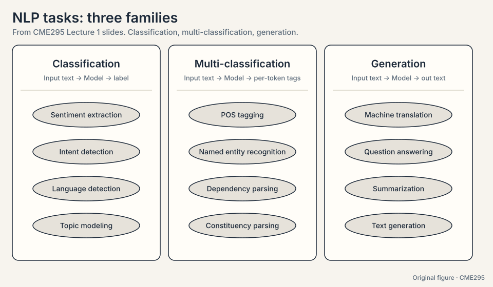

Machine translation is generation: at each step the model picks one
word from the vocabulary, so generation is repeated classification over
the vocabulary, one token at a time. Everything in this chapter is the
machinery that makes that picking work.

## First attempt: one-hot vectors

The computer needs numbers for words. The simplest scheme is the
**one-hot vector**: a vector with a 1 in the position of the word and
0 everywhere else. With a toy vocabulary of five words:

```ascii
"bear"   = [1, 0, 0, 0, 0]
"teddy"  = [0, 1, 0, 0, 0]
"quantum"= [0, 0, 0, 0, 1]
```

One-hot works as an encoding. Nothing is ambiguous. But it says
nothing about meaning. Compute the dot product, the simplest measure
of similarity: "bear" dot "teddy" = 0. "bear" dot "quantum" = 0.
"Bear" and "teddy" are as far apart as "bear" and "quantum". Every
word is equally distant from every other word. A model fed one-hot
vectors has no reason to think "teddy bear" behaves differently from
"quantum bear".

Worse, the vectors grow with the vocabulary. A 50,000-word vocabulary
gives 50,000-dimensional vectors, mostly zeros. Storing them is
wasteful. Computing with them is slow.

### Subchapter: one-hot as a lookup table

A one-hot vector is an index wearing a costume. Multiply it by an
embedding matrix E (vocabulary x d) and you select one row: E^T times
the one-hot for "bear" returns row 1. The operation is a table
lookup. The lookup has one virtue: it is exact. It has one fatal
flaw: no two rows share anything. Learning that "teddy" behaves like
"bear" teaches nothing about any other word.

### Subchapter: why one-hot cannot generalize

Generalization needs shared structure: changing one word's
representation must change similar words' representations. One-hot
has none. Every dot product between distinct words is 0. The model
must see "teddy bear" in training to know anything about "teddy
bear". A vocabulary of 50,000 gives 2.5 billion pairs, most never
observed. Unseen pairs stay at distance 0 forever. This is the
sparsity problem, and it forces every later section.

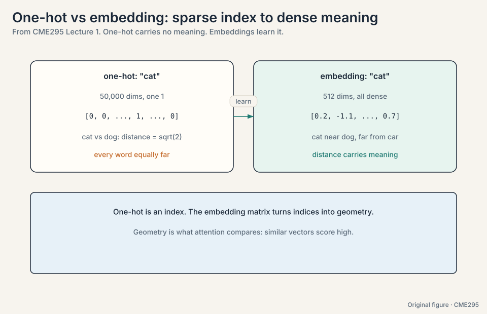

## The key question

What if a word's vector encoded the company it keeps? "Teddy" appears
near "bear", "soft", "cute". "Quantum" appears near "physics",
"particle". If two words share neighbors, their vectors should sit
close together. Then the model would *see* that "teddy" relates to
"bear" before it ever answers a question.

## Word2vec: learning vectors from a proxy task

**Word2vec** (Mikolov et al., 2013) turns that idea into training. The
trick is a **proxy task**: train a network to do something easy, then
steal its hidden layer. The proxy task is prediction of neighbors.

Two versions exist:

- **CBOW** (continuous bag of words): given the surrounding words,
  predict the center word. Given "a cute ___ bear is reading", predict
  "teddy".
- **Skip-gram**: given the center word, predict the surrounding
  words. Given "teddy", predict "cute", "bear".

Watch a CBOW training step on the toy sentence "the teddy bear is
cute", vocabulary of 5, embedding dimension d = 2:

```ascii
input:  context words "teddy" and "is"  (average their one-hots)
hidden: 2 numbers, e.g. [0.3, -0.5]     (this is the embedding!)
output: 5 scores, softmax -> probabilities over the vocabulary
target: "bear" gets 1.0
```

The network adjusts its weights so "bear" gets high probability when
surrounded by "teddy" and "is". After training on billions of words,
words with similar neighbors have been pushed through similar weight
updates, and their hidden-layer rows land near each other. "teddy"
dot "bear" is now large. "teddy" dot "quantum" is small. The vector
space encodes meaning as geometry.

The network itself is disposable. The prize is the hidden layer: each
row is a **word embedding**, a dense vector that captures
distributional meaning. The original setup: input size V (the
vocabulary), hidden size d (a few hundred), output size V.

### Subchapter: the CBOW loss, written out

Write the training objective for one CBOW step. The network outputs
logits z over V words. Softmax gives probabilities p_i = exp(z_i) /
sum(exp(z_j)). The loss is cross-entropy against the target word, with the natural
log: L = -log(p_target). On the toy (V = 5, target "bear"): if the model
assigns p_bear = 0.4, the loss is -log(0.4) = 0.92. If it assigns
0.02, the loss is 3.91. The gradient pushes the hidden-layer row for
"bear" toward the context average and pushes the other four rows
away. Every training step is one small tug on the geometry.

The cost hides in the denominator: sum over V = 50,000 in real
models, per step, per word. The original word2vec papers shipped
two fixes.

### Subchapter: negative sampling, the binary-choice fix

The CBOW loss breaks on cost: one training step scores all 50,000
vocabulary words. The hinge: what if we never score the whole
vocabulary at all?

**Negative sampling** replaces the V-way softmax with a binary
choice. For the target word "bear" and K = 5 random "negative"
words, train K+1 yes/no classifiers: "bear" should score high with
this context, the 5 negatives should score low. The toy: one step
needs 6 sigmoid dot products instead of 50,000 exponentials, a cost
cut of roughly 50,000 / 6, about 8,300x. Cost per step drops from
O(V) to O(K). K between 5 and 20 works. The learned rows are still
good embeddings. The price: the 5 negatives are noise, not the true
distribution, so each gradient step is a noisier tug on the
geometry.

### Subchapter: GloVe, counting instead of predicting

Negative sampling fixes the cost of prediction. The hinge: can we
learn the same geometry without predicting at all?

**GloVe** (Global Vectors, 2014) attacks from the other side.
Instead of predicting, count: build the co-occurrence matrix X (how
often word i appears near word j across the corpus) and fit
embeddings so their dot product approximates log(X_ij), the natural
log. The toy: if "bear" appears near "cute" 12 times in the corpus,
log(12) = 2.48, so training pushes w_bear dot w_cute toward 2.48.
If "bear" appears near "the" 340 times, log(340) = 5.83, and the dot
product lands near 5.83. Frequent pairs pull their vectors together.
Rare pairs do not. Prediction and counting arrive at the same
geometry. The field remembers both, uses neither in modern
pipelines: static vectors gave way to models whose vectors change with
the sentence around each word. But the proxy-task idea (train on something easy, steal the
representation) became the template for all of pre-training.

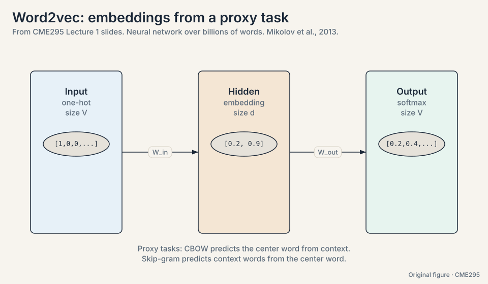

## Where word2vec breaks

Two cracks, each easy to demonstrate.

**No context.** Every word gets exactly one vector. "Bear" in "a
teddy bear" and "bear" in "the bear market crashed" get the same
embedding, the average of both worlds. The representation cannot tell
which sentence it sits in.

**No order.** CBOW averages the context, so "dog bites man" and "man
bites dog" produce the same context vector. Word order carries the
meaning of the sentence and the embedding throws it away.

So the job is now sharper. Build a representation that knows the
surrounding words *and* their order. The representation of "bear" must
change with the sentence around it. Call this a **contextual
representation**. Everything from here serves it.

## Tokenization: cutting text into units

Before any vector exists, the text must be cut into units. That cut is
called **tokenization**, and the choice matters. Take "reading":

```ascii
word-level:      "reading"
subword-level:   "read" + "##ing"
character-level: "r" "e" "a" "d" "i" "n" "g"
```

Three levels, each with a price:

- **Word-level** is simple and readable, but any unseen word breaks it
  (out-of-vocabulary), and it cannot reuse knowledge of roots.
- **Subword-level** (WordPiece, BPE) reuses common prefixes and
  suffixes. New words decompose into known parts. Small vocabulary,
  small out-of-vocabulary risk, learned from the data.
- **Character-level** survives misspellings and casing, but a sentence
  becomes many times longer, so computation slows.

Modern models use subword tokenizers with vocabularies around 30,000
to 50,000 tokens.

### Subchapter: BPE, worked by hand

**Byte-pair encoding (BPE)** learns the vocabulary from data. Start
with characters. Repeatedly merge the most frequent adjacent pair.
Watch three merges on a toy corpus ("reading", "reads", "read"):

```ascii
start:    r e a d i n g | r e a d s | r e a d
merge 1:  "r"+"e" -> "re"   (most frequent pair, 3x)
merge 2:  "re"+"a" -> "rea" (3x)
merge 3:  "rea"+"d" -> "read" (3x)
result:   "reading" = read + ing,  "reads" = read + s
```

Three merges discovered the root "read" with zero linguistic
knowledge. Frequent words collapse into single tokens. Rare words
decompose into known parts. No word is ever truly unknown: the
worst case is a character split.

### Subchapter: how modern tokenizers differ

Three subword schemes, one idea, different merge rules:

- **BPE** (GPT family): merge the most frequent pair. Greedy,
  data-driven, simple.
- **WordPiece** (BERT): merge the pair that most improves the
  language-model likelihood, not raw frequency. Likelihood over
  counts.
- **Unigram** (T5, SentencePiece): start from a large vocabulary
  and delete the least useful tokens until the target size. Top-down
  instead of bottom-up.

Practical consequences. Vocabulary sizes: ~30k (BERT), ~50k (GPT-2),
~100k+ (newer multilingual models). Larger vocabularies mean fewer
tokens per sentence but a bigger embedding matrix. Tokenizer choice
changes token counts by 10-30% on the same text, which changes
context-window usage and cost directly. The exact tokenizers of
GPT-6, Gemini 3, and DeepSeek V4.1 are not public [unknown].

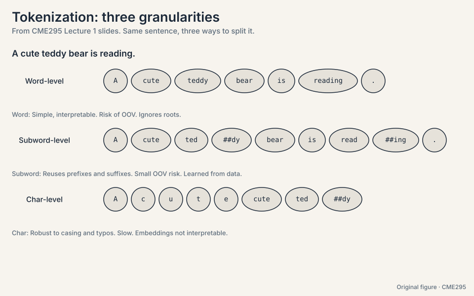
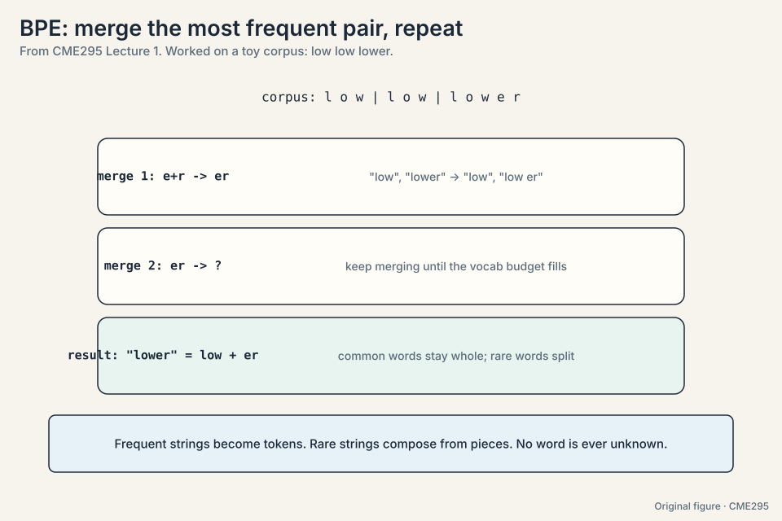

## First attempt at context: the RNN

The **recurrent neural network** (RNN) reads a sentence one token at
a time and keeps notes in a **hidden state**, a vector updated at
every step. The update rule:

```ascii
h_t = tanh(W_h * h_{t-1}  +  W_x * x_t)
       ^^^^^^^^^^^^^^^^^^^    ^^^^^^^^^
       faded old notes        new token
```

W_h and W_x are learned matrices. tanh squashes the result into a calm
range. The formula says: fade the old notes, add the new token, squash.
The hidden state is the model's memory of everything read so far.

Watch it on a toy. Two-dimensional vectors. W_h halves the old notes.
W_x passes the token through.

```ascii
tokens:   x1 = "the" = [1, 0]      x2 = "cat" = [0, 1]
start:    h_0 = [0, 0]

step 1:   h_1 = tanh(0.5 * [0,0] + [1,0]) = tanh([1, 0]) = [0.76, 0]
step 2:   h_2 = tanh(0.5 * [0.76,0] + [0,1]) = tanh([0.38, 1]) = [0.36, 0.76]
```

Read h_2. The second number (0.76) is "cat", fresh and strong. The
first number (0.36) is "the", faded but present. Recent tokens are
louder than old ones. The same body serves all three task families
with different heads: a sentiment head for classification, per-token
tags for multi-classification, and step-by-step prediction for
translation. **LSTMs** (1997) keep the same idea with a more
structured hidden state, so memory survives longer.

### Subchapter: LSTM and GRU, the gated fix

The vanilla RNN overwrites its notes every step. **LSTM** adds a
second track, the **cell state**, guarded by three learned gates
(numbers between 0 and 1 from a sigmoid):

- **Forget gate** f_t: how much of the old cell survives.
- **Input gate** i_t: how much of the new candidate gets written.
- **Output gate** o_t: how much of the cell becomes visible.

The update is c_t = f_t * c_{t-1} + i_t * candidate_t. The key is
the **addition**: old memory scales by the forget gate instead of
squashing through a matrix. With f = 0.9 for the slot holding
"The", six steps keep 0.9^6 = 0.53, not 0.016. The gradient rides
the same highway: a chain of additions carries the error back
unmultiplied, so it no longer vanishes. **GRU** merges the idea:
one **update gate** blends old state and new candidate, one
**reset gate** limits what the candidate sees. Fewer parameters,
nearly the same power.

Gates patch the chain. They do not delete it. The serial queue and
the O(N) distance remain. That is why the field moved on.

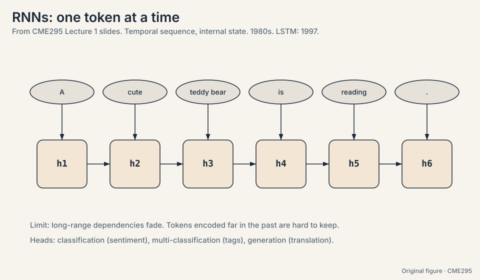

## Where the RNN breaks

Three cracks, each demonstrated with numbers.

**Long distances fade.** In "The counselor helped frame the
situation", the model needs "The" to represent "situation", six steps
later. Each update halves its trace. After six steps, "The" survives
at (0.5)^6 = 0.016 of its original strength. Under 2 percent remains.
The model is trying to remember the start of the sentence through six
rounds of dilution.

**Gradients break too.** Training nudges weights by the **gradient**,
the size of the correction each weight deserves. In an RNN the gradient
for an early token travels backward through every timestep, multiplying
by roughly the same number at each step:

```ascii
fading multiplier 0.9, 10 steps:  0.9^10  = 0.35  (vanishes)
growing multiplier 1.1, 10 steps: 1.1^10  = 2.59  (explodes)
```

Below 1, the learning signal decays to zero: early tokens stop
learning. Above 1, it grows exponentially and training destabilizes.
Long sequences are exactly the ones that break.

**The chain is serial.** Step t waits for step t-1. A 1,000-token
sequence means 1,000 sequential steps. A GPU with thousands of cores
gets one step at a time and watches the rest idle. Training on
billions of words becomes an exercise in patience. This bottleneck is
the crack that mattered most in practice.

## The key question

What if tokens could talk to each other *directly*, skipping the chain
entirely? What if "situation" could look straight back at "The"
without passing through six rounds of dilution? That question is the
transformer.

## Attention: a lookup, not a chain

The idea: every token puts two things on the table, a **key** (a
label saying what it contains) and a **value** (the content it
offers). Every token also forms a **query** (a description of what it
needs). To build the new representation of "frame", compare its query
against every key, and mix the values in proportion to the match.

Now watch it by hand. Three tokens, two-dimensional vectors. The
projections are identity here, so the vectors are their own queries,
keys, and values. (The real model learns the projections. The
mechanism is the same.)

```ascii
tokens:   counselor = [1, 0]    helped = [0, 1]    frame = [1, 1]
query for "frame": q = [1, 1]

step 1, scores (dot products of q with each key):
  q . k_counselor = [1,1] . [1,0] = 1
  q . k_helped    = [1,1] . [0,1] = 1
  q . k_frame     = [1,1] . [1,1] = 2

step 2, softmax (turn scores into weights that sum to 1):
  e^1 = 2.72,  e^1 = 2.72,  e^2 = 7.39,  total = 12.83
  weights = [0.21, 0.21, 0.58]

step 3, mix the values:
  new "frame" = 0.21 * [1,0] + 0.21 * [0,1] + 0.58 * [1,1]
              = [0.79, 0.79]
```

Read the result. "frame" pulled 21% from "counselor", 21% from
"helped", and 58% from itself. The query-key match decided the mix.
That is **attention**, and because it compares tokens inside one
sequence, this is **self-attention**.

In matrix form, with N tokens of dimension d stacked into X:

**Attention(Q, K, V) = softmax(QK^T / sqrt(d_k)) V**

QK^T scores every query against every key. The division by sqrt(d_k)
keeps dot products in the range where softmax stays sensitive. As
dimensions grow, raw dot products spread wider, the softmax saturates
(one weight goes to 1, the rest to 0), and gradients die. One line of
numerical hygiene. Softmax turns scores into weights. Multiplying by V
mixes the values. Every token does this against every other token,
simultaneously.

) V. The canonical symbol for Stanford Frontier AI: query at left, keys with score bars, weights, then the weighted value mix.")

This figure defines the attention arrow for the whole learning system.
CME295 is its first home. Later courses reuse it instead of redrawing
it.

### Subchapter: the attention arrow as the system symbol

Every later lesson draws this arrow, so fix its parts. **Query**
(one per token, at left) seeks. **Keys** (a column of pills) advertise.
**Score bars** show the dot products before softmax. **Weight bars**
show them after. **Values** (a matching column) mix by the weights.
One claim per plate: this plate shows the lookup. Lecture 2's plate
shows the causal mask. The model-map plate shows who uses which
mask. Same chips, same colors, every time.

### Subchapter: the N^2 cost table

The score matrix O = QK^T is N x N. Count it in bytes (fp16, per
head, per layer):

```ascii
N = 512:    512^2 = 262K scores   = 0.5 MB
N = 4,096:  16.7M scores          = 33 MB
N = 32,768: 1.07B scores          = 2.1 GB
N = 1M:     1T scores             = 2 TB (impossible)
```

Every 2x in length costs 4x in scores. The N = 1M row is why this
course exists: no machine stores it, so every later lecture is a
way to avoid storing it. Read any efficiency claim as "which row of
this table does it make affordable".

> [!QA]
> Q: Walk me through self-attention on the course's toy, start to finish.
> A: Three tokens: counselor [1,0], helped [0,1], frame [1,1].
> Projections are identity, so each vector is its own Q, K, V. Take
> the query for "frame": [1,1]. Score it against each key by dot
> product: 1, 1, 2. Softmax: exp gives [2.72, 2.72, 7.39], total
> 12.83, weights [0.21, 0.21, 0.58]. Mix the values:
> 0.21*[1,0] + 0.21*[0,1] + 0.58*[1,1] = [0.79, 0.79]. New "frame"
> carries 21% of counselor, 21% of helped, 58% of itself. Every
> token does this against every token, in parallel.
> Follow-up: Where do Q, K, V come from in a real model?
> A: From three learned matrices Wq, Wk, Wv multiplying the token
> embeddings. The toy used identity to keep the arithmetic visible.
> Training learns the projections, so the model decides what
> "seeking" and "offering" mean per head per layer.

> [!QA]
> Q: Why does attention divide by sqrt(d_k)?
> A: Dot products grow with dimension: for random vectors of dimension
> d, the variance of the dot product is d, so scores spread wider as
> models get bigger. A wide-spread softmax saturates: one weight nears
> 1, the rest near 0, and the gradients through the tiny weights die.
> Dividing by sqrt(d_k) brings the variance back to 1 and keeps the
> softmax in its responsive range.
> Follow-up: What if you forget it?
> A: In small models, little. In large models (d in the thousands),
> attention collapses onto a single token per query early in training
> and never recovers. A classic "trains but learns nothing" bug.

## Attention lost the order. Put it back

Attention compares every token to every other token. Shuffle the input
and the scores shuffle identically. The operation sees a *set*, not a
sequence. Word order, the thing the RNN had for free, is gone.

The fix adds a **positional encoding** to each input embedding. Two
flavors: learned (one trainable vector per position) or hard-coded
fixed sin/cos waves. The waves have a property the slides highlight:
the dot product of two position embeddings depends only on the
relative distance between positions, not their absolute indices. High
frequency dimensions change fast and track local order. Low frequency
dimensions change slowly and carry long range information.

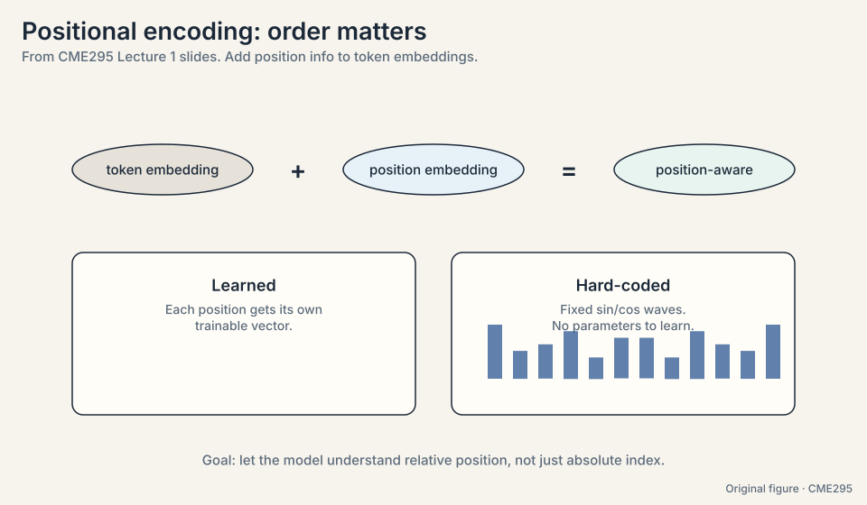

So the input to the machine is: token embedding plus position
embedding, per position. Order restored.

### Subchapter: learned vs sinusoidal, worked

**Learned** position embeddings are a lookup table: position 7 gets
row 7, trained like any parameter. Simple. It breaks past the
longest training position: position 2,049 has no row.

**Sinusoidal** embeddings need no training. Dimension 2i and 2i+1
hold sin(p / 10000^(2i/d)) and cos(p / 10000^(2i/d)). The toy in 2
dimensions, p = 3 and p = 5: the dot product of PE(3) and PE(5)
works out to cos((5-3) * omega) = cos(2*omega). Only the distance 2
survives. The model reads relative distance from the dot product
itself. Fixed waves, no parameters, works at any position. The
field later moved to RoPE (Lecture 2), which keeps this relative
property and lives inside the QK product instead of the input.

> [!QA]
> Q: Why BPE and not whole words?
> A: Whole words break on anything unseen: typos, names, new terms.
> BPE decomposes rare words into known parts, so nothing is ever
> truly unknown. The merge trace showed it: three merges discovered
> the root "read" from raw frequency. The cost is tokens per
> sentence: rare words split into many tokens, which eats context.
> The decision rule: if your text has long tails of rare words
> (code, multilingual), subword wins by a mile.
> Follow-up: BPE or WordPiece?
> A: BPE merges by raw pair frequency. WordPiece merges by which
> pair most improves likelihood. In practice the difference is
> small and both land near 30k-50k tokens. Pick the one your
> framework's pretrained model already used: you cannot swap
> tokenizers without retraining the embeddings.

## The transformer stacks it all

The 2017 paper "Attention Is All You Need" stacks self-attention into
an encoder-decoder machine for translation. Walk it on "A cute teddy
bear is reading."

**Input.** Tokenize and wrap: [BOS] A cute teddy bear is reading .
[EOS]. ([BOS] marks the start, [EOS] the end.) Embed each token, add
the position encoding.

**Encoder.** N stacked layers. Each layer: multi-head self-attention
over the input tokens, then a **feed-forward network** applied to each
position independently, each wrapped with add-and-norm (add the
sublayer's input back to its output, then normalize). Out come
context-aware encoded embeddings. Each token now knows the whole
sentence.

**Decoder input.** The French output, shifted right: training starts
the decoder with [BOS] so it learns to predict the first real token.
The target is the same sequence shifted one step left, ending with
[EOS].

**Decoder.** N stacked layers. Each layer has three sublayers: masked
multi-head self-attention (decoder tokens attend only to earlier
decoder tokens, never the future: scores for future positions are set
to negative infinity before the softmax, the **causal mask**), then
encoder-decoder attention (decoder queries attend to the encoder
outputs), then the feed-forward network. Each with add-and-norm.

**Output.** A linear projection plus softmax over the vocabulary: a
classification problem where each class is a word. A probability per
word, e.g. [0.001, 0.0003, ..., 0.4, ..., 0.002]. The top word is
"Un". Feed "Un" back in and repeat: "ours", "en", "peluche",
"mignon", "lit", then [EOS]. Final output: "Un ours en peluche mignon
lit."

That loop, predict one token, feed it back, repeat until [EOS], is
**autoregressive generation**. It returns in Lecture 3 as the defining
property of large language models.

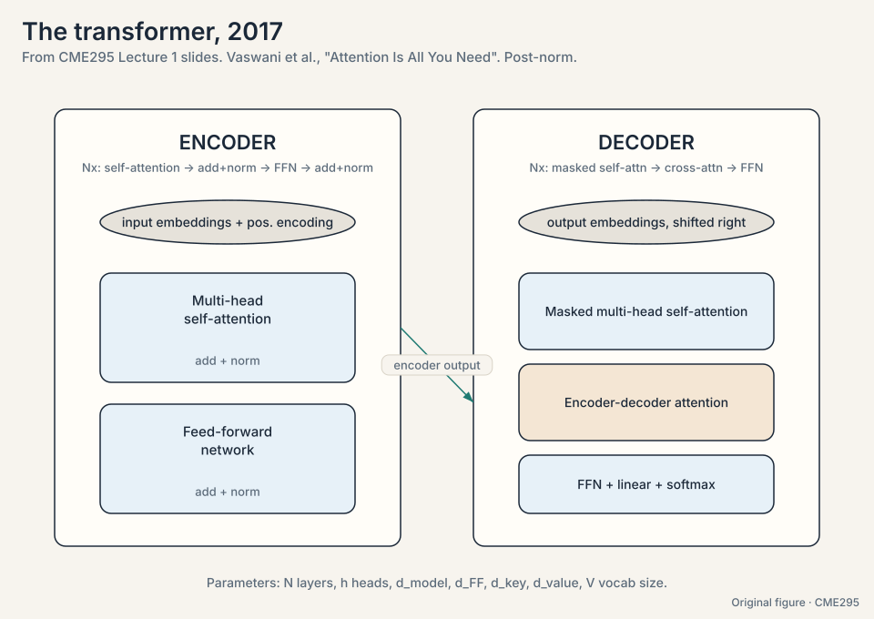
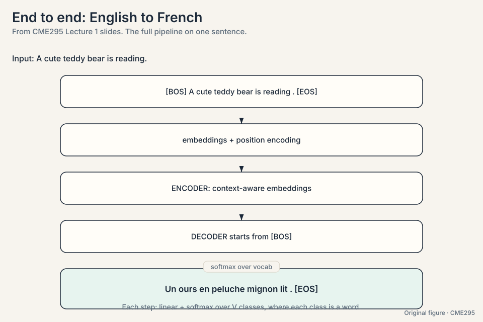

### Subchapter: the add-and-norm contract

Each sublayer output is x + Sublayer(LayerNorm(x)) in the 2017
paper (post-norm: normalize after the sublayer, then the residual
add). The addition is the contract: the layer may refine its input,
but the input always survives to the output. Stack 6 or 12 of these
and the gradient has a clean highway back down: each layer's input
is available directly, never buried under a transformation. Modern
LLMs flip the norm to pre-norm (Lecture 2): x + Sublayer(Norm(x)),
so the highway skips the normalization too. Same contract, cleaner
highway, deeper stacks.

### Subchapter: the causal mask, worked

The decoder's masked self-attention sets future scores to negative
infinity before the softmax. On a 4-token toy, the score matrix
becomes a triangle:

```ascii
row 1 (token 1): sees token 1 only          [x . . .]
row 2 (token 2): sees tokens 1, 2           [x x . .]
row 3 (token 3): sees tokens 1, 2, 3        [x x x .]
row 4 (token 4): sees tokens 1..4           [x x x x]
```

Softmax turns -inf into exactly 0, so future tokens get zero
weight. This is what makes training parallel (all rows compute at
once) and inference sequential (row 5 needs rows 1-4 finished).
Every GPT-style model is this mask plus next-token prediction.

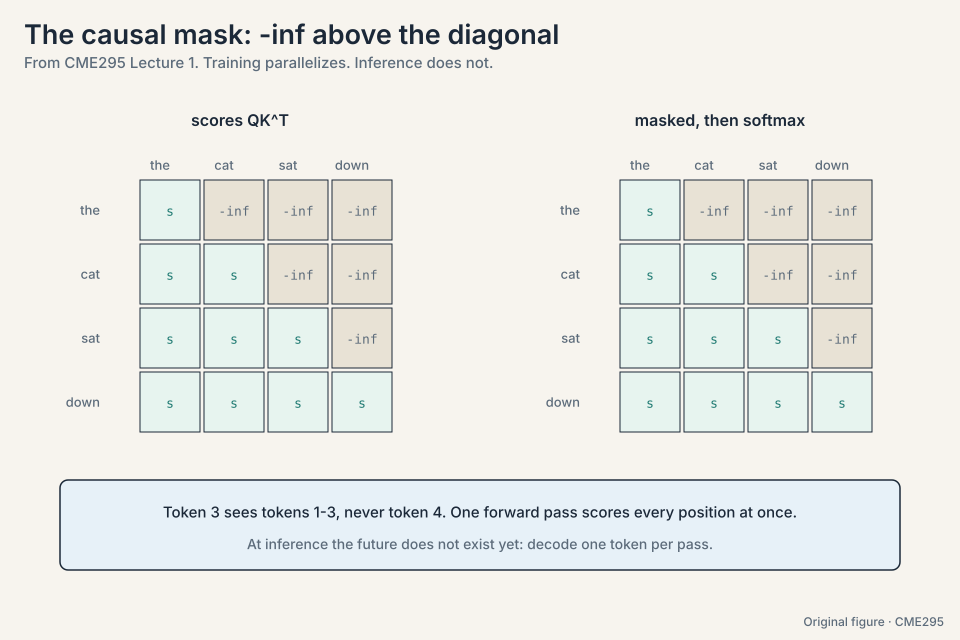

## Two computational tricks

**Multi-head attention.** Run h self-attention operations in parallel,
each with its own QKV projections, then concatenate and project with a
final matrix Wo. Each head can track a different kind of relationship:
one tracks syntax, one tracks coreference, one tracks position. The
slides compare heads to the multiple filters of a convolutional layer
in vision. Same input, several views at once.

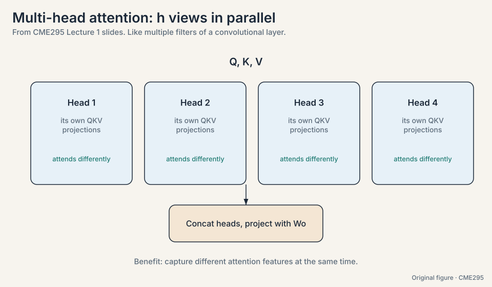

### Subchapter: heads as filters, with numbers

Fix the dimensions. d_model = 512, h = 8 heads, so each head works
in d_k = 512/8 = 64 dimensions. Each head has its own Wq, Wk, Wv
(512 x 64 each) and computes its own attention. Concatenate the 8
outputs: 8 x 64 = 512 again. Project with Wo (512 x 512). Total
parameters match one big head, but the behavior differs: 8
independent votes instead of 1. Trained heads specialize: one tracks
subject-verb, one tracks neighboring position, one tracks rare
words. The interview line: "One softmax is one vote. Eight heads
are eight votes."

## What is used where: the three shapes in production

The encoder/decoder/mask choice is the highest-level architecture
decision. As of October 2026:

| Model | Shape | Why this choice |
|---|---|---|
| GPT-6 Astra (OpenAI) | decoder-only, causal | Generation is the product. Closed weights |
| Gemini 3.8 Flash (Google) | decoder-only, causal | Same reason. Closed weights |
| DeepSeek V4.1 Flash | causal encoder-decoder MoE | Open weights (MIT). 8B/16B active per token |
| Llama 4 Maverick (Meta) | decoder-only MoE, causal | Open weights. 17B active, 128 experts |
| BERT (2018) | encoder-only, bidirectional | Understanding tasks: classification, search embeddings |
| T5 (2019) | encoder-decoder | Input and output differ in kind |

Decoder-only won the LLM era: one stack, one objective, scales.
Encoder-only survives where generation is not needed: search,
classification, embeddings. Encoder-decoder survives where input
and output differ in kind. No universal winner. The task picks the
shape.


> [!QA]
> Q: Your product must handle 200K-token documents. What breaks in this chapter's machine?
> A: The N x N score matrix. At N = 200,000, full attention needs
> 4e10 scores per head per layer: impossible. The fixes this course
> builds: sliding windows (Lecture 2) cut it to N x W, GQA (Lecture
> 2) shrinks the KV cache, FlashAttention (Lecture 4) avoids
> materializing the matrix, paging (Lecture 3) manages the cache.
> The interview signal: name the exact cost (the score matrix, not
> the parameters), then pick the tool that attacks it.
> Follow-up: Which binds first, compute or memory?
> A: Memory. The matrix must be stored to be softmaxed, and the KV
> cache grows per token. Compute is large but parallel. Memory
> capacity and bandwidth are the walls.
> [!QA]
> Q: Encoder-only or decoder-only for a search engine?
> A: Encoder-only. Search needs embeddings of documents and queries:
> bidirectional context gives each token the full picture, which
> makes better vectors. Generation is not needed, so the causal mask
> buys nothing and costs bidirectionality. That is why BERT-family
> encoders still run production search and why decoder-only models
> need workarounds for embedding tasks.
> Follow-up: And for a chat product?
> A: Decoder-only. Chat is generation: one token at a time,
> conditioned on the past. The causal mask is the price of not
> seeing the future, and next-token prediction is exactly the
> training the product needs.
> [!QA]
> Q: Why did the field abandon LSTMs for language modeling?
> A: Gates fixed the gradient problem but kept the serial chain:
> step t still waits for t-1, so thousands of GPU cores idle, and
> interaction distance stays O(N). Attention deleted the chain: all
> pairs compute in parallel, any two tokens meet in one step. At
> scale, training cost dominates, and the parallel architecture
> wins even though each step costs O(N^2).
> Follow-up: Where do LSTMs still win?
> A: Streaming and on-device: constant memory per step, no KV cache
> growth, no quadratic blowup. Speech and embedded systems still
> run them. The tradeoff never disappeared. The data regime
> changed.
> [!QA]
> Q: Why does the decoder shift its input right?
> A: So the model never sees the answer it must predict. The
> decoder input starts with [BOS] and the target is the same
> sequence shifted one left, ending with [EOS]. At step t the model
> sees tokens 1..t-1 of the input and must predict token t of the
> target. Without the shift, the model could copy the current token
> and the loss would be zero without learning anything.
> Follow-up: What goes wrong at inference?
> A: Nothing special: inference feeds the model's own outputs back
> as the next input, which is exactly what the shifted training
> simulated. The mismatch is distribution shift (Lecture 5):
> training always feeds true prefixes, inference feeds the model's
> own sometimes-wrong prefixes.

**Label smoothing.** Training against hard targets (the correct word
gets 1.0, everything else 0.0) makes the model overconfident and prone
to overfitting. The fix mixes noise into the targets: the correct word
gets 1 - eps, and the remaining eps is spread over all other words.
With eps = 0.1 and a 10,000-word vocabulary, the target becomes 0.9 for
the right word and 0.00001 for each other word. Small change, better
generalization: accuracy and BLEU both improve.

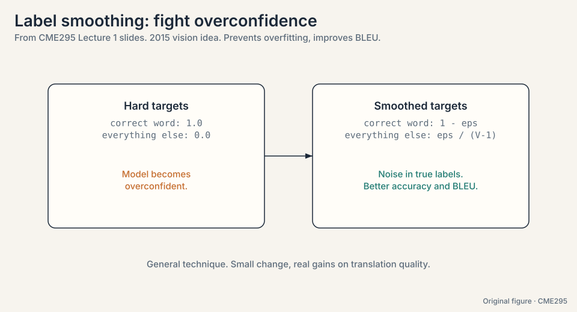

## Mapping back: what each piece fixed

Each new idea answers one crack from the chain of first attempts, by
name:

| Crack | Answer | How |
|---|---|---|
| One-hot says nothing about meaning | Word2vec embeddings | Neighbors decide geometry: "teddy" dot "bear" grows, "teddy" dot "quantum" stays small |
| Static vectors ignore the sentence | Contextual representations (RNN, then attention) | Each token's vector is rebuilt from its surroundings every pass |
| RNN fades over distance: (0.5)^6 < 2% | Self-attention | Every pair of tokens meets in one step, no chain, no dilution |
| RNN gradients break: 0.9^10 = 0.35, 1.1^10 = 2.59 | Short paths | The learning signal crosses one attention layer, not N chained steps |
| RNN is serial: step t waits for t-1 | Parallel matrix ops | All N^2 pair scores compute at once |
| Attention sees a set, not a sequence | Positional encoding | Add position info to each embedding. Sinusoids encode relative distance |

## The honest price: quadratic

Deleting the chain has a price. The score matrix is N x N: every token
pairs with every token. Double the sequence length and the work
quadruples. For N = 4,096, that is 16.7 million scores per layer per
head, most of which must sit in memory. This single fact, attention is
quadratic in sequence length, drives Lecture 2's cheaper attention
patterns, Lecture 3's KV cache engineering, and much of the rest of
the course.

## Recap: the whole lesson on one screen

The story in eight steps. Each step answers the one before it.

1. **Translate a sentence.** Generation is repeated classification over
   the vocabulary, one token at a time. The machine needs numbers for
   words that carry meaning.
2. **One-hot says nothing.** Dot products are all 0 or 1. Every word
   is equally distant from every other.
3. **Word2vec learns geometry.** CBOW and skip-gram train on neighbor
   prediction. The hidden layer becomes the embedding. But one vector
   per word: no context, no order.
4. **Tokenization cuts the text.** Word, subword, character. Subword
   (WordPiece, BPE) is the modern compromise, ~30k-50k tokens.
5. **The RNN reads in order.** h_t = tanh(W_h h_{t-1} + W_x x_t).
   Hidden state carries the past. Three cracks: distance fades
   ((0.5)^6 < 2%), gradients break (0.9^10 = 0.35, 1.1^10 = 2.59), the
   chain is serial.
6. **Attention deletes the chain.** Queries meet keys, softmax makes
   weights, values mix. "frame" = 0.21 counselor + 0.21 helped + 0.58
   self. O(1) distance, fully parallel.
7. **Order is added back.** Positional encoding: learned or sin/cos.
   The transformer stacks it: encoder, masked decoder, encoder-decoder
   attention, softmax over words.
8. **The price is quadratic.** N x N scores, 16.7M at N = 4,096. The
   rest of the course is about paying that bill.

## Go deeper

<div style="position:relative;padding-bottom:56.25%;height:0;overflow:hidden;max-width:100%;margin:16px 0;">
<iframe style="position:absolute;top:0;left:0;width:100%;height:100%;" src="https://www.youtube-nocookie.com/embed/wjZofJX0v4M" title="Transformers, the tech behind LLMs (3Blue1Brown)" frameborder="0" allow="accelerometer; autoplay; clipboard-write; encrypted-media; gyroscope; picture-in-picture" allowfullscreen></iframe>
</div>

<div style="position:relative;padding-bottom:56.25%;height:0;overflow:hidden;max-width:100%;margin:16px 0;">
<iframe style="position:absolute;top:0;left:0;width:100%;height:100%;" src="https://www.youtube-nocookie.com/embed/eMlx5fFNoYc" title="Attention in transformers, step-by-step (3Blue1Brown)" frameborder="0" allow="accelerometer; autoplay; clipboard-write; encrypted-media; gyroscope; picture-in-picture" allowfullscreen></iframe>
</div>

- Transformers, the tech behind LLMs (3Blue1Brown): https://www.youtube.com/watch?v=wjZofJX0v4M
- Attention in transformers, step-by-step (3Blue1Brown): https://www.youtube.com/watch?v=eMlx5fFNoYc
- The Illustrated Transformer (Jay Alammar): https://jalammar.github.io/illustrated-transformer/
- Karpathy, "Let us build GPT: from scratch, in code, spelled out": https://www.youtube.com/watch?v=kCc8FmEb1nY

## Official sources and further reading

**Official:**
- Lecture 1 slides (PDF), CME295 Autumn 2025: the sole source for this
  lesson. No transcript exists.
- cme295.stanford.edu: syllabus, logistics, and posted recordings.
- Super Study Guide (superstudy.guide): the course textbook by Amidi.
- VIP cheatsheet (github.com/afshinea/stanford-cme-295-transformers-large-language-models):
  translated into 11 languages.

**Further reading:**
- Vaswani et al., "Attention Is All You Need" (2017):
  - [the transformer paper. Read the](https://arxiv.org/abs/1706.03762)
  architecture section against the slides.
- Bahdanau et al., "Neural Machine Translation by Jointly Learning to
  Align and Translate" (2014): the original attention paper.
- Mikolov et al., "Efficient Estimation of Word Representations in
  Vector Space" (2013): word2vec.

**Caveats from these sources.** This lesson is slide-bound: the spoken
explanations, demos, and board work from the live lecture are lost.
The slides adapt figures from the CS 230 cheatsheets and the 2017
paper. Check those for full detail. The timeline (1980s-2020s) is
pedagogical, not a complete history of NLP.

## Connections to the other courses

- **CS336 L01:** tokenization derived from first principles, including
  the token chip. CME295 uses the conclusions. CS336 owns the
  mechanics.
- **CS336 L03:** the transformer architecture with full derivations.
  The Amidi walkthrough here is the conceptual version. CS336 is the
  mathematical one.
- **CS224N L05-L08:** language modeling with RNNs, LSTMs, NMT,
  attention, and transformers from the linguistics side.
- **CS224N L01-L02:** word vectors before and after word2vec.
- **CS229S L02:** the same attention toy from the systems side, with
  the training instability worked out in numbers.
