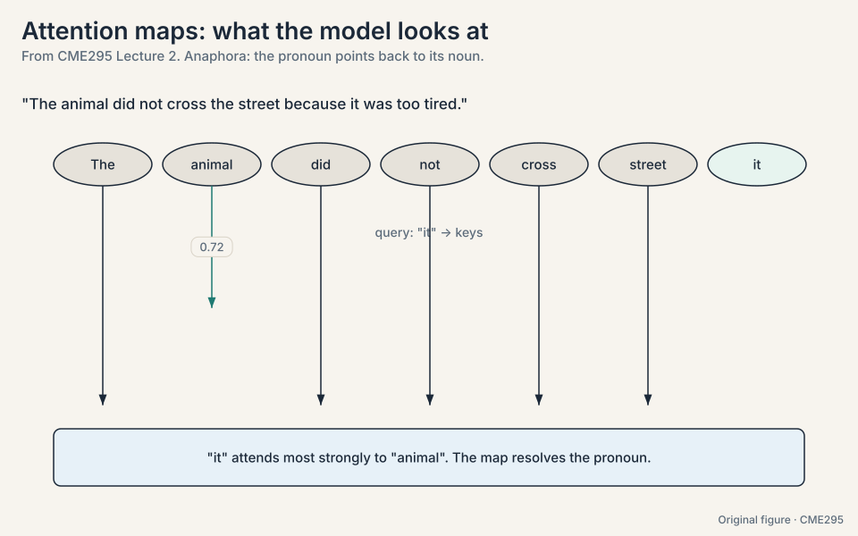
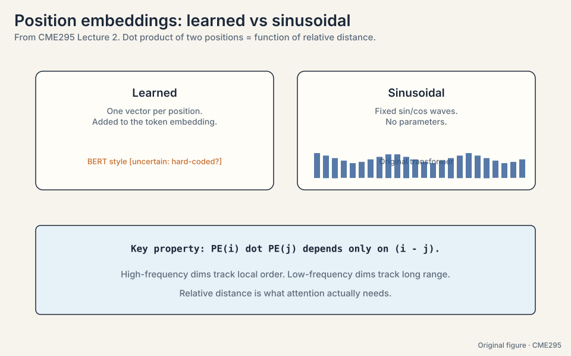
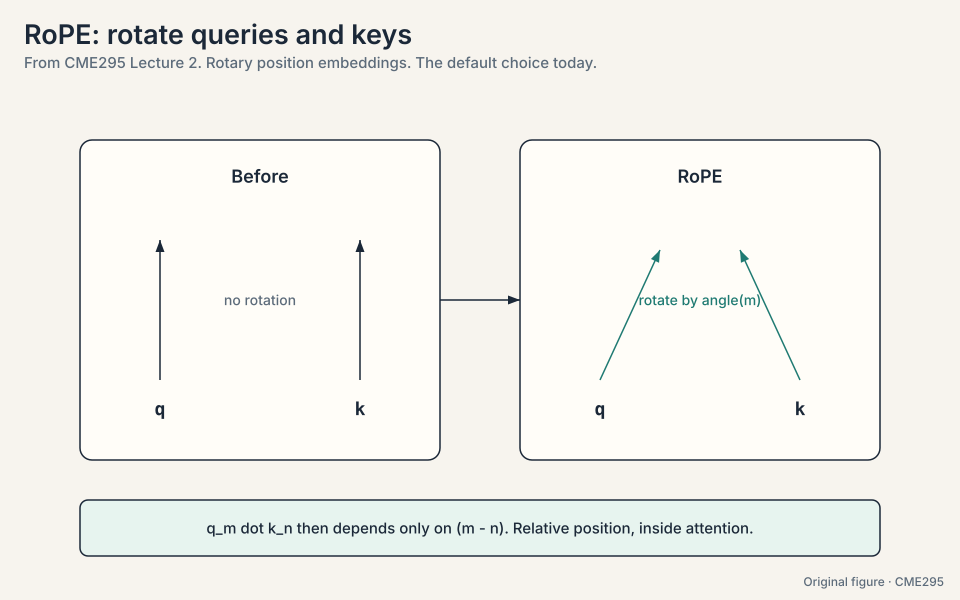
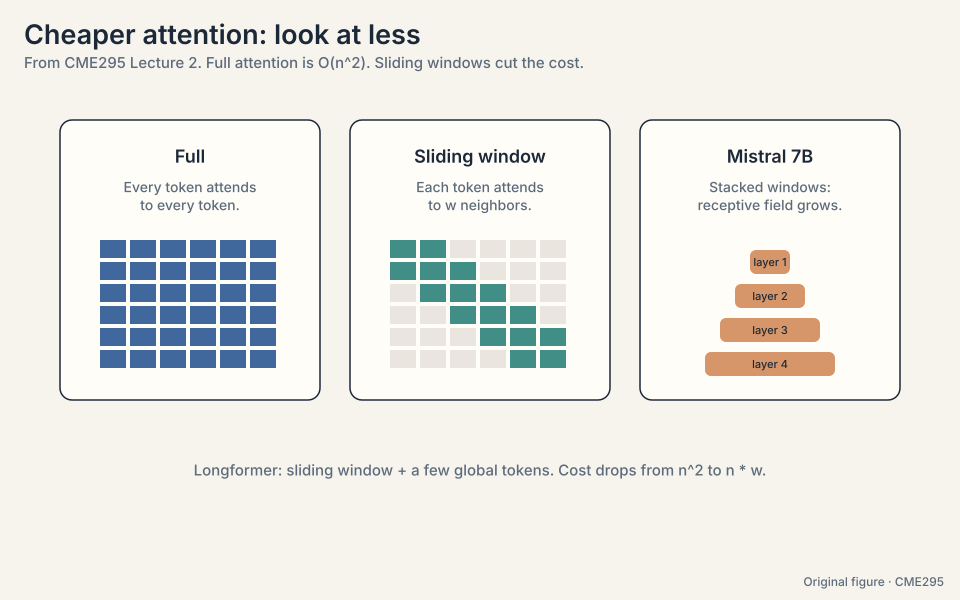
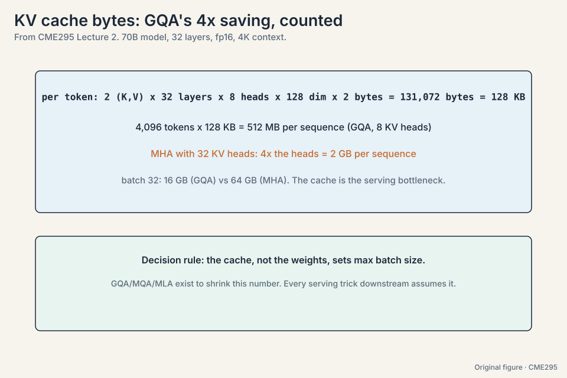
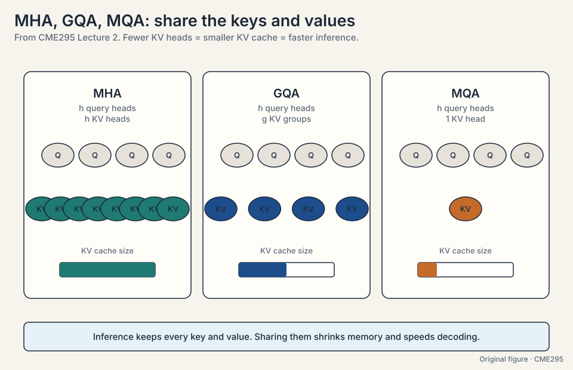
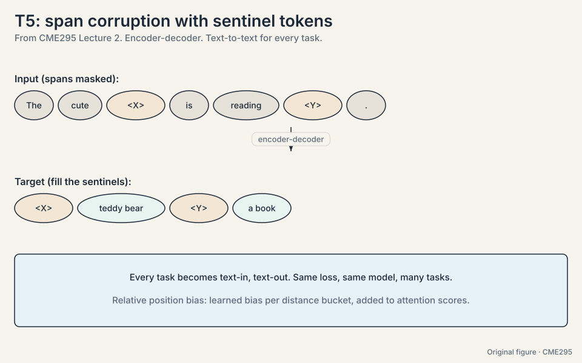
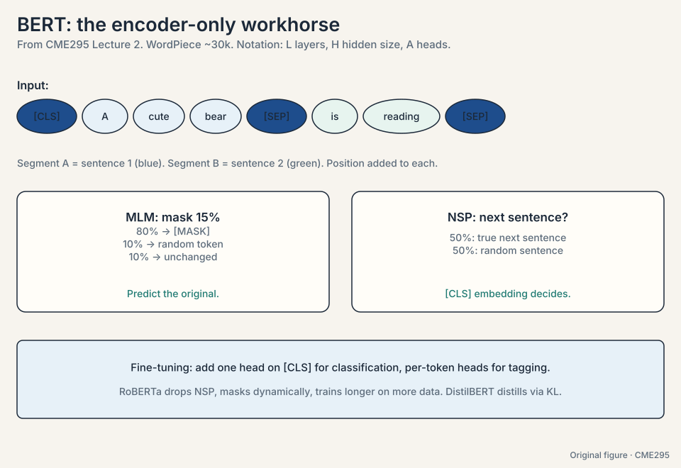
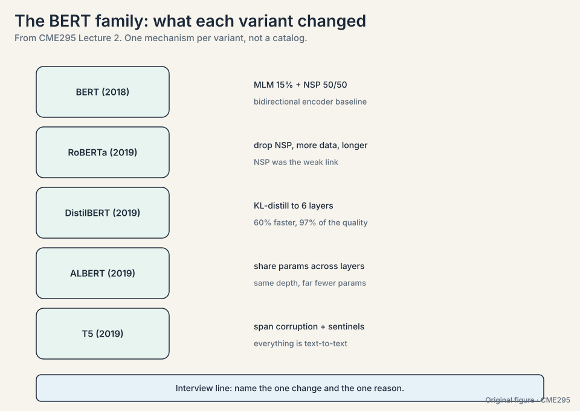

## The problem: we cannot see what attention reads

Lecture 1 built the attention arrow: query against keys, softmax,
mix the values. A model with 12 layers and 12 heads computes 144
attention maps per sentence. Each map is an N x N matrix: rows are
queries, columns are keys, brightness is weight. Can we read one and
check whether the model reads like we do?

The lecture's test case is **anaphora**, the linguistic term for a
pronoun pointing back to its noun. Take the sentence "The animal did
not cross the street because it was too tired." The pronoun "it"
refers to "animal". Now look at one attention head's weights for the
query token "it", over the ten tokens:

```ascii
query "it" attends to:
  The      0.03
  animal   0.72
  did      0.02
  not      0.01
  cross    0.03
  the      0.02
  street   0.06
  because  0.04
  too      0.03
  tired    0.04
```

The weight on "animal" is 0.72. The map resolves the pronoun the way
a reader does. Two lessons follow. First, attention weights are
inspectable: you can check whether the model's reading matches yours.
Second, no single head tells the whole story. Different heads track
different relations, which is why the architecture uses many of them.



### Subchapter: how to read an attention map

Read a map like a spreadsheet. Rows are queries (the token doing the
looking). Columns are keys (the tokens being looked at). Cell (i, j)
is the weight token i gives token j. Each row sums to 1. Bright
cells are large weights. The diagonal is often bright: tokens attend
to themselves. To check coreference, find the pronoun's row and scan
for the brightest noun column. The lecture's toy: row "it", column
"animal" = 0.72. One head, one row, one claim. Read maps one row at
a time, never the whole matrix at a glance.

### Subchapter: attention as explanation: the limits

The map shows weight, not cause. Three limits. First, a bright cell
means "token A read token B's vector". It does not mean the model
used that information for its decision. Second, values carry the
content: two tokens can have identical attention patterns but
different values, hence different outputs. Third, later layers remix
everything: layer 1's map is diluted by layers 2-12. Use maps to
debug (wrong coreference suggests a broken head). Do not use them to
prove the model "understands". The research literature argues about
exactly this, and the lecture takes the cautious side.

> [!QA]
> Q: Do attention maps explain the model's decision?
> A: They show information flow, not reasoning. A bright cell says
> token A read token B's representation. It does not say why that
> helped, or that the model "understood" coreference. Treat maps as a
> debugging lens, not a proof of understanding.
> Follow-up: Why look at maps at all, then?
> A: Because they catch failures cheaply. If "it" attended to
> "street" instead of "animal", you would suspect the head before
> blaming the data. Interpretability starts with checking the
> obvious.

## The problem: positions encode addresses, attention needs distances

The 2017 transformer adds one position vector per index to each
embedding. Two flavors: learned (a trainable vector per position, the
BERT style) and sinusoidal (fixed sin/cos waves, the original paper).
The sinusoidal version has a mathematical property the lecture
highlights. Write the position embedding at position p as pairs of
sin and cos at several frequencies. The dot product of the embeddings
at positions p and q works out to a sum of cos terms of (p - q).
Only the difference survives:

```ascii
PE(p) . PE(q) = sum over frequencies of cos((p - q) * omega)
```

The model can read relative distance straight out of the dot
product. Whether "bear" sits at position 5 or 500, "teddy" is one
step before it, and the waves say so. High-frequency dimensions
change fast and track local order. Low-frequency dimensions change
slowly and carry long-range information.

That property is a hint of what the field wanted: attention cares
about distance, not address. Absolute encodings answer "where am I".
Attention needs "how far apart are we". Three successors encode
relative position directly, each a small worked idea.

**T5 relative bias.** Add a learned scalar to the attention score,
chosen by distance bucket. The toy: score("bear", "teddy") gets +0.8
because distance 1 has bias 0.8. score("bear", "street") gets +0.1
because distance 5 has bias 0.1. Close tokens get a boost from the
bucket, far tokens do not.

**ALiBi** (Attention with Linear Biases,
[30:22](https://www.youtube.com/watch?v=yT84Y5zCnaA&t=1822s)). Subtract
a fixed penalty proportional to distance. The toy with penalty slope
m = 0.5:

```ascii
distance 1: score - 0.5
distance 2: score - 1.0
distance 4: score - 2.0
```

No learned parameters. Far tokens are pushed down by arithmetic, not
by learned weights. Because the penalty is a formula, it keeps working
past the longest training sequence: a model trained on 2,048 tokens
still penalizes distance 3,000 correctly. It extrapolates.

**RoPE** (rotary position embeddings,
[31:37](https://www.youtube.com/watch?v=yT84Y5zCnaA&t=1897s)). Rotate
the query and key vectors by an angle proportional to their
positions. The toy in two dimensions: q = [1, 0] at position 3,
k = [1, 0] at position 5, rotation angle = position * theta. Rotate q
by 3*theta, k by 5*theta. Their dot product is cos((5-3)*theta):
only the distance 2 remains. The rotation happens inside the QK dot
product, where it belongs. RoPE is the default choice in current
models: no extra parameters, relative by construction, clean long
context extension.

### Subchapter: the sinusoid toy, worked

Take d = 2, one frequency omega = 1/100. Positions p = 3 and q = 5:

```ascii
PE(3) = [sin(0.03), cos(0.03)] = [0.030, 0.9996]
PE(5) = [sin(0.05), cos(0.05)] = [0.050, 0.9988]
dot = 0.030*0.050 + 0.9996*0.9988 = 0.0015 + 0.9984 = 0.9999
cos((5-3)*0.01) = cos(0.02) = 0.9998  (same, up to rounding)
```

The dot product recovers cos of the distance. Shift both positions
by 100: PE(103).PE(105) = cos(2*0.01) again. Distance, not
address. That is the whole trick, and it survives because sin and
cos are periodic: p-q is all that matters.

### Subchapter: ALiBi arithmetic, worked

ALiBi subtracts m * distance from each attention score, with a fixed
slope m per head (e.g. m = 1/2, 1/4, 1/8, ... across 8 heads). Work
head 1 with m = 0.5 on scores [3.0, 2.0, 4.0] at distances [1, 2, 4]:

```ascii
before:  [3.0, 2.0, 4.0]
penalty: [0.5, 1.0, 2.0]
after:   [2.5, 1.0, 2.0]
```

The distance-4 token lost 2.0 points before softmax even ran. At
test time with a 3,000-token sequence (trained on 2,048), distance
2,500 gets penalty 0.5 * 2500 = 1250: crushed. No learned vector
for position 2,500 was ever needed, so extrapolation works by
construction. The cost: the penalty is fixed. If a far token
matters, the model cannot un-penalize it. Heads with small slopes
(m = 1/256) specialize in long range to compensate.

### Subchapter: RoPE in 2D, worked

Rotate in 2D by angle alpha: [x, y] becomes [x cos alpha - y sin
alpha, x sin alpha + y cos alpha]. RoPE rotates q at position p by
p*theta and k at position q by q*theta. Their dot product:

```ascii
q_p = R(p*theta) q,   k_q = R(q*theta) k
q_p . k_q = q . R((q-p)*theta) k
```

Only (q-p) survives: relative distance, baked into the score. The
theta values decay across dimension pairs (theta_i = 10000^(-2i/d)),
so early pairs rotate fast (local order) and late pairs rotate slow
(long range). This is why RoPE extends to long context cleanly:
distances the model never saw are just larger angles, and the slow
pairs still resolve them. Every current frontier model (GPT-6,
Gemini 3, DeepSeek V4.1, Llama 4) uses RoPE or a RoPE variant
[positions schemes for closed models inferred from public
documentation and papers. Exact variants unknown].

### Subchapter: T5 buckets, worked

T5's relative bias is a lookup: distance d maps to a bucket, each
bucket holds one learned scalar added to the score. The bucketing is
logarithmic: distances 0-3 get their own buckets, then buckets grow
(distance 4-7, 8-15, 16-31, ...). The toy: score("bear", "teddy")
at distance 1 reads bucket 1, bias +0.8. score("bear", "street") at
distance 5 reads bucket 4, bias +0.1. Beyond the last bucket,
everything shares one bias: no extrapolation beyond training range.
Logarithmic buckets spend precision where it matters (nearby) and
save it where it does not (far). Compared to ALiBi: learned vs
fixed. Compared to RoPE: additive bias vs rotation inside the dot
product.

.PE(5) = cos(2*omega). Distance only. Shell 2. Source: original toy. Project: Stanford Frontier AI.")




> [!QA]
> Q: Why did the field move from absolute to relative positions?
> A: Absolute encodings answer "where am I", but attention needs "how
> far apart are we". Relative schemes bake the distance into the
> score computation itself, and they generalize better: a model
> trained on length-2048 sequences can still reason about distance
> 3000, because distance 3000 is just another bucket, angle, or
> penalty, not an unseen vector.
> Follow-up: Why is RoPE the default today?
> A: It needs no extra parameters, it lives inside the QK dot product
> rather than as an add-on, and it extends cleanly to long contexts.
> Simplicity plus generality wins.

## The problem: deep stacks choke on post-norm

The 2017 paper normalizes *after* each sublayer: sublayer, then layer
norm, then the residual add. This is **post-norm**. Picture the
residual stream, the highway that carries the input of each layer
straight through to the next. With post-norm, the gradient flowing
back down the highway passes through a layer norm at every layer.
Each normalization rescales and recenters, and the product of many
such rescalings destabilizes deep stacks.

Modern stacks flip it ([46:36](https://www.youtube.com/watch?v=yT84Y5zCnaA&t=2796s)):
normalize *before* the sublayer, with the residual stream flowing
untouched. This is **pre-norm**. The highway stays clean, the
gradient travels down it without passing through 48 normalizations,
and 96-layer stacks train stably.

The norm itself also changed
([47:04](https://www.youtube.com/watch?v=yT84Y5zCnaA&t=2824s)). **Layer
norm** centers by the mean and scales by the variance: for a vector
x, subtract the mean, divide by the standard deviation. **RMSNorm**
skips the centering: scale by the root mean square only.

```ascii
layer norm:  x -> (x - mean(x)) / std(x)
RMSNorm:     x ->  x / rms(x)
```

Fewer parameters, same stability in practice, cheaper to compute.
Pre-norm plus RMSNorm is the current stack.

### Subchapter: layer norm vs RMSNorm, worked numbers

Take x = [2, 4, 6]. Layer norm first:

```ascii
mean = 4.  variance = ((2-4)^2 + (4-4)^2 + (6-4)^2)/3 = 8/3 = 2.67
std = 1.63
layer norm: [(2-4)/1.63, (4-4)/1.63, (6-4)/1.63] = [-1.22, 0, 1.22]

rms = sqrt((4 + 16 + 36)/3) = sqrt(18.67) = 4.32
RMSNorm: [2/4.32, 4/4.32, 6/4.32] = [0.46, 0.93, 1.39]
```

Layer norm centers then scales: mean 0, variance 1. RMSNorm scales
only: cheaper, and the mean carries a signal RMSNorm keeps. Then
each multiplies by a learned per-dimension gain (and layer norm
adds a learned bias). In practice the centering rarely matters for
transformers: the residual stream already carries the mean
information. Dropping it saves one pass over the vector per
normalization, and normalizations run 2 per layer times 96 layers.

### Subchapter: why pre-norm trains deeper

Picture the gradient's trip home through 96 layers. With post-norm,
each layer's output passes through a layer norm before reaching
the residual highway: the gradient crosses 96 normalizations, each
rescaling and recentering. Small rescalings compound. With
pre-norm, the highway is untouched: layer l's output flows straight
into layer l+1's input, and the sublayer's contribution adds on the
side. The gradient travels down the bare highway, full strength.
The cost: pre-norm stacks can underperform post-norm at shallow
depths (the sublayer inputs are normalized, which slightly weakens
early layers). The decision rule: below ~24 layers, try both.
Above ~48, pre-norm is the safe default.

 normalizes after the sublayer. Pre-norm normalizes before it. RMSNorm drops the mean. Stanford Frontier AI.")

## The problem: full attention costs O(n^2)

Every token attends to every token, so the score matrix is n x n.
Watch the numbers:

```ascii
n = 4,096:  full attention = 4,096^2 = 16,777,216 scores
sliding window w = 512: n * w = 4,096 * 512 = 2,097,152 scores
ratio: 8x fewer
```

For long documents the quadratic price hurts. Several patterns attend
to less. **Longformer** (2020,
[51:30](https://www.youtube.com/watch?v=yT84Y5zCnaA&t=3090s)): each
token attends to w neighbors, plus a few global tokens that attend
everywhere. Cost drops to O(n*w). **Mistral 7B**
([54:33](https://www.youtube.com/watch?v=yT84Y5zCnaA&t=3273s)) stacks
sliding-window layers: each layer sees w tokens, but the receptive
field grows with depth, like dilated convolutions. A token at layer 3
indirectly reaches 3*w tokens back. The pattern is general: pay full
attention where it matters, approximate elsewhere.



### Subchapter: Longformer global tokens, worked

Longformer keeps the sliding window and adds **global tokens**:
special positions that attend to everything and that everything
attends to. On a 4,096-token document with window w = 512, give
global status to 16 tokens (the question tokens, or [CLS]-style
markers). Cost: 4,096 * 512 window scores + 16 * 4,096 * 2 global
scores = 2.1M + 131K. The global tokens are the relays: any token
reaches any other token in two hops (token -> global -> token).
The design rule: globals go where the task's question lives. For
QA, the question tokens are global. For classification, one global
[CLS]. No globals and the window is a relay race with no
baton-passer.

### Subchapter: the sliding-window receptive field

One sliding-window layer sees w back. Stack them and the reach
grows. With w = 4,096 and 32 layers (Mistral 7B's shape): layer 1
sees 4K back, layer 2 sees 8K through layer 1's windows, layer L
sees L*w back in principle. In practice the signal dilutes: each
hop remixes through attention weights, so distant context arrives
faded. The effective reach is shorter than L*w. The interview
point: sliding windows trade exact long-range links for cheap
approximate ones, and depth is the recovery mechanism. It works
well enough that Mistral 7B shipped 32K context on this trick.

> [!QA]
> Q: Walk me through RoPE on the 2D toy, start to finish.
> A: Take q = [1, 0] at position 3 and k = [1, 0] at position 5.
> Rotate q by 3*theta, k by 5*theta. A 2D rotation by angle alpha
> maps [x, y] to [x cos alpha - y sin alpha, x sin alpha + y cos
> alpha]. The dot product of the rotated vectors equals the dot
> product of the unrotated vectors with one relative rotation
> between them: q_p . k_q = q . R((5-3)*theta) k = cos(2*theta).
> Only the distance 2 survives. Absolute positions 3 and 5
> disappeared. That is the whole mechanism: rotate by position,
> let the dot product cancel the absolute part.
> Follow-up: Why does RoPE extend to long context?
> A: Distances the model never saw are just larger angles, and the
> slow-rotating dimension pairs still resolve them. Nothing in the
> formula references a maximum position. It extrapolates by
> construction, like ALiBi, but with learned-distance semantics
> instead of a fixed penalty.

## The problem: the KV cache eats inference memory

**Multi-head attention** gives every head its own key and value
projections. At inference, autoregressive decoding generates one
token at a time. Without a cache, step t would recompute keys and
values for all t-1 previous tokens. The **KV cache**
([57:59](https://www.youtube.com/watch?v=yT84Y5zCnaA&t=3479s)) stores
them once and appends one row per step. The cache grows with heads,
layers, and sequence length, and it dominates inference memory.

The fix is sharing. Count the KV heads stored per layer:

```ascii
MHA (multi-head attention):  32 query heads -> 32 KV heads. Cache = 32 units.
GQA (grouped-query attention,
[59:24](https://www.youtube.com/watch?v=yT84Y5zCnaA&t=3564s)):
                             32 query heads -> 8 KV heads.  Cache = 8 units (4x smaller).
MQA (multi-query attention): 32 query heads -> 1 KV head.   Cache = 1 unit (32x smaller).
```

Fewer KV heads means a smaller cache and faster decoding, at a small
quality cost. Most current models ship GQA as the compromise.

### Subchapter: the KV cache byte math

Count the cache for one request. Per token per layer: 2 (key +
value) * KV heads * d_head * bytes per number. For a Llama-3-style
70B model: 80 layers, 8 KV heads (GQA), d_head = 128, fp16 (2
bytes):

```ascii
per token per layer: 2 * 8 * 128 * 2 = 4,096 bytes
per token, 80 layers: 327,680 bytes = 320 KB
32K-token context:  32,768 * 320 KB = 10.0 GiB per request
```

With MHA (64 KV heads): 8x more, 80 GiB per request. With MQA (1 KV
head): 8x less than GQA, 1.25 GiB. The cache is per request, so 100
concurrent 32K requests need 1 TiB with GQA. This is the number
that ends serving designs. Every cache-shrinking idea (GQA, MQA,
MLA in Lecture 3, DeepSeek V4.1's 890-bytes-per-token cache) is a
direct attack on this multiplication.

### Subchapter: MQA vs GQA, the quality tradeoff

MQA forces all 32 query heads to read one shared key and value.
GQA gives each group of 4 query heads its own KV pair (8 groups).
The quality question: do heads need different keys? Empirically,
mostly no: trained heads in MHA learn correlated keys, so sharing
loses little. MQA's single head is a coarser cut: at 70B+ scale the
quality drop shows on hard tasks, which is why the field settled on
GQA (Llama 3, Mistral, most 2024-2026 models) and MQA survives
mainly in small fast models. The decision rule: serve throughput
first, MQA. Balanced quality, GQA. Research flexibility, MHA.



> [!QA]
> Q: How do you pick the GQA group size?
> A: From the byte math. Fix your memory budget per request and
> your target context length, then solve: KV heads = budget / (2 *
> layers * d_head * bytes * tokens). The toy 70B: 8 KV heads give
> 10.0 GiB per 32K request. Halve to 4 heads and it is 5.0 GiB.
> Quality drops slowly with fewer heads (heads learn correlated
> keys), so pick the smallest head count your evals tolerate. The
> interview signal: show the division, not just the answer.
> Follow-up: Why not always use MQA then?
> A: At small scale, nothing stops you. At 70B+ the single shared
> KV pair becomes a bottleneck on hard tasks: every head reads the
> same keys, and the diversity multi-head was bought for is gone.
> GQA is the measured compromise.



> [!QA]
> Q: Why does the KV cache exist at all?
> A: Autoregressive decoding generates one token at a time. Without a
> cache, step t would recompute keys and values for all t-1 previous
> tokens. The cache stores them once and appends one row per step.
> Memory trades against quadratic recompute, and memory wins.
> Follow-up: When does GQA hurt?
> A: When heads genuinely need different keys and values. Sharing
> forces heads to read the same projections. Empirically the quality
> drop is small, which is why GQA is the default, but MQA's single
> head is a coarser cut used mainly for maximum throughput.

## The key question

The 2017 machine works on translation. What breaks when you aim it at
512-token documents and scale it to billions of parameters, and what is
the smallest fix for each break?

## The three families, then BERT end to end

Keeping the encoder, the decoder, or both gives three model families:

- **Encoder-only** (BERT). Reads the whole sequence bidirectionally.
  Produces embeddings for downstream tasks. Cannot generate text.
- **Decoder-only** (GPT). Reads left to right, predicts the next
  token. Generates text. This family becomes the LLM of Lecture 3.
- **Encoder-decoder** (T5). Reads the input bidirectionally,
  generates the output autoregressively. Text in, text out, for every
  task.

**T5** frames every task as text-to-text. Its pre-training objective
is **span corruption**. Random spans of the input are masked out and
replaced by sentinel tokens (<X>, <Y>, and so on
[66:14](https://www.youtube.com/watch?v=yT84Y5zCnaA&t=3974s)):

```ascii
input:  "A cute teddy bear is reading <X> the park <Y> today"
target: "<X> in <Y> and"
```

The target is the sequence of sentinel tokens followed by their
missing spans. The model learns to fill blanks of arbitrary length,
which exercises the encoder (understand the corrupted input) and the
decoder (generate the fills) at once.



**BERT** (2018) is the landmark encoder-only model. The input
pipeline: WordPiece tokenizer with about 30k tokens
([83:11](https://www.youtube.com/watch?v=yT84Y5zCnaA&t=4991s)).
Special tokens [CLS] open the sequence, and [SEP] separates and
closing segments. **Segment encodings** (sentence A gets one learned
vector, sentence B another). Position encodings are added per position.
(The lecture notes uncertainty about whether BERT's position
encodings were learned or hard-coded. Implementations commonly use
learned absolute encodings [uncertain].)

Two pre-training objectives, trained jointly:

- **MLM (masked language modeling).** Mask 15% of tokens. Of those,
  80% become [MASK], 10% become a random token, 10% stay unchanged.
  Work the numbers on a 512-token sequence: 0.15 * 512 = 77 tokens
  masked. Of the 77, about 61 become [MASK], about 8 become random
  tokens, about 8 stay as-is. The 80/10/10 split keeps the model
  honest: it cannot just learn "predict something whenever you see
  [MASK]", because [MASK] never appears at fine-tuning time.
- **NSP (next sentence prediction,
  [78:25](https://www.youtube.com/watch?v=yT84Y5zCnaA&t=4705s)).** 50%
  of the time sentence B truly follows sentence A. 50% of the time it is random.
  The [CLS] embedding predicts which. This teaches sentence-level
  relationships.

Notation in BERT papers: L layers, H hidden size, A attention heads.
BERT-base is L=12, H=768, A=12. Fine-tuning adds a small head: the
[CLS] embedding feeds a classifier for sentence tasks, or per-token
heads for tagging tasks. The whole stack trains end to end on the
labeled data.



Two descendants close the lecture:

- **DistilBERT.** Knowledge distillation: a small student trains to
  match a large BERT teacher's output distribution (KL divergence),
  not just hard labels. The teacher's soft probabilities carry extra
  signal about class similarities. Result: most of the accuracy at a
  fraction of the size and speed.
- **RoBERTa.** A replication study that found BERT was undertrained.
  It drops NSP, masks dynamically (a fresh mask pattern each epoch
  instead of one fixed mask), trains longer on much more data, with
  bigger batches. Same architecture, better training, better results.

### Subchapter: DistilBERT's distillation loss, worked

The student learns two losses. First, the standard MLM loss on hard
labels. Second, the distillation loss: KL divergence between the
teacher's soft distribution and the student's. The toy: teacher
outputs [0.7, 0.2, 0.1] over three classes, student outputs [0.5,
0.3, 0.2]. The hard label says class 1. The teacher's 0.2 on class
2 says "class 2 is plausible here": information the hard label
destroys. KL(teacher || student), natural log, = 0.7*log(0.7/0.5) +
0.2*log(0.2/0.3) + 0.1*log(0.1/0.2) = 0.236 - 0.081 - 0.069 = 0.085
(the shown terms are rounded. The exact sum is 0.0851).
Small when the student matches, large when it diverges. With a
temperature on the softmax, the distribution softens further and
the similarity signal strengthens. DistilBERT keeps ~97% of BERT's
GLUE score at 60% of the size and 60% faster inference.

### Subchapter: RoBERTa's changes, one by one

RoBERTa changed training, not architecture. Four changes:

1. **Drop NSP.** Follow-up studies showed NSP was too easy: the
   model solved it from topic overlap, and longer contiguous
   sequences trained without it did as well or better.
2. **Dynamic masking.** BERT masks once during preprocessing: the
   same tokens are masked every epoch. RoBERTa re-masks every
   epoch, so the model sees each sentence under many different
   masks.
3. **More data, longer, bigger batches.** 160 GB of text (vs 16
   GB), 500K steps, batches of 8K sequences.
4. **Longer sequences.** Train on full 512-token blocks instead of
   short segments.

Same transformer. Better numbers. The lesson: training recipes are
part of the model, not an afterthought.



> [!QA]
> Q: Why did RoBERTa's dynamic masking help?
> A: BERT's static mask wastes data: each sentence shows the model
> one fixed mask pattern across all epochs. Dynamic masking shows a
> fresh pattern per epoch, so 10 epochs mean 10 different prediction
> tasks on the same sentence. More effective data, same corpus. The
> general principle: preprocessing choices that look fixed are
> usually leaving signal on the table.
> Follow-up: When would you still use NSP-style objectives?
> A: When sentence relationships are the product: entailment,
> retrieval, QA. But the modern answer is a harder objective (SOP:
> sentence order prediction, or contrastive losses), not NSP. The
> 50/50 coin flip taught too little.

> [!QA]
> Q: Why mask only 15% of tokens, and why the 80/10/10 split?
> A: 15% keeps most of the context intact so prediction stays
> feasible. The 80/10/10 split fixes a train-test mismatch: [MASK]
> appears in pre-training but never in fine-tuning. By replacing 10%
> with random tokens and leaving 10% unchanged, the model must produce
> good representations for every token, not just react to the [MASK]
> symbol.
> Follow-up: Why did RoBERTa drop NSP?
> A: Follow-up studies found NSP too easy and not helpful: the model
> could solve it from topic overlap alone, and removing it while
> training on longer contiguous sequences worked as well or better.
> An objective that does not teach anything is dead weight.

## Mapping back: each refinement answers a 2017 limitation

| 2017 limitation | Refinement | How |
|---|---|---|
| Attention is opaque | Attention maps | Read the N x N weights: "it" puts 0.72 on "animal" |
| Absolute positions answer the wrong question | Relative schemes | T5 bias per distance bucket, ALiBi penalty m * distance, RoPE rotation |
| Post-norm destabilizes deep stacks | Pre-norm + RMSNorm | Clean residual highway. RMSNorm drops the mean |
| Full attention is O(n^2) | Sliding windows | n*w scores: 8x fewer at n = 4,096, w = 512 |
| KV cache dominates inference memory | GQA | 32 KV heads to 8: 4x smaller cache |
| Translation-only, hard to inspect | BERT and T5 | Bidirectional understanding (MLM 80/10/10, NSP 50/50) and text-to-text span corruption |

## The honest price

Every refinement trades something. ALiBi's penalty is fixed, so the
model cannot learn when far tokens matter. Sliding windows lose
direct long-range links and recover them only through depth. GQA and
MQA force heads to share keys and values, which costs a little
quality. Pre-norm trains stably but can underperform post-norm on
shallower stacks. MLM trains a model that never generates text. The
2017 design was coherent. The refinements are compromises with the
real world, and each one names what it gave up.

## Recap: the whole lesson on one screen

The story in eight steps. Each step answers the one before it.

1. **Read the attention.** An N x N map per head: rows are queries,
   columns are keys. "it" attends 0.72 to "animal": anaphora made
   visible. A debugging lens, not a proof of reasoning.
2. **Positions should encode distance.** Sinusoidal dot products
   depend only on p - q. Absolute answers "where am I". Attention
   needs "how far apart are we".
3. **Three relative schemes.** T5 adds a learned bias per distance
   bucket. ALiBi subtracts m * distance, no parameters,
   extrapolates. RoPE rotates Q and K. The dot product keeps only
   relative distance. RoPE is the default.
4. **Normalize before the sublayer.** Post-norm chokes the residual
   highway in deep stacks. Pre-norm leaves it clean. RMSNorm drops
   the mean-centering: fewer parameters, same stability.
5. **Attention gets cheaper.** O(n^2) hurts long documents. Sliding
   windows: n*w, 8x fewer scores at n = 4,096, w = 512. Mistral 7B
   stacks windows so the receptive field grows with depth.
6. **Share keys and values.** The KV cache dominates inference
   memory. GQA shares 32 query heads over 8 KV heads: 4x smaller.
   MQA goes to one. GQA is the standard compromise.
7. **T5 corrupts spans.** Mask spans, insert <X>/<Y> sentinels, train
   the decoder to output each sentinel plus its missing text. Every
   task becomes text-to-text.
8. **BERT masks and predicts.** WordPiece ~30k, [CLS]/[SEP], segment
   encodings. MLM: 15% masked with 80/10/10. NSP: 50/50. Fine-tune
   with a small head. DistilBERT distills. RoBERTa trains harder and
   drops NSP.

## Go deeper

<div style="position:relative;padding-bottom:56.25%;height:0;overflow:hidden;max-width:100%;margin:16px 0;">
<iframe style="position:absolute;top:0;left:0;width:100%;height:100%;" src="https://www.youtube-nocookie.com/embed/yT84Y5zCnaA" title="CME295 Lecture 2, Autumn 2025" frameborder="0" allow="accelerometer; autoplay; clipboard-write; encrypted-media; gyroscope; picture-in-picture" allowfullscreen></iframe>
</div>

- Lecture 2 recording (the timestamps above point into it): https://www.youtube.com/watch?v=yT84Y5zCnaA
- The Illustrated BERT (Jay Alammar): https://jalammar.github.io/illustrated-bert/
- Attention in transformers, step-by-step (3Blue1Brown): https://www.youtube.com/watch?v=eMlx5fFNoYc
- Su et al., RoFormer (RoPE paper): https://arxiv.org/abs/2104.09864

## Official sources and further reading

**Official:**
- Lecture 2 recording (YouTube): timestamped above.
- Lecture 2 slides (PDF), CME295 Autumn 2025.
- Devlin et al., "BERT" (2018):
  - [the encoder-only landmark.](https://arxiv.org/abs/1810.04805)
- Su et al., "RoFormer: Rotary Position Embedding" (2021):
  - [RoPE.](https://arxiv.org/abs/2104.09864)

**Further reading:**
- Raffel et al., "Exploring the Limits of Transfer Learning with T5"
  (2019): span corruption and the text-to-text frame.
- Press et al., "Train Short, Test Long: ALiBi" (2021): length
  extrapolation.
- Beltagy et al., "Longformer" (2020): sliding windows plus global
  tokens.
- Sanh et al., "DistilBERT" (2019).
- Liu et al., "RoBERTa" (2019).

**Caveats from these sources.** The lecture flags uncertainty about
whether BERT's position encodings were learned or hard-coded. Treat
that detail as [uncertain]. Attention maps show weight, not causation.
ALiBi and RoPE length extrapolation is empirical, not guaranteed.

## Connections to the other courses

- **CS336 L04:** linear attention, more efficient attention variants,
  and the MoE continuation of the sharing story.
- **CS336 L03:** the transformer architecture derivation this lecture
  modifies.
- **CS224N L08-L09:** transformers and pre-training from the NLP
  sequence-modeling perspective.
- **CME295 L01:** the attention arrow this lecture reads and refines.
