## The problem: what does "large" mean

A **language model** is a next-token probability machine. At every
position it computes P(x_t | x_1 ... x_{t-1}): the probability of
each vocabulary word given the words so far. **Large** means three
magnitudes at once: hundreds of billions of parameters, hundreds of
billions to tens of trillions of training tokens, and the
engineering to serve both.

Architecturally, the field converged: over 90% of large models are
**decoder-only transformers**. One stack, one objective (predict the
next token), no encoder-decoder plumbing. The decoder-only pattern
won because it is simple and it scales.

### Subchapter: why decoder-only won

Three reasons, in order of importance. First, **one objective
scales**: next-token prediction needs no labeled pairs, so every
byte of text is training data. Encoder-decoder needs structured
pairs. Second, **one stack is simpler to scale**: no cross-attention
plumbing, no encoder/decoder balance to tune, pipeline parallelism
maps cleanly onto a single stack. Third, **generation subsumes the
rest**: classification and QA become "generate the answer", so one
model serves all tasks. The cost: bidirectionality. Decoder-only
models read left to right, so they make worse embeddings than
bidirectional encoders. The market decided generation matters more.

### Subchapter: what is used where: the October 2026 lineup

| Model | Shape | Attention / sparsity | Position | Context |
|---|---|---|---|---|
| GPT-6 Astra (OpenAI) | decoder-only | closed details | unknown | unknown (not public) |
| Gemini 3.8 Flash (Google) | decoder-only | closed details | unknown | 1M (reported) |
| DeepSeek V4.1 Flash | decoder-only MoE, 552B, 8B/16B active | MLA-class latent cache (890 B/token) | RoPE-class | 1M |
| Llama 4 Maverick (Meta) | decoder-only MoE, 17B active, 128 experts | GQA-class | RoPE-class | 1M |
| Claude Sonnet 5.5 (Anthropic) | decoder-only | closed details | unknown | unknown (not public) |
| Kimi K3 (Moonshot) | decoder-only MoE | closed details | unknown | unknown |

Two honest notes. Closed labs publish almost no architecture
details: GPT-6, Gemini 3, and Claude entries above are "decoder-only
by behavior", not by disclosed design. And the open-weight rows
(DeepSeek V4.1, Llama 4) are where the verifiable mechanism
knowledge lives: MoE routing, GQA, RoPE, latent caches. When this
course says "what is used where", the evidence comes from the open
models.

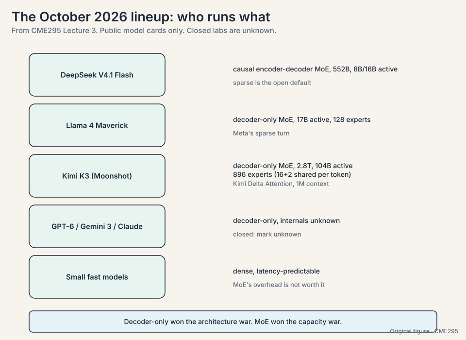

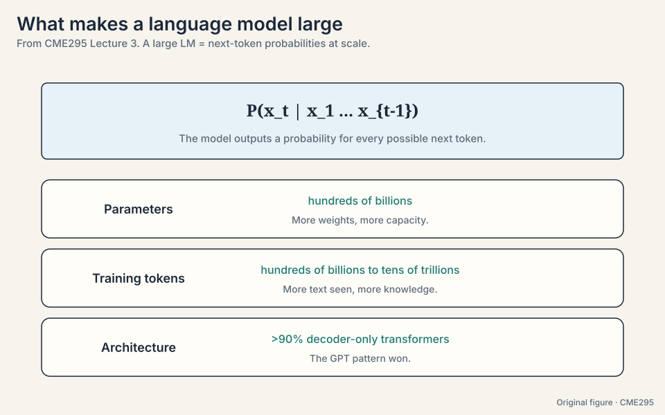

## The problem: every token runs the full model

In a dense transformer, every token passes through every
feed-forward network in every layer. The FFN holds roughly two
thirds of the parameters. Serving millions of tokens through all of
that is expensive. The lecture asks: do you need all parameters for
every token?

## The key question

Training buys you a probability distribution over next tokens. How do
you turn that distribution into answers, and how do you serve those
answers fast enough and cheap enough to use?

## Mixture of experts: route tokens to specialists

The metaphor is a room of experts: route each token to the
specialists it needs, and let the rest sleep. Formally, the output
is a weighted sum over experts:

**y-hat = sum of g_i * E_i(x)**

A **gating network** produces weights g_i per token. Each **expert**
E_i is a feed-forward network. In a dense MoE all experts run and
the weights blend them. In a **sparse MoE** only the top-K (K = 1 or
2) experts run per token. Sparse is the point: capacity without
proportional compute.

Watch routing on a toy. Four experts, one token, gating scores:

```ascii
token "bear", gating network outputs:
  expert 1: 0.60    expert 2: 0.25    expert 3: 0.10    expert 4: 0.05

top-2 routing: run expert 1 and expert 2 only.
output = 0.60 * E1(x) + 0.25 * E2(x)   (renormalized over the chosen two)
experts 3 and 4 sleep: zero compute, zero memory traffic.
```

Three details matter:

- **Routing is per token, per layer.** Each token picks its experts
  fresh at every layer. Tokens also scatter across GPUs, which
  parallelizes the expert computation.
- **Routing collapse**
  ([21:16](https://www.youtube.com/watch?v=Q5baLehv5So&t=1276s)).
  The router discovers that one expert is good enough and sends
  everything there. The other experts starve. Demonstrate it: start
  the toy with gating [0.40, 0.30, 0.20, 0.10]. Expert 1 gets 40% of
  the training signal, so it improves fastest. Next round its
  gating rises to 0.55, it gets more signal, it improves further.
  The loop converges to [1.00, 0, 0, 0]: you paid for four experts
  and use one. Fixes: an auxiliary load-balancing loss plus noisy
  gating, so the router keeps exploring.
- **Switch Transformer**
  ([28:34](https://www.youtube.com/watch?v=Q5baLehv5So&t=1714s)).
  The recommended read: top-1 routing pushed to about 1.6 trillion
  parameters. It proved sparse models scale.

### Subchapter: the gating math, written out

The gating network is a linear layer plus softmax over experts:
g = softmax(W_g x). On the toy: W_g x gives logits [2.0, 1.0, 0.0,
-1.0]. Softmax: exp = [7.39, 2.72, 1.0, 0.37], total 11.48. g =
[0.64, 0.24, 0.09, 0.03]. Top-2 keeps experts 1 and 2. Renormalize
over the chosen: 0.64/(0.64+0.24) = 0.73, 0.24/0.88 = 0.27. Output
= 0.73 * E1(x) + 0.27 * E2(x). Experts 3 and 4 never run. The
renormalization matters: without it, the dropped experts' weight
would leak out of the sum and the scale would drift.

### Subchapter: expert parallelism and the all-to-all

Tokens scatter across GPUs by expert assignment. GPU 0 holds
experts 1-2, GPU 1 holds experts 3-4. A token routed to expert 3
must travel to GPU 1, get processed, and return. That exchange is
an **all-to-all** communication: every GPU sends tokens to every
other GPU. At 256 experts across 64 GPUs, the all-to-all is the
dominant cost of the MoE layer, often bigger than the expert
compute itself. Two consequences: experts are sized to fill GPUs
evenly, and capacity limits (max tokens per expert per batch)
prevent one expert from drowning its GPU. Overflow tokens skip the
expert: a correctness tradeoff for throughput.

### Subchapter: MoE in production, October 2026

Sparse MoE is the default for open frontier models. DeepSeek V4.1
Flash: 552B total, 8B active on input, 16B on output. Llama 4
Maverick: 17B active over 128 experts. Kimi K3: MoE (details not
public). The pattern: total parameters measure capacity, active
parameters measure cost. The interview line: "MoE decouples the
two." Dense models are the exception now, kept where latency
predictability beats capacity (small fast models) or where the lab
never published the design (the closed labs).

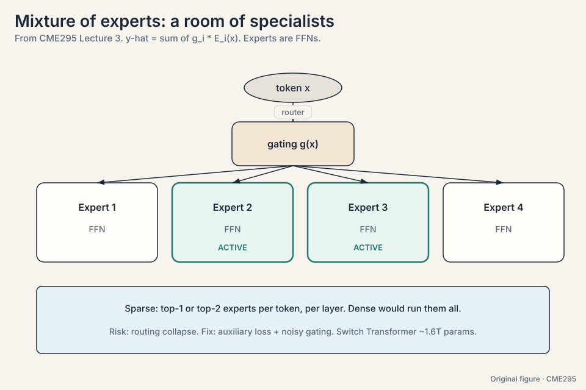

> [!QA]
> Q: Why are experts feed-forward networks and not attention layers?
> A: The FFN holds most of a transformer's parameters (roughly two
> thirds), so sparsifying it saves the most compute. Attention is
> comparatively cheap and benefits from seeing the full context, so
> it stays dense.
> Follow-up: What breaks if routing collapses?
> A: You paid for N experts and use one. Capacity is wasted, and the
> single active expert becomes a bottleneck that every token queues
> through. The auxiliary loss exists to keep the router honest.

## The problem: the model outputs probabilities, not tokens

The model's output at each step is a distribution over the whole
vocabulary: 50,000 numbers summing to 1. **Decoding** turns that
distribution into a token. Five strategies cover the space. Watch
all five on one toy distribution:

```ascii
vocabulary:  "lit" 0.50,  "read" 0.30,  "slept" 0.12,  "ate" 0.08
```

- **Greedy.** Take the argmax: "lit". Fast, deterministic, and prone
  to dull loops: the most likely token at every step is rarely the
  best sequence.
- **Beam search**
  ([41:36](https://www.youtube.com/watch?v=Q5baLehv5So&t=2496s)). Keep
  B hypotheses alive. With B = 2, extend "lit" and "read", keep the
  two best by summed log-probability, extend again. Length
  normalization divides by a length factor, because log-probabilities
  are negative: without it, a 3-token sequence summing to -2.1 always
  loses to a 2-token sequence summing to -1.8, regardless of quality.
  Better quality, B times the cost.
- **Sampling.** Draw from the distribution. On the toy, "lit" 50% of
  the time, "read" 30%, "slept" 12%, "ate" 8%. Diverse, occasionally
  surprising. The only randomness in the whole transformer lives
  here.
- **Top-K.** Sample from the K most likely tokens only. With K = 2,
  renormalize over "lit" (0.50) and "read" (0.30): 0.625 and 0.375.
  "slept" and "ate" get zero. Cuts the weird tail.
- **Top-P (nucleus).** Sample from the smallest set whose cumulative
  probability reaches P. With P = 0.9: "lit" + "read" = 0.80, not
  enough. Add "slept" = 0.92, enough. The set is {lit, read, slept}.
  It adapts automatically: sharp distributions give small sets, flat
  distributions give large ones.

### Subchapter: beam search, worked by hand

Beam width B = 2 on the toy. Step 1: candidates "lit" (log prob
log 0.5 = -0.69) and "read" (log 0.3 = -1.20). Keep both. Step 2:
extend "lit" with its top two next tokens, say "well" (log -0.5)
and "again" (log -1.0). Extend "read" with "books" (log -0.4) and
"more" (log -0.9). Four hypotheses, scores: lit+well = -1.19,
lit+again = -1.69, read+books = -1.60, read+more = -2.10. Keep the
two best: "lit well" (-1.19) and "read books" (-1.60). Extend
again. Length normalization divides each score by (length^alpha),
alpha ~ 0.6-1.0: without it, the 2-token hypotheses always beat
3-token ones because every log prob is negative.

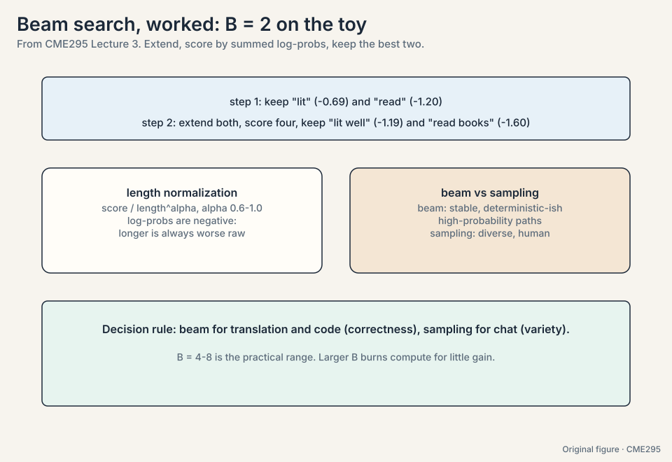

### Subchapter: top-K vs top-P on the same distribution

On the toy (lit 0.50, read 0.30, slept 0.12, ate 0.08): top-K with
K = 2 fixes the set at {lit, read} regardless of shape. Top-P with
P = 0.9 gives {lit, read, slept}: it adapts. Now sharpen the
distribution (lit 0.95, rest 0.05): top-K still gives 2 tokens,
top-P gives {lit} alone. Top-P is the better default because it
follows the distribution's entropy. Top-K survives as a guardrail:
it caps the set when the distribution goes flat and top-P would
admit hundreds of junk tokens. Production default: top-P ~ 0.9-0.95
with a top-K cap of a few hundred. The decision rule: sample with
top-P when you want quality, top-K cap when you fear the tail.

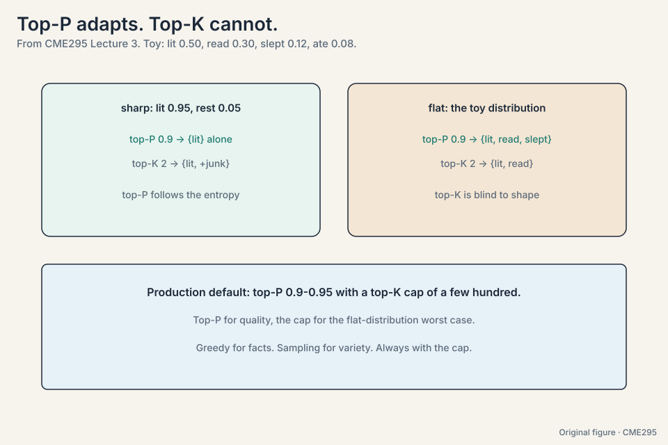

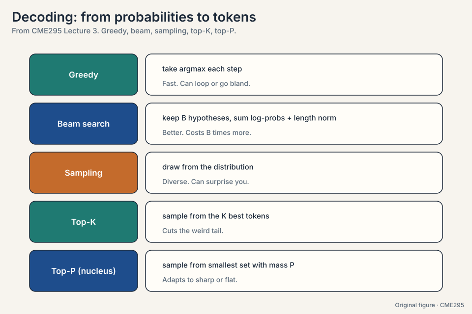

## Temperature reshapes the distribution

**Temperature** T reshapes the softmax: p_i is proportional to
exp(z_i / T)
([52:42](https://www.youtube.com/watch?v=Q5baLehv5So&t=3162s)).
Watch it on toy logits z = [3, 2, 1]:

```ascii
T = 0.5:  exp([6, 4, 2]) = [403, 55, 7]    -> [0.87, 0.12, 0.02]  (spiky)
T = 1.0:  exp([3, 2, 1]) = [20.1, 7.4, 2.7] -> [0.67, 0.24, 0.09] (trained)
T = 2.0:  exp([1.5, 1, 0.5]) = [4.5, 2.7, 1.6] -> [0.51, 0.31, 0.19] (flatter)
T -> inf: -> [0.33, 0.33, 0.33]  (uniform noise)
```

As T approaches 0, the argmax takes everything and outputs turn
deterministic. At T = 1 you get the trained distribution. As T grows
large, the distribution flattens toward uniform.

Two subtleties the lecture stresses. First, nothing in the
transformer is probabilistic except the sampling step. The model is a
deterministic function of its input. Randomness enters only when you
sample. Second, T = 0 is deterministic in theory but not always in
practice: GPU floating-point nondeterminism can still change outputs
between runs.

### Subchapter: the softmax with temperature, derived

Start from logits z = [3, 2, 1]. The softmax with temperature T is
p_i = exp(z_i / T) / sum(exp(z_j / T)). At T = 1: the trained
distribution [0.67, 0.24, 0.09]. Divide by T = 0.5 first: z/T =
[6, 4, 2], exp = [403, 55, 7], p = [0.87, 0.12, 0.02]. The gaps
widened: exp amplifies differences. Divide by T = 2: z/T = [1.5, 1,
0.5], exp = [4.5, 2.7, 1.6], p = [0.51, 0.31, 0.19]. The gaps
shrank. Temperature is a gap amplifier (T < 1) or gap flattener
(T > 1). It never changes the ranking: argmax is temperature-proof.

### Subchapter: why T = 0 is not deterministic on GPUs

T = 0 means argmax: pick the highest logit. Deterministic on paper.
On GPUs, floating-point addition is not associative: (a + b) + c
differs from a + (b + c) in the last bits. Parallel reductions sum
logits in orders that vary with thread scheduling. Two runs can
produce logits that differ by 1e-7. If the top two logits are within
1e-7 of each other, the argmax flips. Rare, but real: close calls
flip, ties flip. For reproducible evals, fix the seed, fix the
hardware, and accept that "deterministic" has an asterisk.

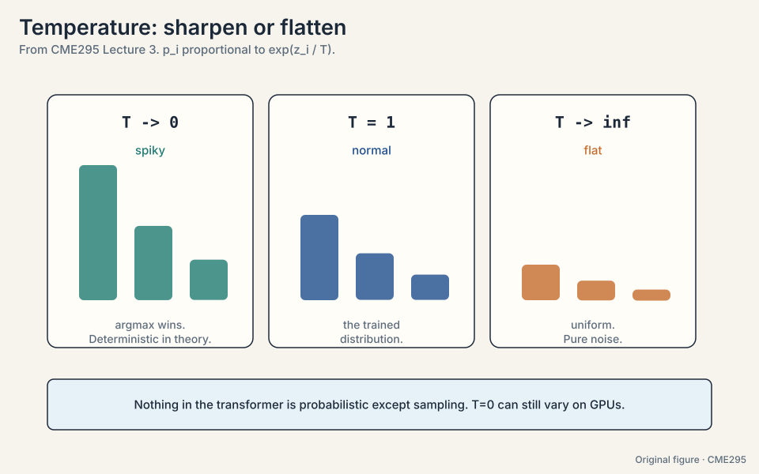

> [!QA]
> Q: Top-P or top-K for a production chatbot?
> A: Top-P at 0.9-0.95, with a top-K cap of a few hundred. Top-P
> adapts to the distribution's entropy: sharp distributions get
> small sets, flat ones get large ones. Top-K alone is blind to
> shape: K = 50 on a sharp distribution admits 49 junk tokens.
> The cap handles the reverse failure: on a flat distribution
> top-P would admit hundreds of tokens, so the cap bounds the
> worst case. Greedy for facts, sampling for variety, always with
> the cap.
> Follow-up: What breaks if you set top-P = 1.0?
> A: Nothing mechanically: the set is the whole vocabulary, so it
> is plain sampling. The failure is quality: the tail contains
> thousands of near-zero-probability tokens that occasionally get
> drawn. One weird token can derail a whole response.

> [!QA]
> Q: When would you use greedy decoding over sampling?
> A: When there is one right answer: math, code, factual lookup.
> Sampling adds variance you do not want. Use sampling (with
> temperature) when you want variety: brainstorming, dialogue,
> creative writing.
> Follow-up: Why does beam search need length normalization?
> A: Log-probabilities are negative, so longer sequences sum to more
> negative totals. Without normalization the search prefers short
> sequences regardless of quality. Dividing by a length penalty
> levels the field.

## The problem: sometimes the output must parse

A JSON API call, a form, a code skeleton: free text is not
acceptable. **Guided decoding**
([65:12](https://www.youtube.com/watch?v=Q5baLehv5So&t=3912s))
constrains sampling to tokens the grammar allows. Model the valid
outputs as a finite state machine or grammar
([66:48](https://www.youtube.com/watch?v=Q5baLehv5So&t=4008s)). At
each step, mask every token that would break the grammar and
renormalize over the rest.

The toy: the schema expects an opening brace. The model proposes
"lit" 0.50, "read" 0.30, "{" 0.12, "ate" 0.08. Mask the invalid
three, renormalize: "{" gets 1.0. The output always parses because
invalid tokens had zero probability.

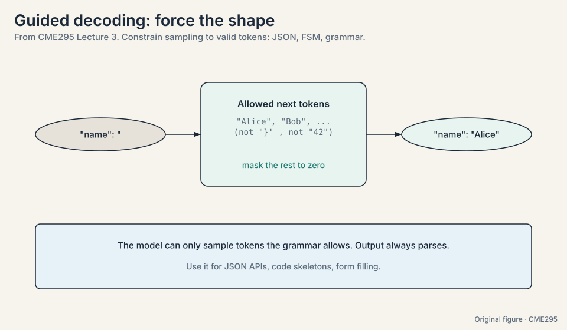

### Subchapter: the grammar as a finite state machine

Model the JSON schema as states and transitions. States: expect-key,
expect-colon, expect-value, expect-comma-or-close. At each state,
only some tokens are legal: in expect-key, only `"` starts a key.
The mask zeroes everything else before sampling. The FSM advances
on each emitted token. Two failure modes. First, the model can
paint itself into a corner: legal tokens at step t can still lead
to a state with no legal continuation at step t+5. Good
implementations backtrack or constrain lookahead. Second, the
grammar cannot fix semantics: `{"temp": 9999}` parses and is
nonsense. Guided decoding guarantees syntax, never sense.

> [!QA]
> Q: Walk me through speculative decoding, start to finish.
> A: A 70B target and a 4B draft. The draft generates k = 3 tokens
> fast: "the bear is". The target runs one forward pass over the
> prefix plus the 3 drafts, computing its own probabilities at each
> position. Accept tokens left to right while the target agrees:
> it accepts "the" and "bear", rejects "is". Keep the accepted
> prefix, resample the rejected position from the target's
> distribution, continue. Cost: 2 memory moves (draft + verify)
> produced 3 tokens instead of 3 moves. The output distribution is
> exactly the target's: the acceptance rule corrects for the
> draft's bias. Speedup follows the acceptance rate.
> Follow-up: When does it stop helping?
> A: Two cases. The draft disagrees too often (acceptance rate
> collapses, verification is wasted). Or batches are large: with
> many requests the GPU is compute-bound, not memory-bound, and
> the extra draft compute costs more than the saved memory moves.
> Speculative decoding is a latency trick for small batches.

## The problem: steer the model without retraining

Retraining is expensive. **Prompting** steers behavior with text
alone. A prompt has an anatomy: **context** (background facts),
**instructions** (what to do), **inputs** (the data), **constraints**
(format, length, tone). Getting each part right is most of applied
LLM work.

The technique ladder, on one running task ("classify this review"):

- **Zero-shot**
  ([74:59](https://www.youtube.com/watch?v=Q5baLehv5So&t=4499s)). No
  examples. "Classify: This teddy bear is SO CUTE!" Works when the
  instruction alone suffices.
- **Few-shot.** A few input-output examples in context. Shows the
  pattern to copy: format, style, edge cases.
- **Chain-of-thought**
  ([78:50](https://www.youtube.com/watch?v=Q5baLehv5So&t=4730s)). Ask
  the model to reason step by step before answering. More tokens
  means more compute spent on the problem, and intermediate steps
  catch errors early.
- **Self-consistency**
  ([82:16](https://www.youtube.com/watch?v=Q5baLehv5So&t=4936s)).
  Sample N reasoning paths, take the majority answer. The toy: N =
  5 paths give answers [A, B, A, A, C]. Majority: A, with 3 of 5
  votes. Independent noise cancels. The modal answer is usually the
  careful one.

Two warnings come with scale. Context windows reach hundreds of
thousands of tokens, but stuffing them hurts: irrelevant context
degrades performance, a phenomenon the lecture calls **context rot**
([69:09](https://www.youtube.com/watch?v=Q5baLehv5So&t=4149s)), citing
a needle-in-a-haystack paper from summer 2025 [uncertain: paper not
named in the transcript]. And repeated prompt prefixes can be cached:
**prompt caching** computes the shared prefix once and reuses it,
cutting cost and latency for repeated scaffolding.

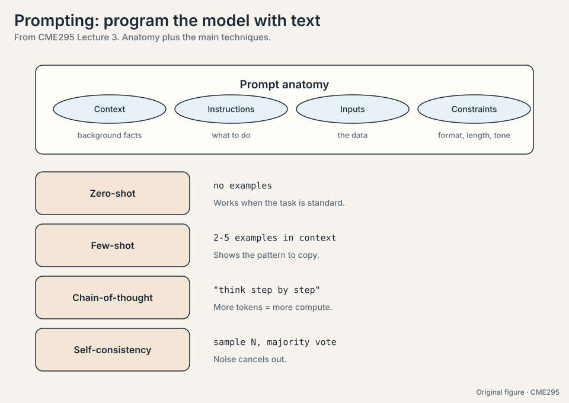

### Subchapter: chain-of-thought token economics

CoT trades tokens for accuracy. The toy: a math problem answered
directly costs 50 output tokens. With CoT it costs 50 reasoning
tokens plus 50 answer tokens: 2x the tokens, billed at output
rates. The lecture's claim: more tokens means more compute spent on
the problem, and intermediate steps catch errors. The economics:
CoT is worth it when the accuracy gain beats the 2-10x token
multiplier. For easy questions it is pure waste: the model writes
a chain it did not need. Production systems route: easy questions
skip CoT, hard ones use it (Lecture 6's dynamic budgets). The
interview line: "CoT converts a hard one-shot problem into easy
multi-shot problems, priced per token."

### Subchapter: self-consistency majority math

Sample N = 5 reasoning paths: answers [A, B, A, A, C]. Majority:
A with 3 of 5. Why it works: each path's error is roughly
independent, so the modal answer concentrates on the careful
reasoning while noise spreads across options. The math is the
Condorcet intuition: if each path is right with probability 0.6
independently, the majority of 5 is right with probability ~0.68.
It fails when errors correlate: if all 5 paths share the same
misreading of the question, the majority is confidently wrong.
Cost: 5x the tokens of one path. Use it where answers are
checkable or stakes are high.

> [!QA]
> Q: How many experts should an MoE layer have?
> A: From two constraints. Memory: experts must fit the GPUs you
> own (DeepSeek V4.1: 552B total across its fleet. Llama 4
> Maverick: 128 experts). Communication: the all-to-all cost grows
> with expert count, so more experts means more network traffic
> per layer. Quality: more experts mean more capacity at fixed
> active cost. The observed frontier: 16 experts (Llama 4 Scout)
> to 256 (DeepSeek V3). The decision rule: experts = (GPU memory
> for the layer) / (memory per expert), then check the all-to-all
> does not dominate. Top-1 vs top-2 routing then sets the active
> cost.
> Follow-up: Why do fine-grained experts (many small) beat few
> large ones?
> A: Specialization. 256 small experts can each own a narrow skill.
> 8 large experts must each cover broad territory. The routing
> gets more precise with more, smaller targets. The cost is the
> all-to-all: finer experts mean more cross-GPU traffic.

## The problem: serving is where the bills land

Each forward pass streams the full weight matrices from HBM memory to
the chip to produce one token. The arithmetic per byte moved is tiny.
So the bottleneck is **memory bandwidth, not FLOPS**: decoding is
**memory-bound**. Every efficiency trick here either moves less
memory or amortizes one memory move over more tokens. Watch the
arithmetic:

```ascii
70B parameters at 2 bytes each = 140 GB moved per token, per request.
Generate 100 tokens: 100 memory moves of 140 GB = 14 TB of traffic.
```

**KV cache**
([89:04](https://www.youtube.com/watch?v=Q5baLehv5So&t=5344s)).
Without caching, step t recomputes keys and values for all t-1
previous tokens: O(t) work per step, O(n^2) total. The cache stores
them and appends one row per step. This is why GQA and MQA from
Lecture 2 matter: fewer KV heads means a smaller cache. The lecture
notes the stored quantity is non-negligible, roughly eight KV head
copies per block [uncertain: exact referent of "eight copies" at
[96:51](https://www.youtube.com/watch?v=Q5baLehv5So&t=5811s)].

**Paged attention.** The KV cache fragments like OS memory: internal
fragmentation (reserved but unused space inside blocks) and external
fragmentation (scattered free space,
[94:34](https://www.youtube.com/watch?v=Q5baLehv5So&t=5674s)). The
toy: a request reserves 256 slots but uses 137. 119 slots sit idle
inside the reservation. Across thousands of requests the waste adds
up. Paging the cache into fixed blocks (block size around 16 in the
paper's setting [uncertain: speaker hedged]) packs memory tightly
and raises throughput.

**MLA** ([97:21](https://www.youtube.com/watch?v=Q5baLehv5So&t=5841s),
multi-head latent attention, DeepSeek V2). Compress keys and values
into small latent vectors instead of storing full heads. Less memory
per token, same information.

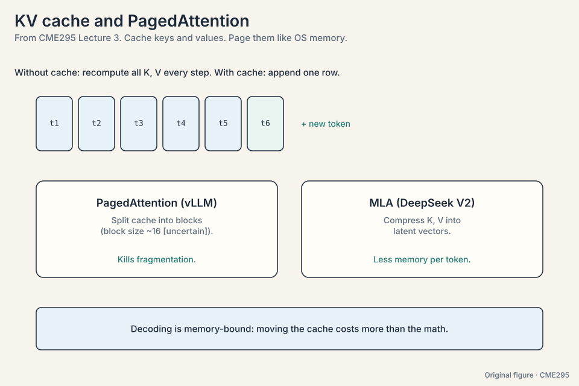

### Subchapter: the memory-bound proof

Arithmetic intensity decides: FLOPs per byte moved. A 70B decode
step does ~140 GFLOP (2 FLOPs per parameter per token) and moves
140 GB of weights. Intensity: 1 FLOP per byte. An H100 does ~989
TFLOPS (fp16 dense) at ~3.35 TB/s memory bandwidth. To be
compute-bound, the step would need intensity above ~300 FLOPs per
byte. It has 1. The GPU is 300x underfed: it finishes the math
instantly and waits on memory. This is why batching helps (one
weight move serves B tokens: intensity x B) and why every trick in
this section either moves fewer bytes (quantization, MLA, GQA) or
amortizes one move over more tokens (speculation, MTP, batching).

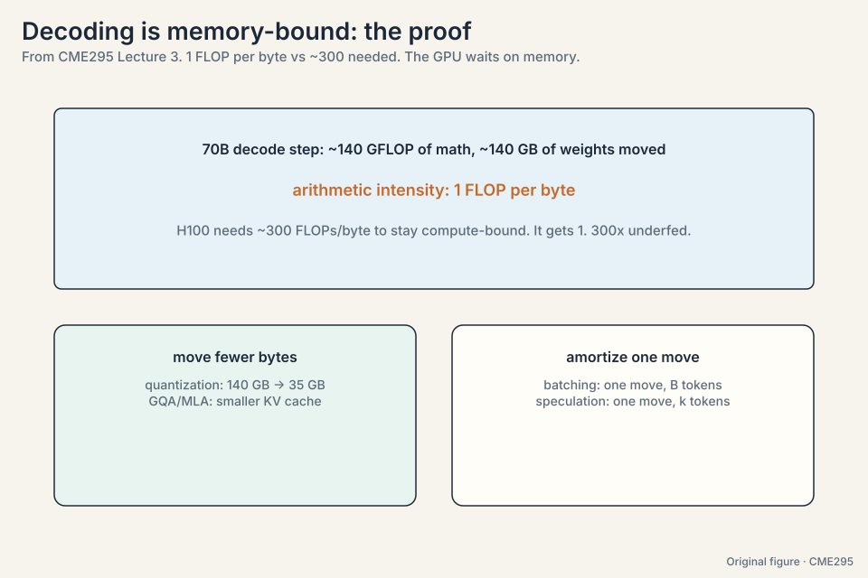

### Subchapter: paged attention block math

The toy: a request reserves 256 contiguous slots but uses 137. 119
slots (46%) sit idle inside the reservation. Across 1,000 requests
the waste is 119K slots of KV memory doing nothing. Paging splits
the cache into fixed blocks of 16 tokens: the request holds 9
blocks (144 slots) for 137 tokens, wasting 7 slots (5%). The block
table maps logical positions to physical blocks, like OS virtual
memory. Fragmentation falls from ~46% to ~5%. Throughput rises
because the same GPU memory now holds ~40% more concurrent
requests. The cost: one indirection per access. The paper's
setting uses block size 16. Larger blocks waste more per request.
Smaller blocks add table overhead.

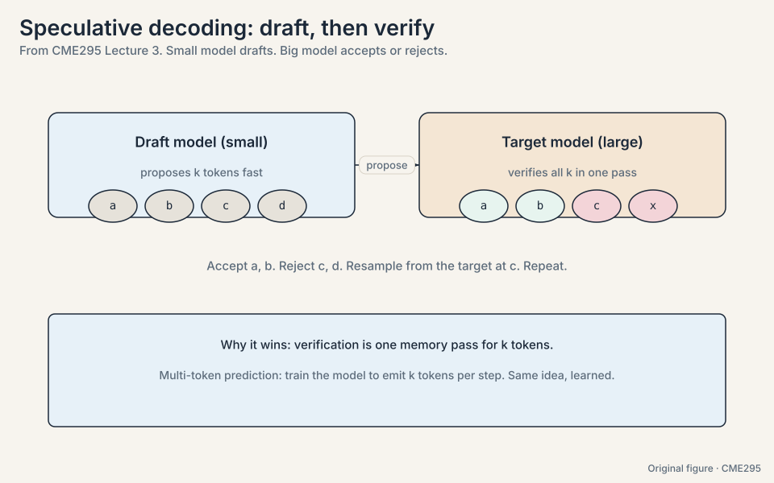

> [!QA]
> Q: When does prompt caching hurt?
> A: When the prefix is almost but not quite shared. The cache
> keys on exact prefix match: change one system-prompt word and
> the whole cache misses, but you paid the complexity of routing
> for the cache. Worse, teams freeze prompts to preserve hit
> rates and stop improving them: the cache becomes a tax on
> iteration. The decision rule: cache prefixes that are truly
> static (system prompts, tool definitions, few-shot blocks) and
> keep the dynamic parts (user input, retrieved chunks) at the
> end where they do not break the prefix.
> Follow-up: How much does it actually save?
> A: Providers price cached input tokens around 1/10 of uncached.
> A 10K-token system prompt cached across 1,000 requests: 10M
> tokens at 1/10 price. The savings are real exactly when the
> prefix is long and the request count is high.

**Speculative decoding**
([101:37](https://www.youtube.com/watch?v=Q5baLehv5So&t=6097s)). A
small draft model proposes k tokens fast. The large target model
verifies all k in one forward pass, accepting the good prefix and
resampling at the first rejection. The toy: k = 3 drafts, the target
accepts 2, rejects the third, and resamples it. Two memory moves
produced 3 tokens instead of 3 moves for 3 tokens. Verification moves
the weights once for k tokens, so accepted drafts are nearly free
speed.

**Multi-token prediction**
([106:43](https://www.youtube.com/watch?v=Q5baLehv5So&t=6403s)).
Train the model to emit several tokens per forward pass. Same idea
as speculation, but learned into the model instead of bolted on.


> [!QA]
> Q: Why is decoding memory-bound rather than compute-bound?
> A: Each forward pass streams the full weight matrices from HBM to
> the chip to produce one token. The arithmetic per byte moved is
> tiny. So the bottleneck is memory bandwidth, not FLOPS. Every
> efficiency trick here either moves less (KV cache, MLA, GQA) or
> amortizes the move over more tokens (speculative decoding,
> multi-token prediction).
> Follow-up: When does speculative decoding fail to help?
> A: When the draft model is wrong too often. Rejected drafts waste
> the verification pass, and resampling adds latency. The draft must
> be close enough to the target that acceptance rates stay high.

## Mapping back: one bottleneck rules serving

| Problem | Trick | What it saves |
|---|---|---|
| Every token runs every FFN | Sparse MoE | Compute: only top-1/2 experts run per token |
| Dense FFN per token per layer | Switch Transformer | Scale: 1.6T parameters at top-1 cost |
| Probabilities, not tokens | Decoding strategies | The right bias per task: greedy for facts, sampling for variety |
| Flat or spiky outputs | Temperature | Reshape exp(z_i / T): 0.5 spiky, 1 trained, 2 flat |
| Free text where JSON is needed | Guided decoding | Validity by construction: invalid tokens get 0 |
| Retraining to steer | Prompting | Zero/few-shot, CoT, self-consistency: no weights change |
| Recompute per step | KV cache | One row appended per step instead of O(t) recompute |
| Cache fragmentation | Paged attention | Fixed blocks: no idle slots inside reservations |
| Cache too big | MLA | Latent compression instead of full heads |
| One token per memory move | Speculative decoding, multi-token prediction | Amortize: k tokens per weight move |

## The honest price

Every trick trades something. Sparse MoE buys capacity and pays in
routing collapse risk and expert-parallel complexity. Beam search
buys quality and pays B times the compute. Sampling buys diversity
and pays in reproducibility. Guided decoding buys validity and pays
in expressiveness: the model cannot say what the grammar forbids.
Prompt caching buys speed and pays in prefix rigidity. Speculative
decoding buys speed and pays a draft model plus wasted verification
on rejections. The memory-bandwidth bottleneck is a fact of physics.
The tricks are ways to spend less of it per token.

## Recap: the whole lesson on one screen

The story in eight steps. Each step answers the one before it.

1. **Large means three magnitudes.** Next-token probabilities, with
   hundreds of billions of parameters and up to tens of trillions of
   tokens. Over 90% of LLMs are decoder-only.
2. **Route tokens to specialists.** y-hat = sum of g_i * E_i(x).
   Sparse top-1/2 routing per token per layer. Collapse is the
   failure mode: the router converges to one expert. Auxiliary loss
   plus noisy gating is the fix.
3. **Decoding turns probabilities into tokens.** Greedy (argmax),
   beam (B hypotheses with length norm), sampling (the only
   randomness), top-K (cut the tail), top-P (adapt the set to the
   distribution).
4. **Temperature reshapes.** exp(z_i / T). On logits [3,2,1]: T =
   0.5 gives [0.87, 0.12, 0.02]. T = 1 gives [0.67, 0.24, 0.09]. T =
   2 gives [0.51, 0.31, 0.19]. T = 0 is deterministic in theory, not
   always on GPUs.
5. **Constrain when output must parse.** Grammar plus mask:
   invalid tokens get zero probability. JSON comes out valid by
   construction.
6. **Prompting is programming in text.** Context, instructions,
   inputs, constraints. Zero-shot, few-shot, chain-of-thought,
   self-consistency (5 paths, majority wins). Beware context rot.
   Cache repeated prefixes.
7. **Decoding is memory-bound.** 70B at 2 bytes: 140 GB moved per
   token. KV cache appends one row per step. Paging kills
   fragmentation. MLA compresses.
8. **Amortize the memory move.** Speculative decoding: draft k,
   verify in one pass, keep the accepted prefix. Multi-token
   prediction learns it into the model.

## Go deeper

<div style="position:relative;padding-bottom:56.25%;height:0;overflow:hidden;max-width:100%;margin:16px 0;">
<iframe style="position:absolute;top:0;left:0;width:100%;height:100%;" src="https://www.youtube-nocookie.com/embed/Q5baLehv5So" title="CME295 Lecture 3, Autumn 2025" frameborder="0" allow="accelerometer; autoplay; clipboard-write; encrypted-media; gyroscope; picture-in-picture" allowfullscreen></iframe>
</div>

<div style="position:relative;padding-bottom:56.25%;height:0;overflow:hidden;max-width:100%;margin:16px 0;">
<iframe style="position:absolute;top:0;left:0;width:100%;height:100%;" src="https://www.youtube-nocookie.com/embed/YFwsSaWerDY" title="Speculative Decoding: How a Dumb Model Makes LLMs 3x Faster" frameborder="0" allow="accelerometer; autoplay; clipboard-write; encrypted-media; gyroscope; picture-in-picture" allowfullscreen></iframe>
</div>

- Lecture 3 recording: https://www.youtube.com/watch?v=Q5baLehv5So
- Speculative decoding, draft to verify (Devsplainers): https://www.youtube.com/watch?v=YFwsSaWerDY
- Fedus et al., Switch Transformers: https://arxiv.org/abs/2101.03961
- Kwon et al., PagedAttention: https://arxiv.org/abs/2309.06180
- Leviathan et al., speculative decoding: https://arxiv.org/abs/2211.17192

## Official sources and further reading

**Official:**
- Lecture 3 recording (YouTube): timestamped above.
- Lecture 3 slides (PDF), CME295 Autumn 2025.
- Fedus et al., "Switch Transformers" (2021):
  - [top-1 MoE at 1.6T parameters.](https://arxiv.org/abs/2101.03961)
- Kwon et al., "PagedAttention" (2023):
  - [paged KV cache management.](https://arxiv.org/abs/2309.06180)

**Further reading:**
- Holtzman et al., "The Curious Case of Neural Text Degeneration"
  (2019): nucleus (top-P) sampling.
- DeepSeek-V2 paper (2024): multi-head latent attention.
- Leviathan et al., "Fast Inference from Transformers via Speculative
  Decoding" (2023).

**Caveats from these sources.** The "eight copies per block" figure is
the speaker's live estimate [uncertain]. The context-rot paper is
unnamed in the transcript [uncertain]. The PagedAttention block size
(~16) is hedged by the speaker [uncertain]. MoE load-balancing
recipes vary by lab. The lecture gives the standard one.

## Connections to the other courses

- **CS336 L01:** the token chip and tokenization. Every decoding
  decision here operates on its IDs.
- **CS336 L04:** MoE in depth, plus linear attention as an
  alternative efficiency story.
- **CS336 L10/L18:** inference systems: KV cache management, batching,
  and serving at scale.
- **CS336 L02:** resource accounting: why memory bandwidth dominates
  decoding cost.
- **CME295 L02:** GQA/MQA, the architectural side of the KV cache
  story.
