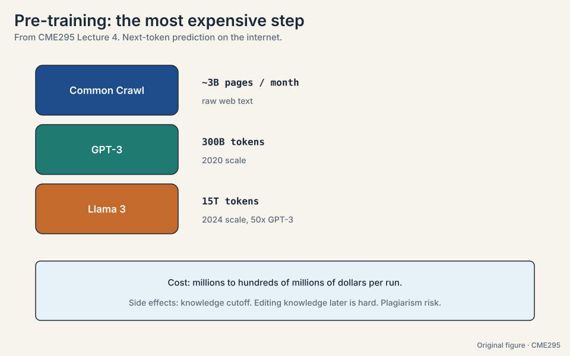
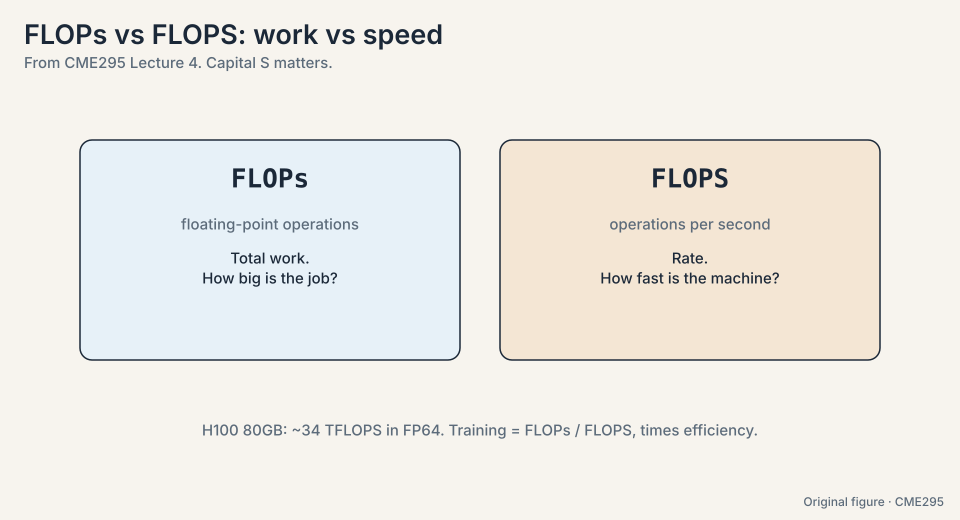
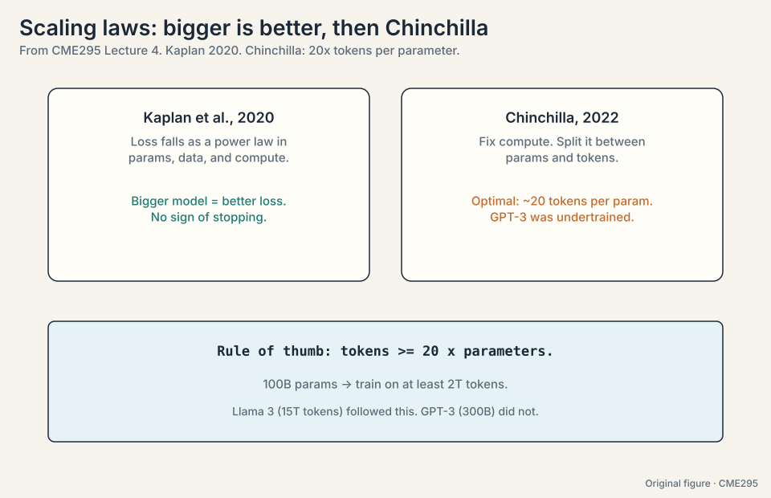
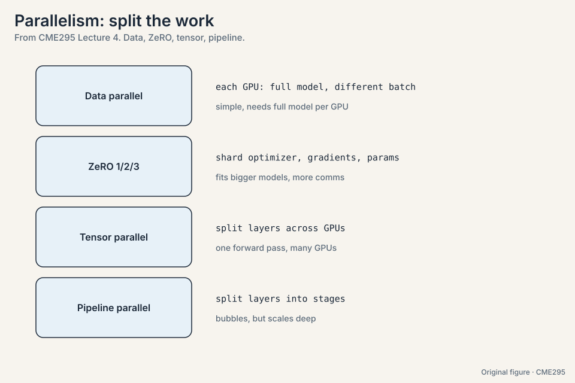
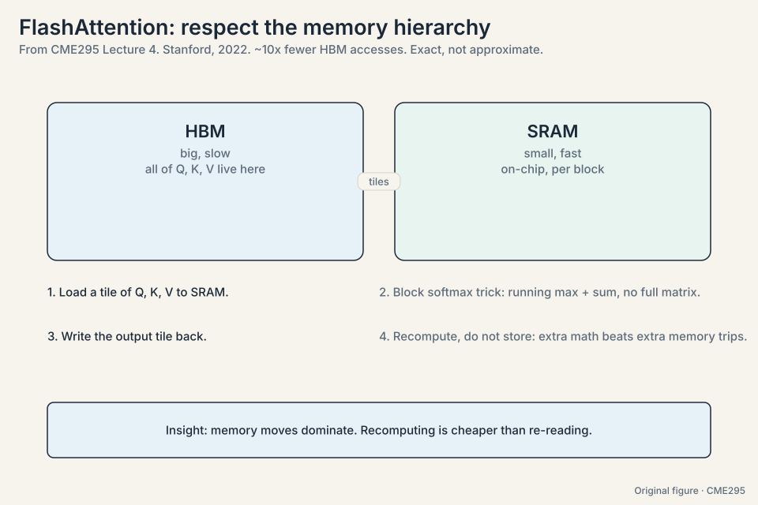
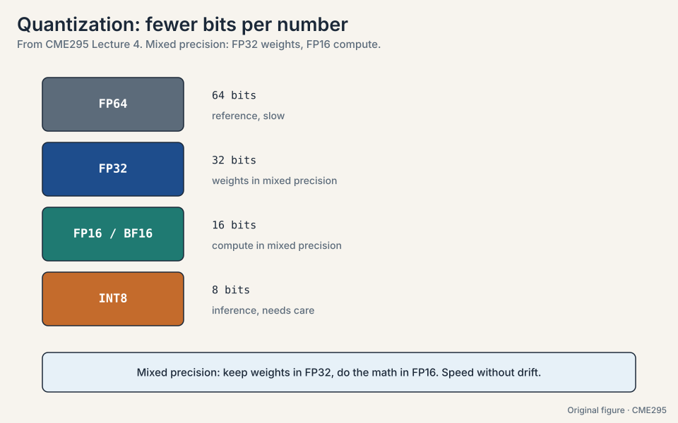
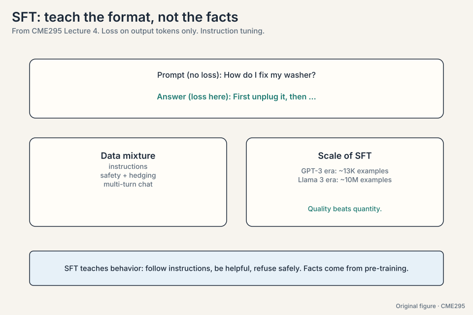
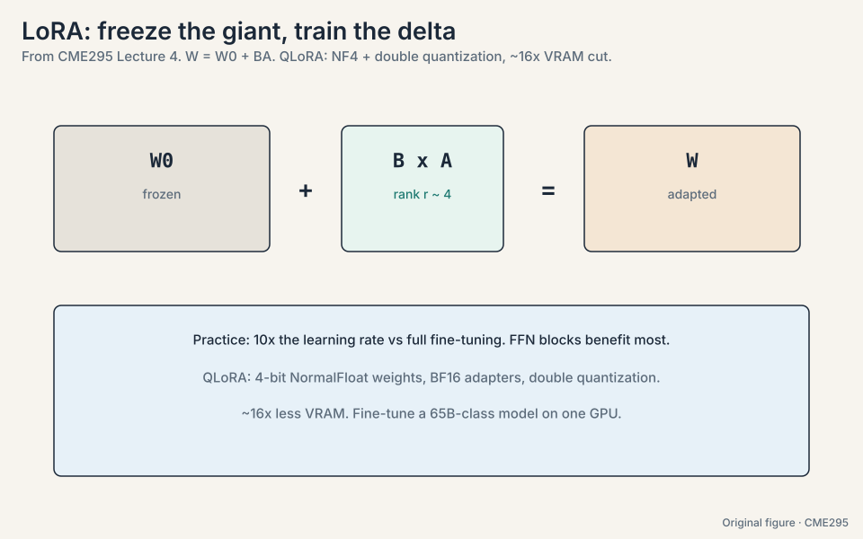
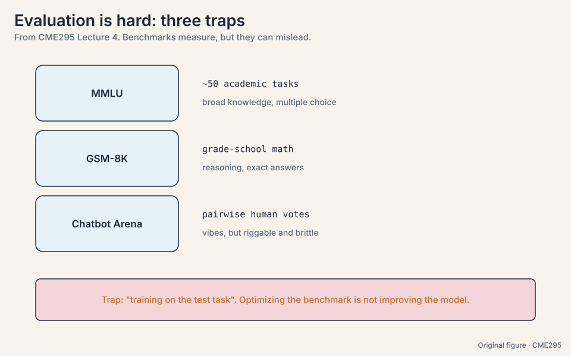

## The problem: train once or train per task

Suppose you need a model that answers washer-repair questions with a
teddy-bear analogy. The naive route: collect millions of
washer-repair Q&A pairs and train from scratch. The cheaper route,
and the one the whole industry uses, is **transfer learning**: learn
general structure once on a huge corpus, then specialize cheaply.
Three stages:

1. **Pre-training.** Next-token prediction on trillions of tokens.
   Teaches the structure of language and code. The most expensive
   step by far.
2. **Supervised fine-tuning (SFT).** Input-output pairs teach the
   desired behavior. Cheap relative to pre-training.
3. **Preference tuning.** Human preferences shape tone and safety.
   This is Lecture 5.

The bet is that stage 1 does the heavy lifting and stages 2 and 3
only redirect it. The rest of this chapter prices that bet.

## The key question

Training is a budget measured in FLOPs and dollars. Given a fixed
budget, how do you split it between model size and data, and how do
you fit the run onto real hardware?

## Pre-training eats the internet

**Common Crawl**
([12:03](https://www.youtube.com/watch?v=VlA_jt_3Qc4&t=723s)), a
crawl of roughly 3 billion pages per month, is the canonical raw
source. Scale grew fast: GPT-3 trained on 300 billion tokens. Llama 3
on 15 trillion. A frontier pre-training run costs millions to
hundreds of millions of dollars.

Three consequences follow. First, the **knowledge cutoff**: the model
knows nothing past its training data (the lecture cites GPT-5's
cutoff as September 30
[24:28](https://www.youtube.com/watch?v=VlA_jt_3Qc4&t=1468s), as
stated in the lecture [uncertain: year given as 2024 in Lecture 7]).
Second, **knowledge editing is hard**: changing what a trained model
"knows" without regressions is an unsolved problem. Third,
**plagiarism risk**
([23:54](https://www.youtube.com/watch?v=VlA_jt_3Qc4&t=1434s)): the
model memorizes training text and can reproduce it.



## How much work is a training run: FLOPs vs FLOPS

Notation first
([13:49](https://www.youtube.com/watch?v=VlA_jt_3Qc4&t=829s)).
**FLOPs** (lowercase s) counts floating-point operations: the total
work. **FLOPS** (uppercase S) counts operations per second: the
machine's rate. Training time is roughly FLOPs divided by FLOPS,
times hardware efficiency. The lecture's reference GPU is the H100
with 80GB
([30:17](https://www.youtube.com/watch?v=VlA_jt_3Qc4&t=1817s)), quoted
at about 34 TFLOPS in FP64 [uncertain: figure as stated in the
lecture].

Now price GPT-3 on the back of an envelope. The standard estimate:
about 6 FLOPs per parameter per token (forward plus backward pass).

```ascii
params = 175B,  tokens = 300B
total FLOPs = 6 * 175e9 * 300e9 = 3.15e23

one GPU at 34 TFLOPS:  3.15e23 / 3.4e13 = 9.3e9 seconds = 294 years
10,000 GPUs:          294 years / 10,000 = 10.7 days (at 100% efficiency)
```

Two lessons. First, frontier training is a distributed-systems
project: no single GPU finishes in a human lifetime. Second,
efficiency is everything: communication between GPUs, memory
bandwidth limits, and recomputation all waste FLOPS. Real
utilization is a fraction of peak, which is why systems work like
FlashAttention exists.



> [!QA]
> Q: Why do interviews probe the FLOPs/FLOPS distinction?
> A: Because it separates people who memorized numbers from people
> who can estimate. Given a model size and token count you can
> estimate training FLOPs (about 6 per parameter per token). Given a
> GPU's FLOPS you can estimate wall-clock time. The distinction is
> the whole estimation.
> Follow-up: What breaks the simple division?
> A: Efficiency. Communication between GPUs, memory bandwidth
> limits, and recomputation all waste FLOPS. Real utilization is a
> fraction of peak, which is why systems work like FlashAttention
> exists.

## The problem: where should the compute go

Bigger models on more data get better, following smooth **power
laws**: loss falls as model size, dataset size, and compute grow.
**Kaplan et al. (2020)** mapped those curves. But the curves leave a
budget question open: given fixed compute, how do you split it
between parameters and tokens? More of a big model, or more data for
a smaller one?

**Chinchilla (2022)** answered the split: about **20 tokens per
parameter** is compute-optimal
([19:41](https://www.youtube.com/watch?v=VlA_jt_3Qc4&t=1181s)). Work
the rule on GPT-3:

```ascii
GPT-3: 175B params. Optimal tokens = 20 * 175B = 3.5T.
Actual tokens: 300B. Shortfall: 3.5T / 300B = 11.7x.
Verdict: undertrained. Too big for its data.
```

The rule of thumb: tokens >= 20 x parameters. A 100B-parameter model
wants at least 2T tokens. Training a bigger model on the same data
wastes the budget. Training a smaller model on more data wins.



## The problem: no single GPU holds the run

The GPT-3 estimate needed 10,000 GPUs even at fantasy efficiency.
Now count what one GPU must hold. Adam, the standard optimizer,
keeps two extra numbers per parameter (momentum and variance), in
FP32:

```ascii
175B params, mixed precision:
  parameters (FP16):        2 bytes * 175B = 350 GB
  gradients (FP16):         2 bytes * 175B = 350 GB
  optimizer states (FP32):  8 bytes * 175B = 1.4 TB
  total per replica: ~2.1 TB. An H100 holds 80 GB.
```

No single GPU comes close. Four strategies divide the work:

- **Data parallelism.** Each GPU holds the full model and processes
  a different data shard. Gradients average across workers. Simple,
  but every GPU must fit the whole 2.1 TB replica.
- **ZeRO** ([33:54](https://www.youtube.com/watch?v=VlA_jt_3Qc4&t=2034s),
  zero redundancy optimization). Shard what data parallelism
  replicates: ZeRO-1 shards the 1.4 TB of optimizer states, ZeRO-2
  adds the 350 GB of gradients, ZeRO-3 shards the parameters too
  ([35:07](https://www.youtube.com/watch?v=VlA_jt_3Qc4&t=2107s)).
  With W workers, each holds roughly 2.1 TB / W. Bigger models fit.
  Communication rises.
- **Tensor parallelism**
  ([36:45](https://www.youtube.com/watch?v=VlA_jt_3Qc4&t=2205s)).
  Split individual layers across GPUs. One forward pass involves
  many GPUs.
- **Pipeline parallelism**
  ([37:00](https://www.youtube.com/watch?v=VlA_jt_3Qc4&t=2220s)).
  Split layers into stages. Micro-batches flow through. The cost:
  **pipeline bubbles**. With 4 stages and 1 micro-batch, stages 2-4
  idle while stage 1 works: 3/4 of the hardware waits. More
  micro-batches shrink the bubble.



## The problem: attention moves too much memory

Attention's bottleneck is memory movement, not math. A GPU has big
slow memory (**HBM**, where Q, K, V live,
[39:14](https://www.youtube.com/watch?v=VlA_jt_3Qc4&t=2354s)) and
small fast memory (**SRAM**, on-chip,
[39:28](https://www.youtube.com/watch?v=VlA_jt_3Qc4&t=2368s)). Naive
attention shuttles the full N x N score matrix through HBM. At
N = 4,096, that is 16.7M scores per head: 33 MB at 2 bytes each,
read and written repeatedly, per layer, per head.

**FlashAttention** (Stanford, 2022,
[38:35](https://www.youtube.com/watch?v=VlA_jt_3Qc4&t=2315s)) tiles
the computation: load a block of Q, K, V into SRAM, compute that
block's output with a running-softmax trick (track the running max
and sum, never materialize the full matrix), write the block back.
A second idea: **recompute instead of storing**. Throw away
intermediate results and redo the math when needed, because SRAM
compute is cheaper than HBM round-trips. The result is exact, not
approximate, with roughly 10x fewer HBM accesses.



> [!QA]
> Q: Why is recomputing ever faster than storing?
> A: Because the memory hierarchy is lopsided. An HBM read costs far
> more time and energy than redoing the arithmetic in SRAM. When the
> math is cheap and the data is big, compute is the cheaper
> currency.
> Follow-up: Is FlashAttention an approximation?
> A: No. It computes exact attention. The tiling and the running
> softmax are algebraically equivalent to the naive version. Speed
> comes from memory behavior, not from cutting corners.

## The problem: full precision is expensive

**Quantization** stores numbers in fewer bits: FP64 to FP32 to
FP16/BF16 to INT8
([53:11](https://www.youtube.com/watch?v=VlA_jt_3Qc4&t=3191s)). Count
it on the 70B model: FP16 is 140 GB. INT8 is 70 GB. Half the memory,
faster math, some precision cost.

The standard compromise is **mixed precision**: keep weights in
FP32, do the compute in FP16
([56:53](https://www.youtube.com/watch?v=VlA_jt_3Qc4&t=3413s)). The
master weights stay precise. The arithmetic runs fast. Loss scaling
keeps small gradients representable in FP16's narrow range.



## SFT: the completer becomes an assistant

Pre-training produces a completer, not an assistant: it continues
text, it does not follow instructions. SFT teaches behavior with
input-output pairs. The key detail: **loss applies to output tokens
only**. The prompt is context. The model is graded on its answer.

The lecture's example is a washer repair question answered with a
teddy-bear analogy: the facts come from pre-training, the helpful
format comes from SFT. The data mixture matters: instructions,
safety examples, hedging ("I am not sure, but..."), multi-turn
dialogue. Scale grew with the field: GPT-3-era SFT used about 13K
examples. Llama-3-era used about 10M
([78:02](https://www.youtube.com/watch?v=VlA_jt_3Qc4&t=4682s)).
Quality beats quantity, but quantity grew anyway.

An emerging middle stage sits between pre-training and SFT:
**mid-training** on a large but higher-quality corpus, a bridge from
raw web text to instruction data. Lecture 9 returns to it.



## The problem: full fine-tuning is heavy

Full fine-tuning updates every weight: expensive in memory
(optimizer states for billions of parameters) and storage (a full
copy per task). **LoRA**
([97:56](https://www.youtube.com/watch?v=VlA_jt_3Qc4&t=5876s))
freezes the base weights W0 and trains a low-rank delta:

**W = W0 + BA**

Count the parameters. A 4096 x 4096 weight matrix has 16.7M
parameters. With rank r = 4, B is 4096 x 4 and A is 4 x 4096: 32,768
parameters. That is 512x fewer. In practice LoRA wants about 10x the
learning rate of full fine-tuning, and adapting the FFN blocks helps
most ([98:20](https://www.youtube.com/watch?v=VlA_jt_3Qc4&t=5900s)).

**QLoRA** pushes further: quantize the frozen base to 4-bit
NormalFloat (NF4,
[106:09](https://www.youtube.com/watch?v=VlA_jt_3Qc4&t=6369s)), keep
the adapters in BF16, and quantize the quantization constants
themselves (**double quantization**,
[106:33](https://www.youtube.com/watch?v=VlA_jt_3Qc4&t=6393s)).
Roughly 16x less VRAM: fine-tune a 65B-class model on a single GPU.



> [!QA]
> Q: Why does a rank-4 update work on a billion-parameter model?
> A: Fine-tuning mostly steers behavior, not knowledge. The needed
> change has low intrinsic dimension: a few directions in weight
> space capture "answer in this format" or "follow these
> instructions". The base model already knows the facts. The delta
> only redirects them.
> Follow-up: When is LoRA the wrong choice?
> A: When the task needs genuinely new capabilities or knowledge,
> not just redirection. Deep domain adaptation and large
> distribution shifts still favor full fine-tuning, or more
> pre-training.

## The problem: benchmarks mislead

SFT and scale need measuring, but benchmarks mislead. Three the
lecture names:

- **MMLU**
  ([87:00](https://www.youtube.com/watch?v=VlA_jt_3Qc4&t=5220s)):
  about 50 academic tasks, multiple choice. Broad knowledge.
- **GSM-8K**
  ([87:49](https://www.youtube.com/watch?v=VlA_jt_3Qc4&t=5269s)):
  grade-school math word problems. Reasoning with exact answers.
- **Chatbot Arena**
  ([91:11](https://www.youtube.com/watch?v=VlA_jt_3Qc4&t=5471s)):
  pairwise human votes on open chat. Captures vibes. Brittle and
  riggable.

The trap has a name: "training on the test task". Optimizing the
benchmark is not the same as improving the model. Lecture 8 is the
full treatment.



## Mapping back: each stage answers a cost problem

| Cost problem | Answer | The number |
|---|---|---|
| Training per task from scratch | Transfer learning | Pre-train once on trillions of tokens. SFT cheaply per task |
| How much work is a run | FLOPs vs FLOPS | GPT-3: 3.15e23 FLOPs. 294 GPU-years at 34 TFLOPS |
| How to split the budget | Chinchilla | 20 tokens per parameter. GPT-3 was 11.7x undertrained |
| 2.1 TB does not fit 80 GB | ZeRO / tensor / pipeline | ZeRO-3 shards to ~2.1 TB / W per GPU |
| Attention drowns HBM | FlashAttention | ~10x fewer HBM accesses. Exact, not approximate |
| Precision costs memory | Mixed precision, quantization | FP16 compute with FP32 masters. INT8 halves the model |
| Completer, not assistant | SFT | Loss on output tokens only. Mixture teaches format |
| Full fine-tuning per task | LoRA / QLoRA | Rank-4 delta: 512x fewer params. QLoRA: ~16x less VRAM |

## The honest price

The whole chapter is a list of prices. Pre-training buys knowledge
and pays millions plus a knowledge cutoff, un-editable weights, and
memorized text. Chinchilla-optimal training buys efficiency and pays
in smaller models: the biggest model is not always the right model.
Parallelism buys scale and pays in communication and bubbles.
FlashAttention buys speed and pays in kernel complexity.
Quantization buys memory and pays in precision. SFT buys behavior
and pays in the risk of training on the test task. LoRA buys cheap
adaptation and pays in a low-rank ceiling: redirection, not new
knowledge.

## Recap: the whole lesson on one screen

The story in eight steps. Each step answers the one before it.

1. **Train once, specialize cheaply.** Transfer learning: pre-train
   on trillions of tokens, SFT for behavior, preference tuning for
   taste. The bet is that stage 1 does the heavy lifting.
2. **Pre-training eats the internet.** Common Crawl at ~3B
   pages/month. GPT-3: 300B tokens. Llama 3: 15T. Millions to
   hundreds of millions of dollars. Cutoff, editing hardness, and
   plagiarism follow.
3. **FLOPs is work, FLOPS is rate.** GPT-3: 6 * 175B * 300B =
   3.15e23 FLOPs. At 34 TFLOPS: 294 GPU-years, or 10.7 days on
   10,000 GPUs at fantasy efficiency. Estimation starts here.
4. **Chinchilla: 20 tokens per parameter.** GPT-3 needed 3.5T
   tokens and got 300B: undertrained by 11.7x. Tokens >= 20x params
   is the rule of thumb.
5. **Split the work.** Adam states alone are 1.4 TB for 175B
   params. ZeRO shards optimizer, gradients, params. Tensor splits
   layers. Pipeline splits stages and pays bubbles.
6. **Respect the memory hierarchy.** FlashAttention tiles to SRAM,
   uses a running softmax, recomputes instead of re-reading HBM.
   Exact, ~10x fewer HBM accesses.
7. **SFT teaches format, not facts.** Loss on output tokens only.
   13K examples then, ~10M now. Quality beats quantity.
8. **LoRA: freeze the giant, train the delta.** W = W0 + BA at rank
   4: 512x fewer params on a 4096 x 4096 block. QLoRA adds NF4 plus
   double quantization: ~16x less VRAM, 65B-class fine-tuning on
   one GPU.

## Official sources and further reading

**Official:**
- Lecture 4 recording (YouTube): timestamped above.
- Lecture 4 slides (PDF), CME295 Autumn 2025.
- Kaplan et al., "Scaling Laws for Neural Language Models" (2020):
  https://arxiv.org/abs/2001.08361
- Hoffmann et al., "Chinchilla" (2022):
  https://arxiv.org/abs/2203.15556
- Dao et al., "FlashAttention" (2022):
  https://arxiv.org/abs/2205.14135
- Hu et al., "LoRA" (2021): https://arxiv.org/abs/2106.09685

**Further reading:**
- Dettmers et al., "QLoRA" (2023): NF4 and double quantization.
- Rajbhandari et al., "ZeRO" (2020): sharded training.
- Hendrycks et al., "MMLU" (2020).
- Cobbe et al., "GSM-8K" (2021).

**Caveats from these sources.** The H100 FP64 figure is as stated
live [uncertain]. GPT-5's cutoff date is as stated in the lecture.
Model cards move. The "13K vs 10M" SFT figures are era
illustrations, not exact dataset sizes. Mid-training is presented as
emerging practice, not settled method.

## Connections to the other courses

- **CS336 L09/L11:** scaling laws derived in full, including the
  post-Chinchilla debate.
- **CS336 L05-L08:** GPUs, Triton kernels, parallelism, 4D
  parallelism: the systems this chapter summarizes.
- **CS336 L13-L14:** training data and data pipelines: the curation
  side of pre-training.
- **CS336 L15:** post-training: SFT practice at the frontier-lab
  level.
- **CS224N L12:** efficient training from the NLP side.
- **CME295 L05:** preference tuning, the third training stage.
