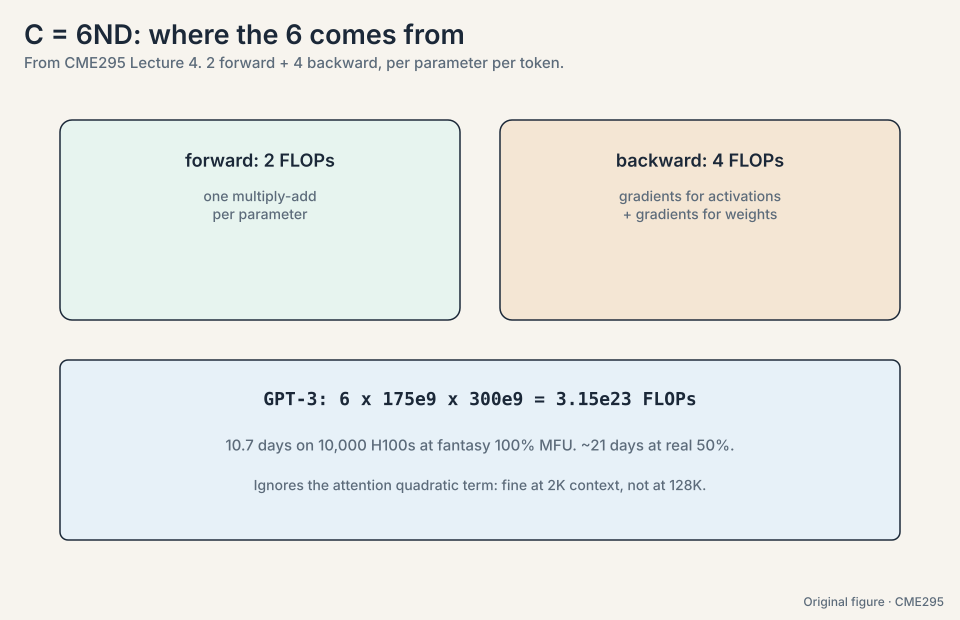
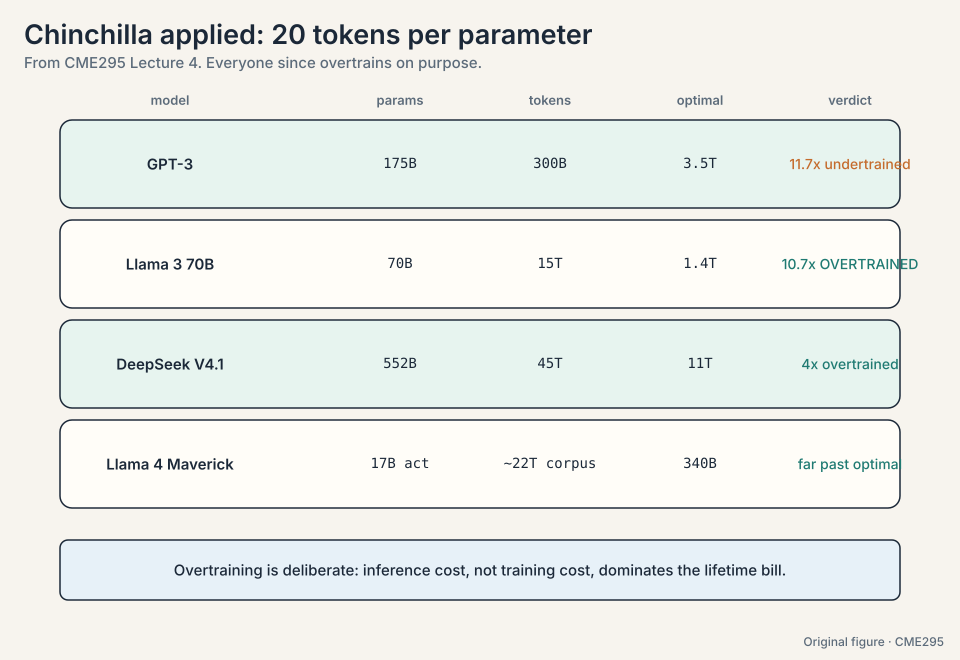
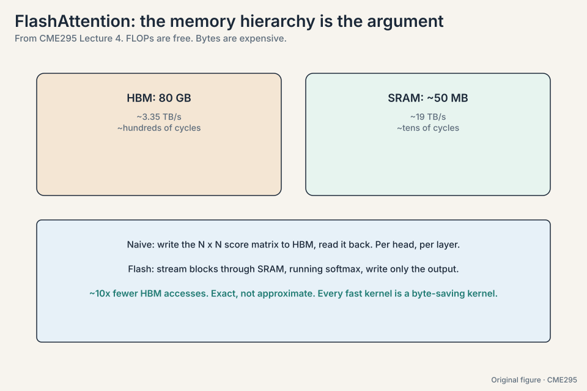
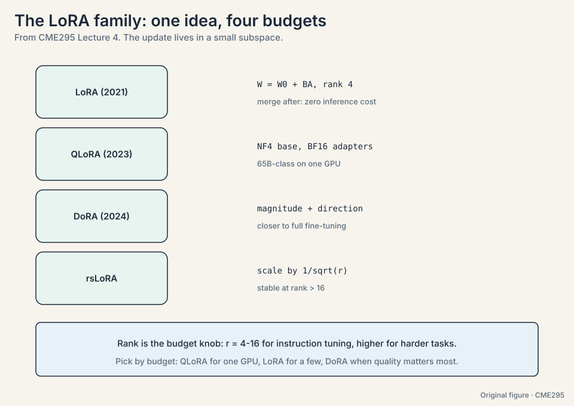

## The problem: train once or train per task

Suppose you need a model that answers washer-repair questions with a
teddy-bear analogy. The naive route: collect millions of
washer-repair Q&A pairs and train from scratch. The cheaper route,
and the one the whole industry uses, is **transfer learning**: learn
general structure once on a huge corpus, then specialize cheaply.
Three stages:

1. **Pre-training.** Next-token prediction on trillions of tokens.
   Teaches the structure of language and code. The most expensive
   step by far.
2. **Supervised fine-tuning (SFT).** Input-output pairs teach the
   desired behavior. Cheap relative to pre-training.
3. **Preference tuning.** Human preferences shape tone and safety.
   This is Lecture 5.

The bet is that stage 1 does the heavy lifting and stages 2 and 3
only redirect it. The rest of this chapter prices that bet.

## The key question

Training is a budget measured in FLOPs and dollars. Given a fixed
budget, how do you split it between model size and data, and how do
you fit the run onto real hardware?

## Pre-training eats the internet

**Common Crawl**
([12:03](https://www.youtube.com/watch?v=VlA_jt_3Qc4&t=723s)), a
crawl of roughly 3 billion pages per month, is the canonical raw
source. Scale grew fast: GPT-3 trained on 300 billion tokens. Llama 3
on 15 trillion. A frontier pre-training run costs millions to
hundreds of millions of dollars.

Three consequences follow. First, the **knowledge cutoff**: the model
knows nothing past its training data (the lecture cites GPT-5's
cutoff as September 30
[24:28](https://www.youtube.com/watch?v=VlA_jt_3Qc4&t=1468s), as
stated in the lecture [uncertain: year given as 2024 in Lecture 7]).
Second, **knowledge editing is hard**: changing what a trained model
"knows" without regressions is an unsolved problem. Third,
**plagiarism risk**
([23:54](https://www.youtube.com/watch?v=VlA_jt_3Qc4&t=1434s)): the
model memorizes training text and can reproduce it.

### Subchapter: the token count ladder

Token counts, era by era:

```ascii
GPT-3 (2020):        300B tokens
Llama 3 (2024):      15T tokens      (50x GPT-3)
DeepSeek V4.1 (2026): 45T tokens     (150x GPT-3)
```

Fifteen trillion tokens is roughly every public book, paper, and
web page several times over, filtered and deduplicated. The growth
is not "more of the same": each jump forced new curation (quality
filters, dedup, domain reweighting) because raw web text at that
scale is mostly noise. The interview point: data scale is a
pipeline achievement, not a download.

### Subchapter: curation beats quantity

Raw Common Crawl is mostly boilerplate, spam, and duplicates. The
curation stack: language ID (keep the languages you want),
quality classifiers (trained on "good" text like Wikipedia and
books), exact and fuzzy dedup (the same article copied 10,000
times teaches nothing the second time), and domain reweighting
(more code, more math, less SEO spam). Llama 3's 15T tokens are
15T *after* filtering, from a far larger raw crawl. The decision
rule: a smaller, cleaner corpus beats a larger, dirtier one. The
Chinchilla-optimal model on dirty data is still a dirty model.


## How much work is a training run: FLOPs vs FLOPS

Notation first
([13:49](https://www.youtube.com/watch?v=VlA_jt_3Qc4&t=829s)).
**FLOPs** (lowercase s) counts floating-point operations: the total
work. **FLOPS** (uppercase S) counts operations per second: the
machine's rate. Training time is roughly FLOPs divided by FLOPS,
times hardware efficiency. The lecture's reference GPU is the H100
with 80GB
([30:17](https://www.youtube.com/watch?v=VlA_jt_3Qc4&t=1817s)), quoted
at about 34 TFLOPS in FP64 [uncertain: figure as stated in the
lecture].

Now price GPT-3 on the back of an envelope. The standard estimate:
about 6 FLOPs per parameter per token (forward plus backward pass).

```ascii
params = 175B,  tokens = 300B
total FLOPs = 6 * 175e9 * 300e9 = 3.15e23

one GPU at 34 TFLOPS:  3.15e23 / 3.4e13 = 9.3e9 seconds = 294 years
10,000 GPUs:          294 years / 10,000 = 10.7 days (at 100% efficiency)
```

Two lessons. First, frontier training is a distributed-systems
project: no single GPU finishes in a human lifetime. Second,
efficiency is everything: communication between GPUs, memory
bandwidth limits, and recomputation all waste FLOPS. Real
utilization is a fraction of peak, which is why systems work like
FlashAttention exists.


### Subchapter: the 6ND rule, where the 6 comes from

The estimate C = 6ND (N parameters, D tokens) breaks down per
token. Forward pass: each parameter participates in one
multiply-add = 2 FLOPs per parameter. Backward pass: roughly twice
the forward (gradients for activations and for weights) = 4 FLOPs
per parameter. Total: 2 + 4 = 6 FLOPs per parameter per token.
For GPT-3: 6 * 175e9 * 300e9 = 3.15e23. The rule is approximate:
it ignores attention's quadratic term (small for typical lengths)
and embeddings (small). For very long contexts the attention term
stops being negligible and 6 becomes an underestimate. The
interview line: "6 is 2 forward plus 4 backward."

### Subchapter: MFU, why 100% never happens

**MFU** (model FLOPs utilization) is achieved FLOPS over peak
FLOPS. The 10.7-day GPT-3 estimate assumed 100% MFU. Real runs get
30-60%. The losses: communication between GPUs (all-reduce on
every step), memory bandwidth stalls (the weights must stream),
pipeline bubbles (stages idle), and recomputation (some
activations are recomputed, not stored). 50% MFU doubles the
10.7 days to 21.4. Every systems paper in this chapter is an MFU
recovery project: FlashAttention recovers memory-stall MFU, ZeRO
recovers fit-it-at-all, better networks recover communication MFU.



> [!QA]
> Q: Walk me through the GPT-3 training cost estimate, start to finish.
> A: Parameters N = 175B, tokens D = 300B. Rule: 6 FLOPs per
> parameter per token (2 forward, 4 backward). Total = 6 * 175e9
> * 300e9 = 3.15e23 FLOPs. One H100 at 34 TFLOPS: 3.15e23 /
> 3.4e13 = 9.3e9 seconds = 294 years. On 10,000 GPUs: 294 / 10,000
> years = 10.7 days at 100% efficiency. At 50% MFU: 21.4 days.
> The three numbers to memorize: 6, 3.15e23, and "weeks on ten
> thousand GPUs".
> Follow-up: What does the estimate miss?
> A: The attention quadratic term (negligible at 2K context,
> material at 128K), communication overhead, and the fact that
> nobody gets 100% MFU. It is an order-of-magnitude tool, not an
> invoice.

> [!QA]
> Q: Why do interviews probe the FLOPs/FLOPS distinction?
> A: Because it separates people who memorized numbers from people
> who can estimate. Given a model size and token count you can
> estimate training FLOPs (about 6 per parameter per token). Given a
> GPU's FLOPS you can estimate wall-clock time. The distinction is
> the whole estimation.
> Follow-up: What breaks the simple division?
> A: Efficiency. Communication between GPUs, memory bandwidth
> limits, and recomputation all waste FLOPS. Real utilization is a
> fraction of peak, which is why systems work like FlashAttention
> exists.

## The problem: where should the compute go

Bigger models on more data get better, following smooth **power
laws**: loss falls as model size, dataset size, and compute grow.
**Kaplan et al. (2020)** mapped those curves. But the curves leave a
budget question open: given fixed compute, how do you split it
between parameters and tokens? More of a big model, or more data for
a smaller one?

**Chinchilla (2022)** answered the split: about **20 tokens per
parameter** is compute-optimal
([19:41](https://www.youtube.com/watch?v=VlA_jt_3Qc4&t=1181s)). Work
the rule on GPT-3:

```ascii
GPT-3: 175B params. Optimal tokens = 20 * 175B = 3.5T.
Actual tokens: 300B. Shortfall: 3.5T / 300B = 11.7x.
Verdict: undertrained. Too big for its data.
```

The rule of thumb: tokens >= 20 x parameters. A 100B-parameter model
wants at least 2T tokens. Training a bigger model on the same data
wastes the budget. Training a smaller model on more data wins.

### Subchapter: Kaplan's three curves

Kaplan et al. (2020) fitted power laws on three axes separately:

```ascii
loss ~ N^(-0.076)   (parameters, holding data and compute fixed)
loss ~ D^(-0.095)   (data, holding the rest fixed)
loss ~ C^(-0.050)   (compute, optimally split)
```

Loss falls smoothly as each grows: no phase transitions, no
cliffs. The practical reading: double the compute, loss drops by a
predictable few percent. The curves also say size matters more
than shape: depth vs width, attention variants, and other
architectural choices move loss far less than scale does. This is
why the field scaled first and tuned later. The caveat: Kaplan's
optimal split favored bigger models on less data. Chinchilla
corrected it.

### Subchapter: Chinchilla applied to four models

Apply tokens >= 20 x params:

```ascii
GPT-3:       175B params, 300B tokens.  Optimal: 3.5T.  11.7x undertrained.
Llama 3 70B:  70B params, 15T tokens.   Optimal: 1.4T.  10.7x OVERTRAINED.
Llama 4 Maverick: 17B active, ~22T tokens (reported corpus). Well past optimal.
DeepSeek V4.1: 552B params, 45T tokens. Optimal: 11T.  4x overtrained.
```

Post-Chinchilla practice deliberately overtrains: smaller models
on more data, because inference cost (not training cost) dominates
a model's lifetime bill. A 70B model trained on 15T tokens costs
more to train than Chinchilla-optimal but costs the same to serve
as any 70B model, and it is smarter per parameter. The decision
rule changed from "train compute-optimal" to "train for the
inference budget you will live with".




> [!QA]
> Q: You have a fixed compute budget. How do you split it between model size and data?
> A: Start from Chinchilla: tokens ~= 20 x parameters. If the
> model will be served heavily, overtrain deliberately: pick the
> model size your inference budget allows, then spend the rest on
> data (Llama 3 70B on 15T tokens is 10.7x past optimal, on
> purpose). If it is a research run served rarely, stay near
> 20x. The interview signal: name both regimes and say which
> budget binds.
> Follow-up: Why did Kaplan and Chinchilla disagree?
> A: Kaplan fitted each axis separately and extrapolated the
> compute-optimal point from small runs. Chinchilla ran the
> isoFLOP experiments directly: fix compute, try many (N, D)
> splits, measure. Direct measurement beat extrapolation. The
> lesson generalizes: fit curves, but verify with isoFLOP runs.

## The problem: no single GPU holds the run

The GPT-3 estimate needed 10,000 GPUs even at fantasy efficiency.
Now count what one GPU must hold. Adam, the standard optimizer,
keeps two extra numbers per parameter (momentum and variance), in
FP32:

```ascii
175B params, mixed precision:
  parameters (FP16):        2 bytes * 175B = 350 GB
  gradients (FP16):         2 bytes * 175B = 350 GB
  optimizer states (FP32):  8 bytes * 175B = 1.4 TB
  total per replica: ~2.1 TB. An H100 holds 80 GB.
```

No single GPU comes close. Four strategies divide the work:

- **Data parallelism.** Each GPU holds the full model and processes
  a different data shard. Gradients average across workers. Simple,
  but every GPU must fit the whole 2.1 TB replica.
- **ZeRO** ([33:54](https://www.youtube.com/watch?v=VlA_jt_3Qc4&t=2034s),
  zero redundancy optimization). Shard what data parallelism
  replicates: ZeRO-1 shards the 1.4 TB of optimizer states, ZeRO-2
  adds the 350 GB of gradients, ZeRO-3 shards the parameters too
  ([35:07](https://www.youtube.com/watch?v=VlA_jt_3Qc4&t=2107s)).
  With W workers, each holds roughly 2.1 TB / W. Bigger models fit.
  Communication rises.
- **Tensor parallelism**
  ([36:45](https://www.youtube.com/watch?v=VlA_jt_3Qc4&t=2205s)).
  Split individual layers across GPUs. One forward pass involves
  many GPUs.
- **Pipeline parallelism**
  ([37:00](https://www.youtube.com/watch?v=VlA_jt_3Qc4&t=2220s)).
  Split layers into stages. Micro-batches flow through. The cost:
  **pipeline bubbles**. With 4 stages and 1 micro-batch, stages 2-4
  idle while stage 1 works: 3/4 of the hardware waits. More
  micro-batches shrink the bubble.

### Subchapter: ZeRO stages, counted

The 2.1 TB per-replica budget for 175B params: 350 GB params
(fp16), 350 GB grads (fp16), 1.4 TB optimizer states (fp32). ZeRO
shards each across W workers:

```ascii
ZeRO-1: shard optimizer states only.  Per GPU: 350 + 350 + 1400/W GB.
ZeRO-2: add gradients.                Per GPU: 350 + 1750/W GB.
ZeRO-3: add parameters.               Per GPU: 2100/W GB.
```

At W = 64: ZeRO-1 holds 722 GB per GPU (still too big). ZeRO-3
holds 33 GB per GPU (fits in 80 GB). The price: communication.
ZeRO-3 must all-gather the full parameters before every layer's
forward pass, then discard them. More sharding, more network
traffic, bigger models fit. The decision rule: use the lowest ZeRO
stage that fits. ZeRO-3 when you must, ZeRO-1/2 when you can.

### Subchapter: the pipeline bubble, worked

4 stages, 1 micro-batch: stage 1 works while stages 2-4 idle.
Then stage 2 works while 1, 3, 4 idle. Total: 4 time units, each
stage busy for 1. Utilization: 1/4 = 25%. The bubble is the idle
3/4. With M micro-batches: the pipeline fills (M+3 steps for 4
stages), utilization = M/(M+3). M = 1: 25%. M = 8: 73%. M = 32:
91%. More micro-batches shrink the bubble but shrink each batch's
statistics and add scheduling complexity. Interleaved schedules
(1F1B: one forward, one backward) shrink the bubble further by
overlapping. The interview line: "The bubble is (stages-1) idle
slots per flush. Micro-batches amortize it."

### Subchapter: tensor parallelism's communication

Tensor parallelism splits one layer's matrices across GPUs: GPU 0
holds the left half of W, GPU 1 the right half. Each forward pass
needs both halves' outputs combined: an all-reduce per layer, per
micro-batch, forward and backward. At 96 layers that is ~200
all-reduces per step. The traffic scales with hidden size, not
batch size, so it never amortizes. Consequence: tensor parallelism
stays inside one node (NVLink/NVSwitch: TB/s), never across nodes
(Ethernet/InfiniBand: GB/s). The standard recipe: tensor-parallel
within the node (8 GPUs), data/ZeRO across nodes, pipeline across
stages. The 4D parallelism of modern runs is this recipe, tuned.


> [!QA]
> Q: Which ZeRO stage for a 70B model on 8x80GB GPUs?
> A: Count it. 70B params: 140 GB params (fp16) + 140 GB grads +
> 560 GB optimizer (fp32) = 840 GB per replica. ZeRO-3 shards to
> 105 GB per GPU: too big for 80 GB. Add tensor parallelism (2
> ways): 52 GB per GPU, fits. Or ZeRO-3 with CPU offload for the
> optimizer states: slower, but fits on 8 GPUs alone. The decision
> rule: lowest ZeRO stage that fits, tensor-parallel within the
> node before reaching across it, offload only when GPUs cannot
> be added.
> Follow-up: Why not always ZeRO-3?
> A: Communication. ZeRO-3 all-gathers parameters per layer per
> step. If the model fits under ZeRO-1 or 2, the extra traffic is
> pure overhead. Shard only what you must.

## The problem: attention moves too much memory

Attention's bottleneck is memory movement, not math. A GPU has big
slow memory (**HBM**, where Q, K, V live,
[39:14](https://www.youtube.com/watch?v=VlA_jt_3Qc4&t=2354s)) and
small fast memory (**SRAM**, on-chip,
[39:28](https://www.youtube.com/watch?v=VlA_jt_3Qc4&t=2368s)). Naive
attention shuttles the full N x N score matrix through HBM. At
N = 4,096, that is 16.7M scores per head: 33 MB at 2 bytes each,
read and written repeatedly, per layer, per head.

**FlashAttention** (Stanford, 2022,
[38:35](https://www.youtube.com/watch?v=VlA_jt_3Qc4&t=2315s)) tiles
the computation: load a block of Q, K, V into SRAM, compute that
block's output with a running-softmax trick (track the running max
and sum, never materialize the full matrix), write the block back.
A second idea: **recompute instead of storing**. Throw away
intermediate results and redo the math when needed, because SRAM
compute is cheaper than HBM round-trips. The result is exact, not
approximate, with roughly 10x fewer HBM accesses.

### Subchapter: the running-softmax trick, worked

Softmax needs the max and the sum over the whole row, but the row
never sits in SRAM at once. The trick: process blocks and keep
running statistics. Toy row split into blocks [3, 1] and [2, 0]:

```ascii
block 1: max = 3, sum = exp(3-3) + exp(1-3) = 1 + 0.135 = 1.135
block 2: values [2, 0]. new max = max(3, 2) = 3.
  rescale old sum: 1.135 * exp(3-3) = 1.135
  add block 2: exp(2-3) + exp(0-3) = 0.368 + 0.050 = 0.418
  running sum = 1.553
final softmax: exp(x-3)/1.553 for each x. Exact.
```

When a new block raises the max, the old sum rescales by
exp(old_max - new_max): algebraically identical to computing over
the full row. SRAM holds one block plus two numbers. The N x N
matrix never materializes. Online softmax is the whole trick, and
it generalizes to any reduction over a streamed row.

### Subchapter: HBM vs SRAM, the numbers

The memory hierarchy, one H100:

```ascii
HBM:   80 GB,  ~3.35 TB/s,  ~hundreds of cycles latency
SRAM:  ~50 MB total (per-SM shared), ~19 TB/s, ~tens of cycles
```

Naive attention at N = 4,096 writes the 16.7M-score matrix to HBM
and reads it back, per head, per layer: 33 MB x 2 per head. With
96 heads: ~6 GB of traffic per layer per sequence, most of it the
score matrix. FlashAttention's traffic: Q, K, V in, output out:
~1 MB per head. The ~10x figure is the measured end-to-end HBM
access reduction. The per-head math is far more dramatic. The
general principle: on modern GPUs, FLOPs are free and bytes are
expensive. Every fast kernel is a byte-saving kernel.




> [!QA]
> Q: Walk me through FlashAttention on one attention head, start to finish.
> A: Goal: exact softmax(QK^T/sqrt(d))V without the N x N matrix.
> Split Q into blocks that fit SRAM. For each Q block: stream K, V
> blocks through SRAM. For each pair of blocks, compute the block
> score matrix, and update the running output with the online
> softmax: track the running row max and the running sum,
> rescaling the old sum by exp(old_max - new_max) when the max
> rises. Write the finished output block to HBM. Recompute the
> scores on the backward pass instead of storing them. Same math
> as naive attention, ~10x fewer HBM accesses.
> Follow-up: Why is the backward pass a recompute?
> A: Storing the block scores for backward would put the N x N
> matrix back in HBM, defeating the point. SRAM arithmetic is
> cheap. HBM bytes are expensive. Recompute wins the trade.

> [!QA]
> Q: Why is recomputing ever faster than storing?
> A: Because the memory hierarchy is lopsided. An HBM read costs far
> more time and energy than redoing the arithmetic in SRAM. When the
> math is cheap and the data is big, compute is the cheaper
> currency.
> Follow-up: Is FlashAttention an approximation?
> A: No. It computes exact attention. The tiling and the running
> softmax are algebraically equivalent to the naive version. Speed
> comes from memory behavior, not from cutting corners.

## The problem: full precision is expensive

**Quantization** stores numbers in fewer bits: FP64 to FP32 to
FP16/BF16 to INT8
([53:11](https://www.youtube.com/watch?v=VlA_jt_3Qc4&t=3191s)). Count
it on the 70B model: FP16 is 140 GB. INT8 is 70 GB. Half the memory,
faster math, some precision cost.

The standard compromise is **mixed precision**: keep weights in
FP32, do the compute in FP16
([56:53](https://www.youtube.com/watch?v=VlA_jt_3Qc4&t=3413s)). The
master weights stay precise. The arithmetic runs fast. Loss scaling
keeps small gradients representable in FP16's narrow range.

### Subchapter: the quantization ladder, counted

The 70B model, one weight at a time:

```ascii
FP32: 4 bytes x 70B = 280 GB
FP16/BF16: 2 bytes x 70B = 140 GB
INT8:  1 byte  x 70B = 70 GB
INT4:  0.5 byte x 70B = 35 GB
NF4 (QLoRA): ~0.5 byte x 70B = ~35 GB plus quantization constants
```

Each rung halves the memory and narrows the representable range.
INT8 works well for weights with per-channel scales. INT4 needs
careful calibration (GPTQ, AWQ) or quality drops on hard tasks.
The rule: quantize weights aggressively, keep activations wider.
Weights are static and calibratable. Activations vary per input
and punish coarse bins. KV cache quantization (INT8/FP8) is the
current frontier: the cache, not the weights, is the serving
bottleneck.

### Subchapter: loss scaling in mixed precision

FP16 represents down to ~6e-8. Gradients in deep networks routinely
fall below that: they underflow to zero and training stalls. Loss
scaling multiplies the loss by S (e.g. 2^16) before backward: all
gradients scale up by S, representable now. Before the optimizer
step, divide back by S. If any gradient overflows to inf (FP16 max
is 65504), skip the step and shrink S. Dynamic loss scaling
automates the dance. BF16 avoids most of this: same exponent range
as FP32, so no scaling needed, at the cost of fewer mantissa bits.
Modern runs use BF16 and skip the scaling machinery.


## SFT: the completer becomes an assistant

Pre-training produces a completer, not an assistant: it continues
text, it does not follow instructions. SFT teaches behavior with
input-output pairs. The key detail: **loss applies to output tokens
only**. The prompt is context. The model is graded on its answer.

The lecture's example is a washer repair question answered with a
teddy-bear analogy: the facts come from pre-training, the helpful
format comes from SFT. The data mixture matters: instructions,
safety examples, hedging ("I am not sure, but..."), multi-turn
dialogue. Scale grew with the field: GPT-3-era SFT used about 13K
examples. Llama-3-era used about 10M
([78:02](https://www.youtube.com/watch?v=VlA_jt_3Qc4&t=4682s)).
Quality beats quantity, but quantity grew anyway.

An emerging middle stage sits between pre-training and SFT:
**mid-training** on a large but higher-quality corpus, a bridge from
raw web text to instruction data. Lecture 9 returns to it.


### Subchapter: the SFT loss mask, worked

A training example: prompt (20 tokens) + answer (30 tokens) = 50
tokens. The model runs forward on all 50, producing 50 logit
vectors. The loss mask zeroes the first 20: only the 30 answer
positions contribute. Why: the prompt is given, not generated.
Training the model to predict the prompt teaches it to hallucinate
questions. The mask is a per-position 0/1 multiplied into the
loss. In multi-turn dialogue the mask is finer: user turns masked,
assistant turns trained, per turn. One implementation bug to know:
forgetting the mask trains the model on its own prompts and
measurably degrades instruction-following.

### Subchapter: the data mixture, by era

SFT datasets grew and specialized:

```ascii
InstructGPT era (2022): ~13K human-written demonstrations
Llama 2 era (2023):     tens of thousands, plus RLHF
Llama 3 era (2024):     ~10M examples, heavily synthetic
2026 frontier:          tens of millions, multi-turn, tool-use, reasoning chains
```

The mixture matters more than the size: instructions, safety
refusals, hedging ("I am not sure, but..."), multi-turn repair,
domain coverage. Too much of one flavor and the model overfits the
flavor: all-refusal data makes a model that refuses everything.
Quality beats quantity, but the frontier does both.

## The problem: full fine-tuning is heavy

Full fine-tuning updates every weight: expensive in memory
(optimizer states for billions of parameters) and storage (a full
copy per task). **LoRA**
([97:56](https://www.youtube.com/watch?v=VlA_jt_3Qc4&t=5876s))
freezes the base weights W0 and trains a low-rank delta:

**W = W0 + BA**

Count the parameters. A 4096 x 4096 weight matrix has 16.7M
parameters. With rank r = 4, B is 4096 x 4 and A is 4 x 4096: 32,768
parameters. That is 512x fewer. In practice LoRA wants about 10x the
learning rate of full fine-tuning, and adapting the FFN blocks helps
most ([98:20](https://www.youtube.com/watch?v=VlA_jt_3Qc4&t=5900s)).

**QLoRA** pushes further: quantize the frozen base to 4-bit
NormalFloat (NF4,
[106:09](https://www.youtube.com/watch?v=VlA_jt_3Qc4&t=6369s)), keep
the adapters in BF16, and quantize the quantization constants
themselves (**double quantization**,
[106:33](https://www.youtube.com/watch?v=VlA_jt_3Qc4&t=6393s)).
Roughly 16x less VRAM: fine-tune a 65B-class model on a single GPU.

### Subchapter: the rank-r formula, general

For a d x k weight matrix, LoRA trains B (d x r) and A (r x k):
params = r(d + k). The ratio to full fine-tuning: r(d+k)/(dk).
On square 4096 blocks with r = 4: 4*8192/16.7M = 1/512. On the
70B model's 8192-wide blocks with r = 8: 8*16384/67M = 1/512
again. The ratio depends on r/d, not on model size: r = 4 on
4096-wide blocks is always ~1/512 of the block. Rank is the
budget knob: r = 1 trains almost nothing, r = 64 approaches full
fine-tuning cost. The empirical sweet spot for instruction
tuning: r = 4 to 16. The interview line: "LoRA's savings are
relative, not absolute: 1/512 of whatever block you adapt."

### Subchapter: the LoRA family

- **LoRA** (2021): the original. W = W0 + BA. Merge BA into W0
  after training: zero inference overhead.
- **QLoRA** (2023): NF4-frozen base, BF16 adapters, double
  quantization. ~16x less VRAM. The single-GPU fine-tuning
  standard.
- **DoRA** (2024): decompose the update into magnitude and
  direction, train both. Closer to full fine-tuning on hard
  tasks, slightly more cost.
- **rsLoRA** (rank-stabilized): scale the adapter output by
  1/sqrt(r) instead of 1/r, so higher ranks stay stable. Use it
  when r > 16.

The family shares one idea: the update lives in a small subspace.
Pick by budget: QLoRA for one GPU, LoRA for a few, DoRA when
quality matters most.




> [!QA]
> Q: What rank for LoRA on a 7B instruction-tuning task?
> A: Start at r = 8. The math: on 4096-wide blocks, r = 8 trains
> 1/256 of the block's params. Instruction tuning redirects
> behavior, which lives in a low-dimensional subspace: r = 4-16
> covers it empirically. If evals plateau, raise to 16 or 32
> before blaming the data. If you need r = 64+, the task probably
> needs new knowledge, not redirection: consider full fine-tuning
> or more pre-training.
> Follow-up: Which modules do you adapt?
> A: Attention projections (q, v) at minimum. Add the FFN (gate,
> up, down) when quality matters. The lecture notes FFN blocks
> help most. Adapting everything costs more and rarely pays.

> [!QA]
> Q: Why does a rank-4 update work on a billion-parameter model?
> A: Fine-tuning mostly steers behavior, not knowledge. The needed
> change has low intrinsic dimension: a few directions in weight
> space capture "answer in this format" or "follow these
> instructions". The base model already knows the facts. The delta
> only redirects them.
> Follow-up: When is LoRA the wrong choice?
> A: When the task needs genuinely new capabilities or knowledge,
> not just redirection. Deep domain adaptation and large
> distribution shifts still favor full fine-tuning, or more
> pre-training.

## The problem: benchmarks mislead

SFT and scale need measuring, but benchmarks mislead. Three the
lecture names:

- **MMLU**
  ([87:00](https://www.youtube.com/watch?v=VlA_jt_3Qc4&t=5220s)):
  about 50 academic tasks, multiple choice. Broad knowledge.
- **GSM-8K**
  ([87:49](https://www.youtube.com/watch?v=VlA_jt_3Qc4&t=5269s)):
  grade-school math word problems. Reasoning with exact answers.
- **Chatbot Arena**
  ([91:11](https://www.youtube.com/watch?v=VlA_jt_3Qc4&t=5471s)):
  pairwise human votes on open chat. Captures vibes. Brittle and
  riggable.

The trap has a name: "training on the test task". Optimizing the
benchmark is not the same as improving the model. Lecture 8 is the
full treatment.

### Subchapter: contamination, how benchmarks leak

Benchmarks leak into training data three ways. **Direct
inclusion**: the benchmark's test set sits in the pre-training
corpus (Common Crawl contains everything). **Paraphrase
inclusion**: reworded versions of test questions appear in
training. **Distillation leakage**: a teacher model trained on the
benchmark distills its knowledge into the student. Defenses:
canary strings (unique hashes embedded in the benchmark, searched
for in training data), blocklists, and fresh test sets written
after the model's cutoff. The honest reading: any benchmark older
than the model's training data is suspect. Trust benchmarks with
post-cutoff test sets and contamination reports. The rest are
directional, not decisive.


## Mapping back: each stage answers a cost problem

| Cost problem | Answer | The number |
|---|---|---|
| Training per task from scratch | Transfer learning | Pre-train once on trillions of tokens. SFT cheaply per task |
| How much work is a run | FLOPs vs FLOPS | GPT-3: 3.15e23 FLOPs. 294 GPU-years at 34 TFLOPS |
| How to split the budget | Chinchilla | 20 tokens per parameter. GPT-3 was 11.7x undertrained |
| 2.1 TB does not fit 80 GB | ZeRO / tensor / pipeline | ZeRO-3 shards to ~2.1 TB / W per GPU |
| Attention drowns HBM | FlashAttention | ~10x fewer HBM accesses. Exact, not approximate |
| Precision costs memory | Mixed precision, quantization | FP16 compute with FP32 masters. INT8 halves the model |
| Completer, not assistant | SFT | Loss on output tokens only. Mixture teaches format |
| Full fine-tuning per task | LoRA / QLoRA | Rank-4 delta: 512x fewer params. QLoRA: ~16x less VRAM |

## The honest price

The whole chapter is a list of prices. Pre-training buys knowledge
and pays millions plus a knowledge cutoff, un-editable weights, and
memorized text. Chinchilla-optimal training buys efficiency and pays
in smaller models: the biggest model is not always the right model.
Parallelism buys scale and pays in communication and bubbles.
FlashAttention buys speed and pays in kernel complexity.
Quantization buys memory and pays in precision. SFT buys behavior
and pays in the risk of training on the test task. LoRA buys cheap
adaptation and pays in a low-rank ceiling: redirection, not new
knowledge.

## Recap: the whole lesson on one screen

The story in eight steps. Each step answers the one before it.

1. **Train once, specialize cheaply.** Transfer learning: pre-train
   on trillions of tokens, SFT for behavior, preference tuning for
   taste. The bet is that stage 1 does the heavy lifting.
2. **Pre-training eats the internet.** Common Crawl at ~3B
   pages/month. GPT-3: 300B tokens. Llama 3: 15T. Millions to
   hundreds of millions of dollars. Cutoff, editing hardness, and
   plagiarism follow.
3. **FLOPs is work, FLOPS is rate.** GPT-3: 6 * 175B * 300B =
   3.15e23 FLOPs. At 34 TFLOPS: 294 GPU-years, or 10.7 days on
   10,000 GPUs at fantasy efficiency. Estimation starts here.
4. **Chinchilla: 20 tokens per parameter.** GPT-3 needed 3.5T
   tokens and got 300B: undertrained by 11.7x. Tokens >= 20x params
   is the rule of thumb.
5. **Split the work.** Adam states alone are 1.4 TB for 175B
   params. ZeRO shards optimizer, gradients, params. Tensor splits
   layers. Pipeline splits stages and pays bubbles.
6. **Respect the memory hierarchy.** FlashAttention tiles to SRAM,
   uses a running softmax, recomputes instead of re-reading HBM.
   Exact, ~10x fewer HBM accesses.
7. **SFT teaches format, not facts.** Loss on output tokens only.
   13K examples then, ~10M now. Quality beats quantity.
8. **LoRA: freeze the giant, train the delta.** W = W0 + BA at rank
   4: 512x fewer params on a 4096 x 4096 block. QLoRA adds NF4 plus
   double quantization: ~16x less VRAM, 65B-class fine-tuning on
   one GPU.

## Go deeper

<div style="position:relative;padding-bottom:56.25%;height:0;overflow:hidden;max-width:100%;margin:16px 0;">
<iframe style="position:absolute;top:0;left:0;width:100%;height:100%;" src="https://www.youtube-nocookie.com/embed/VlA_jt_3Qc4" title="CME295 Lecture 4, Autumn 2025" frameborder="0" allow="accelerometer; autoplay; clipboard-write; encrypted-media; gyroscope; picture-in-picture" allowfullscreen></iframe>
</div>

<div style="position:relative;padding-bottom:56.25%;height:0;overflow:hidden;max-width:100%;margin:16px 0;">
<iframe style="position:absolute;top:0;left:0;width:100%;height:100%;" src="https://www.youtube-nocookie.com/embed/l8pRSuU81PU" title="Let's reproduce GPT-2 (124M) (Karpathy)" frameborder="0" allow="accelerometer; autoplay; clipboard-write; encrypted-media; gyroscope; picture-in-picture" allowfullscreen></iframe>
</div>

- Lecture 4 recording: https://www.youtube.com/watch?v=VlA_jt_3Qc4
- Karpathy, "Let us reproduce GPT-2 (124M)" (training at scale, end to end): https://www.youtube.com/watch?v=l8pRSuU81PU
- Hoffmann et al., Chinchilla: https://arxiv.org/abs/2203.15556
- Dao et al., FlashAttention: https://arxiv.org/abs/2205.14135
- Hu et al., LoRA: https://arxiv.org/abs/2106.09685
- Dettmers et al., QLoRA: https://arxiv.org/abs/2305.14314

## Official sources and further reading

**Official:**
- Lecture 4 recording (YouTube): timestamped above.
- Lecture 4 slides (PDF), CME295 Autumn 2025.
- Kaplan et al., "Scaling Laws for Neural Language Models" (2020): [paper](https://arxiv.org/abs/2001.08361)
- Hoffmann et al., "Chinchilla" (2022): [paper](https://arxiv.org/abs/2203.15556)
- Dao et al., "FlashAttention" (2022): [paper](https://arxiv.org/abs/2205.14135)
- Hu et al., "LoRA" (2021): https://arxiv.org/abs/2106.09685

**Further reading:**
- Dettmers et al., "QLoRA" (2023): NF4 and double quantization.
- Rajbhandari et al., "ZeRO" (2020): sharded training.
- Hendrycks et al., "MMLU" (2020).
- Cobbe et al., "GSM-8K" (2021).

**Caveats from these sources.** The H100 FP64 figure is as stated
live [uncertain]. GPT-5's cutoff date is as stated in the lecture.
Model cards move. The "13K vs 10M" SFT figures are era
illustrations, not exact dataset sizes. Mid-training is presented as
emerging practice, not settled method.

## Connections to the other courses

- **CS336 L09/L11:** scaling laws derived in full, including the
  post-Chinchilla debate.
- **CS336 L05-L08:** GPUs, Triton kernels, parallelism, 4D
  parallelism: the systems this chapter summarizes.
- **CS336 L13-L14:** training data and data pipelines: the curation
  side of pre-training.
- **CS336 L15:** post-training: SFT practice at the frontier-lab
  level.
- **CS224N L12:** efficient training from the NLP side.
- **CME295 L05:** preference tuning, the third training stage.
