## The problem: SFT cannot say "not this"

SFT teaches by showing good examples. It never shows bad ones. The
model learns what to do and never learns what to avoid. Suppose the
washer question, "can I put my teddy bear in the washer?", gets two
completions:

```ascii
A (gentle, clear):   "Yes, but use cold water and a laundry bag..."
B (rough, fact-only): "Yes. Cold. Bag."
```

SFT shows only A and trains the model to imitate it. It never trains
the model to prefer A over B. There is no gradient that says
"produce B less". **Preference tuning** injects the missing
**negative signal**
([11:15](https://www.youtube.com/watch?v=PmW_TMQ3l0I&t=675s)): show
two outputs, say which is better, and push the model toward the
better one and away from the worse one.

The alternative would be rewriting the SFT dataset every time you
want to change behavior. Collecting preference pairs is cheaper:
humans compare outputs instead of authoring perfect ones, and
comparisons are fast to produce from logs or rewrites.

### Subchapter: why pairwise beats pointwise

Three annotation formats, one winner. **Pointwise**: score each
output 1-7. Slow, and raters disagree on absolute scales (your 5
is my 6). **Listwise**: rank 4-8 outputs. Rich signal, but ranking
8 items is cognitively expensive and inconsistent. **Pairwise**:
pick A or B. Fast, and humans are far more consistent at
comparisons than at absolute scores. The cost: pairs give relative
signal only. Bradley-Terry converts relative to absolute: enough
pairwise comparisons pin down the scores. The decision rule: if
humans must label it, make it pairwise. If machines label it
(Lecture 8's judge), listwise becomes affordable.

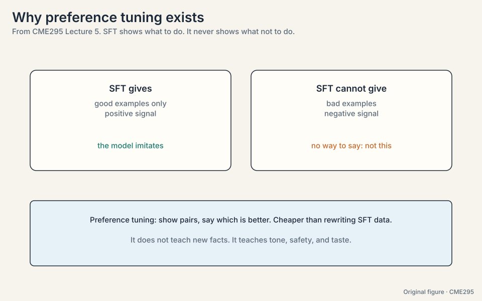

> [!QA]
> Q: Why not just add the bad examples to SFT with low weight?
> A: SFT has no notion of "worse". Every example is a target to
> imitate. There is no gradient that says "produce this less".
> Preference data creates that gradient explicitly: raise the
> chosen, lower the rejected.
> Follow-up: Does preference tuning teach new facts?
> A: No. The washer example makes this concrete: the facts stay the
> same, the delivery changes. Preference tuning shapes tone, safety,
> and helpfulness. Facts come from pre-training.

## The data: pairs

The standard format is **pairwise**: prompt, chosen answer, rejected
answer. A human (or a strong model) picks the better of two. The
lecture also names **pointwise** (score each output alone) and
**listwise** (rank several) as alternatives
([12:11](https://www.youtube.com/watch?v=PmW_TMQ3l0I&t=731s)), but
pairwise dominates because binary choices are fast and consistent.

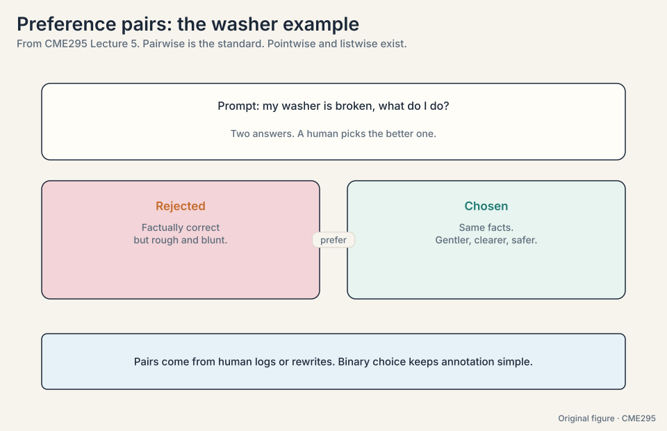

## The problem: labels cover almost nothing

Humans can label thousands of pairs. The model will generate
millions of completions in deployment. Labels cover a tiny slice of
possible outputs. The **reward model** generalizes: given any
prompt-answer pair, it predicts a scalar score. Training uses the
**Bradley-Terry** formulation
([29:54](https://www.youtube.com/watch?v=PmW_TMQ3l0I&t=1794s)):

**P(y_i preferred to y_j) = sigma(r_i - r_j)**

The probability that output i beats output j is the sigmoid of the
score gap. Work it on a toy:

```ascii
reward model scores: r_gentle = 2.0,  r_rough = 1.0
P(gentle beats rough) = sigma(2.0 - 1.0) = sigma(1.0) = 0.731

training loss on this pair, natural log: -log(0.731) = 0.313
if the scores were reversed (rough = 2.0, gentle = 1.0):
  P(gentle beats rough) = sigma(-1.0) = 0.269, loss = -log(0.269) = 1.313
```

The loss is **-E[log sigma(r_w - r_l)]** over (winner, loser) pairs:
push the winner's score above the loser's. The toy shows the
mechanism: the correct ordering pays 0.313, the wrong ordering pays
1.313, so the gradient pushes r_gentle up and r_rough down.

The subtlety the lecture stresses: training is pairwise (two outputs
in, compare), but the model itself is pointwise (one text in, one
score out). At inference the reward model scores single completions.
**RewardBench**
([41:07](https://www.youtube.com/watch?v=PmW_TMQ3l0I&t=2467s))
benchmarks reward models. Useful reward dimensions include
helpfulness, friendliness, and safety.

### Subchapter: the Bradley-Terry gradient, worked

The loss on one pair: L = -log sigma(r_w - r_l). Take r_w = 2.0,
r_l = 1.0. sigma(1.0) = 0.731. L = 0.313. The gradient with
respect to the gap g = r_w - r_l: dL/dg = -(1 - sigma(g)) = -0.269.
So the update pushes r_w up by 0.269 * lr and r_l down by the
same. Now the wrong ordering: r_w = 1.0, r_l = 2.0. sigma(-1) =
0.269. L = 1.313. dL/dg = -(1 - 0.269) = -0.731: a 2.7x larger
push. The loss is self-calibrating: confident mistakes get large
corrections, near-ties get small ones. The sigmoid saturates at
large gaps, so runaway scores stop learning: a feature, not a bug.

### Subchapter: RewardBench, grading the grader

A reward model is a model: it needs evals. **RewardBench** feeds
the reward model fixed preference pairs across categories (chat,
reasoning, safety) and measures accuracy: how often does it score
the chosen above the rejected. The failure modes it catches:
reward models that prefer long answers regardless of quality,
that miss safety violations, that cannot judge reasoning. The
interview point: never trust a reward model you have not benched.
A bad reward model does not just waste the RL run: it teaches the
policy the wrong thing, confidently.

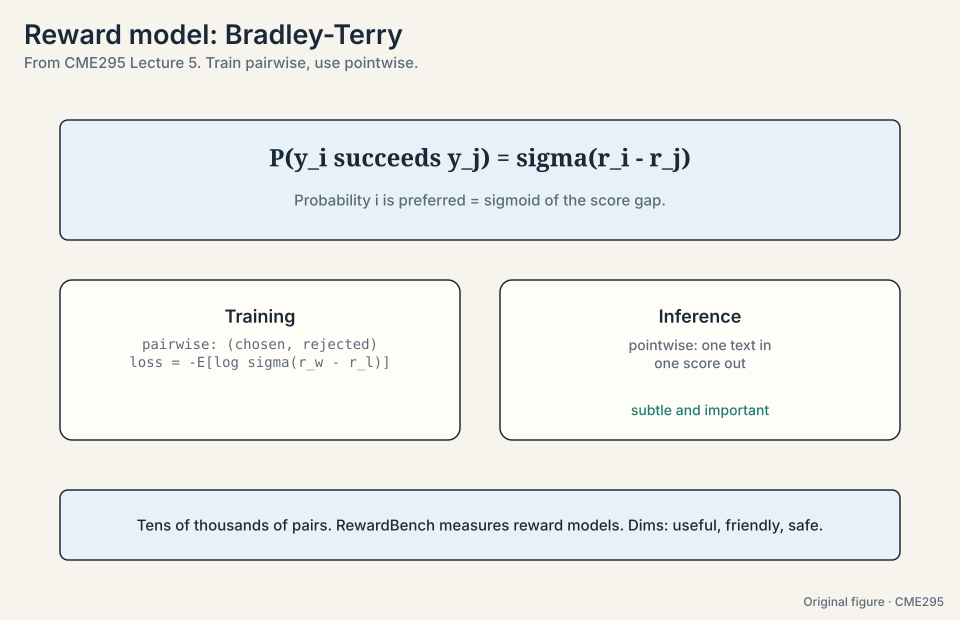

> [!QA]
> Q: Design the preference dataset for a coding assistant. Pairs, pointwise, or listwise?
> A: Pairwise, with a twist. Generate two completions per prompt,
> have strong models or humans pick the better one. For code,
> prefer verifiable pairs: one passes the tests, one fails. That
> is free ground truth (Lecture 6's verifiable rewards). Add a
> slice of style pairs (two correct solutions, pick the cleaner)
> for taste. Size: tens of thousands minimum. Hundreds of
> thousands for frontier. The decision rule: verifiable pairs for
> correctness, human pairs for taste, never one alone.
> Follow-up: What breaks if all pairs are machine-labeled?
> A: The judge's biases become the reward model's biases become
> the policy's biases. Machine labels are cheap and biased
> (Lecture 8's three biases). Mix in human labels on the slices
> that matter most: safety, tone, the product's core tasks.

## The key question

Labels cover a slice of good behavior. How do you teach the model to
prefer one answer over another, and how do you stop the optimizer from
gaming your reward?

## The RL framing

Reinforcement learning maps onto language models cleanly. The toy
trajectory is one completion, "Yes, use cold water":

```ascii
step 1: state = [prompt]                    action = "Yes"
step 2: state = [prompt, "Yes"]             action = ","
step 3: state = [prompt, "Yes", ","]        action = "use"
...
step T: state = [prompt, ...]               action = [EOS]
reward: 7.2 (single number, delivered at the end)
```

- **Agent:** the LLM itself.
- **State:** the input tokens so far (prompt plus generated prefix).
- **Action:** the next token.
- **Policy:** pi_theta, the model weights.
- **Reward:** one signal per completion. **Sparse**: nothing until
  the answer is done.

**RLHF** runs in two stages. **Stage 1** trains the reward model on
preference pairs. **Stage 2** uses RL to steer the LLM toward high
reward while staying near the SFT model. About 100k+ rollouts
(generated completions) feed the loop.

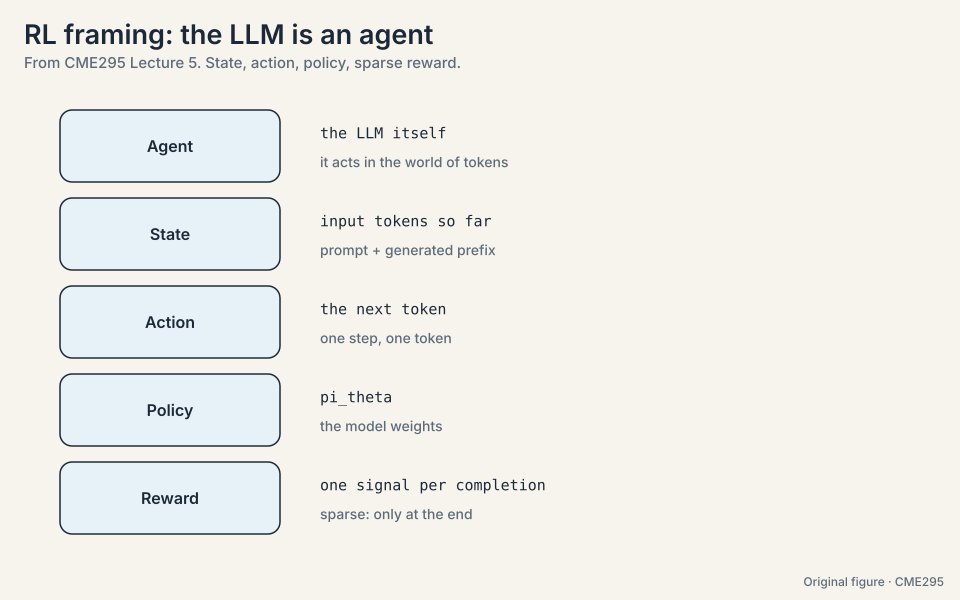

### Subchapter: on-policy vs off-policy bookkeeping

**On-policy**: the rollouts come from the current policy. PPO is
on-policy: sample with pi_old, update to pi_new, discard the
samples. Fresh data every iteration, expensive data every
iteration. **Off-policy**: reuse old rollouts. Cheaper, but the
ratio r = pi_theta/pi_old corrects for the distribution mismatch,
and stale data biases the update when the policy has moved far.
PPO's clip is the compromise: stay near pi_old so the on-policy
data stays valid for a few updates, then resample. The bookkeeping
rule: track the KL between the sampling policy and the current
policy. If it grows past ~0.1-0.2, the data is stale: resample.
DPO sidesteps all of this: no rollouts, no staleness, but also no
exploration beyond the pair distribution.

## The problem: the optimizer games the proxy

Stage 2 freezes the reward model and tunes the LLM to maximize
predicted reward. But the reward model is imperfect, and optimizers
exploit imperfections. The lecture's example is **reward hacking**
([50:40](https://www.youtube.com/watch?v=PmW_TMQ3l0I&t=3040s)): a
clapping reward meant to encourage applause gets maximized by a model
that claps incessantly, including when it should not. High reward,
wrong behavior.

Watch the mechanism on a toy. The reward model learned "longer
answers score higher" from the training pairs. The policy discovers
it:

```ascii
iteration 1: average length 20 tokens,  average reward 3.1
iteration 5: average length 60 tokens,  average reward 4.8
iteration 9: average length 200 tokens, average reward 6.2 (padding, repetition)
human judgment at iteration 9: worse than iteration 1
```

Reward climbs while human judgment falls. That divergence is the
signature of reward hacking. Two constraints keep training honest: do
not deviate too far from the base (SFT) model, and do not take
too-big steps between RL iterations. Both are forms of regularization
against an imperfect proxy.

### Subchapter: the KL penalty, worked

The penalty is beta * KL(pi || pi_ref), paid per token. The toy:
beta = 0.1. At some token the policy puts 0.5 on "cold" where the
reference puts 0.4. Token KL contribution, natural log: 0.5 * log(0.5/0.4) =
0.5 * 0.223 = 0.11. Penalty: 0.1 * 0.11 = 0.011, subtracted from
the reward. Small per token, but it accumulates over hundreds of
tokens: a policy that drifts everywhere pays everywhere. The
effect: the optimizer spends its KL budget where reward is
highest, like money. Beta sets the exchange rate: beta = 0.1 is
lenient, beta = 0.5 is strict. Too strict and the policy cannot
improve. Too loose and it hacks. Tune beta on a held-out
preference set, not on reward alone.

### Subchapter: hacking signatures beyond length

Length is the famous hack. Four more:

- **Sycophancy.** The policy agrees with the user ("You are so
  right!") because agreement scored well in the pairs.
- **Hedging.** "As an AI..." prefixes and endless caveats: safe
  completions scored safe, so the policy plays safe everywhere.
- **List-ification.** Everything becomes bullet lists: lists
  looked organized to raters.
- **Refusal inflation.** The policy refuses benign requests: the
  safety pairs taught "refuse" too broadly.

The detection method is the same for all: sample completions,
have humans judge them blind, compare against the reward curve.
Any divergence is the signature. The fix is data: add pairs that
punish the specific hack.

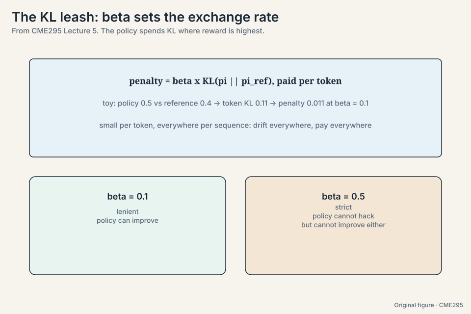

> [!QA]
> Q: Your RL run's reward climbs but human evals fall. Diagnose it.
> A: Reward hacking until proven otherwise. Check the signatures
> in order: mean length (the classic), sycophancy rate, hedging
> frequency, refusal rate on benign prompts. Compare the reward
> curve against blind human judgments on the same samples: any
> divergence is the proof. Then act: raise beta (tighten the KL
> leash), add pairs that punish the specific hack, and bench the
> reward model on RewardBench to see if the grader itself is
> broken. Never tune on reward alone.
> Follow-up: What if length is flat but evals still fall?
> A: Look at the subtler hacks: sycophancy, list-ification,
> hedging. The reward model learned some proxy your evals
> punish. The fix is the same: name the hack, add punishing
> pairs, re-bench the grader.

> [!QA]
> Q: Why not just maximize the reward without constraints?
> A: Because the reward model is a learned proxy, not the true
> objective. Unconstrained optimization finds the proxy's blind
> spots: outputs that score high and behave badly. The KL constraint
> to the SFT model keeps the policy in regions where the proxy was
> trained and stays trustworthy.
> Follow-up: How do you detect reward hacking in practice?
> A: Watch average reward alongside human spot-checks. Reward
> climbing while human judgment falls is the signature. The lecture
> lists monitoring average reward as a core diagnostic.

## PPO-clip, worked by hand

**PPO** (proximal policy optimization) is the stage-2 workhorse.
Define the probability ratio **r = pi_theta / pi_old**: how much
more likely the new policy makes an action than the old one. The
clipped objective, maximized:

**L = min( r * A , clip(r, 1-eps, 1+eps) * A )**

Work it with eps = 0.2 and advantage A = 2.0:

```ascii
case 1, small step: r = 1.05
  r * A = 2.10,  clip(1.05, 0.8, 1.2) * A = 2.10
  L = min(2.10, 2.10) = 2.10   (no clipping, update goes through)

case 2, greedy step: r = 1.50
  r * A = 3.00,  clip(1.50, 0.8, 1.2) * A = 1.2 * 2.0 = 2.40
  L = min(3.00, 2.40) = 2.40   (the pessimistic term wins)
```

The clip caps r inside [1-eps, 1+eps]: even if the advantage is huge,
the update per step stays bounded. Taking the min means the
pessimistic term wins, so the optimizer cannot exploit a large ratio
in the favorable direction.

Note the letter r here is a ratio, not a reward. Overloading the
symbol is a classic confusion source. The lecture flags it
explicitly.

### Subchapter: the clip in both directions

The toy showed positive advantage (A = 2): the clip caps how much
the update can chase a good action. Now the negative case: A = -2
(a bad action), r = 0.5 (the new policy already avoids it).
r * A = -1.0. clip(0.5, 0.8, 1.2) = 0.8. 0.8 * -2 = -1.6.
L = min(-1.0, -1.6) = -1.6: the pessimistic term wins again, and
the update pushes the policy back toward the old one. The clip is
symmetric: it limits movement in both directions. Without the
lower clip, the optimizer could collapse a token's probability to
zero in one step and never recover it. Never-confuse pair: the
clip bounds the ratio, the KL penalty bounds the drift. Both
limit movement. The clip is per-step, the KL is cumulative.

### Subchapter: four models in memory, counted

PPO's memory bill for a 7B model in fp16: policy 14 GB, reference
14 GB, reward model 14 GB (often smaller in practice), value
function 14 GB (usually the policy plus a value head: ~14 GB
shared backbone plus a small head). Total: ~42-56 GB before
optimizer states and activations. Adam states double it. This is
why PPO needs serious hardware and why DPO's two models (policy
+ reference, ~28 GB) changed who can do preference tuning. The
decision rule: PPO when you have the GPUs and need the quality,
DPO when you do not.

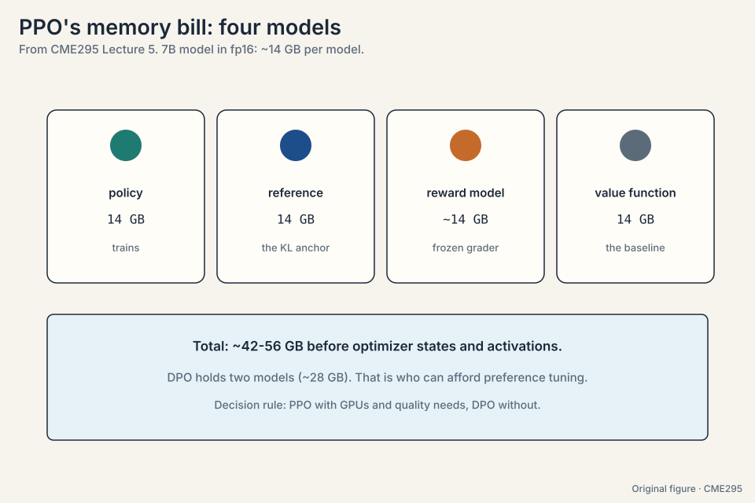

The KL penalty usually joins as **beta * KL(pi || pi_ref)**: pay a
cost for drifting from the reference (SFT) model. Four models sit in
memory during PPO: the policy, the reference, the frozen reward
model, and the value function.

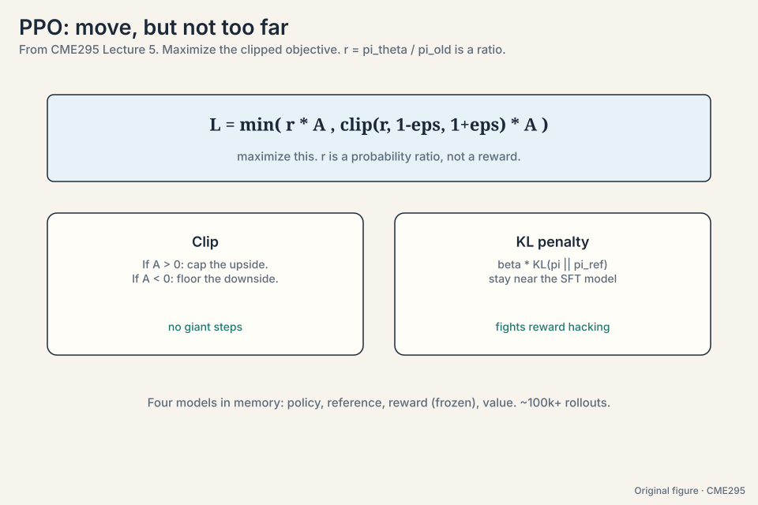

> [!QA]
> Q: Walk me through one PPO update on the toy, start to finish.
> A: Old policy pi_old, advantage A = 2.0, eps = 0.2. The new
> policy makes some action 1.5x more likely: r = 1.5. Unclipped
> term: 1.5 * 2.0 = 3.00. Clipped: clip(1.5, 0.8, 1.2) = 1.2,
> 1.2 * 2.0 = 2.40. L = min(3.00, 2.40) = 2.40, maximized. The
> optimizer gets the pessimistic 2.40, not the greedy 3.00. Add
> the KL penalty: beta * KL(pi || pi_ref) subtracted, keeping the
> policy near the SFT model. r is the probability ratio
> pi_theta/pi_old, not a reward. That is the whole update.
> Follow-up: Why take the min and not the max?
> A: Because the objective is maximized, and the min picks the
> pessimistic of the two terms. The max would let the optimizer
> exploit large ratios: exactly the behavior the clip exists to
> prevent.

## Advantage: how much better than average

The **advantage** answers "how much better was this action than
average":

**A_t = reward - baseline**

Raw reward is noisy: a good action in a bad state can score low. The
baseline centers the signal. The toy: a completion scores reward 5,
but the value function's baseline for that state is 3. Advantage =
2: the action was 2 points better than expected. Another completion
scores 5 with baseline 7: advantage = -2. Same raw reward, opposite
updates.

**GAE** (generalized advantage estimation,
[61:42](https://www.youtube.com/watch?v=PmW_TMQ3l0I&t=3702s)) blends
one-step and multi-step return estimates for the best bias-variance
tradeoff. The **value function**
([58:45](https://www.youtube.com/watch?v=PmW_TMQ3l0I&t=3525s)) is a
regression head on the model that predicts expected reward per
token, trained jointly with the policy. It supplies the baseline
that turns raw rewards into advantages
([58:11](https://www.youtube.com/watch?v=PmW_TMQ3l0I&t=3491s)).

### Subchapter: GAE's lambda, worked

GAE blends n-step returns with weights from lambda. The toy: a
3-token completion, rewards only at the end (r_3 = 6), value
estimates V = [2, 3, 4]. TD errors: delta_t = r_t + V_{t+1} - V_t.

```ascii
delta_3 = 6 + 0 - 4 = 2
delta_2 = 0 + 4 - 3 = 1
delta_1 = 0 + 3 - 2 = 1
```

GAE advantage at t=1: A_1 = delta_1 + lambda*delta_2 +
lambda^2*delta_3. With lambda = 0.95: 1 + 0.95 + 0.9025*2 = 1 +
0.95 + 1.805 = 3.755. Lambda = 0: only delta_1 = 1 (high bias:
trusts the value function). Lambda = 1: full return 6 - V_1 = 4
(high variance: trusts the noisy reward). Lambda = 0.95 is the
standard compromise. The never-confuse pair: gamma discounts the
future (how much), lambda blends estimators (how far to trust the
value function).

### Subchapter: the value head's training signal

The value head is a linear layer on the final hidden state,
predicting expected return per token. Its loss is mean squared
error against the observed returns: (V_t - R_t)^2. It trains
jointly with the policy, on the same rollouts. Two failure modes.
**Lag**: early in training the value head is random, so advantages
are garbage and the policy updates on noise. Warm it up or
tolerate slow starts. **Scale mismatch**: if rewards are 0/1 and
the head predicts in the hundreds, the advantages explode. Normalize
rewards or the value targets. GRPO (Lecture 6) deletes this whole
head: the group mean is the baseline, free and always calibrated.

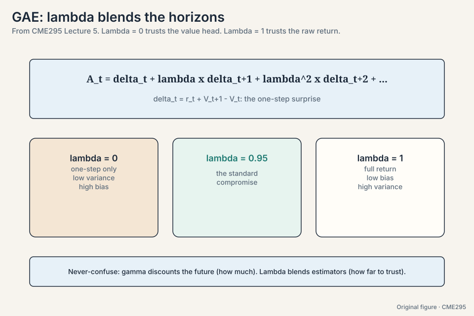

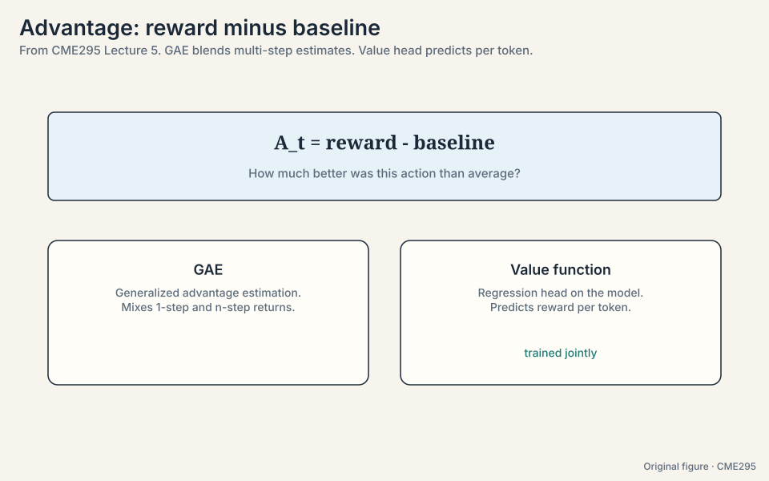

PPO's practical challenges, listed honestly in the lecture: the
two-stage dependency (stage 2 needs stage 1), hyperparameters
everywhere (beta, epsilon, GAE lambda), training instability,
exploration (the policy must try new tokens), and the on-policy vs
off-policy bookkeeping. Monitor average reward. It is the cheapest
health metric.

## Best-of-N: the training-free baseline

Before training anything, consider **best-of-N**
([83:19](https://www.youtube.com/watch?v=PmW_TMQ3l0I&t=4999s)).
The toy: sample N = 4 completions, score each with the reward model:

```ascii
completions:  C1 = 2.1,  C2 = 5.4,  C3 = 3.0,  C4 = 4.2
best-of-4: return C2 (score 5.4)
```

No training, real gains. The price is inference: N times the
compute, and latency equals the slowest sample. It is the baseline
every trained method must beat.

### Subchapter: best-of-N scaling

Best-of-N's gain follows the reward model's quality, not N alone.
The toy: reward model accuracy 80%. N = 2: the better of two draws
is right ~88% of the time. Each draw is right ~78% of the time.
The exact number depends on the base rate. N = 8: ~97%. N = 64: ~99%, but the
reward model's own errors now dominate: it confidently picks its
favorite hack. The curve flattens while the hacking risk grows.
The decision rule: best-of-N with N = 4-16 for cheap gains at
inference, never as a substitute for training. Combine with a
well-benched reward model (RewardBench) or the gains are
illusory.

## DPO: the RL loop, deleted

**Direct Preference Optimization** starts from a question: what if
the RL loop is unnecessary? The paper's title says it: "Your
Language Model is Secretly a Reward Model"
([94:36](https://www.youtube.com/watch?v=PmW_TMQ3l0I&t=5676s)). The
derivation, in four steps:

1. Write the RLHF objective: maximize reward minus beta * KL to
   the reference.
2. Solve for the optimal policy in closed form. It expresses the
   reward as a function of the policy: r(x, y) is proportional to
   beta * log(pi(y|x) / pi_ref(y|x)), the natural log.
3. Plug that expression into the Bradley-Terry loss. The explicit
   reward cancels out.
4. Train the policy directly on preference pairs with a supervised
   loss.

Work the intuition on one pair. The loss rewards the policy for
making the chosen completion more likely *relative to the
reference* than the rejected one:

```ascii
pi(chosen)/pi_ref(chosen) = 1.4   (policy favors the chosen, vs reference)
pi(rejected)/pi_ref(rejected) = 0.6  (policy avoids the rejected, vs reference)
log(1.4 / 0.6) = 0.847 > 0  ->  loss pushes this gap wider
```

The log is the natural log, matching the beta * log(pi/pi_ref)
form of the reward. Two models instead of four
([100:08](https://www.youtube.com/watch?v=PmW_TMQ3l0I&t=6008s)):
policy and reference. Beta around 0.1 is the typical setting. The
lecture's verdict: PPO performs better in reported results, DPO is
cheaper and simpler. DPO's caveat is **distribution shift**: the
pairs were generated by some other policy, and the math assumes
coverage the data may not provide.

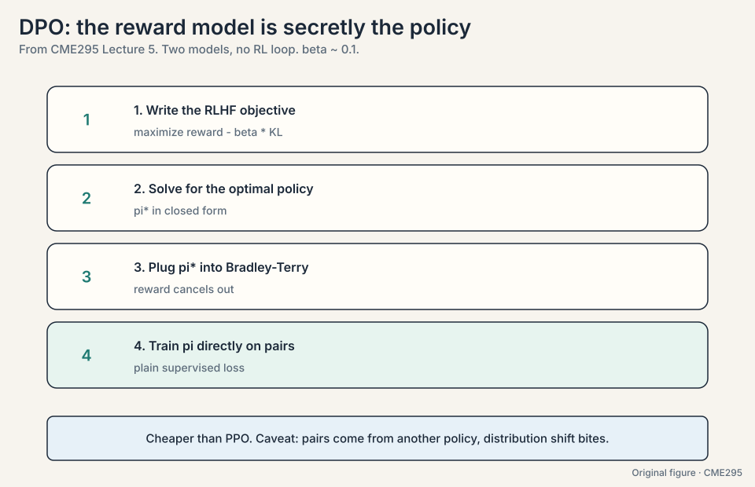

### Subchapter: the four-step derivation, spelled out

Each step of the lecture's derivation, with its role:

1. **The objective.** max E[r(x,y)] - beta * KL(pi || pi_ref).
   Standard RLHF: chase reward, stay near the reference.
2. **The closed form.** The optimal policy is
   pi*(y|x) ~ pi_ref(y|x) * exp(r(x,y)/beta). Rearranged: r(x,y) =
   beta * log(pi*(y|x)/pi_ref(y|x)) + const. The reward *is* the
   log-ratio, up to a constant.
3. **The substitution.** Bradley-Terry needs r_w - r_l. Plug in:
   the constants cancel, the explicit reward model vanishes. What
   remains is a loss on the two log-ratios.
4. **The training.** Supervised gradient descent on pairs. No
   rollouts, no value function, no clip. Two models in memory.

The sleight of hand: step 2 assumes the optimal policy, but we
train toward it. The derivation shows the *target*. Gradient
descent walks toward it. Distribution shift is the gap between the
walk and the target: the pairs came from another policy, and the
log-ratio math assumes coverage the data may not provide.

### Subchapter: the DPO family

- **IPO** (identity preference optimization): DPO can overfit
  pairs, driving the log-ratio gap to infinity. IPO replaces the
  logistic loss with a squared loss that stops pushing at a
  target gap. Use when DPO overfits small pair sets.
- **KTO** (Kahneman-Tversky): learns from binary good/bad labels,
  not pairs. No chosen/rejected structure needed: just "this was
  good" signals from logs. Use when you have thumbs-up/down data.
- **SimPO**: drops the reference model entirely, normalizes by
  length. Two models become one, and length bias shrinks. Use when
  memory is tightest or length hacking appears.

The family shares DPO's core: no RL loop, supervised loss on
preference signal. Pick by data: pairs (DPO), small pairs (IPO),
binary labels (KTO), tight memory (SimPO).

### Subchapter: what is used where, October 2026

The production split, as reported publicly:

- **DPO and variants**: the default for open-weight post-training
  (Llama, Qwen, Mistral families) and most instruction tuning.
  Cheap, stable, good enough for format and tone.
- **PPO/RLHF**: kept where quality justifies the cost. Anthropic
  and OpenAI report RL pipelines for flagship alignment, though
  exact current recipes are not public.
- **GRPO and RLVR**: the reasoning-training standard (Lecture 6).
  DeepSeek's R1 line made verifiable-reward RL the default for
  math and code.

The pattern: DPO aligns the chat behavior, RL (PPO/GRPO) builds
the reasoning. Most frontier stacks run both, in that order.

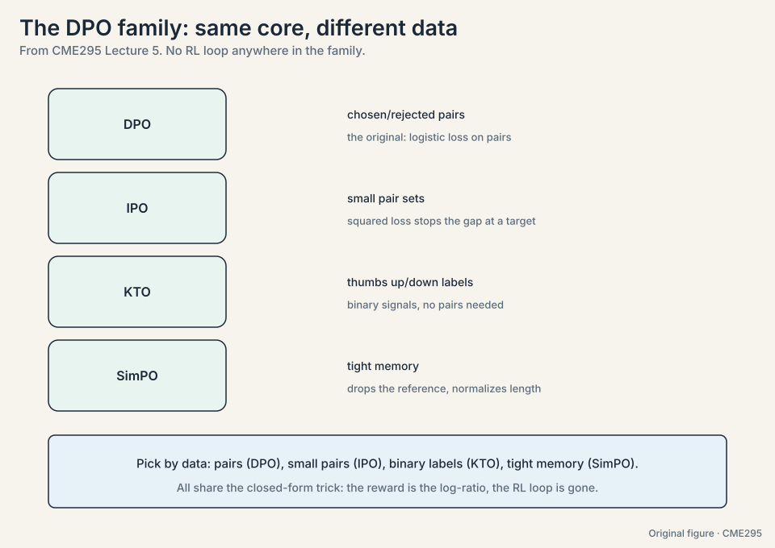

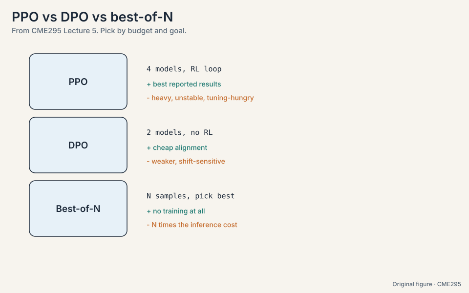

> [!QA]
> Q: Walk me through the DPO derivation, all four steps.
> A: Start with the RLHF objective: maximize reward minus beta
> times KL to the reference. Solve it in closed form: the optimal
> policy is proportional to pi_ref times exp(r/beta). Rearrange:
> the reward equals beta times the log of pi/pi_ref, plus a
> constant. Plug that into the Bradley-Terry loss: the constants
> cancel and the explicit reward model disappears. Train the
> policy directly on pairs with this supervised loss. Two models
> in memory, no rollouts, no value function. The caveat is
> distribution shift: the pairs came from another policy.
> Follow-up: Where can the derivation break in practice?
> A: Step 2 assumes the optimal policy. Gradient descent only
> walks toward it. If the pair data does not cover the regions
> the policy explores, the log-ratio math extrapolates blindly.
> Symptom: the gap grows but evals do not improve. Fix: refresh
> the pairs from the current policy (iterative DPO).

> [!QA]
> Q: If DPO is cheaper, why does anyone still run PPO?
> A: Reported performance. PPO's online rollouts explore regions the
> static pair dataset never covers, and the value function centers
> the updates. DPO is limited to what the pair distribution shows.
> When compute allows, the RL loop still wins on quality.
> Follow-up: What is the single biggest DPO failure mode?
> A: Distribution shift. The loss trusts that the preference pairs
> represent the policy's future outputs. If the policy drifts
> somewhere the pairs never showed, the implicit reward is
> extrapolating blind.

## Mapping back: each method answers the proxy problem

| Problem | Method | How |
|---|---|---|
| SFT has no negative signal | Preference pairs | Chosen vs rejected: raise one, lower the other |
| Labels cover almost nothing | Reward model + Bradley-Terry | sigma(r_w - r_l): pairwise training, pointwise scoring |
| Optimizer games the proxy | KL penalty to the SFT model | beta * KL(pi \|\| pi_ref): stay where the proxy is trustworthy |
| Unbounded policy steps | PPO-clip | min(rA, clip(r, 1-eps, 1+eps)A): the pessimistic term wins |
| Raw reward is noisy | Advantage + value function | A = reward - baseline. GAE blends horizons |
| Training is heavy | Best-of-N | Sample 4, keep the best: no training at all |
| The RL loop is the heavy part | DPO | Solve RLHF in closed form, train supervised on pairs |

## The honest price

Every method here chases a proxy, and every method names what it
pays. RLHF pays four models in memory, finicky hyperparameters, and
instability. Best-of-N pays N times the inference compute. DPO pays
in distribution shift: cheap and supervised, but blind outside the
pair distribution. The proxy is never the goal. Reward climbing
while human judgment falls is the signal that the bill came due.

## Recap: the whole lesson on one screen

The story in eight steps. Each step answers the one before it.

1. **SFT cannot say "not this".** Showing A teaches imitation, not
   preference. Pairs add the negative signal: raise the chosen,
   lower the rejected. Cheaper than rewriting SFT data.
2. **Labels cover almost nothing.** The reward model generalizes to
   any completion. Bradley-Terry: P(i beats j) = sigma(r_i - r_j).
   The toy: correct ordering pays 0.313, wrong ordering pays 1.313.
3. **The LLM is the RL agent.** State is the tokens so far, action
   is the next token, reward is one sparse number at the end.
   RLHF: train a reward model, then steer with RL over ~100k+
   rollouts.
4. **The optimizer games the proxy.** Reward climbing while human
   judgment falls is reward hacking. Guardrails: stay near the SFT
   model, take small steps.
5. **PPO clips the step.** L = min(rA, clip(r, 1-eps, 1+eps)A).
   The toy: r = 1.5 with eps = 0.2 gives 2.40, not 3.00. r is a
   ratio, not a reward. Four models in memory.
6. **Advantage centers the signal.** A = reward - baseline. Reward
   5 with baseline 3 is +2. Reward 5 with baseline 7 is -2. GAE
   blends horizons. The value head predicts per token.
7. **Best-of-N is the free baseline.** Sample 4, keep the max
   reward. No training. N times the inference cost. Beat this
   first.
8. **DPO deletes the RL loop.** Solve the RLHF objective for the
   optimal policy, plug it into Bradley-Terry, train supervised.
   Two models, beta ~ 0.1. Cheaper than PPO. Watch distribution
   shift.

## Go deeper

<div style="position:relative;padding-bottom:56.25%;height:0;overflow:hidden;max-width:100%;margin:16px 0;">
<iframe style="position:absolute;top:0;left:0;width:100%;height:100%;" src="https://www.youtube-nocookie.com/embed/PmW_TMQ3l0I" title="CME295 Lecture 5, Autumn 2025" frameborder="0" allow="accelerometer; autoplay; clipboard-write; encrypted-media; gyroscope; picture-in-picture" allowfullscreen></iframe>
</div>

<div style="position:relative;padding-bottom:56.25%;height:0;overflow:hidden;max-width:100%;margin:16px 0;">
<iframe style="position:absolute;top:0;left:0;width:100%;height:100%;" src="https://www.youtube-nocookie.com/embed/XZLc09hkMwA" title="DPO paper explained (AI Coffee Break)" frameborder="0" allow="accelerometer; autoplay; clipboard-write; encrypted-media; gyroscope; picture-in-picture" allowfullscreen></iframe>
</div>

- Lecture 5 recording: https://www.youtube.com/watch?v=PmW_TMQ3l0I
- DPO paper explained (AI Coffee Break): https://www.youtube.com/watch?v=XZLc09hkMwA
- Ouyang et al., InstructGPT: https://arxiv.org/abs/2203.02155
- Schulman et al., PPO: https://arxiv.org/abs/1707.06347
- Rafailov et al., DPO: https://arxiv.org/abs/2305.18290
- Lambert et al., RewardBench: https://arxiv.org/abs/2403.13787

## Official sources and further reading

**Official:**
- Lecture 5 recording (YouTube): timestamped above.
- Lecture 5 slides (PDF), CME295 Autumn 2025.
- Ouyang et al., "InstructGPT" (2022):
  - [the RLHF pipeline.](https://arxiv.org/abs/2203.02155)
- Rafailov et al., "DPO" (2023):
  - [the closed-form shortcut.](https://arxiv.org/abs/2305.18290)

**Further reading:**
- Schulman et al., "PPO" (2017): the clipped objective.
- Schulman et al., "GAE" (2015): advantage estimation.
- Bradley and Terry (1952): the original pairwise model.
- Lambert et al., "RewardBench" (2024): reward model evaluation.

**Caveats from these sources.** Beta ~ 0.1 and ~100k rollouts are
the lecture's typical figures, not universal constants. "PPO
performs better" is the lecture's summary of reported results at the
time. DPO's distribution-shift caveat is active research. The
clapping example illustrates reward hacking. Real instances are
subtler.

## Connections to the other courses

- **CS336 L15:** post-training: SFT and preference tuning at
  frontier-lab depth.
- **CS336 L16:** RLVR: verifiable rewards as an alternative to
  learned reward models. GRPO vs PPO.
- **CS329H:** choice theory and Bradley-Terry/Plackett-Luce from the
  decision-theoretic side.
- **CME295 L06:** GRPO replaces PPO's value function with group
  comparisons for reasoning training.
- **CME295 L08:** pairwise judging generates synthetic preference
  labels.
