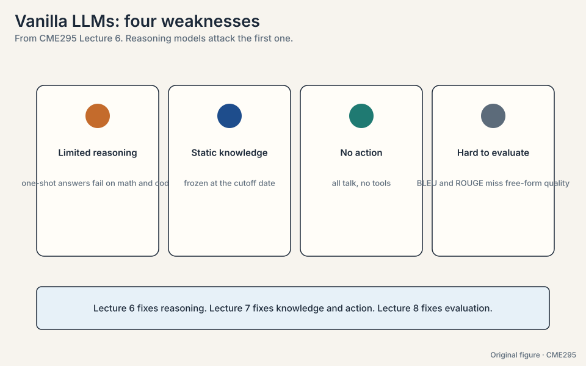
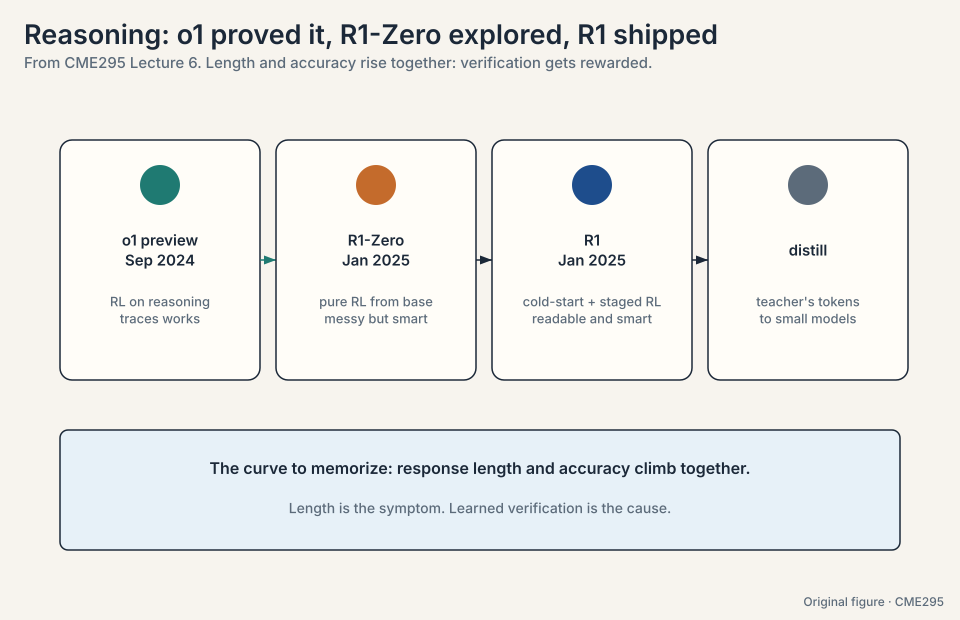
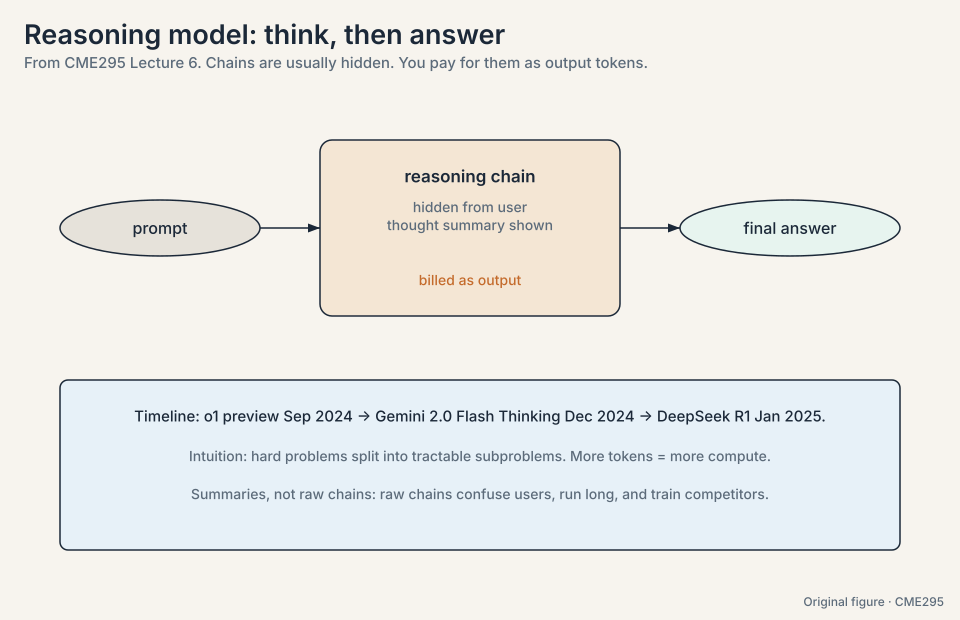
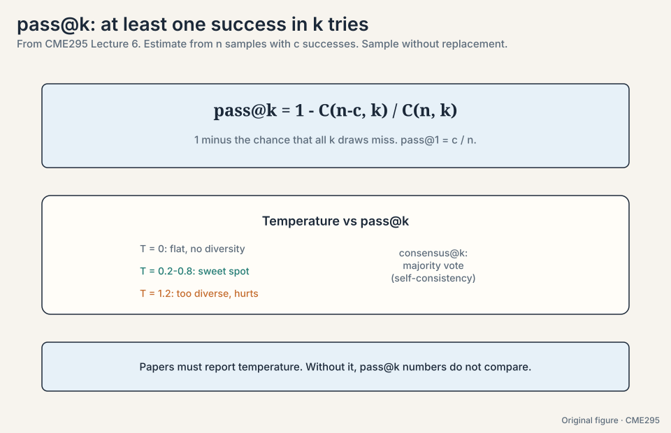
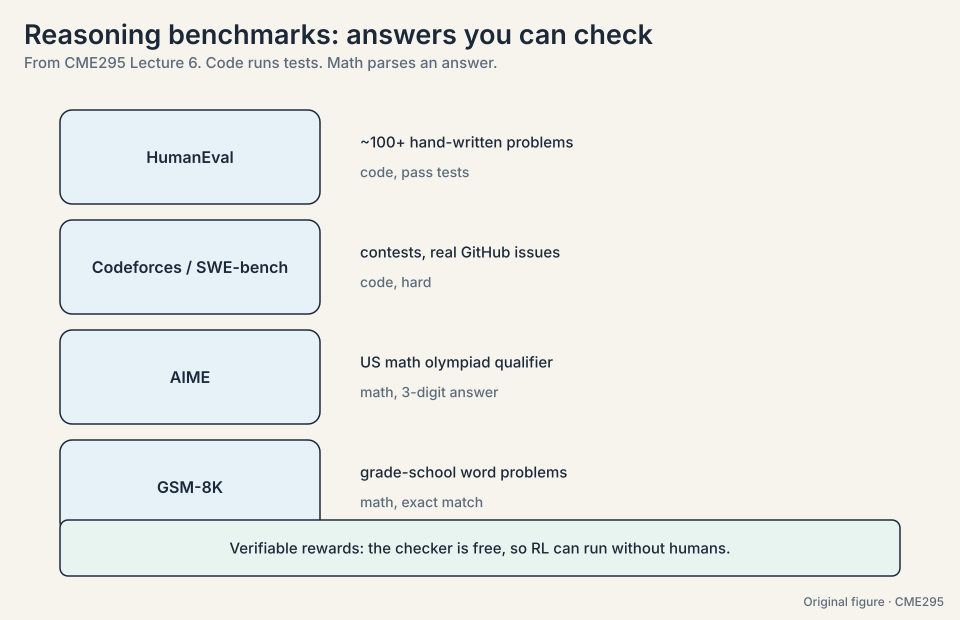
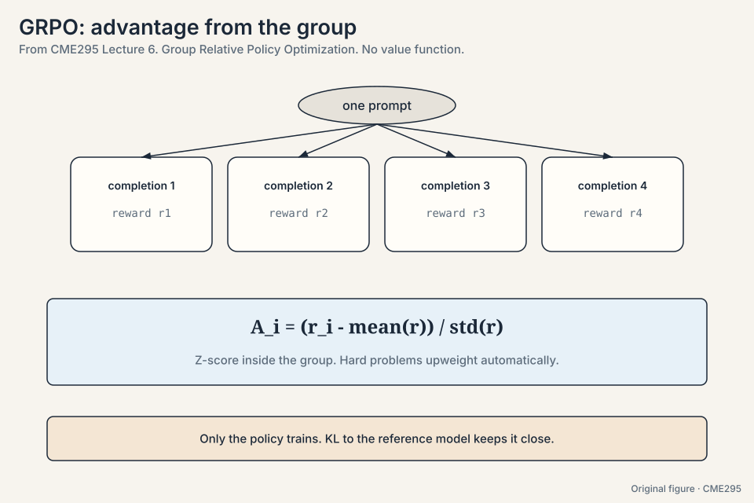
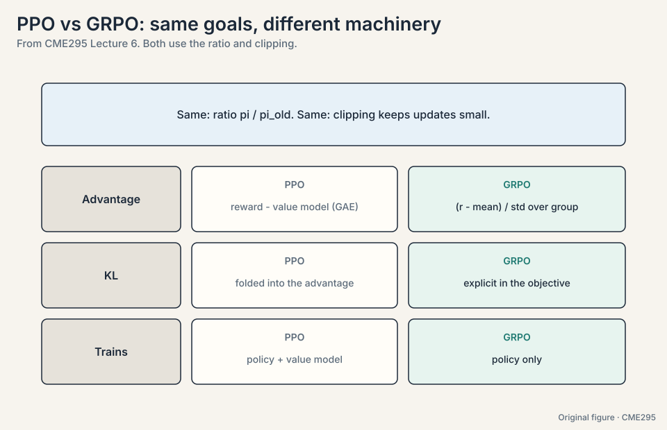
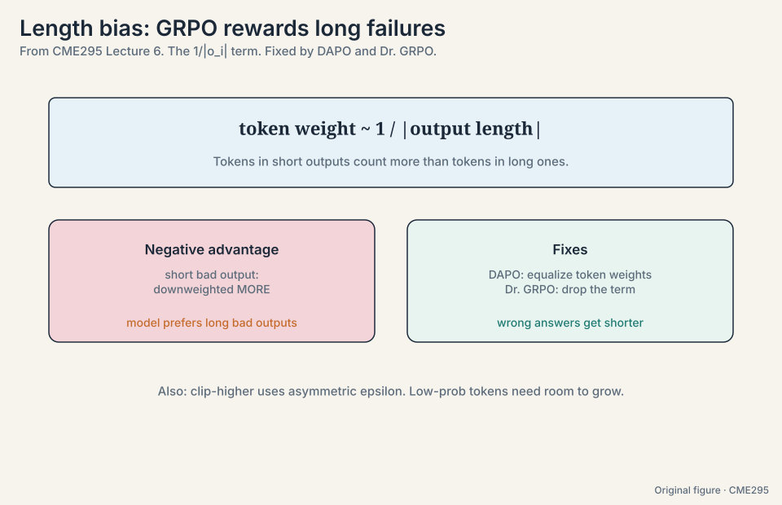
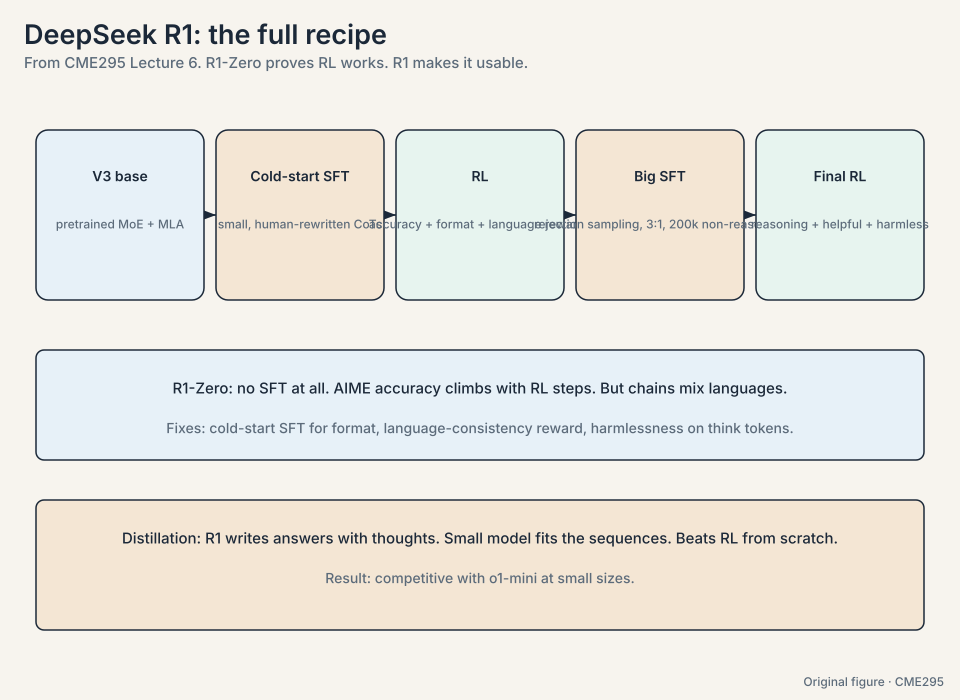
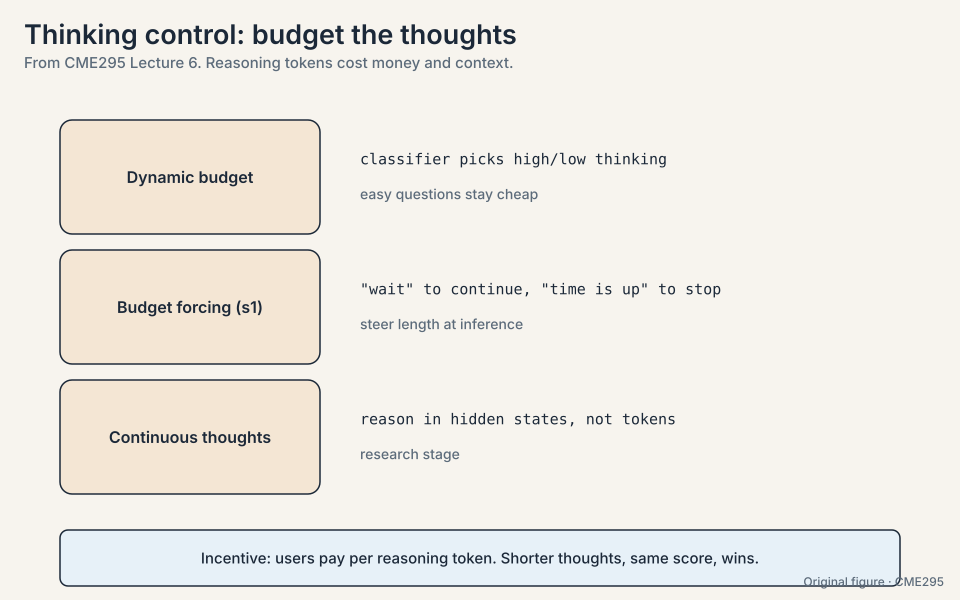

## The problem: one-shot answers fail on multi-step problems

Ask a vanilla LLM a hard math problem and demand the answer in one
shot. It writes the answer directly. On single-step questions this
works. On multi-step problems it fails: each step is a chance to err,
and one wrong step poisons the answer. There is no room to work.

Reasoning here means the ability to solve a problem through multiple
steps, not the ability to sound thoughtful. Four weaknesses frame the
rest of the course: limited reasoning, static knowledge (everything
bound to the cutoff date,
[10:44](https://www.youtube.com/watch?v=k5Fh-UgTuCo&t=644s)), no
action (all talk, no tools. Lecture 7 fixes this), and hard
evaluation (Lecture 8 fixes this). This lecture attacks the first.



## Think, then answer

A **reasoning model** splits generation in two: first a reasoning
chain (**think tokens**), then the final answer. The chain is usually
hidden from the user. Interfaces show a thought summary instead
([25:53](https://www.youtube.com/watch?v=k5Fh-UgTuCo&t=1553s)). The
lecture gives three hypothesized reasons: raw chains confuse users,
they run long, and they can train competitors.

The core intuition is economic. Hard problems decompose into
tractable subproblems the model has seen in training, so more tokens
means more compute spent well. And reasoning tokens are billed as
output tokens, so long chains cost real money. The toy: a 50-token
answer costs X. A 50-token answer with 500 thinking tokens costs 11X
for the same user-visible words.

The timeline: o1 preview in September 2024
([22:45](https://www.youtube.com/watch?v=k5Fh-UgTuCo&t=1365s)), Gemini
2.0 Flash Thinking in December 2024, DeepSeek R1 in January 2025
([23:18](https://www.youtube.com/watch?v=k5Fh-UgTuCo&t=1398s)), then
xAI, Anthropic, and Mistral entries. R1 mattered because it matched
frontier performance with a published method.

### Subchapter: the RL training curve, worked

The R1-Zero story, as reported: start from V3-Base, run GRPO with
verifiable rewards on math and code. Early in training: short,
mostly wrong answers. Mid-training: mean response length climbs
and accuracy climbs with it. The famous "Aha moment": the model
spontaneously emits self-correction phrases ("wait, let me
recheck") with no such examples in training. Late: long chains,
self-verification, AIME accuracy matching o1. The curve to
memorize: length and accuracy rise *together*. The model does not
learn to write longer: it learns that spending tokens on checking
gets rewarded, and the chains grow as a consequence. Length is the
symptom. Verification is the cause.

### Subchapter: why long chains enable self-correction

A one-shot answer has no room to notice its own error. A chain
does: token 200 can re-examine token 50's arithmetic, because both
sit in context. Self-correction needs three ingredients. **Room**:
enough tokens to re-derive. **A critic**: the model must have
learned that checking pays (the RL reward). **A restart point**:
the chain must be able to abandon a branch ("that path is wrong,
try again"). Short chains fail the first ingredient. Models
trained only on correct chains fail the second and third: they
never practiced recovery. RL with verifiable rewards teaches all
three, because only the final answer is graded and any path that
reaches it wins.





## The problem: one sample understates the model

A reasoning model may solve a problem on its third try after failing
twice. Accuracy on one sample understates it. **pass@k** asks: if you
draw k attempts, what is the probability at least one succeeds?

Estimate it from n samples with c successes
([32:17](https://www.youtube.com/watch?v=k5Fh-UgTuCo&t=1937s)):

**pass@k = 1 - C(n-c, k) / C(n, k)**

Work it by hand. n = 10 samples, c = 3 successes, k = 2 attempts:

```ascii
failures: n - c = 7
P(both attempts miss) = C(7, 2) / C(10, 2) = 21 / 45 = 0.467
pass@2 = 1 - 0.467 = 0.533
```

The trick is the complement: C(n-c, k)/C(n, k) is the chance that all
k draws come from the n-c failures, sampling without replacement
([40:58](https://www.youtube.com/watch?v=k5Fh-UgTuCo&t=2458s)). One
minus that is the chance at least one succeeds. pass@1 reduces to
c/n = 0.3, the plain success rate. Two attempts lift 0.3 to 0.533:
the k-try behavior is the operational quantity, and it is much
higher than the single-try number.

Temperature interacts directly. T = 0 gives no diversity: every draw
is the same, so pass@k is flat at pass@1. T = 1.2 gives too much
diversity: draws wander off. The sweet spot sits around T = 0.2-0.8.
The lecture's example peaks at 0.8
([47:02](https://www.youtube.com/watch?v=k5Fh-UgTuCo&t=2822s)).
Papers must report temperature or their pass@k numbers do not
compare. **consensus@k** (majority vote over k samples, i.e.
self-consistency) is the companion metric.

### Subchapter: consensus@k and the vote math

pass@k asks "is any draw right". consensus@k asks "is the
majority right". The toy: k = 5 draws, answers [A, B, A, A, C].
Majority: A, 3 of 5. When each draw is right with probability
0.6 independently, the majority of 5 is right with probability
~0.68: voting concentrates the signal. When errors correlate
(the model misreads the question the same way every time), the
majority is confidently wrong: consensus amplifies the shared
bias. The decision rule: use pass@k when a verifier can pick the
right answer from the k (math, code). Use consensus@k when no
verifier exists and errors are roughly independent. Never use
consensus where the model has a systematic blind spot: the vote
just re-elects the bias.



> [!QA]
> Q: Why sample without replacement in the pass@k estimate?
> A: Because the k attempts are k distinct draws from your n
> samples. Drawing the same sample twice would double-count one
> outcome. The hypergeometric form C(n-c,k)/C(n,k) counts distinct
> k-subsets, which matches how you would actually take k attempts.
> Follow-up: Why not just report pass@1?
> A: pass@1 measures the typical single try. Reasoning models are
> often deployed with sampling plus selection (best-of-N, majority
> vote), so the k-try behavior is the operational quantity. A model
> with pass@1 of 0.3 and pass@32 of 0.9 is very usable with the
> right sampling-and-selection code.

## Verifiable rewards: the checker is free

Reasoning benchmarks share one property: the answer is verifiable
without a human. Code runs tests. Math parses a final answer.

- **HumanEval**
  ([29:08](https://www.youtube.com/watch?v=k5Fh-UgTuCo&t=1748s)):
  ~100+ hand-written programming problems with tests.
- **Codeforces / SWE-bench**
  ([29:31](https://www.youtube.com/watch?v=k5Fh-UgTuCo&t=1771s)):
  competition problems and real GitHub issues.
- **AIME**: US math olympiad qualifier. Integer answers that parse
  cleanly.
- **GSM-8K**: grade-school word problems. Exact-match grading.

Verifiable answers make **verifiable rewards** possible: the checker is
free, so RL can run without humans in the loop. That is the economic
fact behind this entire lecture. SFT could teach reasoning chains,
but the chains would have to be hand-written: expensive, and human
reasoning patterns are not necessarily what helps a model. RL with
verifiable rewards sidesteps both problems: reward correct answers
and let the model discover its own chains.

### Subchapter: the reward trichotomy

Three reward types, three tradeoffs:

- **Outcome reward.** One number for the final answer: right or
  wrong. Cheap, sparse, hackable only through correctness. The
  R1 default.
- **Process reward.** A reward per reasoning step: each step
  graded. Dense signal, but someone must grade the steps (a
  process reward model, itself trained on human step labels).
  Expensive, and the grader's errors become the policy's
  curriculum.
- **Verifiable reward.** A special outcome reward where a program
  checks the answer: tests run, answers parse. Free, exact, but
  only defined where a checker exists.

The frontier uses verifiable rewards wherever possible (math,
code) and outcome rewards with learned judges elsewhere. Process
rewards are the research direction: denser signal, harder to get
right. The decision rule: verifiable > outcome > process, ordered
by cost per unit of trust.



## The key question

The reward is one sparse number at the end of a long answer. How do
you turn that single signal into per-token learning without training a
critic model?

## GRPO: the group is the baseline

**GRPO** (Group Relative Policy Optimization, 2024,
[58:49](https://www.youtube.com/watch?v=k5Fh-UgTuCo&t=3529s)) is the
go-to algorithm. For one prompt, sample a group of g completions and
score each. The advantage of completion i is its z-score inside the
group:

**A_i = (r_i - mean(r)) / std(r)**

Work it on a toy. One prompt, g = 4 completions, rewards
[0, 0, 1, 0] (three wrong, one right):

```ascii
mean = 0.25,  std = 0.433
A_correct = (1 - 0.25) / 0.433 = +1.73
A_wrong   = (0 - 0.25) / 0.433 = -0.58
```

The correct completion gets a large positive advantage. Each wrong
one gets a mild negative one. No value function: the group itself
is the baseline. Hard problems upweight automatically, because a
correct answer among failures gets a large positive z-score.



Against PPO (Lecture 5), the comparison is clean. Both optimize a
ratio of new-policy to old-policy probabilities, and both clip
updates to stay small. They differ twice. First, GRPO puts the KL
penalty explicitly in the objective. PPO typically folds KL into the
per-token rewards inside the advantage. Second, PPO trains a value
model to center advantages via GAE. GRPO centers with the group mean
and trains the policy only. In reasoning setups both skip the reward
model entirely: verifiable rewards replace it.



### Subchapter: GRPO vs PPO, the memory delta counted

For a 7B policy in fp16 (14 GB): PPO holds policy (14), reference
(14), reward model (~14, often smaller), and value network (14:
a second full model). Total: ~56 GB before optimizer states and
activations. GRPO holds policy (14) and reference (14): ~28 GB.
The verifiable reward is a program, not a model: 0 GB. The delta
is ~28 GB: one whole model class deleted. That is the difference
between needing 8 GPUs and needing 4, or between fitting and not.
The price, again: per-completion advantages instead of
per-token ones. Coarser signal, half the memory.

> [!QA]
> Q: Walk me through one GRPO update, start to finish.
> A: One prompt, g = 4 completions, verifiable rewards [0, 0, 1,
> 0]. Compute mean 0.25, std 0.433. Advantages: +1.73 for the
> correct completion, -0.58 for each wrong one. For each
> completion, compute the probability ratio r =
> pi_new/pi_old per token, clip it like PPO, multiply by the
> completion's advantage. Add the explicit KL penalty against
> the reference. No value function anywhere: the group mean
> centered the advantages. The correct completion's tokens get
> pushed up 1.73x harder than the wrong ones get pushed down.
> Follow-up: What if all 4 completions are wrong?
> A: Rewards [0,0,0,0]: mean 0, std 0. The z-score divides by
> zero. Implementations add a small epsilon or skip the group.
> Either way the group teaches nothing: no contrast, no signal.
> Filter all-wrong and all-right groups from the batch.

> [!QA]
> Q: What does GRPO gain by dropping the value function?
> A: Memory and simplicity. The value model in PPO is a full second
> network to train, tune, and fit in memory. The group baseline is
> free: you already sampled the completions. For verifiable rewards
> the trade is excellent, which is why reasoning training converged
> on GRPO.
> Follow-up: What does it lose?
> A: Per-token credit assignment. PPO's value function estimates
> expected reward at each token, so advantages are token-fine.
> GRPO's group z-score is per-completion: every token in a good
> completion gets the same advantage. Coarser signal, cheaper
> machinery.

## The length-bias bug

GRPO's objective normalizes each completion's contribution by its
length: a 1/|o_i| factor. Watch what it incentivizes. Two bad
completions, both with negative advantage -1:

```ascii
short failure: 50 tokens.  contribution = -1 / 50  = -0.020
long failure:  500 tokens. contribution = -1 / 500 = -0.002
```

The short bad output is downweighted 10x harder than the long bad
output. The model learns: when in doubt, ramble. Empirically, output
length keeps climbing after performance plateaus.

Two 2025 fixes remove the incentive. **DAPO** (March,
[85:14](https://www.youtube.com/watch?v=k5Fh-UgTuCo&t=5114s))
equalizes token-level contributions with a length-independent
normalization. **Dr. GRPO** ("GRPO done right",
[85:36](https://www.youtube.com/watch?v=k5Fh-UgTuCo&t=5136s)) drops
the factor entirely. Result: correct answers keep their length,
wrong answers get much shorter. A related fix is **clip-higher**:
asymmetric epsilon bounds, because low-probability tokens need room
to grow while high-probability tokens must not collapse to zero.

### Subchapter: clip-higher, asymmetric

PPO's clip is symmetric: eps = 0.2 both ways. The problem:
low-probability tokens (the interesting explorations) need large
upward moves to matter, while high-probability tokens collapsing
to zero destroys behavior. **Clip-higher** uses eps_low = 0.2,
eps_high = 0.28 (typical): ratios can rise to 1.28 but fall only
to 0.8. Exploration gets headroom, collapse gets a floor. The
never-confuse pair: the clip bounds the *ratio*, the KL penalty
bounds the *drift*. Clip-higher relaxes the ratio's ceiling only.



## The DeepSeek R1 recipe

**R1-Zero** was the proof of concept: take a pretrained base (V3:
MoE, MLA, pre-norm), skip SFT entirely, and run GRPO with two
rewards, answer accuracy plus format compliance
([91:24](https://www.youtube.com/watch?v=k5Fh-UgTuCo&t=5484s)). AIME
accuracy climbs with RL steps. The chains work but mix languages and
have syntax issues: with no supervision anchor, the model optimizes
freely.

**R1**, the full pipeline, fixes the rough edges in stages:

1. **Cold-start SFT**
   ([96:44](https://www.youtube.com/watch?v=k5Fh-UgTuCo&t=5804s)). A
   small set of human-rewritten chains teaches formatting and
   language consistency. Orders of magnitude smaller than other
   stages [uncertain: no number given in the lecture].
2. **RL.** Accuracy plus format plus a language-consistency reward
   (ratio of target-language tokens,
   [98:28](https://www.youtube.com/watch?v=k5Fh-UgTuCo&t=5908s)).
3. **Large SFT.** Mix reasoning and non-reasoning data. Reasoning
   pairs come from **rejection sampling**: generate, judge, keep the
   best
   ([100:12](https://www.youtube.com/watch?v=k5Fh-UgTuCo&t=6012s)).
   Non-reasoning pairs (~200k, recycled from V3,
   [99:42](https://www.youtube.com/watch?v=k5Fh-UgTuCo&t=5982s))
   keep the model generally useful, at a 3:1 reasoning-to-other ratio
   ([100:02](https://www.youtube.com/watch?v=k5Fh-UgTuCo&t=6002s)).
4. **Final RL.** Reasoning rewards plus helpfulness and
   harmlessness. Harmlessness applies to all tokens including the
   think section. Helpfulness is judged at the user-visible level.

Results: reasoning benchmarks split into two clusters, and R1 lands
with the closed-source reasoning models.

Then **distillation**
([103:53](https://www.youtube.com/watch?v=k5Fh-UgTuCo&t=6233s)): use
R1 to generate answers with thinking tokens, offline, and SFT a
small model on the full sequences. Not the teacher's distribution,
the teacher's tokens. At small sizes this beats RL from scratch,
and the distilled models compete with o1-mini.

### Subchapter: the 671B-to-37B arithmetic

R1's base (V3): 671B total parameters, MoE with 37B active per
token. The ratio: 37/671 = 5.5% of the model computes each token.
Training cost scales with active params (37B-equivalent FLOPs per
token). Memory cost scales with total params (671B to store). The
MoE trick from Lecture 3, at reasoning scale: capacity without
proportional compute. MLA (multi-head latent attention) compresses
the KV cache: instead of storing full K and V per head, store a
low-rank latent and project per head on the fly. Long reasoning
chains (tens of thousands of tokens) make KV memory the binding
constraint, so the compression directly extends how far the model
can think.

### Subchapter: distillation, teacher tokens vs teacher distribution

Two distillation flavors. **Distribution distillation**: train the
student to match the teacher's output probabilities (KL on the
logits). Needs the teacher's logits: expensive to store, rich
signal per token. **Token distillation** (R1's): generate the
teacher's tokens offline, SFT the student on the sequences. Needs
only the tokens: cheap to store, one-hot signal per position. R1
chose tokens: generate once, SFT many small models cheaply. The
tradeoff: token distillation teaches what the teacher *said*, not
what it *considered*. The student inherits the teacher's paths,
including its blind spots. The ceiling is the teacher's tokens:
the student cannot exceed them, but at small sizes it beats RL
from scratch because the tokens already encode the discovered
strategies.



> [!QA]
> Q: Design the RLVR (reinforcement learning from verifiable
> rewards) dataset for a new reasoning model. What goes in?
> A: Problems with verifiable answers, graded difficulty, and no
> leakage. Verifiable: math with parseable answers (AIME-style),
> code with hidden tests (not the public ones). Difficulty: a
> mix where the current policy gets 10-70% right. All-solved
> problems teach nothing, all-failed ones teach nothing (the
> zero-std problem). Scale: tens of thousands of problems,
> each sampled g = 8-64 times per GRPO step. Dedup against
> benchmarks: any test-set overlap is contamination (Lecture 4).
> The decision rule: if a checker cannot grade it, it does not
> belong in RLVR. Save it for preference tuning.
> Follow-up: How do you keep the difficulty mix right as the
> model improves?
> A: Dynamic filtering: drop problems the model now solves
> always, add harder ones. The training distribution must track
> the capability frontier, or the advantages collapse to noise.

## The problem: the thinking budget

Reasoning tokens cost money and context, so length needs control:

- **Dynamic budget.** A classifier routes easy questions to short
  thinking and hard ones to long thinking.
- **Budget forcing** (s1 paper,
  [56:00](https://www.youtube.com/watch?v=k5Fh-UgTuCo&t=3360s)). At
  inference, inject "wait" tokens to extend thinking or cut it off
  and demand the answer. Steering without retraining.
- **Continuous thoughts.** Reason in hidden states rather than
  tokens. Research-stage, but it would remove the token tax
  entirely.



> [!QA]
> Q: Why not always think longer?
> A: Because the bill is per token and the context window is finite.
> Length helps until the answer is right. Beyond that it is pure
> cost. The provider incentive (charge per reasoning token) and the
> user incentive (pay less, wait less) both point at the shortest
> chain that still solves the problem.
> Follow-up: Does budget forcing actually work?
> A: Surprisingly well for a hack. Appending "wait" keeps the model
> in thinking mode and often improves the answer. Cutting off forces
> a guess from partial reasoning. It is inference-time steering, so
> it composes with any trained reasoning model.

### Subchapter: budget forcing vs dynamic budgets

Two ways to control the thinking bill:

- **Budget forcing** (inference-time): append "wait" to extend,
  cut off to truncate. No training, works on any reasoning model.
  Crude: "wait" sometimes produces filler, cutoff sometimes kills
  a chain mid-derivation.
- **Dynamic budgets** (trained or routed): a classifier sends easy
  questions to short thinking, hard ones to long. Needs the
  router and calibration data. Precise: the budget matches the
  problem.

The tradeoff is control vs cost. Budget forcing is free and
dumb. Dynamic budgets are smart and needy. Production systems
layer them: route by difficulty first, force at the margins.

> [!QA]
> Q: Your reasoning API bill tripled after launch. What do you do?
> A: Measure first: distribution of thinking tokens per request,
> and accuracy vs length per task type. Then: route easy tasks to
> short budgets (dynamic routing), cap the maximum thinking
> tokens, and check for the length-bias ramble (wrong answers
> getting long: the DAPO/Dr. GRPO fix). Only then consider
> distilling to a smaller model. The decision rule: never pay
> for thinking that does not change answers. Cut the tail, not
> the capability.
> Follow-up: What if short budgets hurt accuracy on hard tasks?
> A: That is the real tradeoff, not a bug. Segment by task: hard
> tasks keep long budgets, easy ones get cut. The bill falls
> because most traffic is easy.

## Mapping back: each piece answers a reasoning problem

| Problem | Answer | How |
|---|---|---|
| One-shot answers fail multi-step problems | Think-then-answer | Hidden chain first, answer second. Compute scales with tokens |
| One sample understates the model | pass@k | 1 - C(n-c,k)/C(n,k): the k-try probability, by hand |
| Hand-written chains are expensive and human-shaped | Verifiable rewards | Code tests and math answers: the checker is free |
| PPO's value function is heavy | GRPO | Z-score inside the group: +1.73 for the winner, -0.58 for the losers |
| The normalizer rewards long failures | DAPO / Dr. GRPO | Equalize or drop the 1/\|o_i\| term: wrong answers get shorter |
| Pure RL produces messy chains | R1's stages | Cold-start SFT, RL, big SFT with rejection sampling, final RL |
| Small models cannot afford RL | Distillation | SFT the teacher's tokens, not its distribution |
| Thinking costs money | Budget control | Dynamic budgets, "wait" forcing, continuous thoughts |

## The honest price

Reasoning training pays in tokens: the bill is per thinking token,
and the context window is finite. GRPO pays in coarse credit
assignment: per-completion advantages instead of PPO's per-token
ones. Verifiable rewards pay in coverage: they teach only what a
checker can check, so taste, style, and open-ended judgment stay out.
Distillation pays in a ceiling: the student cannot exceed the
teacher's tokens. The lecture's bet is that checkable domains (math,
code) are big enough to be worth it.

### Subchapter: reasoning in production, October 2026

The R1 recipe became the industry template:

- **DeepSeek**: V4.1 Flash ships reasoning as the default mode.
  the R1 line continues as the open reasoning reference.
- **OpenAI**: o-series (o1 through o3 generations) with
  effort/thinking controls in the API.
- **Google**: Gemini thinking modes, with token budgets exposed.
- **Anthropic**: extended thinking on Claude, budget-controllable.
- **Qwen / Kimi / GLM**: open reasoning models distilling the
  same recipe (RLVR + distillation).

Every provider now sells the same three knobs: thinking on/off,
thinking budget, and effort level. The interview line: "Reasoning
is a serving feature now, not a research result." What remains
research: continuous thoughts (no token tax), process rewards that
work, and reasoning past the checkable domains.

## Recap: the whole lesson on one screen

The story in eight steps. Each step answers the one before it.

1. **One-shot fails multi-step.** Each step is a chance to err.
   Reasoning means solving through steps, not sounding thoughtful.
2. **Think, then answer.** Prompt to hidden chain to final answer.
   Chains are hidden. Summaries are shown. Billed as output tokens.
   o1 Sep 2024 to R1 Jan 2025 set the timeline.
3. **pass@k measures k tries.** 1 - C(n-c,k)/C(n,k). The toy:
   n = 10, c = 3, k = 2 gives 0.533, up from pass@1 of 0.3.
   Temperature tunes diversity: 0 is flat, 1.2 is wild, 0.2-0.8 is
   the sweet spot. Report temperature or do not compare.
4. **Checkable answers enable free rewards.** HumanEval,
   Codeforces, SWE-bench, AIME, GSM-8K. The checker replaces human
   labels, so RL runs without humans in the loop.
5. **GRPO z-scores inside the group.** g = 4, rewards [0,0,1,0]:
   +1.73 for the winner, -0.58 for each loser. No value function.
   Hard problems upweight automatically.
6. **Length bias rewards long failures.** The 1/|o_i| term
   downweights a 50-token failure 10x harder than a 500-token one.
   DAPO equalizes token weights. Dr. GRPO drops the term.
7. **R1: prove with Zero, ship with stages.** R1-Zero: RL only,
   works but messy. R1: cold-start SFT, RL with language reward, big
   SFT with rejection sampling (3:1, 200k), final RL with
   harmlessness on think tokens. Distill down for small models.
8. **Control the budget.** Dynamic budgets, budget forcing
   ("wait"), continuous thoughts. The shortest chain that still
   solves the problem.

## Go deeper

<div style="position:relative;padding-bottom:56.25%;height:0;overflow:hidden;max-width:100%;margin:16px 0;">
<iframe style="position:absolute;top:0;left:0;width:100%;height:100%;" src="https://www.youtube-nocookie.com/embed/k5Fh-UgTuCo" title="CME295 Lecture 6, Autumn 2025" frameborder="0" allow="accelerometer; autoplay; clipboard-write; encrypted-media; gyroscope; picture-in-picture" allowfullscreen></iframe>
</div>

<div style="position:relative;padding-bottom:56.25%;height:0;overflow:hidden;max-width:100%;margin:16px 0;">
<iframe style="position:absolute;top:0;left:0;width:100%;height:100%;" src="https://www.youtube-nocookie.com/embed/wXEvvg4YJ9I" title="GRPO explained with triangle creatures (Mihai Nica)" frameborder="0" allow="accelerometer; autoplay; clipboard-write; encrypted-media; gyroscope; picture-in-picture" allowfullscreen></iframe>
</div>

- Lecture 6 recording: https://www.youtube.com/watch?v=k5Fh-UgTuCo
- GRPO with triangle creatures (Mihai Nica): https://www.youtube.com/watch?v=wXEvvg4YJ9I
- DeepSeek-AI, DeepSeek-R1: https://arxiv.org/abs/2501.12948
- Shao et al., DeepSeekMath (GRPO): https://arxiv.org/abs/2402.03300

## Official sources and further reading

**Official:**
- Lecture 6 recording (YouTube): timestamped above.
- Lecture 6 slides (PDF), CME295 Autumn 2025.
- DeepSeek-AI, "DeepSeek-R1" (2025):
  - [the full pipeline.](https://arxiv.org/abs/2501.12948)
- Shao et al., "DeepSeekMath" (2024):
  - [GRPO.](https://arxiv.org/abs/2402.03300)

**Further reading:**
- OpenAI, "Learning to Reason with LLMs" (o1 system card, 2024).
- Muennighoff et al., "s1: Simple test-time scaling" (2025): budget
  forcing.
- "DAPO" (2025).
- "Dr. GRPO: GRPO Done Right" (2025): length-bias
  fixes.
- Wei et al., "Chain-of-Thought Prompting" (2022): the prompting
  ancestor of reasoning models.

**Caveats from these sources.** The cold-start SFT size is ungiven
in the lecture [uncertain]. "Several orders of magnitude smaller" is
the speaker's phrasing. Budget-forcing and continuous-thoughts
results are as presented live. Timeline months are as stated in the
lecture.

## Connections to the other courses

- **CS336 L16:** RLVR: verifiable rewards and GRPO at frontier-lab
  depth, the mathematical companion to this chapter.
- **CS336 L15:** post-training: where reasoning RL sits in the full
  stack.
- **CME295 L05:** PPO, the algorithm GRPO replaces for reasoning.
- **CME295 L03:** chain-of-thought prompting and self-consistency,
  the inference-time ancestors.
- **CME295 L08:** AIME, HumanEval, and benchmark reading.
