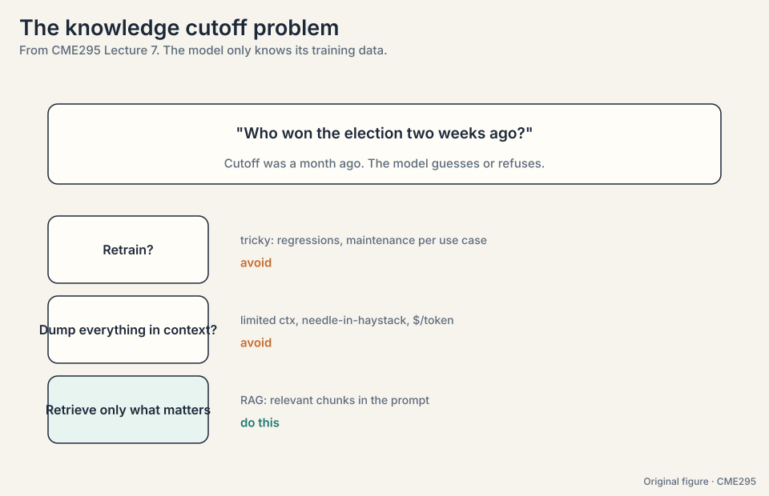
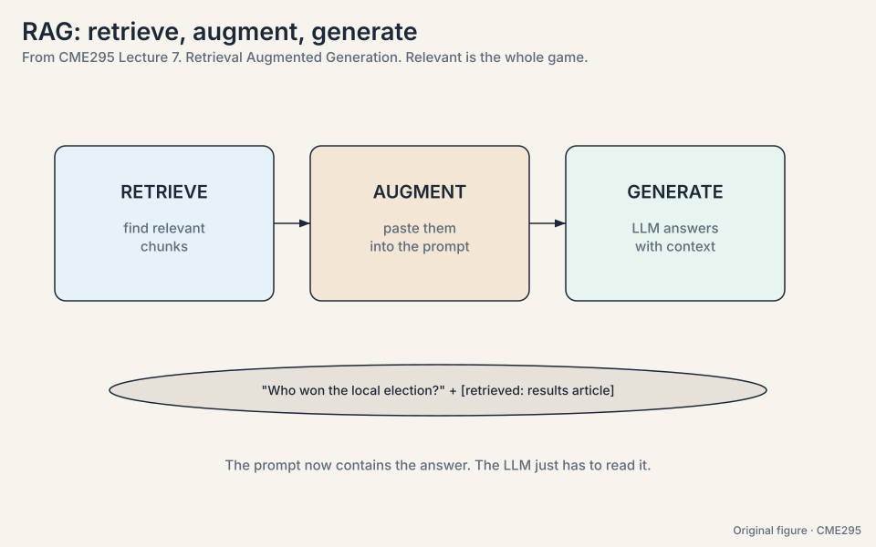
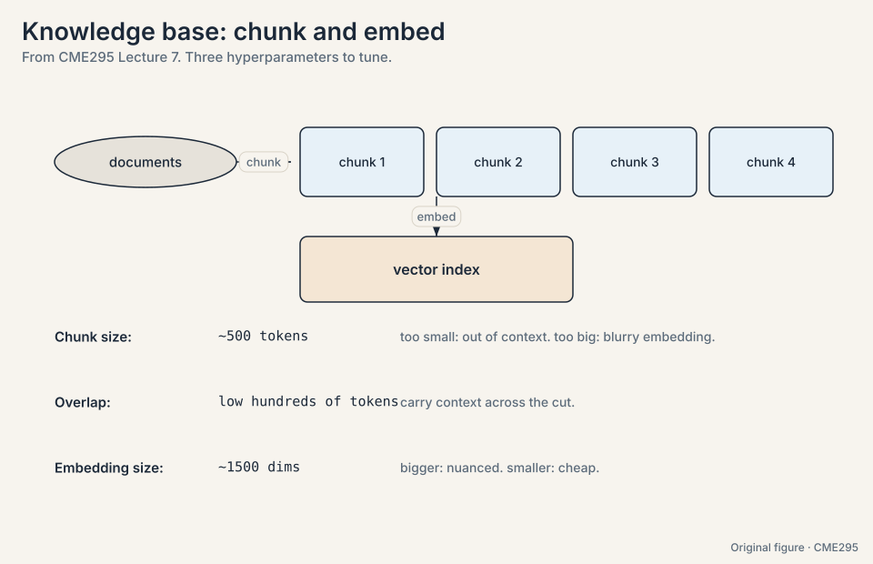
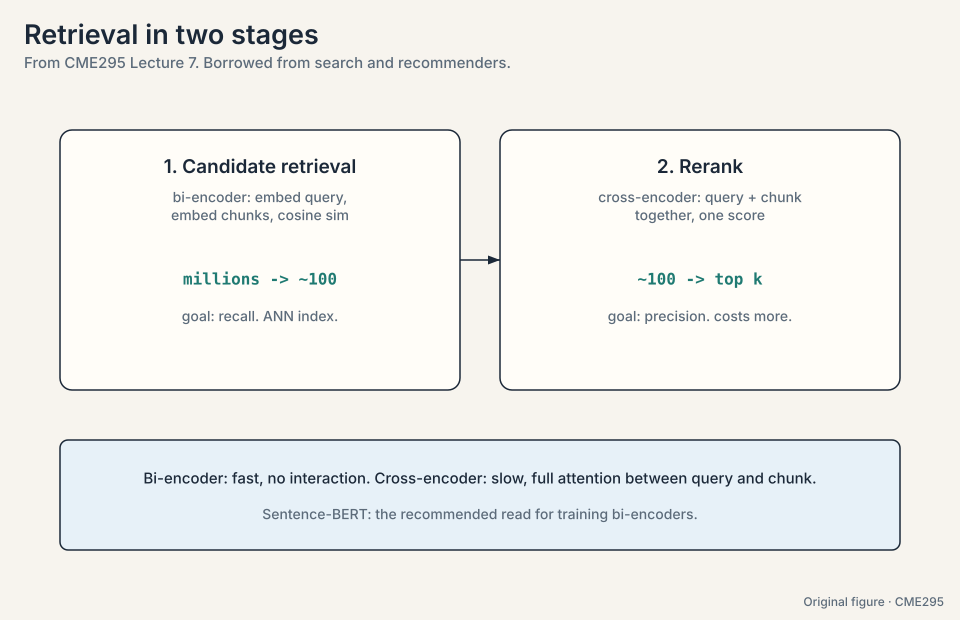
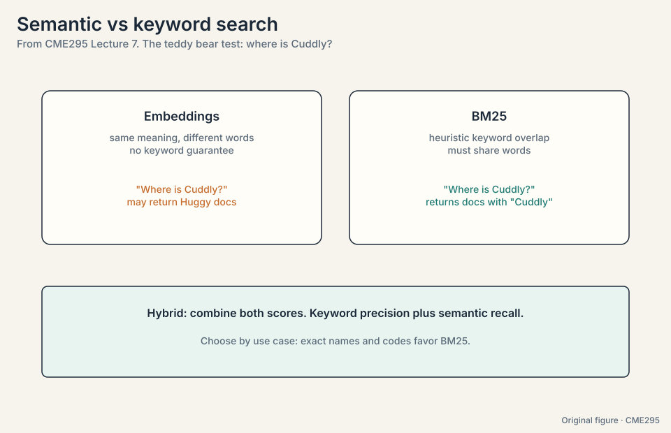
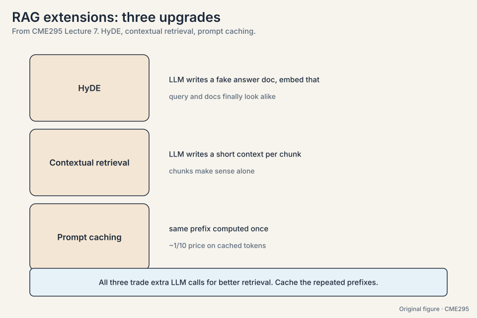
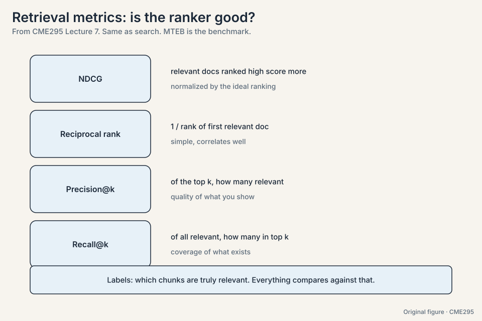
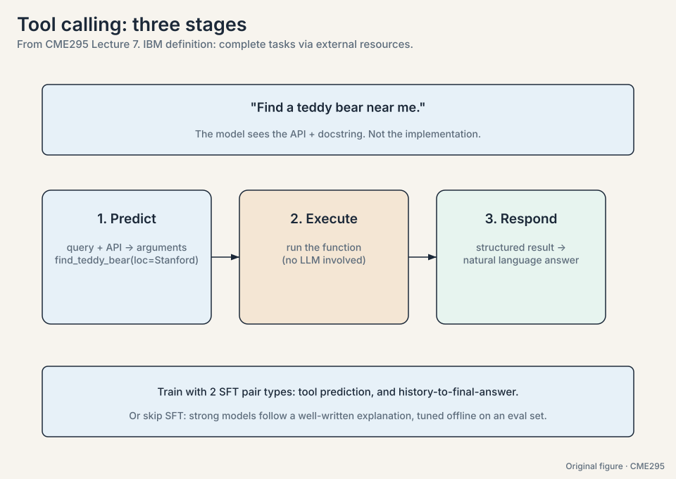
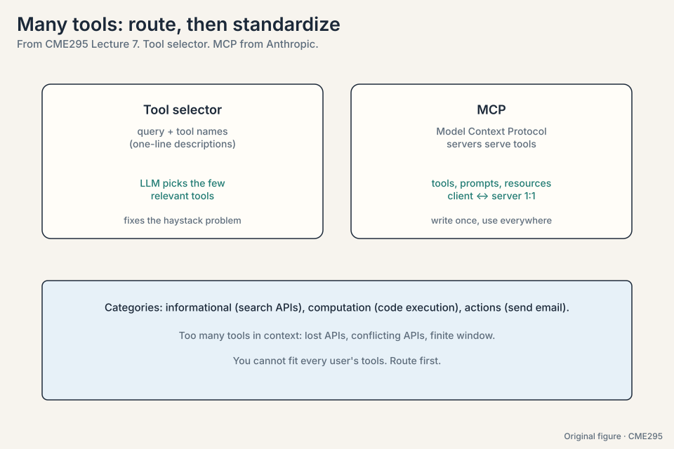

## The problem: the model is frozen in time

A trained model knows only its training data. Ask about an election
held two weeks after the cutoff and it guesses or refuses. Model
cards print the date: the lecture cites GPT-5's knowledge cutoff as
September 30, 2024
([08:13](https://www.youtube.com/watch?v=h-7S6HNq0Vg&t=493s)), with a
400,000-token context window
([11:09](https://www.youtube.com/watch?v=h-7S6HNq0Vg&t=669s)).

Two naive fixes fail. **Retraining** on new data risks regressions on
old capabilities and multiplies maintenance across every fine-tuned
use case. **Dumping everything into the prompt** fails three ways:
context is finite (400,000 tokens is hundreds of pages, not the
internet). Irrelevant context degrades performance, as
needle-in-a-haystack tests show
([12:02](https://www.youtube.com/watch?v=h-7S6HNq0Vg&t=722s)): facts
buried in the first half of long prompts get lost. And you pay per
input token, order of $1 per million.



## The key question

The model weights are frozen at training time. How do you give a frozen
model fresh, private knowledge without retraining it?

## RAG: retrieve, augment, generate

**RAG** stands for Retrieval Augmented Generation
([15:16](https://www.youtube.com/watch?v=h-7S6HNq0Vg&t=916s)). The
idea: augment the prompt with relevant information, where "relevant"
does all the work.

1. **Retrieve.** Given the question, fetch relevant chunks from a
   knowledge base.
2. **Augment.** Paste the retrieved chunks into the prompt alongside
   the question.
3. **Generate.** The LLM answers with the evidence in context.

The local-election example: "who won?" becomes "who won? By the way,
here is the results article: ...". The prompt now contains the
answer. The model just has to read it. Retrieval quality is the whole
game: a bad retriever poisons the prompt.



> [!QA]
> Q: Why is retrieval "the whole game" rather than generation?
> A: The generator is a reader. If the retrieved chunks contain the
> answer, a decent model extracts it. If they do not, no generator
> recovers: it either hallucinates or refuses. RAG system work is
> retriever work.
> Follow-up: When is RAG the wrong tool?
> A: When the knowledge is stable and universal enough to live in
> weights (grammar, common facts), or when the answer needs
> computation rather than lookup. RAG serves fresh, private, or
> long-tail knowledge.

## The problem: documents are too big to embed

A document is a million tokens. An embedding vector must represent
it in a few thousand numbers. One vector for a whole book loses
everything. The fix is **chunking**
([20:08](https://www.youtube.com/watch?v=h-7S6HNq0Vg&t=1208s)):
contiguous pieces of a few hundred tokens (typically ~500). Each
chunk gets an embedding vector from an encoder model.

Count it: 1,000,000 tokens at 500 tokens per chunk = 2,000 chunks.
At 1,500 dimensions and 4 bytes each: 2,000 * 1,500 * 4 = 12 MB.
Searchable, storable.

Three hyperparameters, each a tradeoff:

- **Chunk size** (~500 tokens). Too small and the chunk loses
  context. Too large and one embedding cannot represent the content
  faithfully.
- **Overlap** (low hundreds of tokens). Carry the tail of the
  previous chunk so cuts do not strand meaning.
- **Embedding size** (thousands, e.g. ~1500,
  [21:20](https://www.youtube.com/watch?v=h-7S6HNq0Vg&t=1280s)).
  Bigger captures nuance. Smaller is cheaper to store and search.

Use a pretrained embedding model (typical) or train your own. The
lecture's recommended read is Sentence-BERT: its loss pushes
relevant pairs to high cosine similarity and irrelevant pairs low.

Watch similarity on a toy. Two-dimensional embeddings:

```ascii
query "who won the election"     = [1.0, 0.2]
chunk A (results article)        = [0.9, 0.3]   cosine = 0.99
chunk B (unrelated sports news)  = [0.1, 1.0]   cosine = 0.29
```

Cosine similarity is the dot product normalized: A matches, B does
not. The retriever returns A.



## The problem: searching millions of chunks

Borrowed from search and recommenders, retrieval runs as a funnel
([24:29](https://www.youtube.com/watch?v=h-7S6HNq0Vg&t=1469s)).
Watch the numbers shrink:

```ascii
stage 1, candidate retrieval: 1,000,000 chunks -> top 100
stage 2, reranking:           100 candidates   -> top 10
```

**Stage 1** embeds the query and cosine-similarities it against all
chunk embeddings. This is the **bi-encoder** setup
([46:55](https://www.youtube.com/watch?v=h-7S6HNq0Vg&t=2815s)):
query and chunk encoded independently, compared fast. Goal: recall.
**Approximate nearest neighbor (ANN)** indexes avoid the naive
linear scan over millions of chunks.

**Stage 2** feeds query and chunk *together* into a
**cross-encoder**
([46:43](https://www.youtube.com/watch?v=h-7S6HNq0Vg&t=2803s)) that
outputs one relevance score, with full attention between the two.
Slower per pair, affordable on 100 candidates. Goal: precision. Keep
the top k.



## The problem: meaning is not enough

Embedding search is semantic: it matches meaning, with no keyword
guarantee. The lecture's test: "where is Cuddly?" (the teddy bear)
may return documents about Huggy, semantically close but
keyword-wrong. **BM25**
([34:44](https://www.youtube.com/watch?v=h-7S6HNq0Vg&t=2084s)) is the
heuristic alternative: a keyword-overlap score that guarantees
matched terms appear. Modern systems go **hybrid**: combine the
embedding score with BM25. Semantic recall plus keyword precision.

The toy, one query and two chunks:

```ascii
query: "where is Cuddly"
chunk A: "...Huggy the bear sits on the shelf..."  (semantic 0.95, BM25 0: no "Cuddly")
chunk B: "...Cuddly was left in the car..."         (semantic 0.60, BM25 1: "Cuddly" appears)

pure embedding: returns A (wrong bear)
pure BM25:      returns B (right bear)
hybrid (0.5 * semantic + 0.5 * BM25): A = 0.475, B = 0.80 -> returns B
```

Exact names favor BM25. Vague questions favor embeddings. Hybrid
covers both.



Three upgrades address real failure modes:

- **HyDE**
  ([39:05](https://www.youtube.com/watch?v=h-7S6HNq0Vg&t=2345s)).
  Queries are short questions. Documents are long prose. One encoder
  compares them poorly. Generate a fake answer document with an LLM,
  embed *that*, and search with it. Query and corpus finally look
  alike.
- **Contextual retrieval.** Naive chunks lose their document
  context. Ask an LLM to write a short context blurb per chunk and
  prepend it. Many LLM calls, but each shares the document as a
  common prefix.
- **Prompt caching**
  ([41:40](https://www.youtube.com/watch?v=h-7S6HNq0Vg&t=2500s)).
  Same prefix means same activations: compute once, look up after.
  Providers charge roughly 1/10 for cached input tokens. Design
  prompts so the repeated parts come first.



## The problem: how do you know the retriever is good

Labels say which chunks are truly relevant. Four metrics, all
borrowed from search. Work them on a toy ranking of three chunks
with true relevance scores [3, 0, 2], ideal ranking [3, 2, 0]:

```ascii
DCG = 3 + 0/log2(2)... use the standard form:
DCG = 3 + 0/1 + 2/log2(3) = 3 + 0 + 1.262 = 4.262
ideal DCG = 3 + 2/1 + 0 = 5.0
NDCG = 4.262 / 5.0 = 0.852
```

- **NDCG**
  ([49:41](https://www.youtube.com/watch?v=h-7S6HNq0Vg&t=2981s)).
  Discounted cumulative gain, normalized by the ideal ranking.
  Relevant docs score more when ranked higher. Normalization makes
  1.0 mean "matches the optimal ranking". Raw DCG depends on how
  many relevant docs exist, so the normalization puts every query on
  a 0-to-1 scale.
- **Reciprocal rank**
  ([54:12](https://www.youtube.com/watch?v=h-7S6HNq0Vg&t=3252s)). 1
  over the rank of the first relevant doc. First relevant at rank 3
  scores 1/3 = 0.33. Simple, correlates well.
- **Precision@k.** Of the top k retrieved, how many are relevant.
  Top 3 with 2 relevant: 0.67.
- **Recall@k.** Of all relevant docs, how many made the top k. 4
  relevant in the corpus, 2 in the top 3: 0.5.

**MTEB** (Massive Text Embedding Benchmark,
[57:05](https://www.youtube.com/watch?v=h-7S6HNq0Vg&t=3425s)) is the
standard embedding benchmark: run your retriever, compare the
metrics.



> [!QA]
> Q: Why normalize DCG into NDCG?
> A: Raw DCG depends on how many relevant docs exist for the query.
> A query with ten relevant docs can score higher than one with
> two, through no merit of the ranker. Dividing by the ideal DCG
> for that query puts every query on a 0-to-1 scale where 1 means
> optimal.
> Follow-up: When is reciprocal rank enough?
> A: When you only care about the first good answer: question
> answering over the top chunk, or a UI that shows one result. It
> ignores everything past the first hit, which is fine if the user
> never looks further.

## The problem: unstructured knowledge is not enough

RAG fetches text. Some questions need live capabilities: inventory,
computation, sending email. The lecture anchors on IBM's definition
([62:19](https://www.youtube.com/watch?v=h-7S6HNq0Vg&t=3739s)):
"tool calling allows autonomous systems to complete complex tasks by
dynamically accessing and acting upon external resources."

The teddy bear example: "find a teddy bear near me." The model
cannot know live inventory, but a `find_teddy_bear(location)` API
can. Three stages
([70:59](https://www.youtube.com/watch?v=h-7S6HNq0Vg&t=4259s)):

```ascii
1. PREDICT.  preamble holds the API plus docstring (not the implementation):
     "find_teddy_bear(loc): returns nearby stores with teddy bears in stock."
   LLM maps the query to arguments: find_teddy_bear(loc="Stanford")

2. EXECUTE.  run the function. No LLM involved.
   returns: [{"store": "Campus Toys", "stock": 3}, {"store": "Palo Alto Kids", "stock": 0}]

3. RESPOND.  feed the result to the LLM:
   "Campus Toys near Stanford has 3 teddy bears in stock."
```

The model sees the interface, never the implementation. Training
uses two SFT pair types: query-to-arguments (tool prediction) and
full-history-to-answer (response mapping). But strong modern models
often skip SFT: write an explanation of the tool, evaluate it
offline against an eval set of expected calls, and let a reasoning
model iterate the explanation until it passes. The fixed explanation
ships in the preamble at inference.

Tool categories: **informational** (search APIs for news past the
cutoff), **computation** (turn the query into code, execute it, read
the answer), **actions** (send the email, hit send for real).



## The problem: one preamble cannot hold every tool

Context is finite, APIs get lost in the haystack, conflicting APIs
confuse the model, and no deployment serves every user's tools at
once. The fix is **tool selection**
([86:39](https://www.youtube.com/watch?v=h-7S6HNq0Vg&t=5199s), Google
DeepMind): show the LLM the query plus a list of tool names with
one-line descriptions, ask it to pick the relevant few (also called
routing,
[87:21](https://www.youtube.com/watch?v=h-7S6HNq0Vg&t=5241s)), then
put only those full APIs in context. A student notes this is RAG
over tools. The lecturer agrees it can be.

The toy: 50 tools registered. The router sees "find a teddy bear
near me" plus 50 one-liners, and picks `find_teddy_bear` and
`get_store_hours`. The preamble now holds 2 APIs instead of 50.

Hand-written tool definitions do not port across models. **MCP**
(Model Context Protocol, Anthropic,
[89:17](https://www.youtube.com/watch?v=h-7S6HNq0Vg&t=5357s))
standardizes: an MCP server serves tools (function implementations),
prompts (usage templates), and resources (external databases), with
a 1:1 connection to an MCP client in the LLM host. The book provider
writes the book tools once. Every MCP client uses them.



## Agents are loops

An **agent** is a system that autonomously pursues a goal and
completes tasks for a user. The difference from plain tool calling
is the loop: reasoning between calls, multiple iterations until the
goal is met.

**ReAct**
([93:43](https://www.youtube.com/watch?v=h-7S6HNq0Vg&t=5623s),
reason + act) decomposes the loop into observe, plan, act
([94:34](https://www.youtube.com/watch?v=h-7S6HNq0Vg&t=5674s); the
paper says think/observe/act, wording varies). Trace the thermostat
example, "my teddy bear is cold":

```ascii
observe:  temperature unknown. Must measure before acting.
plan:     call get_temp().
act:      get_temp() = 65F. Colder than expected.
plan:     raise the temperature.
act:      set_temp(+5) -> 70F.
observe:  goal met (teddy is warm). Exit loop.
respond:  "I raised the temperature to 70F."
```

Each iteration checks the goal. The loop exits when it is met.
Multiple agents can collaborate, which needs communication standards
like **Agent2Agent** (Google,
[99:52](https://www.youtube.com/watch?v=h-7S6HNq0Vg&t=5992s)):
defined skills, execution status, and cancellation.


## The problem: agents fail in seven ways

Seven failure modes across the three tool-call stages, from the
lecture's debugging experience:

**Prediction:** (1) **punt**: the query needs a tool but the model
answers without one. Cause is either router recall failure (fix the
router) or the model not thinking to use tools (fix SFT/prompt). (2)
**tool hallucination**: calls `find_bear` when only
`find_teddy_bear` exists. The model is too weak (upgrade) or the API
names mislead (rename). (3) **wrong tool**: picks a plausible-but-wrong
function. Disambiguate API scopes. (4) **wrong args**: right tool,
bad arguments (coordinates 0,0). Check the context carries the
needed info, or add a location-finder tool with actionable errors.

**Execution:** (5) **bad output**: the tool itself is buggy. Fix the
implementation, and return meaningful structured outputs instead of
raw errors. (6) **no output**: for actions, silence is dangerous.
The model may falsely confirm. Always return something, even an
empty JSON.

**Synthesis:** (7) **bad synthesis**: the tool found Teddy and the
model says "no bear found". The output drowned in noise or the model
cannot ground. Trim outputs, present them as meaningful objects.

With action comes risk. **Data exfiltration**
([102:48](https://www.youtube.com/watch?v=h-7S6HNq0Vg&t=6168s)): a
prompt that tricks an email-writing tool into sending the user's
password out. Remedies come in two layers: training-time
(harmlessness in SFT/RL data mixtures) and inference-time (**safety
classifiers** watching the conversation,
[104:29](https://www.youtube.com/watch?v=h-7S6HNq0Vg&t=6269s)). The
lecture cites the Agent Safety Bench and, from the day before the
lecture, Anthropic's report of a large-scale attack launched through
Claude's agentic capabilities: both attackers and defenses are
getting more sophisticated.

The building advice: start small (one tool, one case), start with
the most capable model to learn the headroom, then optimize latency
and cost. Debug by reading the reasoning chains.

> [!QA]
> Q: Why do agents diverge where single tool calls succeed?
> A: Error compounds per step. Each iteration can mis-ground, pick
> wrong args, or misread a result, and the next step builds on the
> mistake. Single calls have one shot at failure. Loops have N. That
> is why large-scale agents are not running the world yet.
> Follow-up: What is the cheapest reliability win?
> A: Meaningful tool outputs. Most mysterious agent failures trace
> to a tool returning nothing, an error blob, or an ocean of fields.
> A small structured result with a status field fixes a whole class
> of loops.

## Mapping back: each piece answers a connection problem

| Problem | Answer | How |
|---|---|---|
| The model is frozen at its cutoff | RAG | Retrieve, augment, generate: the prompt carries the fresh facts |
| Documents are too big to embed | Chunking | 500-token chunks: 1M tokens become 2,000 searchable vectors |
| Millions of chunks to search | Two-stage funnel | Bi-encoder recall to 100, cross-encoder precision to top k |
| Semantic search misses exact names | BM25 / hybrid | "Cuddly" must match "Cuddly": keyword guarantees plus meaning |
| Queries look nothing like documents | HyDE | Embed a fake answer document. Query and corpus finally look alike |
| Is the retriever any good | NDCG et al. | The toy ranking scores 0.852 against the ideal |
| Text lookup is not enough | Tool calling | Predict arguments, execute, respond: the model sees the interface |
| Too many tools for one preamble | Tool selection + MCP | Route to 2 of 50. Standardize once, use everywhere |
| One call is not enough | ReAct | Observe, plan, act, check the goal, repeat |
| Loops fail in new ways | Failure taxonomy | Seven modes across prediction, execution, synthesis. Fix in groups |
| Action brings risk | Two-layer safety | Harmlessness in training, classifiers at inference |

## The honest price

RAG pays in retrieval quality: it is only as good as the retriever,
and stale or poisoned chunks become confident wrong answers.
Chunking pays in context: cut wrong and meaning strands across
boundaries. Cross-encoders pay in compute: full attention per pair,
affordable only after the funnel. Tool calling pays in brittleness:
APIs change, auth expires, outputs drift. ReAct pays in compounding
error: N steps mean N chances to fail. Safety pays in capability:
every guardrail is a behavior the agent cannot do. The honest theme
of the chapter: connecting to the world trades the model's
self-containment for the world's messiness.

## Recap: the whole lesson on one screen

The story in eight steps. Each step answers the one before it.

1. **The cutoff freezes the model.** Retraining risks regressions.
   Dumping everything hits context limits, needle-in-haystack loss,
   and per-token cost. The answer is retrieval.
2. **RAG: retrieve, augment, generate.** "Who won?" plus the results
   article in the prompt. Retrieval quality is the whole game.
3. **Chunk deliberately.** ~500 tokens, low-hundreds overlap,
   ~1500 dimensions. 1M tokens become 2,000 vectors at 12 MB.
   Cosine similarity picks the winner: 0.99 beats 0.29.
4. **Funnel the search.** Bi-encoder recall to 100, cross-encoder
   precision to top k. Fast first, careful second.
5. **Semantic plus keyword.** Pure embeddings return Huggy for
   Cuddly. Hybrid (0.5/0.5) scores B at 0.80 over A at 0.475.
   HyDE embeds a fake answer doc to bridge the gap.
6. **Measure the ranker.** NDCG on the toy: 4.262 / 5.0 = 0.852.
   Reciprocal rank, precision@k, recall@k cover the rest. MTEB is
   the benchmark.
7. **Tool calling is three stages.** Predict arguments from API plus
   docs. Execute. Respond. The model sees the interface, never the
   implementation. Select tools first. MCP standardizes.
8. **Agents loop.** ReAct: observe, plan, act, repeat. Exit on the
   goal. Seven failure modes. Two-layer safety. Error compounds per
   step.

## Official sources and further reading

**Official:**
- Lecture 7 recording (YouTube): timestamped above.
- Lecture 7 slides (PDF), CME295 Autumn 2025.
- Lewis et al., "RAG" (2020): https://arxiv.org/abs/2005.11401 —
  the original recipe.
- Yao et al., "ReAct" (2022): https://arxiv.org/abs/2210.03629 —
  the agent loop.

**Further reading:**
- Reimers and Gurevych, "Sentence-BERT" (2019).
- Gao et al., "HyDE" (2022).
- Anthropic, "Contextual Retrieval"
  (2024).
- Anthropic, "Model Context Protocol" (2024).
- Google, "Agent2Agent
  Protocol" (2025).
- Zhang et al., "Agent Safety Bench" (2024).

**Caveats from these sources.** Chunk sizes, embedding dims, and the
~100-candidate cut are typical values, not laws. HyDE "may or may
not work" per the lecture: test it. The Anthropic attack report is
dated the day before the lecture. A2A and MCP are young standards.
details move.

## Connections to the other courses

- **CS336 L10/L18:** inference systems that serve RAG and
  tool-calling workloads.
- **CS224N L14:** reasoning and agents from the NLP side.
- **CME295 L02:** bi-encoders reuse BERT-style encoders. GQA/MQA
  keep agent context windows affordable.
- **CME295 L03:** prompt caching and context limits from the
  inference lecture. Guided decoding for structured tool outputs.
- **CME295 L08:** agent evaluation: failure-mode taxonomy meets
  benchmarks.
