## The problem: what does "evaluate the LLM" mean

"Evaluate the LLM" can mean latency, price, or uptime. This lecture
means one thing: **output quality**. How good is the actual
response?

The difficulty is structural. The LLM outputs free-form text:
natural language, code, math. No universal metric covers all of it.
The lecture climbs a ladder of approximations. Each rung fixes the
previous rung's flaw and introduces a new one.

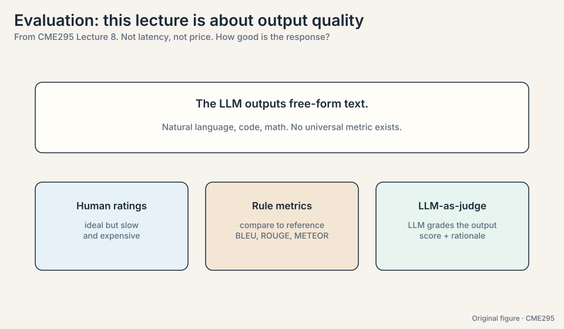

## The key question

Text has no single right answer. How do you score a model when the
output space is infinite and every answer differs?

## Rung 1: human ratings, the unaffordable ideal

The ideal: a human rates every output. Collect the ratings, quantify
the model. Two problems kill it.

**Subjectivity.** "What birthday gift should I get?" answered with "a
teddy bear is almost always a sweet gift" splits raters: one calls it
useful, another calls it vague
([08:22](https://www.youtube.com/watch?v=8fNP4N46RRo&t=502s)). The fix
is **inter-rater agreement**: measure how consistently raters judge,
with clear guidelines and alignment sessions when they drift.

**Cost and speed.** Rating a thousand outputs takes days and real
money. The ideal does not scale.

The naive agreement metric is the **agreement rate**: the fraction of
times two raters give the same verdict
([09:18](https://www.youtube.com/watch?v=8fNP4N46RRo&t=558s)). Watch
it lie. If rater A says "good" with probability P_A and rater B with
P_B, independently, chance agreement is:

**P(agree) = P_A * P_B + (1 - P_A) * (1 - P_B)**

Two scenarios on the same observed 85% agreement:

```ascii
scenario 1: P_A = P_B = 0.5 (balanced)
  chance agreement = 0.25 + 0.25 = 0.50
  observed 0.85 vs chance 0.50: real signal.

scenario 2: P_A = P_B = 0.9 (almost everything is "good")
  chance agreement = 0.81 + 0.01 = 0.82
  observed 0.85 vs chance 0.82: barely above random guessing.
```

Same 85%, opposite conclusions. A raw percentage cannot tell them
apart. The fix is chance-corrected metrics: **Cohen's kappa** for two
raters
([14:56](https://www.youtube.com/watch?v=8fNP4N46RRo&t=896s)),
**Fleiss's kappa** for many, **Krippendorff's alpha** when data is
missing ([16:30](https://www.youtube.com/watch?v=8fNP4N46RRo&t=990s)).
Cohen's kappa is (observed - chance) / (1 - chance): scenario 1 gives
(0.85 - 0.50) / 0.50 = 0.70. Scenario 2 gives (0.85 - 0.82) / 0.18 =
0.17. Positive means better than chance. That is the health metric to
track. Low kappa usually means the rubric is ambiguous, not that the
raters are careless: hold an agreement session and fix the rubric.

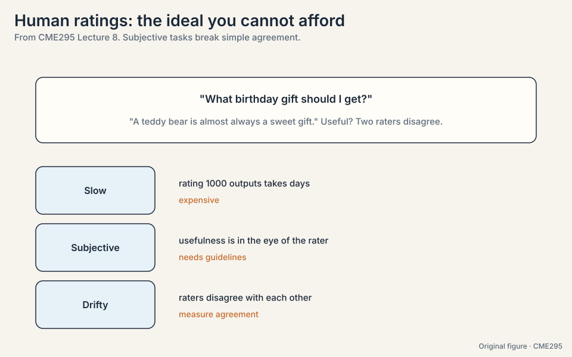
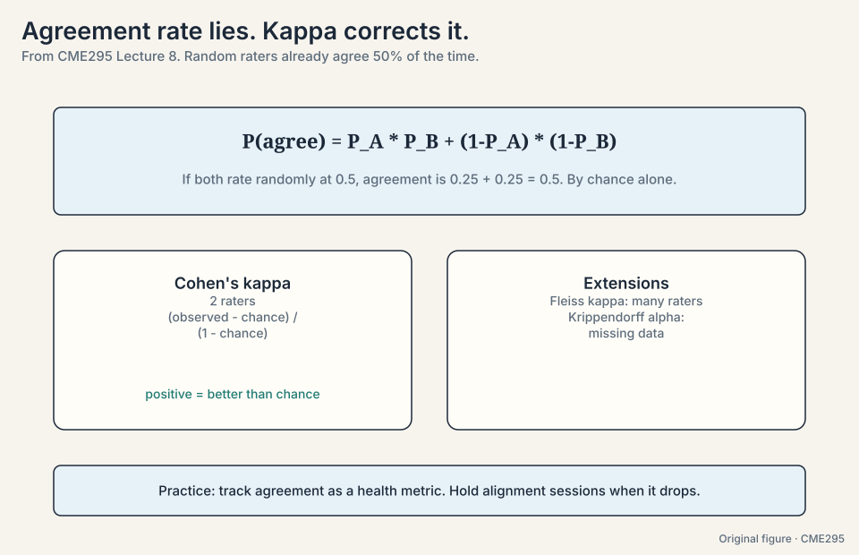

### Subchapter: the rater pipeline

Good human ratings are manufactured, not collected:

1. **Write the rubric.** One page: what counts as good, with
   3-5 worked examples per grade. Ambiguity here becomes kappa
   later.
2. **Pilot.** 50 items, two raters, compute kappa. Below 0.6:
   rewrite the rubric.
3. **Align.** Raters discuss disagreements, converge on edge
   cases. Repeat the pilot.
4. **Scale.** Many raters, each item double-rated on a sample.
   Track kappa weekly: drift means the rubric or the task
   changed.
5. **Audit.** A gold set with known answers, sprinkled in.
   Raters who fail the gold set get retrained or cut.

The cost driver is steps 2-4, not the ratings themselves. The
decision rule: spend on the rubric until kappa clears 0.6, then
spend on volume. Ratings without a pipeline are expensive noise.

> [!QA]
> Q: Walk me through building a human eval for a support chatbot.
> A: Write the rubric first: helpfulness, correctness, tone, each
> with worked examples. Pilot 50 conversations with two raters:
> compute Cohen's kappa per dimension. Below 0.6, rewrite the
> rubric and re-pilot. Align on disagreements. Scale to the full
> set with 10% double-rating for ongoing kappa. Sprinkle gold
> items with known verdicts to catch drift. Report kappa with
> every result: a score without its agreement metric is a rumor.
> Follow-up: When do you stop double-rating?
> A: Never fully: drop to 5% once kappa is stable for a month.
> The moment kappa drifts, the rubric or the task changed, and
> you need the double ratings to see it.

> [!QA]
> Q: Why is chance agreement not zero?
> A: Because agreement has two paths: both say yes or both say no.
> Even coin-flip raters land on the same side half the time. Any
> agreement metric must subtract this baseline, or it rewards raters
> for the base rate instead of their judgment.
> Follow-up: What do you do when kappa is low?
> A: Hold an agreement session: raters discuss disagreements and
> align on the guidelines. Low kappa usually means the rubric is
> ambiguous, not that the raters are careless. Fix the rubric.

## Rung 2: rule-based metrics

Humans write reference outputs once. A metric compares model outputs
to the reference forever. The metric should tolerate paraphrase: the
same content in different words should still score well. Three
classics:

- **BLEU**
  ([25:16](https://www.youtube.com/watch?v=8fNP4N46RRo&t=1516s),
  bilingual evaluation understudy): precision over n-gram matches,
  with a brevity penalty so tiny outputs cannot game it.
  Translation's workhorse.
- **ROUGE**
  ([26:17](https://www.youtube.com/watch?v=8fNP4N46RRo&t=1577s)):
  recall-flavored overlap, many variants. Summarization's workhorse.
- **METEOR**
  ([21:06](https://www.youtube.com/watch?v=8fNP4N46RRo&t=1266s)): an
  F-score over unigram matches times (1 - penalty), where the
  penalty punishes word-order differences via the ratio of
  contiguous matched chunks to matched unigrams. Handles synonyms
  and stems. Carries arbitrary hyperparameters.

Work BLEU on a toy. Reference: "the teddy bear is cute and soft".
Candidate: "the bear is cute".

```ascii
unigram precision: "the", "bear", "is", "cute" all in reference = 4/4 = 1.0
bigram precision:  "the bear" (no), "bear is" (yes), "is cute" (yes) = 2/3 = 0.67
brevity penalty:   candidate length 4 < reference length 7
                   BP = exp(1 - 7/4) = exp(-0.75) = 0.47
BLEU-ish score:    0.47 * (1.0 * 0.67)^(1/2) = 0.47 * 0.82 = 0.39
```

The candidate dropped "teddy" and "soft" and the brevity penalty
punishes it: 0.39 despite perfect unigram precision. Now the real
problem: a candidate with identical meaning but different words
("the stuffed animal is adorable and cuddly") scores near zero on
n-gram overlap. All three metrics share the flaws: paraphrases score
badly, correlation with human judgment is weak, and you still need
human-written references to start. The teddy-bear comfort sentence
in three different wordings defeats all of them.

### Subchapter: BERTScore, embeddings fix paraphrase partly

**BERTScore** replaces n-gram overlap with embedding similarity:
align each candidate token to its most similar reference token
(cosine of contextual embeddings), average the similarities.
"The stuffed animal is adorable" now scores well against "the
teddy bear is cute": similar embeddings, high score. The
paraphrase blindness lifts. Two limits remain. **References are
still required**: no reference, no score. **Correlation is still
imperfect**: embedding similarity is not human judgment, and
fluent nonsense with similar words scores fine. The rung's
lesson: every rule metric trades one blindness for another. The
ladder keeps climbing.

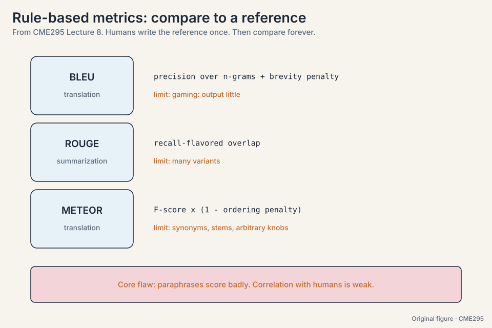

## Rung 3: LLM-as-a-judge

The lecture's key method
([28:08](https://www.youtube.com/watch?v=8fNP4N46RRo&t=1688s)): use an
LLM to grade outputs. Inputs: the prompt, the model response, and the
grading criteria. Outputs: a **rationale** and a **score**. Two
design choices matter:

- **Rationale before score**
  ([32:15](https://www.youtube.com/watch?v=8fNP4N46RRo&t=1935s)).
  Like chain-of-thought, externalizing the reasoning first
  empirically improves the judgment.
- **Binary scale**
  ([29:36](https://www.youtube.com/watch?v=8fNP4N46RRo&t=1776s)).
  Pass/fail beats fine-grained scales: easier for the judge, easier
  for humans to agree on, less noise.

No reference text is needed: the judge brings pretraining knowledge.
Parsing is guaranteed with **structured output**
([34:40](https://www.youtube.com/watch?v=8fNP4N46RRo&t=2080s)):
constrained decoding (Lecture 3) forces the rationale-plus-score
shape. Two modes exist: single-response grading (good or bad?) and
pairwise (A better or B?), the latter generating synthetic
preference labels for reward-model training (Lecture 5's data, made
by machines).

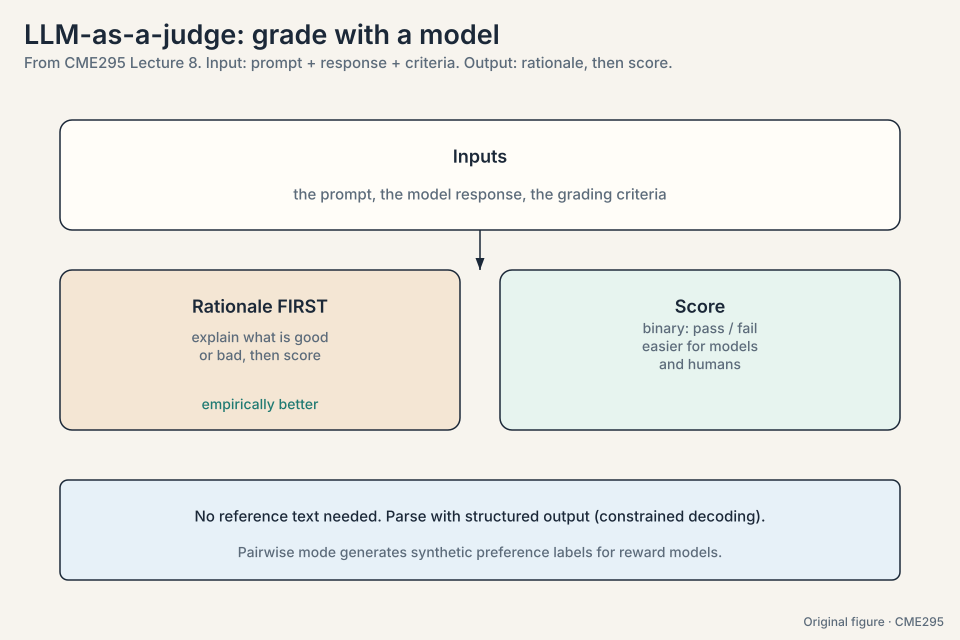

Three biases to watch, none exhaustive. Each demonstrated:

- **Position bias**
  ([38:48](https://www.youtube.com/watch?v=8fNP4N46RRo&t=2328s)).
  The judge prefers whichever answer came first. The toy: A and B
  graded as (A, B) gives "A wins". Graded as (B, A) gives "B wins".
  Same answers, opposite verdicts. Fix: ask both orders, take the
  majority.
- **Verbosity bias**
  ([40:31](https://www.youtube.com/watch?v=8fNP4N46RRo&t=2431s)).
  The judge prefers longer answers. The toy: a 40-word correct-ish
  answer beats a 10-word correct answer, because length reads as
  thoroughness. Fix: say so in the guidelines, show counter-examples,
  or penalize length.
- **Self-enhancement bias**
  ([42:29](https://www.youtube.com/watch?v=8fNP4N46RRo&t=2549s)).
  The judge prefers its own outputs: they look like what it would
  produce, which it already believes is good. Fix: use a different
  model as judge, ideally a bigger one with strong reasoning.

Best practices: crisp guidelines, binary scale, rationale first,
bias mitigations, low temperature (0.1-0.2) for reproducibility
([51:24](https://www.youtube.com/watch?v=8fNP4N46RRo&t=3084s)), and
calibration against human ratings. The judge is a proxy for human
judgment: do not overoptimize the proxy until it diverges from the
truth.

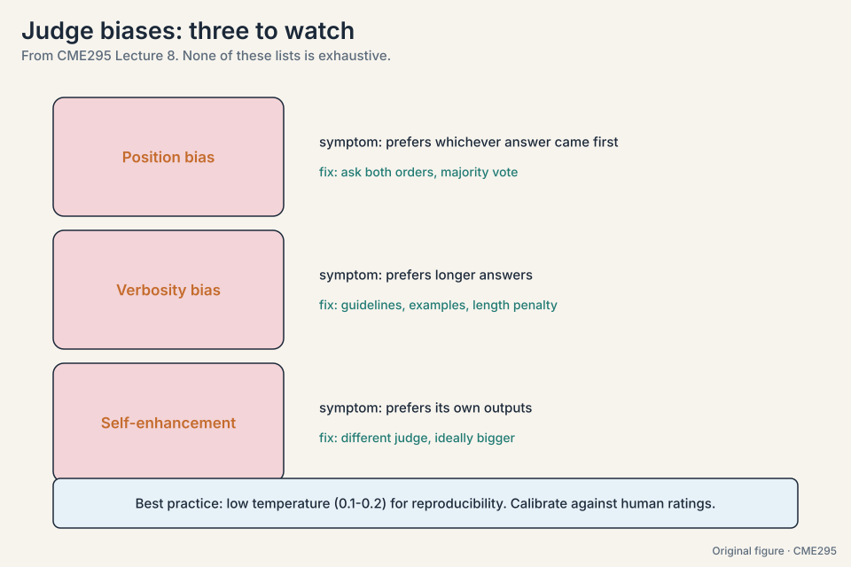

### Subchapter: the judge pipeline, end to end

From rubric to calibrated score, the production pipeline:

1. **Rubric.** Crisp guidelines with worked examples (same
   discipline as human rating).
2. **Prompt.** Prompt + response + criteria. Rationale before
   score. Binary scale. Structured output for the parse.
3. **Sampling.** Temperature 0.1-0.2 for reproducibility.
   Multiple samples for close calls.
4. **Bias controls.** Both orders for pairwise (position),
   length guidance or penalty (verbosity), a different model
   family as judge (self-enhancement).
5. **Calibration.** Score 200-500 items with humans too.
   Measure judge-human agreement (kappa on binary verdicts).
   Below ~0.7: fix the rubric or the prompt.
6. **Monitor.** Re-calibrate on a rolling sample. Judges drift
   as models update: the judge is software, version it.

The pipeline is judge-at-scale plus human-at-the-margin. The
human sample is not optional: an uncalibrated judge is a random
number generator with good grammar.

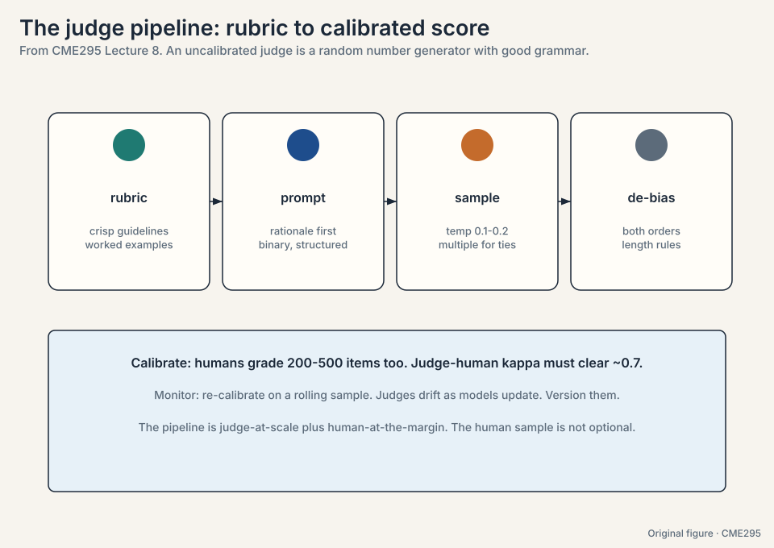

### Subchapter: pairwise judging and Elo, worked

Pairwise judging (A vs B) generates win/loss data. **Elo** turns
wins into ratings. The toy: model A rated 1200, model B rated
1000. Expected score for A: 1/(1 + 10^((1000-1200)/400)) =
1/(1 + 10^(-0.5)) = 1/1.316 = 0.76. A wins: new rating = 1200 +
K*(1 - 0.76), K = 32: 1207.7. B falls symmetrically. A 200-point
gap means ~76% expected win rate. **Bradley-Terry** is the
statistical sibling: it models P(A beats B) = sigma(r_A - r_B)
and fits the ratings by maximum likelihood. Chatbot Arena runs
this at scale: millions of human pairwise votes, Elo/BT ratings,
a live leaderboard. The interview line: "Elo converts votes to
skill. Bradley-Terry is how you fit it."

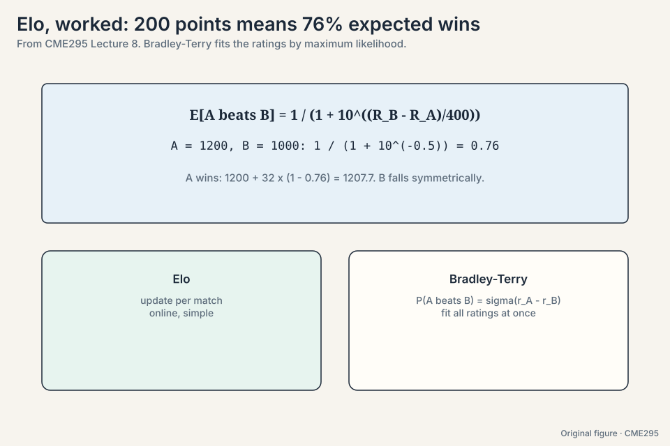

> [!QA]
> Q: Walk me through LLM-as-a-judge on one response, start to finish.
> A: Inputs: the user prompt, the model's response, and the
> grading criteria (say: correctness, with two worked examples).
> The judge prompt asks for rationale first, then a binary
> pass/fail, as structured output. Sample at temperature 0.1.
> The judge writes its reasoning, then the verdict. For
> pairwise: run both orders (A,B) and (B,A) to kill position
> bias, take the majority. Log the rationale: it is the audit
> trail. Then calibrate: humans grade a sample, and judge-human
> kappa must clear ~0.7 or the pipeline is decorative.
> Follow-up: The judge disagrees with humans systematically on
> one category. What now?
> A: The rubric or the prompt is wrong for that category, not
> the judge's intelligence. Add worked examples of the
> disagreement cases to the criteria, re-run calibration. If it
> persists, that category goes back to humans: judges have
> blind spots, and the pipeline must admit it.

> [!QA]
> Q: Why must the judge differ from the generator?
> A: Self-enhancement bias: a model rates its own outputs higher
> because they look like what it would produce, which it already
> believes is good. A separate judge breaks the loop. Bigger and
> stronger-reasoning judges resist being fooled by fluent-but-wrong
> answers.
> Follow-up: If the judge is imperfect, why not skip to human
> ratings?
> A: Cost. The judge screens everything cheaply. Humans audit a
> sample and calibrate the judge. The pipeline is judge-at-scale
> plus human-at-the-margin, not either alone.

## Factuality, fact by fact

Factuality resists binary grading: a paragraph can be mostly right
with two errors. The lecture's method: decompose, check, aggregate.

1. **Extract.** One LLM call turns the text into a list of atomic
   facts
   ([56:23](https://www.youtube.com/watch?v=8fNP4N46RRo&t=3383s)).
2. **Check each.** Binary verdict per fact, using RAG or web search
   against a knowledge base (Lecture 7's machinery, reused).
3. **Aggregate.** Weighted mean over facts. Weights alpha_i capture
   importance.

The example
([54:23](https://www.youtube.com/watch?v=8fNP4N46RRo&t=3263s)):
"Teddy bears, first created in the 1920s, were named after President
Theodore Roosevelt after he proudly wanted to shoot a captured bear."
Work it:

```ascii
fact 1: teddy bears were first created in the 1920s        -> FALSE (it was the 1900s)
fact 2: named after President Theodore Roosevelt           -> TRUE
fact 3: after an incident with a captured bear             -> TRUE
fact 4: he proudly wanted to shoot it                      -> FALSE (he refused)

weights: [0.2, 0.3, 0.2, 0.3]
score = (0*0.2 + 1*0.3 + 1*0.2 + 0*0.3) / (0.2+0.3+0.2+0.3) = 0.5 / 1.0 = 0.5
```

The lecture's worked score on this passage is 0.6 with its own
weighting. The mechanism is the same either way: nuance without
hand-waving, two of four facts wrong, caught individually.

### Subchapter: FActScore, the atomic-fact standard

**FActScore** (Min et al., 2023) standardizes the lecture's
method: decompose a long-form answer into atomic facts, verify
each against Wikipedia, report the fraction supported. The design
decisions: atomic means one claim per fact (no conjunctions to
hide behind). Supported means the knowledge source entails it,
judged by a model plus human audit. The metric punishes the two
classic sins: long answers full of filler (more facts, more
chances to err) and confident hallucinations. The limit: the
knowledge source is the ceiling. Facts newer than Wikipedia, or
outside it, cannot score. The interview line: "FActScore is
precision over atomic facts, with Wikipedia as the ground truth."

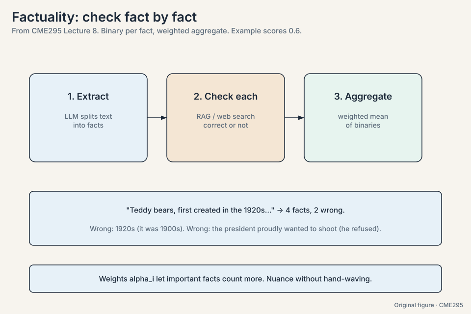

## Evaluating agents

Agents fail at three stages, seven ways (Lecture 7's taxonomy,
applied as an evaluation lens):

**Prediction:** the punt (needed a tool, did not call one,
[63:19](https://www.youtube.com/watch?v=8fNP4N46RRo&t=3799s)), tool
hallucination (called `find_bear` instead of `find_teddy_bear`,
[66:37](https://www.youtube.com/watch?v=8fNP4N46RRo&t=3997s)), wrong
tool, wrong arguments. **Execution:** buggy tool output, or no output
at all: for actions, silence invites false confirmation, so return
even an empty JSON
([77:57](https://www.youtube.com/watch?v=8fNP4N46RRo&t=4677s)) rather
than nothing. **Synthesis:** the model fails to use a good tool
result.

The evaluation lesson: categorize failures methodically and fix them
in groups. One-off debugging does not scale. Taxonomies do.

### Subchapter: pass-hat@k, worked

tau-bench's metric: the probability that *all* k attempts succeed.
The toy: per-attempt success probability p = 0.8, independent.
pass-hat@2 = 0.8^2 = 0.64. pass-hat@5 = 0.8^5 = 0.33. Compare
pass@k (Lecture 6): at least one success, 1 - 0.2^2 = 0.96 for
k = 2. The two metrics answer different questions: pass@k for
"can it ever succeed" (research), pass-hat@k for "does it succeed
reliably" (automation). A 0.8 agent looks great on pass@5 (0.999)
and unusable on pass-hat@5 (0.33). Automation needs the hat.
The decision rule: report pass@k for capability, pass-hat@k for
deployment. Never confuse them.

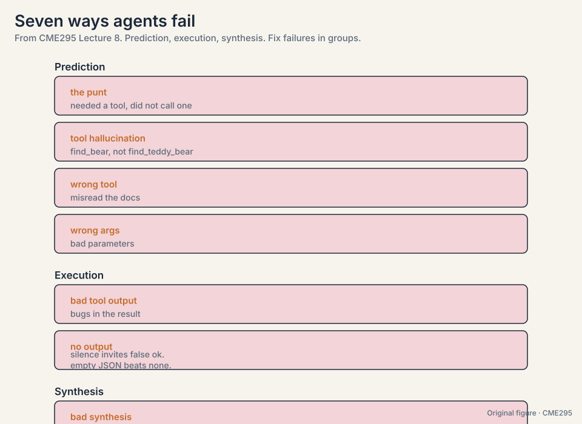

## The benchmark families

Five families cover what benchmarks actually test:

- **Knowledge: MMLU**
  ([85:12](https://www.youtube.com/watch?v=8fNP4N46RRo&t=5112s),
  Massive Multitask Language Understanding). ~60 tasks across law,
  medicine, and everyday topics, four-choice questions. Measures how
  well pretraining stuck. Answer extraction is hard-coded: output the
  letter.
- **Reasoning: AIME and PIQA.** AIME
  ([89:41](https://www.youtube.com/watch?v=8fNP4N46RRo&t=5381s)):
  hard high-school math with integer answers, LLM-friendly by
  construction. PIQA
  ([91:06](https://www.youtube.com/watch?v=8fNP4N46RRo&t=5466s),
  Physical Interaction QA): 20k two-choice common-sense questions
  about the physical world (the hairnet vacuum example).
- **Coding: SWE-bench**
  ([94:12](https://www.youtube.com/watch?v=8fNP4N46RRo&t=5652s)).
  Real GitHub issues from popular Python repos, with the tests from
  the fixing PR. The model writes a patch. Tests before and after
  decide. Test-driven development as a benchmark.
- **Safety: HarmBench**
  ([98:07](https://www.youtube.com/watch?v=8fNP4N46RRo&t=5887s)).
  Standard, copyright, contextual, and multimodal harm categories. A
  trained classifier judges attempts, and an attempt counts if the
  model tries, even if it fails from low capability. Provider
  policies differ, so safety numbers do not compare across labs the
  way accuracy does.
- **Agents: tau-bench**
  ([101:11](https://www.youtube.com/watch?v=8fNP4N46RRo&t=6071s),
  tool-agent-user). Airline and retail domains with tools, policies,
  and tasks. An LLM simulates the user. Success is measured on
  database state. The metric is **pass-hat@k**
  ([103:46](https://www.youtube.com/watch?v=8fNP4N46RRo&t=6226s)):
  the probability that all k attempts succeed, because automation
  needs reliability, not luck.

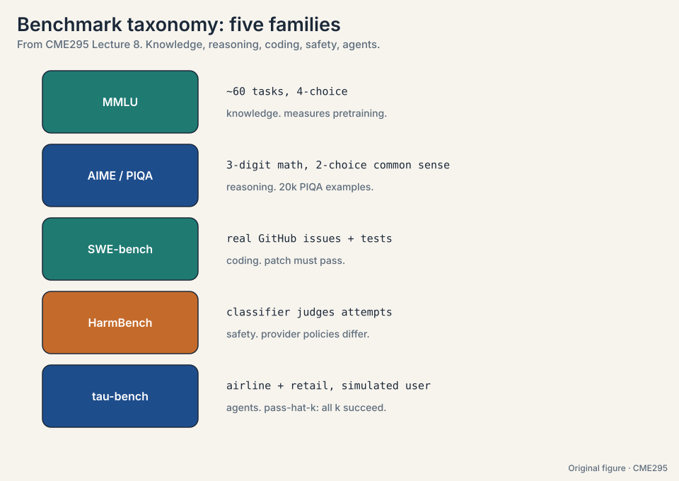

Constrained formats dominate: multiple choice, integer answers, test
suites. Free-form plus LLM-judge adds a second error layer, so
benchmark designers avoid it where they can.

### Subchapter: SWE-bench, worked

The task: a real GitHub issue from a popular Python repo. The
model writes a patch. Grading is test-driven:

1. **FAIL_TO_PASS**: tests that failed before the patch and must
   pass after. The issue is fixed.
2. **PASS_TO_PASS**: tests that passed before and must still
   pass. Nothing broke.

Both must hold. The toy: issue #452, "divide by zero on empty
input". The model's patch adds a guard. FAIL_TO_PASS:
test_empty_input now passes. PASS_TO_PASS: the other 47 tests
still pass. Score: 1. The benchmark's hardness comes from
reality: real issues, real repos, real test suites. The 2026
reality: frontier models score 60-80% on SWE-bench Verified, and
the benchmark is saturated enough that harder variants (SWE-bench
Multimodal, SWE-Lancer) carry the signal now.

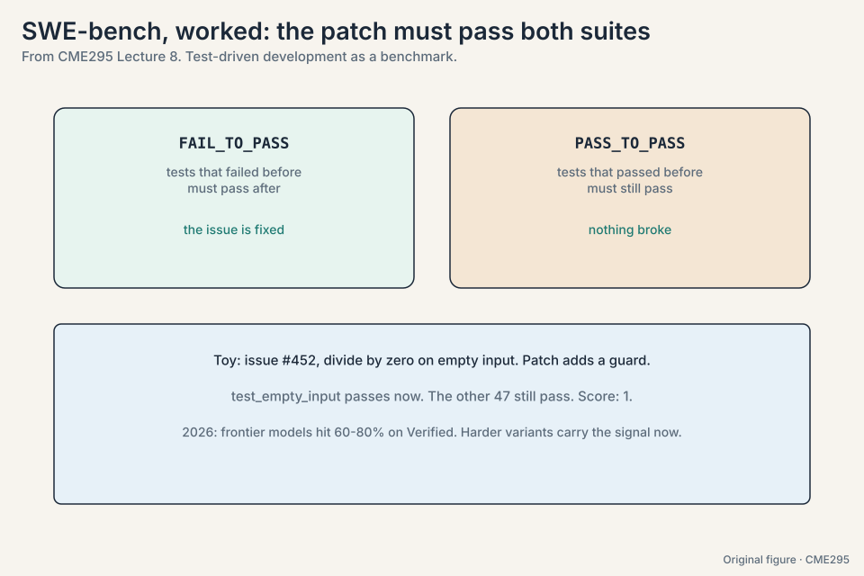

> [!QA]
> Q: Design an eval for a code-review assistant. Which benchmark family, and what do you add?
> A: Start from SWE-bench's design: real issues, test-driven
> grading. But code review is not patch-writing: the output is
> comments, not code. So: build a custom set of PRs with known
> bugs, grade on bug-detection recall (did it flag the real
> bug?) and false-positive rate (did it cry wolf?). Add an
> LLM-judge rung for comment quality, calibrated against senior
> engineers (kappa ~0.7). The decision rule: borrow the
> benchmark's *grading discipline* (deterministic where
> possible), not its task.
> Follow-up: How do you stop the model from gaming it?
> A: Hold out the test set, rotate fresh PRs quarterly, and
> check for contamination (canary strings in the eval data,
> searched in training corpora). A static eval is a future
> training set.

> [!QA]
> Q: Why do benchmarks use constrained formats instead of free-form
> grading?
> A: To remove the judge as an error source. An LLM judge is itself
> imperfect and biased, so free-form benchmarks stack two
> uncertainties: the model's and the judge's. Multiple choice,
> exact integers, and test suites give hard-coded extraction and
> deterministic scoring.
> Follow-up: Does that make benchmarks less realistic?
> A: Yes, deliberately. Benchmarks trade realism for comparability.
> That is why the lecture pairs them with Chatbot Arena (realistic,
> noisy) and personal testing (realistic, specific). One leg never
> stands.

## Reading results like an adult

Benchmarks profile a model. They do not crown one. Four cautions:

- **Pareto frontier**
  ([107:36](https://www.youtube.com/watch?v=8fNP4N46RRo&t=6456s)).
  Plot performance against price (or safety, or context length). The
  toy: model A scores 80 at $1 per million tokens. Model B scores 76
  at $0.10 per million. B is 10x cheaper for 95% of the quality: B
  sits on the frontier, A does not, for cost-sensitive use. The
  frontier is the set of best-per-dollar models. The lecturer's
  personal picks (Sonnet for code, Gemini Flash for cheap-and-fast)
  are personal, not universal.
- **Contamination**
  ([107:49](https://www.youtube.com/watch?v=8fNP4N46RRo&t=6469s)).
  Benchmarks leak into training data. Defenses: hashes, blocklists,
  fresh tests the model cannot have seen.
- **Goodhart's law**
  ([108:26](https://www.youtube.com/watch?v=8fNP4N46RRo&t=6506s)).
  "When a measure becomes a target, it ceases to be a good measure."
  Optimized benchmarks stop measuring.
- **Try it yourself.** Chatbot Arena adds real-usage signal, but the
  final test is your own tasks on your own data.

### Subchapter: the contamination defense stack

Four layers, cheapest first:

1. **Canary strings.** Embed a unique hash in the benchmark.
   Search training corpora for it. Found: contaminated.
2. **Blocklists.** Exclude known benchmark URLs and datasets
   from the crawl. Cheap, incomplete (paraphrases slip through).
3. **Fresh tests.** Write the test set after the model's cutoff.
   The model cannot have seen what did not exist. The gold
   standard, and the reason benchmarks now version by date.
4. **Dynamic benchmarks.** Generate fresh items per evaluation
   (templates, paraphrase engines). Contamination becomes
   impossible in principle, at the cost of comparability across
   runs.

The 2026 norm: any benchmark without a contamination report is
decorative. Read the report before the score.

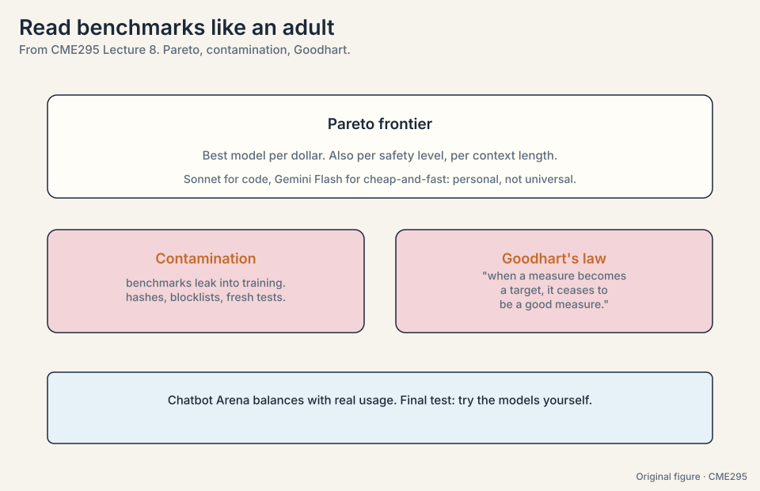

> [!QA]
> Q: A vendor reports 95% on a two-year-old benchmark. Audit it.
> A: Ask four questions. One: contamination report? A two-year-old
> benchmark postdates no frontier cutoff: assume leakage until
> proven otherwise. Two: which split? Test, not validation.
> Three: what changed vs the reference implementation? Decoding
> settings, few-shot count, and cherry-picked subsets all inflate
> scores. Four: what does your own task show? Run your data.
> The decision rule: trust the vendor's number exactly as far as
> the contamination report and your own replication.
> Follow-up: The vendor has no contamination report. Now what?
> A: Treat the number as an upper bound, not a measurement. Run
> a fresh probe: new questions in the same style, written after
> their cutoff. The gap between the reported 95% and your probe
> is the contamination discount.

## Mapping back: each rung answers the previous rung's flaw

| Rung | Fixes | Introduces |
|---|---|---|
| Human ratings | Ground truth, the ideal | Subjectivity and cost. Agreement rate lies (0.85 can be 0.70 or 0.17 kappa) |
| Rule metrics | Cheap, deterministic | Paraphrase blindness: the BLEU toy scores 0.39 on a good answer. Perfect paraphrases score near zero |
| LLM-as-a-judge | Scales, no references | Position, verbosity, self-enhancement biases. Each demonstrated, each with a fix |
| Factuality decomposition | Binary grading is too blunt | Extraction and checking are themselves LLM steps with error |
| Benchmark families | Comparability | Constrained formats trade realism for determinism |
| Adult reading | Numbers that crown | Pareto, contamination, Goodhart: profile, do not crown |

## The honest price

Every rung is a proxy, and every proxy has a price. Humans are
truthful and unaffordable. Rules are cheap and blind. Judges scale
and are biased. Benchmarks compare and distort. The lecture's
honest position: use all of them, trust none of them alone, and keep
a human at the margin calibrating the judge. The moment you
overoptimize any proxy, Goodhart collects.

## Recap: the whole lesson on one screen

The story in eight steps. Each step answers the one before it.

1. **Evaluation means output quality.** Free-form text resists
   measurement. The lecture climbs a ladder of approximations.
2. **Humans are ideal but unaffordable.** Subjective and slow. The
   agreement rate lies: observed 0.85 is kappa 0.70 at balanced
   base rates and 0.17 at 90/10. Chance-correct with kappa, Fleiss,
   Krippendorff. Fix the rubric when kappa drops.
3. **Rule metrics compare to a reference.** BLEU: precision plus
   brevity penalty (the toy scores 0.39). ROUGE: recall-flavored.
   METEOR: F-score with ordering penalty. All punish paraphrase and
   correlate weakly with humans.
4. **Let an LLM grade.** Prompt plus response plus criteria in.
   rationale then score out. Binary pass/fail. Structured output
   guarantees the parse. Pairwise mode makes synthetic preference
   labels.
5. **Judges are biased. Correct them.** Position: both orders, take
   the majority. Verbosity: guidelines, counter-examples, length
   penalty. Self-enhancement: a different, bigger judge. Low
   temperature (0.1-0.2). Calibrate against humans.
6. **Check factuality fact by fact.** Extract atomic facts, verify
   each binary with RAG or search, aggregate with importance
   weights. Two of four facts wrong, caught individually.
7. **Five benchmark families.** MMLU for knowledge, AIME/PIQA for
   reasoning, SWE-bench for coding, HarmBench for safety, tau-bench
   for agents with pass-hat@k (all k must succeed).
8. **Read numbers like an adult.** Pareto: best per dollar. 10x
   cheaper at 95% quality sits on the frontier. Contamination:
   hashes, blocklists, fresh tests. Goodhart: optimized measures
   stop measuring. Then try the models yourself.

## Go deeper

<div style="position:relative;padding-bottom:56.25%;height:0;overflow:hidden;max-width:100%;margin:16px 0;">
<iframe style="position:absolute;top:0;left:0;width:100%;height:100%;" src="https://www.youtube-nocookie.com/embed/8fNP4N46RRo" title="CME295 Lecture 8, Autumn 2025" frameborder="0" allow="accelerometer; autoplay; clipboard-write; encrypted-media; gyroscope; picture-in-picture" allowfullscreen></iframe>
</div>

<div style="position:relative;padding-bottom:56.25%;height:0;overflow:hidden;max-width:100%;margin:16px 0;">
<iframe style="position:absolute;top:0;left:0;width:100%;height:100%;" src="https://www.youtube-nocookie.com/embed/DZf-ZrcmNcI" title="RLHF vs DPO (AI Engineer Masterclass)" frameborder="0" allow="accelerometer; autoplay; clipboard-write; encrypted-media; gyroscope; picture-in-picture" allowfullscreen></iframe>
</div>

- Lecture 8 recording: https://www.youtube.com/watch?v=8fNP4N46RRo
- RLHF vs DPO, LLM-as-judge biases (AI Engineer Masterclass): https://www.youtube.com/watch?v=DZf-ZrcmNcI
- Zheng et al., LLM-as-a-Judge: https://arxiv.org/abs/2306.05685
- Jimenez et al., SWE-bench: https://arxiv.org/abs/2310.06770
- Min et al., FActScore: https://arxiv.org/abs/2305.14251

## Official sources and further reading

**Official:**
- Lecture 8 recording (YouTube): timestamped above.
- Lecture 8 slides (PDF), CME295 Autumn 2025.
- Zheng et al., "LLM-as-a-Judge" (2023):
  - [MT-Bench and Chatbot Arena.](https://arxiv.org/abs/2306.05685)
- Jimenez et al., "SWE-bench" (2023):
  - [issues plus tests.](https://arxiv.org/abs/2310.06770)

**Further reading:**
- Banerjee and Lavie, "METEOR" (2005).
- Papineni et al., "BLEU"
  (2002). Lin, "ROUGE" (2004).
- Cohen (1960): kappa.
- Fleiss (1971)
- Krippendorff (2004).
- Mazeika et al., "HarmBench" (2024).
- Tau-bench authors (2024).
- Min et al., "FActScore" (2023): atomic-fact factuality checking.

**Caveats from these sources.** Judge biases listed are not
exhaustive. The lecture says so explicitly. HarmBench's classifier
judge can itself err. Safety benchmarks encode provider policies, so
cross-lab comparison is limited. tau-bench's simulated user is
itself an LLM.

## Connections to the other courses

- **CS336 L12:** evaluation: perplexity, benchmarks, and
  contamination at systems depth.
- **CS224N L11:** evaluation from the NLP side.
- **CME295 L05:** pairwise judging as synthetic preference data.
- **CME295 L06:** reasoning benchmarks (AIME, HumanEval) as
  verifiable rewards.
- **CME295 L07:** agent failure modes meet their evaluation here.
