## The quarter has a spine

Nine lectures, one spine: the training pipeline. Everything else
attaches to it. Exam scope, stated in the lecture: the final covers
Lectures 5 through 8. The midterm covered 1 through 4
([48:35](https://www.youtube.com/watch?v=Q86qzJ1K1Ss&t=2915s)). Walk
the spine with the numbers that carry each stage.

**L01: the machine.** Tokens in, tokens out. The attention arrow:
softmax(QK^T/sqrt(d_k))V, worked by hand in Lecture 1 (scores
[1,1,2] to weights [0.21, 0.21, 0.58] to [0.79, 0.79]). The 2017
encoder-decoder for translation. Price: N x N scores, 16.7M at
N = 4,096.

**L02: the refinements.** Positions went relative: ALiBi subtracts
m * distance, RoPE rotates Q and K so the dot product keeps only
distance. Norms moved before the sublayer with RMSNorm dropping the
mean. Attention got cheaper (n*w, 8x fewer at n = 4,096, w = 512).
GQA shared 32 KV heads down to 8: 4x smaller cache. BERT: MLM
masks 15% with 80/10/10, NSP is 50/50. T5: span corruption with
sentinels.

**L03: the LLM.** Next-token probabilities at hundreds of billions
of parameters, >90% decoder-only. MoE: y-hat = sum of g_i * E_i(x),
top-1/2 routing, collapse fixed with auxiliary loss. Decoding:
greedy, beam (length-normalized), sampling, top-K, top-P.
Temperature: exp(z_i/T). Guided decoding masks invalid tokens.
Prompting: zero/few-shot, CoT, self-consistency. Inference:
KV cache, paging, MLA, speculative decoding, multi-token
prediction. Decoding is memory-bound: 140 GB moved per token for a
70B model.

**L04: the training.** Transfer learning in three stages.
GPT-3: 6 * 175B * 300B = 3.15e23 FLOPs, 294 GPU-years at 34 TFLOPS.
Chinchilla: 20 tokens per parameter. GPT-3 was 11.7x undertrained.
Systems: data/ZeRO/tensor/pipeline. FlashAttention (~10x fewer HBM
accesses, exact). Mixed precision. SFT: loss on outputs only.
LoRA: W = W0 + BA at rank 4, 512x fewer params on a 4096 block.
QLoRA: NF4 plus double quantization, ~16x VRAM.

**L05: the taste.** SFT cannot say "not this". Bradley-Terry:
P(i beats j) = sigma(r_i - r_j). PPO-clip: min(rA, clip(r,
1-eps, 1+eps)A). The toy shows r = 1.5 clipped to 1.2. Best-of-N is
the free baseline. DPO solves RLHF in closed form: two models, beta
~ 0.1, watch distribution shift.

**L06: the reasoning.** Think-then-answer, billed as output tokens.
pass@k = 1 - C(n-c,k)/C(n,k). The toy lifts 0.3 to 0.533 at k = 2.
Verifiable rewards: the checker is free. GRPO: z-score inside the
group (+1.73 for the winner, -0.58 for the losers), no value
function. Length bias: the 1/|o_i| term rewards long failures. DAPO
and Dr. GRPO fix it. R1: cold-start SFT, RL, big SFT with rejection
sampling (3:1, 200k), final RL, then distillation.

**L07: the world.** RAG: retrieve, augment, generate. ~500-token
chunks. Bi-encoder recall to 100, cross-encoder precision to top k.
BM25 for keywords. HyDE, contextual retrieval, prompt caching.
Tool calling: predict, execute, respond. Tool selection routes. MCP
standardizes. ReAct loops observe, plan, act until the goal is met.
Seven failure modes. Two-layer safety.

**L08: the judgment.** Output quality for free-form text. Human
ratings need chance correction (0.85 agreement is kappa 0.70 or 0.17
depending on base rates). Rule metrics (BLEU, ROUGE, METEOR) punish
paraphrase. LLM-as-a-judge: rationale then score, binary,
structured output. Correct position, verbosity, self-enhancement
biases. Factuality: extract, check, aggregate. Benchmarks: MMLU,
AIME, PIQA, SWE-bench, HarmBench, tau-bench with pass-hat@k. Read
like an adult: Pareto, contamination, Goodhart.

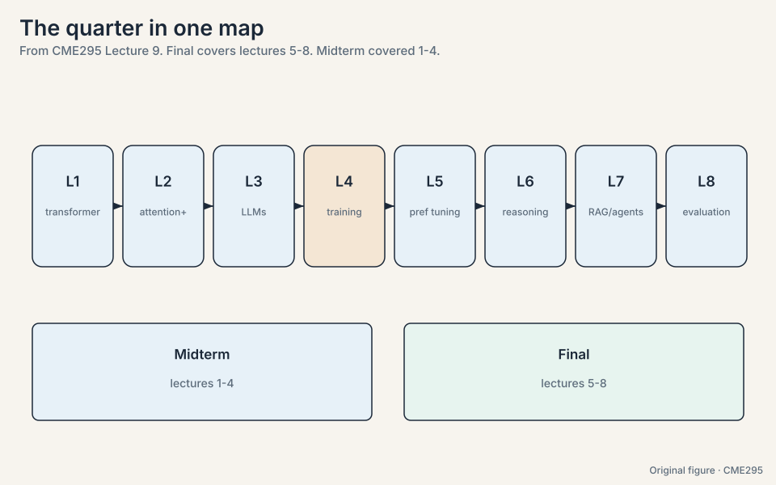

### Subchapter: the exam map

The final covers Lectures 5-8. What each lecture tests, and the
question it rewards:

- **L05 (preference tuning).** Bradley-Terry, PPO-clip, DPO's
  four steps. Rewards: derive the loss, explain the clip, compare
  PPO vs DPO by memory and data.
- **L06 (reasoning).** GRPO's z-score, the length-bias bug, R1's
  stages. Rewards: work the toy numbers, name the failure modes.
- **L07 (RAG/agents).** The retrieval funnel, BM25 vs
  embeddings, ReAct, the seven failures. Rewards: design a
  pipeline, debug a trace.
- **L08 (evaluation).** Kappa, the judge's biases, benchmark
  families. Rewards: read numbers skeptically, design an eval.

L01-L04 are background vocabulary: the attention formula, RoPE,
the 6ND rule, Chinchilla. The exam tests the back half's
decisions, not the front half's derivations.

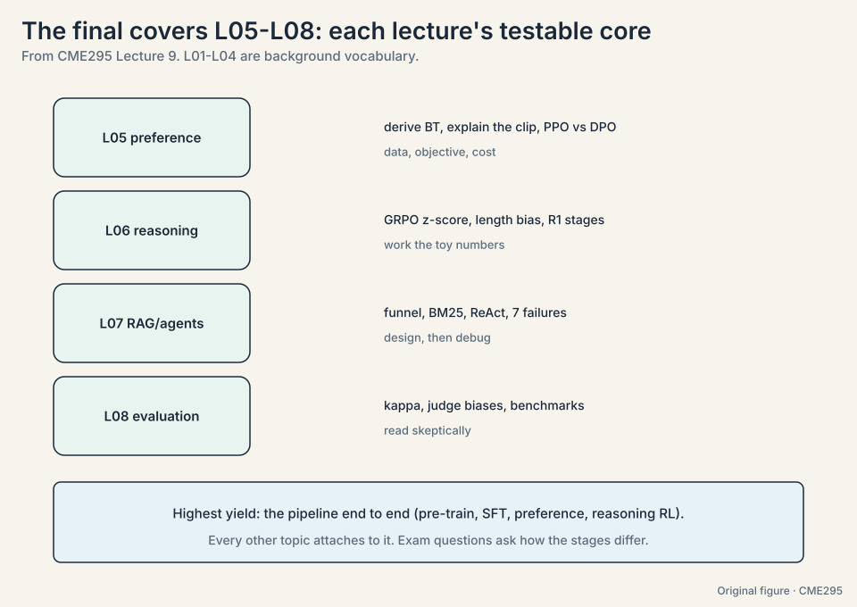

> [!QA]
> Q: The lecture asks "which wall forces the change". Name three walls and the changes they forced.
> A: One: inference is sequential (1,000 tokens need 1,000
> passes). Forced: speculative decoding, and the diffusion
> paradigm itself. Two: the KV cache grows with context.
> Forced: GQA, MLA, paging, quantization. Three: human data is
> finite and the web turned synthetic. Forced: curation as a
> discipline, mid-training as a stage, verifiable rewards as a
> label-free signal. The pattern: every wall is a scaling wall,
> and every change either removes the wall or routes around it.
> Follow-up: Which wall is still standing?
> A: Continuous learning: weights freeze at training time and
> RAG is a patch. Hallucinations: a design choice of next-token
> prediction, not a bug to fix. Those two are research, not
> engineering.

> [!QA]
> Q: How should I study this recap for the final?
> A: The final covers Lectures 5-8, so weight the back half:
> preference tuning math, GRPO vs PPO, RAG retrieval stages, judge
> biases, and the benchmark families. Use Lectures 1-4 as background
> vocabulary, not as the main target. For each lecture, reproduce
> its recap grid from memory before checking.
> Follow-up: What is the single highest-yield topic?
> A: The training pipeline end to end: pre-train, SFT, preference
> tuning (PPO/DPO), reasoning RL (GRPO). Every other topic attaches
> to it, and exam questions tend to ask how the stages differ in
> data, objective, and cost.

## The key question

The 2017 machine is proven. What is the next machine, and which wall
forces the change?

## The problem: can the same machine see

The transformer was born for translation and conquered text. The
question: tokens are just vectors, so why not vectors from
elsewhere?

**Vision Transformer** ([53:02](https://www.youtube.com/watch?v=Q86qzJ1K1Ss&t=3182s),
ViT, 2020). Take a 224 x 224 image, split it into 16 x 16 patches:

```ascii
224 / 16 = 14 patches per side -> 14 * 14 = 196 patches
each patch: 16 * 16 pixels * 3 colors = 768 numbers
project 768 -> 768 (linear layer), add position embeddings, add [CLS]
sequence: 197 tokens, exactly like BERT's input
run the transformer encoder, project the [CLS] embedding through an FFN to classify
```

With enough image data, it beats convolutional networks. The result
surprised people because of **inductive bias**
([54:33](https://www.youtube.com/watch?v=Q86qzJ1K1Ss&t=3273s)).
CNNs bake in a sliding-window bias: look locally, like a human eye.
ViT has almost none: every patch attends to every patch. The toy
version of the argument: with 1M images, the CNN's built-in locality
wins. With 300M images, the model learns spatial structure itself
and the bias becomes a constraint. Bias helps when data is scarce.
data wins when it is abundant.

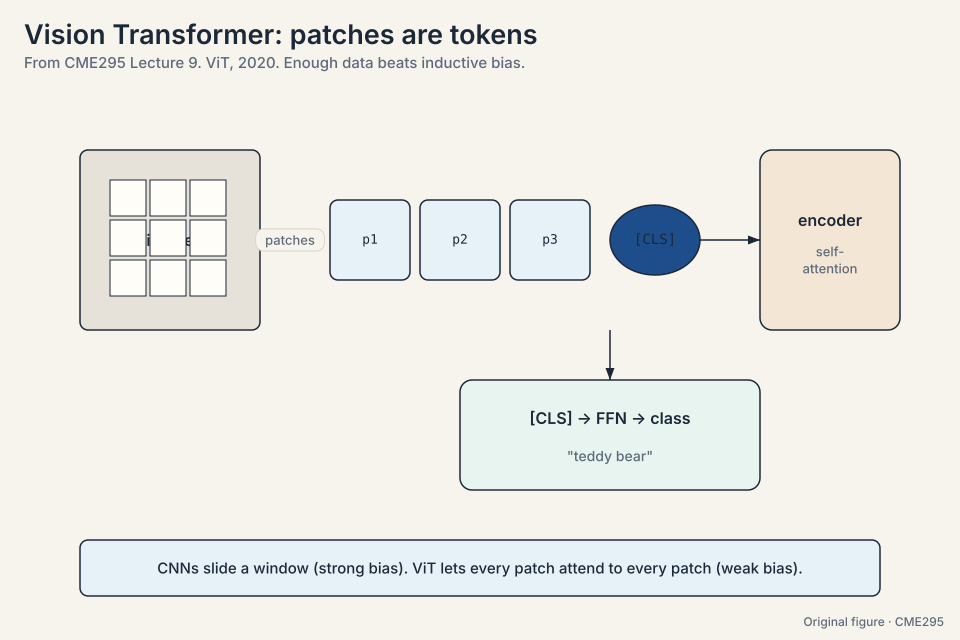

### Subchapter: the inductive-bias argument, quantified

The toy version of the argument, with the crossover:

```ascii
1M images:   CNN (strong locality bias) wins. ViT underfits: too
             little data to learn spatial structure.
300M images: ViT wins. The CNN's bias is now a constraint: it
             cannot use the extra data as well.
```

Inductive bias is a bet about the world. The bet pays when data
is scarce (the model cannot afford to learn the structure) and
costs when data is abundant (the structure is learnable, and the
bias forbids better structures). The same argument recurs: RoPE
vs learned positions (weak bias wins at scale), MoE routing
(learned routing beats fixed), even pre-training itself (learn
from data beats hand-built features). The pattern: strong priors
for small data, weak priors for big data. The interview line:
"Bias is a loan against data. Big data repays it."

### Subchapter: DeepSeek OCR's token argument

The lecture's closing provocation: image patches as tokens carry
text meaning in very few tokens. A rendered page (text as image,
patched) encodes emojis, layout, fonts, and style that a text
tokenizer splinters into dozens of tokens or mangles. The
argument: tokenizers are a lossy, arbitrary discretization. Pixels
are universal. If patches beat BPE on text-heavy images, the
tokenizer itself is the bottleneck, not the model. Open question,
not settled: rendering text as images costs resolution and
compute. But it reframes the L01 tokenization lecture: maybe the
right "token" was never a text piece at all.

> [!QA]
> Q: When does strong inductive bias beat weak bias plus data?
> A: When data is scarce or the bias is exactly right. The 1M-image
> toy: the CNN's locality wins because 1M images cannot teach
> spatial structure from scratch. The general rule: strong bias
> when the data cannot cover the hypothesis space, weak bias when
> it can. The trap is keeping the strong bias after data arrives:
> then it is a constraint, not a help. Audit every architectural
> bias against current data scale, not the scale it was designed
> for.
> Follow-up: Name a bias the field already retired this way.
> A: Learned absolute positions gave way to RoPE: the weak
> relative bias scaled better. Fixed dense attention gave way to
> GQA and sliding windows: full attention was a bias toward
> "everything matters", and it did not survive long contexts.

**Vision-language models** answer questions about images. Two
wirings:

- **Concatenate** (most common). An image encoder produces image
  tokens. Append the text tokens. Run a decoder-only LLM
  autoregressively. LLaVA is the popular open-weights example
  [uncertain: transcript renders the name as "LAVA"].
- **Cross-attention**
  ([61:06](https://www.youtube.com/watch?v=Q86qzJ1K1Ss&t=3666s), less
  common). Keep text in the main stream. Let image features enter at
  cross-attention layers. Llama 3's multimodal variant works this
  way.

The traffic runs both directions: **diffusion transformers** (DiT,
[62:29](https://www.youtube.com/watch?v=Q86qzJ1K1Ss&t=3749s)) use
self-attention to generate images, and transformers appear in
recommendation, speech, and more.

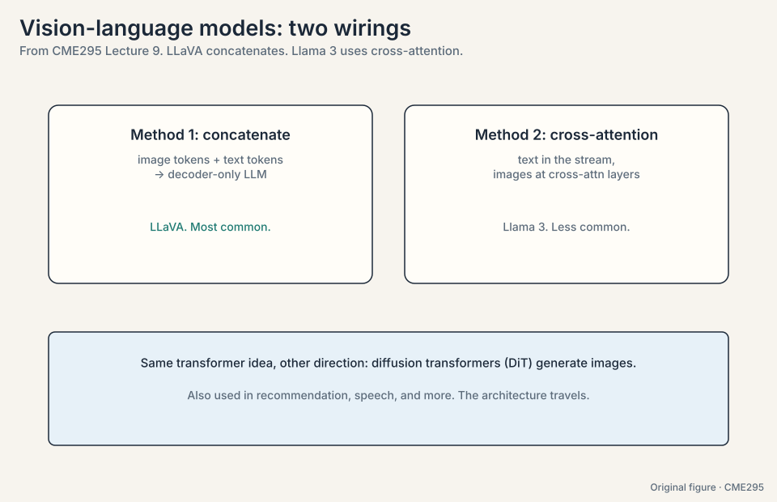

## The problem: autoregressive inference is sequential

Autoregressive generation has a structural cost. Each token needs
all previous ones, so a 1,000-token answer needs 1,000 forward
passes. Training parallelizes (the causal mask lets one pass score
all positions), but inference does not.

**Diffusion**, born in image generation, offers another paradigm.
Start from noise: Gaussian noise is easy to sample, models cleanly,
and supplies randomness. Learn a transformation from noise to the
data distribution. The sculptor analogy (Michelangelo: the statue is
already in the marble. Remove what is not statue): the forward
process adds noise gradually, the reverse process predicts the noise
to remove.

Text is discrete, so "noise" needs a translation. The current
answer: **noise is to images what the [MASK] token is to text**.
Masked diffusion models (MDM), also called diffusion LLMs (DLLM):

- **Forward:** progressively mask more tokens until the sequence is
  all masks.
- **Reverse:** starting from all masks plus the prompt, predict the
  tokens behind the masks. Repeat for N steps.

Work the arithmetic. A 1,000-token answer:

```ascii
autoregressive: 1,000 forward passes (one per token)
masked diffusion with N = 32 steps: 32 forward passes
speedup: 1000 / 32 = 31x in passes (reported end-to-end speedups reach ~10x on long outputs
([80:34](https://www.youtube.com/watch?v=Q86qzJ1K1Ss&t=4834s)))
```

The intuition is draft-to-refine: like writing a speech from an
outline, the model goes from coarse to fine rather than left to
right. A second win: **fill-in-the-middle** coding
([81:13](https://www.youtube.com/watch?v=Q86qzJ1K1Ss&t=4873s)),
where the model must complete code given both sides. Bidirectional
context suits diffusion naturally.

Google showed an experimental text diffusion model at I/O
([67:49](https://www.youtube.com/watch?v=Q86qzJ1K1Ss&t=4069s));
startups including Inception pursue it. **LLaDA** (early 2025,
[79:38](https://www.youtube.com/watch?v=Q86qzJ1K1Ss&t=4778s)) works
through the math. Status: catching up to autoregressive models, not
yet at the frontier. Open work: porting reasoning chains and the
rest of the autoregressive toolkit to diffusion.

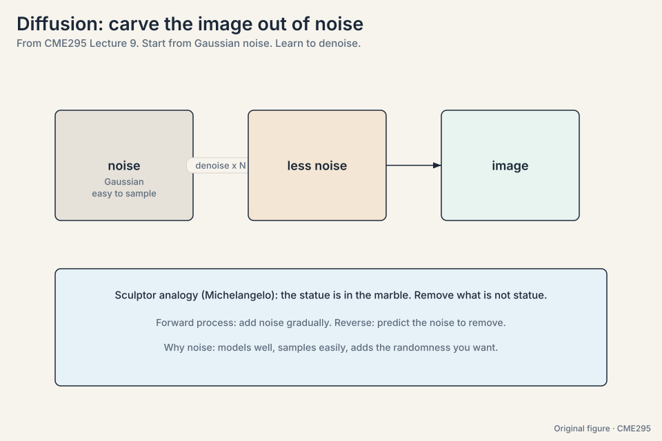
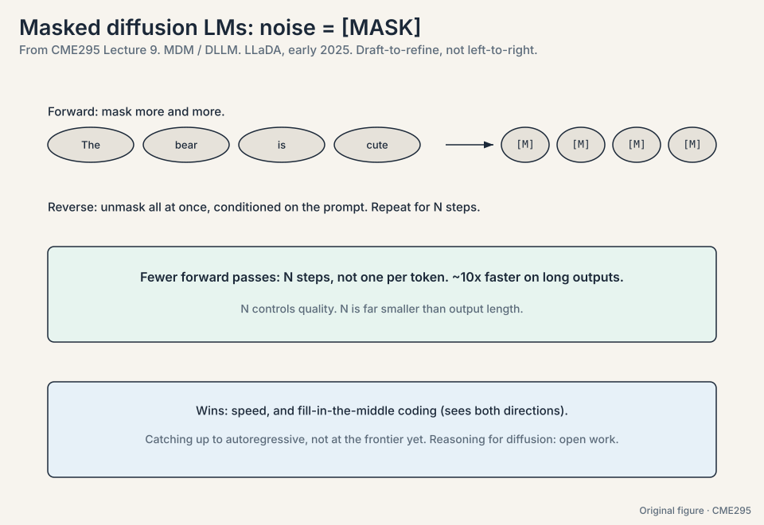

### Subchapter: block diffusion, the practical middle

Pure masked diffusion unmasks all positions in parallel: fast,
but positions cannot condition on each other within a step.
Autoregressive decoding conditions fully: slow, one token per
pass. **Block diffusion** splits the difference: decode left to
right in blocks, diffuse within each block. The toy: 1,000 tokens
in 10 blocks of 100, N = 8 diffusion steps per block: 80 forward
passes instead of 1,000, with left-to-right conditioning between
blocks. Quality approaches autoregressive (each block sees all
previous blocks), speed approaches diffusion. The 2026 frontier
models (Mercury, Inception's line) use block or semi-autoregressive
variants: the pure-parallel dream loses to the hybrid in
practice. The interview line: "Blocks are the compromise the
field converged on."

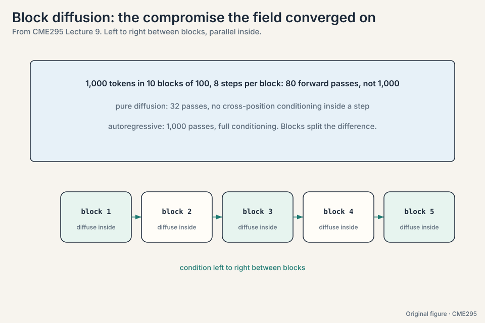

> [!QA]
> Q: Walk me through masked diffusion on a 12-token answer, start to finish.
> A: Forward (training): take the 12-token answer, mask 3 tokens,
> then 3 more, and so on until all 12 are [MASK]. The model
> learns to predict the masked tokens from the unmasked ones at
> every corruption level. Reverse (inference): start from 12
> [MASK] plus the prompt. Step 1: predict all 12, keep the 3 most
> confident, re-mask the rest. Step 2: predict the 9 masked, keep
> 3 more. Repeat: 4 steps of 3 tokens each unmask the answer.
> Confidence-ordered unmasking is the mechanism: easy tokens
> first, hard ones with more context.
> Follow-up: Why confidence-ordered, not left-to-right?
> A: Because the model can. Autoregressive decoding is forced
> left-to-right by its factorization. Diffusion has no such
> constraint, so it unmasks the sure tokens first and spends
> later steps on the hard ones. That is the draft-to-refine
> intuition, mechanized.

> [!QA]
> Q: Why is text harder for diffusion than images?
> A: Images are continuous: you can add a little Gaussian noise to a
> pixel. Tokens are discrete: there is no "slightly noisy cat". The
> mask token is the workaround, an all-or-nothing corruption. The
> math has to be rebuilt around it, which is what LLaDA does.
> Follow-up: If diffusion is 10x faster, why has it not won?
> A: Speed is one axis. Quality is the other, and autoregressive
> models have a decade-long head start in training recipes,
> tooling, and ecosystem (reasoning chains, RL, agents). Diffusion
> must re-earn all of it. The lecture presents it as promise, not
> victory.

## Ideas cross-pollinate

The lecture's closing theme: modalities borrow from each other.

- **Vision borrows transformers** from text (DiT replaces
  convolutions in diffusion).
- **Text borrows diffusion** from vision (MDM/DLLM).
- **Positions generalize**: RoPE, born for 1D text, gets
  reformulated in 2D for images and multimodal layouts.
- **DeepSeek OCR**
  ([85:54](https://www.youtube.com/watch?v=Q86qzJ1K1Ss&t=5154s)):
  image patches as tokens carry text meaning in very few tokens,
  suggesting tokenizers may not be the best representation after
  all. Patches already encode emojis, layout, and style that text
  tokenizers splinter.

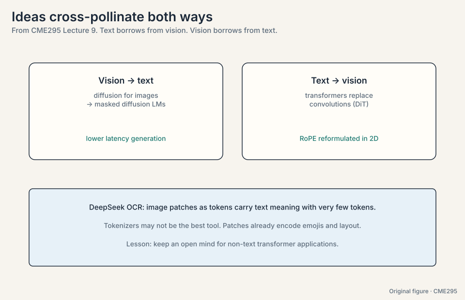

## The design space is still open

Transformer details are not settled. Papers still move every knob:

- **Optimizer.** Adam's reign is challenged. The Kimi K2 paper
  ([89:13](https://www.youtube.com/watch?v=Q86qzJ1K1Ss&t=5353s))
  introduces **Muon**, with **MuonClip** as the candidate new
  standard ([89:22](https://www.youtube.com/watch?v=Q86qzJ1K1Ss&t=5362s)).
- **Normalization.** Post-norm to pre-norm (Lecture 2), and layer
  norm to RMSNorm
  ([90:31](https://www.youtube.com/watch?v=Q86qzJ1K1Ss&t=5431s)):
  location and type both still move.
- **Attention.** Per-layer variants differ across papers. No fixed
  design.
- **Activations.** ReLU gave way to GELU (Gaussian error linear
  units, [91:36](https://www.youtube.com/watch?v=Q86qzJ1K1Ss&t=5496s))
  and friends. New ones still appear.
- **Scale choices.** MoE or dense, head counts, FFN widths: all
  debated.

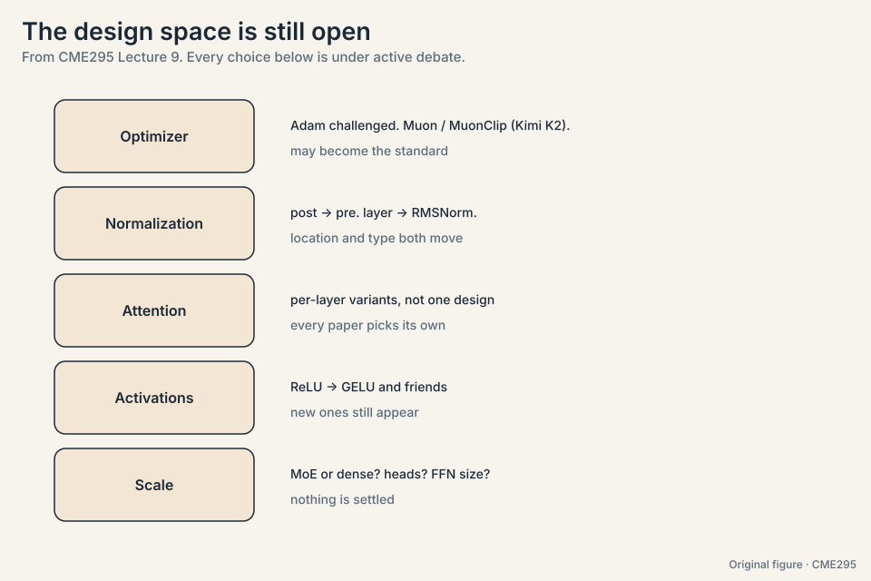

### Subchapter: Muon, what changed

Adam adapts per-parameter learning rates from gradient history.
**Muon** (Kimi K2 paper) takes a different path: it orthogonalizes
the gradient update via Newton-Schulz iteration, approximating the
closest orthogonal matrix to the gradient. The intuition: gradient
descent on matrices works better when the update preserves the
matrix's geometry instead of scaling each entry independently.
**MuonClip** adds the stability fix. Reported result: faster
convergence than Adam on large transformer training, at similar
per-step cost. Status: a candidate standard, not the standard.
Adam still trains most models. The interview point: the optimizer
is not settled law. When a lab reports a new one with real
speedups at scale, the field pays attention, because optimizer
gains multiply every training run ever.

### Subchapter: the frontier as of October 2026

Where the lecture's open questions stand now:

- **Diffusion LLMs.** Block-diffusion models (Mercury-class)
  serve production traffic for latency-sensitive coding. Quality
  still trails the best autoregressive models on reasoning.
  LLaDA's math got ported, extended, and partially absorbed.
- **SLMs.** Small models won the cost war: most API volume runs
  on sub-30B models. The Pareto frontier the lecture predicted
  is the market now.
- **Agents.** Agentic browsing shipped (Atlas and followers).
  Security remains the gate: prompt injection is unsolved,
  certificate-style guarantees are still proposals.
- **Reasoning.** RLVR + GRPO became the standard training stack
  (Lecture 6's recipe, industrialized).
- **Data.** Mid-training is standard. Provenance filtering is a
  product category. The 80%-synthetic pressure did not relent.

The walls that moved: inference cost (down, via SLMs and
speculation), reasoning (up, via RLVR), data quality (sideways:
better curation, worse raw web). The walls that did not:
hallucinations (still design, not bug), continuous learning
(still frozen weights), interpretability (still early).

> [!QA]
> Q: You have one research bet for the next two years. Where do you place it?
> A: On the data wall, specifically provenance and synthetic-data
> discipline. Every lab faces the same 80%-synthetic pressure,
> and the winner is whoever trains on the cleanest distribution.
> It compounds: better data improves every model the lab trains,
> unlike an architecture tweak that helps one run. Second choice:
> inference economics (block diffusion, better speculation):
> the lab that serves reasoning 10x cheaper owns the agent
> market. Both bets are on walls, not fashions.
> Follow-up: Why not bet on a new architecture?
> A: Architectures are lottery tickets with long odds: the
> transformer survived a decade of challengers. Walls are
> certainties: the data wall and the cost wall exist regardless
> of architecture. Bet on certainties.

## The problem: data is the new bottleneck

Early LLMs scraped a human-written internet. That world is gone: the
lecture estimates ~80% of search results are now LLM-generated
([93:04](https://www.youtube.com/watch?v=Q86qzJ1K1Ss&t=5584s))
[uncertain: speaker's estimate]. Training on synthetic text causes
**model collapse**
([94:17](https://www.youtube.com/watch?v=Q86qzJ1K1Ss&t=5657s)).
Watch the mechanism on a toy. Human text uses 100 words with
frequencies spread wide. Model text reuses the top 20. Train the
next model on model text: the distribution narrows further, the top
10 dominate. Each generation is less diverse than the last, and
learning degrades: the model trains on a shrinking shadow of the
original distribution.

Responses: data-curation companies, and a new pipeline stage,
**mid-training**
([93:41](https://www.youtube.com/watch?v=Q86qzJ1K1Ss&t=5621s)):
after pre-training, before fine-tuning, train on a large but
higher-quality corpus. Pre-train, mid-train, fine-tune.

### Subchapter: the collapse math, formalized

The toy, generation by generation. Human text: 100 words, Zipf
spread. Model G1 trained on it: samples the top 20 words
disproportionately (models concentrate mass). G2 trained on G1's
output: the top 10 dominate. G3: the top 5. Each generation's
training distribution is the previous generation's *sample*,
and sampling concentrates. Formally: if each generation keeps
probability mass p on the head and the head shrinks, the tail
probability decays geometrically: tail_G3 ~ tail_G1 * c^2 for
some c < 1. The tails (rare words, rare facts, minority
viewpoints) vanish first. That is why collapse is a diversity
catastrophe, not just a quality dip: the model forgets what it
never sees. Defenses: filter synthetic data out (provenance),
mix in fresh human data every generation (the tail must be
re-seeded), and mid-train on curated corpora.

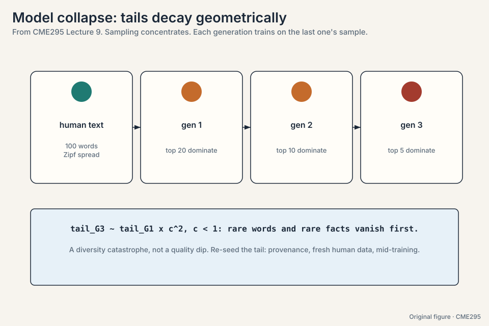

### Subchapter: mid-training, the new stage

The pipeline gains a stage between pre-training and fine-tuning:

```ascii
pre-train:  trillions of tokens, raw web, broad
mid-train:  hundreds of billions, curated, high-quality
fine-tune:  millions, task-specific
```

Mid-training exists because raw pre-training data got worse (the
80%-synthetic estimate) while fine-tuning data is too small to
fix foundations. It re-trains the base on the good stuff: books,
papers, filtered code, textbooks, at a scale that moves the
weights' priors. The economics: mid-training costs ~10% of
pre-training and buys back much of the quality the raw web lost.
The 2026 norm: no serious base model ships without it. The
interview line: "Mid-training is pre-training on the internet we
wish we had."

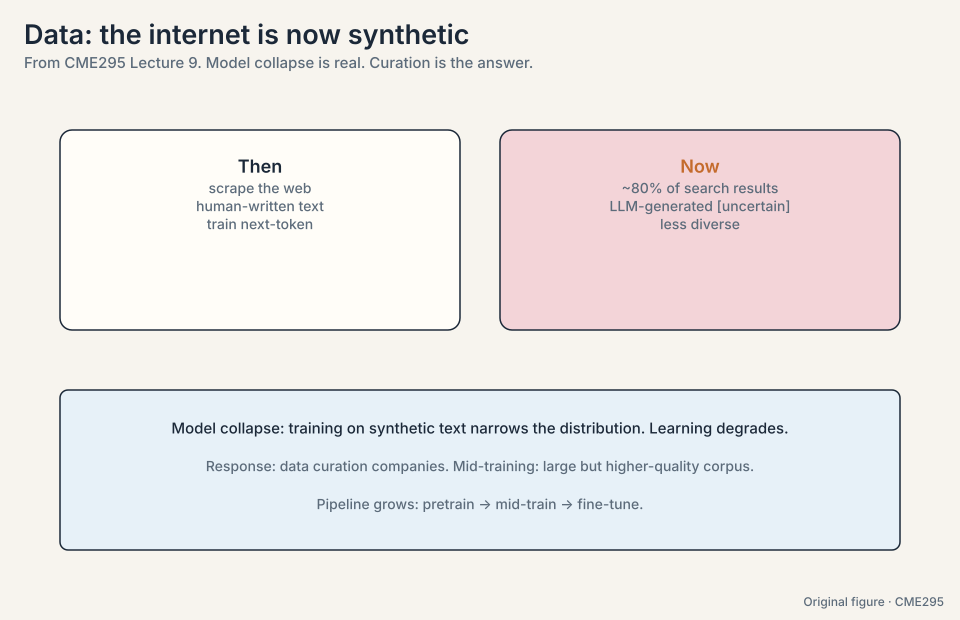

## What comes next

**Smaller models.** Benchmarks saturate. The next Pareto border is
quality per dollar. Small language models (SLM,
[96:13](https://www.youtube.com/watch?v=Q86qzJ1K1Ss&t=5773s)) serve
the common cases cheaply. Providers reportedly lose money even on
top tiers, so inference economics will drive research.

**Hardware.** GPUs are matrix-multiply machines, but attention's
QK^T is a different beast (hence FlashAttention). A September paper
[uncertain: not named] prototypes analog hardware where physical
properties (Kirchhoff-style summation) perform the operations as a
side effect: latency and energy fall together.

**Agents for everyone.** ChatGPT's Atlas (October launch,
[104:32](https://www.youtube.com/watch?v=Q86qzJ1K1Ss&t=6272s))
points at agentic browsing for non-experts. Security is the gate:
prompt injection and exfiltration need answers, maybe
certificate-style guarantees for AI-safe browsing, maybe OS-level
LLM integration.

**The hard core.** Customer-service AI as the maturity test
([105:58](https://www.youtube.com/watch?v=Q86qzJ1K1Ss&t=6358s)):
humans want empathy and groundedness that system prompts cannot
fake. Continuous learning (weights are frozen. RAG is a patch),
hallucinations (a core design choice of next-token prediction, not
a bug; [107:34](https://www.youtube.com/watch?v=Q86qzJ1K1Ss&t=6454s)),
personalization, interpretability, safety.

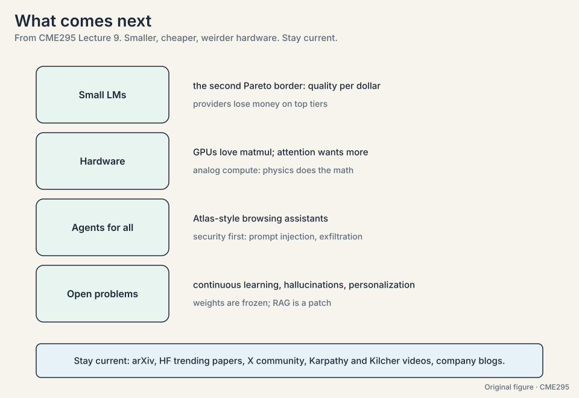

**Staying current.** arXiv and NeurIPS for papers, plus the authors'
codebases (HuggingFace trending papers replaced Papers with Code).
X has the conversation. YouTube explainers: Yannic Kilcher covered
the transformer paper back in 2017
([109:10](https://www.youtube.com/watch?v=Q86qzJ1K1Ss&t=6550s));
Andrej Karpathy is the recommended educator
([109:28](https://www.youtube.com/watch?v=Q86qzJ1K1Ss&t=6568s)).
Company blogs for the frontier. And the course's own study guide,
updated yearly and translated into other languages
([109:45](https://www.youtube.com/watch?v=Q86qzJ1K1Ss&t=6568s)).

## Recap: the whole lesson on one screen

The story in eight steps. Each step answers the one before it.

1. **The spine is the pipeline.** Pre-train (3.15e23 FLOPs for
   GPT-3), SFT (loss on outputs), preference tuning (sigma(r_w -
   r_l)), reasoning RL (GRPO z-scores). Final covers Lectures 5-8.
2. **ViT: patches are tokens.** 224 x 224 image, 16 x 16 patches:
   196 tokens plus [CLS]. Weak inductive bias plus big data beats
   CNNs. Data wins when it is abundant.
3. **Two ways to wire vision to language.** Concatenate image and
   text tokens (LLaVA, common) or inject images at cross-attention
   (Llama 3, rarer). Diffusion transformers generate images with
   the same attention.
4. **Diffusion carves data from noise.** Gaussian noise is easy to
   sample and models cleanly. Forward: add noise. Reverse: predict
   the noise to remove. The sculptor analogy.
5. **For text, mask is noise.** MDM/DLLM: forward masks
   progressively, reverse unmasks in N fixed steps. 1,000 tokens in
   32 passes instead of 1,000. Natural for fill-in-the-middle.
   LLaDA works the math.
6. **Modalities borrow both ways.** Vision takes transformers
   (DiT). Text takes diffusion (MDM). RoPE goes 2D. DeepSeek OCR
   shows patches carry text meaning in few tokens.
7. **Data is the new bottleneck.** ~80% of search results are
   LLM-generated [uncertain]. Training on it causes model collapse:
   each generation trains on a narrower shadow. Answers: curation
   and mid-training.
8. **Cheaper, weirder, harder.** SLMs chase quality per dollar.
   Analog hardware may redo the physics. Agents go mainstream
   behind security work. Open: continuous learning,
   hallucinations-as-design, personalization, safety.

## Go deeper

<div style="position:relative;padding-bottom:56.25%;height:0;overflow:hidden;max-width:100%;margin:16px 0;">
<iframe style="position:absolute;top:0;left:0;width:100%;height:100%;" src="https://www.youtube-nocookie.com/embed/Q86qzJ1K1Ss" title="CME295 Lecture 9, Autumn 2025" frameborder="0" allow="accelerometer; autoplay; clipboard-write; encrypted-media; gyroscope; picture-in-picture" allowfullscreen></iframe>
</div>

<div style="position:relative;padding-bottom:56.25%;height:0;overflow:hidden;max-width:100%;margin:16px 0;">
<iframe style="position:absolute;top:0;left:0;width:100%;height:100%;" src="https://www.youtube-nocookie.com/embed/W2gVx1PIbF4" title="LLaDA: Large Language Diffusion Models (paper explained)" frameborder="0" allow="accelerometer; autoplay; clipboard-write; encrypted-media; gyroscope; picture-in-picture" allowfullscreen></iframe>
</div>

- Lecture 9 recording: https://www.youtube.com/watch?v=Q86qzJ1K1Ss
- LLaDA paper explained: https://www.youtube.com/watch?v=W2gVx1PIbF4
- Dosovitskiy et al., ViT: https://arxiv.org/abs/2010.11929
- Nie et al., LLaDA: https://arxiv.org/abs/2502.09992
- Shumailov et al., model collapse: https://arxiv.org/abs/2305.17493

## Official sources and further reading

**Official:**
- Lecture 9 recording (YouTube): timestamped above.
- Lecture 9 slides (PDF), CME295 Autumn 2025.
- Dosovitskiy et al., "ViT" (2020): [paper](https://arxiv.org/abs/2010.11929)
- Nie et al., "LLaDA" (2025): https://arxiv.org/abs/2502.09992

**Further reading:**
- Liu et al., "LLaVA" (2023).
- Touvron et al., "Llama 3" (2024).
- Peebles and Xie, "DiT" (2022): diffusion transformers.
- Shumailov et al., "The Curse of Recursion" (2023): model
  collapse.
- Kimi K2 technical report (2025): the Muon optimizer.

**Caveats from these sources.** "LLaVA" is rendered "LAVA" in the
transcript [uncertain]. The 80%-synthetic figure is the speaker's
live estimate [uncertain]. The analog-hardware paper is unnamed in
the transcript [uncertain]. Timeline months for model releases are
as stated live. Trending topics are explicitly not exam material.

## Connections to the other courses

- **CS336 L17:** multimodality: vision-language models at systems
  depth.
- **CS336 L04:** linear attention and the efficiency program
  diffusion joins.
- **CS224N L13:** speech and BCIs: transformers beyond text,
  continued.
- **CME295 L01-L08:** the recap spine. Each card links back to its
  lecture.
