30 minutes · interview speed

This page tells the whole story fast. Each section gives you the working
version: enough to answer interview questions with confidence. Links at
the end of each section take you into the full lesson when you want the
derivations, the timestamps, and the follow-ups.

### 1. Word meaning is a vector

The astounding result that opens the course: word meaning can be represented
well by a high-dimensional vector of real numbers. Before 2013, meaning lived
in hand-built lists like WordNet: synonyms, hypernyms, human labor. Lists
miss nuance ("proficient" is not always "good"), miss new senses ("ninja"),
and give no graded similarity.

The old encoding was one-hot: one 1, the rest 0s, dimension 500,000+. Every
pair is orthogonal. "Seattle motel" never matches "Seattle hotel."

<figure class="crash-fig">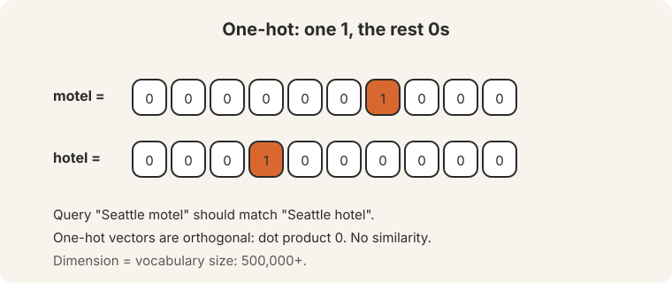<figcaption>One-hot: orthogonal, no similarity. 500,000+ dimensions.</figcaption></figure>

The fix: learn dense vectors so similar words get high dot products.

<ul class="crash-links">
<li><a href="l01-intro-word-vectors.html">Lecture 1: introduction and word vectors</a></li>
</ul>

### 2. Know a word by the company it keeps

Distributional semantics (Firth, 1957): a word's meaning comes from the words
that appear nearby. Word2vec's skip-gram slides a window over the corpus and
predicts context words from the center word. The objective is the average
negative log likelihood. Softmax turns dot products into probabilities:
exponentiate, normalize over the vocabulary.

Training is stochastic gradient descent on sampled windows. The noise helps.
Two vectors per word (center v, outside u), averaged at the end.

<figure class="crash-fig">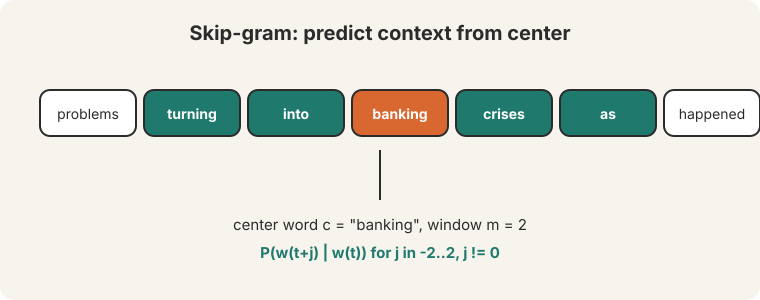<figcaption>Predict context words from the center word, window size m.</figcaption></figure>

<ul class="crash-links">
<li><a href="l01-intro-word-vectors.html">Lecture 1: introduction and word vectors</a></li>
</ul>

### 3. The vectors work, and the softmax is too expensive

Neighbors prove the geometry: "bread" and "croissant" share sign patterns.
"USA" sits near Canada, America, U.S.A. Analogies demo the offsets:
king - man + woman = queen. Cherry-picked, the lecturer admits, and nobody
uses analogies in production.

The naive softmax costs 400,000 dot products per prediction. Negative
sampling fixes it: train k+1 logistic regressions, one real pair against k
negatives. GloVe takes the counting route: ratios of co-occurrence
probabilities carry the signal (ice vs steam isolates the solid-gas axis),
and the dot product approximates log co-occurrence plus biases.

<figure class="crash-fig">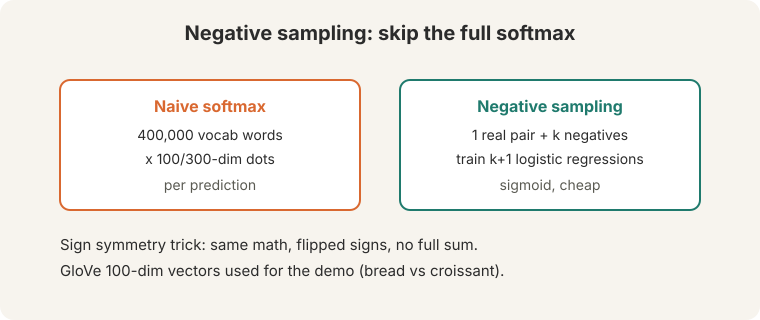<figcaption>Skip the 400K-word softmax: train a few logistic regressions.</figcaption></figure>

Evaluate intrinsic (analogies, similarity ratings) for speed, extrinsic
(downstream NER) for truth. One vector per word is a superposition of its
senses.

<ul class="crash-links">
<li><a href="l02-word-vectors-2.html">Lecture 2: word vectors 2 and word senses</a></li>
</ul>

### 4. Backprop is the chain rule, applied efficiently

A layer is an affine map plus an activation: z = Wx + b, h = sigma(z). Stack
them. The chain rule multiplies local Jacobians: ds/dz = ds/dh x dh/dz.
Forward is function application. Backward is the chain rule applied
efficiently. Store every intermediate on the way down, reuse on the way up,
never recompute. Autograd packages each operation's backward rule as Lego.
verify new layers with numeric gradient checking.

<figure class="crash-fig">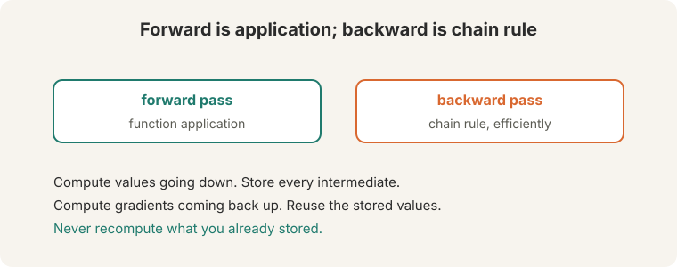<figcaption>Forward applies and stores; backward reuses. Never recompute.</figcaption></figure>

<ul class="crash-links">
<li><a href="l03-neural-networks-backprop.html">Lecture 3: neural networks and backpropagation</a></li>
</ul>

### 5. Parsing: dense beats sparse

"Scientists count whales from space": space whales, or counting from space.
Prepositional-phrase attachment makes human language globally ambiguous.
Dependency parsing represents grammar as head-to-dependent arcs with labels.

Transition-based parsing uses three actions (SHIFT, LEFT-ARC, RIGHT-ARC) on a
stack and buffer: greedy, linear time, trained by an oracle. The old approach
used millions of sparse indicator features, each seen ~10 times in a million
sentences. Feature computation dominated runtime. Chen and Manning (2014)
replaced them with dense embeddings of words, POS tags, and labels:
concatenate, ReLU, softmax over actions. 92 UAS at transition-parser speed.
Google's Parsey McParseface pushed it to 94.6 with depth and beam search.

<figure class="crash-fig">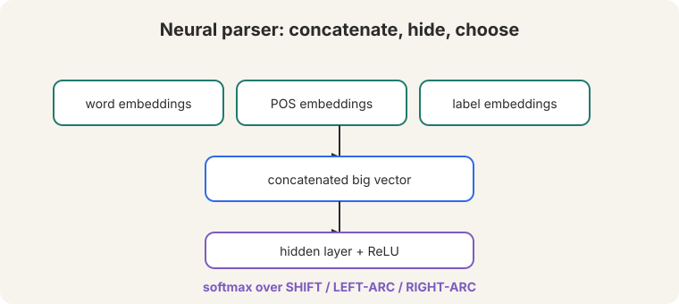<figcaption>Concatenate embeddings, ReLU, softmax over SHIFT/LEFT-ARC/RIGHT-ARC.</figcaption></figure>

<ul class="crash-links">
<li><a href="l04-dependency-parsing.html">Lecture 4: dependency parsing</a></li>
</ul>

### 6. Language models and RNNs

A language model assigns a probability to every next word: "the most
important concept in the class." N-grams count trigrams, but sparsity kills
them (unseen gets 0, seen-once gets 1) and the tables are huge.

RNNs apply one weight set at every step: h(t) = tanh(W_h h(t-1) + W_e x(t) +
b). The hidden state is memory. Each step outputs a vocabulary distribution.
sample to generate. Two fatal problems: the strict t=1..T order cannot be
parallelized, and distant context fades.

<figure class="crash-fig">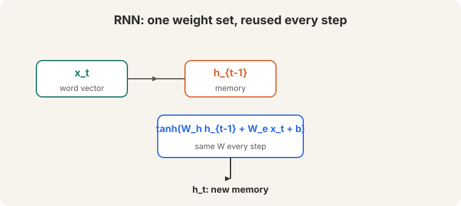<figcaption>One weight set, reused every step. The hidden state is memory.</figcaption></figure>

<ul class="crash-links">
<li><a href="l05-language-modeling-rnns.html">Lecture 5: language modeling and RNNs</a></li>
</ul>

### 7. LSTMs protect memory; seq2seq translates

Backprop through 30 steps multiplies the Jacobian 30 times. Eigenvalues below
1 vanish the gradient. Above 1 explode it. Vanishing is worse: it is silent.
Clip exploding norms at 5, 10, or 20.

The LSTM (1997) guards a cell state with three gates. Forget is really
"remember." The cell update is additive, so gradients flow. Bidirectional
LSTMs concatenate both directions. Seq2seq wires two LSTMs for translation:
the encoder's final state seeds the decoder. The bottleneck: one fixed vector
must hold the whole sentence.

<figure class="crash-fig">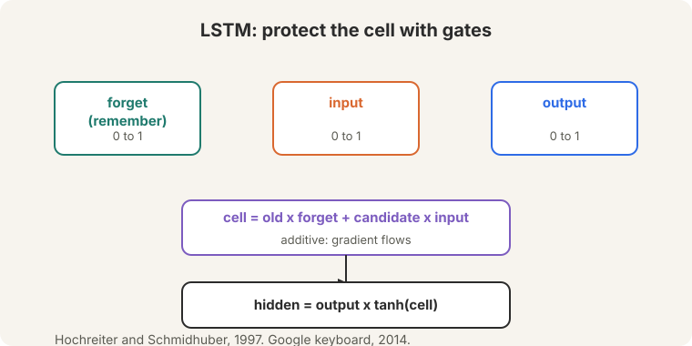<figcaption>Three gates guard the cell; the additive update preserves gradients.</figcaption></figure>

<ul class="crash-links">
<li><a href="l06-lstms-nmt.html">Lecture 6: LSTMs and neural machine translation</a></li>
</ul>

### 8. Attention: look back like a human

Seq2seq stuffs a sentence into one vector. A human translator looks back at
the source while writing. Attention (Bahdanau, 2015) gives the network the
same ability: on each decoder step, query the encoder states, score them,
softmax into weights, take the weighted average, concatenate, predict. Bonus:
shorter gradient paths fight vanishing.

<figure class="crash-fig">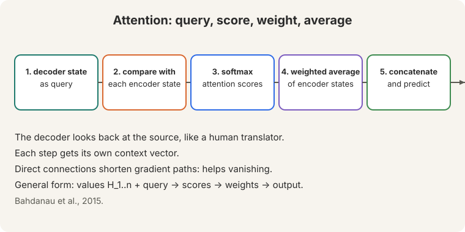<figcaption>Query, score, weight, average, predict. Bahdanau et al., 2015.</figcaption></figure>

<ul class="crash-links">
<li><a href="l07-attention.html">Lecture 7: attention</a></li>
</ul>

### 9. Transformers: attention everywhere

RNNs fail twice: linear interaction distance ("the chef who went to the
stores ... was") and O(n) sequential steps. Attention fixes both: constant
distance, full parallelism. Self-attention is a set operation, so positional
encoding injects order (sinusoidal or learned). Mask the future with minus
infinity or training cheats. Scale dots by sqrt(d_k). Multi-head: 8 heads,
64+ dims each. Residuals carry gradient 1. LayerNorm normalizes per word. The
block repeats: attention, add-and-norm, feedforward, add-and-norm.

This is a bridge lesson: the CS224N framing lives here, deep mechanics in
CS336 (architecture, linear attention, KV cache).

<figure class="crash-fig">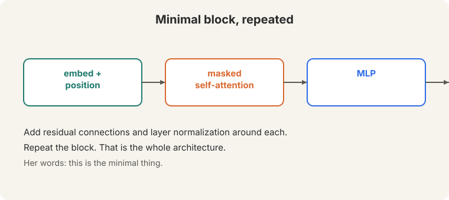<figcaption>Embed plus position, masked self-attention, MLP, residuals, repeat.</figcaption></figure>

<ul class="crash-links">
<li><a href="l08-transformers.html">Lecture 8: transformers (bridge)</a></li>
<li><a href="../cs336/l03-architecture.html">CS336 L03: the modern architecture</a></li>
</ul>

### 10. Pretraining reconstructs the input

Mask part of a sentence, predict it back, repeat over trillions of words.
One objective teaches trivia, syntax, coreference, semantics, sentiment, and
world models. BERT: 15% masking, segment embeddings, CLS token, 110M/340M
params. GLUE was a sea change. GPT scales the same idea: 117M to 1.5B to
175B, with in-context learning (examples in the prompt, no weight updates).
Chinchilla corrected the sizing: smaller models on more data win. Recipe:
pretrain, continue pretraining on task data, fine-tune. Warning: fluent but
frequently wrong.

<figure class="crash-fig">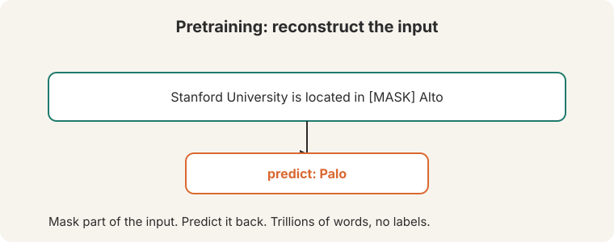<figcaption>Mask the input, predict it back. Trillions of words, no labels.</figcaption></figure>

<ul class="crash-links">
<li><a href="l09-pretraining.html">Lecture 9: pretraining (bridge)</a></li>
<li><a href="../cs336/l09-scaling-laws.html">CS336 L09: scaling laws</a></li>
</ul>

### 11. Post-training: from prompting to DPO

Few-shot prompting needs no gradient updates. Chain of thought adds a scratch
pad: zero-shot "let's think step by step" jumps 17.7 to 78.7. Instruction
tuning (FLAN's 3M+ examples, LIMA's 1,000) teaches models to follow
instructions. RLHF: instruction-tune, learn a reward model from pairwise
preferences (Bradley-Terry: P = sigma(r1-r2)), optimize with a KL leash.
Optimizing a learned metric invites reward hacking: gibberish, verbosity,
authoritative-over-truthful. DPO skips the reward model: the normalizer
cancels, leaving binary classification. 9 of 10 open leaderboard models use
it.

<figure class="crash-fig">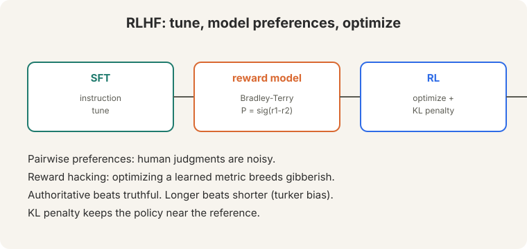<figcaption>SFT, reward model, RL with KL penalty. Hacking is the failure mode.</figcaption></figure>

<ul class="crash-links">
<li><a href="l10-prompting-post-training.html">Lecture 10: prompting and post-training (bridge)</a></li>
<li><a href="../cs336/l15-post-training.html">CS336 L15: post-training</a></li>
</ul>

### 12. Evaluation: never just believe numbers

BLEU counts n-gram overlap plus a brevity penalty. ROUGE counts recall. Both
fail: "yep" scores 0 against "heck yes" (false negative), "heck no" matches
words while meaning the opposite (false positive). Human eval is the gold
standard and it is noisy: 67% agreement after hours of rubrics. Chatbot Arena
collects 200,000 pairwise votes into Elo ratings. LLM judges are 100x faster
and cheaper, with 98% rank correlation, but length bias (~70%) and monoculture
lurk. The harness moves the number: LLaMA 65B MMLU reads 63.7, 63.6, or 48.8
depending on setup. Never just believe numbers.

<figure class="crash-fig">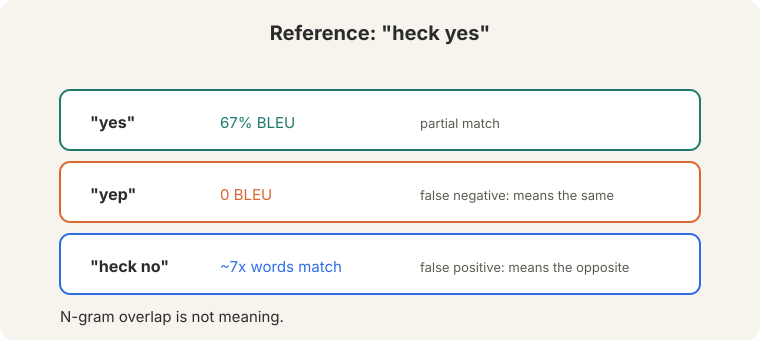<figcaption>Overlap is not meaning: false negatives and false positives.</figcaption></figure>

<ul class="crash-links">
<li><a href="l11-evaluation.html">Lecture 11: evaluation (bridge)</a></li>
<li><a href="../cs336/l12-evaluation.html">CS336 L12: evaluation</a></li>
</ul>

### 13. Train it efficiently

bf16 is the sweet spot: 2 bytes, 8 exponent bits, fp32 range, no gradient
scalers, needs Ampere+. Mixed-precision training costs 16 bytes per parameter
per GPU: 2 params, 2 grads, 4 master, 4 momentum, 4 variance. DDP replicates
and all-reduces. ZeRO shards (optimizer, then gradients, then parameters).
LoRA trains a low-rank delta W + (alpha/r)BA on attention matrices and merges
it at inference: no latency. The sustainability warning: training demand
outruns global compute capacity.

<figure class="crash-fig">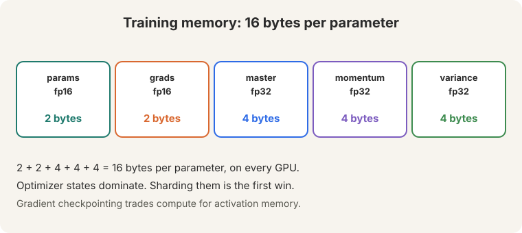<figcaption>16 bytes per parameter per GPU. Optimizer states dominate.</figcaption></figure>

<ul class="crash-links">
<li><a href="l12-efficient-training.html">Lecture 12: efficient training (bridge)</a></li>
<li><a href="../cs336/l02-resource-accounting.html">CS336 L02: resource accounting</a></li>
</ul>

### 14. Speech from the brain

Locked-in patients have working brains and unresponsive bodies. Letter boards
take minutes per sentence. Eye-tracking tires. In 2017, imagined movement
drove a virtual keyboard at ~40 chars/min peak. Participant T12's four
implanted arrays (two in motor cortex, two in Broca's area) decode speech in
real time: motor cortex carries the signal. Word error rate ~25% here, near
zero at UC Davis after continuous training. Speed: 60-70 wpm against 150
natural. Frontier: decode inner speech, and drive 3D avatars from phonemes
plus articulation.

<figure class="crash-fig">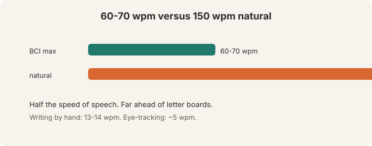<figcaption>60-70 wpm decoded versus 150 natural. Far ahead of every alternative.</figcaption></figure>

<ul class="crash-links">
<li><a href="l13-speech-bci.html">Lecture 13: speech brain-computer interfaces</a></li>
</ul>

### 15. Reasoning, agents, and life after DPO

Reasoning comes in three flavors: deductive, inductive, abductive. Prompt it
with chain of thought. Stabilize it with self-consistency (sample, majority
vote). Test it with counterfactuals: base-9 arithmetic separates memorization
from reasoning. An agent is a network in a loop: observation, action, goal.
2024's reframing is trajectory modeling: "chain of thought prompting in a
loop." Benchmarks (MiniWoB, WebArena, WebLinx) show a huge human-model gap.
models make trivial unrecoverable mistakes.

After DPO, alignment's questions are: online versus offline (fresh data and
fresh labels win), self-rewarding loops, beyond-pairwise methods (KTO,
Starling, SteerLM), and whether reward models just match distributions. Data
is a moat: Meta bought 1.5M comparisons for LLaMA 2.

<figure class="crash-fig">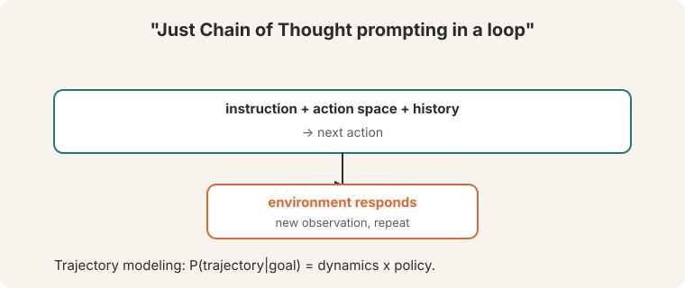<figcaption>Instruction plus history predicts the next action. Repeat.</figcaption></figure>

<ul class="crash-links">
<li><a href="l14-reasoning-agents.html">Lecture 14: reasoning and agents</a></li>
<li><a href="l15-life-after-dpo.html">Lecture 15: life after DPO (bridge)</a></li>
<li><a href="../cs336/l16-rlvr.html">CS336 L16: RLVR</a></li>
</ul>

### Rapid-fire Q&A

**Q: Why did word2vec need negative sampling?**
A: The softmax normalizes over 400,000 words per prediction. Negative
sampling trains k+1 logistic regressions instead.

**Q: What is backpropagation in one sentence?**
A: The chain rule applied efficiently: one backward sweep reusing stored
intermediates.

**Q: Why is vanishing worse than exploding?**
A: Exploding is visible and clippable. Vanishing is silent: nothing learns.

**Q: Why did attention beat recurrence?**
A: Constant interaction distance plus full parallelization. The LSTM had
neither.

**Q: Why mask the future?**
A: Otherwise the model reads the answer during training and learns nothing.

**Q: What does pretraining teach?**
A: Trivia, syntax, coreference, semantics, sentiment, world models. Form, not
truth: fluent but frequently wrong.

**Q: What is DPO's trick?**
A: The intractable normalizer cancels in Bradley-Terry, leaving binary
classification. No reward model, no RL.

**Q: Why not trust BLEU?**
A: Overlap is not meaning. "yep" scores 0. "heck no" scores well.

**Q: What costs 16 bytes per parameter?**
A: Mixed-precision Adam training: 2 params + 2 grads + 4 master + 4 momentum
+ 4 variance, per GPU.

**Q: Online or offline alignment?**
A: Online: fresh data from the policy, refreshed labels. April-May 2024
papers agree it matters.

