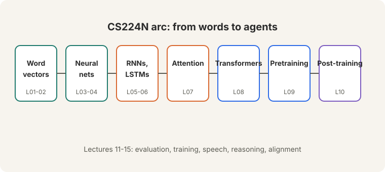
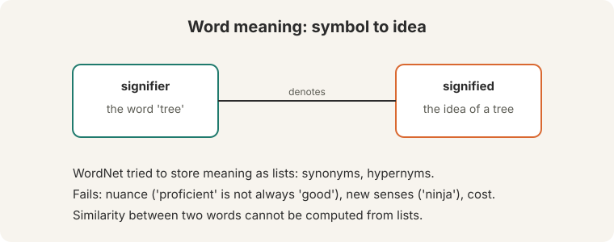
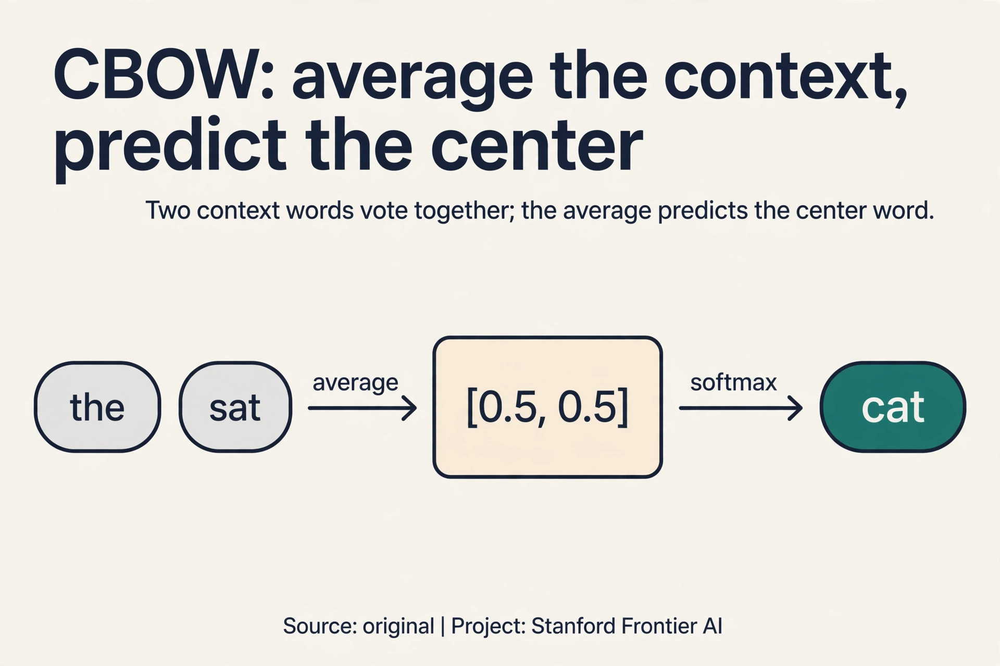
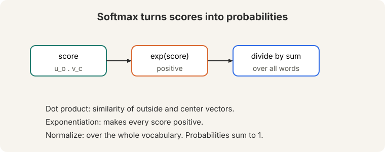
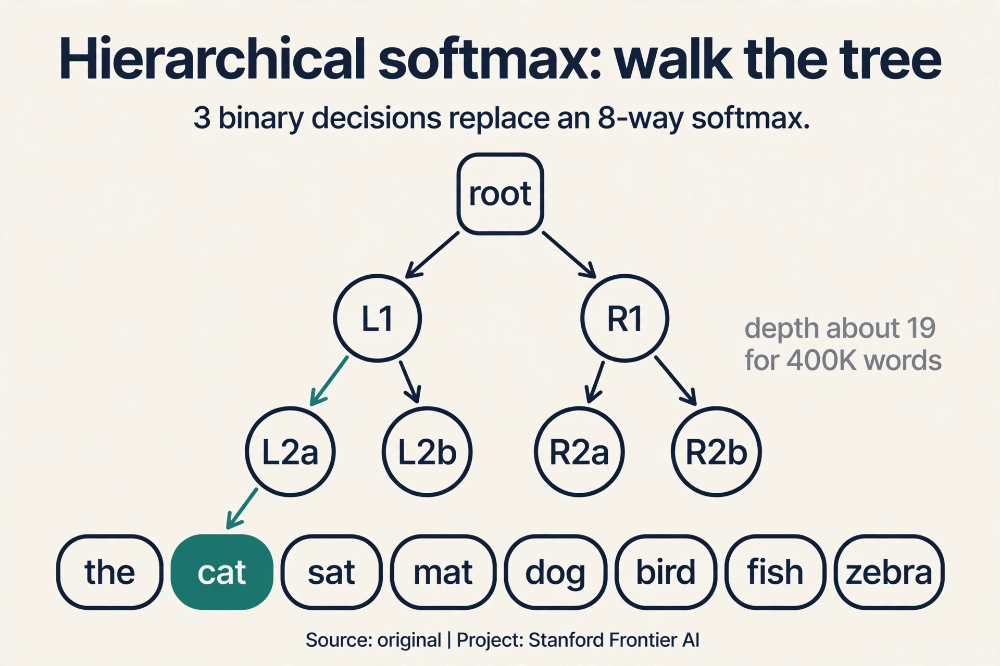
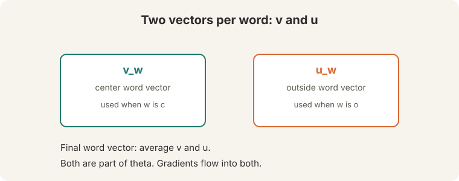
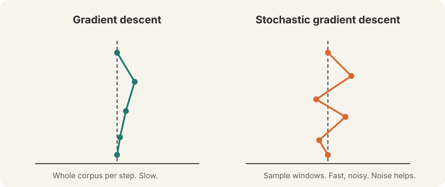
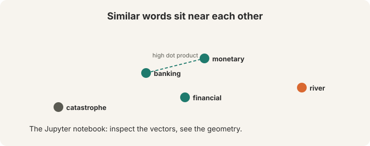

## The job: make meaning computable

A traveler types "Seattle motel" into a search box. The best document says
"Seattle hotel". A human sees the match instantly. A computer sees two
different strings and scores the match zero.

That gap is this course. Language looks like symbols on a screen. Meaning
lives behind the symbols. Every system in this course, from a 2013 word
vector to a modern chatbot, exists to close that gap: turn words into numbers
a machine can compute with, without losing what the words mean.



**On this page:** [CBOW, the mirror image](#subchapter-cbow-the-mirror-image) · [Hierarchical softmax](#subchapter-hierarchical-softmax-the-tree-instead-of-the-sum) · [Why the tree is Huffman-shaped](#subchapter-why-the-tree-is-huffman-shaped) · [Embeddings in production](#what-is-used-where-embeddings-in-production) · [Watch and go deeper](#watch-and-go-deeper)

> [!NOTE]
> This lesson follows the official Lecture 1 slide deck and the lecture
> video (embedded below in Watch and go deeper). Spoken explanations are
> grounded in the video's published description and the slides.

## First attempt: write meaning down by hand

The classical view of meaning is denotational: a **signifier** (the word
"tree") denotes a **signified** (the idea of a tree). If meaning is a thing a
word points to, the natural engineering move is to write the pointing-down
by hand.



That is WordNet: a hand-built thesaurus of synonym sets and hypernym ("is a")
relationships, assembled by linguists. "Good" sits in a set with "proficient".
"Dog" sits under the hypernym "animal". It is careful, human work, and it is
useful. It also fails in four concrete ways.

First, it misses nuance. "Proficient" is listed as a synonym of "good". That
is true in "a good programmer" and false in "a good day". The list cannot say
"synonym, but only here".

Second, it misses new meanings. "Wicked", "ninja", and "badass" all gained
senses no editor kept up with. Language moves daily. A hand-maintained list
is stale the day it ships.

Third, it is subjective. Human editors decide where one sense ends and the
next begins. Two editors draw the line in two places.

Fourth, it costs human labor to build and to adapt to every new domain.

But the deepest failure is structural, and it is the one that matters for
this course. A list gives a yes-or-no answer: synonym or not. It gives no
graded number. "Banking" is closer to "monetary" than to "river", and a list
cannot express "closer". Without a number, there is no similarity to compute.
Without similarity, the Seattle motel search scores zero.

> [!QA]
> Q: Why not just keep extending the synonym lists?
> A: Extension fixes coverage, not the structural problem. Lists answer yes or no. They never answer "how close". They also stay stale, subjective, and labor-built. The fix is to learn similarity into the vectors themselves, so closeness becomes a number you compute.
> Follow-up: What does "learn similarity into the vectors" mean concretely?
> A: Give each word a dense vector of real numbers. Train the vectors so words that appear in similar contexts get high dot products. Similarity becomes geometry: a number, not a list entry.

## Second attempt: words as symbols

Traditional NLP skipped meaning and treated words as discrete symbols. A
symbol can be encoded as a **one-hot vector**: one 1, the rest 0s. The
dimension equals the vocabulary size, often 500,000 or more.


Watch what this encoding does to similarity. Take a toy vocabulary of four
words: {motel, hotel, cat, zebra}. Their one-hot vectors are [1,0,0,0],
[0,1,0,0], [0,0,1,0], [0,0,0,1]. The **dot product** of any two different
vectors is 0. Motel and hotel are exactly as different as motel and
catastrophe. The vectors are **orthogonal**: perpendicular, zero overlap.

The consequence is immediate. A query for "Seattle motel" compares its
vector against a document containing "Seattle hotel". The motel-hotel
comparison contributes 0. The match fails. The encoding carries no meaning
at all: it only says "same word" or "different word".

## The key question

What if meaning is never stored at all? What if it is read off from the
neighbors a word keeps?

## The distributional hypothesis

In 1957 the linguist J. R. Firth wrote: "You shall know a word by the company
it keeps." A word's meaning is given by the words that frequently appear
close by. This is the **distributional hypothesis**, one of the most
successful ideas in modern NLP.

The **context** of a word is the set of words appearing nearby, inside a
fixed **window**. Collect many contexts of "banking". They concern debt,
regulation, crises. Not rivers. The contexts teach the meaning. No editor
wrote that down. The text itself says it.


Now watch the mechanism work on a toy corpus, by hand. Four sentences, a
window of one word on each side. Count how often each word appears near each
other word.

```ascii
corpus:
  1. I like deep learning
  2. I like NLP
  3. I enjoy deep learning
  4. I enjoy NLP
```

Build the **co-occurrence table**: for each word, count its neighbors across
all four sentences.

| word     | I | like | enjoy | deep | learning | NLP |
|----------|---|------|-------|------|----------|-----|
| like     | 2 | 0    | 0     | 1    | 0        | 1   |
| enjoy    | 2 | 0    | 0     | 1    | 0        | 1   |
| deep     | 0 | 1    | 1     | 0    | 2        | 0   |
| learning | 0 | 1    | 1     | 2    | 0        | 0   |
| NLP      | 0 | 1    | 1     | 0    | 0        | 0   |

Read the rows for "like" and "enjoy". They are identical: [2, 0, 0, 1, 0, 1].
Both keep exactly the same company: "I" twice, "deep" once, "NLP" once. The
table cannot tell them apart, because in this corpus they mean nearly the
same thing. Now compare with dot products:

```ascii
like . enjoy    = 2*2 + 0 + 0 + 1*1 + 0 + 1*1 = 6
like . deep     = 0
like . learning = 2
```

"Like" is most similar to "enjoy" (6), somewhat similar to "learning" (2),
and unrelated to "deep" (0). Similarity became a number. The motel-hotel
problem is solved in principle: words that keep the same company get high
dot products, and the search for "Seattle motel" now matches "Seattle hotel".

This is a **distributed representation**: meaning is spread across all the
dimensions of the vector, not stored in one slot. Word vectors are also
called **embeddings** or **neural word representations**.

## Why counting alone does not scale

Scale the toy to a real vocabulary of 500,000 words. Each
count vector has 500,000 dimensions, and nearly all of them are zero for any
given word. Rare words appear a handful of times, so their counts are noise.
Storing and comparing half-million-dimensional sparse vectors is slow and
hungry.

The key question returns, sharper: what if we stop counting and start
predicting? Instead of recording which neighbors each word had, train a
small, **dense** vector (say 100 to 300 numbers, all nonzero) that is good at
*predicting* a word's neighbors. Same distributional idea. A learned,
compact form.

## Word2vec: skip-gram

Word2vec (Mikolov et al., 2013) is a framework for learning exactly those
dense vectors. The **skip-gram** model works like this:

1. Take a large corpus: a long list of words.
2. Give every word in a fixed vocabulary a dense vector.
3. Walk through each position t. It holds a **center word** c and nearby
   **context (outside) words** o, inside a window of size m.
4. From the vector of c, compute the probability of each o.
5. Adjust all vectors to maximize that probability on real text.


For a window of size m around position t, the model predicts P(w(t+j) | w(t))
for each offset j in the window. The center word predicts its neighbors.
That is the whole training signal: there are no labels, no editors. The raw
text teaches itself.

### Subchapter: CBOW, the mirror image

Skip-gram predicts the context from the center word. **CBOW** (continuous
bag of words) flips the direction: predict the center word from its
context. The name says it. A "bag" of context words, order ignored,
averaged into one vector.

Watch it on a toy, by hand. Window: "the cat sat". Center: "cat". Context:
"the" and "sat".

```ascii
v(the) = [1.0, 0.0]     v(sat) = [0.0, 1.0]
average = ([1.0, 0.0] + [0.0, 1.0]) / 2 = [0.5, 0.5]
predict P(cat | the, sat) with the same softmax machine
```

Averaging smooths the signal: two context words vote together. CBOW trains
faster, because it makes one prediction per window instead of one per
context word. It works well on frequent words, which appear in many
windows. Skip-gram makes more predictions per window, so rare words get
more training signal. The rule of thumb from practice: skip-gram for small
corpora and rare words, CBOW for speed on large corpora.



## The prediction machine: softmax

How does a vector produce a probability? In three steps. Watch them on a
toy, by hand. Center word "banking" with vector v = [1.0, 0.0]. Four
candidate context words with their vectors:

```ascii
u_money  = [ 1.0, 0.2]    dot with v =  1.0
u_crisis = [ 0.8, 0.6]    dot with v =  0.8
u_river  = [-0.5, 0.9]    dot with v = -0.5
u_zebra  = [-1.0,-0.5]    dot with v = -1.0
```

Step 1, **dot product**: u(o) . V(c). A large dot product means the two
vectors point the same way: similar words, high score.

Step 2, **exponentiate**: e^1.0 = 2.72, e^0.8 = 2.23, e^-0.5 = 0.61,
e^-1.0 = 0.37. Every score becomes positive.

Step 3, **normalize**: divide by the total, 2.72 + 2.23 + 0.61 + 0.37 = 5.93.

```ascii
P(money   | banking) = 2.72 / 5.93 = 0.46
P(crisis  | banking) = 2.23 / 5.93 = 0.38
P(river   | banking) = 0.61 / 5.93 = 0.10
P(zebra   | banking) = 0.37 / 5.93 = 0.06
```

The probabilities sum to 1.00. "Money" and "crisis" win because their
vectors align with "banking". Training nudges the vectors so that the words
actually seen near "banking" get higher probability, and the rest get lower.



This three-step function is the **softmax**. "Soft" because it still gives
small probabilities to low scores, unlike a hard maximum. "Max" because it
amplifies the largest score.

The full formula, over the whole vocabulary:

P(o | c) = exp(u(o) . V(c)) / sum over all words w of exp(u(w) . V(c))

### Subchapter: hierarchical softmax, the tree instead of the sum

The flat softmax sums over all 400,000 words. **Hierarchical softmax**
replaces the flat sum with a **binary tree**. Each word sits at a leaf.
Each internal node holds a vector. Predicting a word means walking from
the root to its leaf, making one binary decision per level.

Watch it on a toy, by hand. A vocabulary of 8 words in a balanced tree has
depth 3. To predict "cat", walk root to node A to node B to the leaf:
3 sigmoid decisions instead of an 8-way softmax. At 400,000 words the
depth is about 19: 19 sigmoids per prediction instead of 400,000 dot
products. Mikolov's original word2vec paper shipped this. Negative sampling
(Lecture 2) later won on simplicity and speed, but the tree idea survives
wherever a flat softmax is too expensive.



### Subchapter: why the tree is Huffman-shaped

Not all words are equal. "The" is predicted millions of times; "zebra"
a handful. A balanced tree gives every word the same path length, which
wastes decisions on "the". **Huffman coding** builds the tree from word
frequencies: frequent words sit near the root with short paths, rare words
sink deep with long ones.

Watch the effect. "The" at depth 5 costs 5 sigmoids per prediction.
"Zebra" at depth 25 costs 25. Total training time follows frequency, which
is what you want: the words you predict most cost least. The price is a
skewed tree that must be rebuilt if the corpus changes. One small idea,
one clear win: spend the compute where the predictions are.

## The objective and the two vectors

The model trains on every window of the corpus. The **objective** J(theta)
is the average **negative log likelihood** over all positions and all window
offsets:

J(theta) = -(1/T) * sum over t, sum over j in window, of log P(w(t+j) | w(t))

Minimizing J(theta) is maximizing predictive accuracy: the model is punished
whenever it assigns low probability to a context word that really occurred.
It is also called the cost or loss function.

One structural detail: the model keeps **two vectors per word**.



v(w) is used when w plays the center role. U(w) is used when w plays the
context role. Both live inside the parameter vector theta, and gradients
flow into both during training. Keeping the roles separate is a math
convenience: one shared vector would distort training when a word appears
as its own context. At the end, the final word vector is the average of the
two.

## Training: why stochastic

To train, walk down the gradient of J(theta): compute the gradient, take a
small step in its negative direction, repeat. The step size is the
**learning rate**.



**Gradient descent** computes the gradient over the entire corpus before a
single update. Count the cost. A large corpus holds on the order of a
billion windows. Suppose one window's gradient costs one unit of work. One
gradient-descent step costs a billion units, and buys exactly one parameter
update. You wait an eternity between updates.

**Stochastic gradient descent (SGD)** samples one window (or a small batch)
and updates immediately. Same billion units of work, but now they buy a
billion updates. It is noisy: each step follows one sample, not the true
gradient. The noise is a feature, not a bug. It jiggles the optimizer out of
poor local minima. The objective is not convex, and life turns out to be
okay anyway.

> [!QA]
> Q: Why is plain gradient descent a bad idea here?
> A: Each step needs a full pass over the corpus before a single parameter update. With roughly a billion windows, one update costs a billion units of work. SGD updates after every sample, so the same work buys a billion updates. Progress per unit of compute is enormously higher.
> Follow-up: Does the noise in SGD hurt the final answer?
> A: It changes the answer but usually for the better. A clean gradient descends into the nearest minimum, which may be sharp and poor. A noisy gradient explores, escapes sharp minima, and often lands in flatter minima that generalize better.

## The payoff: similarity as geometry

"Seattle motel" now matches "Seattle hotel": their vectors point nearly the
same way, because motels and hotels keep the same company in text.



## What is used where: embeddings in production

Static word vectors left the lab and ran real systems. The map:

- **fastText (Meta, 2016).** Word2vec's successor, built at Facebook. Adds
  subword pieces (Lecture 2). Ships in the open-source fastText library
  for text classification. Public: the paper and the code.
- **GloVe vectors in NLP libraries.** spaCy shipped GloVe-derived vectors
  as default English word vectors for years. Public.
- **Search and recommendations.** Static embeddings powered early semantic
  search and candidate generation in recommender systems. Company
  engineering blogs describe the pattern. Per-system details vary, so
  treat any specific deployment claim as [uncertain] unless you check the
  source.
- **Modern LLMs.** GPT, Llama, Gemini, and Mistral do not use word2vec.
  Their token embeddings are learned jointly during pretraining (Lecture
  9). The embedding *interface* (dense vectors, dot-product similarity)
  survived. The training method did not.
- **Unknown, not guessed.** Embedding dimensions, training corpora, and
  vocabulary sizes for closed models (GPT-4, Gemini) are not public.

> [!QA]
> Q: Walk me through one skip-gram training step on a real window.
> A: Take the window "the cat sat", center "cat", window size 1. Look up the center vector v(cat). Compute dot products against every outside vector u(w): 400,000 dots in the naive version. Softmax them into probabilities. The true context words are "the" and "sat". The loss is -log P(the|cat) - log P(sat|cat). Backprop pushes v(cat) toward u(the) and u(sat) and away from the rest. One window, one nudge. Repeat billions of times.
> Follow-up: What changes with CBOW on the same window?
> A: The direction flips. Average v(the) and v(sat) into [0.5, 0.5], predict P(cat | average) with one softmax, and backprop into both context vectors. One prediction per window instead of two. Faster, but rare words get less signal.

> [!QA]
> Q: You have 10 million words of medical notes and one GPU. Skip-gram or CBOW?
> A: CBOW for speed, skip-gram for rare terms, and medical notes are full of rare terms (drug names, conditions). The applied answer: start with skip-gram with negative sampling, because the rare-word signal matters more than the training speed here. If iteration is too slow, switch to CBOW and check whether the rare-term neighbors degrade. Measure on a similarity list from the domain, not on analogies.
> Follow-up: What embedding dimension?
> A: 100 to 300, per the lecture's range. Smaller corpora want smaller dimensions: 10M words will not fill 300 dimensions cleanly. Start at 100.

> [!QA]
> Q: When would you pick hierarchical softmax over negative sampling?
> A: When you need a true probability distribution over the vocabulary, not just good vectors. Hierarchical softmax keeps a valid distribution (the tree defines one). Negative sampling discards the distribution and keeps only the geometry. For learning vectors, negative sampling is simpler and faster. For a language model that must output probabilities, the tree (or the full softmax) is the honest choice.
> Follow-up: Why did negative sampling win in practice?
> A: Speed and simplicity. No tree to build, no Huffman coding, no path-length bookkeeping. k+1 sigmoids per step, and the vectors come out as good. The field kept the vectors and dropped the scaffolding.

> [!QA]
> Q: Your search engine must match "motel" to "hotel" with zero labeled data. What do you build?
> A: Train skip-gram or CBOW on your document corpus, then rank documents by the dot product between the query's word vectors and the document's word vectors. "Motel" and "hotel" keep the same company in text, so their vectors align and the match scores high. No labels needed: the corpus teaches itself. Validate on a small set of hand-judged queries before shipping.
> Follow-up: What breaks first at web scale?
> A: The vocabulary. Rare misspellings and new terms get poor vectors. That is the production argument for subword methods like fastText (Lecture 2): "motel" and "motels" share pieces, so the unseen plural still gets a vector.

## Mapping back: what the vector answers

Each property of the word vector answers one failure from the start, by
name:

| Old failure | Word-vector answer | How |
|---|---|---|
| Lists give no graded similarity | Similarity is a dot product | "Banking" is 0.46-close to "money" and 0.06-close to "zebra": a number, not yes-or-no |
| Lists go stale and stay subjective | Vectors learn from raw text | No editors. New senses arrive automatically as usage changes |
| One-hot vectors are orthogonal | Dense vectors share dimensions | "Motel" and "hotel" point nearly the same way, so the search matches |
| Counting does not scale | Prediction learns dense vectors | 100-300 learned numbers replace 500,000-dim sparse counts |

## The honest price

Two bills come due, and both are the subject of Lecture 2.

First, the softmax normalizes over the entire vocabulary. Every prediction
sums over every word. Lecture 2 counts the cost: 400,000 words times
100- or 300-dimensional dot products, per prediction. The lecture fixes it
with negative sampling.

Second, each word gets exactly one vector. "Bank" the money place and
"bank" the river edge share a single vector, a superposition of both
senses. Lecture 2 shows what that superposition looks like and why the
field later moved past static vectors entirely.

> [!QA]
> Q: What is the single key result of this lecture?
> A: Word meaning can be represented well by a dense vector of real numbers, learned by predicting a word's neighbors. Before 2013, meaning lived in hand-built lists. Nobody proved that predicting neighbors would capture meaning. It worked anyway, and the field pivoted to learning representations from raw text.
> Follow-up: Why did the field believe the vectors instead of just the analogies?
> A: Because the geometry held up under measurement, not just demos. Nearest-neighbor lists and similarity ratings agreed with human judgment, and the vectors improved real downstream tasks. Lecture 2 runs those evaluations.

> [!QA]
> Q: Why does skip-gram predict context from center, rather than the reverse?
> A: Both directions carry the same distributional signal: the pairing of a word with its neighbors. Skip-gram's choice makes each center word generate several training pairs (one per context word), which multiplies the training signal per position. The reverse direction is a valid model too. The lecture builds skip-gram.
> Follow-up: Could you use the count table directly instead of training?
> A: You could, and early methods did. But count vectors are 500,000-dimensional and sparse, and rare words get noisy counts. Prediction learns 100- to 300-dimensional dense vectors that generalize: words with similar but not identical contexts still land near each other.

## Recap: the whole lesson on one screen

1. **The job.** Make meaning computable: "Seattle motel" must match "Seattle
   hotel".
2. **Lists fail.** WordNet misses nuance ("proficient" is not always "good"),
   misses new senses ("ninja"), is subjective, and costs labor. Worst: lists
   give yes-or-no, never "how close".
3. **Symbols fail.** One-hot vectors are orthogonal: motel . Hotel = 0.
   Dimension 500,000+, zero similarity inside.
4. **The key question.** What if meaning is read off from neighbors, never
   stored?
5. **Company keeps.** Firth (1957). The toy corpus proves it: "like" and
   "enjoy" get identical count vectors [2,0,0,1,0,1] and dot product 6, the
   highest in the table.
6. **Predict, do not count.** Skip-gram trains dense 100-300-dim vectors to
   predict context words from the center word. No labels, no editors.
7. **Softmax.** Dot product, exponentiate, normalize. The toy: P(money |
   banking) = 0.46, P(zebra | banking) = 0.06. Probabilities sum to 1.
8. **The price.** The softmax sums over the whole vocabulary, and one vector
   mixes all senses. Lecture 2 pays both bills.

## Watch and go deeper

<div style="max-width:640px;margin:1.5rem 0">
<div style="position:relative;padding-bottom:56.25%;height:0;overflow:hidden;border-radius:8px;background:#000">
<iframe src="https://www.youtube-nocookie.com/embed/DzpHeXVSC5I" title="CS224N Spring 2024 Lecture 1: Intro and Word Vectors" style="position:absolute;top:0;left:0;width:100%;height:100%;border:0" loading="lazy" allowfullscreen></iframe>
</div>
<p><strong>Lecture 1: Intro and Word Vectors</strong> (Christopher Manning, Spring 2024). The original lecture: the course, word meaning, word2vec, gradients, optimization.</p>

<div style="max-width:640px;margin:1.5rem 0">
<div style="position:relative;padding-bottom:56.25%;height:0;overflow:hidden;border-radius:8px;background:#000">
<iframe src="https://www.youtube-nocookie.com/embed/viZrOnJclY0" title="Word Embedding and Word2Vec, Clearly Explained" style="position:absolute;top:0;left:0;width:100%;height:100%;border:0" loading="lazy" allowfullscreen></iframe>
</div>
<p><strong>Word2Vec, clearly explained</strong> (StatQuest, Josh Starmer). A second voice on skip-gram, CBOW, and negative sampling, with every step drawn.</p>
</div>
</div>

### Go deeper

- [Efficient Estimation of Word Representations in Vector Space](https://arxiv.org/abs/1301.3781) (Mikolov et al., 2013). The word2vec paper behind skip-gram, CBOW, and hierarchical softmax.
- [Stanford CS224N course site](https://web.stanford.edu/class/cs224n/). Slides, assignments, syllabus.
- [Word2Vec tutorial: the skip-gram model](http://mccormickml.com/2016/04/19/word2vec-tutorial-the-skip-gram-model/) (Chris McCormick). The same math walked slowly, with pictures.

## Official sources and further reading

**Official:**
- CS224N Spring 2024 Lecture 1 slide deck: the sole source for this lesson.
- Stanford CS224N course site: syllabus, assignments, logistics.

**Further reading:**
- Mikolov et al. (2013), "Efficient Estimation of Word Representations in
  Vector Space": the original word2vec paper. The slides follow its skip-gram
  formulation.
- Firth (1957), "A synopsis of linguistic theory, 1930-1955": the
  distributional hypothesis source. Dense linguistics. The quoted sentence
  and its paragraph are enough.

**Caveats from these sources.** The lecture video was unavailable at build
time, so spoken explanations and live demos are lost. The slides are the only
record. The worked count table and softmax toy above are original teaching
toys, not slide figures. Word2vec's original paper trains the full softmax.
practical training uses negative sampling (Lecture 2).

## Connections to the other courses

- **This course:** L02 evaluates the vectors (analogies, similarity, NER)
  and fixes the expensive softmax with negative sampling.
- **CS336:** tokenization changed the input from words to subwords, but the
  dense-vector embedding interface that word2vec created survived unchanged.
- **CS229:** gradient descent, stochastic gradient descent, and the
  cross-entropy objective appear here in their NLP setting. The optimization
  theory is shared.
