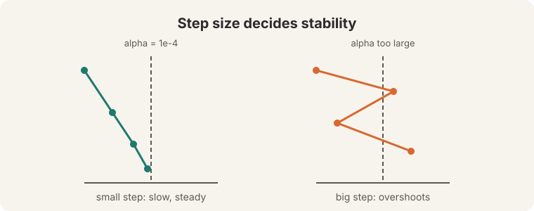
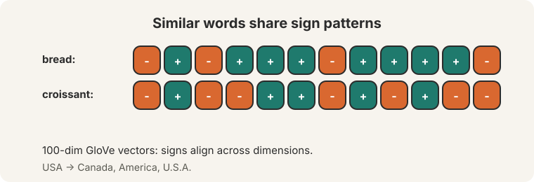
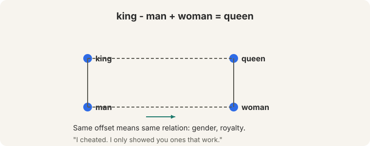
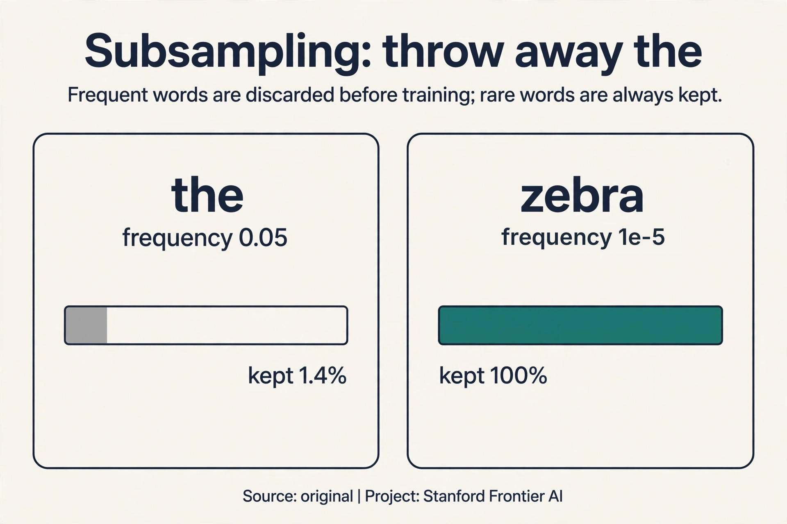
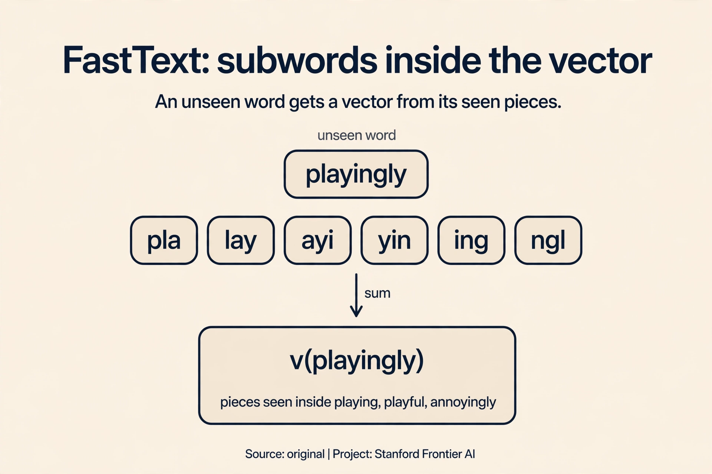
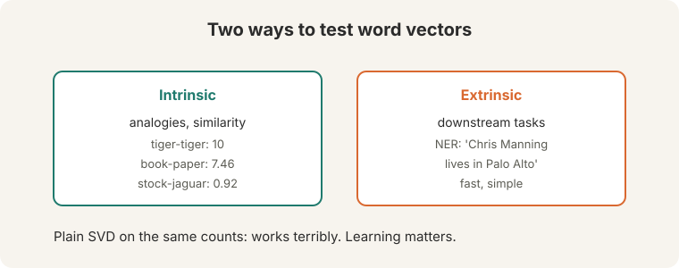
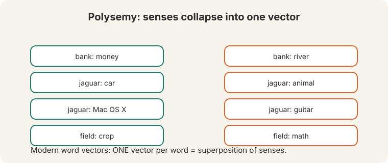
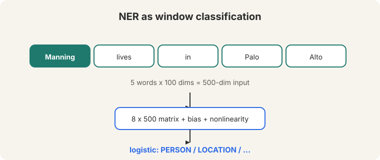

## The bill comes due

Lecture 1 built the word vector and left two bills on the table. The first
is money: the softmax normalizes over the whole vocabulary on every
prediction, and that sum is ruinous. The second is truth: do the vectors
actually capture meaning, or did we just do expensive arithmetic? This
lecture pays both bills, then uses the vectors to build the first neural
classifier of the course.

**On this page:** [Subsampling: throw away "the"](#subchapter-subsampling-throw-away-the) · [The negative-sampling loss, by hand](#subchapter-the-negative-sampling-loss-by-hand) · [The 3/4 power](#subchapter-the-34-power-in-negative-sampling) · [FastText](#subchapter-fasttext-subwords-inside-the-vector) · [Static vectors in production](#what-is-used-where-static-vectors-in-production) · [Watch and go deeper](#watch-and-go-deeper)

## How big a step: the learning rate

SGD takes a step in the negative gradient direction. The **learning rate**
alpha sets the step size. The lecture's sane starting values: 1e-3, 1e-4,
1e-5 ([04:59](ts:04:59)). Why so small? Watch a step that is too big.

Take the toy loss L = theta squared, starting at theta = 2. The gradient is
2*theta = 4.

```ascii
alpha = 0.1:  theta = 2 - 0.1*4 = 1.6   (closer to 0, converging)
              theta = 1.6 - 0.1*3.2 = 1.28 ...
alpha = 1.1:  theta = 2 - 1.1*4 = -2.4  (overshot past 0)
              theta = -2.4 - 1.1*(-4.8) = 2.88  (farther out, diverging)
```

The failure mode is divergence: oversized steps oscillate and grow instead
of descending.



Two more mechanics. **Initialization**: start with random small numbers.
Zeros create false symmetries ([08:43](ts:08:43)): every unit computes the
same thing, gets the same gradient, and learns the same thing forever.
Randomness breaks the symmetry. And plain gradient descent, the whole
corpus per step: the lecture is blunt, "we never use" it. SGD with
mini-batches of 16 or 32 is the default, and its noise jiggles the optimizer
out of bad spots.

## Do the vectors work?

Do the trained vectors capture meaning? Three checks:

**Neighbors.** GloVe vectors trained at Stanford, 100 dimensions
([12:10](ts:12:10)): the sign patterns of "bread" and "croissant" align
across dimensions. The nearest neighbors of "USA" are Canada, America,
U.S.A. Words that keep the same company sit in the same neighborhood.



**Analogies.** Vector arithmetic captures relations. The famous one:
king - man + woman = queen ([16:44](ts:16:44)). The offset between "man"
and "woman" encodes something like gender. Adding it to "king" lands on
"queen". Watch it on a toy, by hand, in two dimensions:

```ascii
king   = [0.9, 0.1]
man    = [0.8,-0.2]
woman  = [0.2, 0.7]
queen  = [0.3, 0.9]

king - man + woman = [0.9-0.8+0.2, 0.1+0.2+0.7] = [0.3, 1.0]
```

The result [0.3, 1.0] sits almost on top of "queen" [0.3, 0.9]. The relation
survives the arithmetic. The lecture shows more: Australia:beer ::
France:champagne, Russia:vodka, pencil:sketching :: camera:photographing,
Obama:Clinton :: Reagan:Nixon, tall:tallest :: long:longest.



Then the honesty note, and it matters. "I cheated. I only showed you ones
that work." Analogies are cherry-picked demos. And "no one uses this stuff
anymore": analogies proved the geometry was real, but they were never a
production technique. A demo is not a product.

> [!QA]
> Q: If analogies are cherry-picked, why does the lecture show them?
> A: They are a fast visual proof that the vector space encodes relations, not just neighborhoods. The offset between word pairs is consistent enough that arithmetic works on the good cases. But the lecture is explicit: nobody ships analogy solvers. Trust the evaluations below, not the demos.
> Follow-up: What would a rigorous version of the analogy test look like?
> A: A fixed benchmark of thousands of analogy questions, scored mechanically, with failures counted alongside successes. That exists: the standard analogy test set. The lecture's point is that even passing it does not make analogies a product.

## The expensive sum: negative sampling

Now the money bill. The naive softmax normalizes over the whole vocabulary:
400,000 words times 100- or 300-dimensional dot products, per prediction
([28:14](ts:28:14)). Count it: 400,000 x 300 = 120 million multiply-adds
for one context-word prediction. Training makes billions of predictions.
The denominator is the bottleneck of the whole method.

The key question: do we need a full probability distribution at all? The
training signal only needs to say "this real pair scores higher than random
pairs". **Negative sampling** reframes the job: "train simple logistic
regressions." For each real (center, context) pair, sample k negative pairs
from a noise distribution. Train k+1 binary classifiers: is this pair real
or noise?


Count the new cost. With k = 5 negatives, each training step evaluates 6
dot products instead of 400,000: roughly 66,000 times cheaper. The **sigmoid**
function turns each score into a probability ([30:10](ts:30:10)): high score
for the real pair, low scores for the noise pairs. A sign-symmetry trick
keeps the math consistent without ever summing over the vocabulary.

What did we give up? The model no longer outputs true probabilities over
the vocabulary. For learning vectors, that was never needed.

### Subchapter: the negative-sampling loss, by hand

The loss for one training step is a sum of binary decisions. For the real
pair (center c, observed context o) and k negatives n_1..n_k:

```ascii
J = -log sigma(v_c . u_o) - sum over i of log sigma(-v_c . u_{n_i})
```

The first term pulls the real pair's score up. Each negative term pushes a
noise pair's score down (the minus sign inside the sigmoid flips the
target). Watch it on the Lecture 1 toy vectors with k = 1. Real pair
(banking, money): dot = 1.0. Negative (banking, zebra): dot = -1.0.

```ascii
sigma(1.0) = 0.7311
J = -log sigma(1.0) - log sigma(-(-1.0))
  = -log(0.7311) - log(0.7311)
  = 0.3133 + 0.3133 = 0.6265
```

Both terms are 0.3133 by symmetry: the model is equally unsure about the
real pair and the noise pair. Training drives them apart: the real
sigmoid toward 1 (loss toward 0), the noise sigmoids toward 0 (their
negative-log terms toward 0). With the standard k = 5, the same step costs
one real term plus five noise terms: 6 sigmoids, 6 dot products, no
400,000-word sum anywhere. The full softmax is gone. The geometry that
remains is what the vectors are for.

 - log sigma(1.0) = 0.6265. Shell 2. Source: original toy for the negative-sampling loss. Project: Stanford Frontier AI.")

### Subchapter: subsampling, throw away "the"

Frequent words are a tax. "The" appears in almost every window, so it
consumes training steps while teaching almost nothing: its vector barely
moves anymore, and it dilutes the signal of rarer neighbors. Word2vec
**subsamples**: discard each occurrence of word w with a probability that
grows with its frequency.

The formula: P(keep w) = sqrt(t / f(w)), with threshold t = 1e-5 and f(w)
the word's frequency. Watch it on a toy. "The" has frequency 0.05:

```ascii
P(keep "the") = sqrt(1e-5 / 0.05) = sqrt(0.0002) = 0.014
```

"The" survives 1.4% of its occurrences. 98.6% are thrown away before
training. A rare word with frequency 1e-5: P(keep) = sqrt(1) = 1.0, always
kept. The corpus shrinks, the rare words get relatively more training, and
the vectors improve.



### Subchapter: the 3/4 power in negative sampling

Negatives come from a **noise distribution** over the vocabulary. The
obvious choice is the raw unigram frequency: sample words as often as they
appear. Word2vec does something stranger: it raises each frequency to the
**3/4 power** and renormalizes. Watch what the exponent does on a toy.

```ascii
"the":   f = 0.05      f^0.75 = 0.106
"zebra": f = 0.0001    f^0.75 = 0.001
ratio before: 0.05 / 0.0001 = 500
ratio after:  0.106 / 0.001 = 106
```

The 3/4 power compresses the gap: "the" is sampled 106 times more often
than "zebra" instead of 500. Frequent words still dominate the negatives,
but rare words get sampled more than their raw frequency allows. Why does
that help? Negatives teach the model what is *not* a real pair. If
negatives were always "the", "of", and "and", the model would learn
nothing about distinguishing "zebra" from noise. The 3/4 power is an
empirical hack from the word2vec paper: no theorem, just better vectors.

### Subchapter: FastText, subwords inside the vector

Word2vec gives one vector per whole word. An unseen word gets nothing.
**FastText** (Bojanowski et al., 2017, Meta) fixes this by building each
word vector from its **character n-grams**. The word "playing" with n = 3
becomes the set {<pl, pla, lay, ayi, yin, ing, ng>} plus the whole word
<playing>. The vector for "playing" is the **sum** of its n-gram vectors.

Watch it handle the unknown. "Playingly" never appeared in training. Its
n-grams (pla, lay, ayi, yin, ing, ngl, gly) mostly did appear, inside
"playing", "playful", "annoyingly". Sum their vectors: a sensible vector
for an unseen word, built from seen pieces. Two wins. **Morphology**:
"run", "runs", "running" share n-grams, so their vectors share signal.
**Out-of-vocabulary words**: any string gets a vector, no retraining.

The price: n-gram tables are big (millions of n-grams hashed into
buckets), and summing pieces blurs meanings that are not compositional.
Still, for morphologically rich languages (Finnish, Turkish, German) and
for noisy text (tweets, typos), FastText beats plain word2vec clearly.



## Mapping back: what negative sampling answers

| Softmax pain | Negative sampling answer | How |
|---|---|---|
| 400,000 x 300 = 120M multiply-adds per prediction | 6 dot products per step | 1 real pair + k negatives: ~66,000x cheaper |
| The denominator sums the whole vocabulary | No denominator at all | k+1 binary decisions replace the full distribution |
| Training needs true probabilities | It needs rankings, not probabilities | Sigmoid pushes real pairs up, noise pairs down. The geometry is what matters |

> [!QA]
> Q: Why does negative sampling work if it never computes real probabilities?
> A: Because the training goal was never the probabilities. The goal is vectors whose dot products rank real pairs above noise pairs. Each logistic regression pushes the real pair's score up and the noise pairs' scores down. The geometry that results is the same geometry the full softmax would have learned, at a fraction of the cost.
> Follow-up: How do you pick the negative samples?
> A: From a noise distribution over the vocabulary, typically the unigram distribution raised to the 3/4 power. Frequent words appear as negatives more often, which forces the model to distinguish real associations from mere frequency.

## A second path: GloVe counts ratios

Word2vec predicts, one window at a time. GloVe (Jeffrey Pennington,
Stanford) starts from the other end: the full co-occurrence counts. Its key
insight is that **ratios of co-occurrence probabilities** expose meaning
([43:20](ts:43:20)).

Read the lecture's table. P(k | ice) is the probability that word k appears
near "ice". Compare ice and steam:

| k      | P(k\|ice) | P(k\|steam) | ratio |
|--------|-----------|-------------|-------|
| solid  | high      | low         | 8.5   |
| gas    | low       | high        | 0.085 |
| water  | high      | high        | ~1    |
| fashion| low       | low         | ~1    |

Ice and steam both co-occur with "water" and "fashion" at similar rates.
Ratios near 1: noise, shared background. But "solid" is 8.5 times more
likely near ice than near steam, and "gas" flips to 0.085. The ratio
cancels what ice and steam share and isolates what distinguishes them: the
solid-gas dimension of physics. The signal lives in the ratio, not in the
raw counts.

/P(solid|steam) is large, P(gas|ice)/P(gas|steam) is small. Water and fashion sit near 1.")

GloVe fits a **log-bilinear** model to capture this: the dot product of two
word vectors approximates the log co-occurrence probability, plus learned
biases. Where word2vec learns by predicting online, GloVe regresses on the
global count matrix. Prediction versus counting. Both produce dense vectors
with similar geometry, and in practice the choice rarely decides downstream
results.

> [!QA]
> Q: When would you prefer GloVe over word2vec?
> A: When you want a model that uses global count statistics directly and trains fast on aggregated co-occurrence matrices. Both produce dense vectors with similar geometry. In practice the choice rarely decides downstream results.
> Follow-up: What is the core difference between the two objectives?
> A: Word2vec predicts context words online, one window at a time. GloVe regresses on the full co-occurrence matrix. Prediction versus counting. The ratio table shows why counting works: ratios of probabilities carry the semantic signal.

## Why two vectors, averaged at the end

Lecture 1 gave each word two vectors: v for center use, u for outside use.
Why keep both? It is a **math convenience**. If one vector served both
roles, the dot product of a word with itself would be a square, which
distorts training. The slides' octopus example shows a word appearing as
its own context: with shared vectors, that self-pair would dominate. Two
vectors keep the roles clean. At the end, average the two into one final
vector per word.

## What is used where: static vectors in production

- **FastText (Meta).** The open-source library ships pretrained vectors
  for 157 languages and a text classifier used in production content
  moderation and language identification. Public: paper, code, models.
- **GloVe.** spaCy's default English vectors for years. Still the
  standard baseline in information retrieval research. Public.
- **Word2vec (gensim).** The reference implementation most practitioners
  reach for. Powers semantic search prototypes and recommender candidate
  generation across industry. Specific company deployments vary. Verify
  per case.
- **Modern LLMs.** None of GPT, Llama, Gemini, or Mistral use static word
  vectors. Subword embeddings are learned during pretraining. The static
  vector survives in retrieval systems, on-device models, and anywhere
  compute is tight.
- **Unknown, not guessed.** Which closed labs still use static vectors in
  any production pipeline is not public.

> [!QA]
> Q: Walk me through one negative-sampling training step.
> A: Real pair: (banking, money). Sample k = 5 negatives from the noise distribution: say (banking, zebra), (banking, the), (banking, quantum), (banking, spoon), (banking, although). Compute 6 dot products. Sigmoid each. The loss pushes sigma(v_banking . u_money) toward 1 and the five noise sigmoids toward 0. Backprop updates 6 outside vectors and 1 center vector. Cost: 6 dot products. The full softmax would have needed 400,000. Same geometry, 66,000 times cheaper.
> Follow-up: What if k is too small?
> A: The negatives stop representing the noise distribution. With k = 1, each step contrasts the real pair against one random word: the gradient is pure noise and training crawls. k = 5 to 20 is the standard range. Frequent words want larger k.

> [!QA]
> Q: You need embeddings for Quechua, with 2 million words of text and no labeled data. What do you build?
> A: FastText with skip-gram and negative sampling. The corpus is small, so skip-gram gives rare words more signal. FastText's subword n-grams share statistics across inflected forms, which matters for an agglutinative language like Quechua. Subsample frequent words aggressively (threshold 1e-5) since 2M words is thin. Evaluate intrinsically: nearest neighbors of known words, judged by a speaker. Do not trust analogies on a corpus this small.
> Follow-up: Why not just use multilingual BERT?
> A: You can, and for downstream tasks it may win. But it needs far more compute, and its Quechua coverage depends on pretraining data you do not control. Static vectors are cheap, inspectable, and yours. The applied rule: static vectors first, contextual models when the task demands them.

> [!QA]
> Q: Why does subsampling help rare words instead of just speeding things up?
> A: Training steps are a fixed budget. Every step spent on "the" is a step not spent on a rare word. Deleting 98.6% of "the" occurrences hands those steps to rarer words. It also widens the effective window: with "the" removed, the window spans more content words, so each center word sees more informative neighbors.
> Follow-up: Could you just delete all stopwords with a list?
> A: A list is binary and hand-built: the WordNet problem again. Subsampling is graded and automatic: frequency decides, with a smooth formula. Words near the threshold are kept sometimes, not never. The corpus decides its own stopwords.

> [!QA]
> Q: GloVe or word2vec for a new project in 2026?
> A: For static vectors, the honest answer is that the choice rarely decides results: both give similar geometry. Pick word2vec (skip-gram, negative sampling) for streaming or huge corpora, since it trains online. Pick GloVe when you have the full co-occurrence matrix and want fast training on it. Pick FastText over both when morphology or out-of-vocabulary words matter. And check first whether you need static vectors at all: a small pretrained transformer often beats all three on downstream tasks.
> Follow-up: What is the one case where GloVe clearly wins?
> A: Parallel training on aggregated counts. GloVe's objective parallelizes over the co-occurrence matrix, so with the counts precomputed it trains very fast. Word2vec's online updates are harder to parallelize without staleness.

## Evaluation: intrinsic is fast, extrinsic is honest

How do you know the vectors are good? Two kinds of tests.

**Intrinsic** tests probe the vectors directly. Analogies, as above. Word
similarity: human ratings on a 0-10 scale (tiger-tiger: 10, book-paper:
7.46, plane-car: 5.77, stock-phone: 1.62, stock-jaguar: 0.92). One sharp
result: plain SVD on the same counts "works terribly". Counting alone is
not enough. The objective decides what the counts mean.

**Extrinsic** tests plug the vectors into a real task and measure
end-to-end performance. The lecture's example: named entity recognition on
"Chris Manning lives in Palo Alto". Extrinsic is slower but honest: it
measures what you actually care about.



The rule: use intrinsic tests during development, because they are fast.
Trust extrinsic tests before you ship, because a vector can ace analogies
and still fail on your task.

## Word senses: one vector is a superposition

Words have senses. "Pike" is a weapon (noun), a verb meaning to stab, and
Australian slang for "chicken out". "Coming down the pike" is none of
those. In 2012, researchers trained **sense vectors**: bank 1 (money),
bank 2 (river). Jaguar 1 (car: luxury, convertible), jaguar 2 (Mac OS X
10.3), jaguar 3 (guitar, keyboard, music), jaguar 4 (animal, hunter).

Modern word2vec gives **one vector per word**. That single vector is a
**superposition** of the senses ([57:50](ts:57:50)): all senses mixed
together. "Field" (crop, rock, ice, sporting, math) behaves like a
probability-density distribution over its senses: the vector is a weighted
blend, and no single sense owns it.



One vector per word cannot say which sense is active in "the bank of the
river". The context-sensitive vectors of Lecture 9 exist to pay exactly
this bill.

## The first neural classifier

The lecture closes by spending the vectors on a real task: named entity
recognition over a word window. Given "Chris Manning lives in Palo Alto",
label each word: PERSON, LOCATION, or neither.

The construction: take a window of 5 words, each a 100-dimensional vector.
Concatenate: a 500-dimensional input. Multiply by an 8x500 matrix, add a
bias, apply a nonlinearity. The 8-dimensional result is a learned
re-representation of the window. A logistic classifier reads it and outputs
the label.



Count the weights: 8 x 500 = 4,000, plus 8 biases. Classic classifiers had
fixed inputs and a linear decision boundary. The neural version learns the
representation **and** the boundary at once. The model is linear, but in the
re-represented space, which the network itself learned.

The loss is **cross-entropy** H(p, q) ([72:26](ts:72:26)). With gold labels
(one correct class), it reduces to negative log likelihood. Watch it punish
mistakes on a toy. Gold label: PERSON. Model A predicts [0.7, 0.2, 0.1]:
loss = -log(0.7) = 0.36. Model B predicts [0.1, 0.8, 0.1], confident and
wrong: loss = -log(0.1) = 2.30. Confident errors cost more. That is the
whole behavior of the loss in one pair of numbers.

The 8-dimensional middle is not hand-designed. The network invents it,
because inventing it reduces the loss. Lecture 3 derives the algorithm that
makes this invention possible.

> [!QA]
> Q: What does the hidden layer actually do for NER?
> A: It re-represents the 500-dimensional window as 8 learned features. The classifier on top is linear, so all the nonlinear work happens in that re-representation. The network might learn a feature that fires on "capitalized word followed by a verb", which separates PERSON from LOCATION. Nobody programs that feature. The gradient finds it.
> Follow-up: Why a window of 5 words instead of the whole sentence?
> A: Because this classifier has no notion of order or long context. The window is a fixed-size peephole: two words left, two right. It works for NER because entity clues are local ("lives in" before "Palo Alto"). Lecture 5 builds models that read the whole sentence.

## Recap: the whole lesson on one screen

1. **Step size matters.** Alpha 1e-3 to 1e-5. The toy proves it: alpha 1.1
   on theta-squared diverges (2 to -2.4 to 2.88). Alpha 0.1 converges.
   Initialize random and small. Zeros create false symmetries.
2. **The vectors work.** Bread and croissant share sign patterns. USA sits
   near Canada, America, U.S.A. Geometry encodes meaning.
3. **Analogies are demos, not products.** King - man + woman = queen, worked
   to [0.3, 1.0] against queen [0.3, 0.9]. "I cheated. I only showed you
   ones that work."
4. **Negative sampling pays the softmax bill.** 400,000 x 300 = 120M
   multiply-adds per prediction becomes 6 dot products: ~66,000x cheaper.
   Sigmoid on 1 real + k noise pairs.
5. **Ratios carry the signal.** Ice versus steam: solid 8.5, gas 0.085,
   water and fashion near 1. GloVe regresses dot products on log counts.
6. **Evaluate honestly.** Intrinsic is fast (analogies, similarity ratings).
   Extrinsic is honest (NER on "Chris Manning lives in Palo Alto"). Plain
   SVD works terribly: the objective matters.
7. **One vector mixes all senses.** Pike, bank, jaguar, field: the single
   vector is a superposition, like a probability density over senses.
8. **The first neural classifier.** 5 x 100 = 500 inputs, 8x500 matrix,
   logistic output. Cross-entropy: -log(0.7) = 0.36 for a good guess,
   -log(0.1) = 2.30 for a confident error. The magic is the intermediate
   layers.

## Watch and go deeper

<div style="max-width:640px;margin:1.5rem 0">
<div style="position:relative;padding-bottom:56.25%;height:0;overflow:hidden;border-radius:8px;background:#000">
<iframe src="https://www.youtube-nocookie.com/embed/nBor4jfWetQ" title="CS224N Spring 2024 Lecture 2: Word Vectors and Language Models" style="position:absolute;top:0;left:0;width:100%;height:100%;border:0" loading="lazy" allowfullscreen></iframe>
</div>
<p><strong>Lecture 2: Word Vectors and Language Models</strong> (Christopher Manning, Spring 2024). The original lecture: optimization, negative sampling, GloVe, word senses, neural classifiers. If the embed does not load, watch the lecture directly on YouTube: https://www.youtube.com/watch?v=nBor4jfWetQ</p>

<div style="max-width:640px;margin:1.5rem 0">
<div style="position:relative;padding-bottom:56.25%;height:0;overflow:hidden;border-radius:8px;background:#000">
<iframe src="https://www.youtube-nocookie.com/embed/ASn7ExxLZws" title="GloVe: Global Vectors for Word Representation" style="position:absolute;top:0;left:0;width:100%;height:100%;border:0" loading="lazy" allowfullscreen></iframe>
</div>
<p><strong>GloVe: Global Vectors</strong> (Tanmoy Chakraborty). How global co-occurrence counts plus prediction make word vectors.</p>
</div>
</div>

### Go deeper

- [Distributed Representations of Words and Phrases and their Compositionality](https://arxiv.org/abs/1310.4546) (Mikolov et al., 2013). Negative sampling and subsampling, the two training tricks.
- [GloVe: Global Vectors for Word Representation](https://aclanthology.org/D14-1162/) (Pennington, Socher, Manning, 2014). The ratio argument and the log-bilinear objective.
- [Enriching Word Vectors with Subword Information](https://arxiv.org/abs/1607.04606) (Bojanowski et al., 2017). FastText: character n-grams inside the vector.
- [Stanford CS224N course site](https://web.stanford.edu/class/cs224n/). Slides, assignments, syllabus.

## Official sources and further reading

**Official:**
- Lecture 2 video and transcript.
- GloVe paper (Pennington, Socher, Manning 2014): the ratio argument and
  the log-bilinear objective.

**Further reading:**
- Mikolov et al. (2013), "Distributed Representations of Words and Phrases
  and their Compositionality": negative sampling.
- Reisinger and Mooney (2010), Huang et al. (2012): multi-prototype sense
  vectors, the 2012 approach the lecture contrasts with superposition.

**Caveats from these sources.** Analogy demos are cherry-picked. The
lecture says so explicitly. The learning-rate toy and analogy toy above are
original teaching toys. Word vectors here are word-level. Lecture 9 moves
to subwords. Similarity ratings are human judgments with annotator
disagreement.

## Connections to the other courses

- **This course:** L03 derives backpropagation, which trains the NER
  classifier. L04 replaces the window classifier with a parser. L09
  replaces static vectors with contextual ones, paying the superposition
  bill.
- **CS336:** L01 tokenization changed the input from words to subwords. The
  dense-vector embedding interface survived. Scaling laws subsume the "more
  data" intuition.
- **CS229S:** matrix factorization theory explains why SVD variants behave
  differently from GloVe.
