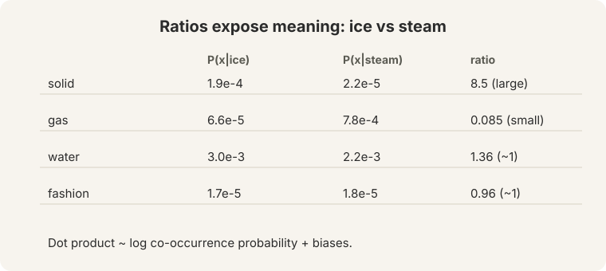

## How to read this lesson

This lesson has two levels. **Level 1 (Core)** finishes the word2vec story:
how to train, why the vectors work, and how to fix the expensive softmax.
**Level 2 (Deep)** covers evaluation, word senses, and the first neural
classifier.

## Level 1: Learning rates and initialization

The learning rate alpha sets the step size. Typical values: 1e-3, 1e-4, 1e-5
([04:59](ts:04:59)). A step that is too big overshoots the minimum and the
loss diverges.

Initialization matters too. Start with random **small** numbers. Zeros create
false symmetries ([08:43](ts:08:43)): every neuron computes the same thing and
no learning happens. Randomness breaks the symmetry.

Plain gradient descent uses the whole corpus per step. The lecture is blunt:
"we never use" it. SGD with mini-batches of 16 or 32 is the default. The noise
in the gradient helps: it jiggles the optimizer out of bad spots.

> [!QA]
> Q: What goes wrong with a learning rate that is too large?
> A: The step overshoots the minimum. The loss oscillates or diverges instead of decreasing. The lecture gives 1e-3 down to 1e-5 as sane starting values.
> Follow-up: Why does SGD noise help instead of hurting?
> A: The noise jiggles parameters out of sharp, poor local minima. A clean gradient descends into the nearest minimum, which may be bad. A noisy gradient explores and often lands in flatter minima that generalize better.

## Level 1: The vectors work

Do the trained vectors capture meaning? Yes, in three ways.

**Neighbors.** GloVe 100-dim vectors (built at Stanford, [12:10](ts:12:10))
show matching sign patterns across dimensions for "bread" and "croissant".
Nearest neighbors of "USA": Canada, America, U.S.A.

**Analogies.** Vector arithmetic captures relations:
king - man + woman = queen ([16:44](ts:16:44)).

Also: Australia:beer :: France:champagne (the audience guessed wine. The
answer was "close" with champagne), Russia:vodka,
pencil:sketching :: camera:photographing, Obama:Clinton :: Reagan:Nixon,
tall:tallest :: long:longest.

**The honesty note.** "I cheated. I only showed you ones that work."
Analogies are cherry-picked. And "no one uses this stuff anymore": analogies
were a demo of the geometry, not a production technique.

## Level 1: Negative sampling

Naive softmax normalizes over the whole vocabulary: 400,000 words times
100- or 300-dimensional dot products per prediction ([28:14](ts:28:14)). Too
expensive.

**Negative sampling** reframes training: "train simple logistic regressions."
For each real (center, context) pair, sample k negative pairs from a noise
distribution. Train k+1 binary classifiers: is this pair real or noise?

The **sigmoid** (S-shaped) function turns a score into a probability
([30:10](ts:30:10)). A sign-symmetry trick keeps the math consistent without
the full vocabulary sum.

## Level 1: GloVe counts ratios

GloVe (Jeffrey Pennington, Stanford) starts from co-occurrence counts, not
predictions. The key insight: **ratios of co-occurrence probabilities** expose
meaning ([43:20](ts:43:20)).

/P(solid|steam) is large, P(gas|ice)/P(gas|steam) is small, water and fashion sit near 1.")

Ice and steam both co-occur with "water" and "fashion" at similar rates.
Ratios near 1: noise. But "solid" is much more likely near ice than steam:
ratio 8.5. "Gas" flips: 0.085. The ratio isolates the solid-gas dimension of
physics.

GloVe fits a **log-bilinear** model: the dot product of two word vectors
approximates the log co-occurrence probability, plus learned biases.

> [!QA]
> Q: When would you prefer GloVe over word2vec?
> A: When you want a model that uses global count statistics directly and trains fast on aggregated co-occurrence matrices. Both produce dense vectors with similar geometry. In practice the choice rarely decides downstream results.
> Follow-up: What is the core difference between the two objectives?
> A: Word2vec predicts context words online, one window at a time. GloVe regresses on the full co-occurrence matrix. Prediction versus counting. The ratio table shows why counting works: ratios of probabilities carry the semantic signal.

## Level 2: Why two vectors, averaged at the end

Lecture 1 gave each word two vectors: v (center) and u (outside). Why keep
both? It is a **math convenience**. If one vector served both roles, the dot
product of a word with itself would be a square, which distorts training. The
octopus example in the slides shows a word appearing as its own context.

 for center use, u(w) for context use; the final vector averages both.")

At the end, **average the two vectors**.

At the end, **average the two vectors**. One final vector per word.

## Level 2: Intrinsic versus extrinsic evaluation

**Intrinsic** tests probe the vectors directly. Word analogies. Word
similarity: human ratings on a 0-10 scale (tiger-tiger: 10, book-paper: 7.46,
plane-car: 5.77, stock-phone: 1.62, stock-jaguar: 0.92). Plain SVD on the same
counts "works terribly": learning matters, not just counting.

**Extrinsic** tests plug the vectors into a real task and measure end-to-end
performance. Example: named entity recognition on "Chris Manning lives in
Palo Alto". Extrinsic is slower but honest: it measures what you actually care
about.

> [!QA]
> Q: Which evaluation should you trust?
> A: Extrinsic, for decisions that matter. Intrinsic tests are fast proxies and they can mislead: a vector can ace analogies and still fail on your task. Use intrinsic during development, extrinsic before you ship.
> Follow-up: Why does plain SVD fail while GloVe succeeds?
> A: Both factorize counts, but GloVe's log-bilinear objective with biases and a weighted loss emphasizes the informative ratios. Raw SVD treats all counts equally, so frequent-word noise drowns the signal.

## Level 2: Word senses and superposition

Words have senses. "Pike" is a weapon (noun), a verb, Australian slang for
"chicken out", and "coming down the pike". In 2012, researchers trained
**sense vectors**: bank 1 (money), bank 2 (river). Jaguar 1 (car, luxury,
convertible), jaguar 2 (Mac OS X 10.3, Microsoft), jaguar 3 (guitar,
keyboard, music), jaguar 4 (animal, hunter).

Modern word2vec gives **one vector per word**. That single vector is a
**superposition** of the senses ([57:50](ts:57:50)): all senses mixed together.
"Field" (crop, rock, ice, sporting, math) behaves like a probability-density
distribution over its senses.

## Level 2: The neural classifier

The first neural NLP model in the course: named entity recognition over a
word window.

Five words times 100 dimensions = a 500-dim input. An 8x500 matrix plus a
bias plus a nonlinearity re-represents the input. A logistic classifier reads
the new representation: PERSON, LOCATION, or neither.

Classic classifiers had fixed inputs and a linear decision boundary. The
neural version learns the representation **and** the boundary. The model is
linear in the re-represented space.

**Cross-entropy** H(p, q) measures the cost ([72:26](ts:72:26)). With gold
labels (one correct class), it reduces to negative log likelihood.

The lecture ends with neurons. A human neuron has one axon and fires spikes.
the firing rate is the signal. A logistic unit approximates one neuron. "The
magic is the intermediate layers." More layers, more magic.

## Recap: the whole lesson on one screen

Eight ideas carry this lecture. Read each card. Say the core sentence out
loud. If you can, you own the lesson.

<strong>1. Learning rates and initialization</strong>

Start alpha at 1e-3 to 1e-5. Too big overshoots. Initialize with random
small numbers. Zeros create false symmetries. SGD with batches of 16 or 32
is the default. The noise helps.

Key: noise is a feature, not a bug

<strong>2. The vectors capture meaning</strong>

Bread and croissant share sign patterns. USA sits near Canada, America,
U.S.A. The geometry encodes semantics as dot products.

Key: neighbors prove the geometry works

<strong>3. Analogies are cherry-picked demos</strong>

king - man + woman = queen. The offsets encode relations. "I cheated. I
only showed you ones that work." Nobody uses analogies in production.

Key: parallelogram of relations

<strong>4. Negative sampling fixes the softmax cost</strong>

400,000 dot products per prediction is too expensive. Train k+1 logistic
regressions: one real pair, k negatives. Sigmoid. Done.

Key: cheap binary classifiers replace the full sum

<strong>5. Ratios carry the signal</strong>

Ice versus steam: solid/steam ratio 8.5, gas ratio 0.085, water and fashion
near 1. Dot product approximates log co-occurrence plus biases.

Key: log-bilinear regression on counts

<strong>6. Evaluate intrinsic fast, extrinsic honestly</strong>

Intrinsic: analogies, similarity ratings. Extrinsic: downstream NER.
Plain SVD works terribly. Trust extrinsic before shipping.

Key: stock-jaguar rated 0.92 similarity

<strong>7. One vector is a superposition of senses</strong>

2012 trained separate sense vectors. Modern word2vec keeps one vector per
word. That vector mixes all senses, like a probability density.

Key: superposition, not separate slots

<strong>8. The first neural classifier</strong>

5 words x 100 dims = 500-dim input. 8x500 matrix, bias, nonlinearity,
logistic output. Linear in the learned space. Cross-entropy loss.

Key: magic = intermediate layers

## Official sources and further reading

**Official:**
- Lecture 2 video and transcript.
- GloVe paper (Pennington, Socher, Manning 2014): the ratio argument and the log-bilinear objective.

**Further reading:**
- Mikolov et al. (2013), "Distributed Representations of Words and Phrases and their Compositionality": negative sampling.
- Reisinger and Mooney (2010) and Huang et al. (2012): multi-prototype sense vectors, the 2012 approach the lecture contrasts with.

**Caveats from these sources.** Analogy demos are cherry-picked. The lecture says so explicitly. Word vectors were built on word tokens. Lecture 9 shows modern models use subwords. Similarity ratings are human judgments with annotator disagreement.

## Connections to the other courses

- **CS336:** L01 tokenization changed the input from words to subwords. The dense-vector embedding interface survived. L09 scaling laws subsume the "more data" intuition.
- **This course:** L03 derives backpropagation, which trains the NER classifier. L04 replaces the window classifier with a parser.
- **CS229S:** matrix factorization theory explains why SVD variants behave differently from GloVe.

> [!CHEAT]
> **Word vectors 2 cheatsheet.** LR: 1e-3/1e-4/1e-5. Init: random small, never zeros. SGD: batch 16/32, noise helps. Analogy: king-man+woman=queen, cherry-picked. Negative sampling: 1 real + k negatives, sigmoid, skip full softmax. GloVe: ratios of co-occurrence, dot ~ log prob + biases. Intrinsic: analogies, ratings 0-10. Extrinsic: NER "Chris Manning lives in Palo Alto". Senses: one vector = superposition. NER: 5x100=500 input, 8x500 matrix, cross-entropy.

> [!MEMORY]
> **Ratio is the signal.** Ice/steam ratios isolate physics. Vectors encode it as geometry. Counting is not enough. The objective decides what the counts mean.
