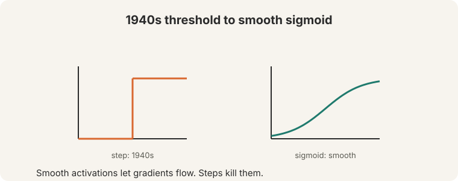
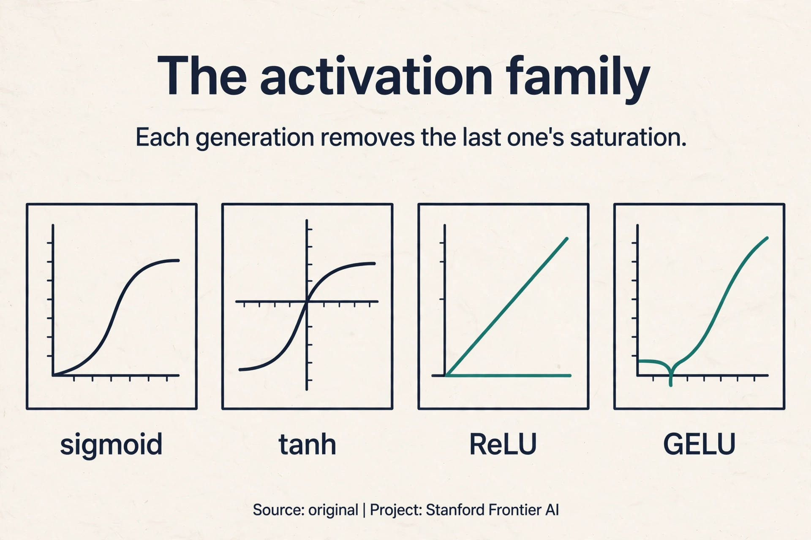
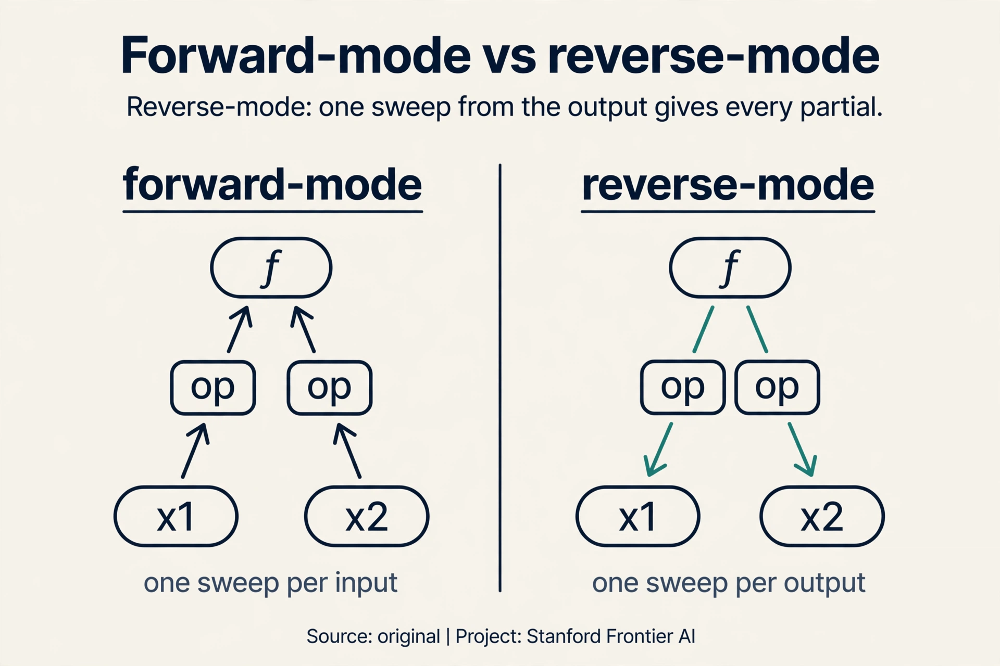
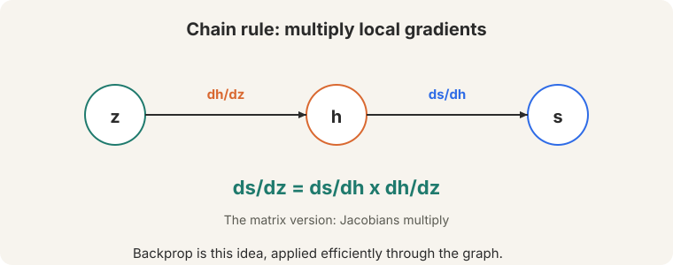
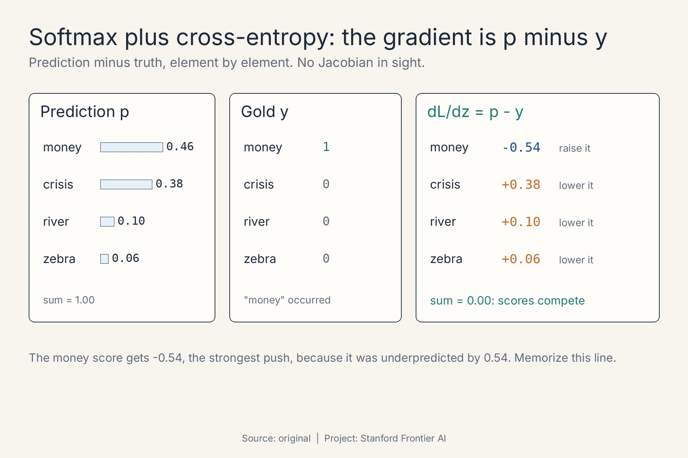
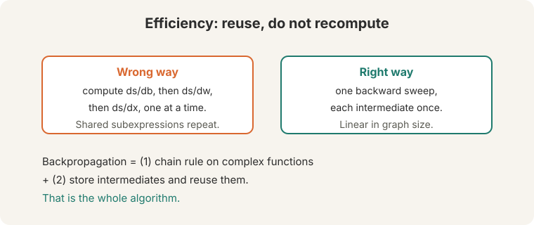
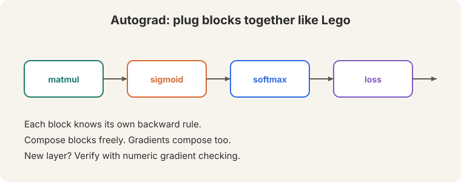

## The problem: 4,008 directions

Lecture 2 built a neural classifier with 4,008 weights. SGD needs the
gradient of the loss with respect to every one of them: which direction
should each weight move to reduce the error? A modern network has billions
of weights. The question of this lecture is brutally practical: how do you
compute billions of gradients before the semester ends?

**On this page:** [ReLU](#subchapter-relu-the-unsaturated-workhorse) · [GELU](#subchapter-gelu-smoothness-for-transformers) · [The Jacobian that simplifies itself](#subchapter-the-jacobian-that-simplifies-itself) · [Forward-mode vs reverse-mode](#subchapter-forward-mode-versus-reverse-mode) · [Autodiff in production](#what-is-used-where-autodiff-in-production) · [Watch and go deeper](#watch-and-go-deeper)

## The building block: a layer

A **layer** does two things ([08:24](ts:08:24)).

. Stacking layers composes one function.")

1. An **affine** map: z = Wx + b. Multiply by a weight matrix, add a **bias**
   vector. The bias is a threshold term: it shifts where the activation
   fires.
2. An **activation**: h = sigma(z). A nonlinearity applied element by
   element.

Stack layers: the output of one becomes the input of the next. The whole
network is a single composed function. Watch one tiny layer compute. Input
x = [1, 2], weights W = [[1, 0], [0, 2]], bias b = [0.5, -1]:

```ascii
z = Wx + b = [1*1 + 0*2 + 0.5,  0*1 + 2*2 - 1] = [1.5, 3.0]
h = sigmoid(z) = [1/(1+e^-1.5), 1/(1+e^-3.0)] = [0.82, 0.95]
```

Two operations. The depth comes from composition: dozens of these, chained.

Why must the activation be nonlinear? Because affine maps compose into
affine maps. A stack of linear layers, no matter how deep, is one linear
layer. The nonlinearity is what gives the network its expressive power.
History proves the point. In the 1940s the activation was a hard
**threshold**: fire or not. A step has zero gradient almost everywhere, so
gradient descent cannot learn: there is no slope to follow. The **sigmoid**
smooths the step into an S-curve with a gradient everywhere. Learning needs
differentiable activations.



### Subchapter: ReLU, the unsaturated workhorse

Sigmoid won the 1990s. Then deeper networks exposed its flaw: it
**saturates**. For large |z|, the S-curve flattens and its gradient dies.
Tanh centers the curve at zero, which trains a little better, but it
saturates too. **ReLU** (rectified linear unit) deletes the curve for
positive z: max(0, z). Watch it against sigmoid on z = -2 and z = 3:

```ascii
z = -2:  sigmoid 0.12, gradient ~0.10     ReLU 0, gradient 0
z =  3:  sigmoid 0.95, gradient ~0.05     ReLU 3, gradient 1
```

At z = 3 the sigmoid's gradient has decayed to 0.05 while ReLU's is
exactly 1, forever, for every positive z. Deep stacks multiply many
gradients: ReLU keeps them alive where sigmoid kills them. It is also one
comparison instead of an exponential: cheaper. The price is **dead
neurons**: a unit stuck at z < 0 gets zero gradient and never recovers.
Sigmoid survives at the output layer, where probabilities are the job.
Everywhere hidden, ReLU took over.

### Subchapter: GELU, smoothness for transformers

ReLU has a kink at zero and kills negatives dead. **GELU** (Gaussian error
linear unit) smooths both problems away: GELU(z) = z times the probability
a standard normal is below z. Watch it on the same toys:

```ascii
z = -2:  ReLU 0        GELU -0.05   (small negative, not dead)
z =  3:  ReLU 3        GELU 2.99    (unsaturated, like ReLU)
```

For large z, GELU behaves like ReLU: no saturation, gradient near 1. Near
zero it curves smoothly instead of kinking, and small negatives pass a
small gradient instead of dying. BERT and GPT use GELU. The pattern across
three generations: keep the old strength (unsaturated positives), remove
the old weakness (saturation, then the kink and the dead zone). Depth
demanded activations whose gradients survive.



### Subchapter: forward-mode versus reverse-mode

Backprop is one of two ways to differentiate a program. Consider
f(x1, x2) = x1 * x2 + sin(x1), at x1 = 2, x2 = 3. Two modes:

**Forward-mode** pushes derivatives forward alongside values. Seed one
input's derivative at 1 and the other's at 0, then run the program once
per input. Two inputs means two forward runs to get both partials.

**Reverse-mode** runs the values forward once, then sweeps derivatives
backward from the single output. One backward sweep yields *every* input's
partial at once. Watch the sweep on the toy. Forward: a = x1*x2 = 6,
b = sin(x1) = 0.91, f = 6.91. Backward: df/df = 1, df/da = 1, df/db = 1,
df/dx2 = df/da * x1 = 2, df/dx1 = df/da * x2 + df/db * cos(x1) = 3 - 0.42
= 2.58. One sweep, both partials.

The rule: forward-mode costs one sweep per input, reverse-mode costs one
sweep per output. Neural networks have millions of inputs (weights) and
one output (the loss). Reverse-mode wins by a factor of millions. That is
why backprop is reverse-mode automatic differentiation.



> [!QA]
> Q: Why must the activation be nonlinear?
> A: Affine maps compose into affine maps. A stack of linear layers is one linear layer, no matter how deep. The nonlinearity is what gives the network its expressive power.
> Follow-up: Why did the field move from step to sigmoid?
> A: Steps have zero gradient almost everywhere, so gradient descent cannot learn. The sigmoid is smooth and differentiable. Its gradient tells the optimizer which direction to move.

## First attempt: finite differences

The most obvious way to get a gradient: wiggle each weight a little and
watch the loss. The **finite difference** estimate:

```ascii
dL/dw ≈ (L(w + e) - L(w - e)) / 2e
```

Watch it on a toy. L(w) = w^2, w = 3, e = 0.001:

```ascii
(L(3.001) - L(2.999)) / 0.002 = (9.006001 - 8.994001) / 0.002 = 6.0
```

The true derivative is 2w = 6. The estimate works. Now count the cost.
Each weight needs two forward passes (w+e and w-e). Lecture 2's tiny
classifier has 4,008 weights: one gradient step costs 8,016 forward passes.
A modern network with a billion weights needs two billion forward passes
per step. Finite differences are correct and completely unusable at scale.

## The key question

Can we compute every gradient in a single pass, by sharing the work
between weights instead of repeating it for each one?

## The chain rule: sharing the work

Neural networks are composed functions: s = f(h), h = g(z). To train, we
need ds/dz. The **chain rule** multiplies the local gradients
([33:15](ts:33:15)):



ds/dz = ds/dh x dh/dz

Watch it on a toy, by hand. X = 2, and the network is z = 3x + 1, h = z^2,
s = h:

```ascii
forward:   z = 3*2 + 1 = 7        h = 7^2 = 49        s = 49
local:     ds/dh = 1              dh/dz = 2z = 14     dz/dw = x = 2
chain:     ds/dw = 1 * 14 * 2 = 28
check:     w = 3.001 -> z = 7.002 -> h = 49.028004
           (49.028004 - 49) / 0.001 = 28.0  ✓
```

The chain rule agrees with finite differences. The difference is that the
chain rule reuses: ds/dh and dh/dz were computed once, and every weight's
gradient multiplies through the same local pieces.

For vector functions, each local gradient is a **Jacobian** matrix: the
matrix of all partial derivatives ([24:07](ts:24:07)). If h is a vector of
length m and z a vector of length n, the Jacobian dh/dz is the m-by-n matrix
whose (i,j) entry is dh_i/dz_j. The matrix version of the chain rule
multiplies Jacobians. Same idea, more bookkeeping.

### Subchapter: the Jacobian that simplifies itself

One Jacobian appears in almost every classifier in this course: softmax
followed by cross-entropy loss. The full Jacobian of the softmax is a
dense matrix, and multiplying it out is tedious. But the composition
collapses. If p is the softmax output and y is the one-hot gold label,
the gradient of the loss with respect to the pre-softmax scores z is:

```ascii
dL/dz = p - y
```

Prediction minus truth, element by element. No Jacobian in sight. Watch it
on Lecture 1's softmax toy. The model predicted
p = [0.46, 0.38, 0.10, 0.06] for [money, crisis, river, zebra]. The true
context word was "money", so y = [1, 0, 0, 0]:

```ascii
dL/dz = [0.46 - 1, 0.38 - 0, 0.10 - 0, 0.06 - 0]
      = [-0.54, 0.38, 0.10, 0.06]
```

Read the signs. The money score gets a negative gradient: raise it. Every
other score gets a positive gradient: lower them. The magnitudes are the
errors themselves: money was underpredicted by 0.54, so it gets the
strongest push. The four numbers sum to 0.00, as they must: the scores
compete, so raising one means lowering the rest. This is the same
expectation-minus-observation shape as Lecture 1's skip-gram gradient.
Memorize this one line. You will differentiate it a hundred times in this
course, and it is always p minus y.



## Forward applies, backward reuses

"Forward pass is just function application. Backward pass is the chain rule
applied efficiently" ([71:30](ts:71:30)).


Going down: apply each function, compute each value, and **store every
intermediate**. In the toy above, the forward pass stores z = 7 and h = 49.
Coming back up: multiply local Jacobians, reusing the stored values.
dh/dz = 2z needs z = 7, which is sitting in storage. Nothing is
recomputed. The stored values make the backward pass cheap.

## The two facts of backpropagation

**Backpropagation** rests on two facts:

1. The chain rule works on arbitrarily complex functions.
2. Store intermediates and reuse them. Never recompute.

The second fact is where the efficiency lives. The wrong way: compute
ds/db, ds/dw, ds/dx one at a time, redoing the shared subexpressions each
time ([58:29](ts:58:29)). Count the waste on a 10-layer network where each
layer costs 1 unit of work. Computing each layer's gradient separately
re-does the shared forward work: the total is 10 + 9 + ... + 1 = 55 units,
and it grows quadratically with depth. The right way: one backward sweep,
each intermediate computed once: 10 units, linear in depth.



One forward pass plus one backward pass yields every gradient in the
network. Finite differences needed 8,016 forward passes for the tiny
classifier. Backprop needs 2 passes total, and the ratio only gets better
as networks grow. That is why training billion-parameter networks is
possible at all.

> [!QA]
> Q: What is backpropagation, in one sentence?
> A: The chain rule applied efficiently: one backward sweep that reuses every stored intermediate.
> Follow-up: Why does the wrong way cost so much?
> A: Gradients share subexpressions. Computing each gradient independently repeats the shared parts, and the repeats grow with network depth: quadratic work. Reuse turns it into one linear sweep.

## Autograd as Lego

Nobody hand-derives these Jacobians anymore. Modern frameworks implement
backprop once. Each operation (matmul, sigmoid, softmax, loss) knows its own
backward rule. Compose them like pieces of Lego and the gradients compose
too ([72:06](ts:72:06)).



When you write a **new layer**, verify it with **gradient checking**
([68:40](ts:68:40)): compare the analytic gradient against a numeric finite
difference. Finite differences need no calculus, so they are an independent
witness. If they disagree, the backward rule is wrong. Check once, at small
scale, then trust the fast analytic path.

> [!QA]
> Q: When do you need gradient checking?
> A: Only when you implement a new operation by hand. Standard layers in PyTorch are already verified. Custom layers need one check against numeric gradients before training.
> Follow-up: Why are numeric gradients the ground truth if they are so slow?
> A: Because they need no calculus: (f(x+e) - f(x-e)) / 2e works for any function. They are slow but independent of your derivation. Agreement means your math is right. Use them once, at small scale.

## What is used where: autodiff in production

Reverse-mode differentiation runs every deep learning framework. The
differences are in how the graph is built:

- **PyTorch.** Dynamic graphs, defined by running the code. Reverse-mode
  autograd records operations on a tape as they execute. Dominates
  research. Public.
- **JAX.** Function transforms: grad(f) returns the gradient function,
  jit compiles it, vmap vectorizes it. Google and DeepMind train large
  models on it. Public.
- **TensorFlow.** Static graphs compiled with XLA. Still runs much of
  industry production from the 2010s. Public.
- **The constant.** All three implement this lecture's two facts: the
  chain rule on arbitrary compositions, intermediates stored and reused.
  The frameworks differ in plumbing, not in mathematics.

> [!QA]
> Q: Walk me through backprop on a two-layer network, by hand.
> A: Network: z1 = W1 x + b1, h = ReLU(z1), z2 = W2 h + b2, loss L = (z2 - y)^2. Forward: compute and store x, z1, h, z2. Backward: dL/dz2 = 2(z2 - y). dL/dW2 = dL/dz2 x h. dL/dh = W2^T x dL/dz2. dL/dz1 = dL/dh where z1 > 0, else 0 (ReLU gate). dL/dW1 = dL/dz1 x x. Every step reuses a stored forward value. One sweep, all four parameter gradients.
> Follow-up: Where does the ReLU gate appear in the chain?
> A: In dL/dz1. The local derivative of ReLU is 1 for z1 > 0 and 0 otherwise. The backward signal passes through unchanged or dies completely. That is the dead-neuron problem, visible in one line of the chain.

> [!QA]
> Q: You are implementing a custom sparse attention layer in PyTorch. How do you verify the backward pass?
> A: Gradient checking, once, at small scale. Build a tiny input (say 4 tokens, dimension 8). Compute analytic gradients via your backward. Compute numeric gradients via (f(x+e) - f(x-e)) / 2e with e = 1e-5. Compare with relative error: |analytic - numeric| / (|analytic| + |numeric|). Below 1e-5, ship it. Above, your backward rule is wrong. Never gradient-check the full model: too slow and pointless, since only your new op is unverified.
> Follow-up: What is the most common gradient bug in custom layers?
> A: Forgetting a term in the chain. The forward has three ops but the backward only chains two. The numeric check catches it instantly because finite differences differentiate the actual forward code, not your derivation.

> [!QA]
> Q: When would you use forward-mode differentiation instead of reverse-mode?
> A: When outputs outnumber inputs. Reverse-mode costs one sweep per output, forward-mode one per input. A physics simulator with 3 inputs and 10,000 outputs wants forward-mode. A neural network with 10 million weights and 1 loss wants reverse-mode. Count inputs versus outputs, then pick the cheaper mode.
> Follow-up: Do frameworks let you choose?
> A: JAX does: jacfwd for forward-mode, jacrev for reverse-mode. PyTorch defaults to reverse-mode autograd. The choice is exposed where it matters and hidden where it does not.

> [!QA]
> Q: Why did ReLU replace sigmoid in hidden layers?
> A: Saturation. Sigmoid's gradient dies for large |z|, and deep stacks multiply many dying gradients: the vanishing problem from this lecture's honest price. ReLU's gradient is exactly 1 for all positive z, so deep stacks stay trainable. It is also one comparison versus an exponential: cheaper. The cost is dead neurons, which later activations (GELU, Swish) smooth away.
> Follow-up: Then why does the output layer still use sigmoid or softmax?
> A: Different job. Hidden layers need trainable nonlinearities. Output layers need probabilities: numbers in [0,1] that sum to 1. Sigmoid and softmax are probability machines, not just nonlinearities. Keep each where its job lives.

## Mapping back: what backprop answers

| Naive approach | Backprop answer | How |
|---|---|---|
| Finite differences: 2 passes per weight | One backward sweep for all weights | The chain rule shares local gradients across every parameter |
| Recomputing shared subexpressions: quadratic in depth | Store intermediates, reuse them | Each value computed once. 55 units becomes 10 for 10 layers |
| Hand-derived gradients for every new layer | Autograd Lego blocks | Each op carries its own backward rule. Compose freely |

## The honest price

Two bills. First, memory: the backward pass needs every intermediate, so
the forward pass must store them all. Deep networks on long sequences store
a lot. Memory, not arithmetic, is often the training bottleneck.

Second, the chain rule multiplies. A gradient that travels back through 50
layers is a product of 50 local gradients. If each is 0.9, the product is
0.9^50 = 0.005: the signal dies. If each is 1.1, it is 1.1^50 = 117: the
signal explodes. This is the **vanishing and exploding gradient** problem,
and it is the reason Lecture 5's RNNs struggle with long sentences.

## Recap: the whole lesson on one screen

1. **The problem.** SGD needs every gradient. The tiny classifier has 4,008
   weights. Finite differences need 8,016 forward passes per step.
2. **A layer.** z = Wx + b, then h = sigma(z). Affine, then nonlinear.
   Stacked layers compose one function.
3. **Smooth activations.** The 1940s step has zero gradient. Nothing learns.
   The sigmoid smooths it so gradients flow.
4. **The chain rule.** ds/dz = ds/dh x dh/dz. The toy: z = 7, h = 49,
   ds/dw = 28, verified by finite differences. Jacobians are the matrix
   version.
5. **Forward applies, backward reuses.** Store every intermediate on the way
   down. Multiply local Jacobians on the way up. Never recompute.
6. **The two facts.** The chain rule works on anything. Reuse turns
   quadratic work (55 units for 10 layers) into linear (10 units).
7. **Autograd is Lego.** Each op knows its backward rule. New layer:
   verify once with gradient checking.
8. **The price.** All intermediates must be stored. And the chain rule
   multiplies: 0.9^50 = 0.005 vanishes, 1.1^50 = 117 explodes. The next
   lectures cure this disease.

## Watch and go deeper

<div style="max-width:640px;margin:1.5rem 0">
<div style="position:relative;padding-bottom:56.25%;height:0;overflow:hidden;border-radius:8px;background:#000">
<iframe src="https://www.youtube-nocookie.com/embed/HnliVHU2g9U" title="CS224N Spring 2024 Lecture 3: Neural net learning: Gradients by hand" style="position:absolute;top:0;left:0;width:100%;height:100%;border:0" loading="lazy" allowfullscreen></iframe>
</div>
<p><strong>Lecture 3: Neural net learning</strong> (Christopher Manning, Spring 2024). The original lecture: layers, the chain rule, Jacobians, backpropagation. If the embed does not load, watch the lecture directly on YouTube: https://www.youtube.com/watch?v=HnliVHU2g9U</p>

<div style="max-width:640px;margin:1.5rem 0">
<div style="position:relative;padding-bottom:56.25%;height:0;overflow:hidden;border-radius:8px;background:#000">
<iframe src="https://www.youtube-nocookie.com/embed/Ilg3gGewQ5U" title="What is backpropagation really doing?" style="position:absolute;top:0;left:0;width:100%;height:100%;border:0" loading="lazy" allowfullscreen></iframe>
</div>
<p><strong>Backpropagation, intuitively</strong> (3Blue1Brown). The chain rule as credit assignment, animated.</p>
</div>
</div>

### Go deeper

- [Learning representations by back-propagating errors](https://www.nature.com/articles/323533a0) (Rumelhart, Hinton, Williams, 1986). The original backprop paper.
- [Neural Networks: Zero to Hero](https://karpathy.ai/zero-to-hero.html) (Andrej Karpathy). Build micrograd and backprop from zero, in code.
- [Stanford CS224N course site](https://web.stanford.edu/class/cs224n/). Slides, assignments, syllabus.

## Official sources and further reading

**Official:**
- Lecture 3 video and transcript.

**Further reading:**
- Rumelhart, Hinton, Williams (1986), "Learning representations by
  back-propagating errors": the original backprop paper. Historical
  context. The lecture's two-fact framing is clearer.
- PyTorch autograd documentation: how modern frameworks implement the
  backward sweep.

**Caveats from these sources.** Gradient checking is for custom layers
only. Checking built-in layers wastes time. The finite-difference toy and
the 10-layer cost arithmetic above are original teaching toys.

## Connections to the other courses

- **This course:** L02's NER classifier trains with backprop. L04's parser
  and L05's RNNs are deeper graphs through the same algorithm. L06 names
  the vanishing-gradient disease.
- **CS229:** the chain rule and Jacobians appear in the ML setting.
  optimization theory is shared.
- **CS336:** GPUs exist because the backward sweep is matrix
  multiplication at scale.
